> 原文：[A harness for every task: dynamic workflows in Claude Code](https://x.com/trq212/status/2061907337154367865)
> 作者：Thariq Shihipar ([@trq212](https://x.com/trq212))

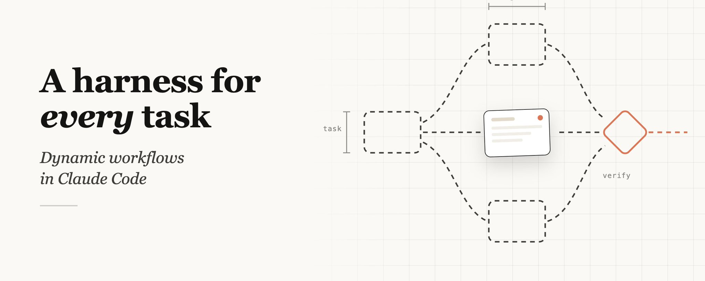

上周，我们在 Claude Code 中发布了[动态工作流](https://code.claude.com/docs/en/workflows)。Claude 现在可以即时编写自己的 [harness](https://code.claude.com/docs/en/glossary#agentic-harness)，为手头的任务量身定制。

虽然默认的 Claude Code harness 是为编程构建的，但它对许多其他类型的任务也很有用——因为事实证明，很多任务都与编程任务类似。但对于某些特定类型的任务，我们不得不在 Claude Code 之上构建自定义 harness 以实现最佳性能，例如[深度研究](https://support.claude.com/en/articles/11088861-using-research-on-claude)、[安全分析](https://support.claude.com/en/articles/11932705-automated-security-reviews-in-claude-code)、[智能体团队](https://code.claude.com/docs/en/agent-teams)或[代码审查](https://code.claude.com/docs/en/code-review)。

工作流允许你动态创建 harness，使 Claude 能够在 Claude Code 内部原生解决所有这些问题以及更多。你还可以与他人共享和复用这些工作流。

在本文中，我将分享我最初的工作流使用经验和心得，帮助你充分利用这一功能。

不过，最佳实践仍在发展中！动态工作流通常会消耗更多 token，因此请仔细考虑何时以及如何使用它们。

**注意**：本文也发布在 [Claude 博客](https://claude.com/blog/a-harness-for-every-task-dynamic-workflows-in-claude-code)上。

## 示例提示词

在深入技术细节之前，我想先展示一些示例提示词，让你了解工作流的可能性：

- "这个测试大约每 50 次运行会失败 1 次。设置一个工作流来复现它，形成理论并在 worktree 中对抗性测试，/goal 不要停止直到有一个理论成功。"
- "使用工作流，浏览我最近的 50 个会话，挖掘我反复做出的修正，将重复出现的转换为 CLAUDE.md 规则"
- "使用工作流，挖掘过去六个月 Slack 中的 #incidents，找出没有人提交工单的重复根因。"
- "拿着我的商业计划，运行一个工作流，让不同的智能体从投资者、客户和竞争对手的角度来拆解它。"
- "这是一个包含 80 份简历的文件夹，使用工作流为后端岗位排名，并对前 10 名进行复查。使用 AskUserQuestion 工具面试我来确定评分标准。"
- "我需要为这个 CLI 工具起个名字。使用工作流头脑风暴一堆选项，然后运行锦标赛选出前 3 名。"
- "使用工作流，将我们的 User 模型重命名为 Account。"
- "浏览我的博客文章草稿，使用工作流对照代码库验证每一项技术声明，我不想发布任何错误的内容。"

## 动态工作流的工作原理

动态工作流执行一个 JavaScript 文件，其中包含几个特殊函数，用于生成和协调[子智能体](https://code.claude.com/docs/en/sub-agents)：

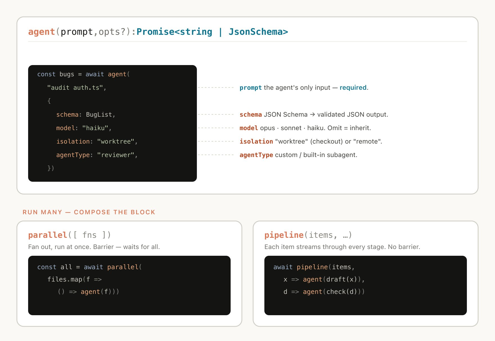

动态工作流还包含标准 JavaScript 函数，如 JSON、Math 和 Array，用于处理数据。

特别有用的一点是，动态工作流可以决定智能体使用哪个模型，以及子智能体是否在自己的 worktree 中运行，允许 Claude 选择所需的智能水平和隔离程度。

如果工作流被中断（例如用户操作或退出终端），恢复会话后工作流将从中断处继续。

## 为什么需要动态工作流

当你要求默认的 Claude Code harness 执行任务时，它需要在同一个上下文窗口中同时进行规划和执行。对于许多编程任务，这种方式非常有效，但在长时间运行、大规模并行和/或高度结构化的对抗性任务中，有时会失效。

这是因为 Claude 在单个上下文窗口中处理复杂任务的时间越长，就越容易受到几种特定失败模式的影响：

- **智能体懒惰（Agentic laziness）**：指 Claude 在完成特别复杂的多部分任务之前就停止，并在取得部分进展后宣布任务完成，例如在安全审查中只处理了 50 个项目中的 20 个。
- **自我偏好偏差（Self-preferential bias）**：指 Claude 倾向于偏好自己的结果或发现，特别是当被要求对照评分标准进行验证或判断时。
- **目标漂移（Goal drift）**：指在多轮对话中逐渐偏离原始目标，尤其是在压缩上下文之后。每次摘要步骤都会丢失信息，边缘情况需求或"不要做 X"等约束条件可能会丢失。

创建工作流有助于通过编排具有独立上下文窗口和专注、隔离目标的独立 Claude 来应对这些问题。

## 动态 vs 静态工作流

你可能之前使用过 Claude Agent SDK 或 `claude -p` 创建静态工作流来协调多个 Claude Code 实例。

但由于静态工作流需要适用于所有边缘情况，它们通常更加通用。借助 [Claude Opus 4.8](https://www.anthropic.com/news/claude-opus-4-8) 和动态工作流，Claude 现在已经足够智能，可以编写针对你的用例量身定制的 harness。

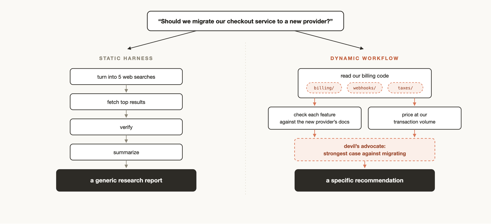

## 使用动态工作流的实用模式

你可以直接要求 Claude 创建一个工作流，或者使用触发词"ultracode"来确保 Claude Code 创建工作流。

但建立对动态工作流工作原理的心智模型将帮助你理解何时使用它们，以及如何通过提示词引导 Claude。

Claude 在构建工作流时可能会使用和组合几种常见模式：

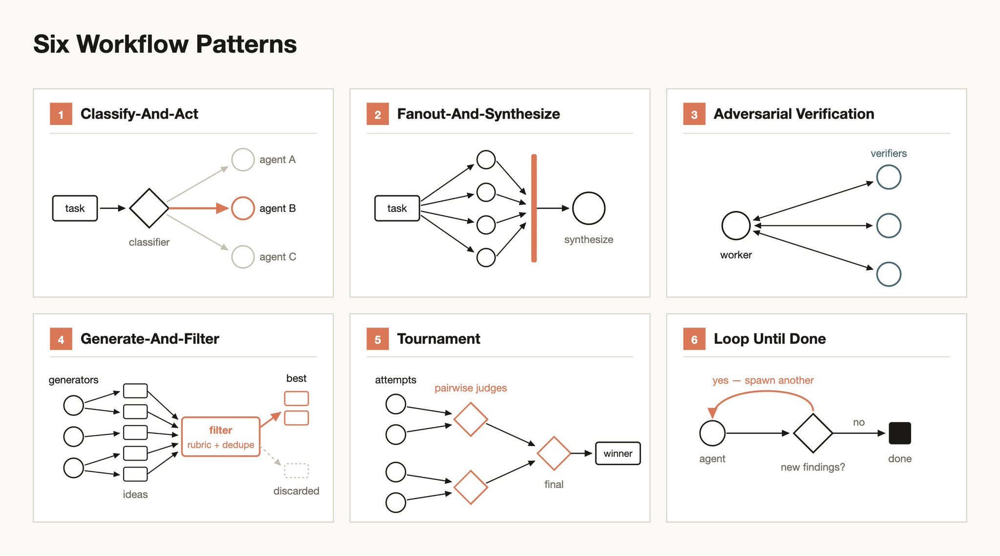

**分类并执行（Classify-and-act）**

使用分类器智能体决定任务类型，然后根据任务路由到不同的智能体或行为。或者在最后使用分类器来决定输出。

**扇出并综合（Fan-out-and-synthesize）**

将任务拆分为许多更小的步骤，对每个步骤运行一个智能体，然后综合这些结果。这对于有大量较小步骤的情况特别有用，或者当每个步骤受益于自己的干净上下文窗口以避免干扰或交叉污染时。综合步骤是一个屏障——它等待所有扇出智能体完成，然后将它们的结构化输出合并为一个结果。

**对抗性验证（Adversarial verification）**

对于每个生成的智能体，运行一个单独的智能体根据评分标准或标准对其输出进行对抗性验证。

**生成并过滤（Generate-and-filter）**

就某个主题生成大量想法，然后通过评分标准或验证进行过滤，去除重复项，只返回最高质量、经过测试的想法。

**锦标赛（Tournament）**

不是分配工作，而是让智能体竞争。生成 N 个智能体，每个使用不同的方法尝试相同的任务。然后使用评判智能体以配对方式判断结果，直到产生获胜者。

**循环直到完成（Loop until done）**

对于工作量未知的任务，循环生成智能体直到满足停止条件（没有新发现，或日志中没有更多错误），而不是固定次数的遍历。

## 使用场景

创造性地思考何时以及如何要求 Claude Code 创建动态工作流。我发现工作流有时对非技术工作甚至更有用。

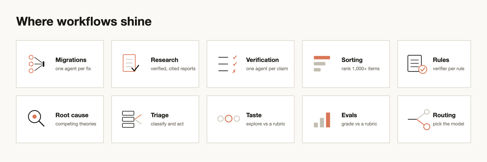

### 迁移和重构

[Bun](https://bun.com/) 使用工作流从 Zig 重写为 Rust。你可以在 [Jarred 的 X 帖子](https://x.com/jarredsumner/status/2060050578026189172)中了解更多。

关键是将任务分解为一系列需要操作的步骤，例如调用点、失败的测试、模块等。为每个修复在 worktree 中启动一个子智能体来完成修复，然后让另一个智能体进行对抗性审查，最后合并它们。考虑告诉智能体不要使用资源密集型命令，以便你可以最大程度地并行化而不会耗尽机器资源。

### 深度研究

我们在 Claude Code 中发布了一个使用动态工作的深度研究技能（/deep-research）。具体来说，它扇出网络搜索、获取来源、对抗性验证其声明，并综合出一份带引用的报告。

但你可能不仅仅为网络搜索做这种研究。例如，要求 Claude 从 Slack 中的上下文编制状态报告，或通过深入探索代码库来研究某个功能的工作原理。

### 深度验证

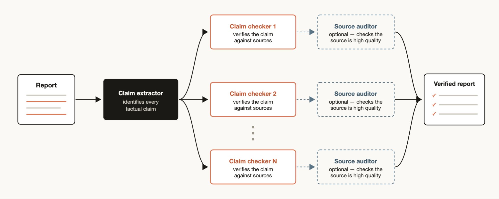

另一方面，如果你有一份报告，想要检查和溯源其中引用的每一项事实声明，你可能想要生成一个工作流：让一个智能体识别所有事实声明，然后为每个声明启动一个子智能体进行详细检查。你还可以让验证智能体检查来源子智能体，确保其来源是高质量的。

### 排序

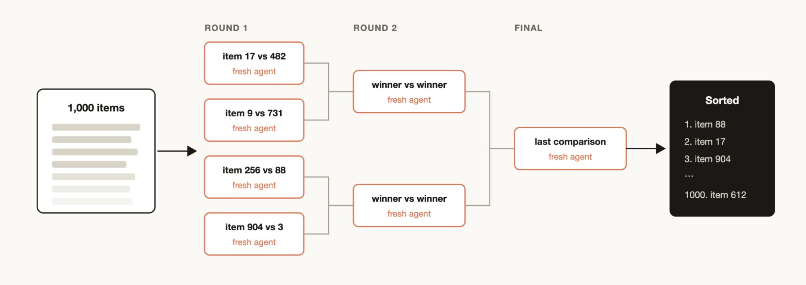

你可能有一个项目列表，想要按某种你认为 Claude Code 擅长评估的定性标准进行排序，例如：按 bug 严重程度排列的支持工单。但如果你尝试在一个提示中排序 1000 多行，质量会下降且无法放入上下文。相反，运行锦标赛、配对比较智能体的流水线（比较判断比绝对评分更可靠），或并行桶排序然后合并。每个比较都是自己的智能体，因此确定性循环持有赛程表，只有运行顺序保留在上下文中。

### 记忆和规则遵守

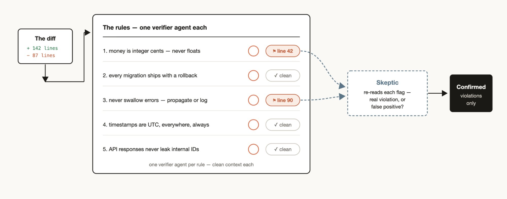

如果你有一套特定的规则，发现 Claude 经常遗漏或难以遵守，即使放入了 CLAUDE.md 中，可以创建一个工作流，其中包含必须由验证智能体检查的规则列表——每个规则一个验证智能体。创建一个怀疑者人格子智能体来审查规则以确保它们符合要求，有助于避免过多的误报。

反向操作也有效：挖掘你最近的会话和代码审查评论中反复做出的修正，使用并行智能体进行聚类，对抗性验证每个候选（这个规则是否能防止真正的错误？），然后将幸存者提炼回 CLAUDE.md。

### 根因调查

调试在你提出几个独立假设并测试它们时效果最好，但如果你只使用一个上下文窗口，Claude 可能会遇到自我偏好偏差。工作流可以通过启动智能体从不相交的证据生成假设来从结构上防止这一点。例如，分别为日志、文件和数据设置独立智能体。每个假设然后面对一组验证者和反驳者。

这不仅仅适用于代码。工作流可用于销售（为什么三月份销售额下降？）、数据工程（为什么这个管道失败？）或任何事后分析工作。

### 大规模分类

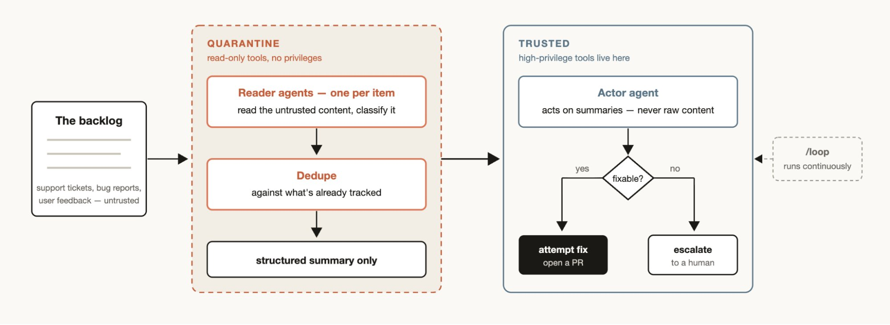

每个团队都有支持队列、bug 报告或其他无法由人类完全处理的积压工作。

分类工作流对每个项目进行分类，与已跟踪的内容进行去重，并采取行动。这可能意味着尝试修复或升级给人类用户。

分类工作流的一个有用模式是隔离（quarantine）。这涉及禁止读取不受信任的公共内容的智能体执行高权限操作，这些操作由负责根据信息采取行动的智能体完成。

将分类工作流与 /loop 配对，让 Claude 持续执行此操作。

### 探索与品味

工作流在探索不同解决方案时很有用，特别是当它基于品味（如设计或命名），并且会受益于评分标准时。

尝试要求 Claude 探索一堆解决方案，并给审查智能体一个好解决方案的评分标准。当审查智能体觉得已满足标准时，任务完成。解决方案也可以根据评分标准通过锦标赛进行排序或选择。

### 评估（Evals）

你可以通过在 worktree 中启动独立智能体，然后启动比较智能体来比较和评分特定输出与评分标准的匹配程度，从而为特定任务运行轻量级评估。例如，根据特定标准评估并优化你创建的技能。

### 模型和智能路由

创建一个针对你的任务调优的分类器智能体来决定使用哪个模型。当你的任务涉及多次工具调用时，这会很有帮助，在执行前进行研究可以识别出最适合该任务的模型。

例如，任务"解释 auth 模块如何工作"的最佳模型取决于 auth 模块中有多少文件以及代码库的形状。分类器智能体可以进行此研究，然后根据任务的预期复杂度路由到 Sonnet 或 Opus。

## 何时不使用动态工作流

工作流是新功能。虽然有许多用例会产生巨大效果，但并非每个任务都需要它们，而且可能会消耗显著更多的 token。

最好创造性地使用工作流，以你之前未曾尝试的方式推动 Claude Code。对于常规编程任务，试着问自己：它真的需要更多计算吗？例如，大多数传统编程任务不需要 5 个审查员的评审团。

## 构建动态工作流的技巧

**提示词**

详细的提示词，使用我们上面描述的具体技术，可以为动态工作流创造最佳结果。

工作流不仅适用于大型任务。你可以提示模型使用"快速工作流"。例如，你可以创建一个对假设的快速对抗性审查。

**与 /goal 和 /loop 结合使用**

当使用可重复的工作流时（例如分类、研究或验证），将它们与 /loop 配对以定期运行，与 /goal 配对以设置硬性完成要求。

**Token 使用预算**

你可以为动态工作流设置明确的 token 使用预算来限制任务使用的 token 数量。你可以用预算来提示它："使用 10k token"，这将设置上限。

**保存和共享动态工作流**

你可以在工作流菜单中按"s"保存工作流。你可以将它们签入 `~/.claude/workflows` 或通过技能分发。

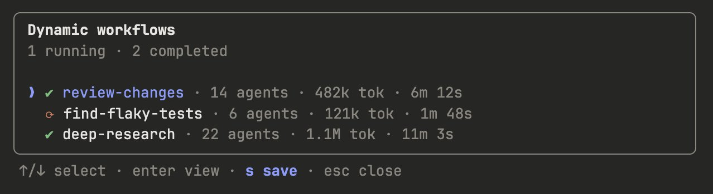

要通过技能共享它们，请将你的 JavaScript 工作流文件放在技能文件夹中，并在 SKILL.MD 中引用它们。为了更大的灵活性，你可能希望提示 Claude 将技能中的工作流视为模板，而不是需要逐字运行的脚本。

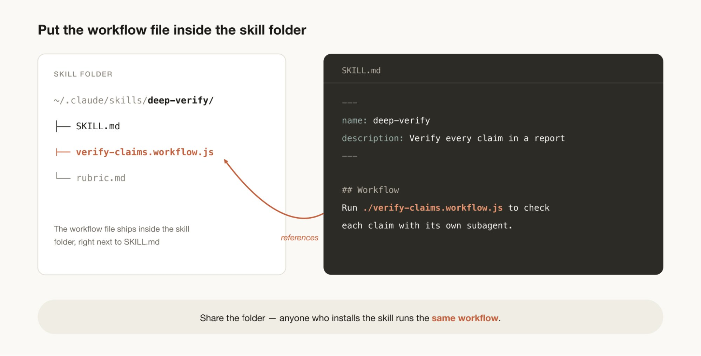

## 一个全新的世界

工作流是扩展 Claude Code 的一种有用新方式。我鼓励你将此视为起点，在如何最好地使用它们方面还有很多值得探索的地方。请告诉我们你的发现。

Thariq Shihipar 和 Sid Bidasaria ([@sidbid](https://x.com/@sidbid)) 是 Anthropic 的技术团队成员，负责 Claude Code 的开发。
