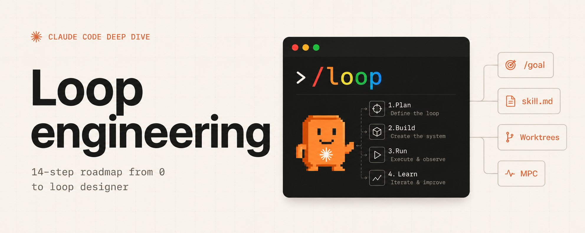
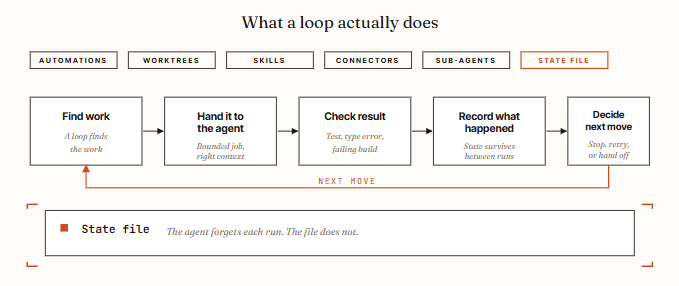
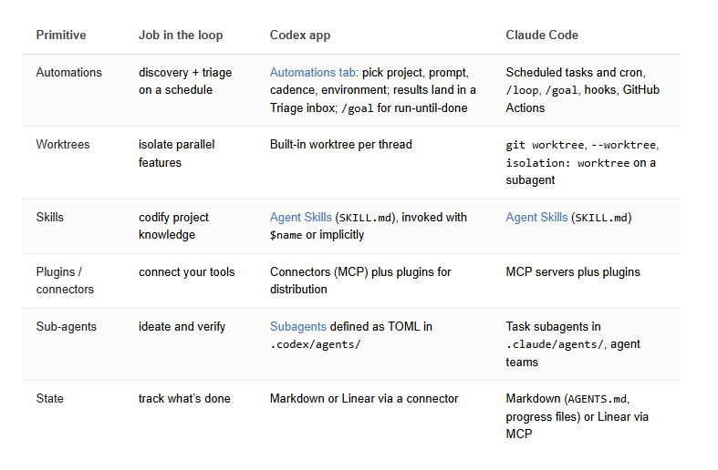
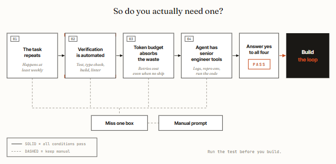
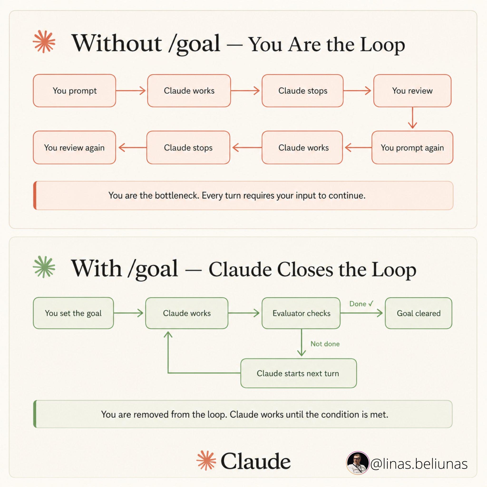
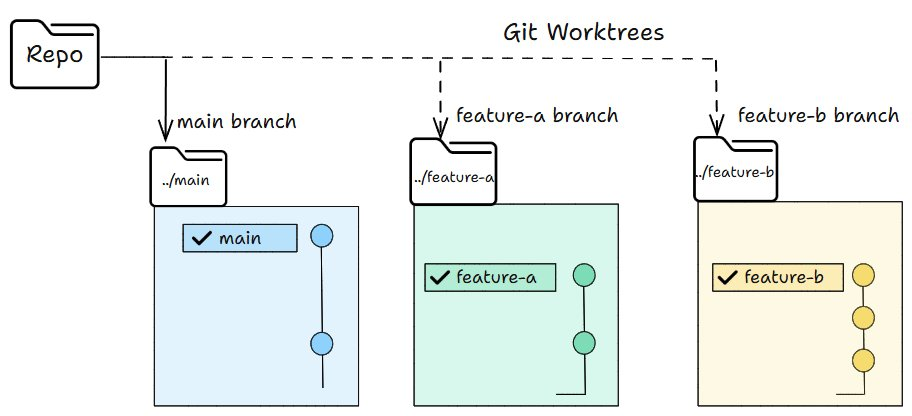
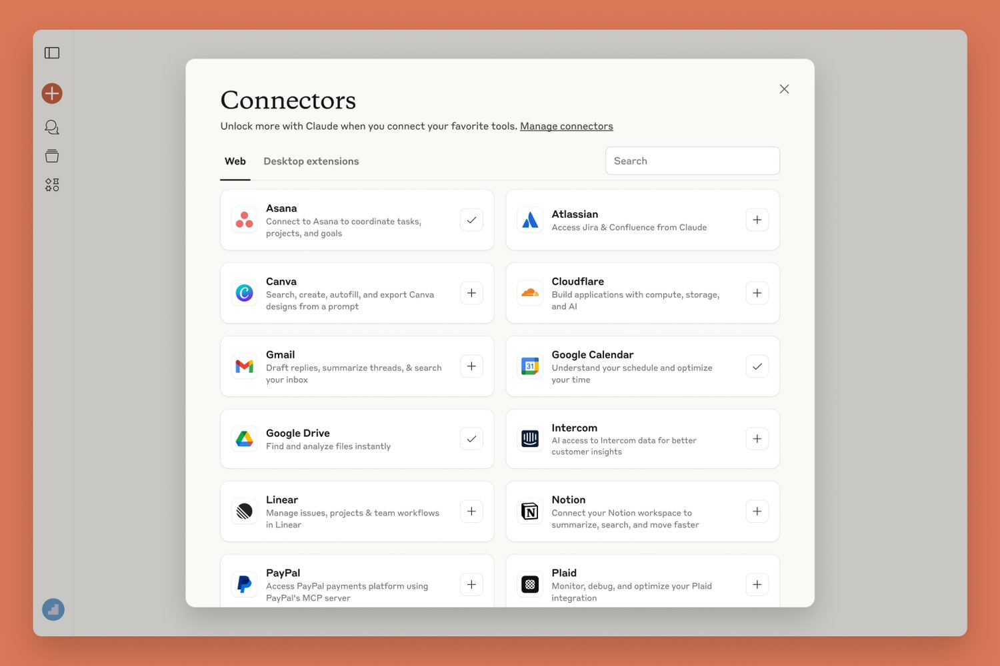
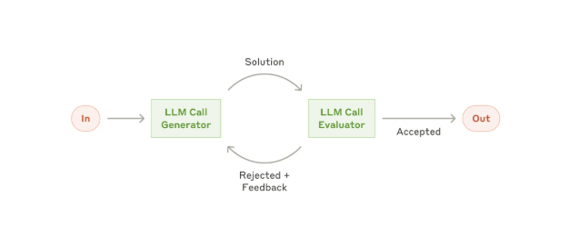
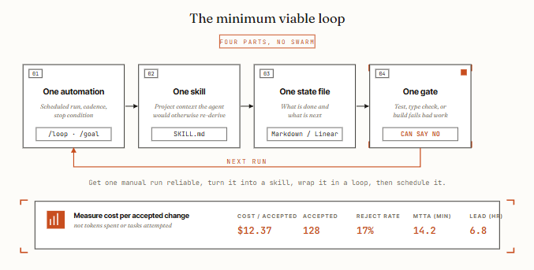
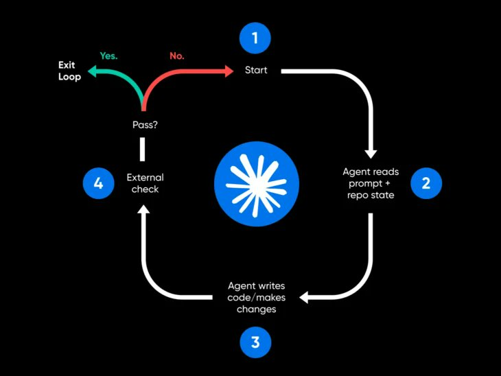

大多数开发者仍然在手动提示他们的编码代理。他们打字、等待、阅读 diff、再打字。**10** 个开发者里有 9 个从未写过一条让代理自动提示的循环。

没有**自动化**，没有**状态文件**，没有**验证器**，没有**调度**。杠杆点已经转移——从编写提示词到设计能自动提示的系统。这是从提示词撰写者到循环设计者的 14 步路线图。

> 关注我的 LinkedIn 获取最新 AI 内幕：[linkedin.com/in/lev-deviatkin](https://linkedin.com/in/lev-deviatkin)

这是完成这一转变的 14 步路线图——内容综合自 Anthropic 的工程文档、Addy Osmani 关于循环工程的长文，以及最近的度量研究。

三个层级：先判断你是不是真的需要循环，再学习五个核心模块，最后构建一个不会伤到你的最小循环。



**14 步。3 个层级。停止提示。开始设计。**

**第一部分 · 为什么做 & 怎么测试**

## 01. 循环工程正在取代你作为提示词撰写者的角色。

过去两年里，你让编码代理产出结果的方式是：写一个提示、分享上下文、阅读返回的内容、再写下一个提示。代理是工具，你全程握着它。**这个阶段正在结束。**

循环工程是构建一个小系统，自动地找到工作、交给代理、检查结果、记录发生了什么、并决定下一步行动。你只需设计一次这个系统。之后系统会自行提示代理。

Addy Osmani 把它拆成六个部分：



Anthropic 的工程师们现在每天合并的代码量是 2024 年的八倍——这个数字连 Anthropic 自己都称之为"几乎可以肯定高估了真实的生产力提升"。

数字有争议。机制没有争议：**杠杆点从写提示词转移到了设计提示循环**。

## 02. 在构建任何东西之前先跑 4 条件测试。

循环在四个条件下能回本。漏掉一个，循环的成本就会超过回报。AlphaSignal 分析的诚实版本，也是大多数 X 帖子里跳过的部分：



四个条件用大白话解释：

- **任务是重复的。** 循环把设置成本分摊到多次运行上。对于一次性任务，一个好提示词更快更便宜。如果工作不是每周重复的，那你有的不是循环——而是跑过一次的脚本。
- **验证是自动化的。** 循环需要某种东西，能在你不在场的情况下让工作失败。一个测试套件、一个类型检查器、一个 linter、一个构建。没有自动检查，你就又坐回椅子前读每个 diff——这正是循环本应消除的工作。
- **你的 token 预算能吸收浪费。** 循环会重读上下文、重试、探索。无论运行是否产出东西，这都在烧 token。这项技术随着预算扩展，所以对于有免费 token 的人来说这显而易见，而对按量计费的人来说则鲁莽。
- **代理拥有高级工程师的工具。** 日志、复现环境、运行自己写的代码并查看出错的能力。没有这些，循环就是在盲目迭代。

## 03. 谁赢谁输。循环偏袒任何能花钱的人。

经济学不是普适的。那些觉得循环工程显而易见的人，通常有不限量的 token。

觉得它很鲁莽的人，通常在用 $20 消费者套餐跑重型验证循环，撞上限或收到意外账单。

实际上谁能受益：

- **拥有重复性、机器可检查的工作和运行预算的团队** —— 持续测试分流、依赖升级、lint-and-fix 通过、问题到 PR 草稿（在有强测试覆盖的代码库上）。
- **拥有强测试套件的代码库。** 如果一个初级工程师能按清单完成任务，并且测试套件能抓到他们的错误，那循环就适合。
- **已经在使用多代理模式的异步优先团队。** 对这些团队来说，Routines 是缺失的编排层。

谁应该今天就跳过：

- **消费者套餐上的独立开发者** —— token 账单比生产力提升来得更早。
- **在没有任何自动验证的代码上工作的任何人。** 没有真实检查的循环，就是代理在跟自己反复确认。
- **真正瓶颈是评审能力而非打字速度的团队。** 循环生成更多代码；如果评审本来就是瓶颈，那循环只是让队列更长。

对于一次性任务、探索性工作，或任何"完成"是判断题的事情，**一个瞄准准确的单条提示词仍然胜出**。这篇文章诚实的版本是：循环工程是真实的，但大多数开发者现在还不需要它。

## 04. 30 秒循环检查。

第 2 步的 4 条件测试是战略决策。这是战术决策——在把特定任务变成循环之前你要跑的清单。

**漏掉一个就老老实实保留手动提示。**

- **1. 任务至少每周发生一次。** 不到每周 → 设置成本永远无法摊销。
- **2. 测试、类型检查、构建或 linter 能拒绝坏输出。** 没有自动闸门 → 代理在给自己批改作业。
- **3. 代理能运行它修改的代码。** 没有复现环境 → 迭代就是盲目的。
- **4. 循环有硬停止。** Token 预算、迭代次数或时间限制。任何一个都没有，循环会跑到有人注意到账单为止。
- **5. 人在合并、部署或依赖变更之前做评审。** 任何不可逆的变更都需要人工审批闸门。


好的第一个循环：

- **CI 失败分流** —— 每晚，扫描失败，归因原因，给简单的失败草拟修复 PR。
- **依赖升级 PR** —— 每周，扫描更新，测试兼容性，打开 PR。
- **Lint-and-fix 通道** —— 每次 PR 打开事件，自动应用样式修复。
- **Flaky 测试复现** —— 循环直到一个理论经受住测试。
- **Issue-to-PR 草稿** —— 在有强测试的代码上，坏输出会被测试套件拒绝。

糟糕的第一个循环 —— 这些需要人坐在椅子上：

- 架构重写
- 认证或支付代码
- 生产部署
- 模糊的产品工作
- 任何"完成"是判断题的事情

**第二部分 · 5 个核心模块**

## 05. 自动化：心跳。

自动化是让循环成为真正的循环、而不是只跑过一次的运行的东西。它们按计划、事件或触发条件启动。它们是心跳 —— 循环里其他一切都要挂在它们上面。

在两个关键工具里的样子：

- **Codex。** Automations 标签页 —— 选一个项目、设置一个提示、设置节奏、选择本地 checkout 或后台 worktree。找到东西的运行进入 Triage 收件箱；没找到东西的运行把自己归档。
- **Claude Code。** 三个可以组成同样形状的原语：用于会话范围内节奏的 /loop、用于重启存活的 Desktop 定时任务、用于笔记本关机云端运行的 Routines。再配上用于生命周期事件的 hooks。

自动化内部两个把工作循环和烧钱循环分开的原语：

- **/loop** 按节奏重新运行。当你想要不论状态如何的常规检查时用。
- **/goal** 一直跑到你写的条件真正成立。一个独立的小模型检查完成度，所以写代码的代理不是给自己打分的那一个。



这是制造者-检查者分离应用在停止条件本身上。

```python
> /loop 30m /goal All tests in test/auth pass and lint is clean.
  Scan src/auth for new failures, propose fixes in claude/auth-fixes,
  open draft PR when goal condition holds.

▲ Claude
  CronCreate(*/30 * * * * : auth quality loop)
  Stop condition: tests pass + lint clean (verified by checker)
✓ Scheduled. Will continue past intermediate completions
  until /goal condition is met by independent checker.
```

## 06. Worktrees：并行而不混乱。

一旦你运行多于一个代理，文件就开始冲突。两个代理写同一个文件，跟两个工程师没沟通就提交同一行一样头痛。

**Git worktree 解决这个问题** —— 一个独立工作目录在它自己的分支上、共享同一个仓库历史，所以一个代理的编辑在物理上无法触碰另一个的 checkout。



GIF

它在两个工具里的样子：

- **Codex** 内置了 worktree 支持 —— 多个线程同时打到同一个仓库而不会撞到彼此。
- **Claude Code** 直接暴露 git worktree，一个 `--worktree` 标志用于在自己的 checkout 中打开会话，以及子代理上的 `isolation: worktree` 设置，让每个辅助者获得一个全新的、运行完会自动清理的 checkout。

**Worktree 拿走了机械冲突，但你仍然是天花板。** 你的评审带宽决定了你实际能跑多少个并行代理 —— 不是工具。

## 07. Skills：把项目知识写一次，每次运行都读。

Skill 是你停止像金鱼一样在每个会话重新解释同样项目上下文的方式。两个工具用同样的格式：一个文件夹里放一个 SKILL.md，装着指令和元数据，加上可选的脚本、引用和资源。

为什么这对循环特别重要：没有 skills 的循环在每个周期都从零重新推导你的整个项目上下文。**有了 skills，意图会累积。**

约定、构建步骤、"我们不这样做是因为那次事件"—— 在外面写一次，每次运行都读。

```python
name: ci-triage
description: Classify CI failures by root cause (env, flake, real bug,
  dependency, infra), draft fixes for the easy ones, escalate the rest.
  Trigger whenever a workflow run fails or on the morning triage loop.
---

# CI triage skill

## Classification rules
- env: missing secret, wrong env var, infra not provisioned. # human
- flake: passes on retry without code change. # retry once, then file
- bug: deterministic failure tied to recent commit. # draft fix
- dependency: failure tied to a version bump. # draft rollback
- infra: timeout, OOM, runner issue. # escalate

## Fix patterns
- Auth tests → check src/auth/middleware first
- Database tests → verify migration applied in CI env
- E2E tests → check selectors against the latest UI snapshot

## Never do
- Disable failing tests — always file as escalation instead
- Modify CI config without human approval
- Touch src/payments/ or src/billing/ (in claude/permissions.md)

## State
Update STATE.md after each run: file paths checked, classifications,
PRs opened, items escalated.
```

## 08. Connectors：循环通过 MCP 触碰你的真实工具。

只能看到文件系统的循环是个小循环。**Connectors**，构建在 Model Context Protocol (MCP) 之上，让代理能读你的 issue 跟踪器、查询数据库、调用测试 API、在 Slack 里发消息。



Codex 和 Claude Code 都支持 MCP，所以你为一个写的 connector 通常在另一个里也能用。

这就是"这是修复"和"循环打开 PR、链接 Linear 工单、CI 变绿后 ping 频道"之间的区别。

Connectors 是循环能在你实际环境里行动的原因，而不只是告诉你它能做什么。

按回本速度排序，对循环工作最有用的 connectors：

- **GitHub** —— 读仓库、创建分支、打开 PR、评论 issue、对 webhook 事件反应。任何代码循环第一天最大的胜利。
- **Linear 或 Jira** —— 在循环推进时更新工单、把 PR 链接回 issue、验证通过时自动关闭。
- **Slack** —— 发布分流结果、升级时 ping 人类、早上总结整晚运行。
- **Sentry / 你的错误跟踪器** —— 让循环调查实时告警，并为高频问题草拟修复。

## 09. 子代理：让制造者远离检查者。

迄今为止循环里最有用的结构，是把"写"的代理和"查"的代理分开。Osmani 的措辞很精确：写代码的模型在"批改自己作业时太客气了"。一个带不同指令、有时是不同模型的第二代理，能抓到第一个把自己说服过去的东西。



这就是 Anthropic 2024 年 12 月工程文章里的 **evaluator-optimizer pattern** 换了个名字。一个模型生成，另一个批评，重复。2026 年流行的这个词汇，在十八个月前就被记录过。

子代理在两个工具里的落地方式：

- **Codex** 只在你请求时生成子代理，同时运行它们，然后把结果折回一个答案。你在 `.codex/agents/` 里用 TOML 文件定义自己的代理 —— 名称、描述、指令、可选的 model 和 reasoning effort。你的安全审查者可以是高 effort 的强模型，而你的探索者可以是某种快速的只读模型。
- **Claude Code** 用 `.claude/agents/` 里的子代理和互相传递工作的代理团队做同样的事。通常的拆分：一个代理探索，一个实现，一个对照规格验证。

**为什么这在循环里特别重要：** 循环在你没看的时候跑，所以你真正信任的验证器是你能走开的唯一理由。子代理烧更多 token，因为每个都做自己的模型和工具工作 —— 把它们花在值得花钱的第二意见上。

**第三部分 · 做对，不然别做**

## 10. 状态文件。代理会忘，文件不会。

这一块听起来太蠢、不会重要，但它实际上是每个能工作的循环的脊梁。一个 markdown 文件、一个 Linear 看板、一个 JSON 状态—— 任何活在单次会话之外、记录已完成和下一步的东西。

为什么这重要：代理默认是短记忆的。这次会话学到的东西，明天就没了，除非你写下来。

**Osmani 的规则：代理会忘，仓库不会。** 没有持久状态的循环每次运行都重启；有状态的循环才能恢复。

```json
# Loop state · ci-triage

## Last run
2026-06-09 03:30 UTC · 7 failures classified, 3 fixes drafted, 4 escalated

## In progress
- claude/fix-auth-token-refresh — tests passing locally, awaiting CI
- claude/fix-flaky-payment-webhook — retry pattern applied, monitoring

## Completed today
- claude/bump-axios-1.7.4 → merged (CI green, deps loop verified)
- claude/lint-fix-pass-june-9 → merged

## Escalated to humans
- src/billing/refund.ts — tests failing in 3 ways, root cause unclear
- ci/staging-runner — infra timeouts, not a code issue

## Lessons learned (write here, not in chat)
- 2026-06-08: PowerShell hits TLS 1.2 issue on this Windows runner. Use bash.
- 2026-06-07: tests/e2e/checkout requires Stripe webhook secret in env. Skip if missing.

## Stop conditions met since last review
- /goal "all tests pass + lint clean" achieved on commit 3a7b8c1 at 02:14 UTC
```

状态文件存放位置的两种模式：

- **仓库里的 Markdown** —— 根目录或 `.claude/` 里的 STATE.md。版本控制。简单。Diff 可读。最适合独立开发者或小团队工作。
- **外部系统（Linear、GitHub Issues、数据库）** —— 跨仓库存活、可查询、支持团队范围的可见性。最适合生产循环，多个工程师需要看到循环在做什么。

对于有偏离目标风险的长运行循环，把状态文件与**一份常驻高层规格**配对 —— VISION.md 或 AGENTS.md —— 让代理每次运行重新阅读。状态告诉代理自己在哪，规格告诉它要去哪。

## 11. 最小可行循环。

如果你通过了第 2 步的 4 条件测试，在做任何花哨东西之前先构建能工作的最小循环。**四部分，不要蜂群。**



四部分用大白话：

- **一个自动化。** 一个按节奏启动、在明确条件下停止的调度运行。在 Claude Code 里用 /loop，在 Codex 里用 automation。配上 /goal 当你想要它跑到声明的条件成立为止。
- **一个 skill。** 一个 SKILL.md，存储项目上下文，代理本来每次运行都要从零重新推导。
- **一个状态文件。** 一个 markdown 文件或 Linear 看板，记录已完成和下一步。明天的运行恢复而不是重启。
- **一个闸门。** 自动让坏工作失败的测试、类型检查或构建。**这是决定循环是在帮忙还是只在花钱的部分。**

**顺序很重要：** 先让一次手动运行可靠。再把它变成 skill。包到循环里。然后调度它。跳步是循环在生产里失败的方式。

有意义的指标是**每个被接受改动的成本** —— 不是烧的 token、不是尝试的任务数、不是调度的循环数。如果你的被接受改动率低于 50%，那你在做循环本该帮你省掉的评审工作，循环在亏钱。

## 12. Ralph Wiggum 循环。悄悄失败的循环。

工程师 Geoffrey Huntley 记录并命名了这种失败模式。一个代理本应只在完成时才发出完成 token，但提前发出了，循环就在半成品上退出了。没有硬闸门，循环悄悄失败，继续烧钱。



Ralph Wiggum 循环发生在：

- **没有真正的验证器。** 只是请第二个代理"审查"，没有客观信号。两个乐观主义者相互认同。
- **软完成条件。** "完成"由代理的判断定义，而不是测试、构建或类型检查。
- **没有硬停止。** 循环一直跑到外部什么东西杀掉它（速率限制、你注意到）才停，而不是跑到成功被验证。

修复办法是第 11 步的闸门 —— **某种能让工作失败的客观东西。** 一个通过或失败的测试。一个能编译或不能编译的构建。一个返回零或非零的 linter。不是有意见的验证器。

其他值得知道的已度量失败模式：

- **长会话中的目标漂移。** 每次摘要步骤都是有损的；"别做 X"约束在第 47 轮消失。缓解：每次运行的常驻 VISION.md 或 AGENTS.md 重新阅读。
- **自利偏好偏差。** 写代码的代理批改自己作业时太客气。缓解：一个独立、没接触过制造者推理的验证器子代理。
- **代理偷懒。** 循环在部分完成时宣布"够好了"。缓解：/goal 加一个由新模型检查的客观停止条件。

## 13. 理解力债务和认知投降。

这个失败模式随着循环变好而加剧，而非变弱。两个被命名的风险，都来自 Osmani 的文章：

- **理解力债务（Comprehension debt）。** 循环越快地产出你没写的代码，仓库包含的内容与你理解的内容之间的距离就越大。真正伤人的账单不是 token 账单。是你必须调试一个团队里没人读过的系统的那一天。
- **认知投降（Cognitive surrender）。** 停止形成意见、接受循环返回的任何东西的诱惑。设计循环是解药，当你带着判断力做的时候；是加速器，当你做它是为了逃避思考的时候。**同样的动作，相反的结果。**

缓解办法不是技术性的：

- **读 diff。** 如果你不读循环交付的东西，你就是在以复利租用理解力债务。
- **抽查闸门。** 选几个循环打开的 PR，验证批准它们的测试确实能抓到你关心的失败模式。闸门会腐烂。
- **让循环远离架构工作。** 把它限制在小的、机器可检查的改动上。一旦让它碰判断题，理解力债务会加速。
- **和同事一起设计循环。** 设计循环时多一双眼睛，能抓到循环会永远利用的盲点。

## 14. 安全税。无人值守的循环就是无人值守的攻击面。

无人值守运行的循环，也是无人值守运行的攻击面。

你的循环必须防御的威胁模型：

- **生成的代码未经审查就交付。** 循环打开 PR 比人读它们更快。没有包含安全检查（SAST、依赖审计、密钥扫描）的闸门，不安全的代码会自动合并。
- **Skills 作为注入向量。** 自动安装 skills 的循环继承了藏在它们描述里的所有提示注入。安装前审计 skill 来源。
- **日志中的凭据。** 长运行循环中的调试日志会把密钥散到你没监控的日志里。在生产循环里禁用详细日志；清理被记录的内容。
- **权限范围蔓延。** 用只读权限测试的循环为了方便被加上"就一个"写权限，然后永远不再被审计。每 30 天重新审计权限。

## § 把循环变成烧钱机器的错误

- **没跑 4 条件测试就构建循环。** 第 2 步存在是有原因的。大多数开发者至少会漏一个条件。
- **没有客观闸门。** 被请求"审查"但没有测试、类型检查或构建的第二代理，只是第二个乐观主义者。
- **一个代理同时做写和验证。** 自利偏好偏差。制造者批改自己作业，总是"A+"。
- **没有状态文件。** 明天的运行从零重启而不是恢复。
- **模糊的停止条件。** "看起来不错就行"永远不会成立。用测试、类型检查通过或构建通过。
- **没有 token 预算上限。** 循环会重读上下文和重试。没有上限，野心勃勃的循环会烧掉你预期 5-10 倍的 token。
- **在消费者套餐上跑有重型验证的循环。** Token 账单或速率限制，总有一个会先抓到你。
- **自动安装社区 skills。** 审计的 17,022 个 skills 中有 520 个泄露凭据。安装前读源码。
- **把循环跑在判断题工作上。** 架构、认证、支付、模糊的产品决策。让循环在 lint-and-fix 上，而不是策略上。
- **不读 diff。** 以复利计的理解力债务。调试一个没人读过的系统的那一天，比 token 烧掉的任何一天都贵。

## 结论：

## 杠杆动了。你的工作也动了。

过去两年，与编码代理合作的杠杆在提示词上。更好的提示、更好的上下文、更好的一次性输出。

**这个阶段正在结束。** 代理已经好到下一个杠杆点往上一层：决定代理做什么、何时做、什么闸门、什么状态在运行之间存活的系统。

但这个故事诚实的版本不是每个人都该冲去构建循环。**大多数开发者现在还不需要** —— 直到任务重复、验证自动化、预算能吸收浪费、并且代理拥有高级工程师工具。

漏掉一个条件，循环的成本就超过回报。

如果你通过测试，从小做起。**一个自动化。一个 skill。一个状态文件。一个闸门。** 先让一次手动运行可靠。再把它变成 skill。包到循环里。然后调度它。顺序很重要。跳步，你就是在为没人理解的系统买单。

Cherny 的观点不是说工作变容易了。是说杠杆点动了。**构建循环。守住工程师的角色。**
