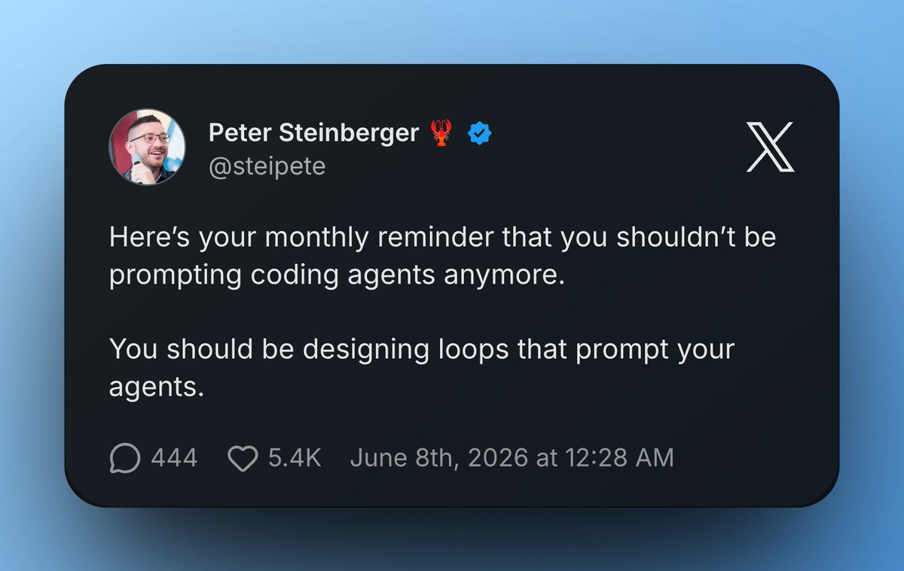

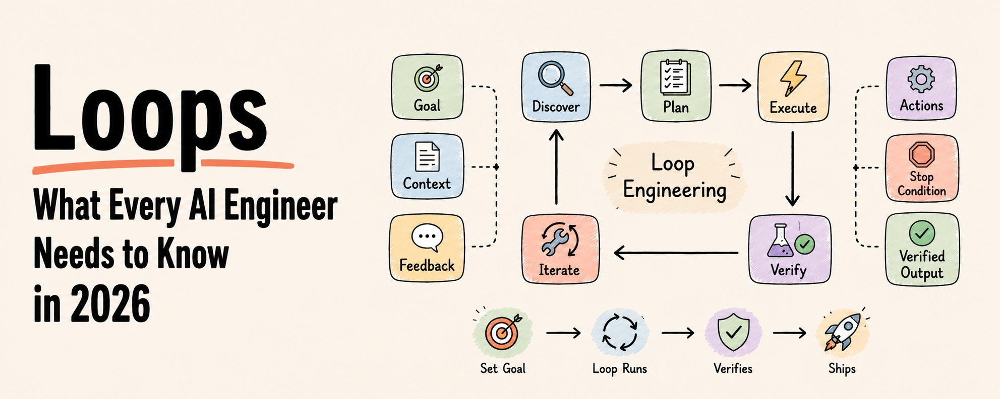

Peter Steinberger，OpenClaw 的作者，目前在 OpenAI 工作。

昨天他发了这样一条推文：

> "你不该再给编码 Agent 写 prompt 了。你应该设计 Loop，让 Loop 去 prompt 你的 Agent。"

紧接着 Claude Code 在 Anthropic 的负责人 Boris Cherny 用另一种方式说了同一件事：

> "我不再给 Claude 写 prompt 了。我跑着一些 Loop，让它们去 prompt Claude、让它自己决定要做什么。我的工作就是写 Loop。"

两位在世的最资深的 AI 工程师。同一个信号。

大多数人读完只是心里嘀咕：这话到底什么意思？

我把它往深里挖了一遍。

下面就是全部内容——掰开了揉碎了讲。

没有黑话。只有你需要的那一套心智模型。

收藏这一篇。它会改变你看 AI 的方式。

## 但先说在前面：为什么大多数人永远搭不起 Loop

> Loop 听起来很美。然后你看到账单。

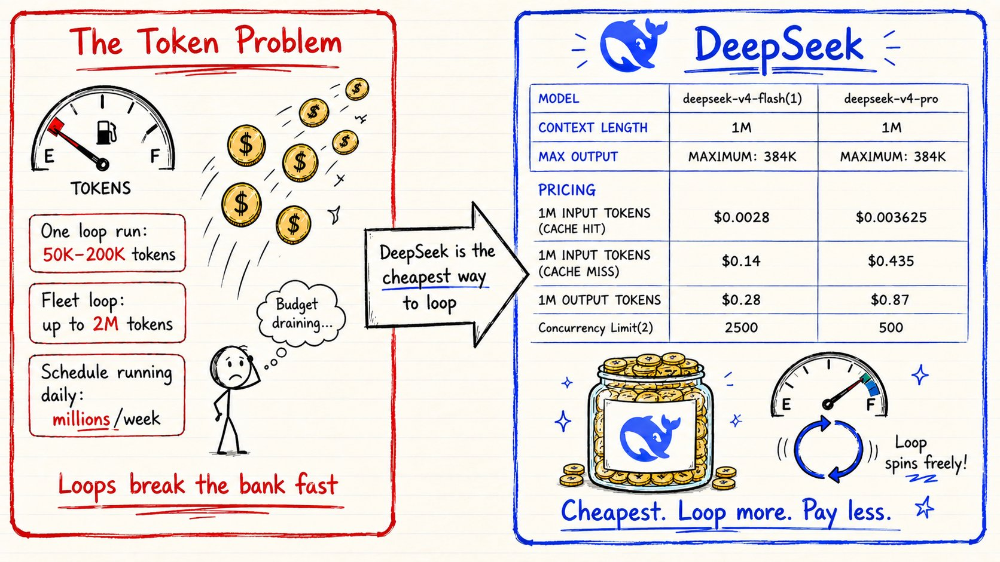

这里有一件没人一开始会告诉你的事。

一个 Agent 在中等编码任务上跑一轮 Loop：50,000–200,000 tokens。

一个带编排器 + 3 个专家 Agent 的 fleet Loop：500,000–2,000,000 tokens。

一个每天定时跑的 Loop：一周就是几百万 tokens。

按标准 API 价格来算，一周认真搞 Loop 工程的花费，比大多数人一个月的 AI 预算都多。

这就是为什么 Peter Steinberger 的评论区里堆满了这种留言：

> "站着说话不腰疼——你 OpenAI 的额度是无限的。"

他们说得没错。

在普通预算下搞 Loop 工程，撑不了多久。

每重试一次都要钱。每自我修正一次都要钱。每个 subagent 都要钱。每跑一轮验证都要钱。

那个自由探索的开环（open loop）？烧 token 的速度让你看得肉疼。

这是没人会提的那个隐性门槛。

Loop 不难设计。

Loop 难的是承担得起。

而这恰恰是中国大模型解决的问题。

**DeepSeek、Kimi、** 以及国产模型**让 Agent Loop 在经济上变得可行。**

自主 Agent 最大的问题不是智能。

是 **token 燃烧**。

Loop 消耗 token 极快。

一次跑完，轻松烧掉 **50K–200K tokens**。

多 Agent 并行、每天定时跑、或者在大型代码库上干活——成本立刻螺旋式上涨。

**DeepSeek 改变了这个等式。**

DeepSeek V4 目前是 **用最低成本在大规模上跑 Loop 的前沿级模型之一**。

你能拿到的东西：

→ **1M 上下文窗口**——为大型项目和长跑工作流而生 → **384K 最大输出**——更大的生成也不崩 → **DeepSeek V4 Flash + Pro 模型** → **极低的 token 价格** → 供 Agent 工作流用的 **工具调用 + JSON 输出** → **超高并发**（Flash 上最高 2500 路请求）

为什么 **1M 上下文窗口** 重要：

Loop 需要记忆。

一个在大项目上跑的编码 Loop，需要同时在脑子里装下：

—— 之前的运行 —— 当前的错误 —— 架构文档 —— 测试结果 —— 代码库上下文

这些东西都得同时在内存里。

大多数模型中途就开始丢上下文了。

你的 Loop 开始忘记前面发生的事。

DeepSeek 能装下明显多出很多的上下文，长时间跑的 Loop 也能保持连贯。

再加上价格这么便宜：

**Loop 不再烧钱。**

## PART 1：老办法 vs 新办法

**过去两年，我们都是一次给 Agent 派一个任务。**

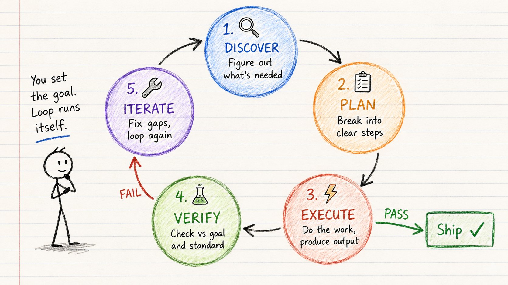

你发一条 prompt。Agent 给出回应。你审一遍。哪里不对你修一下。再发一条 prompt。你自己就是那个 Loop。

这种情况正在变。

不再是让一个 Agent 帮你搭个落地页、然后你一步步手把手指挥；你搭一个 Loop，让它自己跑完"发现—规划—执行—检查—迭代"——直到目标达成。

区别是这样的：

**老办法（prompt 模式）：**

你 → Prompt → Agent → 输出 → 你 review → 你修 → 重复

**新办法（loop 模式）：**

你定目标 → Loop 跑起来 → Agent 发现 → 规划 → 执行 → 验证 → 迭代 → 完成

你不再一步步给它发 prompt。

Agent 替你把循环跑完。

Prompt 给 Agent 一条指令。

Loop 给 Agent 一份工作。

## PART 2：Loop Engineering 到底是什么

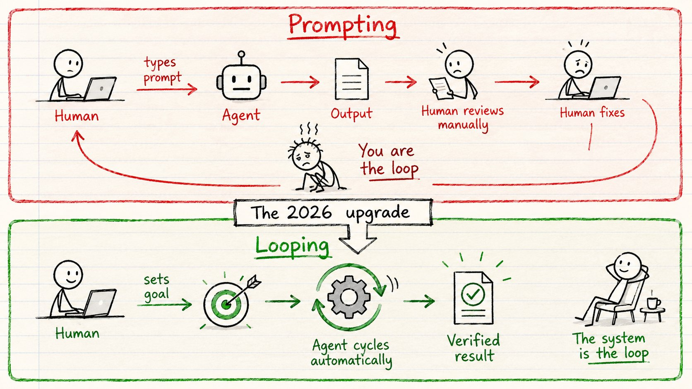

Loop Engineering 是一种实践：设计可复用的反馈

循环，把 AI Agent 从一次尝试带到被验证过的结果——

全程不需要人一直盯着。

Looping 是你搭出来的一种设置。

几乎任何 Agent harness 都能跑起来。

只看你怎么把它接好。

最简单的情况，一个 Agent 自己跑：

→ 调研

→ 起稿

→ 按目标检查这份稿

→ 修薄弱的地方

→ 再跑一轮这个循环，直到产出真的过线

任何 Loop——不管多简单还是多复杂——都要经过

同样的 5 个阶段：

DISCOVER → PLAN → EXECUTE → VERIFY → ITERATE

验证过线 → 发版。

验证不过 → 再来一轮。

整个思路就是这些。

本文剩下的一切，只是怎么把那个循环正确地搭起来。

## PART 3：单 Agent vs Fleet

**Loop 有两种规模：**

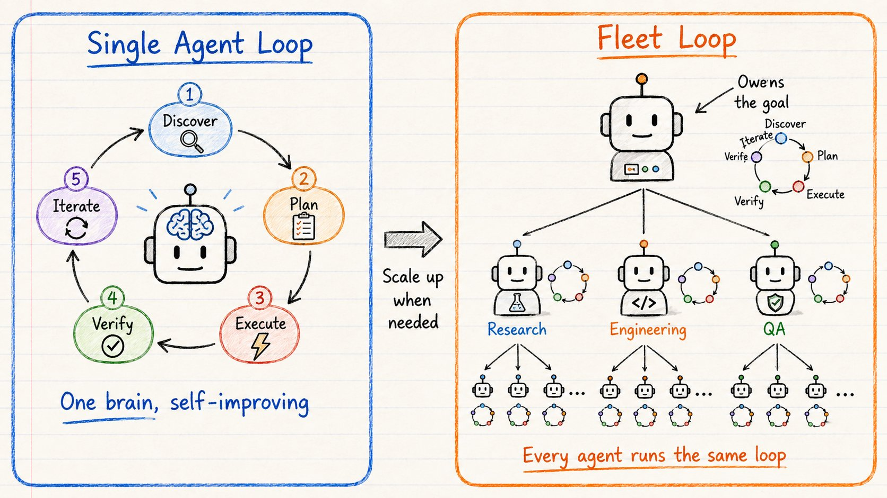

**单 Agent Loop**

一个 Agent 一个人把整个循环跑完。

就像一个人反复改自己的稿子。

它自己发现要做什么、规划工作、执行、验证质量、不对就迭代。

适用场景：

→ 聚焦的任务

→ 简单的目标

→ 范围有限

一个大脑。一个 Loop。自我进化。

━━━

**Fleet Loop**

更大号的版本是一群 Agent 在 loop。

你给一个编排器 Agent 一个目标。

它把目标拆成几块。

每一块交给一个专家 Agent。

专家 Agent 又把更小的活儿派给它们自己的 subagent。

整棵树都在"发现—规划—执行—验证"之间循环——直到目标完成。

就像一支完整的团队把一个项目从头干到尾。

结构是这样的：

→ 编排器拥有目标

→ 专家拥有各步骤

→ Subagent 干窄而具体的活

→ 评估闸门保证它不是一坨 slop

例子："做一个效率 App"

> 编排器（拥有使命） ↓ ↓ ↓ 调研 工程 QA 专家 专家 专家 ↓ ↓ ↓ Web 代码编写 测试编写 调研 + 调试 + Bug 跟踪 人员 工程师

树上的每一个 Agent 都在跑同一套 5 阶段 Loop。

Discover → Plan → Execute → Verify → Iterate。

关键在这里：

单 Agent Loop 像一个人反复改自己的稿子。

Fleet Loop 是一整支团队把一个项目从头干到尾。

## PART 4：开环 vs 闭环

**这是 2026 年最关键的一道分界线：**

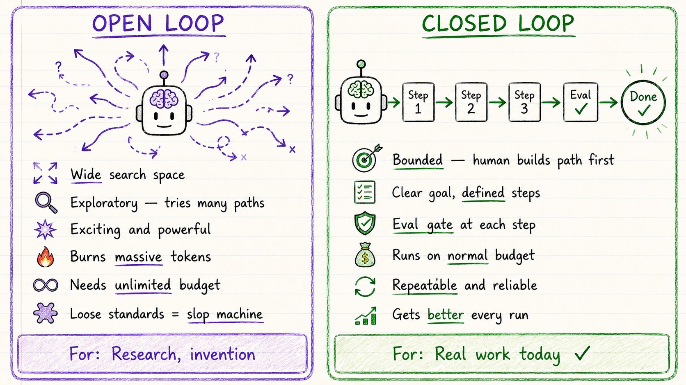

不是所有 Loop 都一样。

分两种。

**开环（Open Looping）**

探索式。可以活动的空间很大。

你给 Agent 一个目标，让它自己漫游。

它能尝试不同路径、发现新东西、搭出你并没有完全定义清楚的东西。

这是让人兴奋的那种。Peter Steinberger 和 OpenAI 那些人在做的就是这个。

代价呢？

烧 token 烧得离谱。

对那 90% 没有无限 API 预算的人来说，开环今天还玩不起。

把它指向那些标准松散的项目，它会直接变成一台 slop 制造机。

快。乱。贵。

**闭环（Closed Looping）**

有边界。人类先把端到端的路径设计好。

→ 明确的目标

→ 定义好的步骤

→ 每一步都有一次评估

→ 一个停下来的点，或者把控制权交还给你的点

Agent 还是在 loop——但是在你搭好的框架里。

它每一次跑都会变好一点，因为上一轮的结果会喂给下一轮。

路径很紧，所以普通预算跑得动。

标准把它摁在正轨上。

没有质量闸：AI 会跑偏。

有质量闸：AI 会变好。

对今天大多数真实工作来说，能赚到钱的是闭环。

**你该用哪个？**

先从闭环开始。

搭一套跑得稳的紧凑系统。

等你有了质量闸之后，再把它打开。

## PART 5：搭好一个 Loop 必备的 6 块积木

**任何能立得住的 Loop，都得凑齐这 6 样东西：**

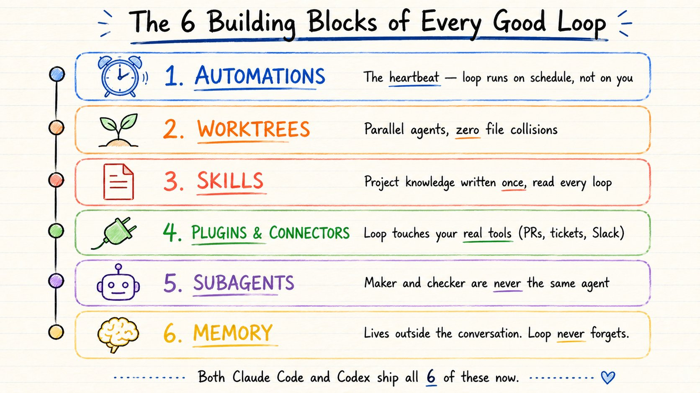

下面说点实在的。

概念上 Loop 有 5 个阶段。

但要真把它跑起来，你具体要搭什么？

6 样东西。Claude Code 和 Codex 现在都把这 6 样配齐了。

下面就是它们——以及每一块在 Loop 内部真正在干的事。

**1\. 自动化（AUTOMATIONS）**

这是触发 DISCOVER、让 Loop 真正启动起来的那一棒。

Loop 的心跳。

自动化是让 Loop 变成"真 Loop"的东西——而不只是你某天跑过的一次。

你定义一个 prompt、一个节奏、一个目标。

Loop 按计划自己跑。结论会送过来，不用你到处查。

→ /loop 按节奏重跑

→ /goal 一直跑到你写的那个条件真的为真

给它："test/auth 里的所有测试都要通过，lint 干净。"

然后走开。

**2\. Worktree（工作树）**

这是让多个 EXECUTE 阶段能并行跑、还不互相打架的关键。

并行 Agent 不乱套。

你一旦跑超过一个 Agent，文件就开始撞车了。

两个 Agent 写同一个文件，跟两个工程师没沟通就提交同一行代码，是一回事。

一个 git worktree 给每个 Agent 自己的独立工作目录、自己的分支——同一份仓库历史，零冲突。

一个 Agent 的改动物理上碰不到另一个的 checkout。

**3\. Skill（技能）**

这是让 DISCOVER 变快的那块——Agent 还没开始就已经认识你的项目了。

别再每次都从零解释你的项目。

一个 Skill 就是一个装着 SKILL.md 的文件夹——项目约定、构建步骤、"我们不这么干，是因为出过那次事故"。

写一次。每个 Loop 都读。

没有 Skill：Loop 每次循环都得从零把你的项目重新推导一遍。

有 Skill：它在复利。Agent 在开始之前就已经认识你的项目。

→ VISION.md —— 成功长什么样

→ ARCHITECTURE.md —— 技术栈和目录结构

→ RULES.md —— Agent 绝对不被允许做的事

**4\. 插件和连接器（PLUGINS AND CONNECTORS）**

这是让 EXECUTE 变成真的一棒——Loop 在你真实的环境里动手，不只是在你文件系统里动手。

只能看见文件系统的 Loop，是个小 Loop。

连接器（基于 MCP）让 Agent 能读你的 issue 跟踪系统、查数据库、打到 staging API、丢一条消息到 Slack。

这正是"Agent 说'这是修复方案'"和"Loop 自己开 PR、挂上 Linear ticket、CI 一绿就 ping 频道"之间的差距。

**5\. Subagent（子代理）**

这是让 VERIFY 变得诚实的那块——做检查的人永远不能跟干活的人是同一个 Agent。

把干活的人和检查的人分开。

写出代码的那个模型，批自己作业时手太软。

第二个 Agent——指令不同、有时模型也不同——专门抓第一个自己说服自己的那些东西。

这种拆分能跑通：

→ 一个 Agent 负责探索

→ 一个 Agent 负责实现

→ 一个 Agent 按 spec 负责验证

这正是 /goal 在底层干的事。

一个全新的模型来判断 Loop 是不是该停了——而不是干活的那个。

**6\. Memory（记忆）**

这是让 Loop 持久存在的那块——第 47 次跑的 DISCOVER 知道前面 1 到 46 次跑已经试过什么。

整个 Loop 的脊梁。

一个 markdown 文件。一个 Linear board。任何活在"一次会话"之外的东西。

模型在两次跑之间会忘得一干二净。

仓库不会。

记忆文件装着：试过什么、过的是什么、还卡着什么。

明早的 Loop 从今天停下的地方接着干。

听起来太简单，简单到让人怀疑它有没有用。

每一个长跑 Loop 都靠它。

## PART 6：真实的 Loop 例子

**Loop 在实践里长什么样：**

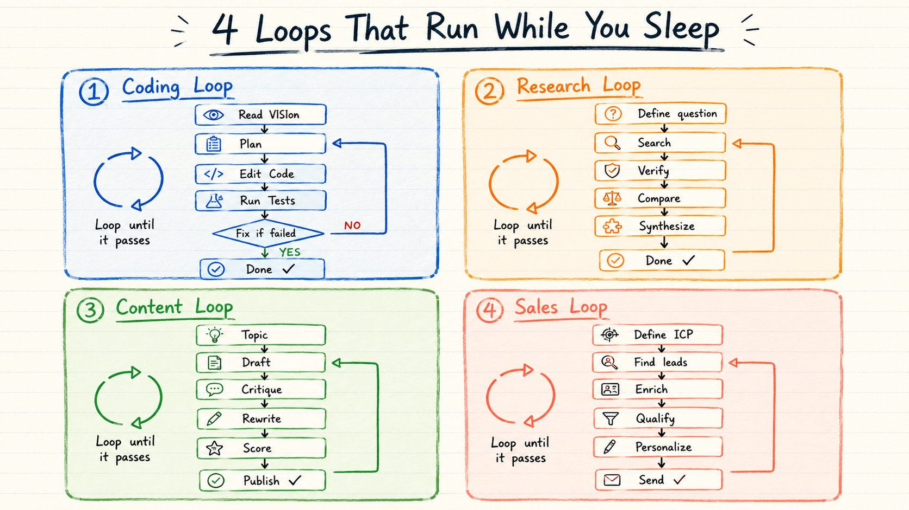

**编码 Loop**

```plaintext
读 VISION.md + ARCHITECTURE.md
↓
规划下一处改动
↓
改代码
↓
自动跑测试
↓
如果测试失败 → 读报错 → 修 → 重测
↓
如果测试通过 → 总结改动
↓
停
```

中间没有人。

Agent 自己写、自己测、自己修、自己验。

━━━

**研究 Loop**

```plaintext
定义研究问题
↓
搜索资料
↓
总结发现
↓
对照资料核验说法
↓
对比冲突的信息
↓
合成最终答案
↓
达到置信度阈值时停
```

━━━

**内容 Loop**

```plaintext
主题 + 受众 + 目标已定
↓
产出初稿
↓
审稿 Agent 评稿
↓
按审稿意见重写
↓
按成功标准打分
↓
分数过了 → 发布
↓
分数没过 → 再写一轮
```

━━━

**销售触达 Loop**

```plaintext
ICP（理想客户画像）已定
↓
找匹配的线索
↓
用公司数据补全信息
↓
按标准判定资质
↓
个性化消息
↓
质量审核
↓
发出或升级到人工
```

所有 Loop 都是同一副骨架：

目标 → 行动 → 检查 → 修复 → 重复直到完成。

## PART 7：Prompt 工程师 vs Loop 工程师

**2026 年正在打开的那道技能鸿沟：**

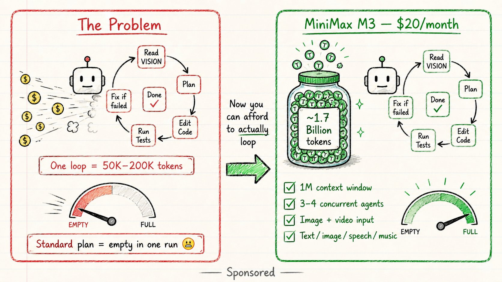

**Prompt 工程师**

→ 雕琢更好的指令

→ 语言能力

→ 更好的 prompt

→ 更好的单次输出

→ 每次跑完仍然要自己审一遍

→ 你才是那个反馈环

**Loop 工程师**

→ 设计更好的反馈循环

→ 软件工程能力

→ 更好的 loop

→ 可靠的、经过验证的结果

→ 系统自己跑、自己查、自己纠

→ 系统才是那个反馈环

Prompt 工程师 -> "给我写个函数"

Loop 工程师 -> "写 → 测 → 修到绿"

写更好的 prompt 写 VISION.md 自己看输出 测试结果自己跑 跑 Agent 一次 搭可复用的系统 按单次输出付费 按被验证的结果付费

工具是同一套。

思维方式完全不同。

Prompt 工程师找 AI 要一个输出。

Loop 工程师搭一套系统，让它产出被验证过的结果。

2026 年最贵的那批 AI 工程师，不是在写更好的英文句子。

他们在写那条逻辑——决定 Agent 怎么发现、怎么规划、怎么自检、怎么知道该停下来的逻辑。

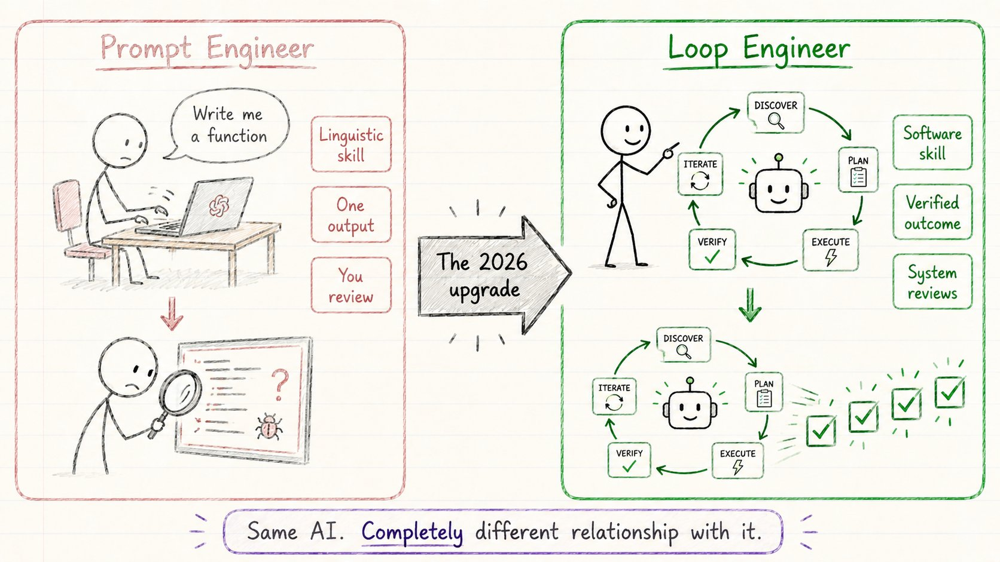

## 收尾

这就是 Loop Engineering。

简单回顾一下：

**这一次切换：**

→ 两年里我们一次给 Agent 派一个任务 → 现在我们设计跑完整套循环的 Loop

**你实际要搭的 6 样东西：**

→ 自动化——心跳，触发发现

→ Worktree——并行 Agent 不撞车

→ Skill——每次跑都在复利的项目知识

→ 插件和连接器——Loop 在你真实的工具里动手

→ Subagent——干活的人和检查的人永远不是同一个

→ 记忆——Loop 在两次跑之间不会忘

**两种规模：**

→ 单 Agent：一个大脑，自我进化

→ Fleet：编排器 + 专家 + subagent——每个 Agent 跑同一个 Loop

**两种类型：**

→ 开环：探索性强、能力大、贵、要求无限预算

→ 闭环：有边界、跑得稳、负担得起、今天能赚到钱的就是它

**一个能跑好的 Loop 必备的 5 块：**

→ 目标——精确地定义什么叫"完成"

→ 上下文——VISION.md、ARCHITECTURE.md、RULES.md

→ 动作——Agent 真正需要的那些事

→ 反馈——测试、类型检查、linter、结构化错误

→ 停止条件——Loop 怎么知道它该停了

**成本问题：**

→ Loop 烧 token 烧得快

→ 同样的 20 美元投到 DeepSeek 上，能跑得比大多数前沿模型远得多

→ 这把最后那一道真实门槛给拆了

**最大的那一次切换：**

→ Prompt 工程师找 AI 要输出

→ Loop 工程师搭系统，让系统产出被验证过的结果

Peter Steinberger 那句话说得对：

别再给你的 Agent 写 prompt 了。

去设计 Loop。

因为一个跑得稳的 Loop，抵得上一千条完美的 prompt。

还有一件没人会大声说的事。

两个人搭出完全一样的 Loop，会得到完全相反的结果。

一个人用它在自己本来就懂得很深的活上走得更快。

另一个人用它逃避去理解那份工作本身。

Loop 分不出这两种人。

你能。

这正是 Loop 设计比 Prompt 工程更难的原因——而不是更简单。

Boris Cherny 那句话的重点不是工作变容易了。

是那个撬动点挪了个位置。

去搭你的 Loop。

但要搭得像一个打算继续当工程师的人——而不只是一个按下"开始"的人。

因为一个跑得稳的 Loop，抵得上一千条完美的 prompt。

而 20 美元换 17 亿 tokens，你终于搭得起了。

如果这篇对你有用：

→ 转发给你的人脉

→ 关注 [@sairahul1](https://x.com/@sairahul1) 看更多这种拆解

→ 收藏这一篇——这套 5 部分框架值得反复回来翻

我写 AI、写搭产品、写那些你睡觉时也在跑的系统。

---

> 原文地址：<a href="https://x.com/sairahul1/status/2064277888216555684">https://x.com/sairahul1/status/2064277888216555684</a>
