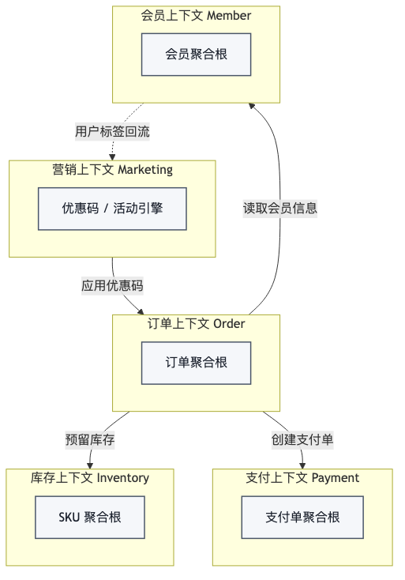
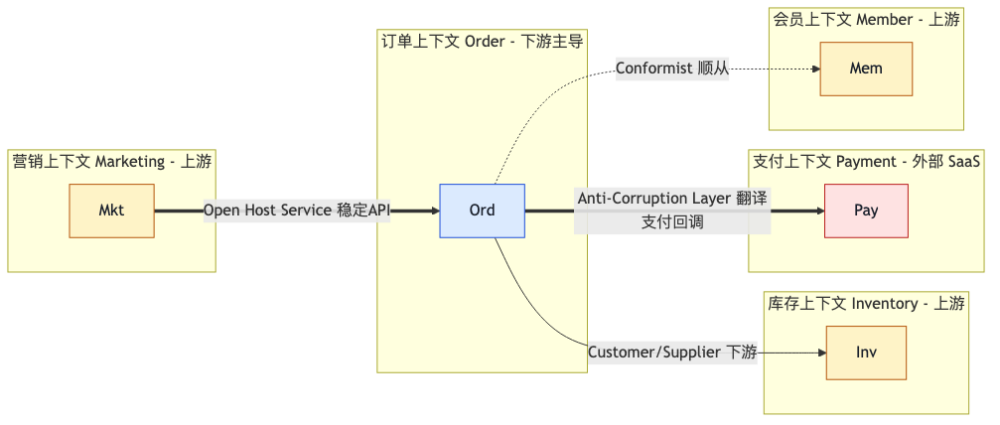
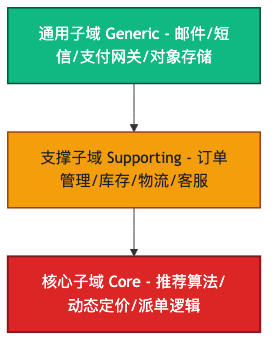
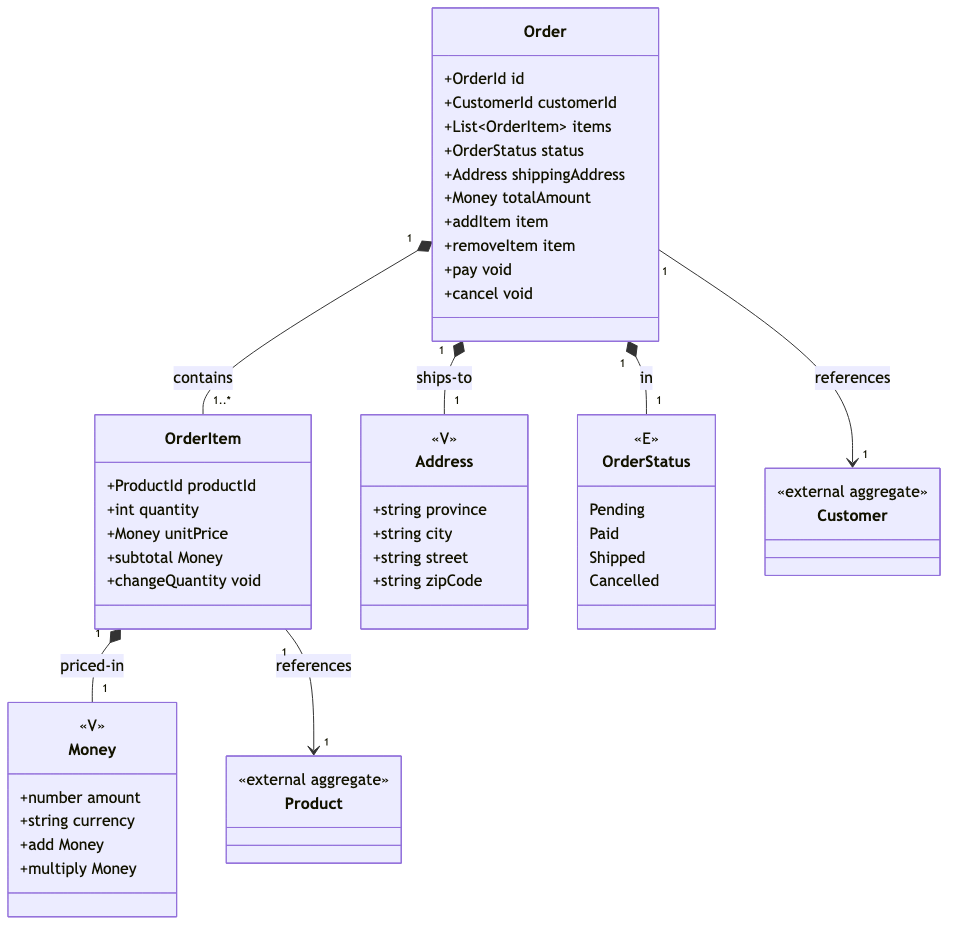

> 大多数人把 DDD 当作"OO 写法的升级版"——Entity、ValueObject、Repository 这套战术模式。但 Eric Evans 写那本蓝皮书时，**70% 篇幅在讲团队协作和语言对齐**。本文重新梳理 DDD 的战略与战术，让你理解：DDD 真正解决的不是"class 怎么画"，而是"领域应该怎么切、团队应该怎么对话"。

## 一、DDD 不是关于代码的

如果你以为 DDD 是关于怎么写 class 的——那你这篇文章读对了。

我曾经也这么以为。2019 年我第一次读 Vaughn Vernon 的《实现领域驱动设计》时，满脑子想的是"Entity 怎么实现、Repository 怎么写、Aggregate 边界怎么定"。我把项目里的 `Order`、`OrderService`、`OrderRepository` 三个类按 DDD 的样貌重写了一遍，心想这下应该"DDD 了"。

结果 6 个月后，代码比之前还乱。

订单表越来越大、聚合边界越来越模糊、跨聚合的修改越来越多——我严格按 DDD 战术模式画的边界，业务根本不买账。

直到后来我才意识到：**DDD 的真正价值，不在战术模式**。

Eric Evans 2003 年写那本《领域驱动设计：软件核心复杂性应对之道》时，**70% 篇幅在讲团队协作和语言对齐**——业务专家和开发者怎么对话、领域知识怎么在团队里流动、跨子系统的边界怎么定。只有 30% 在讲 class 怎么画、对象怎么放。

我读 DDD 的方式，是把书里"非重点"的 30% 当成"重点"。

这不是个别现象。中文圈关于 DDD 的最大迷思，就是把 DDD 等同于"OO 写法的升级版 + repository 模式"。这套理解会让你在战术上很熟练，但战略上一片空白——而 DDD 的真正价值，恰恰在战略上。

这篇文章想做的，就是帮你把 DDD 的战略和战术重新看一遍。

## 二、复杂软件为什么需要 DDD

先讲一个我听过的真实案例。

某 SaaS 公司做一个 CRM 系统。立项时只有 3 个开发者、1 个产品经理、1 个销售。早期一切顺利——产品经理用"客户"这个词，销售也用"客户"，代码里 `customer_id` 也指代同一个东西。需求、对话、代码，三者对得上。

第 6 个月，公司扩到 15 人。新来的销售开始用"客户"指"已签单的企业"；产品经理文档里的"客户"是"潜在购买者"；数据库里 `customer` 表存的是"账户实体"——一个客户可能对应多个账户、多个签约主体。

技术讨论开始变成"你说的客户是哪个客户"的循环。

某次需求评审会，开发问产品："这个功能是给新客户还是老客户？"产品和销售同时回答，但说的是不同的人。开发回去改了 3 天的代码，发现改错了——因为他对"客户"的理解和数据库里的"客户"也不是一回事。

这种"语言不一致"的现象，在任何成长中的复杂系统里都会出现。**业务方说一套话、开发者说另一套话、数据库存第三套话**——三方各自用各自的词，最后大家各做各的，系统变成一座巴别塔。

Eric Evans 2003 年提出 DDD 时，第一个原则不是 entity、不是 aggregate、不是 repository——是**通用语言（Ubiquitous Language）**。

什么是通用语言？简单说：**业务专家和开发者必须用同一门语言描述业务**。这门语言要贯穿需求文档、对话、代码、commit message、UI 文案——所有地方用同一套词。

听起来简单，做起来难。因为"通用语言"不是一个文档，不是 wiki 页面——它是一个持续维护的约定。

一个判断方法：业务专家说的"订单状态"，在代码里能不能找到对应的 `OrderStatus` 类型？业务专家说的"优惠码"，在代码里是不是 `DiscountCode`？如果业务专家嘴里的词在代码里找不到对应物，那这门语言就不通用。

通用语言是 DDD 的起点，不是某个高级章节。但你可能会问：怎么在大系统里保持这种一致性？不同业务部门、不同子团队，对"客户"的理解本来就不一样——这怎么"通用"？

这正是 DDD 战略模式要回答的问题。

## 三、战略模式：DDD 的真正价值

战略模式解决的是 DDD 的真正问题：**领域应该怎么切、团队应该怎么协作、跨子系统的语言如何对齐**。

这一节我们讲四个核心概念：通用语言（已铺垫）、限界上下文、上下文地图、子域。

### 3.1 通用语言 Ubiquitous Language

我们已经讲了通用语言。补充几个要点：

- **通用语言不是文档**。文档会过时，代码不会骗人。如果代码命名不用通用语言，那再好的文档也没用。
- **通用语言要落到 commit message**。如果 commit message 里写"修复了 order 提交的问题"——这个"order"在你们团队是"订单提交"还是"订购流程"？模糊的 commit message 是语言不一致的早期信号。
- **通用语言要随业务演化**。业务变化时，通用语言要跟着变。3 个月前叫"客户"的实体，今天可能叫"账户"——这时候要主动改代码、改文档、通知团队。

### 3.2 限界上下文 Bounded Context

回到第 2 节 CRM 系统的例子。业务方嘴里的"客户"和销售嘴里的"客户"不是同一个东西——这种情况怎么处理？

DDD 的回答是：**承认"同一个词在不同上下文里有不同含义"是普遍现象，并用"限界上下文（Bounded Context）"给每个含义一个明确的边界**。

什么是限界上下文？简单说：**通用语言 + 模型 + 代码 的边界**。每个限界上下文内部有自己的通用语言、自己的模型、自己的代码实现。跨限界上下文时，要通过明确的接口（API、消息、事件）通信。

举例：电商系统里，"商品"在不同的限界上下文里有不同的含义：

| 上下文 | "商品" 的含义 | 关键字段 |
| --- | --- | --- |
| 库存上下文 | SKU + 数量 | sku_id、stock_count |
| 营销上下文 | 商品名 + 优惠标签 | name、discount_tags |
| 订单上下文 | 商品快照（防止下单后改价） | product_snapshot、price_paid |

同一个词，3 个含义。如果硬要把 3 个含义塞进一个 `Product` 类，结果就是上面 CRM 案例的复刻——团队天天争论"你说的商品是哪个"。

限界上下文的存在让这种"争论"消失了。**在库存上下文里，"商品"指代的是 SKU；在营销上下文里，"商品"指代的是可优惠的对象；在订单上下文里，"商品"是已下单的快照。** 三个上下文各自维护自己的模型，互不干扰。

那限界上下文之间怎么通信？通过接口。订单上下文需要"商品"信息时，调库存上下文的"查询 SKU"接口，拿到一个库存上下文认为的"商品"DTO；订单上下文拿到这个 DTO 后，在订单上下文内部把它转换成"订单商品快照"——这个快照跟库存上下文的商品不再有关系。

再看一个非电商的例子：协作工具。Notion / Slack / Lark 这类工具里，"channel" 这个词在不同上下文里有完全不同的含义——

| 上下文 | "channel" 的含义 | 关键字段 |
| --- | --- | --- |
| 通知上下文 | 推送频道（哪些用户订阅了通知） | channel_id、user_ids、push_token |
| 权限上下文 | 权限组（哪些人能看什么） | group_id、resource_ids、role |
| 数据分析上下文 | 数据访问管道（数据怎么流入数仓） | pipeline_id、source、destination |

同一个英文词，三个中文团队翻译都不一定一样（频道？组？管道？），更不用说在不同上下文里它们的模型和代码实现。如果硬塞进一个 `Channel` 类，结果就是字段越来越多、关系越来越乱——团队天天争论"你说的 channel 是哪个 channel"。

这两个例子（电商的"商品"、协作工具的"channel"）说明的是同一件事：**限界上下文不是为了"分类"而存在，是为了"消歧"而存在**。一旦承认"同一个词在不同场景下含义不同"是常态，限界上下文就从"可选优化"变成"必要纪律"。

下图是一个电商系统的限界上下文划分（5 个上下文 + 依赖箭头）：



### 3.3 上下文地图 Context Map

限界上下文是"一个个孤岛"，但实际系统里这些孤岛是要通信的。"上下文地图（Context Map）"描述的就是这些孤岛之间的关系。

DDD 定义了 6-7 种上下文关系类型。最常用的 4 种：

**1. Customer / Supplier（客户/供应商）**
- 上游（Supplier）提供能力，下游（Customer）使用能力
- 上下游明确，互相协商接口
- 例：订单上下文（下游）使用库存上下文（上游）的"预留库存"能力

**2. Anti-Corruption Layer（防腐层）**
- 下游用翻译层保护自己，避免被上游的模型污染
- 例：订单上下文要对接外部支付服务（支付宝/微信），但支付服务的回调格式经常变——订单上下文加一个"防腐层"，把支付回调翻译成自己的"支付完成"领域事件
- 关键洞察：**防腐层是"投资"，不是"开销"**。前期多花点功夫加防腐层，后期上游变了不会牵连你整个系统重写

**3. Conformist（顺从者）**
- 下游直接接受上游的模型，不做翻译
- 例：很多团队的"会员上下文"直接用上游"用户中心"返回的 `user_id` 类型——因为反正都是同一个用户，何必翻译？
- 风险：如果上游改了模型，下游必须跟着改
- 适用场景：上游稳定，或者上下游是同一家公司同构紧密协作

**4. Open Host Service（开放主机服务）**
- 上游用稳定的公共协议对外提供服务
- 例：营销上下文的"优惠码 API"对全公司开放——任何上下文想用优惠码，调用这个 API 即可，营销上下文保证向后兼容
- 关键洞察：**当你的上下文被很多下游使用时，必须用 OHS**，否则每次下游加需求你都得改接口

下图是一个上下文地图示例，标注了不同边界的关系类型：



### 3.4 子域 Subdomain

最后一个战略概念是子域（Subdomain）。

业务不是"一个整块"，而是分**三种子域**：

- **核心子域（Core）**：公司的核心竞争力，做得比竞争对手好你就赢
- **支撑子域（Supporting）**：围绕核心的必要能力，做得不差就行
- **通用子域（Generic）**：不分行业都一样的，做得能用就行

举例电商系统：

| 子域 | 类型 | 例子 |
| --- | --- | --- |
| 推荐算法 | 核心 | 抖音的核心是推荐、淘宝的核心也是推荐 |
| 订单管理 | 支撑 | 没有订单管理电商就转不起来，但做得"够用"就行 |
| 邮件发送 | 通用 | 用 SendGrid / Mailgun 等三方服务即可 |

关键洞察：**核心子域要自己做**——因为这是你的竞争力；**通用子域可以外包**——因为这是行业通用能力，做了也不加分。

但怎么判断哪个是核心、哪个是支撑？问自己一个问题："如果这个能力我做不好，公司会倒闭吗？"如果会，这就是核心；如果不会，这就是支撑或通用。

再看一个完全不同行业的例子——医院 HIS（Hospital Information System）。把医院业务切分成三种子域：

| 子域 | 类型 | 例子 |
| --- | --- | --- |
| 诊断决策支持 | 核心 | 医生根据症状、检查结果、既往病史给出诊断 |
| 病历管理 | 支撑 | 病历书写、医嘱开立、处方管理 |
| 医保对接 | 通用 | 医保结算、报销审核（卫健委统一接口） |

诊断决策支持是医院的核心——三甲医院和社区医院的差距主要在这里。病历管理是支撑——做得"够用"就行，不必花大精力优化界面。医保对接是通用——交给卫健委统一下发的接口或第三方 SaaS 即可，自己做也加不了分。

这个例子的关键洞察：**核心域往往不是"技术含量最高"的部分，而是"业务判断最密集"的部分**。医院的诊断决策支持，本质上是把医生的临床经验编码成软件——这不是"难"在技术上，而是"难"在跨医学知识。如果你的团队没有医生参与、也没有医学知识库，硬做核心域会失败。

下图是子域的三层蛋糕图（核心在中间，支撑在外，通用在最外）：



**小结：DDD 战略模式的真正价值是"切分"**——把业务切分成限界上下文，把上下文之间的关系画成地图，把子域分成核心/支撑/通用并决定每个子域的投入策略。这一切做好了，再讲战术才有意义。

## 四、战术模式：在切分好之后怎么建模

战术模式回答的是另一个问题：**在切分好的限界上下文内部，代码怎么写**。

注意顺序：先切分（战略），再建模（战术）。如果一上来就上战术模式但战略没切分好，那就是"战术上很熟练、战略上一片空白"——我在文章开头犯的那个错。

战术模式很多，这节聚焦最有用的 3 个：实体、值对象、聚合。

### 4.1 实体 Entity

**定义**：有唯一标识、生命周期中状态可变、ID 不变。

听起来抽象，举个例子：`User` 是实体。两个 `User` 对象即使名字、邮箱都相同，只要 ID 相同就是同一个用户；只要 ID 不同就是不同用户。

实体的核心规则：

- 用 **ID** 判断相等，不靠字段值
- 实体行为内聚在自己身上（业务方法写在实体类里），不是贫血模型
- ID 类型用 **branded type** 表达，避免 primitive obsession

TypeScript 示例：

```typescript
type UserId = string & { readonly __brand: 'UserId' };

class User {
  private constructor(
    private readonly id: UserId,
    private name: string,
    private email: Email,
  ) {}

  static create(id: UserId, name: string, email: Email): User {
    return new User(id, name, email);
  }

  changeName(newName: string): void {
    if (!newName) throw new Error('姓名不能为空');
    this.name = newName;
  }

  equals(other: User): boolean {
    return this.id === other.id;
  }
}
```

几个细节：

- `private constructor` + `static create` 工厂方法：保证不能随便 `new User(...)`，必须走 `User.create`——这让"创建"和"修改"的语义分开
- `branded type`：`UserId = string & { __brand: 'UserId' }` 让 TypeScript 在编译期阻止你把 `OrderId` 当 `UserId` 用——避免出现"用订单 ID 查用户"的 bug
- 业务方法（`changeName`）写在 `User` 类里，不是写在 `UserService` 里——避免贫血模型

**反模式警示**：getter/setter 全暴露 = 贫血模型。如果你的 `User` 类只有字段、行为全在 `UserService` 里，那这个 `User` 其实是数据结构，不是实体。

### 4.2 值对象 Value Object

**定义**：无标识、不可变、相等靠值。

`Money` 是经典的值对象。两个 `Money` 对象只要 `amount` 和 `currency` 相同就是相等的——它们没有"ID"。

值对象的核心规则：

- **不可变**——任何"修改"都返回新对象
- **相等靠值**——两个 `Money(100, "CNY")` 相等，不靠 ID
- 没有"生命周期"——值对象不存"创建时间"

TypeScript 示例：

```typescript
class Money {
  private constructor(
    private readonly amount: number,
    private readonly currency: string,
  ) {
    if (amount < 0) throw new Error('金额不能为负');
  }

  static of(amount: number, currency: string): Money {
    return new Money(amount, currency);
  }

  add(other: Money): Money {
    if (this.currency !== other.currency) {
      throw new Error('币种不同，不能相加');
    }
    return new Money(this.amount + other.amount, this.currency);
  }

  equals(other: Money): boolean {
    return this.amount === other.amount && this.currency === other.currency;
  }
}
```

关键洞察：**值对象是"把小概念提取出来"避免 primitive obsession**。

反例：直接用 `let amount: number; let currency: string`——可能出现"日元金额 + 美元币种"的荒谬；正例：`Money.of(100, "CNY")`——类型系统强制金额和币种绑定。

另一个常见值对象是 `Address`（省/市/街道/邮编）。两个地址只要字段相同就相等——它们没有"地址 ID"。

### 4.3 聚合 Aggregate / Aggregate Root

**定义**：一组必须保持强一致性的实体 + 值对象的集合，由聚合根统一管理。

这是战术模式里最难讲清楚的一个。核心规则：

- **不变量（invariant）必须在事务内由聚合根保证**。例：`Order` 的"总金额" = 所有 `OrderItem` 的小计之和——这个不变量必须在 `Order` 聚合根的方法里保证
- **外部只能通过聚合根修改聚合内部对象**。不能直接 `order.items[0].quantity = 100`——必须走 `order.changeItemQuantity(itemId, 100)`
- **一个事务只修改一个聚合**。跨聚合的修改用领域事件（domain event）异步通知

TypeScript 示例（Order 聚合）：

```typescript
class Order {
  private constructor(
    private readonly id: OrderId,
    private readonly customerId: CustomerId,
    private readonly items: OrderItem[],
    private status: OrderStatus,
  ) {}

  static place(customerId: CustomerId, items: OrderItem[]): Order {
    if (items.length === 0) throw new Error('订单必须至少有一个商品');
    return new Order(OrderId.generate(), customerId, items, OrderStatus.Pending);
  }

  addItem(item: OrderItem): void {
    if (this.status !== OrderStatus.Pending) {
      throw new Error('只有待支付订单可以加商品');
    }
    this.items.push(item);
  }

  pay(): void {
    if (this.status !== OrderStatus.Pending) {
      throw new Error('订单当前状态不能支付');
    }
    this.status = OrderStatus.Paid;
  }

  totalAmount(): Money {
    return this.items
      .map(i => i.subtotal())
      .reduce((acc, m) => acc.add(m), Money.of(0, 'CNY'));
  }
}
```

**反例警示**：跨聚合修改。

错误做法：用户支付订单时，同时修改 `Order` 状态 + `Inventory` 库存。这会导致数据不一致——如果库存修改失败但 Order 状态已改，系统就出 bug。

正确做法：`Order.pay()` 只改 Order 状态，发出 `OrderPaid` 领域事件；Inventory 上下文监听这个事件，异步扣减库存。两个上下文通过事件解耦，库存失败也不会回滚订单（业务上订单已支付就是已支付，库存问题由库存系统自己处理重试/报警）。

DDD 的战术模式不只用于电商。看一个医疗领域的例子——Patient 聚合：

```typescript
class Patient {
  private constructor(
    private readonly id: PatientId,
    private name: string,
    private readonly medicalRecordNumber: string,
    private readonly allergies: Allergy[],
    private readonly chronicConditions: ChronicCondition[],
  ) {}

  addAllergy(allergy: Allergy): void {
    if (this.allergies.some(a => a.equals(allergy))) {
      throw new Error('该过敏史已记录');
    }
    this.allergies.push(allergy);
  }

  hasAllergyTo(drug: Drug): boolean {
    return this.allergies.some(a => a.appliesTo(drug));
  }
}
```

这里的 `Patient` 是聚合根，`allergies` 和 `chronicConditions` 是聚合内部的实体/值对象。业务规则——"同一个过敏不能重复添加"——写在 `Patient.addAllergy` 方法里，由聚合根保证不变量。处方系统（外部聚合）开药时只需要调用 `patient.hasAllergyTo(drug)` 判断，不直接修改 Patient 内部——这就是"外部只能通过聚合根修改聚合内部对象"的实战。

把 Order 聚合和 Patient 聚合对比看：业务领域完全不同（电商 vs 医疗），但 DDD 战术模式的结构一模一样——都是"聚合根 + 内部实体/值对象 + 业务规则内聚在根上"。这就是 DDD 战术模式"跨行业复用"的价值：**它不绑死任何业务，但提供了一套"如何把业务规则编码到代码"的通用语法**。

下图是 Order 聚合的内部结构（聚合根 + 实体 + 值对象 + 外部聚合引用）：



**小结**：DDD 战术模式的真正价值是"在切分好的限界上下文内部，把领域知识编码到代码里"——业务规则写在实体上、不可变性写在值对象上、一致性写在聚合根上。战术模式是手段，战略切分才是目的。

## 五、怎么开始用 DDD

如果你读完前面 4 节觉得"听起来都对，但我项目怎么开始"——这一节回答这个问题。

DDD 是一种"团队工作方式"的改变，不是"个人技术升级"。所以"开始用 DDD"不是"学完战术模式自己回去写代码"，而是"和团队一起做几次工作坊"。

常见的工作坊有 3 种：

### 5.1 Event Storming

Alberto Brandolini 提出的工作坊方法。流程：

1. 全员（业务 + 开发）围着一面大白板
2. 业务人员用黄色便利贴写"领域事件"（domain event）——"订单已创建"、"支付已完成"、"库存已扣减"
3. 把领域事件按**时间线**从左到右贴
4. 业务人员补"命令"（command）便利贴——"创建订单"、"发起支付"——贴在每个事件左边
5. 开发者标"聚合"（aggregate）——哪些事件属于同一个聚合
6. 标"外部系统"——哪些事件是外部触发的

**优点**：最有现场感、团队对齐效果最好、业务和开发第一次说同一种语言。
**缺点**：需要 4-8 人、3-4 小时集中时间、远程团队难做。

### 5.2 Example Mapping

Matt Wynne 提出的小型化方法。流程：

把每个用户故事拆成 4 类卡片：

- **Story**（黄色）：用户故事
- **Rule**（蓝色）：业务规则
- **Example**（绿色）：规则的例子
- **Question**（红色）：还没搞清楚的疑问

例：

```text
Story: 用户可以用邮箱注册账号
  Rule: 邮箱必须唯一
    Example: 同一邮箱第二次注册时返回"邮箱已存在"
  Rule: 密码至少 8 位
    Example: 7 位密码注册失败
  Question: 注册成功后是否自动登录？
```

红色 Question 卡要在工作坊后被解答——如果解答不了，要么拆成新规则，要么降级为"已知未支持"。

**优点**：4 人以下、轻量、可以迭代。
**缺点**：对"规则"的理解需要一些训练。

### 5.3 Domain Storytelling

用时序图画"人 + 系统 + 业务对象"的交互。适合"业务专家说半天开发者听不懂"的场景。

**优点**：跨业务/技术沟通效果最好。
**缺点**：需要会画 DSL（领域特定语言），学习成本高。

### 5.4 我的推荐：Example Mapping 作为入门首选

理由：

- 4 人以下
- 独立开发者也能用（自己做产品时）
- 远程友好（在线白板即可）
- 一次 30-60 分钟就能跑完一个用户故事

## 六、什么时候不该用 DDD

DDD 是工具箱，不是教条。以下 4 个红色信号，看到就别硬上 DDD：

### 6.1 业务简单到 CRUD 就够

如果你的业务就是"用户填表 → 存数据库 → 后台查列表"，DDD 是过度工程化。用 Rails / Django 自带的脚手架 + 一个 `User` model 就够了。

### 6.2 团队没有"业务专家 ↔ 开发者"的对话习惯

DDD 的前提是业务专家愿意花时间解释领域。如果你的团队没有产品经理，或者产品经理只发需求文档不解释"为什么"，那 DDD 启动不起来——通用语言根本建立不了。

### 6.3 项目时间紧、人少

DDD 前期投入大：要做工作坊、要画限界上下文、要建模聚合。如果项目 1 个月后就要上线，DDD 反而拖慢进度。先用最快的方案上线，存活下来再考虑重构。

### 6.4 领域本身还在剧烈变化

DDD 适合稳定领域。如果你的产品还在"探索期"——核心业务模式每周都在变——那 DDD 画的限界上下文和聚合边界很快就会过时，反而成了负债。先把业务跑通 3-6 个月稳定下来，再上 DDD。

### 6.5 判断框架

- **中 0-1 条红色信号**：放心用 DDD，团队和项目都准备好了
- **中 2 条**：可以用 DDD 战术模式（entity/VO/aggregate）试试，战略模式暂缓
- **中 3 条以上**：先不上 DDD，把业务跑通、团队培养起来再说

## 七、延伸阅读：先读哪本

DDD 的中文圈学习资料参差不齐。如果你读完这篇文章想深入，按这个梯度读：

| 顺序 | 书名 | 特点 | 阅读建议 |
| --- | --- | --- | --- |
| 1 | Vaughn Vernon《领域驱动设计精粹》（DDD Distilled） | 薄，概念完整 | 1-2 周读完，作为入门地图 |
| 2 | Vaughn Vernon《实现领域驱动设计》（IDDD） | 含 Java 示例，战术深入 | 重点看 entity / VO / aggregate / repo / domain event |
| 3 | Eric Evans《领域驱动设计：软件核心复杂性应对之道》 | 原版，500+ 页 | 战略 + 完整概念，但密度大 |

三本都有中文翻译版（人民邮电出版社 / 机械工业出版社等）。建议不要直接读 Evans 原版——500+ 页的概念密度对入门读者是劝退书。先读 Distilled（薄，2 周搞定），建立框架后读 IDDD 学战术，最后有兴趣再回头啃 Evans。

## 八、结尾

DDD 不是写 class 的规矩。它是"让软件说出业务的话"的一门手艺。

先理解战略（怎么切分领域、怎么画上下文地图、怎么区分核心/支撑/通用子域），再上手战术（怎么写实体、值对象、聚合）。战略是骨架，战术是血肉——顺序错了，再多战术模式也撑不起复杂业务。

最后三个建议：

- **别一上来就重写整个项目**。选 1 个新功能或 1 个新模块试 DDD，跑 3 个月，反思哪些假设错了，再决定要不要扩大范围。
- **重视启动仪式**。DDD 是"团队工作方式"的改变，不是"个人技术升级"。Event Storming / Example Mapping 这样的工作坊比"读完书自己写代码"重要 10 倍。
- **把 DDD 当工具箱**。业务简单就别硬上、领域不稳定就先不上、团队培养不起来就先做别的事。DDD 是手段，不是目的。

祝你在复杂业务里找到自己的路。
