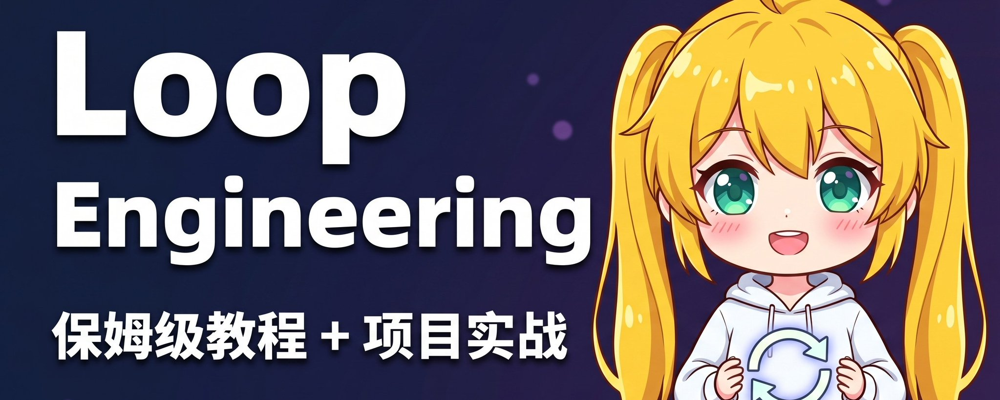

大家好，我是程序员鱼皮。

AI 编程圈又又又出新概念了……

这次的起因是 Claude Code 之父 Boris Cherny 在最新访谈中说： 这次的起因是Claude Code 之父Boris Cherny 在最新访谈中说：

> 我不再提示 Claude 了，我有一堆循环在运行，它们才是在提示 Claude 并判断接下来该做什么。我的工作变成了写循环。

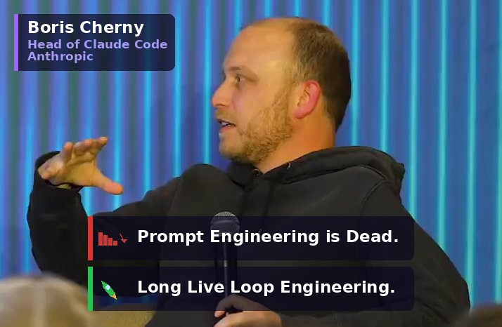

紧接着，OpenClaw 之父 Peter Steinberger 也发推表示： 紧接着，OpenClaw 之父Peter Steinberger 也发推表示：

> 你不该再给编程 Agent 写提示词了。你应该设计一套循环机制，让这些循环去提示你的 Agent。 你不该再给编程Agent 写提示词了。你应该设计一套循环机制，让这些循环去提示你的Agent。

两家顶级 AI 公司 Anthropic 和 OpenAI 的重量级人物，同时在说一件事：**AI 编程的范式又要升级了，从手动写提示词，变成设计循环系统。**

这个新范式，叫做 **Loop Engineering 循环工程**。这个新范式，叫做Loop Engineering 循环工程。

绷不住了啊，今年 2 月刚开始流行 Harness Engineering 驾驭工程，现在又出新概念了？

学不完，真的学不完……

不过别担心，这篇文章我会把 Loop Engineering 从头到尾给你讲明白。先告诉你它是什么、和之前的 AI 编程模式有什么关系，然后带你用 Claude Code、Codex、Cursor 三款工具实战体验 Loop 的效果，最后再聊聊它的方法论框架和踩坑经验。

点个收藏，我们开始。

## 一、什么是 Loop Engineering

Loop Engineering 这个词翻译过来就是「循环工程」。简单来说，就是你设计一套自动运转的系统，让它代替你去给 AI 下达指令、检查 AI 的输出、记录完成进度、决定下一步该做什么，然后不断循环执行，直到达成你预设的目标。

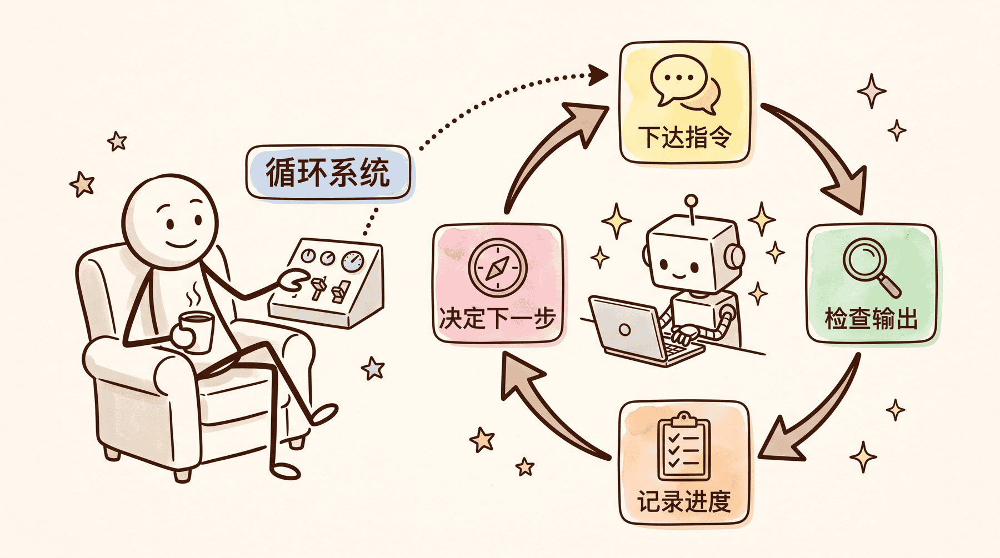

以前的 AI 编程模式，就像开手动挡的车。踩油门、换挡、转弯，每一步都靠你自己操作。你给 AI 一句提示词，AI 回你一段代码，然后停下来等你下一条指令。**你不说话，它就不工作。**

Loop Engineering 的模式，更像是自动驾驶。你提前设定好目的地和安全规则，车会自己开，遇到红灯自己停、路况变了自己绕、到了目的地自动停车。你只需要偶尔看一眼仪表盘，确认方向没问题就行。

也就是说，你从「一句一句手动提示 AI」的操作者，变成了「设计循环规则」的管理者。

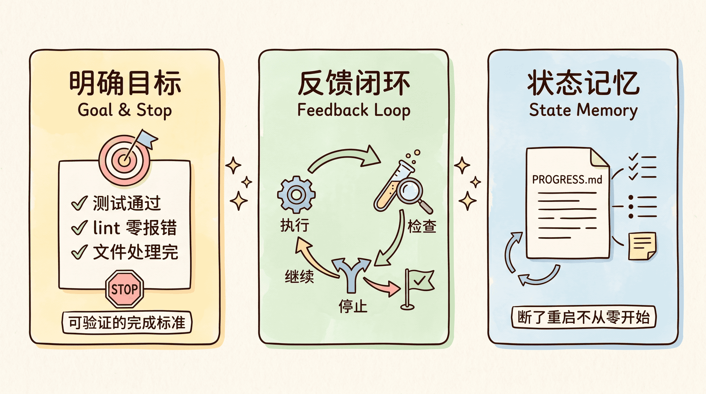

### Loop 的 3 大核心

可能有人会问：Loop 不就是个定时任务吗？让模型反复执行同一个操作就行了吧？

当然不是！

没有判断能力的循环，AI 可能会把错误当成正确答案继续往下跑，越跑越偏。那跟 cron 定时脚本没区别，算不上 Loop Engineering。

一个真正靠谱的 Loop 需要 3 样核心的东西：

1）明确的目标和停止条件

你得告诉 Loop 什么时候算完成，而且这个完成标准必须是 **可验证的**。比如所有测试通过、lint 零报错、所有文件都处理完，这些都是好的停止条件。而「把代码优化一下」就不行，因为没人知道什么叫优化好了。

2）反馈闭环

每轮循环结束后，Loop 得检查这一轮的结果，判断是继续跑下一轮还是停下来。最常见的做法是跑完代码后自动执行测试，测试没过就继续修，测试过了就停止。

3）状态记忆

AI 的对话窗口是有限的，关掉就没了。Loop 需要一个外部文件来记录当前进度，比如哪些任务做完了、哪些还没做、上一轮循环的结论是什么。这样即使中间断了重启，也不会从零开始。

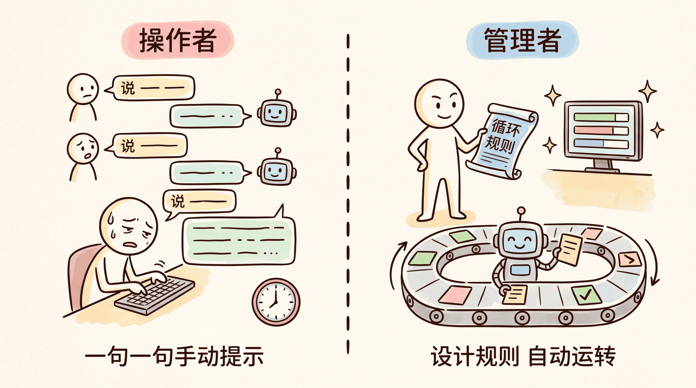

后面的实战部分你会反复看到这 3 样东西，先有个印象就行。

## 二、AI 编程的发展过程

Loop 不是凭空冒出来的概念，它是从前几代 AI 编程方法论一步步进化来的。了解 AI 编程的发展过程，你才能知道 Loop 到底解决了什么问题、为什么需要它。

下面简单梳理一下这条进化路径：

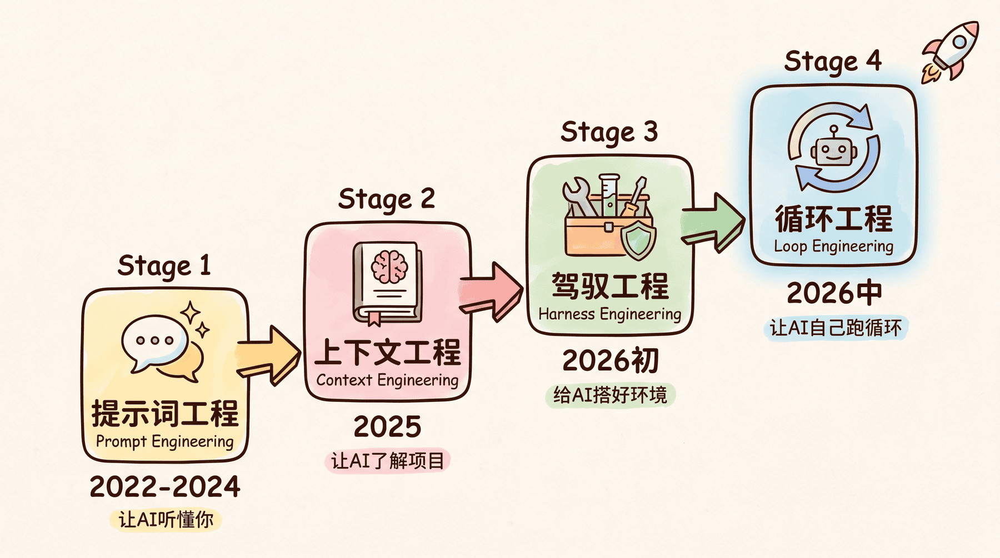

**1、提示词工程 Prompt Engineering（2022 ~ 2024）**

关注的是怎么通过对话让 AI 听懂你的需求。比如给 AI 设定角色、约束输出格式、用思维链让它一步步思考。

提示词工程解决的核心问题是「AI 答非所问」，掌握了提示词的写法之后，输出质量能提升一大截。

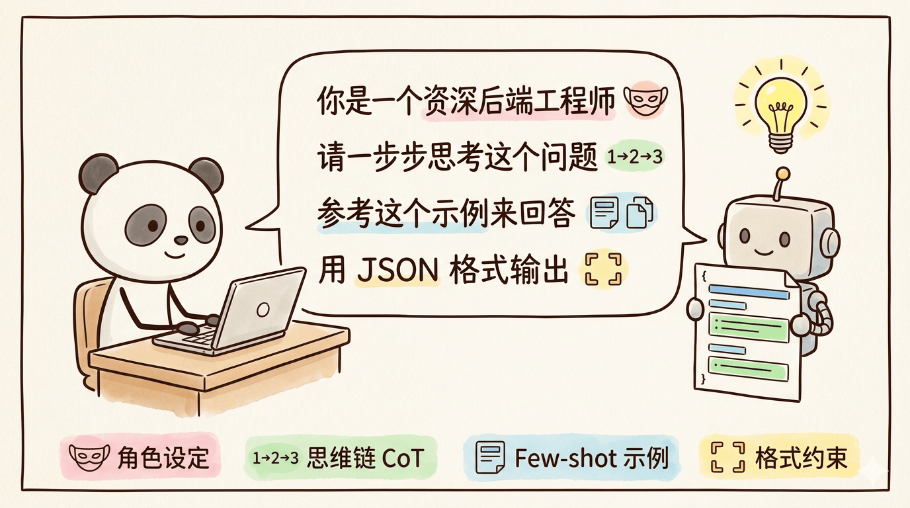

**2、上下文工程 Context Engineering（2025）**

光写好提示词还不够，AI 还得了解你的项目背景才能给出靠谱的回答。

上下文工程关注的就是怎么 **在对的时候把对的信息喂给 AI**。上下文工程关注的就是怎么在对的时候把对的信息喂给AI。

比如写 AGENTS.md 规则文件让 AI 了解项目背景，用 RAG 让 AI 能检索到相关资料，给 AI 建立跨对话的记忆机制。

上下文工程解决的核心问题是「AI 给出的回答脱离实际」，做好了上下文管理，AI 的输出才能贴合你的项目实际情况。

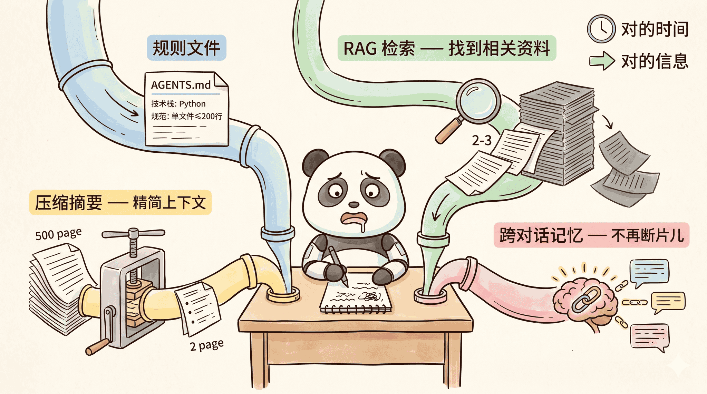

**3、Harness Engineering 驾驭工程（2026 年初）**

有了上下文，AI 能理解你的项目了，但要让它真正干好活，还得给它搭建一整套靠谱的工作环境。

除了给 AI 提供合适的上下文信息外，还要给它配备工具、拆解任务、搭建测试、防止代码腐烂。

把 Harness 搭好之后，AI 才能在一个有工具、有测试、有约束的环境里稳定可靠地产出。

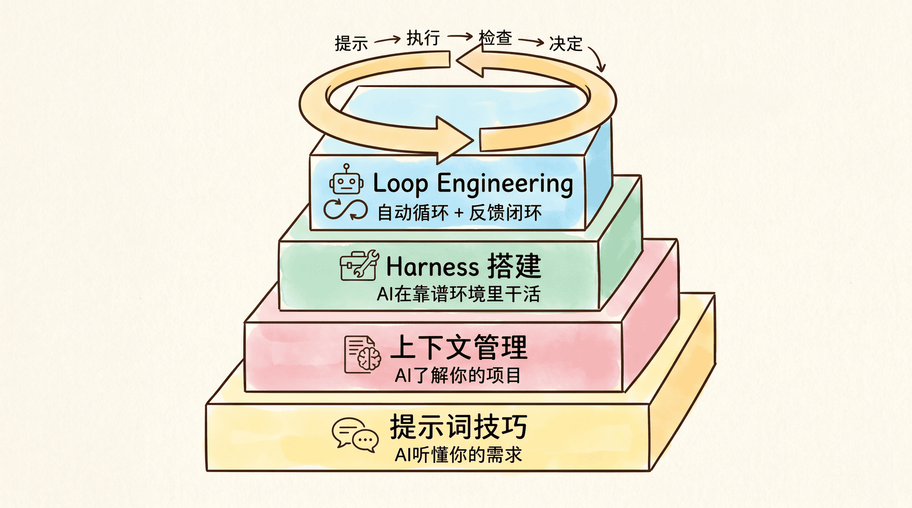

**4、Loop Engineering 循环工程（2026 年中）**

关注的是怎么让 AI 自己形成工作循环。

前面三步都做好了，AI 已经能在靠谱的环境里干活了，但你还是得一步步推着它走。Loop 要解决的就是这个问题，你把「提示、检查、决定下一步」这些事情交给一套系统去循环执行，自己只需要设定好目标和停止条件，AI 就能自己跑起来直到达成目标。

这四者是层层包含的关系。提示词技巧、上下文管理、Harness 搭建，这些能力在 Loop 里面全都要用上。Loop 只是在这些基础上，多加了一层「自动循环 + 反馈闭环」的机制。

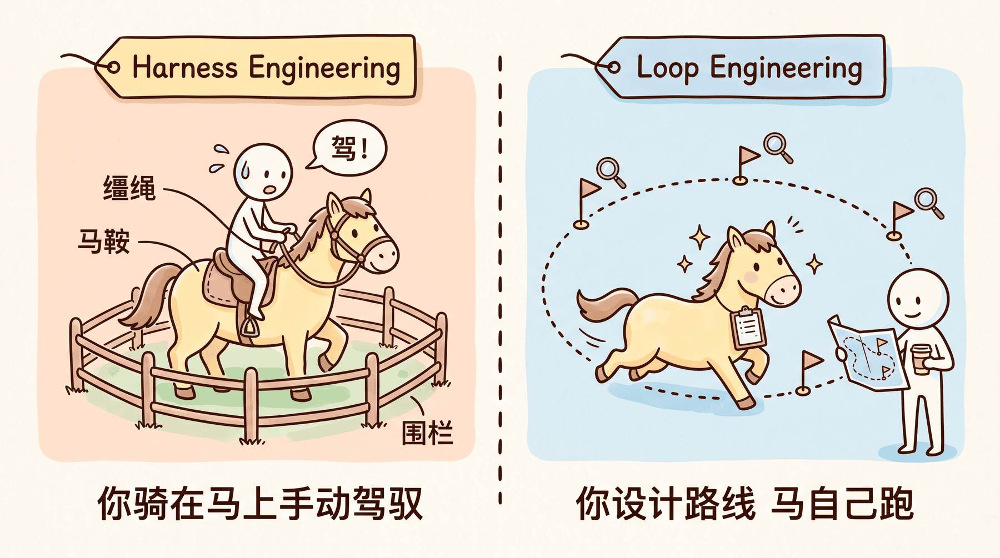

很多同学容易把 Harness 和 Loop 搞混。

如果把 AI 比作一匹马，Harness 就是你给马装上的缰绳、马鞍和围栏，然后你骑在马上手动驾驭它。而 Loop 呢，是你设定好一条巡逻路线后，不用上马，让马自己按路线一圈一圈地跑。每跑完一圈它会自动检查有没有异常，发现问题就处理，处理完继续跑下一圈。你从骑马的人变成了设计路线的人。

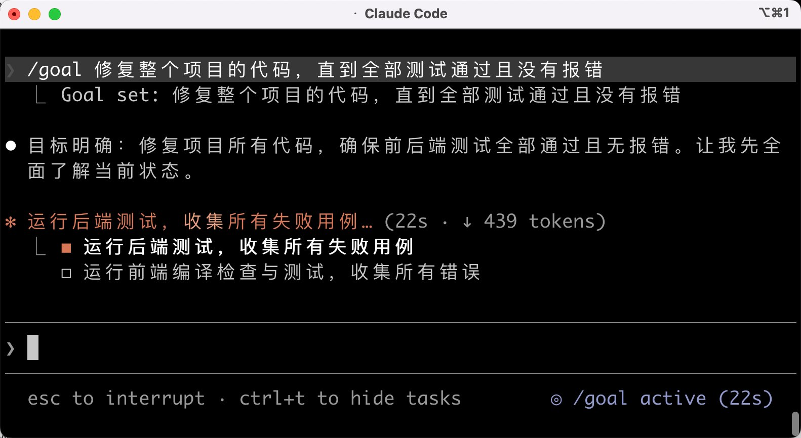

不过 Loop Engineering 目前还是一个很早期的概念，业界还没有统一的标准和最佳实践。建议先把 Harness 那套基础打扎实，Loop 学起来就容易多了。

## 三、Loop 实战体验

了解完基本概念，接下来我们直接上手实战，同时用 3 种 AI 工具，感受一下 Loop 在实际开发中是什么体验。

目前 Claude Code 和 Codex 都已经内置了 Loop 相关的命令，可以直接用。Cursor 虽然还没有原生的 Loop 命令，但可以通过提示词设计来实现同样的思想。下面分别演示。

### Claude Code 的 Loop 实战

Claude Code 提供了两个 Loop 相关的斜杠命令 `/goal` 和 `/loop`，分别对应两种不同的使用场景。

#### /goal 命令

`/goal` 命令的作用是让 AI 持续工作，直到你设定的目标达成为止。

你给出一个可验证的目标条件，AI 开始工作，每一轮结束后会有一个独立的小模型来判断「目标是否已经达成」。如果没达成，AI 自动开始下一轮继续推进；如果达成了，就停止并报告完成。

注意，这个判断目标是否达成的模型和执行任务的模型是分开的，避免了单个模型的偏差。

比如我想让 Claude Code 修复整个项目的代码，可以这样写：

```bash
/goal 修复整个项目的代码，直到全部测试通过且没有报错
```

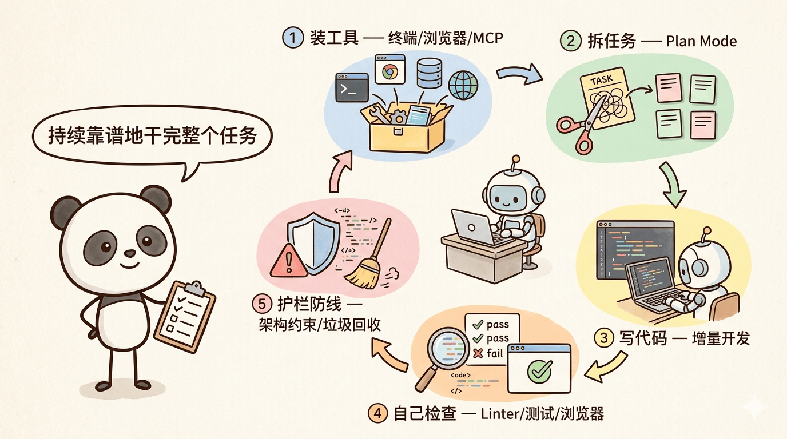

执行后 Claude 会立刻开始工作，直到所有测试通过且没有报错为止，整个过程你完全不用干预。

还有个小技巧，你可以在条件后面加上熔断限制，比如「20 轮还没搞定就停下来」，防止 AI 陷入死循环狂烧 token。

`/goal` 适合那些有明确终止条件、且手动盯着比较费时的场景，比如模块迁移、批量重构、修复某个测试用例直到它通过、处理一批标了特定标签的 Issue 等等。

如果你想中途看看进度，直接输入 `/goal` 不带任何参数就行，能看到当前任务跑了多久、花了多少 token。

想提前停止的话，用 `/goal clear` 即可。

#### /loop 命令

`/loop` 命令的作用是让 AI 按固定的时间间隔定时循环执行某个操作。

比如每 5 分钟检查一下部署是否完成：

```bash
/loop 5m 检查项目前后端的部署状态
```

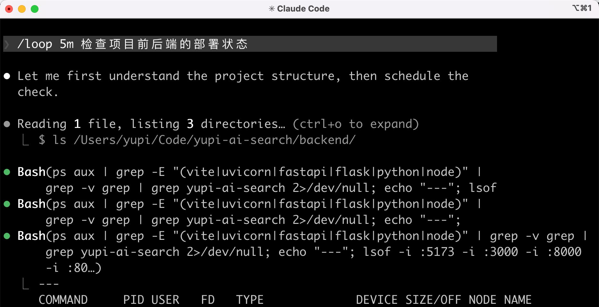

`/loop` 适合那些需要定期盯着的事情，比如等部署完成后自动通知你、每隔一段时间检查线上服务有没有报错、定时扫描代码库里新增的安全漏洞。任务完成后记得停掉 Loop，否则它会一直在后台循环执行消耗资源。

总结一下这两个命令的区别，`/goal` 是「跑到完成为止」，适合有明确终点的一次性任务；`/loop` 是「定时反复跑」，适合没有明确终点的持续监控。两者都是 Loop Engineering 的实现方式，只是适用场景不同。

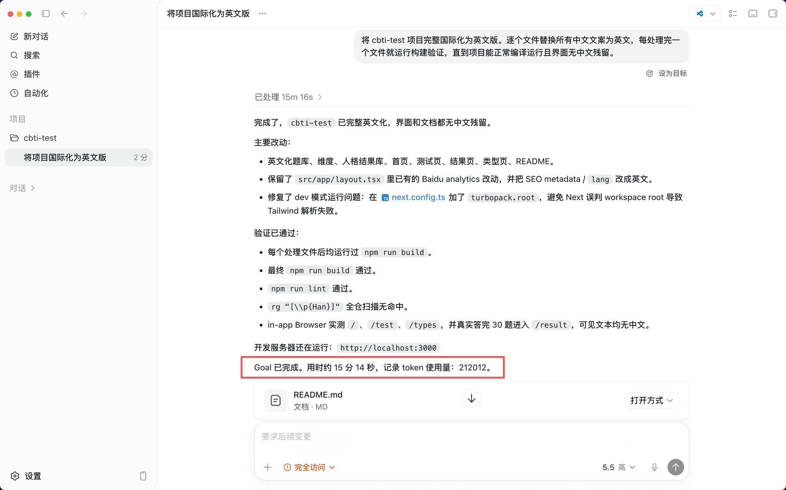

### Codex 的 Loop 实战

Codex 桌面 APP 也有类似的 Loop 能力，主要通过两种方式实现。

#### 设定目标

在 Codex APP 的对话框里，你可以通过输入 `/目标` 来设定一个持续运行的目标，效果和 Claude Code 的 `/goal` 类似，AI 会持续工作直到目标达成。

比如我想让 AI 把我的「程序员人格测试项目」做一次完整的国际化改造，把所有中文界面翻译成英文版：

```text
/目标 将 cbti-test 项目完整国际化为英文版。逐个文件替换所有中文文案为英文，每处理完一个文件就运行构建验证，直到项目能正常编译运行且界面无中文残留。
```

经过 15 分钟后，AI 完成了目标，并且输出了 token 使用量。相比直接让 AI 一把梭完成所有事情，设定目标后让它一步步开发、每步都自动校验，最终产出的质量会稳定得多。

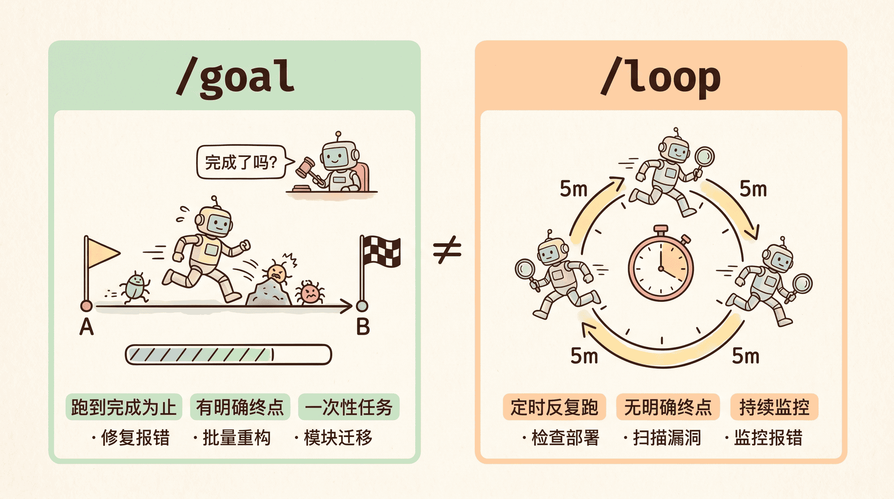

#### Automations 定时自动化

Codex 桌面 APP 里还有一个「自动化」面板，类似于 Claude Code 的 `/loop`，你可以配置定时执行的自动化任务。

进入左侧的自动化面板，能看到 Codex 已经内置了一些模板，比如定时总结代码变更、检查代码问题之类的。

你也可以自己新建，比如让 AI 每天早上帮你搜集一次 AI 编程领域的热点资讯：

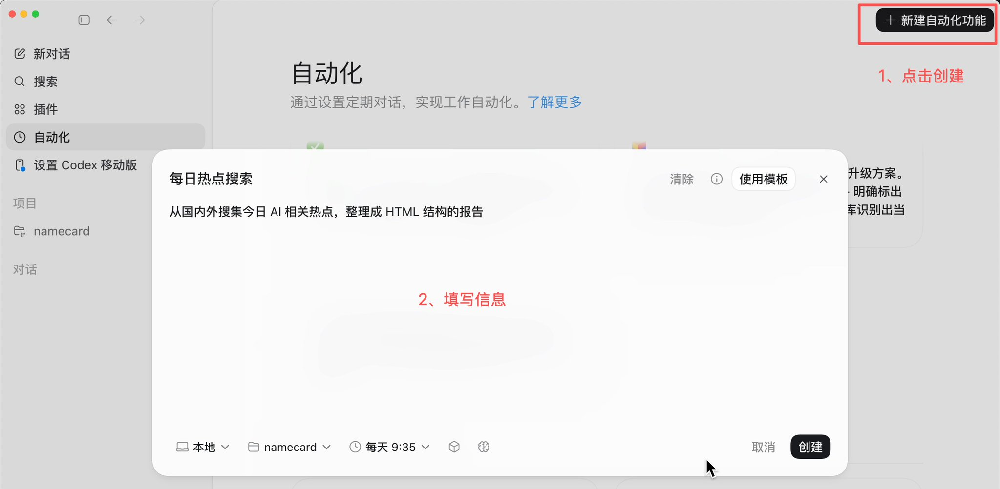

创建成功后，时间一到 Codex 就会自动开启一个对话来执行任务。你也可以手动执行一次先看看效果。

点击任务，能够查看详细信息：

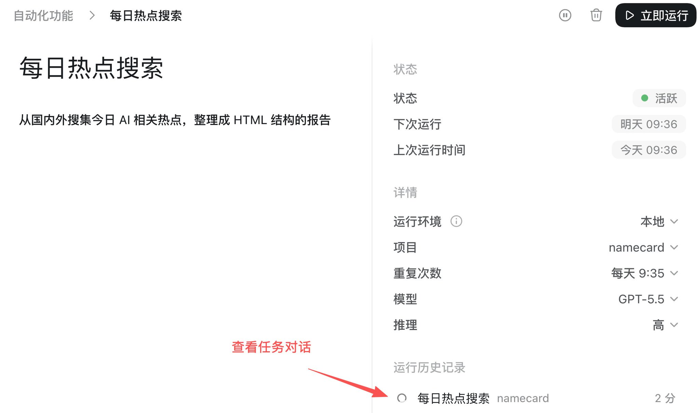

点击某个运行历史记录后，还能查看正在执行的任务对话，建议多观察任务的表现，持续迭代优化提示词。

### Cursor 自主实现 Loop 思想

Cursor 目前还没有原生的 `/goal` 或 `/loop` 命令。但只要在提示词里设计好循环机制，让 AI 自主执行命令，一样能跑出 Loop 的效果。

比如我要用 Cursor 从零开发一个叫「装了吗」的桌面 APP，帮学编程的同学一键安装各种开发环境。这个项目包含 Electron 桌面应用、Python 服务端、Web 管理后台三个模块，还是挺复杂的。

我特意在提示词里设计了一套自主开发循环，让 AI 不要停下来等我确认，自己跑起来直到整个系统能用为止。

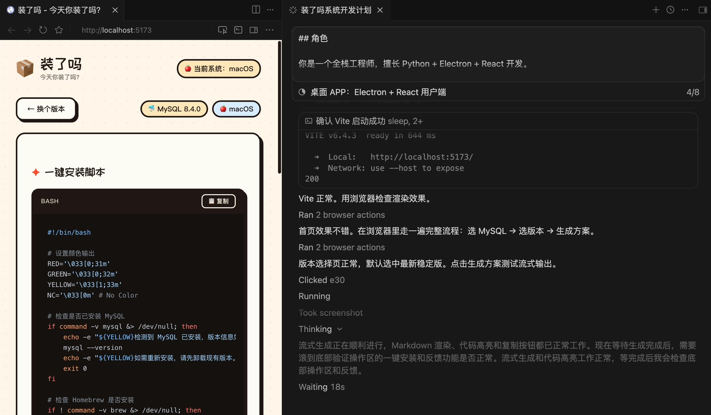

提示词的关键部分是这样的：

```markdown
## 自主开发循环

全程自主开发，不要停下来等我确认，除非遇到无法自行解决的阻塞问题。遵循以下循环机制：

1. 状态追踪：在项目根目录维护 PROGRESS.md，记录当前阶段、已完成事项、进行中事项、问题及解决方案。每完成一个模块就更新
2. 开发-验证闭环：每完成一个模块，立即编译运行验证，有报错就修复，通过后再推进下一个模块
3. 端到端验证：全部功能完成后，以用户视角做一次完整的端到端测试
4. 防死循环：同一个问题修复超过 5 次仍未解决，记录到 PROGRESS.md 后跳过，继续推进其他任务
```

你会发现，这几条规则恰好对应了前面讲的 Loop 三个核心要素：

- 目标和停止条件 → 「端到端测试通过」就是停止条件
- 反馈闭环 → 「开发-验证闭环」让 AI 每做完一步都自动检查
- 状态记忆 → PROGRESS.md 文件持久化记录进度

执行之后，AI 就开始了它的自主循环。它先配置好环境，然后按顺序开发服务端、桌面端、管理后台。整个过程我基本没有干预，AI 自己维护着 PROGRESS.md 记录进度，开发完一个模块就自动跑测试，遇到报错就自己修复，修完继续推进。

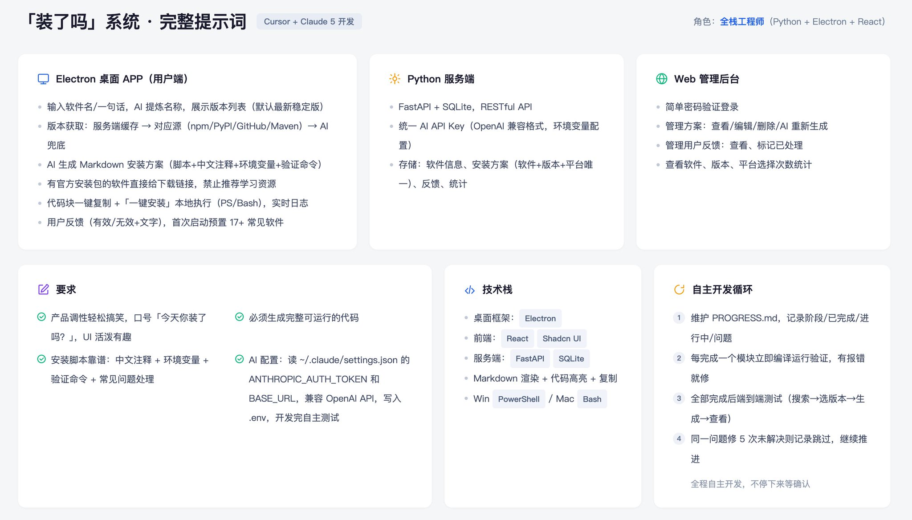

最终 AI 花了将近 50 分钟，独立完成了整个系统的开发和验证，不需要我中间插手。三个服务全部能正常启动，核心功能都能跑通。

打开桌面 APP 看看效果。主界面有一个 AI 对话框，下面预置了常见开发环境的快捷入口：

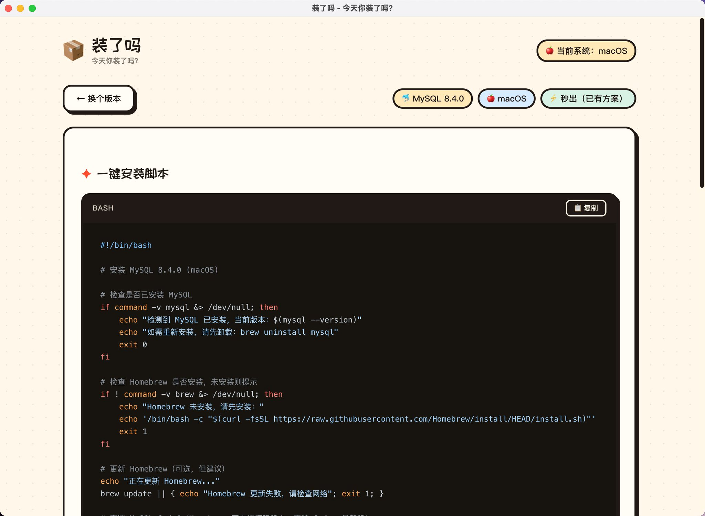

选择想安装的软件和版本后，AI 会自动生成完整的安装脚本和方案，包含中文注释、环境检测、验证命令，可以直接复制执行或者点击一键安装：

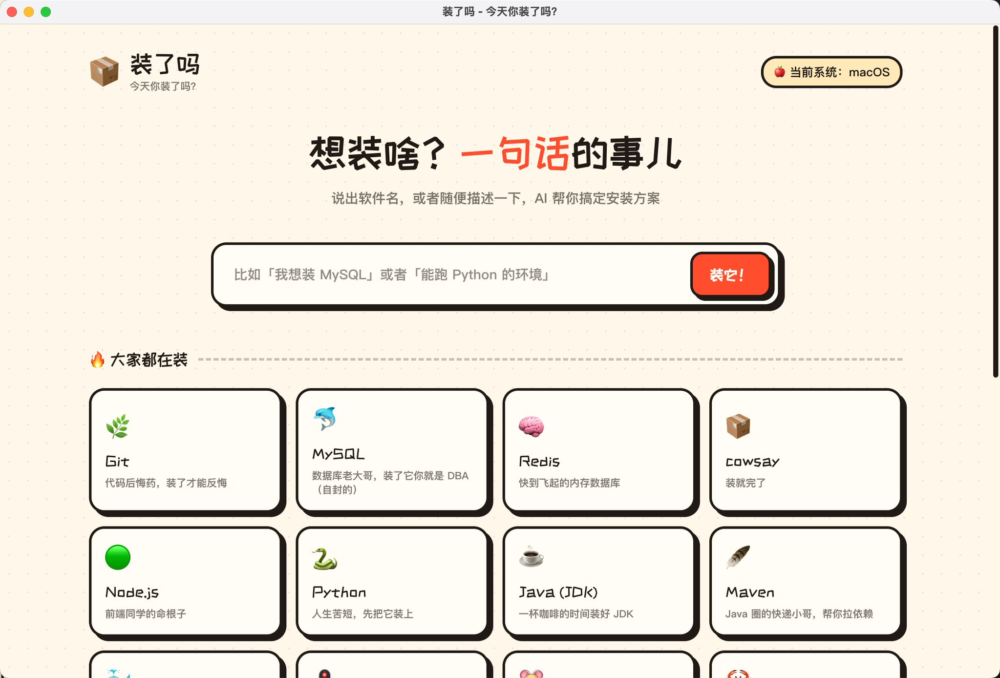

Web 管理后台也能正常运行，可以查看安装数据统计、管理所有已经生成的安装方案、查看用户反馈数据。

效果还不错吧~

这就是在没有内置 Loop 命令的工具里，通过提示词设计来实现 Loop Engineering 思想的方法。核心就是把 **状态记忆 + 反馈闭环 + 防死循环** 这三个要素写进提示词里，让 AI 自己形成循环。

这个项目的完整提示词和开发过程，我会放到免费开源的 [《AI 编程零基础入门教程》](https://ai.codefather.cn/vibe) 里面，应该能帮你学到不少 AI 编程技巧。

## 四、深入理解 Loop 的核心模块

通过前面的实战你会发现，其实上手 Loop 并不难，设定好目标、输入一条命令就能跑起来。

但如果你想设计一个更复杂、更可靠的循环系统，比如多个 Agent 并行协作、自动连接外部工具、跨会话持续运行，那就需要了解 Loop Engineering 更完整的方法论框架了。

目前业界对 Loop Engineering 比较主流的一种拆解方式，是把它分成 5 个核心模块，外加一个贯穿全程的状态记忆。

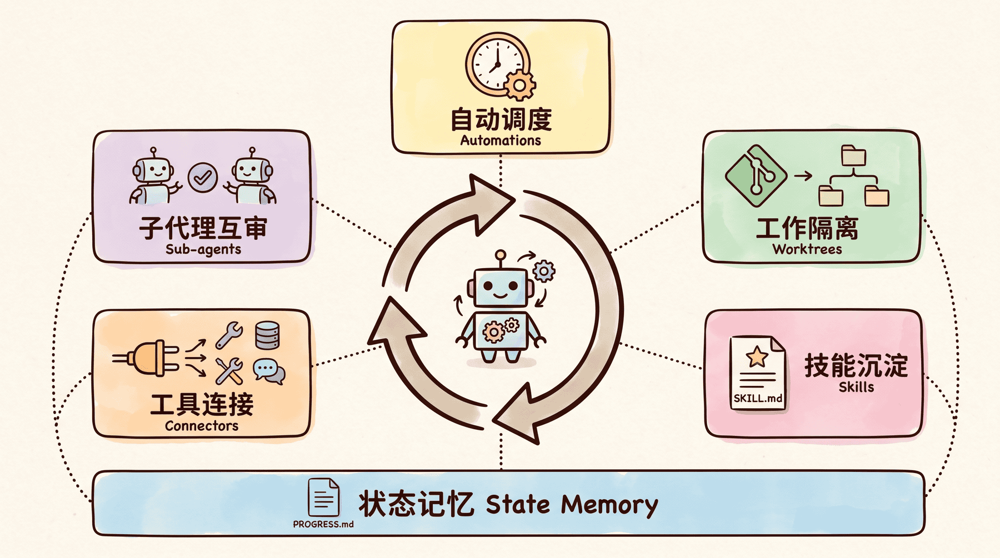

### 1、自动调度

这是 Loop 的心跳，没有它 Loop 就跑不起来。 这是Loop 的心跳，没有它Loop 就跑不起来。

你设定好触发条件和执行频率，Loop 就会按照节奏自动运行。

举个例子，你可以设一个 `/goal` 让 AI 把项目里所有的报错修完，也可以设一个 `/loop` 让 AI 每小时检查一次代码仓库有没有新的 Issue 需要处理。前者是一次性任务，后者是持续性任务，但底层都是自动调度在驱动，不需要人工干预。

### 2、工作隔离

当你想让多个 AI 同时在一个项目干活的时候，可能会遇到问题。 当你想让多个AI 同时在一个项目干活的时候，可能会遇到问题。

比如你让一个 Agent 开发搜索模块，另一个 Agent 开发商品列表模块，但它俩同时修改了主页文件，代码就会互相冲突，乱成一团。

解决办法是用 Git WorkTree，给每个 Agent 分配一个独立的工作目录，各自在自己的分支上开发，互不干扰，最后再合并回主干。

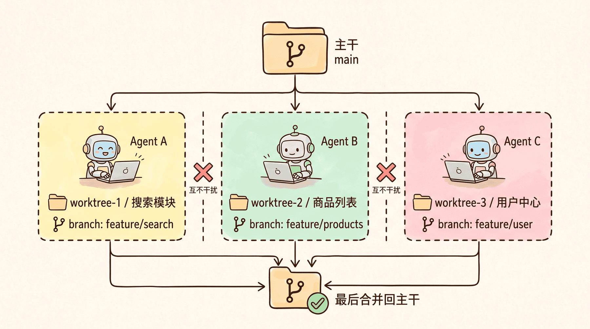

像 Claude Code 可以通过 `--worktree` 参数启动独立工作树，Cursor 和 Codex 的 Agent 面板也都内置了 WorkTree 的支持，可以自动创建和管理工作树，让多个 AI 同时干活。

### 3、技能沉淀

如果每次新开一个 Loop，AI 都要从头了解你的项目背景、编码规范、构建流程，那太浪费时间了。 如果每次新开一个Loop，AI 都要从头了解你的项目背景、编码规范、构建流程，那太浪费时间了。

Skills 就是把这些项目知识和工作流程写成可复用的 `SKILL.md` 文档，Loop 每次启动时自动加载。AI 不用每次都重新学习，直接根据文档快速上手干活。

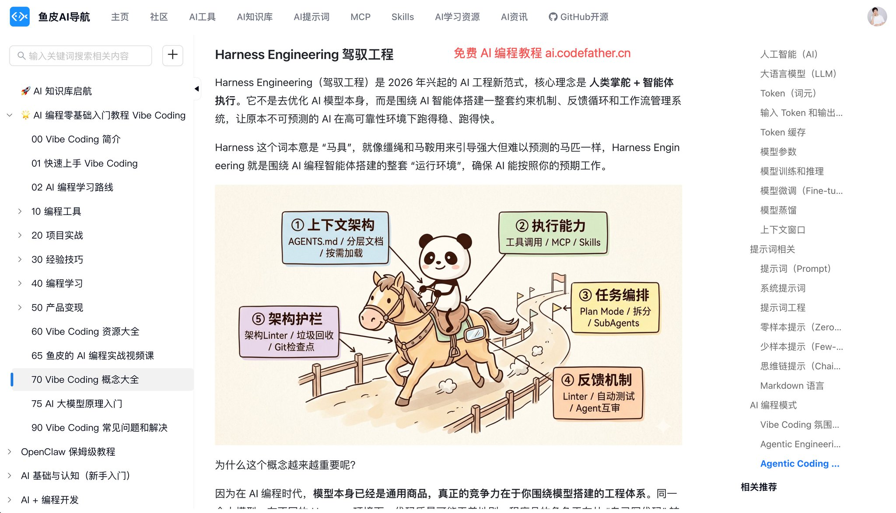

这跟你在公司维护一份《项目开发文档》是一个道理，新来的人看完就能干活，只不过现在看文档的不是人，是 AI。

### 4、工具连接

AI 大模型只是大脑，能思考、能规划，但如果不给它接上手脚和工具，很多事情它干不了。

通过 MCP 协议和各种连接器，Loop 可以跟你的 Issue 跟踪器、数据库、Slack、CI/CD 系统打通。这样 CI 挂了它能自己去看报错日志，Issue 来了它能自己分类处理，修完之后还能自动开 PR 并发消息通知你。

有了工具连接，Loop 才能从「只会改代码」变成「能发现问题、解决问题、通知你结果」的完整闭环。

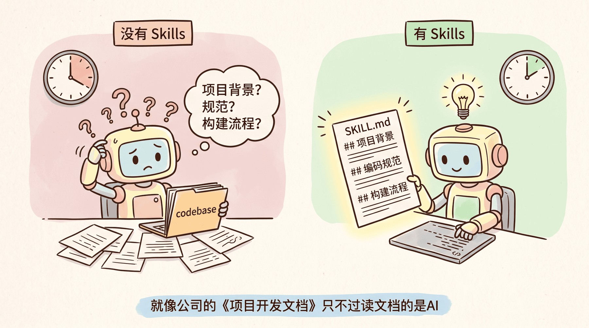

### 5、子代理互审

如果你让一个模型生成代码，再让同一个模型检查这段代码好不好，它大概率会觉得没问题。就像学生自己批改自己的考卷，肯定手下留情。

所以在 Loop 里，一般会安排至少两个角色。一个 Agent 负责写代码，另一个 Agent 专门负责跑测试和代码审查。第二个 Agent 用的上下文和指令跟第一个完全不同，它只关心这段代码有没有 Bug、逻辑对不对，不会受到第一个 Agent 思路的影响。

### 状态记忆

Loop 在运行过程中会产生大量中间状态，比如哪些文件处理过了、上一轮的结论是什么、当前进度到哪一步了。

这些信息不能只存在 AI 的对话窗口里，因为对话窗口空间有限，关掉就没了。 这些信息不能只存在AI 的对话窗口里，因为对话窗口空间有限，关掉就没了。

可以把进度记录在外部文件里（比如 PROGRESS.md），Agent 每次新开一轮循环时先读取进度了解当前状态，干完活再更新它。中间断了重启也不会从零开始。

这 5 个模块里，**自动调度** 和 **状态记忆** 是最核心的，也是我们实战中已经接触过的东西。其他几个模块（工作隔离、技能沉淀、工具连接、子代理互审）更多是在基础循环跑起来之后的进阶优化，按需使用就好，不需要一上来就全部配齐。

## 五、注意事项和学习建议

每次新技术一出来，你总会听到「XX 已死」这种说法。这次也不例外，不少人在喊：提示词工程已死，Loop Engineering 才是未来！

但其实 Loop 不是取代提示词的，它是建立在提示词、上下文、Harness 这些基础之上的。 但其实Loop 不是取代提示词的，它是建立在提示词、上下文、Harness 这些基础之上的。

如果基础都没打好，跑 Loop 只会放大问题。 如果基础都没打好，跑Loop 只会放大问题。

下面聊几个实际使用 Loop 时需要注意的事情。

### Token 消耗较多

每一次 Loop 迭代都是一次完整的提示词执行。如果你设置 1 分钟执行一次、连续跑 24 小时，那就是 1440 次 AI 调用。

你想想强烈推荐 Loop Engineering 的 2 位大佬，一个是 Anthropic 的工程师，一个背后有 OpenAI 的资源，人家用自家的模型做实验，公司报销 token 费用，成本几乎为零。但对于大多数普通开发者来说，一个月 20 刀的订阅套餐很难撑住高频循环。

**跑的不是循环，是你的钱包啊！**

有人在评论区质问 Peter：你们有无限 token 供应，我没有啊！

Peter 回答：没错，可你的时间真不值钱吗？

这句话是在提醒我们思考 **性价比**。如果一个 `/goal` 任务花了 30 块钱的 token，但帮你省了 3 小时的手动操作，应该还挺值的。但如果跑了 100 块钱，最后还是搞砸了，需要人工返工，那就是纯浪费钱了。

所以启动 Loop 之前先想清楚，目标能不能量化？值不值得跑？别让你的 AI 员工白忙活。

### 调试比提示词难 10 倍

有开发者说：所有人都在冲向 loops，但调试一个已经跑了 47 轮的状态机，比修好一个 prompt 难 10 倍！

的确，当 Loop 跑偏了，你很难定位到底是第几轮出了问题。所以一开始一定要从简单的 Loop 做起，目标设小一点、停止条件写明确一点。每轮 Loop 都让 AI 写清楚这一轮做了什么、结果如何，方便你事后追溯。

### Overbaking 过度烘焙

如果 Loop 跑得太久、目标约束又不够紧，AI 可能会开始「加戏」。比如给你的项目加上没人需要的加密功能、过度拆分文件结构、甚至为了通过测试而删除测试用例。

这个现象最早在 Ralph Wiggum Loop 的实践中就被社区发现了。Ralph 是 Loop Engineering 的前身，有人用它让 AI 在循环里不断重构代码库，结果跑太久之后 AI 开始乱加功能、乱删测试。社区形象地把这种情况叫做 Overbaking 过度烘焙。

更稳的做法是，写好清晰的需求文档，明确列出 Loop 要做什么、不做什么。还要设置合理的循环次数上限，跑完后人工审查结果，不要无脑合并。

### 学习路径

如果你刚接触 AI 编程，还在用 Vibe Coding 的方式跟 AI 对话写代码，那先不用急着搞 Loop。把提示词技巧练好，学会用 AGENTS.md 给 AI 提供充足的上下文，这是最基础也最重要的一步。

等你能用 AI 做完整功能、但经常需要手动纠偏的时候，就该学 Harness Engineering 了。给 AI 配好工具、写好测试、搭好架构约束，让它在一个靠谱的环境里干活。

这些基础打好之后，真要上手 Loop，先从 `/goal` 这种轻量方式开始就够了。给 AI 一个小目标，让它自己跑一轮，感受一下效果和 token 消耗。确认符合预期之后，再逐步加入定时循环、防死循环机制、工具连接这些进阶能力，一步步搭建更完整的循环系统。


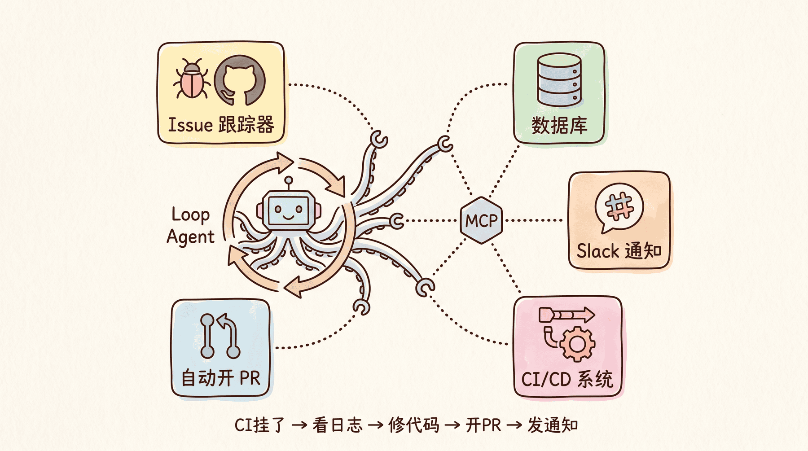

## 最后哔哔

总结一下，从提示词工程到 Loop Engineering，AI 编程的自动化程度越来越高了，也确实在一步步解放我们的双手和注意力。

以前你一下午只能盯着 AI 完成一个功能，现在 `/goal` 一开，你可以去做更有价值的事情（比如多睡一会儿）。等你回来，AI 可能已经帮你搞定了好几个小时的活儿。

但工具再强，本质上你还是那个做决策的人。Loop 设计得好不好、目标拆得清不清楚、反馈机制够不够靠谱，全取决于你自身的工程能力和对项目的理解。

Loop 是放大器，能放大你的能力，也能放大你的懒惰。

**用它来加速你真正理解的工作，别用它来逃避思考本身。**
