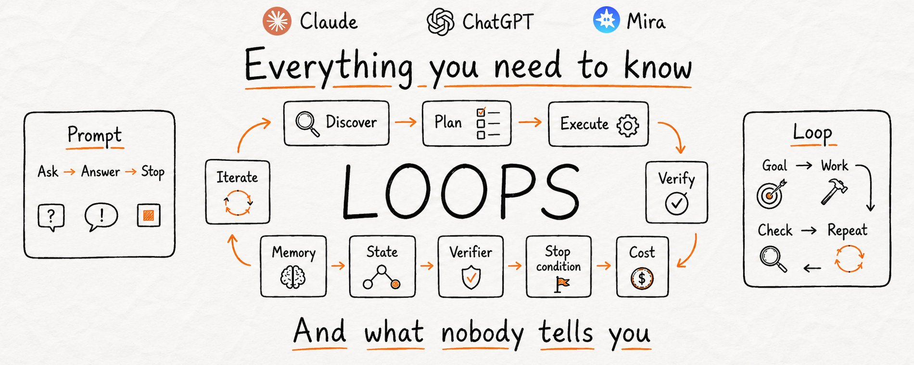

AI 已经走进每个人的生活好几年了。但绝大多数每天都在用 AI 的人，仍然在用最慢的那种方式：手动输入需求、等结果、发现问题、再问一遍——全程都是人肉。

并不是因为更快的方式有多难，而是从来没人把它的样子展示出来。

更快的方式就是 Loop（循环），而此刻它是全球最顶尖的 AI 工程师唯一关心的事。这篇文章要补上的，就是所有人都没讲清楚的那一块。读完之后，你对 Loop 的理解会超过你时间线上几乎所有的人：它是什么、底层到底怎么运转、什么时候值得用、什么时候是个陷阱、怎么在 Claude 或 ChatGPT 里自己搭一个最基础的版本，以及那些值得放到自己生活里去跑的轻量版。

开始之前，先关注一下我的 X，并加入我刚开的 Telegram 频道，那上面我每天都会发更多 AI 内容。两个都免费。

X - [https://x.com/AnatoliKopadze](https://x.com/AnatoliKopadze)

Telegram - [https://t.me/kopadzemp](https://t.me/kopadzemp)

## 大多数人是怎么用 AI 的？

仔细看一眼"一次提一个需求"的习惯，因为整个问题就在这里。每一步都要从你身上过：你决定问什么，你判断回答好不好，你决定下一步干什么。AI 不会自己动，除非你推它一把；你一停，它也停了。

这样用没问题，但有天花板。你才是引擎，AI 只是你手里的工具，而工具自己是不会动的。

还有一种完全不同的用法，这正是全球最顶尖的工程师改变自己构建方式的原因。不再一步一步牵着 AI 走，而是把目标一次性给它，让它自己跑完所有步骤：自己规划、去做、检查自己的结果、修薄弱的地方、循环往复直到目标达成。你抽身出来，工作还在继续。

> 6 月 8 日
>
> 每月的友情提醒：你不要再给编码 Agent 写 prompt 了，你应该设计 Loop，让 Loop 去 prompt 你的 Agent。

<video preload="none" tabindex="-1" playsinline="" aria-label="Embedded video" poster="https://pbs.twimg.com/amplify_video_thumb/2068028099128643584/img/WqoEwyrbdk15hRD7.jpg" style="width: 100%; height: 100%; position: absolute; background-color: black; top: 0%; left: 0%; transform: rotate(0deg) scale(1.005);"><source type="video/mp4" src="blob:https://x.com/a7791a31-a70c-4bb6-a295-5935066c645b"></source></video>



两位最受尊敬的工程师，用不同的措辞说了同一件事。大多数人看到这种话会默默划过，压根不知道它在实践里到底什么意思。那我们就把它彻底拆开讲清楚。

## 什么是 Loop？

Prompt 是一条指令。Loop 是一个目标——AI 会一直朝它推进，直到真正达成。把它理解成一个递归式的目标：你定义一个目的，AI 反复迭代，直到完成。

Prompt 给你一个答案，然后停下来等你决定下一步。Loop 自己跑完整个循环：

```text
DISCOVER  →  弄清楚要做什么
PLAN      →  决定怎么做
EXECUTE   →  把活儿干完
VERIFY    →  对照目标检查结果
ITERATE   →  还差得远？把结果喂回去，再来一轮
```

这五步里有三步干了几乎所有真正的活，也正是大家在 Loop 上栽跟头的地方。

**Verify（验证）是 Loop 的心脏。** 没有对结果的真正检查，你得到的不是 Loop，而是一个 Agent 在反复自己同意自己。检查这一动作才是把"重复"变成"进步"的开关。它可以是一个硬性测试（"代码能不能跑通"），一个可量化的条件（"数字是否大于 X"），或者一份让模型自己打分的评分标准。没有这道闸，Agent 就是自己给自己批作业，而做完工作的那个模型当评委，实在太手软了。

**State（状态）让 Loop 真的"学到东西"。** 每过一轮，AI 都必须记得自己已经试过什么，否则它会一辈子重复同一个错误。一个真正的 Loop 会在边上留一份小小的记录：什么做完了、什么失败了、下一步是什么。明天再跑就能接着干，而不是从零开始。这也是 Loop 开始变贵的地方——我们稍后会讲到。

**Stop condition（停止条件）让 Loop 不至于失控。** 一个没有出口的 Loop 会一直跑到成功、崩溃、或者把你的额度烧光。每个严肃的 Loop 都有两种停法：一种是成功，一种是硬性上限（"试 8 次之后就停下汇报"）。跳过这一步，你造出的就是一台可以通宵空转的机器。

Prompt 把一条指令交给 AI。Loop 把一份工作、一份"什么时候算完"的判断标准、一条"什么时候该放弃"的规则，一起交给 AI。

## 你真的需要 Loop 吗？

大多数文章会先把 Loop 吹上天，再告诉你在哪些场景其实是个坑。这里是真正专业的人在用的判断标准。只有当下面四条**同时**满足时，Loop 才值得搭：

- **任务会重复，至少每周一次。** 频率更低的话，搭建成本永远回不来。一次性的活儿还是交给一条好 prompt 更划算。
- **有东西能自动把烂结果打回去。** 一个测试、一次类型检查、一次构建、一个 linter、一条硬性规则。如果没有任何东西能替你把活儿 fail 掉，Loop 就只会空转。
- **Agent 自己就能把活儿干完，**端到端地干完，不是把一半塞回给你。
- **"完成"是客观的，不是凭感觉的。** 如果质量靠品味说话，那人还是赢家。

四条缺一条，老老实实当成手动 prompt 用。这件事最诚实的版本是：Loop 工程是真实存在的，但大多数人目前还不需要重型版。**每个人都能用的是轻量版，我们后面会讲到。** 但你得先知道那条线画在哪里。

## 为代码而生的那个版本

Loop 是在软件领域先火起来的，因为代码是世界上最容易验证的东西。测试要么通过，要么失败，没什么可争的，所以 AI 永远知道自己是干完了还是没干完。

一个编码 Loop 会被赋予一个目标，外加一套严格的检查方式：

```text
▸ LOOP SPEC
GOAL：/tests/auth 里的每个测试都要通过，lint 干净，没有类型错误。

EACH ITERATION：
  1. 跑测试套件，读出每一个失败
  2. 挑出影响最大的那一项失败
  3. 写出能修好它的最小改动
  4. 重跑测试、lint、类型检查

VERIFY：测试全绿 + 零 lint 警告 + 零类型错误
STOP WHEN：verify 通过，或已达 8 轮迭代
ON STOP：总结改了什么、还剩什么失败
```

往里看一层，一个真正的 Loop 由五个积木拼起来。Claude Code 和 Codex 现在都把这五块配齐了。

**1\. 自动化（心跳）**

这是把"一次性跑一次"变成 Loop 的触发器。你定义一个 prompt、一个节奏、一个目标，它就按计划自己跑，不用你每次手动启动。在 Claude Code 里，`/loop` 会按固定间隔重跑一个 prompt；`/goal` 会让一个会话一直持续到你写的那个条件真正为真；hooks 会在 Agent 生命周期的关键节点触发命令；再激进一点，把它扔到 cron job 或 GitHub Actions 里，你合上电脑它还在跑。结论会自己送过来，不用你再到处查。

**2\. Skill（可复用的指令）**

与其每次都贴一大坨指令，不如把它们存成一份文件，让 Loop 每次都去读：规则、要遵循的模式、以及一份它绝对不能碰的死清单。自动化只要按名字调用这个 Skill 就行，那份周期性跑的活儿就能一直保持可维护的状态，而不会烂在一个谁也不更新的计划里。

**3\. Sub-agents（让干活的人和检查的人分开）**

一个 Loop 里最有用的一条结构性技巧，就是把"干活的 Agent"和"检查的 Agent"切开。写出代码的那个模型，批自己作业时手太软。让第二个 Agent——指令不同、有时配上更贵、更用力的模型——去抓第一个自己说服自己的那些东西。让写手又快又便宜，让审稿人又慢又严。绝大多数质量就是从这种分离里来的。

**4\. Connectors（让它能动手，不只是会建议）**

这才是"Agent 说'这是修复方案'"和"Loop 自己开 PR、挂 ticket、build 一绿就 ping 频道"之间的差距。Connectors 让 Loop 在你真实的环境里真刀真枪地动手，而不只是描述"如果它能，它会怎么做"。

**5\. Verifier（闸门）**

测试、类型检查、构建——能自动把烂活儿打回去的那个东西。这是决定 Loop 到底是在帮你、还是在帮你烧钱的那一块。其他的都只是管线，只有这一块让它变成真的。

把这些堆起来，你就得到大团队现在规模化跑的那套东西：成群结队的 Agent 在同一个活儿上循环，一次几十个、几百个甚至几千个并行。有个工程师用这种 Loop 把整个代码库从一种语言重写到另一种语言，大概花了六天——纯手干需要接近一年。这对真正的软件生产方式是一次真实的改变。但它带了一个 demo 永远不会展示的代价。

## 没人提的那个成本

Loop 跑在 token 上，token 就是钱。问题不是每一步都花钱。问题是成本怎么复利。

Loop 每转一圈，Agent 都要重读它的上下文：目标、代码、上一次的结果、哪里挂了。这一整坨每次迭代都要再喂给模型一次，而且越喂越大。一个跑十轮的 Loop 不是十次 prompt 的钱，是十次每次都在变大的 prompt 的钱。前文那个"写手加审稿人"的招数抬高了质量，账单也直接翻倍，因为现在是两个模型在读，而不是一个。

```text
▸ 一轮 Loop 的大致成本
单个 Agent，一项中等任务：           约 50,000 – 200,000 tokens
每轮都要重发上下文：                  每次都在变长
并行的一群 Agent：                   把上面所有项乘以倍数
```

真正值得盯的那个指标，几乎没人盯，叫 **cost per accepted change（每次被采纳的改动的成本）**。不是花了多少 token，也不是跑了几轮 Loop。如果 Loop 给你十个结果，你扔掉六个，那它让你干的其实就是本来应该省掉的 review 工作。采纳率低于 50%，它花的钱比它省的钱还多。

Loop 也会静悄悄失败。工程师 Geoffrey Huntley 把它叫 **"Ralph Wiggum Loop"**：Agent 觉得自己搞定了，提前退出，活儿只做了一半，Loop 却还在跑、还在花钱、还在产出空气。没有一道能 fail 工作的硬闸，Loop 不会崩，只会安静地给你开发票。

这就是为什么重型版只属于那种既有预算又有护栏的团队：迭代上限、token 预算、枯燥步骤上用便宜的模型、配套监控。如果你不是这种团队，你并不是错过了什么——核心思路用一小撮成本、零搭建就能跑通。

## 真正能跑通的顺序

如果你真的要搭一个，顺序比工具重要。所有在生产环境里活下来的 Loop，做法都一样：

```text
1. 先把一次手动跑法打磨稳。
2. 把它固化成一份 Skill（把指令存下来）。
3. 用一个 Loop 包住它（加闸门 + 停止条件）。
4. 然后才把它挂到计划上。
```

跳过前几步、把自己都还没手动跑稳的东西直接排上计划，正是 Loop 在你睡觉时炸掉的典型姿势。先用人工跑通一次，把它练硬，再自动化。

## 自己搭一个最基础的 Loop（任何 LLM 都行）

不需要编码 Agent 也能感受它是怎么跑起来的。现在你在任何一个 LLM 里手搓一个简易 Loop 都行，一段 prompt 就够。诀窍是把 Loop 必备的三件套一次性给齐：一个目标、一套严格的成功标准、一份在它能停下来之前必须自查的协议。

```text
▸ 自查型 Loop（粘到 Claude 或 ChatGPT 里）
你会一直循环，直到任务达到标准。

TASK：
[把想要产出的东西描述清楚]

SUCCESS CRITERIA（要严格，不要打感情分）：
- [标准 1]
- [标准 2]
- [标准 3]

LOOP PROTOCOL，每一轮都按这个走：
1. PLAN   - 说出下一步要做的一件事。
2. DO     - 产出或改进。
3. VERIFY - 按每条标准 1-10 分给自己打分。
            苛刻一点。逐条列出还差什么。
4. DECIDE - 如果每条标准都 ≥ 8，打印 "FINAL" 并停止。
            否则打印 "ITERATING" 并再跑一轮，
            先修最弱的那一项。

RULES：
- 每条标准都没到 8 之前，不许宣布完成。
- 每一轮必须修上一轮 VERIFY 里分数最低的那条。
- 不要问我问题。做一个合理的假设，记下来，继续。

Begin。一直跑到 FINAL 为止。
```

跑一下看看会发生什么。模型会起草、按你给的标准自己打分、找到最弱的点、改写、再来，直到它真的过了你画的线、而不是扔给你一个看着差不多的初版。这就是 Loop。你刚用一段话搭出了一个。

但请注意还缺什么，因为这就是接下来要讲的核心。你才是触发器：你开了会话、贴了 prompt、坐在那里看它迭代。关掉标签页它就消失了。它没有排期。没有"每天早上做一次"，没有"邮件一来就叫我"。它够不到你，因为它只在你盯着它的时候才存在。

想要一个能自己跑、按计划启动、被真实事件触发、不用你盯着的 Loop，通常得踏进前面那个重型世界：工具、托管、代码、闸门、外加一张账单。

真正重的活儿，这么做说得通。但对 99% 的日常任务，已经有一个现成的、极其简单的解法。

## 同一个思路，放到你真实的生活里

剥掉代码和成本，剩下的就是一个简单、但真正有用的概念：一项任务自己跑，按计划跑，或在某个事件发生的瞬间跑，根本不用你记得去做，也不用你在场。做到这一点你不需要是工程师，你只需要为生活而设计、而不是为代码库而设计的 Loop。

有一个免费的方案，用大白话描述一下就能造一个出来。不用代码、不用托管、不用 key、不用保持一个标签页、不用去把构建顺序排对。

它叫 **Mira**，就住在 Telegram 里——你手机里大概率已经装着。你跟它聊着天就把 Loop 派下去了，Loop 在它那儿叫 Skill。每个 Skill 都安安静静地配齐了一个真正 Loop 需要的部件——触发器、动作、自己跑起来的机制——但你不用去接线。说清楚你想要什么就行。

```text
▸ SKILL
"每个工作日早上 7 点，检查我的 Gmail 和 Google Calendar。
发给我一份简报：今天最重要的 3 个会、收件箱里的紧急事项、
还有一件我答应过要跟进但还没做的事。控制在 120 字以内。"
```

这就是一个真正的 Loop。一个时间触发器、跨两个 App 串起来的多步动作、自己跑、还把结果送回到你手上。你只用一条消息就写完了它。

## Mira 到底能做什么

下面这部分是让人秒懂的地方。Mira 不是一个更聪明的聊天机器人。和 ChatGPT 的区别很简单：ChatGPT 回答问题，Mira 动手办事。你不是让它帮你写邮件，你是让它把邮件发出去。你拿到的不是一份 ticket 草稿，你拿到的是 Linear 里一张真的 ticket、还自动 assign 了负责人。它把事做了，在后台做着，在你和它聊过的每一段对话里都记得你是谁。

它通过 Composio 接入 500+ 个 App（Notion、Gmail、Google Calendar、GitHub、Figma、Stripe 以及更多），它有跨会话、跨群聊的长期记忆，而且它是模型无关的——根据任务自动跑 GPT、Claude、Gemini。下面这些就是它能做到的事。

**工作场景** 这是 Loop 的思路真正兑现、却连一行代码都不用写的地方。

```text
▸ SKILLS
"每个会前一小时，提醒我，并把和这个人上次对话的上下文和
已经做过的决定一起带上。"

"我在这里转一条消息时，把它转成 Linear ticket，
自动选好优先级并指派负责人。"

"每周五下午 4 点，汇总团队的任务状态和指标，
在群里发一份干净的周报。"

"帮我用 5 条要点总结一下我不在的时候这个群聊里发生了什么。"
```

200 条消息的群聊，它几秒就能让你跟上；ticket 在你继续聊天的同时被建好；进会之前你已经预先被简报过了。在群聊里它记得整个团队的决定和任务，不只是你的。

**创作者场景** 这是大部分人低估的部分。Mira 把内容从一端做到另一端，就在聊天里完成。

```text
▸ SKILLS
"我会发一条语音，里头是原始想法。把它做成一条成品帖子，
带上文案和 hashtag。"

"把同一个想法改成 X、Instagram、LinkedIn、Email、newsletter
五个版本，每一版用对应平台的格式。"

"给这条帖子生成 3 张候选图。"

"把这张图变成一段短视频，发到我的 Telegram 频道。"
```

语音进去，三十秒左右一条成品帖出来。一段 brief 变成六份针对不同平台原生格式的版本。图片和视频直接就在聊天里生成、修图、换背景、做吉祥物和头像、还能对口型、做动作。整条内容产线就在一个窗口里。

**语音场景** Mira 把语音当作一等公民输入，这比听起来更重要。

```text
▸ SKILLS
"把我的语音消息转成干净的文字。"
"把一篇文章读给我听。"
"把群聊里的语音消息提炼成要点。"
```

它会转写你的语音消息、把文字读给你听、听懂群聊里的语音条并把讨论归纳出来，在不能打字的时候当一个免提语音助手。

**日常生活场景** 同一个引擎，指哪儿打哪儿。

```text
▸ SKILLS
"每天晚上 7 点，问我今天练了没。给我记个连续打卡，
不让我悄无声息地断超过一天。"

"每天晚上问我 3 个关于今天的问题，把答案记下来，
每周告诉我一次哪些地方变了。"

"用盘子照片帮我记热量。"

"盯着这个航线的票价，跌到我的心理价位就下单。"

"每天早上给我一份去标题党、要点的新闻简报，只看我的话题。"
```

一个会管你打卡连续性的教练。一个真记得你、陪着你、越用越懂你的日记本。拍照就能记热量、根本不用单独装个 App。用你自己犯过的错搭出来的语言练习。一个守着票价、到点就买的航班盯盘器。一份剥掉标题党的每日新闻。

## 两分钟上手

打开 Telegram。找到 [Mira](https://t.me/mira?start=social_x_200626_howtostart)。给它发一条消息。免费用，立刻就能跑。可以先从这几个试起：

```text
@mira，帮我安排这周
@mira，总结一下这个群聊
@mira，每周一上午 9 点提醒我 review PR
@mira，把 [主题] 写一条 X 和 Instagram 用的帖子
```

文章里给出的任何一条例子，敲出来的那一瞬间就是一个正在跑的 Loop。

## 这对你到底意味着什么

Loop 不是一阵风。它是"活儿到底是谁在干"的一次重新洗牌。AI 不再等你一步步推，它会自己把整份工作从头跑到尾。但话说回来，这不是什么值得硬塞进所有地方的东西。多数情况下，你只会白烧钱。我的看法是：先从那些已经免费摆在那里的东西开始用，等你真的感觉到它不够用了，再去想你到底需要什么。

如果想跟上 AI 圈发生的所有事，关注我的 X 和 Telegram：X - [https://x.com/AnatoliKopadze](https://x.com/AnatoliKopadze) Telegram - [https://t.me/kopadzemp](https://t.me/kopadzemp)

---

> 原文地址：<a href="https://x.com/AnatoliKopadze/status/2068328135611822149">https://x.com/AnatoliKopadze/status/2068328135611822149</a>
