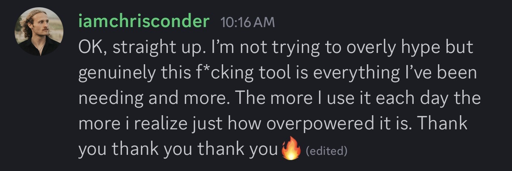
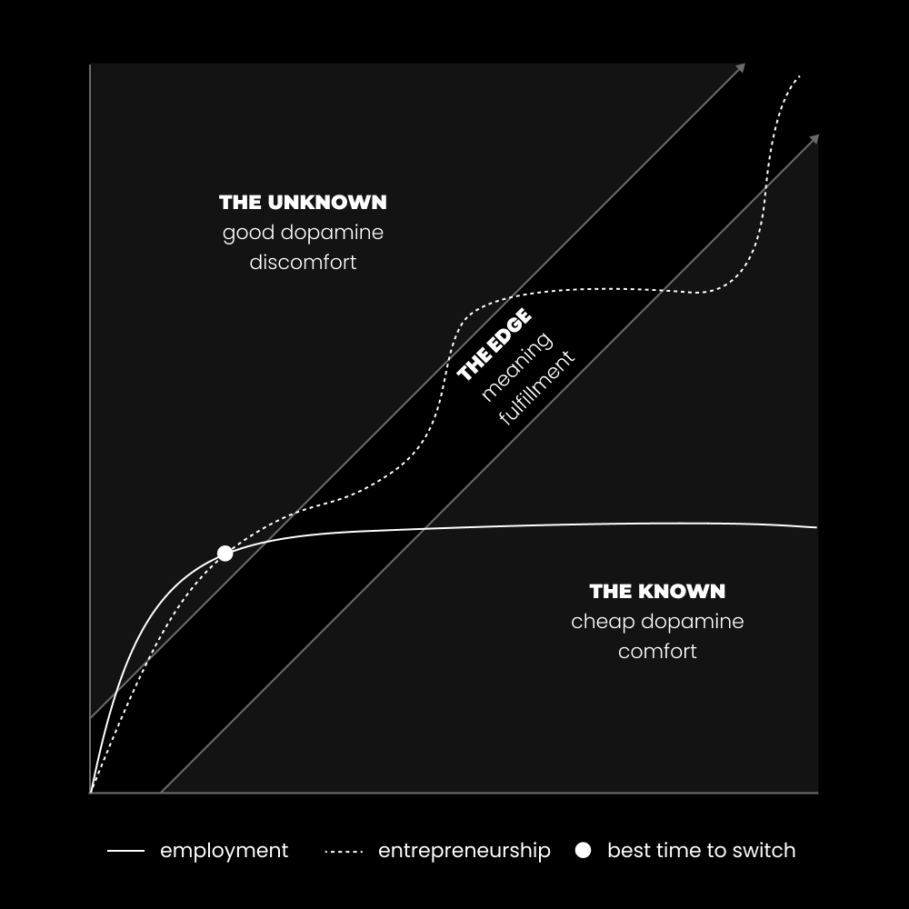
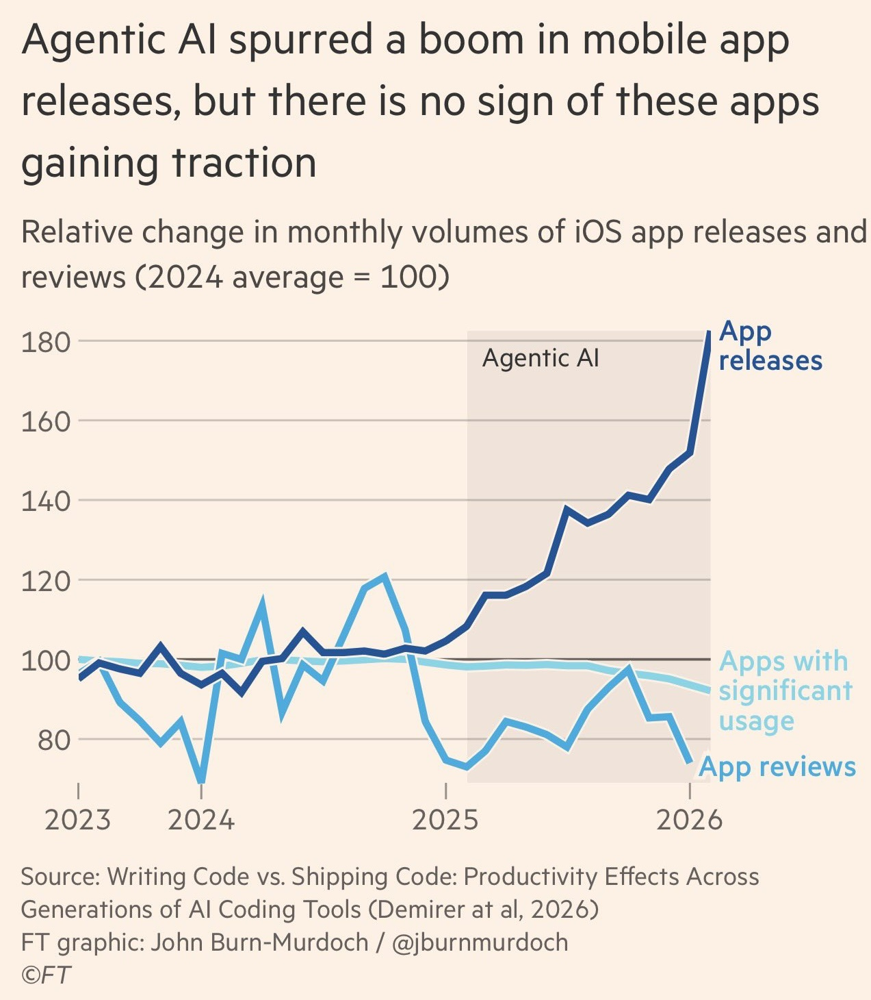
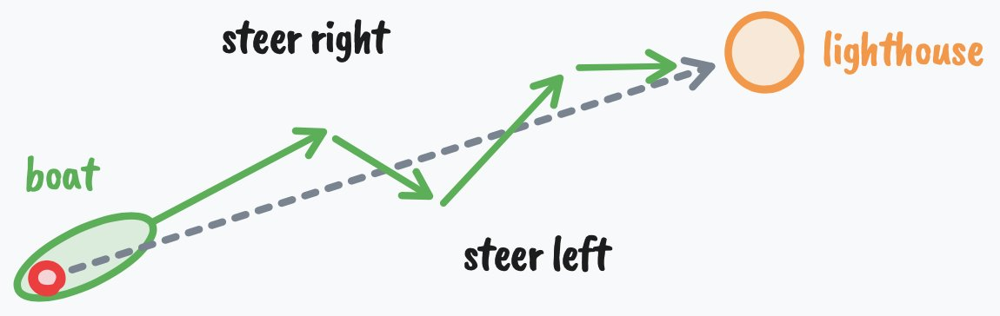

很遗憾，所有工作大概会在未来 5 秒内全部消失。

至少如果你把社交媒体上那些嗓门很大的人太当回事的话，感觉就是这样——就像我这篇文章的标题一样。

你甚至可能把"反 AI"当作自己的新身份，在网上大喊"去他妈的 AI"，好让自己感觉好像在做出改变，却没真正改变自己的行为、没去拓展技能、也没去适应这个新世界——毕竟谁愿意去做这些事呢？谁又会想去成长呢？

AI 并不是你以为的那种威胁。

真正的威胁，自古以来就一直存在：

**你的生存和福祉，依赖于除你自己之外的所有人。**任何形式的技术都会威胁到这种依赖。你的雇主和政府有自己的生存要照顾；当某件事威胁到他们的生存时，他们就会退回到一种更低层次的思维模式，迅速尝试化解威胁。这就是人性。你可以争辩说他们"理应"关心你的福祉，但如果你盲目相信他们会说到做到，那你注定会非常、非常失望。

AI 太大了，大到你靠哭喊根本控制不了它。

在社交媒体上发"我有多恨 AI"的帖子，不会阻止工作岗位被替代（且不说它们到底会不会被替代，先顺着我说两句），更不会阻止"通往成功所需的技能"随着技术一起改变。

我写这封信的初衷，是想同时给你**视角**和**一个潜在的解决方案**（这个方案其实从远古时代就存在了）。

我有 4 个想法要和你分享，关于工资奴役、关于变得高能动性，以及关于为什么这些想法除非你从根本上改变自己，否则全都毫无意义。

最后，我会附上一个简短的练习，包含 6 个问题——哪怕看起来再简单，它也许能为你打开一扇通往新生活方式的门。

**在开始之前，自我宣传，两件事（如果你讨厌别人打广告，可以跳过）：**

1. [@edendotso](https://x.com/@edendotso) 现在为所有平台（包括 Substack）提供社交日程排期功能，还能研究任何平台上的爆款帖子，并且你可以全程在 Claude 里通过 MCP 完成——这是一套完整的内容工作流。[首月 5 折优惠点这里](https://eden.so/)。
2. 下一期个人品牌训练营将于 7 月 8 日开营。你将学到 AI 时代真正需要的技能组合，以及如何定位你自己的品牌和业务。[在报名截止前加入](https://eden.so/bootcamp)。

好了，广告打完了，下面进入正题：

## 一、 如何逃离工资奴役

> **工资奴役**，就是做那些你并未选择、毫无意义、又苦又累的工作，为别人打工，仅仅是为了活下去。

我并不反对工作。

我认为工作是积累实战经验和技能的、有价值的踏脚石。

但每当我对工作发表"负面"评价时，总会有人忍不住跳出来说："你是个白痴！我其实挺享受我的工作的！"

挺好。我这话不是说给你听的（而且我部分地认为你只是在撒谎，好让自己不必面对自己的潜力，同时又对这种自我欺骗毫无意识）。

我要对那些说的，是真正懂得"享受"这门心理学的人——是那些无法忍受这种生活的人：人生的三分之一在从事自己并未选择的工作，三分之一已经精神疲惫到做不了任何有意义的事，三分之一在睡觉……这样的日子，要过 40 多年。

你看，愉悦、意义和成就感，都来自"**活在自己能力的边缘**"。这一点早就有相当充分的研究了。我就不引经据典了。愉悦来自于追求一个"刚好比你当前水平高一点"的挑战。太难会让你焦虑，太简单会让你无聊。电子游戏正是利用了这一点——你接的任务难度刚刚好；因为如果你是 1 级角色去做 100 级任务，你会瞬间暴毙然后讨厌这个游戏。这是进入**心流（Flow）状态**最强的单一触发因素；如果你能搭建出一种能提高这种心流触发概率的生活结构，愉悦感就会源源不断。

工作的问题在于，几个月之后，你就掌握了所有需要知道的东西。你就是打卡上班、做任务、打卡下班。你会觉得无聊。这违背了你的天性。你能感觉到。你的注意力不再沉浸在这些任务上，而是转向了"我还能做点别的什么？"对大多数人来说，这个"别的什么"并不涉及什么有意义的目标，而是打开手机、给大脑放毒。很少有工作会要求你持续提升技能去匹配更高的挑战。

沿着职业阶梯往上爬可能会有点帮助，但问题还是一样——你无法控制挑战的难度。你不是在从事自己的项目。好奇心、热情、使命感、自主性和精进感——也就是心流的五大驱动力——必然是匮乏的。

这和工资奴役有什么关系？

嗯，文明几乎可以说是建立在"部落奴役其他部落"之上的。这种动态从未消失，只是抽象成了雇佣关系、法律和文化。**社会本质上已经变成了一种金字塔骗局。**底层的人比顶层多，从数学上讲就不可能每个人都站在顶层。一个老板，多个员工，都依赖老板来获取生存。

我们大多数人都是按照工业化标准被培养长大的。

成为专家。死磕一个领域。找一份高薪工作，让朋友们觉得我的儿子/女儿很成功。因为你就是这么做的，所以你对这套流程的大部分环节都视而不见。你只懂用来完成工作的一项技能，却没有去弄明白是哪个系统在给你发工资。你没有花时间去研究其他领域，所以你不知道如何打造属于自己的事业。你唯一会做的，就是在别人的事业里扮演一个角色。

不知不觉间，你的思考能力被磨灭了，哪怕你曾被认为在自己选择的那项技能上"很聪明"。你拿着还过得去的薪水，但财务上并没有真正的安全感，于是你陷入了一种混乱的压力循环。压力会让思维变窄，要想象一种"自己打造一番事业"的生活，变得更加困难。

你没有资本去做想做的事。没有时间进行个人成长。你大概也已经太累了——是精神上的累，不是身体上的——以至于没法重新教育自己，因为你醒着的大部分时间，都在喂养别人的愿景。

顺便说一句，**这就是你在"大规模替代"中存活下来的方式——全情投入到自己的事业上。**

问题是，奴隶并不知道自己是奴隶。

这远远超出了工资奴役的范畴。我们都是奴隶——通常是以某种方式，沦为意识形态和信念体系的奴隶。

奴隶制关乎"强制"。我们一听到这个词，脑中浮现的就是肉体形式。但工资奴役是财务层面的。**如果你无法停止上班、否则就会面临灾难，而且你没有创造替代方案的技能，那你就符合"奴隶"的定义——不管你的"感受"怎么说。**

更糟糕的是，如果你把自己的工作等同于自己，你可能会把上面这些话当成一种人身攻击。你会感到威胁反应。你会想跟我争辩，这没关系，但这只会进一步证明我的观点。

我想你明白我的意思了。

这很难听。我也不喜欢这个事实。

让我们谈谈现在有哪些可能性，以及你能做点什么。

## 二、 成功的五大要素

> **如果你不主动设计一套日常流程，别人就会替你安排一套。**

大多数人在人生的大部分时间里，被训练去学一些自己不想学的东西，去找一份自己不在乎的工作，去为那些你日常生活中绝对不想沾边的人打工。

虽然我认为 AI、技术和社交媒体加速了我们认清"上学和上班并非唯一出路"这一事实的过程，但我同样认为，人们只是厌倦了周围世界那种彻头彻尾的虚无感。

对于那些已经厌倦了默认人生路径的人来说，要想变得"面向未来"，有五大要素——它们可以让你在所有工作都可能被替代的时代，依然从事有意义的工作：

1. **能动性（Agency）**——"不需要许可、说干就干"的能力。看到机会就去行动，没人要求你也照样做。
2. **品味（Taste）**——知道什么值得呈现在世界面前的阅历。
3. **说服力（Persuasion）**——让人们在乎你所做之事的技能。注意它和"操控"的区别。
4. **坚持（Persistence）**——明白"犯错不等于完蛋"，并且犯错是必经之路。
5. **迭代（Iteration）**——基于反馈、朝着目标不断纠错的过程（如果行不通，就学习、调整方向，直到成功）。

现在所有人都在痴迷于"高能动性"。

我懂。这很重要。所有科技圈的人都在互相抄作业，一遍遍强调"高能动性"有多重要，殊不知这种强调本身就在暴露他们其实很低能动性。

没错，你需要具备主动朝目标发起行动的能力。这是区分创业者与员工的最显著特质之一。**创业者是那些把某样没人要的东西主动推到世界上的人。**

但这只是创业者拼图的一块。

上面这五大要素，其实可以归结为两项能力：**搞明白怎么做的能力**，以及**知道需要做什么的阅历**。

> AI 至今确实非常擅长"资产生产（asset creation）"，但"爆款打造（hit creation）"并不等于资产生产。资产生产是爆款打造的必要不充分条件。任何人上周都能做出一款电子游戏，就像 5 年前任何人也能做一样。这项技术唾手可得，已经商品化了。你知道每年上架多少款手机游戏吗？成千上万。你知道每年能诞生多少爆款吗？零到五个。—— Strauss Zelnick

现在任何人都能做出任何东西。这意味着创业（也就是工资奴役的解药）的进入门槛在持续降低，但说实话这并不重要：

此刻的你可以走出去做一款 App。

不是下一个 Notion，而是一款功能范围可控的 App 或工具，专注于一个真实有益的、人们真正想要的成果。这种东西不需要成为爆款才有价值。

我其实挺建议你做这个的。我认为**软件将成为下一代信息产品**。我的意思是——构建软件将成为创作者、个体创业者以及其他"一人公司"的默认选项。信息产品之所以主导了这么久，是因为任何人都能创作，但这当然不意味着它们全都成功了。

问题就出在上面那张图里。

你能做出任何东西，但这并不意味着：(1) 它值得被做；(2) 人们会在乎它；(3) 你有能力根据反馈不断迭代和坚持，直到它变成一个"值得做、且有人在乎"的东西。

如果你真的理解了上面这句话，你将来就不会差。

第二个问题是：能动性、品味、说服力、坚持和迭代，并不是那种你上 YouTube 看几个视频就能掌握的"高价值技能"。

光看理论、刷推特，并不会让你变得更有能动性。

**练习它们的唯一方式，就是开始做自己的事。**

## 三、 应对雇佣制的解药，是让自己"无法被雇佣"

我永远记得拿到第一个网页设计客户的那一天。

我记得他们付了我 300 美元，做的是一个手写的、巨丑的网站。客户是当地一家床垫公司，他们只是想在网上有个地方展示自己的床垫。

就这些。

300 美元。

那一刻我顿悟了。我意识到，只要我能重复、改进、迭代我刚才赚到这笔钱所做的事，我就终将能对自己的生活方式和未来获得更多掌控。它让我变得"无法被雇佣"。它在我心里种下了一个深深的信念：我绝不会再接受一份工作，我要自谋生路——听着很戏剧化，但确实是这么回事。

但仅仅是 300 美元这个数字本身，无法解释走到那一刻所经历的一切——身份的转变，以及说服自己相信这一切"有可能"的自我心理建设。它也无法解释我在接下来 7 年里学到的东西。

我想给你两样东西：**一次身份转变的起点**——让你成为那个"真的无法被雇佣的人"，而不是那个"嘴上喜欢这个想法的人"；**一份任何人都可以用自己的方式立即上手的行动计划**。

## 1) 把自己扔进一个强制你成长的环境里

> **改变人生最快的方式，就是把自己从（物理和数字）环境中连根拔起。一夜之间改变一切：你去的地方、你关注的账号、你消费的信息等等。这很难，但它绝对有效。**

**行为改变 = 身份改变。**

你可以试着去节食、减掉 30 斤，但如果你不是一个重视健康的人，也不享受健康的生活方式，那你会永远觉得自己在逆风爬山。你会和大多数人一样，把减掉的体重全反弹回来——除非你从根本上改变"你是谁"。

怎么做到呢？

首先，了解一下你是怎么变成今天这个样子的，会有所帮助。

- 你出生在一个有特定价值观的家庭和文化里
- 你被灌输了这些价值观，哪怕你父母并未强加给你
- 你走进了一所带有特定价值观的学校，由持有特定价值观的老师教导
- 你接触到了海量的信息，这些信息可能已经把你的价值观带向了反叛、懒散和受害者心态
- 你拥有了一部手机，而随着社交媒体和我们无法自控的"猴脑"登场，这种条件反射式塑造的过程呈指数级加速

当然实际过程还要更复杂，但你明白意思就行。

现在，这套过程本身并不坏，它某种程度上是必要的。

我听过很多"真实至上"主义者说他们讨厌"模仿"或抄袭的想法，可他们依然用两条腿走路、说英语——因为那就是你应该做的。你去模仿，这叫学习。

**真正变坏，是当你的行为与"你内心真正呼唤的生活"不再契合的时候。**那个在你耳边低语"你注定不止于此"的声音。

要想开始"再塑造"的过程，起点是你的环境。

**你必须对所有刺激保持极度清醒，因为它们都在喂养"你是谁"。**

你要做的事情是：

**今晚就把开关拨过去。**

明天醒来，今天做的所有事都不重复——哪怕只是一天。

换一个时间设闹钟。计划好你醒来之后要做的每件事。换不同的食物吃。换不同的人聊天。换不同的内容消费。一切都换。

随着推进，你会慢慢搞清楚，你应该往哪个方向去精心布置你的环境。

## 2) 选择一个"反馈最贴近现实"的容器

最危险的生活方式，是远离"持续试错"的生活方式。

远离"纠错过程"，就等于远离了挑战、发现、以及那种来之不易的智慧——而正是这些，才带来成长、才带来成就感。

这不仅适用于"挑战难度在你熟悉任务后会趋于平淡"的工作。它同样适用于商业和创业，**也适用于那些带着"员工心态"的人**：永远需要有人告诉他该做什么，或者永远需要一份操作手册才能对自己的行动有信心。

我想问你：

互联网出现之前，人们是怎么搞清楚一件事的？在"怎么做"指南和逐步流程还没有铺天盖地之前，第一枚火箭是怎么造出来的？

他们去试。他们失败。他们没有让失败说服自己相信"这不可能"，也没有让自己迷失到去追逐短暂的快感。他们根据现实给出的反馈，设定新的方向。最终，他们在草堆里找到了那根针。

他们很聪明。

因为一个智能系统的标志，就是它能根据反馈不断修正航向。它心中有一座灯塔，即使被吹偏了航线，也绝不放弃。

当我谈论创业时，我说的就是这个。

我说的是**回归你的天然状态**。回归创造。追求那些"必须经历失败才能达成"的目标。

这是大多数成功人士唯一的共同特质。

对他们来说，失败不是一个负面概念，而是美好人生中一个恒常存在的、必不可少的常量。

这些话听起来都很美，但你究竟如何把它应用到今天的世界里？

## 3) 想在未来蓬勃发展，先学这两项技能中的任何一项

> **代码和媒体是"无需许可的杠杆"。它们是新富阶层背后的杠杆。你能创造出即使在你睡觉时也在为你工作的软件和媒体。**—— Naval

作为初学者，作为一个人，你并没有意识到你手头能调动的杠杆有多少——尤其是在 AI 时代。

我说的不是那种初级用法——那种偶尔向 ChatGPT 问几个问题的用户，以及那种因为 AI 偷了他们的作品而对 AI 暴跳如雷的艺术家。

我说的是那种"**理解你几乎可以构建任何东西**"的层级——因为 AI 把你推入了"试错"的洪流。当然，前几次的输出大多不是你期待的样子，但只要你具备能动性、迭代、坚持、并且在不断积累品味，你几乎可以构建任何东西——而且这种可能性还会越来越强。然后，如果你还具备说服力，你构建出来的东西甚至能让你睡着的时候也赚钱。

这在 AI 出现之前当然就已经可能了。核心问题在于，大多数人并不理解：**只要你拥有成功的五大要素，并且愿意给这件事足够长的时间跨度，几乎一切皆有可能。**AI 只是让你"做得更多、更快"，并且让你接触到以前接触不到的事物——比如创建软件的能力，以及一种被极大增强的学习和研究能力。

说到这里，**我认为媒体比代码更重要。**

而这里说的"媒体"，我们谈的是内容。

帖子、视频、播客或写作——你只要发布一次，就可能被成千上万乃至数百万人看到。在我看来，这才是"未来值得拥有的技能"，尤其是在更多人试图用 AI 包打天下的时候。

因为做内容，你需要知道什么是"好"。

你仍然需要一些 AI 没法给你的教育——因为你还没真正开始"试错"的过程。你不知道该问什么。

内容的价值是主观的。每一个读到你写下的每句话的人，都会有不同的解读。换句话说，**没有任何一种"对的写法"能保证出结果**。

代码的价值则相对客观。你怎么写其实无所谓，只要能达到你想要的结果就行。就像前面说的，手机应用比以往任何时候都多，但它们的下载量和使用量实际上反而在下降。

为什么？

**因为它们没有"分发渠道"。**它们不懂媒体和内容。没法让别人来用，更没法让别人在乎到愿意为之付费。

> 顺便说一句，我说的不是那种 Instagram 上的"我把 Claude 接到了我的社交媒体账号上，一夜之间涨了 10 万粉"的内容。**那玩意儿几乎毫无价值**，除非你正在通过叙事和权威性建立信任与忠诚。你可以在 [Eden](https://eden.so/) 里做到这件事，但前提是你得知道自己到底在做什么。

正如 JK Molina 说的：**点赞不是现金。**

有智识的内容创作，远不止是发布挑动情绪的诱饵来收割点赞和关注。

顺便说一句，如果你还没猜到的话：为了实现身份转变，你所置身的环境，应该由那些与你想要的生活相契合的人、地方和习惯触发器组成。这本身就是其中一部分。

## 四、 如何开始——留出 15 分钟改变你的轨迹

你已经改变了你的环境。

你已经选好了你的"容器"。

你已经知道"媒体胜于代码"——因为内容的价值在于"观者眼中"，而 AI 生成的内容一旦普及就会迅速商品化，反而为真正的创作者——无论他们是否使用 AI——腾出了空间，因为再强调一次，**AI 不是问题所在**。

现在，你需要回答唯一重要的问题：

**你的人生事业是什么？**

我们要构建的，是一份"人生事业"，而不是一份"个人品牌"。

Peterson、Huberman、Watts——他们都有"个人品牌"，但这些品牌都深度契合他们的使命。他们清楚自己想要什么，并且把社交媒体当作"实现它"的工具。因为社交媒体，加上 AI，就是你作为一个个体"以一当多"所能调动的技术——你大概率不会靠上电视、上广播、或者说服出版社帮你出书来从零起步。

（当然，Alan Watts 本人并没有刻意打造"个人品牌"，但他确实有，道理是一样的。）

他们的个人品牌，就是他们本身。

就是他们的身份。

如果你想亲眼看着"你的身份"活生生地呈现在你面前，只需走一遍 [Eden](https://eden.so/) 的欢迎流程。它会把它构建成一张你可以探索的图谱。

大多数人喜欢这个理念，但很快就会卡住。他们会去追求那点短暂的快感多巴胺，搜"用内容创作赚 6 位数的最佳赛道是啥"，而不去深挖他们已经拥有的、来自多年积累经验和故事的价值——他们觉得这些价值一文不值，因为对他们来说那太"日常"了。

**你人生事业的原材料，已经埋在你的内心深处了**，被多年来的"要专精、要实际、别问那么多问题"所掩埋。这个过程不是要给你一个全新的、前所未有的点子，而是要帮你看见：你其实早就拥有了它。

认真对待这件事。

关掉你的浏览器标签页。打开一个空白文档。设定一个 15 分钟的倒计时。把下面每个问题都写下来回答。别跳过那些让你不舒服的问题。

### 第一步：挖掘你的原材料

那些让你变得有意思的东西，大部分已经被训练得从你身上消失了。你的好奇心被当成"分心"。你广泛的兴趣被贴上"不够专注"的标签。这个系统想要的是一个听话的工人。

你的内容只有在"真正属于你的原材料"基础上，才能发挥威力。

回答下面这些——如果一时答不上来，先跳过，让问题在潜意识里慢慢发酵：

- 哪些东西你懂得多到不可能是巧合？你曾跨几十个来源、花好几年自发研究过哪些主题，且期间没人付你一分钱？
- 你曾为自己解决了什么"你以为别人早就会了"的问题？什么东西对你来说是自然做到的，却让其他人都崩溃？
- 你小时候因为什么事情挨过训，但其实那只是你"早期品味"的表现？在别人告诉你"这不切实际"之前，你曾痴迷过什么？

现在圈出一个答案。那个让你有所触动的那一个。**那就是你的原材料。**

别去纠结你的细分领域、内容支柱之类的东西。去关注你想法的质量，因为最终决定输赢的就是这个。

### 第二步：命名你"反共识的脊梁"

没人需要又一个人把常识换个壳重新包装一遍。你的内容需要一种"只有你能看到"的视角。这种视角来自于"你坚信而主流是错"的那一件事。

**品味不是知道什么是好的。品味是知道什么是坏的，并且无法移开视线。**

回答下面这些：

- 哪些主流建议实实在在地让你的生活变糟了？你不得不"卸载"掉哪些东西，才让自己重新变得有功能？
- 关于你所在的领域，你相信什么——专家们会觉得这种想法天真，但你就是无法动摇？
- 你们行业里，所有人都在假装看不见的东西是什么？

把第一步和第二步的答案放在一起看。它们重叠的地方，就是你的方向。

**这些问题的答案，就是你的第一篇内容。**

最好的品牌，就是那个人的世界，被公开发布出来供人探索。

### 第三步：明天就发布你的第一个想法

这是一封信，不是一门课。

我真希望能在这里给你 20 个模块，但我做不到。那是 [训练营](https://eden.so/bootcamp) 才有的事。

"告别财务上对他人依赖"的最后一个要素，其实就是**真正去做那件事**，而真正去做那件事，要从"一篇内容"开始。

你刚刚其实已经在上一步写下了内容选题。

挑一个。

想想怎么把"开头钩子"写得抓人眼球。

想想怎么让"正文"产生冲击力。

接受第一个版本会很烂这个事实，因为你没法改进一个不存在的东西。

如果你想要一点小帮助，这里有一个 [提示词 / 技能](https://app.eden.so/prompts/angle-generator) 帮你头脑风暴角度、起草变体，让你对"好"长什么样有个直观感受。这些都是基于"什么有效"的原则构建的。我们之前在 [社交媒体涨粉其实很容易这封信](https://letters.thedankoe.com/p/growing-on-social-media-is-easy-actually?lli=1) 里谈过类似的话题。

你的任务很简单。

从第一步挑一个答案，从第二步挑一个答案。把它们组合成一句"只有你能写出来"的话。然后在明天把它作为你的第一篇内容发布出去。一篇帖子、一个视频、一封邮件都行。形式（暂时）不重要。

现在，你就拥有了来自现实的反馈。

如果行不通，**很好，你必须去学习**。你必须去研究、在下一篇里尝试某种说服技巧，然后再下一篇、再下一篇——直到你精通这项技能，因为技能的习得本质上就是在遇到问题的过程中不断叠加技巧。

如果你此刻正在说"我希望这能更落地一点"，那你是盲目的。**我刚刚已经给了你能做任何事的公式。**

而你刚刚从自己脑子里得到了一条"未被识别为需要修正的错误"的反馈。

就这样。

下一封信见。

– Dan

---

> **来源**：[https://x.com/thedankoe/status/2069186019560394833](https://x.com/thedankoe/status/2069186019560394833)