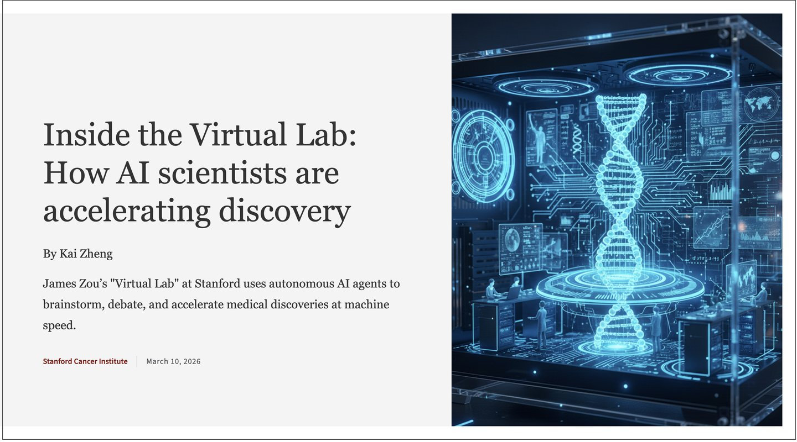

# 引言

人工智能进入科学已经十几年，但前十几年它干的基本是一件事，读数据、找规律、做预测，AlphaFold是这条路的顶点。2024年以后情况变了，一批以大模型为内核、能自己规划和动手的系统，开始把AI推到"主动做"的一侧，自己提假设、设计并执行实验、写论文、失败了再迭代。这类系统被统称为科研智能体（scientific agents），它们撑起的研究范式，业界叫AI for Science（下文简称AI4S）。

围绕AI4S，最常见的两种判断恰好都偏了。一种被惊艳的demo唬住，以为"AI科学家"快要成真。另一种把它当成又一轮炒作，看不起。这篇文章想绕开这两种情绪，先把版图诚实地画出来，它到底是什么、长什么样、真实地走到了哪一步。至于谁在为它买单、机会又在哪，留给接下来的续篇。

下面六章这样走。第一章讲范式本身，AI怎么从"读科学"跨到"做科学"。第二章厘清概念，到底什么才算科研智能体。第三、四章用纵切（科学工作流的六个环节）和横切（四层基础设施）两套框架，把已有的系统铺开。第五章按学科扫描钱和热度的分布。第六章给一个尽量诚实的成熟度判断，能力到哪、可靠性到哪、真发现到哪。

# 第一章 从"AI 读科学"到"AI 做科学"

## 1.1 当 AI 自己设计出能用的分子

2024年，斯坦福等机构的一组研究者搭了一个叫"虚拟实验室"（Virtual Lab）的多智能体系统。几个扮演不同角色的AI，主持科学家、免疫学家、计算生物学家、批评者，围坐在一起"开会"，讨论怎么应对新冠病毒的变异。它们提出方案、互相质疑、收敛结论，最后给出一批新的纳米抗体（nanobody）候选。这些候选随后在真实的湿实验室里被合成、验证，确有部分能结合目标病毒（Swanson et al.，2025年发表于Nature）。

把这件事拆开看才显出分量。提出科学假设、设计验证路径、产出能被实验证实的新分子，这本该由一支训练有素的人类科学家团队走完，而其中相当一部分由AI自主完成。几乎同期，劳伦斯伯克利国家实验室的"A-Lab"展示了另一种形态，一个真正的自动化材料实验室，机器人按AI的决策自主合成、表征新材料（LBNL 2023, Nature）。再往前，Boiko等人（2023, Nature）已经证明，一个LLM驱动的系统可以自主设计并执行化学实验。

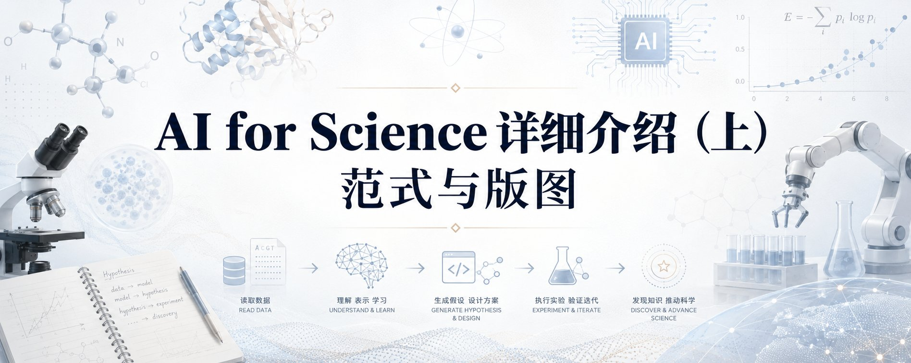

聊天机器人只会告诉你实验该怎么做。这里不一样，是AI真的把实验做了出来。业界把这个正在成形的研究范式称为AI for Science（下文简称AI4S），而这篇文章要刻画的，正是这场转变的起点。

## 1.2 范式转变：从分析工具到行动主体

要理解它的新意，得把它放进AI进入科学的历史里看。第一阶段，AI是"计算器的升级版"，用机器学习做回归、分类、降维，替科学家处理人力算不动的数据。这一脉的高峰是AlphaFold，它把蛋白质结构预测从难题变成了基础设施。可它本质仍是"读"，给定氨基酸序列、预测结构，是一个极强的预测器，却不会自己决定"接下来该研究什么"。

第二阶段，也就是这篇的主角，是AI从"读"跨到"做"。系统不只输出预测，还要承担科学方法本身的环节，规划、决策、调用工具、操作设备、解读结果、修正方向。多篇综述用"自治层级"来刻画这一跳，把LLM在科学发现里的角色分成"工具 / 分析者 / 科学家"三级（From Automation to Autonomy, EMNLP 2025），或"助手 / 伙伴 / 化身"三级（Hitchhiker's Guide to Scientific Agents, 2025）。无论哪套词，核心都一样，自主性（autonomy）的提升，才是这一代系统区别于上一代的根本。

这个转变之所以要紧，是因为科学的瓶颈往往不在"算得快"，而在"想得对、做得动"。一个能自己提出好问题、设计好实验、并把实验真正做下去的系统，触及的是科研产能的核心约束，不只是某个计算环节的提速。

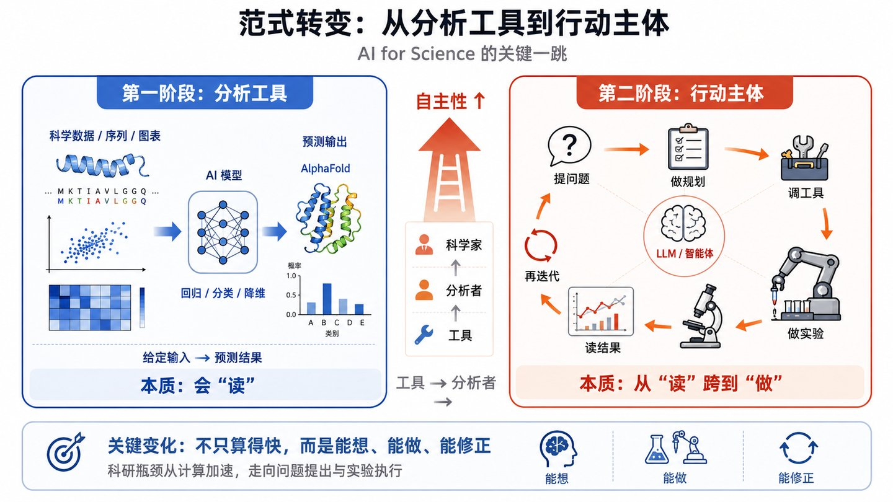

## 1.3 为什么是这两年：能力拐点与"数据耗尽"

那为什么偏偏这两年集中爆发？这是因为两股力量叠在一起。一是能力侧的拐点。2023到2024年，大模型跨过了两道门槛，一是长链条的推理与规划，二是可靠地调用外部工具（搜索、代码、数据库、实验设备接口）。这两件事一旦成立，"让AI自己干一长串活"才从演示变成可能。2025年一批agentic系统密集出现，2026年进入落地检验期，竞争焦点从"能不能做出来"转向"能不能在真实环境里可靠地做"。

二是数据侧的逻辑，这点更深，也更关乎资本，留到中篇展开。前沿大模型已经快把互联网上的高质量文本用尽了，下一批高价值的数据增量从哪来？一个越来越被接受的答案是真实世界的科学实验。让AI去做实验、生成此前不存在的物理与生物数据，被很多人看作突破数据瓶颈的关键路径。这把"AI做科学"从一个学术理想，变成了产业和资本严肃押注的方向。钩子先埋在这，中篇再讲它怎么重塑了整个赛道的资本运作。

# 第二章 概念厘清：什么才算"科研 Agent"

"Agent"是2025年以来被用得最泛的词之一，泛到几乎失去信息量。要让后文的版图站得住，必须先把概念钉死：哪些系统算科研Agent，哪些不算，判断标准是什么。

## 2.1 三类容易混为一谈的系统

把当前与科学相关的AI系统摆在一起，至少有三类常被混为一谈，但它们的能力边界完全不同。

**第一类，聊天式AI（科学问答助手）。** 你问"这个假设该怎么验证""帮我解释这篇论文的方法"，它给出文字回答。它的能力上限是"说"。再博学，也只是一个会表达的顾问，不会替你动手。绝大多数研究者日常用的通用聊天模型属于此类。它有用，但它不改变"谁在做研究"这件事。

**第二类，传统科学机器学习（SciML）。** 这是AI进入科学的主流形态，也是成果最丰的一脉：用神经网络做性质预测、结构预测、代理模型（surrogate model）、求解偏微分方程等。AlphaFold是其巅峰。它的特征是"强预测、零自主"：它在一个被人类精确定义好的任务上做到极致，但它不决定研究方向、不规划多步流程、不调用工具去完成一个开放式目标。它始终是被调用的那一方，真正做决定、用工具的主体另有其人。

**第三类，科研Agent。** 它在前两类之上多了"自主性"：能把一个相对开放的目标拆解成多步、自己决定每一步调用什么工具（检索、写代码、跑仿真、驱动设备）、读回结果后调整下一步，直到把任务闭环完成。第1.1节的Virtual Lab、A-Lab、Coscientist都属于此类。

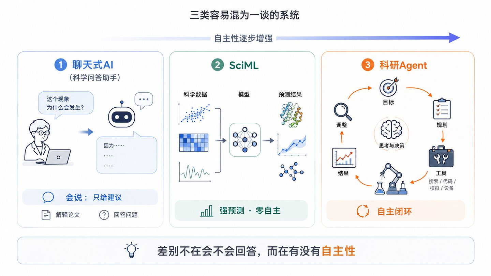

三者更像是层叠关系。科研Agent内部往往**调用**聊天式AI来推理、**调用** SciML模型来预测。换句话说，Agent是"会使用工具的主体"，而前两类常常是它手里的工具。

## 2.2 一条分界线：会不会自己动手闭环

如果只能记住一条判断标准，那就是：**它是只输出建议，还是能自主执行并闭环。**

一个直观的检验：让系统去"重置一个数据库密码"。聊天式AI会告诉你重置的步骤，科研Agent会真的连进系统、执行重置、确认成功。如果一个工具在关键动作上仍然需要人来"按最后那个按钮"，那它更接近助手，而非Agent。

在科学语境里，这条线体现为：系统能不能在没有人逐步干预的情况下，自己走完"规划、执行、观测、修正"这个循环。Curie（Kon et al. 2025）这类工作之所以强调"严谨的自动化实验"，正是因为这个闭环一旦自动化，最大的敌人就变成了"中途出错却无人纠正"。这也预示了第六章要谈的可靠性问题。

还得说清楚一点，自主性是一条**连续谱**，而非非黑即白的开关。完全不需要人的"全自主科学家"目前基本不存在，现实中的系统都分布在"人重度介入"到"人轻度把关"之间。这正是下一节"自治层级"要刻画的。

## 2.3 自治的层级：工具 / 分析者 / 科学家

多篇综述都用层级来组织这个领域，其中较清晰的一套来自EMNLP 2025的综述《From Automation to Autonomy》，它把LLM在科学发现中的角色分为三级：

- **Level 1，LLM作为工具（Tool）。** 人主导研究，AI在被明确指定的子任务上提供帮助：润色文字、生成一段代码、做一次文献检索。决策权完全在人。
- **Level 2，LLM作为分析者（Analyst）。** AI承担更完整的分析环节：自主做数据分析、表格/图表推理、统计建模，甚至提出候选模型。人仍设定问题与边界，但AI在边界内有了一定的自主裁量。
- **Level 3，LLM作为科学家（Scientist）。** AI跨越多个环节、长链条自主运行：从假设到实验到结论，人退到"设定高层目标 + 把关"的位置。第1.1节的案例与第3.6节的端到端系统都在向这一级逼近。

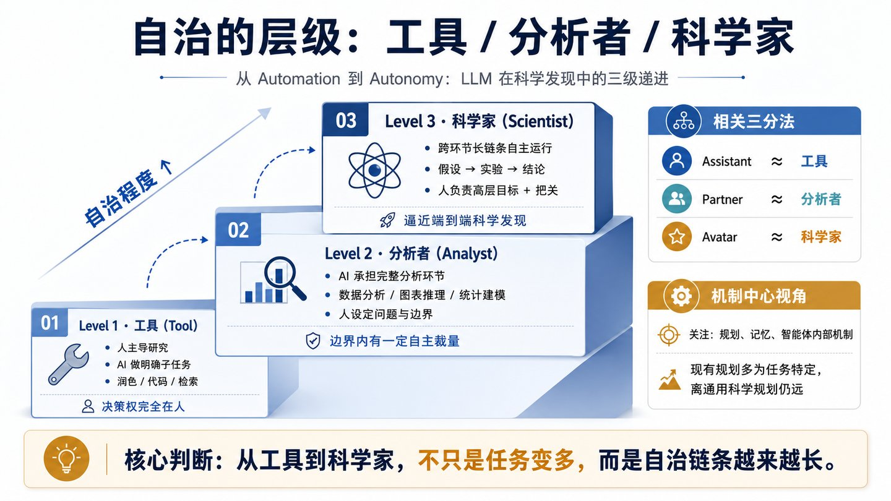

另一套常被引用的三分法（Hitchhiker's Guide to Scientific Agents, 2025）用"助手 / 伙伴 / 化身"（Assistant / Partner / Avatar）表达类似的递进。Ren et al.（2025, arXiv 2503.24047）的综述则采取"机制中心"的视角，关注智能体的规划与记忆等内部机制，并尖锐地指出：现有规划架构大多是"任务特定"的，距离支撑开放式发现的"通用科学规划能力"还很远。

这些层级框架对读者的价值在于：当你看到一个号称"AI科学家"的系统时，第一件事是判断它真实处在哪一级。很多惊艳的演示其实停留在Level 2，被包装成了Level 3。

## 2.4 与企业 Agent 的异同：形态相同，本质不同

科研Agent与当下火热的企业Agent（客服、销售、编程助手）共享同一种"形态"，都是会自主调用工具、执行多步任务的系统。这也是为什么Claude Code、客服机器人、科研助手都被叫做"Agent"。但它们是两门不同的生意，区别在护城河：

- **企业Agent** 的壁垒主要是工程能力、系统整合与对某个商业流程的理解。它的"对错"通常有即时、可量化的反馈（工单是否解决、代码是否通过测试、转化是否提升）。
- **科研Agent** 的壁垒是**科学判断力与学科know-how**。它的"对错"往往没有即时反馈，一个科学结论是否成立，可能要经过同行评审、复现、乃至数年的检验才能确认。这使得科研Agent的评估本身成为一个困难且关键的问题（第四、六章详谈）。

这个区别有一个直接推论：在科研Agent这条线上，纯粹的AI工程能力不足以构成壁垒，懂科学的人反而握有别人翻不过去的墙。这一点会贯穿整个系列。

## 2.5 我们采用的工作定义

综合以上，这篇采用如下工作定义，作为后续版图的纳入标准：

> **科研 Agent**：以 LLM 或基础模型为推理内核，具备自主规划能力，能够调用外部工具（检索、代码执行、仿真、数据库、实验设备等）来推进一个相对开放的科学目标，并能根据中间结果调整后续行动的系统。其自主性可处于"分析者"到"科学家"之间的不同层级。

按此定义，纯聊天问答与纯预测型SciML不计入主体，但它们作为科研Agent的"内部器官"会被反复提及。下面两章，就用纵切与横切两套框架，把符合这一定义的已有工作系统地铺开。

# 第三章 纵切生态：沿科学工作流的六个环节

理解AI4S的版图，最直观的方式是顺着科学家干活的流程走一遍：读文献 → 提假设 → 设计实验 → 执行实验 → 分析数据 → 撰写并评审论文。每一个环节，都已经长出对应的智能体，且成熟度与活跃度各不相同。本章逐环梳理代表性工作，第四章再补上托底这些环节的横向基础设施。

## 3.1 文献检索与知识合成

这是最先成熟、也最先被研究者日常使用的一环。原因很简单，它风险低、价值即时，读不完的文献是每个研究者的真实痛点。

这一环的标杆是FutureHouse体系的 **PaperQA / PaperQA2**。这个团队2024年那篇题为"语言智能体实现对科学知识的超人级综合"的工作（Skarlinski et al. 2024, arXiv 2409.13740），展示了一个检索增强（RAG）的科学问答智能体。它会实时检索文献、定位证据、给出带出处的回答，并在若干评测上声称达到超过人类专家的知识综合水平，而不是凭记忆硬答。"带出处、可核查"这一点尤其关键，因为它直接对治大模型的幻觉问题，使输出在科研场景中可被信任。

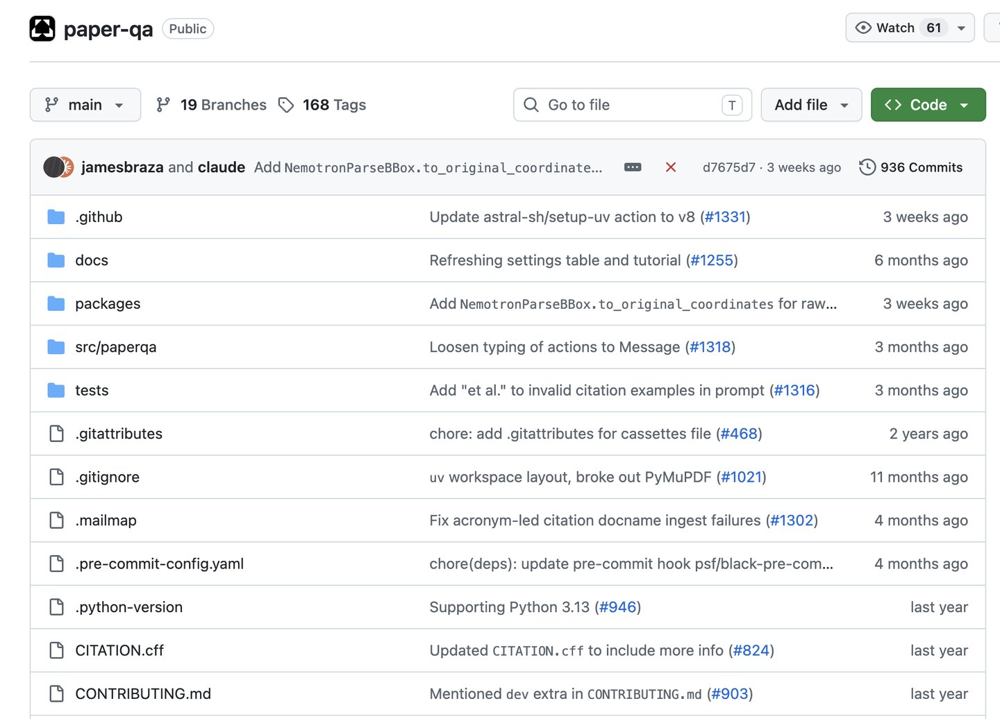

围绕"读与查"，还有一批各有侧重的工作。**LitLLM**（Agarwal et al. 2024）面向文献综述生成。**LitSearch**（Ajith et al. 2024）面向文献检索。**CiteME**（Press et al. 2024）面向引用归因，即给定一句论断，找出它真正出自哪篇文献，这对治理"幻觉引用"很有意义。**ResearchArena**（Kang & Xiong 2024）与 **SciLitLLM**（Li et al. 2024）则分别构建文献调研工作流与科学文献理解能力。

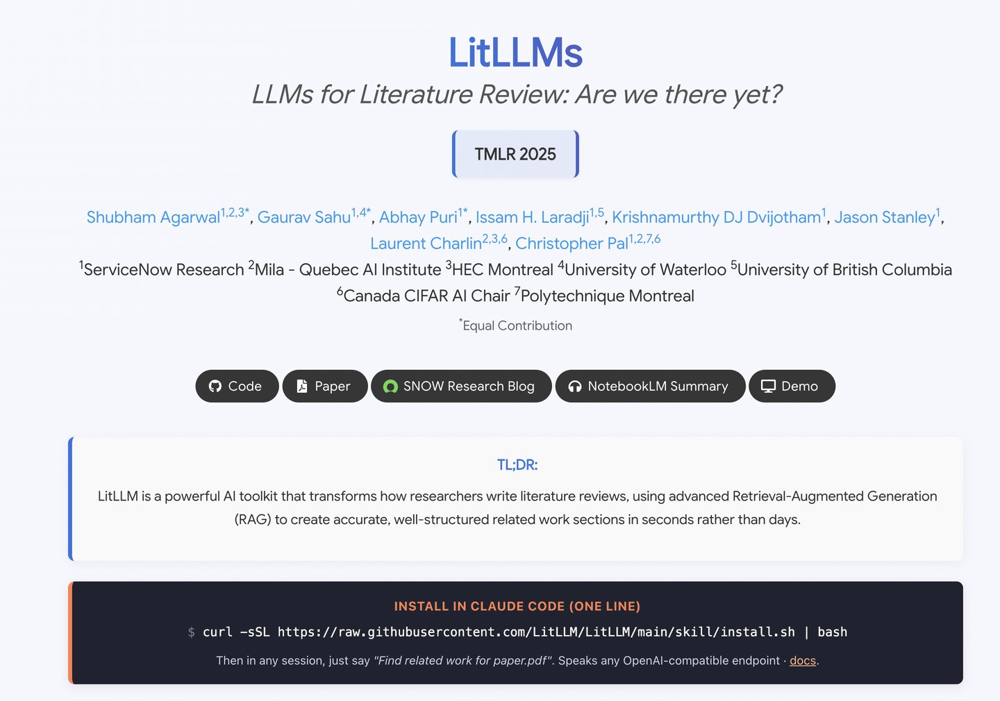

还要单独点一下 **AutoSurvey**（Wang et al. 2024, NeurIPS），它让LLM自动撰写综述文章。这类工作展示了能力，也带来了副作用，AI生成综述的泛滥已经在冲击学术生态（第六章与系列后文会回到这一点）。这正好说明同一项能力的两面，既是生产力，也可能是污染源。

把这一环放进整张图里看，文献与知识合成是AI4S中**最接近"可靠可用"的一环**，但它本质仍是"辅助读"，离"自主做研究"最远，是入口而非终点。

## 3.2 假设生成与科学推理

如果说读文献是"输入"，那么提出有价值的假设就是科学创造力的核心，也是衡量AI能否真正"做科学"的试金石。

这一环最具分量的实证来自斯坦福的Si et al.（2024，arXiv 2409.04109）。他们做了一项大规模对照研究，让LLM与人类专家分别生成研究想法，再请专家盲评。结论很有意思，**LLM生成的想法在"新颖性"上被评得高于专家，但在"可行性"上更弱。** 这个发现几乎定义了当前阶段AI假设能力的特征，它能跳出人类的思维定式抛出新奇组合，却缺乏对"这条路实际走不走得通"的判断。新颖而不可行，只是创造力的一半。

为弥补单体LLM的局限，多智能体路线被反复尝试。**"Many Heads Are Better Than One"**（Su et al. 2024）用多个LLM智能体协作生成科学想法，让不同"头脑"互相激发与筛选。**ResearchAgent**（Baek et al. 2024）则把假设生成做成迭代精炼的循环，生成、批评、修正。这些工作的共同思路，是用结构化的多轮交互，去逼近人类科研中"提出、质疑、打磨"的社会化过程。第1.1节的Virtual Lab正是这一思路在真实问题上的成功演示，让AI们"开会"，用批评者角色专门负责挑刺。

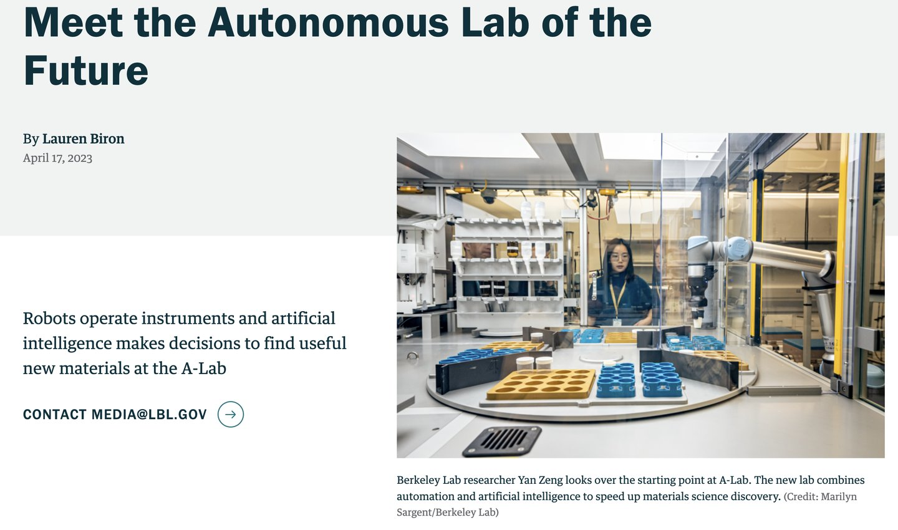

所以假设生成是AI4S里最让人兴奋、也最不可靠的一环。它偶有惊艳，但"新颖却不可行"的系统性偏差意味着，"判断哪个假设值得做"这件事，短期内还得牢牢握在人手里。

## 3.3 实验设计与自驾实验室（实验执行）

把"动手做实验"交给AI闭环，是AI4S中最重、最依赖领域与硬件、也最具冲击力的一环。它把AI从屏幕里拉进了物理世界。

奠基性的工作是 **Coscientist**（Boiko et al. 2023, Nature）：一个LLM驱动的系统，能够自主搜索文献、规划化学合成路线、并通过实验室自动化设备真正执行实验。它证明了"语言模型 + 实验室硬件"这条路在化学上可行。

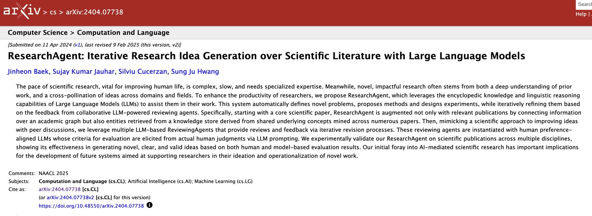

材料领域的代表是伯克利的 **A-Lab**（2023, Nature）。一个高度自动化的实验室，机器人依据AI的决策自主合成与表征候选材料，把"提出配方、合成、测量、更新模型"的闭环交给机器，在十几天里完成了人类要花几个月的尝试。它体现了自驾实验室的本质，**认知智能（决定做什么）与物理自动化（把它做出来）的耦合**。不过A-Lab也提醒我们别急着把demo当定论。固态化学家Robert Palgrave等人随后公开质疑，说论文里那批"新材料"的表征（X射线衍射的解析）不过关，没有一个被可信地证明是真正的新相，这篇Nature后来也做了更正。这恰好是后面第六章要谈的"demo惊艳、落地存疑"的一个现场版。

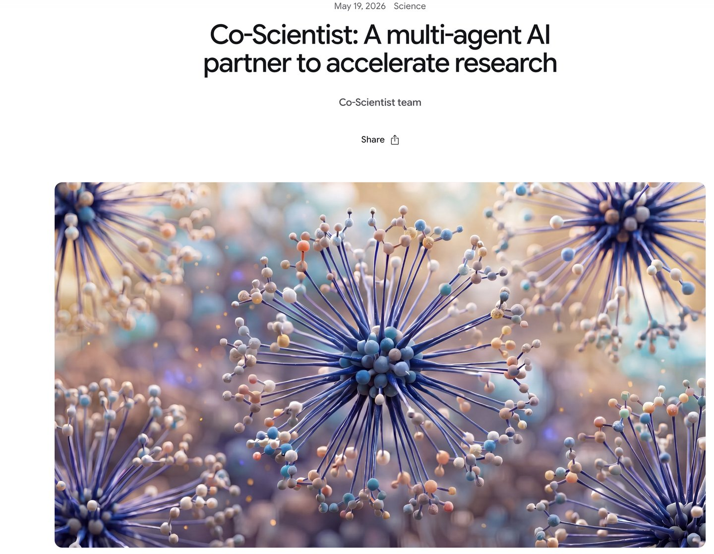

生物领域最具说服力的，仍是第1.1节的 **Virtual Lab**（Swanson et al.，2025年Nature），从假设到分子设计再到湿实验验证的完整闭环，且产出了被实验证实的新分子。此外，**ChatMOF** 等系统展示了在特定材料类别（金属有机框架）上自主预测与生成的能力。生物信息学方向也出现了用双环架构（规划环 + 实现环）做自主分析的尝试（如Huang et al. 2025）。

这一环的关键约束不在"智能"而在"闭环的可靠性与成本"：真实实验昂贵、耗时、且不可"撤销"，一旦AI在长链条中某步出错且无人纠正，代价是真金白银的材料与时间。这把第六章的"复合失败"问题，从抽象的概率变成了实验台上的现实。

## 3.4 数据分析、代码与论文复现

科学的可信度建立在"可复现"之上，而复现的核心动作之一，是把论文里的方法变成能跑出相同结果的代码。这一环因此既是分析工具，也是可信度的守门口。

**Paper2Code**（Seo et al. 2025）与 **AutoP2C**（Lin et al. 2025）用多阶段LLM流水线，把（机器学习）论文自动翻译成可运行的代码仓库，本质是"读懂方法 + 重建实现"。**MLR-Copilot**（Du 2024）则面向自主的机器学习研究，串起从想法到实验的流程。

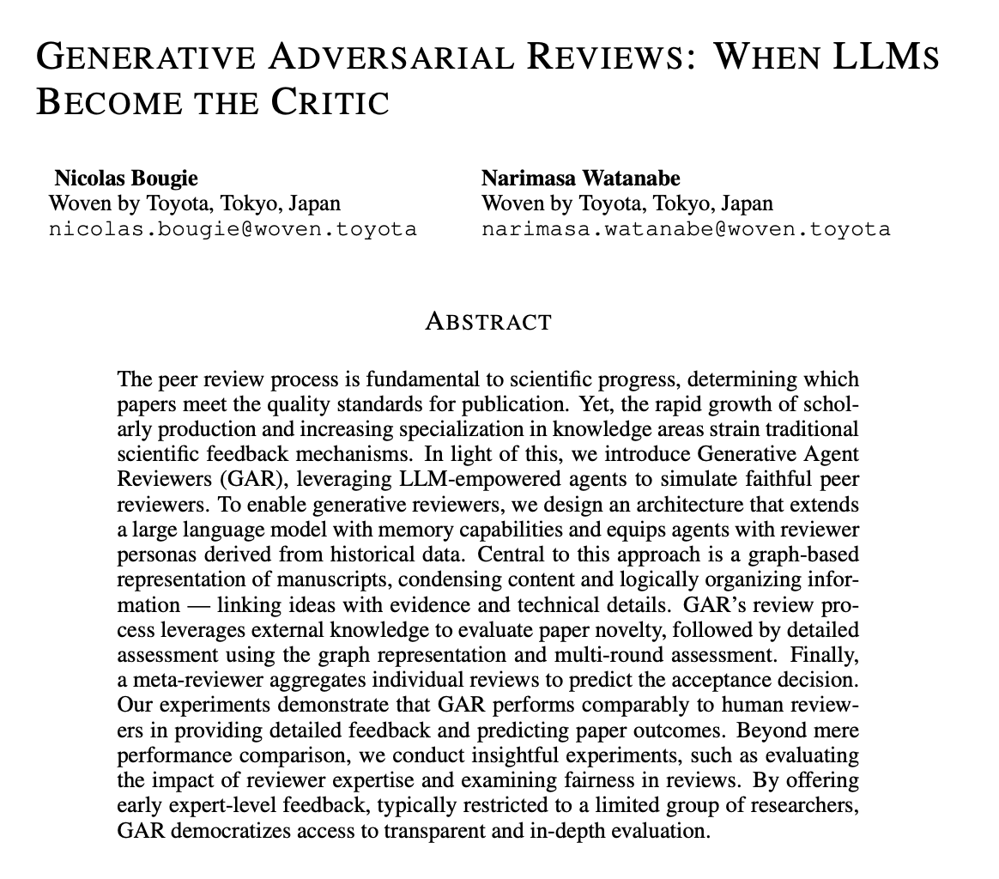

更具雄心的是DeepMind的 **AlphaEvolve**（Novikov et al. 2025, arXiv 2506.13131）。它编排一组Gemini模型做算法与科学发现，靠演化式的代码变异加评估反馈迭代出更优解。后续工作进一步把它与"深度研究"结合，用于科学算法的发现（DeepEvolve, arXiv 2510.06056）。这条线展示了AI不只是复现已有方法，还可能演化出新方法。

但"能复现"恰恰也暴露了"难复现"。当一个AI系统声称复现了某论文，如何验证它真的复现了、而非生成了看似合理的结果？这把我们引向第四、五章要重点谈的评估与基准，没有可信的裁判，"自动复现"本身就无法被信任。

## 3.5 论文写作与同行评审

流程的末端是写作与评审，这也是争议最集中的一环。

写作侧，前述AutoSurvey以及各端到端系统的"出稿"模块，已能产出格式完整、读起来像模像样的论文草稿。问题在于：流畅不等于正确，格式完整不等于有真贡献。

评审侧的探索更敏感。**Generative Adversarial Reviews**（Bougie & Watanabe 2024）等尝试让LLM扮演评审，用对抗式批评帮助改进论文。一些会议（如ICLR）已在工作流中引入AI评审建议。然而对Sakana AI Scientist的独立评估（2025, arXiv 2502.14297）给出了清醒的发现，**AI生成的评审往往格式工整却停留在表层，抓不到深层方法缺陷**。这反而抬高了"二级评审者"（如领域主席）的重要性，因为需要人去判断一篇工作是否真有价值。

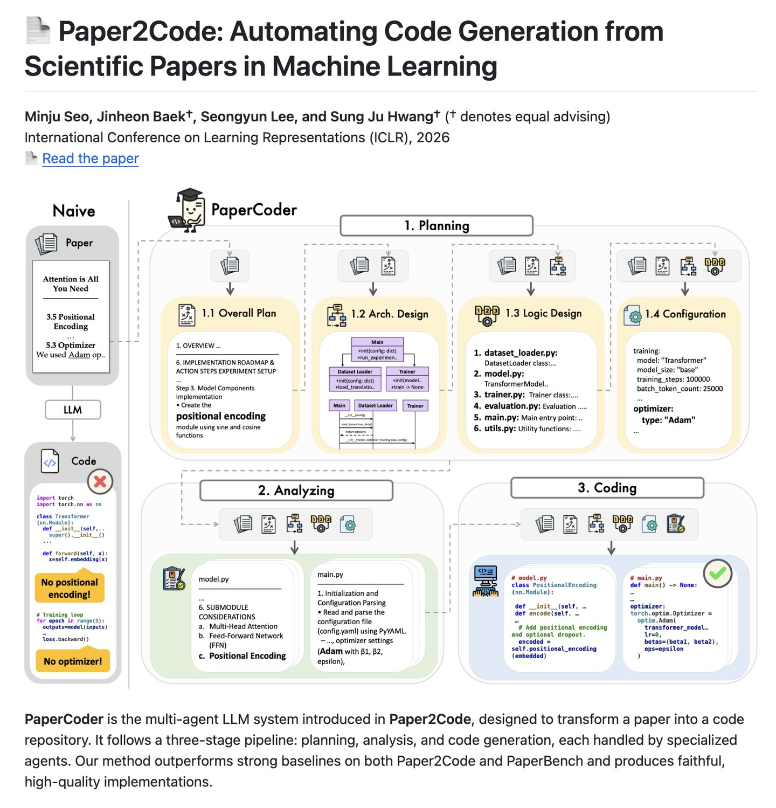

这一环的张力，把整个AI4S的张力浓缩了出来，AI在"形式"上已逼近人类，在"实质判断"上仍有显著差距。写作与评审环节的自动化，因此与研究诚信问题深度绑定（第六章展开）。

## 3.6 把六环合一：端到端"AI 科学家"

当上述环节被串成一条自动化链路，就得到了最受关注、也最具争议的一类系统，端到端"AI科学家"，对应自治层级中的Level 3。

起点是Sakana AI的 **The AI Scientist（v1）**（Lu et al. 2024, arXiv 2408.06292）。它最早完整演示了"从想法到论文"的端到端自动化，但严重依赖人工编写的代码模板，探索流程偏线性，限制了发现的深度与适应性。**The AI Scientist-v2**（Yamada et al. 2025, arXiv 2504.08066）引入"智能体树搜索"和专门的实验管理智能体，减少对模板的依赖，支持多轮迭代探索。其产出曾有论文通过某ICLR workshop的评审（按事先约定在正式发表前撤稿），引发关于AI作者与AI评审同时入场的激烈讨论。**Kosmos**（Mitchener et al. 2025）沿类似路线推进实验管理与模板解耦。

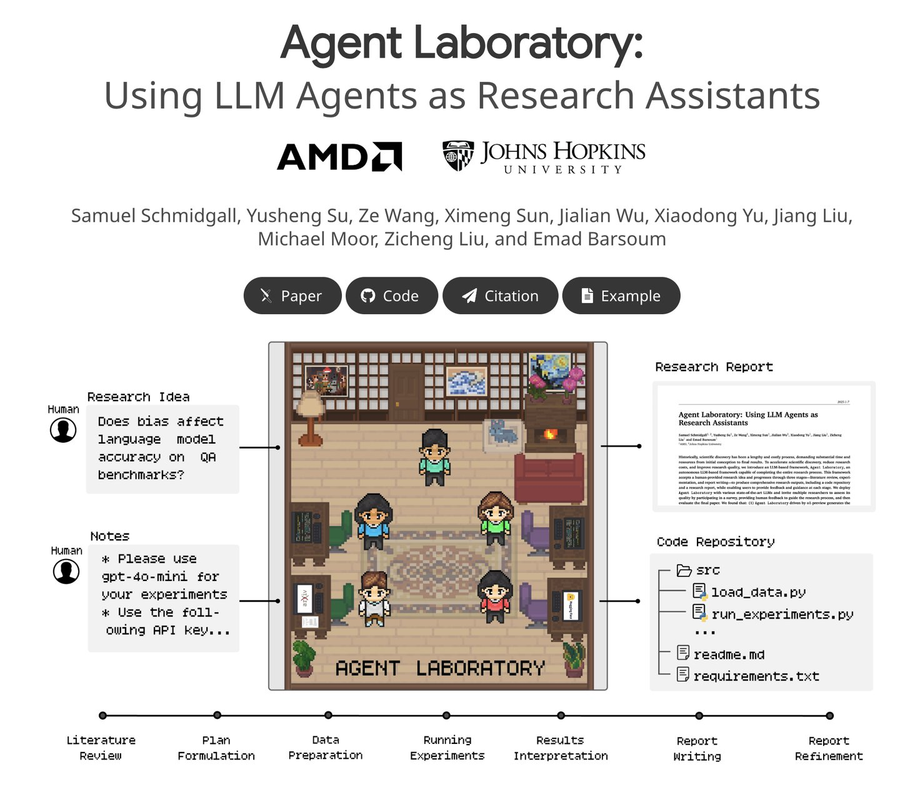

并行的探索还有很多。**Agent Laboratory**（Schmidgall et al. 2025, arXiv 2501.04227）把LLM智能体组织成研究助理团队，覆盖文献到实验到报告。**AI-Researcher**（Tang et al. 2025, arXiv 2505.18705）面向自主科学创新。**Curie**（Kon et al. 2025, arXiv 2502.16069）强调实验的严谨性与可复现。**SciAgents**（Ghafarollahi et al. 2024）用多智能体"图推理"自动化发现，在材料方向格外突出。**PiFlow**（2025, arXiv 2505.15047）引入"原理感知"，让发现过程受科学原理约束而非盲目搜索。**DeepScientist**（Weng et al. 2025）主打渐进式推进前沿发现。**Carl**（Autoscience Institute 2025）被报道为最早一批产出通过学术同行评审研究的系统之一，不过这个"首个"在它和AI Scientist-v2之间其实有争议。Google的 **AI Co-Scientist**（2025）则把重心放在假设生成与人机协作上。此外，**Denario** 等多领域助手项目，以及天体物理方向的 **AI Cosmologist**（自动化宇宙学统计推断，详见第五章），也属于这一类的领域化变体。甚至有人开始设想为AI科学家产出搭建专门的发表生态，如 **aiXiv**（Zhang et al. 2025）。

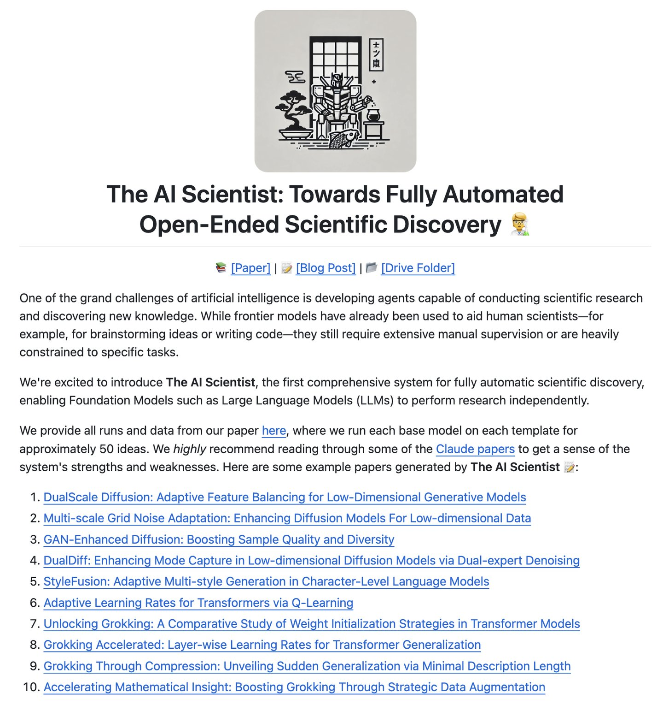

把这些系统放在一起看，可以得到一个清醒的判断。**它们在"流程跑通"上已经成立，能产出格式完整的论文乃至偶尔通过评审，但在"产生真实、重要的新科学"这件事上，证据仍然薄弱。** 多数印象深刻的成果，要么是在受控、可验证的窄问题上，要么仍有大量人类介入。把"端到端跑通"误读为"科学家被自动化了"，是当前最常见的认知偏差。第六章会用具体证据来校准这个判断。

下表汇总六环节的代表系统，便于建立整体索引：

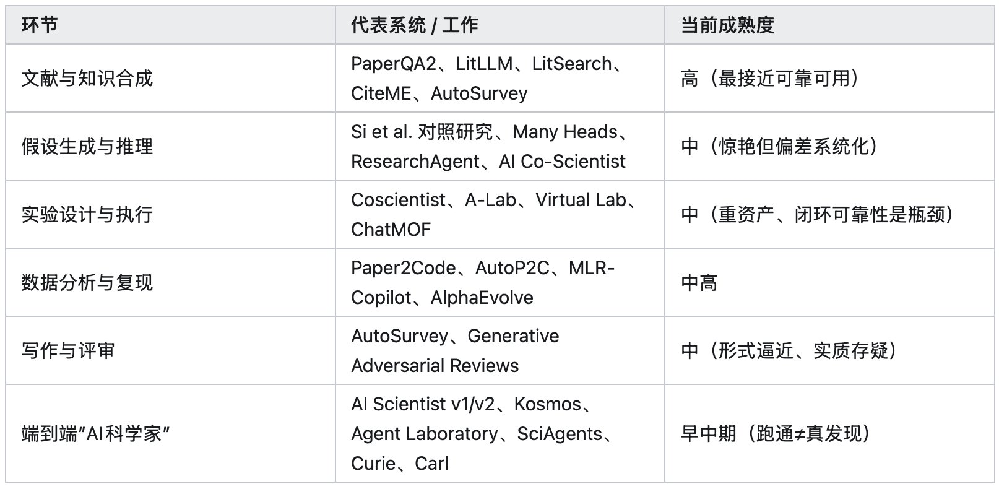

# 第四章 横切生态：四层基础设施

第三章的六个环节回答了"AI在科学流程的每一步做什么"，但它没有回答另一个问题：这些环节**靠什么托底**？任何一个科研Agent，无论它在哪个环节工作，都需要一个推理底座、一套执行环境、一把验收的尺子、以及一组连接外部世界的接口。这四样东西横切所有环节，构成AI4S的基础设施层，也就是这个系列反复提到的"水电煤"。本章逐层展开。

## 4.1 科学基础模型（SciFM）

第一层是底座。前两年的科研Agent大多直接调用通用大模型（GPT、Claude、Gemini等）当大脑，但通用模型并非为科学训练，在专业符号、单位、领域推理上常有短板。于是一个明确的趋势出现了：**为科学专门训练的基础模型（Scientific Foundation Models, SciFM）。**

SciFM的思路是用科学文献、实验数据、专业模态（分子图、晶体结构、基因序列、光谱、时序观测等）训练模型，使其在科学任务上具备比通用模型更扎实的"先验"。代表性的方向包括：面向生物的BioNeMo系列、面向材料与化学的多模态模型（如IBM的FM4M，覆盖分子图、三维原子坐标、电子密度等模态）、面向气候与地球系统的时序基础模型，以及把第一性原理势能融入分子动力学的"深度势能"类模型。这个方向重要到已经催生专门的学术会议（如SciFM主题会议）。

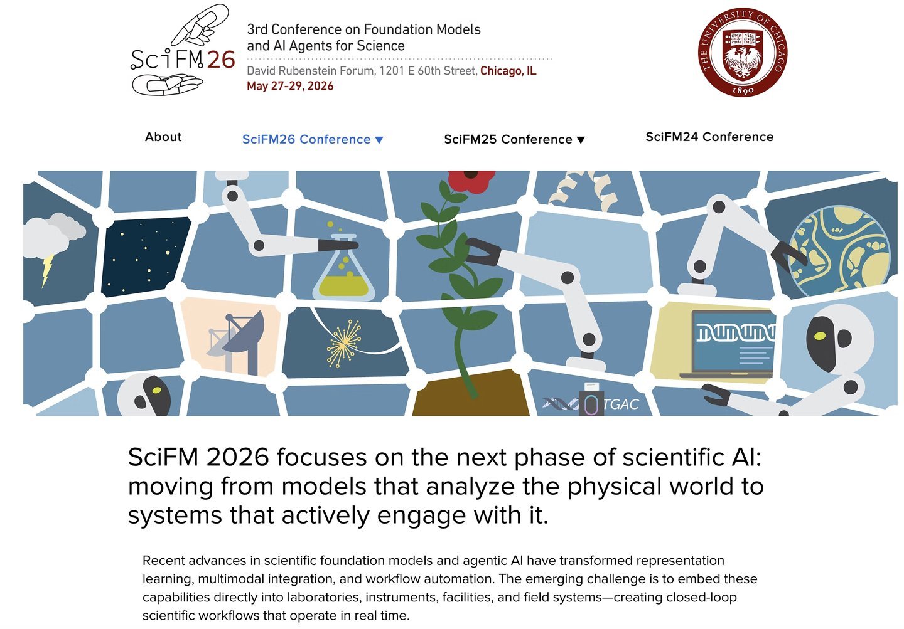

SciFM之于科研Agent，正如通用大模型之于通用Agent，它决定了"大脑"的科学素养上限。这里有一个判断值得记住，在缺乏数据的科学领域，把物理约束、守恒律、对称性等"硬知识"嵌进模型（physics-informed思路），往往比单纯堆数据更有效。这一点在第五章的物理与气候方向会再次出现，也是学科背景者能贡献独特价值的地方。

## 4.2 自驾实验室作为基础设施

第二层是执行环境。第3.3节从"实验执行环节"的角度介绍了自驾实验室。换一个视角，自驾实验室本身就是一层**可被复用的基础设施**，它把"让AI的决策变成物理世界里的真实操作"这件事标准化、平台化。

从基础设施视角看，自驾实验室要解决的是认知与物理之间的接口问题，AI大脑如何把"下一个该测什么"翻译成机器人能执行的指令，又如何把测量结果结构化地喂回大脑。Coscientist、A-Lab等系统在各自领域给出了答案，但它们大多是垂直、专用的。一个仍然开放的机会是"自驾实验室的通用编排层"，让不同设备、不同学科的实验闭环能共享一套调度与学习框架。这一层的核心难点是高维空间下的实验设计（决定下一个实验）与不确定性管理，恰恰是统计与物理背景者擅长的领域。

自驾实验室是四层中最"重"的一层，它需要真实的设备、空间与资本，因此也最难由小团队从零搭建（中篇会看到，这正是资本最密集、门槛最高的一层）。但它也是AI4S区别于"纯软件AI"的灵魂，没有它，AI永远只能"读和想"，无法真正"做"。

## 4.3 评估、基准与可复现

第三层是验收的尺子，也是本系列判断中**最被低估、却最关键**的一层。逻辑很直接：当一个系统声称"我能做科学发现"，凭什么相信它？必须有人出考卷、定标准答案、判对错、验证结果能否复现。没有这层，前面所有环节的成果都无法被信任，也就无法落地。

这一层正在按"学科 × 任务类型"快速繁殖，且大多是公开、可下载的基准：

- **跨学科 / 通用科学**：**ScienceAgentBench**（Chen et al. 2024）评估智能体做数据驱动发现的能力，任务取自同行评审论文并由领域专家验证。OpenAI的 **PaperBench**（Starace et al. 2025）评估AI复现AI研究的能力。**SciReplicate-Bench**（Xiang et al. 2025）测从论文出发的算法复现。**CORE-Bench** 从完整代码库复现论文结果。**AstaBench**（2025）是科学研究套件式的严格基准。**AAAR-1.0**、**DiscoveryWorld**、**ScienceBoard** 则分别从科研协助、模拟发现环境、科学桌面任务等角度切入。
- **生物 / 化学**：**LAB-Bench**（FutureHouse，arXiv 2407.10362）面向生物研究工作流，两千四百多个任务，覆盖文献、数据库、序列、协议、专利等多类。**BixBench** 面向生物医学。

这层有三个特征值得记住。第一，**它必须由学科专家构建**，出题、定标准答案、判对错，都要求真懂那门科学，纯AI团队做不出有效的科学基准。第二，**它远未饱和**，按"学科 × 子领域 × 任务类型 × 真实设施数据"组合裂变，现有基准只点亮了极少数格子。第三，**它的得分普遍很低**，多个基准上最强模型都远未达专家水平，说明问题远没被解决，正处早期。这三点合起来，使评估层成为学科背景者最锋利的切入点，这是下篇会重点展开的判断，这一篇先把它作为版图的一块标清楚。第五章会看到，物理与天体物理恰是这一层中起步较早的学科之一。

## 4.4 工具与编排层

第四层是连接外部世界的接口。一个科研Agent要真正干活，必须能调用工具：搜索引擎、代码执行沙箱、科学数据库、仿真引擎、实验设备API。把这些工具安全、可靠地接进Agent，并编排多个工具与多个子智能体的协作，就是工具与编排层的职责。

这一层在通用Agent领域已经相对成熟（各类agent框架、工具协议、记忆与状态管理），在科学领域则需要额外处理领域特定的接口，比如把某个天文数据库、某套仿真代码、某类实验设备接进来。一个具体的例子是用自然语言查询科学数据库的工作（如天文方向的text-to-SQL系统，详见第五章），它本质就是"把数据库这件工具接给Agent用"。

从可靠性角度看，工具与编排层也是失败的高发区，工具调用失败、返回格式不一致、长链条中状态丢失，都会导致整个任务崩溃。这把我们直接引向第六章，基础设施的成熟度，最终决定了科研Agent能否从"演示"走向"生产"。

下表汇总四层基础设施：

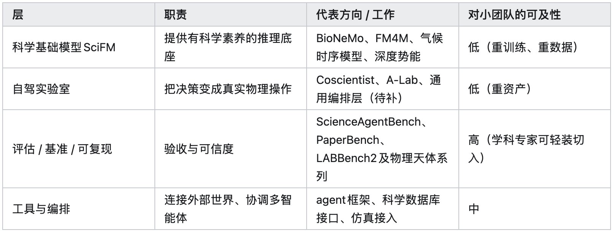

把第三章的"纵切"与本章的"横切"叠在一起，就得到了AI4S的完整生态坐标：每一个具体系统，都可以被定位到"它在哪个环节工作、依托哪几层基础设施"。有了这张坐标，下一章我们换一个轴，从学科的角度，来看钱与热度如何分布。

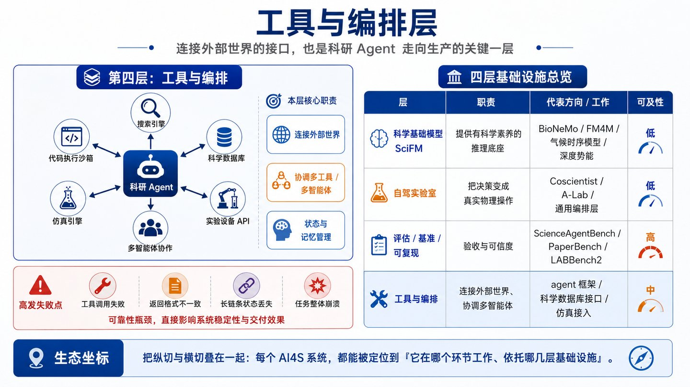

# 第五章 学科版图：钱、热度与商业出口

前两章用环节和基础设施两个轴画出了"技术版图"。但AI4S的发展并不在各学科间均匀展开，资金、人才、关注度高度不均，而这种不均背后有清晰的逻辑：**离"可变现的成果"越近的学科，钱越多。** 本章按学科扫描，并在每个学科点出其代表工作、商业出口与对资本的吸引力。资本的具体运作（谁投、投多少）留给中篇，本章只勾勒分布与逻辑。

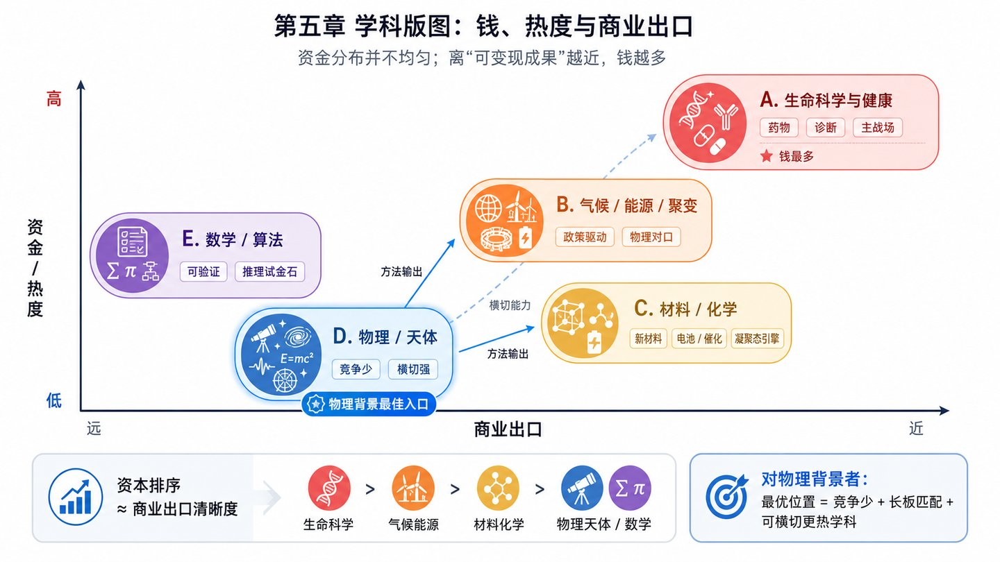

## 5.1 生命科学与健康：钱最多，因为出口最清楚

生命科学是AI4S中资金最密集的学科，原因直白，它的成果可以变成药，而药是有明确、巨大支付方的终极商业出口。从蛋白结构（AlphaFold的遗产）到蛋白与酶设计、抗体发现、靶点识别、临床数据分析，AI在生命科学的每一环都有落点。

代表性的能力已经被验证。第1.1节的Virtual Lab设计出经实验证实的纳米抗体。蛋白/酶设计方向出现了与大型药企深度绑定的合作，比如2026年4月Profluent与礼来达成战略合作，开发位点特异性的重组酶，Profluent最高可拿到22.5亿美元的里程碑款（细节见中篇）。各类面向健康的AI4S项目，也是公益与产业资本共同关注的头号方向，比如Google.org的AI for Science资助计划就把健康与生命科学列为首要方向。

一句话定性，生命科学是AI4S的"主战场"，但它也是壁垒最高、最拥挤、最需要湿实验与监管能力的学科。对没有生物背景与实验资源的人，它是观察样板，而非轻易可入的赛道。

## 5.2 气候、能源与聚变：政策驱动，物理对口

气候与能源是第二热的方向，由政策意愿与能源转型双重驱动。而且，这是对物理背景者的关键信号，**它在方法论上与物理高度对口**，气候本质是流体力学、热力学与辐射传输，能源与聚变更是物理的核心地盘。

这一方向最具代表性的成果是"混合物理-机器学习"的天气与气候模型。Google的 **NeuralGCM**（2024, Nature）把学到的动力学与物理约束结合，在中期预报到长期气候模拟上展现出与传统数值模型相当甚至更优的表现。NVIDIA的Earth-2 / Apollo、华为的Pangu-Weather等也属同一脉络，它们的共同点是不再纯靠算力硬解方程，而是让模型从历史数据里学到一部分动力学，跑得更快、更省。

聚变方向最标志性的一步，是2022年DeepMind与EPFL瑞士等离子体中心合作，用强化学习实时控制托卡马克里的等离子体磁场位形，让上亿度的等离子体稳定维持在所需形状（发表于Nature）。此外还有把全球聚变实验数据标准化、供AI从集体经验里学习的努力。这些都是典型的"物理问题用AI解"，而不是另起炉灶的新学科。

一个需要点出的"错位"：纯粹的"气候科技"创业融资近年实际在收缩（注意力被通用AI吸走），但"AI for气候科学"作为AI的子方向是热的。这意味着切入点更可能是"用AI/物理方法服务气候科学"，而非传统气候硬件创业。

对物理背景的人，这是少有的"方法直接对口"的入口。流体、热力学、辐射传输、等离子体物理本就是物理系的看家本领，切进来不必从头补一套生物或化学的湿实验技能，摩擦比生命科学那条路小得多。

## 5.3 材料与化学：与能源强绑定，凝聚态方法是引擎

材料与化学紧随其后，且与能源转型强绑定，新材料意味着更好的电池、催化剂、超导体、光伏。AI4S在这里的形态最接近"自驾实验室 + 生成设计"，用生成模型提出候选材料，用自动实验闭环验证。

代表工作里最出圈的是DeepMind的 **GNoME**（2023, Nature），它用图神经网络一口气预测了约220万种新晶体，其中约38万种被判定为稳定，等于把人类已知的稳定无机材料数量翻了好几倍。配套的A-Lab（自主合成材料）则把其中一批候选真的合成了出来，跑通了"AI预测加自动实验"的闭环。此外还有SciAgents（多智能体图推理做材料发现）、ChatMOF（金属有机框架）等。一个对物理背景者尤其重要的判断，**材料与化学的AI引擎，底层是凝聚态与计算物理的方法论**，密度泛函理论（DFT）、分子动力学、深度势能、多体系统。换句话说，被一些人视为"传统、窄"的凝聚态/计算物理技能，搬到AI for materials这个资本密集的市场，恰恰是稀缺的核心能力。这一反转在下篇会展开为具体的入场判断。

## 5.4 物理与天体物理：竞争最少，方法可横切

物理（含天体物理）不是资金最多的学科，但有两个独特属性使它对本系列作者格外重要：竞争者最少，且物理能力可作为"横切军火"输出给其他所有学科。

在AI4S内部，物理与天体物理已经形成了一块虽小但起步较早的版图：

- **自主发现与分析**：**AI Cosmologist** 自动化宇宙学的统计推断流水线，Denario等助手在天体物理任务上有应用。
- **数据库交互**：面向天体物理自主发现的RAG智能体评估（2025, arXiv 2507.07155）系统比较了多种检索增强配置。天文数据库的自然语言查询（如ALeRCE text-to-SQL，2026, arXiv 2606.18108，针对含数十张表的真实天文数据库）展示了"自然语言到科学数据查询"的方向。
- **评估基准（这是物理天体起步较早的一块）**：**Gravity-Bench**（Koblischke et al. 2025, arXiv 2501.18411）让智能体扮演天文学家探索双星系统、在观测预算内自主规划观测并推断（可能被修改过的）引力定律，含分布外案例以测真正的泛化。**ReplicationBench**（Ye et al. 2025, arXiv 2510.24591）测端到端复现天体物理论文，最强模型得分很低。**AstroVisBench**（Joseph et al. 2025, arXiv 2505.20538）测天文的科学计算与可视化。**AstroM-Lab 1**（Ting et al. 2024）与 **Astro-QA**（Li et al. 2025）测天文知识问答。粒子物理则有 **Collider-Bench**，理论物理有 **TPBench**（arXiv 2502.15815）。

更值得关注的是社区层面的主动信号：Rubin/LSST暗能量科学合作组（DESC）2026年的AI/ML机会报告（arXiv 2601.14235）明确把贝叶斯推断、physics-informed方法、验证框架、主动发现列为方法论优先级，直言"评估框架才刚开始出现"，并呼吁建立合作组专属的评估基准、强调agentic AI的部署必须配合严格评估与治理。这是需求侧主动呼唤基础设施的直接证据。

物理能力的另一重价值在于"横切"，physics-informed建模、不确定性量化、主动学习、高维实验设计，这些能力在气候、材料、乃至生物的AI4S中都是刚需，而它们正是物理训练的产物。物理背景者因此有两条路，在物理/天体内部做深，或把物理能力作为军火输出给更热的学科。

## 5.5 数学与算法：小众但标志性

数学是AI4S中相对小众、但极具标志性的方向。它的特殊性在于：数学有客观、可机器验证的对错（证明要么成立要么不成立），这使它成为检验AI推理能力的理想试金石。AlphaEvolve在算法发现上的工作、以及一批面向"生成猜想 + 自我验证证明"的系统（部分已获显著资本关注，见中篇），代表了这一方向。数学的进展往往被视为AI通用推理能力的前沿指标，因此关注度高于其经济体量。

## 5.6 为什么钱这样分布

把五个学科放在一起，分布的逻辑就清楚了：**资金大致按"商业出口的清晰度与近度"排序。**

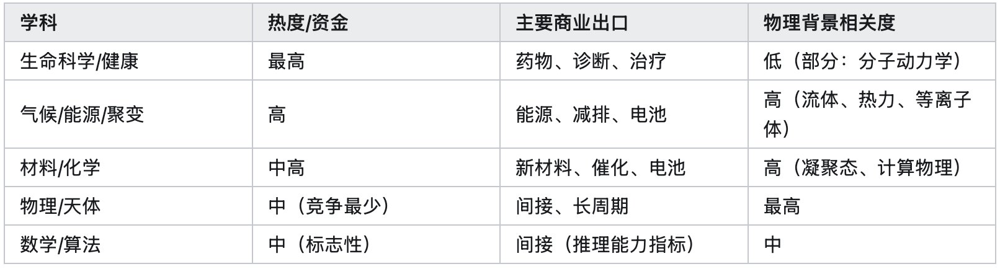

这张表也解释了一个表面矛盾：物理/天体的资金不是最多，但对物理背景者却可能是最优入口，因为竞争最少、壁垒（学科判断力）最契合自身、且能力可横切到更热的学科。这是一个"避开红海、用长板打"的位置，下篇会把它展开为具体策略。

学科版图扫描至此。但无论哪个学科，都绕不开一个共同的问题：这些系统，到底成熟到什么程度了？第六章直面这个问题，尽量把好话和坏话都说全。

# 第六章 发展程度的真相：能力强，但可靠性拖后腿

前四章描绘的版图容易让人产生一种错觉：AI已经快要会做科学了。本章的任务是把这个错觉拆掉，给出一个尽量诚实的成熟度判断。一句话概括：**当前的科研Agent处在"能力很强、可靠性很弱"的剪刀差中，而这个剪刀差，正是理解整个阶段的钥匙。**

## 6.1 能力侧：已经能做什么

先说能力，它确实很能打，不该被贬低。

今天最好的科研Agent，已经能做不少事。连续调用数十个工具完成多步任务，自主运行数小时乃至更久，在受控问题上提出新颖假设并设计验证，在自驾实验室里驱动真实设备完成"提出、合成、测量、迭代"的闭环，产出格式完整、偶尔能通过评审的论文草稿。第1.1节的Virtual Lab产出了经实验证实的新分子，A-Lab在短时间内完成了大批量材料尝试，这些都是实打实的成果，不是PPT。

更关键的是，限制科研Agent的瓶颈**已经不主要是"模型不够聪明"**。在企业AI的调查中，最大的挑战早已从"智能不足"转向"与现有系统的整合"。科学场景同理，把Agent接进真实的数据库、设备、工作流，比让它"更会推理"更难。这里要做一个认知校正，我们面对的技术已经不笨了，它很聪明，只是还不可靠。

## 6.2 复合失败：长链条的算术

可靠性问题的第一个、也是最根本的来源，是一个简单的算术：**误差会沿链条累积。**

设想一个端到端科研Agent，要走完十步才能完成一项研究。即便它每一步的可靠性高达85%，十步全对的概率也只有0.85的十次方，约20%。也就是说，一个"单步表现优秀"的系统，端到端成功率可能低到只有两成。步骤越长，复合失败越严重。这解释了一个普遍现象，科研Agent在单点任务的demo上光鲜，一旦串成完整研究流程就频频崩溃。

这个算术对AI4S尤其致命，因为科学研究天然是长链条的，一个发现往往需要假设、设计、执行、分析、验证十几乃至几十步。而且科学的链条常常不可"撤销"，实验耗材烧掉了就是烧掉了，错误的中间结论会污染后续所有推断。第3.3节强调自驾实验室"闭环可靠性是瓶颈"，根源正在于此。

业界对这个问题的清醒认识，体现在大量"可靠执行"基础设施的兴起，让Agent在中途崩溃后能知道哪些步骤成功、从断点续跑而不必重来。但在科学场景，"续跑"还算容易，真正难的是判断哪一步的科学结论错了，这恰恰需要第四章说的评估能力。

## 6.3 可复现危机：科学命根子遇上非确定性

可靠性问题的第二个来源，触及科学的命根子，可复现性。

科学的可信度建立在"他人能重复你的结果"之上。但这件事在AI之前就已经岌岌可危。2016年《自然》一项覆盖1576名研究者的调查显示，超过七成的人无法复现别人的实验，超过一半的人连自己过去的结果都重复不出来。这是科学界长期的结构性问题。

AI自动科研把这个问题放大了。一方面，大模型是**非确定性**的，同样的输入，两次运行可能给出不同的过程乃至结论，这与"可复现"的科学要求天然冲突。另一方面，AI让"生产看似合理的结果"变得极其廉价，一个系统可以快速产出一份格式完整、引用齐全、读起来无懈可击的分析，但其中的关键步骤可能根本经不起复现。当"生成"远快于"验证"，科学的质量控制机制就会被压垮。

这正是第3.4节"能复现恰恰暴露难复现"的深层含义。在AI时代，可复现已经不是一个能默认的背景条件了，它变成了一个需要专门建设的能力，这把可复现基础设施（第四章）从"锦上添花"变成了"刚需"。

## 6.4 评估缺口：demo 与落地之间的鸿沟

可靠性问题的第三个来源，是我们**还缺乏可信的尺子**去衡量这些系统到底行不行。

这就是第四章反复强调的评估缺口。它有两层含义。第一层，基准与真实表现之间存在系统性落差，一个系统在某个demo或某个静态基准上表现亮眼，不代表它在真实、动态、开放的科研环境里同样可靠。第二层，科学领域的专业评估本身严重不足，多个科学基准上最强模型的得分都远未达到专家水平（如ReplicationBench上复现得分很低），而绝大多数学科、子领域、任务类型甚至还没有自己的基准。

评估缺口的后果是直接的。在没有可信尺子的情况下，企业和实验室不敢把真实、重要的研究交给Agent。这也是为什么"demo惊艳、落地掉链子"会成为常态，问题不在于系统在demo里造假，而在于demo的环境与真实科研的环境之间，隔着一道还没有人用可信评估填平的鸿沟。在更广的AI工程领域，已有观察指出，评估与可观测性是整个基础设施栈里资金最不足、却最关乎落地的一类。科学领域的这块尺子，更是几乎空白。

## 6.5 自治的幻觉：新颖却不可行、表层评审、满意度悖论

把前面几条放进具体证据里，会看到一幅关于"自治幻觉"的清醒图景，系统在形式上逼近科学家，在实质上仍有显著差距。

其一，**假设的"新颖却不可行"偏差**。第3.2节提到的Si et al.（2024）对照研究发现，LLM生成的想法新颖性高于专家、但可行性更弱。这意味着把研究方向完全交给AI，可能得到一堆新奇却走不通的提议，而判断"哪个值得做"的能力，正是科学品味的核心，目前仍牢牢握在人类手里。

其二，**评审的表层化**。对Sakana AI Scientist的独立评估（arXiv 2502.14297）发现，AI生成的评审往往格式工整却停留在表层，抓不到深层方法缺陷。而AI写论文和AI评论文正在同时入场，据估计，ICLR 2026约两成的同行评审已经完全由AI生成。于是就有了一个让人不安的"闭环"，AI写、AI审，真正的质量判断却悬在半空。

其三，**满意度的悖论**。有一项常被引用的研究（MIT对某大型研发实验室上千名科学家的追踪）发现，AI辅助大幅提升了产出，却有约八成的人报告工作满意度反而下降，因为AI接管了最有创造性的那部分。要提醒的是，这只是单个实验室的样本，且该研究后来卷入了数据真实性的争议，不宜过度外推。但它点到的问题是真的，当AI能在关键研究任务上逼近甚至超过人类，"人类科学家还剩下什么"就成了一个会影响采纳意愿的真实张力，这也呼应了科学界对AI又用又怕的复杂态度。

其四，**研究诚信的反噬**。AI生成内容的泛滥正在冲击学术生态。AI生成综述大量涌现，以至于arXiv在2025年底收紧了计算机方向综述类文章的投稿。隐藏提示词操纵AI评审等新型学术不端也开始出现。这些都说明，科研Agent的能力跑得很快，治理与诚信的护栏却远未跟上。

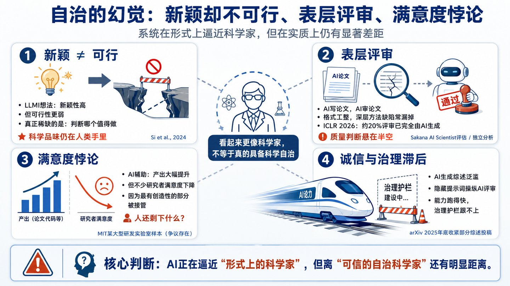

## 6.6 一个诚实的成熟度坐标

综合本章，给一个尽量持平的成熟度判断，作为上篇的核心结论。

- **能力维度：高。** 推理、规划、工具调用、实验闭环都已跨过可用门槛，瓶颈不再主要是"聪明程度"。
- **可靠性维度：低。** 复合失败、可复现危机、评估缺口共同压低了端到端的真实成功率，"demo惊艳、落地掉链子"是常态而非例外。
- **真实新发现维度：早期。** 在受控窄问题上有亮点，但"AI自主产出重要新科学"的硬证据仍然稀薄，多数成果离不开人类的深度介入与把关。
- **阶段定性：从"证明可行"转向"证明可靠"。** 2025年回答了"能不能做出来"，2026年的真问题是"能不能可靠地、可信地、在真实环境里做"。

这个坐标对读者的实用价值在于：它告诉你**机会的重心在哪**。如果能力已经够强、瓶颈在可靠性与可信，那么最大的空地就不在"造更聪明的Agent"，而在"让它可靠、可复现、可评估"，也就是第四章的基础设施层，尤其是评估与可复现。这一判断会在下篇展开为具体的入场策略。

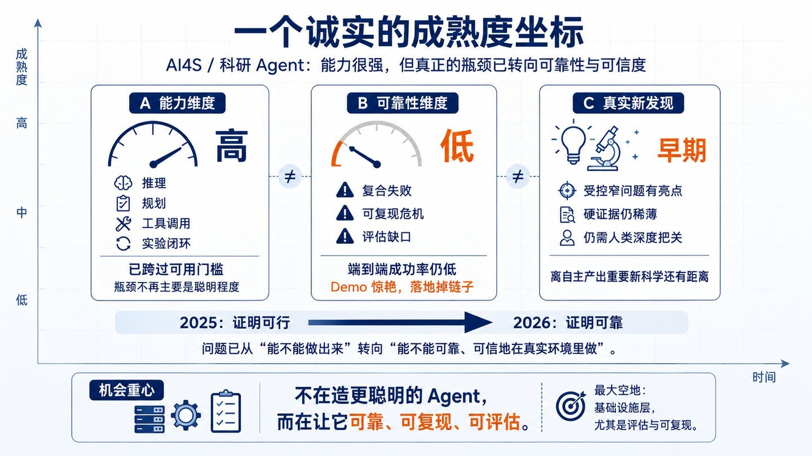

# 小结：版图已成形，但谁在为它买单？

上篇把AI for Science这件事尽量诚实地铺了一遍。先厘清什么才算科研Agent，再顺着科学家干活的六个环节、加上托底的四层基础设施，把已有的系统摆进同一张图，又按学科扫了一遍钱和热度的分布。最后给了一个不吹的判断：能力已经很强，可靠性还很弱，真正属于AI自己的新发现还谈不上。

有一件事可以确认，AI for Science的版图已经成形。它不再是一个模糊的口号，而是一个有清晰环节、清晰分层、清晰学科分布、每一块都能找到具体工作的真实领域。范式的转变也是真的，AI确实在从"读科学"走向"做科学"，哪怕"做"得还很不稳。

但版图成形只回答了它是什么，没回答它靠什么活下去。一个领域能不能从学术热闹变成站得住的产业，要看一个更现实的问题：谁在为它掏钱。资本到底进来了没有？它把这当成刚开门的新赛道，还是已经挤满人的旧赛道？又愿意为哪一层、哪一类玩家下注？而对一个有学科底子、却没有大笔资本的人来说，哪个位置才是拿长板打，而不是拿短板硬拼？

这些正是续篇要回答的。引言里埋下的"数据快被用尽"那个钩子，会在那里变成顶级资本的下注逻辑。我会用一套"看公司成立年份"的笨办法，给这个赛道做一次到底是新是旧的体检，再把它拆成两层：够不着的"造神层"，和够得着的"水电煤层"。版图已经在这儿了，下一篇，跟着投资走。

# 主要工作与文献索引

> 按出现顺序排列，便于回溯。完整书目信息以各原文为准。

**综述与框架**：From Automation to Autonomy（EMNLP 2025，含Awesome-LLM-Scientific-Discovery资源库）、Ren et al. 2025（arXiv 2503.24047）、Agentic AI for Scientific Discovery（arXiv 2503.08979）、Reddy & Shojaee 2024（arXiv 2412.11427）、Ramos, Collison & White 2024（Chemical Science）、From LLM Reasoning to Autonomous AI Agents（arXiv 2504.19678）、Hitchhiker's Guide to Scientific Agents 2025、Agentic Science（Wei et al. 2025）。

**端到端系统**：The AI Scientist v1（Lu et al. 2024）、v2（Yamada et al. 2025）、Kosmos（Mitchener et al. 2025）、Agent Laboratory（Schmidgall et al. 2025, arXiv 2501.04227）、AI-Researcher（Tang et al. 2025, arXiv 2505.18705）、Curie（Kon et al. 2025）、SciAgents（Ghafarollahi et al. 2024）、PiFlow（arXiv 2505.15047）、DeepScientist（Weng et al. 2025）、Carl（Autoscience Institute 2025）、AI Co-Scientist（DeepMind 2025）、Denario、AI Cosmologist、aiXiv（Zhang et al. 2025）。

**文献/假设/分析**：PaperQA2 / White 2024（arXiv 2409.13740）、LitLLM（Agarwal et al. 2024）、LitSearch（Ajith et al. 2024）、CiteME（Press et al. 2024）、ResearchArena（Kang & Xiong 2024）、SciLitLLM（Li et al. 2024）、AutoSurvey（Wang et al. 2024）、Si et al. 2024、Many Heads Are Better Than One（Su et al. 2024）、ResearchAgent（Baek et al. 2024）、Paper2Code（Seo et al. 2025）、AutoP2C（Lin et al. 2025）、MLR-Copilot（Du 2024）、AlphaEvolve（Novikov et al. 2025）。

**实验/自驾实验室**：Coscientist（Boiko et al. 2023, Nature）、A-Lab（LBNL 2023, Nature）、Virtual Lab（Swanson et al. 2024）、ChatMOF、Huang et al. 2025。

**评估/基准**：ScienceAgentBench（Chen et al. 2024）、PaperBench（Starace et al. 2025）、SciReplicate-Bench（Xiang et al. 2025）、CORE-Bench、AstaBench（2025）、AAAR-1.0、DiscoveryWorld、ScienceBoard、LAB-Bench / LABBench2、BixBench、Gravity-Bench（Koblischke et al. 2025）、ReplicationBench（Ye et al. 2025）、AstroVisBench（Joseph et al. 2026）、AstroM-Lab 1（Ting et al. 2024）、Astro-QA（Li et al. 2025）、Collider-Bench、TPBench。

**安全/诚信/评估批评**：Prioritizing Safeguarding Over Autonomy（Tang et al. 2024）、对Sakana AI Scientist的评估（arXiv 2502.14297）、LSST DESC AI/ML机会报告（arXiv 2601.14235）、天体物理RAG评估（arXiv 2507.07155）、ALeRCE text-to-SQL（arXiv 2606.18108）。

# 作者其它文章（选）

- [广义祖父积分学](https://x.com/snowboat84/status/2070291045007671732)
- [什么是“涌现”？涌现的研究史](https://x.com/snowboat84/status/2069931234328027483)
- [互联网泡沫简史](https://x.com/snowboat84/status/2069569161911812606)
- [AI圈大V名单（名单不断扩充中）](https://x.com/snowboat84/status/2069206740546343372)
- [我打造的个人AI系统：哲学基础](https://x.com/snowboat84/status/2068120320578629782)
- [NFT的叙事是如何崩塌的](https://x.com/snowboat84/status/2067756975069516170)
- [什么是耗散结构理论？它和AI有关系吗？](https://x.com/snowboat84/status/2067399314843000842)
- [什么是具身智能？它跟AI的关系是什么？](https://x.com/snowboat84/status/2067032626821747178)
- [长篇分析：SpaceX未来的展望](https://x.com/snowboat84/status/2066674353648046515)
- [Vibe Coding把我系统搞崩了，我对此的总结和心得](https://x.com/snowboat84/status/2065586279010742687)
- [一篇文章讲清楚美国的移民系统](https://x.com/snowboat84/status/2057980486501433383)
- [一文讲清楚美国医疗系统](https://x.com/snowboat84/status/2055081426744422697)
- [细说美国的华人老钱家族](https://x.com/snowboat84/status/2062326581776011623)
- [美国的犹太人和华人分别抢到了什么资源？详细分析](https://x.com/snowboat84/status/2063049247805837815)
- [一篇文章看懂美国教育全生态](https://x.com/snowboat84/status/2054359249917210633)
- [什么是控制论？控制论是AI的上辈子吗？](https://x.com/snowboat84/status/2064496706042069340)
- [祖父积分学概论](https://x.com/snowboat84/status/2056533111983493136)
- [教宗良十四世论人工智能（精华版）](https://x.com/snowboat84/status/2059434342745866391)
- [Vibe Reading：AI 时代读书的系统化方法](https://x.com/snowboat84/status/2050008577511973253)
- [美国税收制度完全指南](https://x.com/snowboat84/status/2060511915617779821)

---
