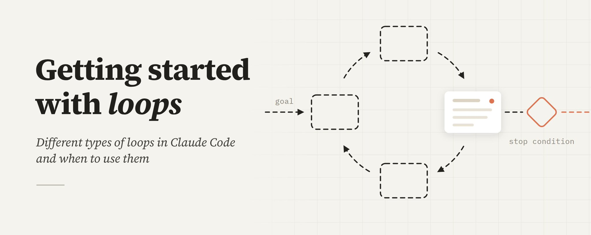
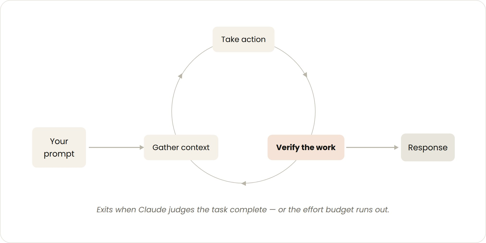
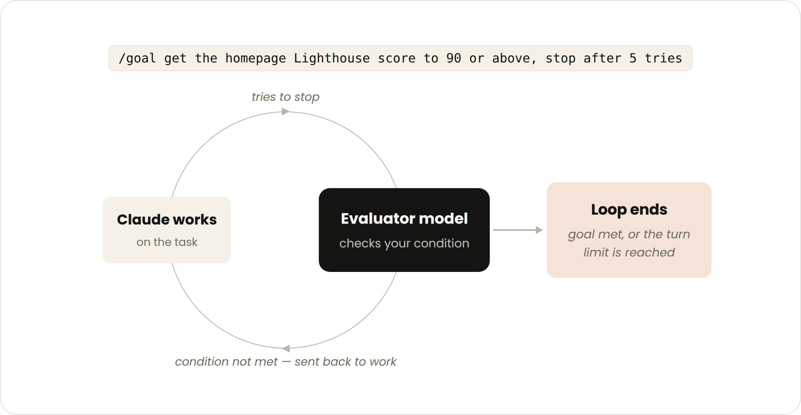
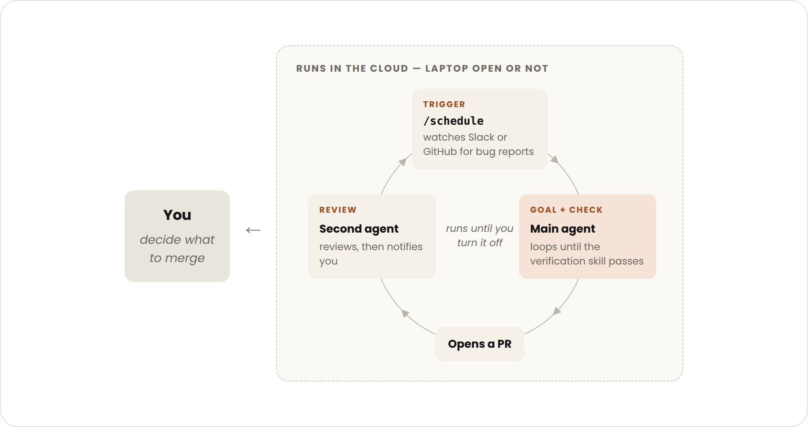

最近关于"设计循环（loop）"而非单纯给你的编程智能体（coding agent）发提示词的讨论非常热烈。但如果你花些时间在 X（Twitter）上试图搞清楚到底什么是 loop，你会发现各种不同的答案。

在 Claude Code 团队，我们将 **loop 定义为智能体重复执行工作循环，直到满足停止条件**。我们根据以下几个维度对不同类型的 loop 进行分类：

- 触发方式
- 停止方式
- 使用了哪种 Claude Code 原语（primitive）
- 最适合哪种类型的任务

本文将介绍主要的 loop 类型、何时使用每种类型，以及如何在管理 token 用量的同时保持代码质量。并非所有任务都需要复杂的 loop；从最简单的方案开始，有选择地使用这些模式。

## 基于轮次的循环（Turn-based loops）



- **触发方式**：用户提示词。
- **停止条件**：Claude 判断任务已完成或需要额外上下文。
- **最适用于**：不属于常规流程或计划的较短任务。
- **用量管理**：编写具体的提示词，并利用技能（skills）改进验证环节来减少轮次数。

你发送的每一条提示词都会启动一个手动循环，由你在每一轮中引导方向。Claude 收集上下文、执行操作、检查工作、必要时重复，然后做出响应。我们称之为**智能体循环（agentic loop）**。

例如，让 Claude 创建一个点赞按钮。它会读取你的代码、进行编辑、运行测试，然后交给你一个它认为可行的结果。你可以随后手动检查工作成果，并编写下一条提示词。

你可以通过将手动检查步骤编码为 `SKILL.md` 文件来改进验证环节，这样 Claude 就能端到端地检查自己更多的工作。这应该包括允许 Claude 查看、测量或与结果交互的工具或连接器。检查越是量化的，Claude 自我验证就越容易。

例如，在你的 `SKILL.md` 文件中可以这样定义：

```markdown
---
name: verify-frontend-change
description: 在声明完成之前，端到端地验证任何 UI 变更。
---

# 验证前端变更
永远不要仅凭编辑成功就报告 UI 变更已完成。像人工审查者一样验证：

1. 启动开发服务器并在浏览器中打开已编辑的页面。

2. 直接与变更交互。对于新控件（按钮、输入框、开关）：点击它，确认预期的状态变化，并对前后状态进行截图。

3. 检查浏览器控制台：零个新的错误或警告。

4. 使用 Chrome DevTools MCP，运行性能追踪并审计 Core Web Vitals。

如果任一步骤失败，修复问题并从步骤 1 重新运行 —— 不要交回部分验证过的成果。
```

## 基于目标的循环（/goal）



- **触发方式**：实时手动提示词。
- **停止条件**：目标达成 OR 达到最大轮次数。
- **最适用于**：具有可验证退出标准的任务。
- **用量管理**：设置明确的完成标准和显式的轮次上限，比如"5 次尝试后停止"。

有时候，单轮交互是不够的，尤其是对于更复杂的任务。智能体在能够迭代时表现更好。你可以通过 `/goal` 定义"完成"的标准，来延长 Claude 持续迭代的时间。

当你定义了成功标准后，Claude 就不需要自行判断什么算"足够好"而提前结束循环。每次 Claude 试图停止时，一个评估模型会检查你的条件，并将其送回继续工作，直到目标达成或达到你定义的轮次上限。

这就是为什么确定性标准如此有效 —— 比如通过的测试数量或达到某个分数阈值。

例如：

```bash
/goal 将首页 Lighthouse 评分提升到 90 分或以上，5 次尝试后停止。
```

## 基于时间的循环（/loop 和 /schedule）

- **触发方式**：指定的时间间隔。
- **停止条件**：你取消它，或者工作完成（PR 已合并，队列为空）。
- **最适用于**：重复性工作，或与外部环境/系统对接。
- **用量管理**：设置更长的时间间隔或基于事件而非时间做出反应。

有些智能体工作是重复性的：任务本身不变，只有输入发生变化。例如，每天早上总结 Slack 消息。其他工作则依赖外部系统，与之对接的一种简单方式是按间隔检查并对其变化做出反应。例如，一个可能收到代码审查或 CI 失败的 PR。

对于这些场景，你可以使用 `/loop` 按时间间隔重新运行提示词。例如：

```bash
/loop 5m 检查我的 PR，处理审查意见，修复失败的 CI
```

`/loop` 在你的电脑上运行，所以如果你关机它就停了。你可以通过 `/schedule` 创建例行任务，将循环迁移到云端运行。

## 主动式循环（Proactive loops）



- **触发方式**：事件或计划触发，无需人工实时参与。
- **停止条件**：每个任务在目标达成时退出。例行任务本身持续运行直到你关闭它。
- **最适用于**：重复性的、定义明确的工作流：bug 报告、issue 分类、迁移、依赖升级等。
- **用量管理**：将例行任务路由到更小、更快的模型，将判断决策留给最强大的模型。

上述原语，结合 Claude Code 的其他功能 —— 如**自动模式（auto mode）**和**动态工作流（dynamic workflows，研究预览版）** —— 可以组合成一个用于长期运行工作的 loop。

例如，要处理收到的反馈，你可以使用：

1. **`/schedule`**（研究预览版）运行一个检查新报告的例行任务
2. **`/goal`** 定义"完成"的标准，**skills** 记录如何验证
3. **动态工作流**编排智能体对每个报告进行分类、修复和审查
4. **自动模式**让例行任务无需停下来请求许可即可运行

组合在一起，提示词可以像这样：

```bash
/schedule 每小时：检查 project-feedback 频道中的 bug 报告。
/goal：在本次运行中发现的所有报告都被分类、处理并回复之前不要停止。
修复 bug 时，使用工作流在并行 worktree 中探索三种解决方案，
并由评判者进行对抗性审查。
```

## 保持代码质量

Loop 输出的质量取决于围绕它的体系设计。在设计体系时：

- **保持代码库本身整洁**：Claude 会遵循你代码库中已有的模式和约定。
- **给 Claude 一个验证自己工作的方式**：用 [skills](https://code.claude.com/docs/en/skills) 编码你自己和团队对"好"的定义。
- **让文档易于获取**：框架和库的文档包含最新的最佳实践。
- **使用第二个智能体进行代码审查**：带有全新上下文的审查者偏见更少，不会受主智能体推理过程的影响。你可以使用内置的 `/code-review` 技能或 GitHub 上的 [Code Review](https://code.claude.com/docs/en/code-review) 功能。

当某个单独的结果不达标准时，不要停留在修复单独的问题上 —— 尝试将其编码进体系中，以改进所有未来的迭代。

## 管理 Token 用量

为了管理 token 用量，loop 应该有清晰的边界：

- **为任务选择合适的原语和模型**：小任务不需要多个智能体或 loop。有些任务可以使用更便宜、更快的模型。
- **定义清晰的成功和停止标准**：明确"完成"的样子，这样 Claude 可以更快（但不会太快）地得出解决方案。
- **大规模运行前先试点**：动态工作流可以生成数百个智能体。先在较小的工作切片上评估用量。
- **对确定性工作使用脚本**：运行脚本比推理步骤更便宜。例如，PDF 技能可以附带一个填表脚本，Claude 每次直接运行即可，而不需要重新推导代码。
- **例行任务不要运行得过于频繁**：将间隔匹配到你关注的事物变化的频率。
- **审查用量**：`/usage` 命令按技能、子智能体和 MCP 细分最近的用量；不带参数的 `/goal` 显示当前轮次和 token 用量；`/workflows` 显示每个智能体的 token 用量，你可以随时停止智能体。

## 入门总结

| Loop 类型 | 你交出去的 | 何时使用 | 用到的工具 |
| --- | --- | --- | --- |
| 基于轮次 | 检查环节 | 你在探索或决策时 | 自定义验证 skills |
| 基于目标 | 停止条件 | 你知道"完成"是什么样 | /goal |
| 基于时间 | 触发器 | 工作发生在你项目之外，按计划进行 | /loop、/schedule |
| 主动式 | 提示词 | 工作是重复性且定义明确的 | 以上所有 + 动态工作流 |

要开始使用 loop，审视你已经在做的工作。选一个你是瓶颈的任务，问问自己可以交出哪一部分：你能写出验证检查吗？目标足够清晰吗？工作是否按计划到来？

一旦有了想法，运行 loop，观察结果 —— 比如它在哪里卡住或越界 —— 并大胆地对它进行迭代优化。

更多信息，请阅读 Claude Code 文档中关于[并行运行智能体](https://code.claude.com/docs/en/agents)以及 [loop](https://code.claude.com/docs/en/goal)、[schedule](https://code.claude.com/docs/en/routines)、[goal](https://code.claude.com/docs/en/goal) 和[动态工作流](https://code.claude.com/docs/en/workflows#orchestrate-subagents-at-scale-with-dynamic-workflows)的页面。

> 本文原作者：[@delba_oliveira](https://x.com/@delba_oliveira)，原文地址：[Getting started with loops](https://x.com/ClaudeDevs/status/2074208949205881033)
