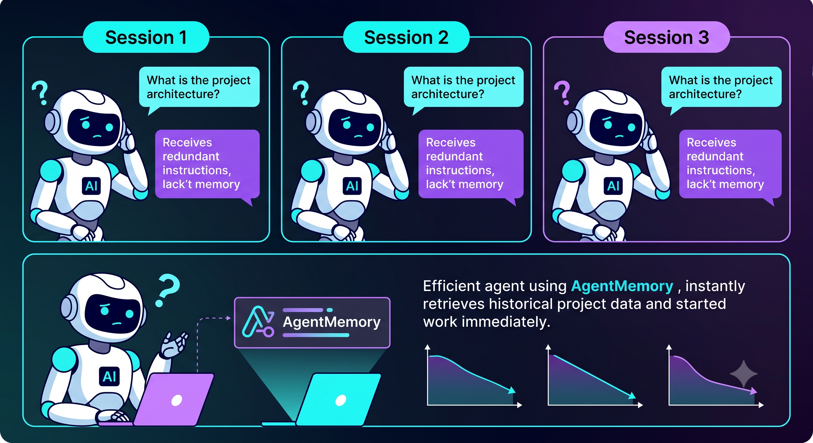
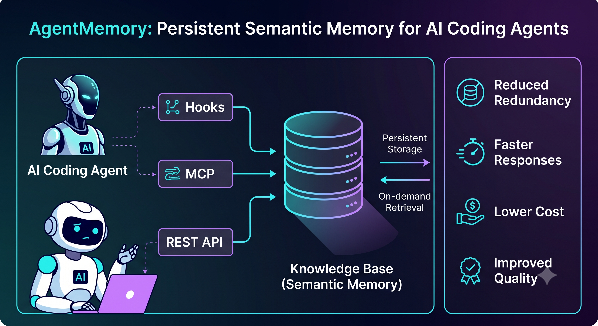
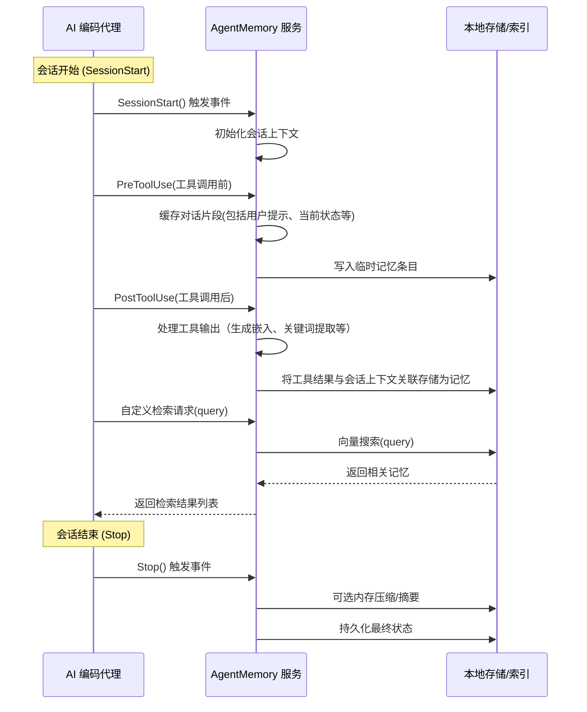
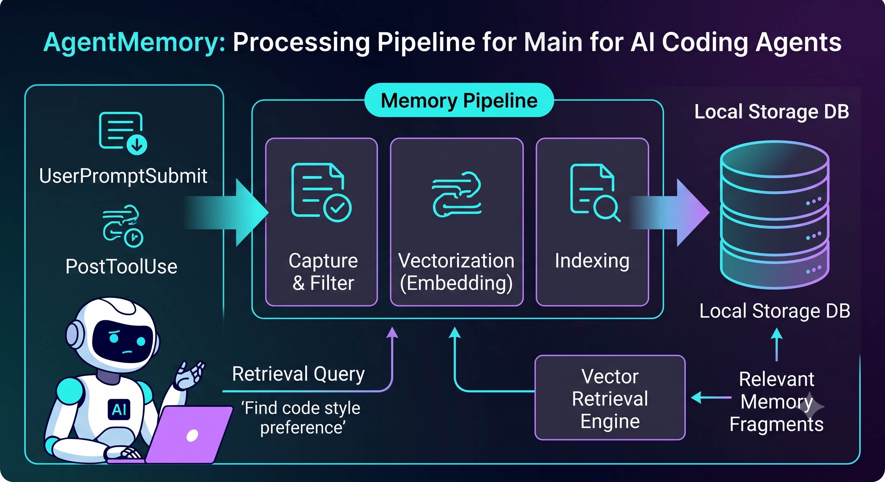
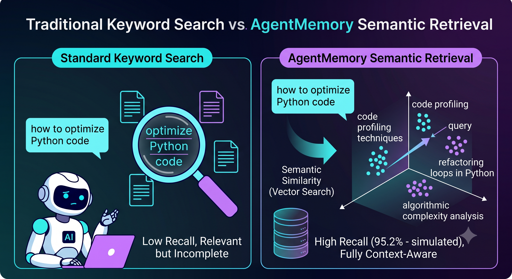
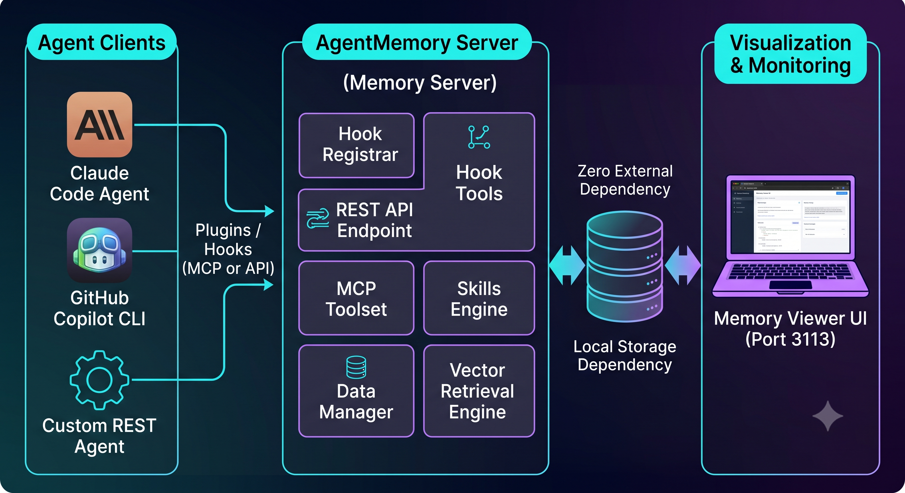
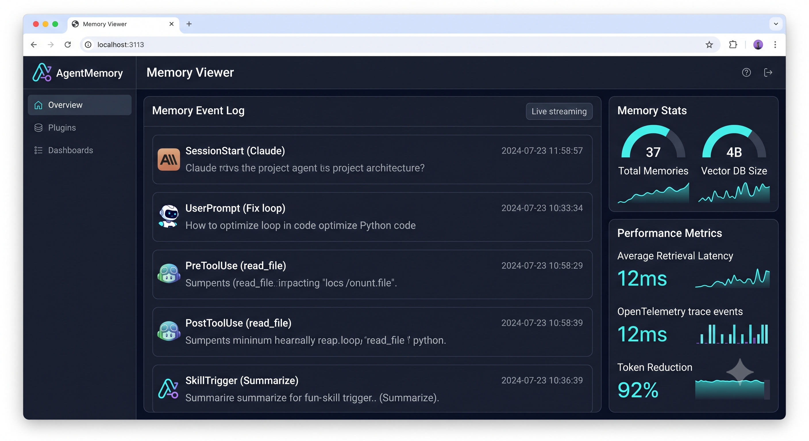
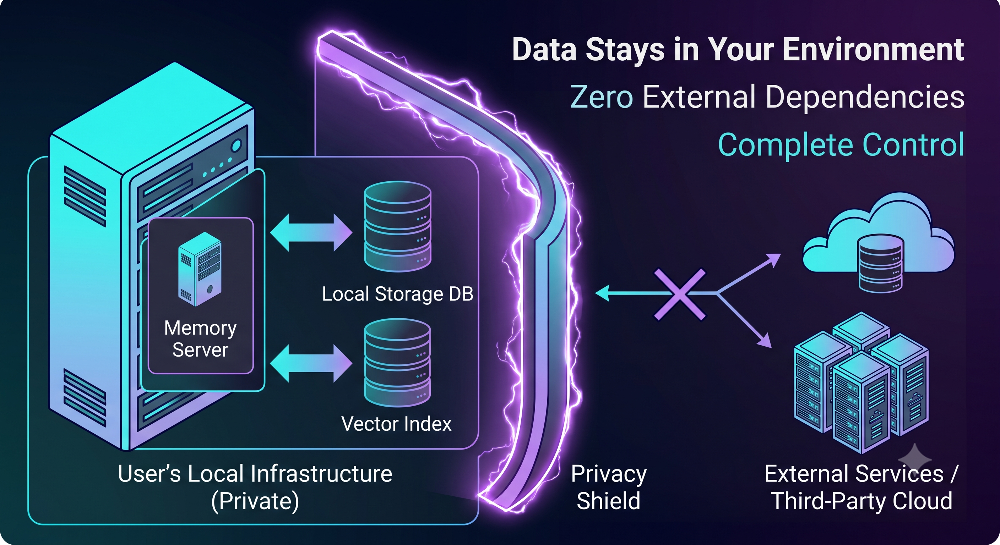
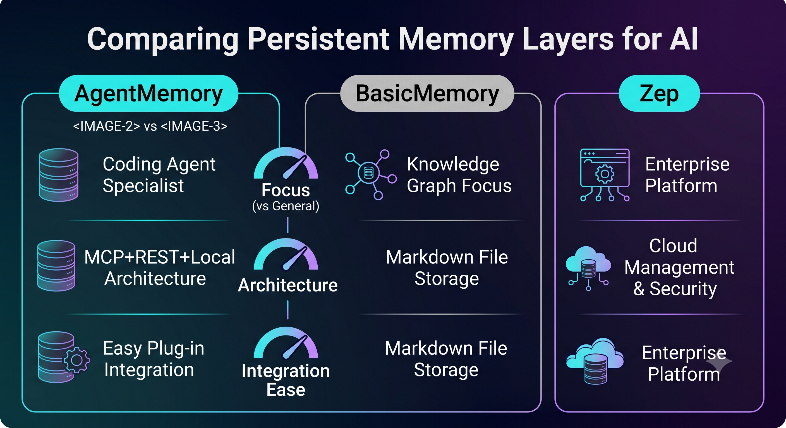

# 执行摘要

**AgentMemory** 是一款专为 AI 编码代理（coding agents）设计的开源持久化记忆层，引入了语义记忆和知识库技术，让智能体可以"记住"跨会话的关键信息，从而避免重复上下文输入，提高效率。本文基于 [AgentMemory 官方文档](https://github.com/rohitg00/agentmemory) 和 [AgentMemory 官网](https://agent-memory.dev) 等资料，从项目背景、核心概念、架构、功能、数据模型、记忆检索机制、扩展与集成、性能与安全、适用场景、同类项目对比、示例代码、部署运维到未来展望，全方位剖析 AgentMemory 的设计与实践建议。文章图文并茂，包含流程与架构示意图（使用 Mermaid 绘制）、功能/性能对比表、示例代码块等内容，力求帮助具备一定 AI/工程背景的读者全面理解 AgentMemory，并指导实际应用。



---

## 项目背景与目标

- **背景**：当前多数 AI 编码代理（如 GitHub Copilot CLI、Claude Code 等）在每次会话中往往对历史上下文"忘得一干二净"，需要反复提供项目背景、需求或代码片段，导致冗余输入、响应时长长、使用成本高。AgentMemory 的目标是给这些编码代理添加**持久化记忆**功能，使它们能记忆项目细节、用户偏好、过往操作等信息，从而在后续会话中即时检索并利用这些记忆，提升生成质量和效率。

- **主要特点**：
  - **通用性**：支持**任意支持挂钩（hooks）、MCP 或 REST API 的代理**。内置支持多种主流编码代理框架（如 Claude Code、OpenAI/Anthropic 的 CLI、GitHub Cursor 等），通过统一的记忆服务器管理所有代理的记忆。
  - **高性能**：官方披露 AgentMemory 在检索召回和上下文长度方面表现优异（如 **95.2%** 的检索召回率、**92%** 的 token 减少），意味着在保持准确性的同时大幅减小上下文规模。
  - **零外部依赖**：采用**自带存储方案**（无需外部数据库），可以在本地服务器或容器上运行，满足数据隐私和低成本需求。
  - **实时可视化**：提供**实时记忆查看器**和引擎级控制台（分别在 3113 端口等），用户可监控记忆的捕获、检索、触发过程。
  - **易用性**：通过一行命令（`npx @agentmemory/agentmemory`）部署记忆守护进程，可自动注入插件到代理，实现零粘合代码的集成。

AgentMemory 项目由 Rohit Ghumare 等人发起，目前在 GitHub 上已有上万 Star，逐步成为"AI 编码智能体记忆"领域的标杆项目。

## 核心概念与术语

- **持久化记忆（Persistent Memory）**：指跨会话保留的语义信息。对于编码代理而言，这包括先前会话中学习到的需求说明、项目结构、用户反馈、代码历史、已尝试的工具调用结果等。AgentMemory 通过持久化存储和检索机制，使这些信息在后续交互中可被调用。

- **会话（Session）**：一次完整的编码代理对话流程，从启动到结束。AgentMemory 会在每次 `SessionStart`、`Stop` 等生命周期节点自动触发记忆保存或处理。

- **钩子（Hook）**：AgentMemory 插件注册的一系列生命周期钩子（如 `SessionStart`、`PreToolUse`、`PostToolUse`、`Stop` 等）。当代理事件发生时，这些钩子将被触发，将上下文信息推送到记忆管道中。

- **MCP（Meta-Chat Protocol）**：一种代理/记忆通信协议接口（官方称为 MCP），用于在编码代理和 AgentMemory 之间传递信息。AgentMemory 注册了**53 个 MCP 工具、15 个技能（skills）、3 个提示（prompts）**等丰富组件，可被代理调用。MCP 使得记忆系统成为代理生态的一等组件，代理可以通过 MCP 调用记忆检索、数据写入等操作。

- **记忆管道（Memory Pipeline）**：指 AgentMemory 内部处理记忆的流程，包括捕获、过滤、矢量化、存储和检索等步骤。当代理执行动作时（如使用工具、提交提示等），对应事件会进入记忆管道进行处理。

- **技能（Skills）**：一种封装好的记忆操作模块，可对内存数据进行摘要、聚类、检索优化等。AgentMemory 包含多达 15 个预置技能，辅助构建知识图谱、生成语义摘要、自动修剪记忆等功能。

- **内存存储（Memory Store）**：AgentMemory 保存记忆的后端存储，通常采用轻量级方案（如本地文件或 SQLite）保存语义嵌入向量和原文记录。记载"0 外部数据库"，意味着不依赖外部服务，所有数据本地化。

- **记忆重检索（Memory Retrieval）**：代理发起检索请求时，根据输入查询（query）与存储的记忆进行相似度搜索，返回与当前上下文相关的记忆片段。AgentMemory 承诺以毫秒级速度返回检索结果，并大幅减少对原始上下文的依赖。

- **实时查看器（Memory Viewer）**：AgentMemory 内置 Web UI（默认为 `http://localhost:3113`），以流水线形式展示已捕获的记忆条目、触发细节和性能指标，方便用户监控和调试。

以上术语构成了 AgentMemory 的基础概念体系，后续各模块和功能均围绕这些概念展开。

## 架构与模块详解



AgentMemory 的整体架构可以抽象为一个中心记忆服务器（Memory Server），外部各种编码代理（Agent Client）通过插件或 API 与之通信。下图为其高层次架构示意：

```mermaid
graph LR
  subgraph 代理端(Agents)
    A1[Claude Code Agent]
    A2[GitHub Copilot CLI]
    A3[其他支持MCP/REST的编码代理]
  end
  subgraph 记忆服务器(Memory Server)
    MS[AgentMemory Server (进程)] --> DB[(本地存储 DB)]
    MS --> UI[Web UI (Port 3113)]
  end
  A1 ---|插件/钩子| MS
  A2 ---|插件/钩子| MS
  A3 ---|API 请求| MS
  UI <-->|监控/配置| MS
```

- **记忆服务器（Memory Server）**：核心进程，运行在本地（默认监听 `3111` 端口），管理所有记忆数据。它包含以下组件：
  - *Hook 注册模块*：自动注入到支持 MCP/钩子的代理，拦截关键事件（如会话开始/结束、工具调用前后等），并将信息发送给记忆服务。
  - *API 服务*：对外暴露 REST 接口，如 `POST /memories`（写入记忆）、`POST /search`（检索记忆）、`GET /stats`（查看统计）等。代理和用户都可以通过调用这些接口与记忆系统交互。
  - *MCP 工具集（Tools）*：53 个预定义工具允许代理在对话中直接调用记忆相关操作，如添加条目、查询内容、清理记忆等。
  - *技能（Skills）引擎*：15 个技能帮助加工记忆，例如自动生成摘要、关系分析、向量聚类等。
  - *数据管理*：负责将处理后的记忆数据持久化，本地存储方式通常是嵌入式数据库或文件系统。
  - *检索引擎*：采用语义向量检索，对记忆进行向量化并建立索引，实现快速相似度搜索。具体选用的检索库未明确，但满足 **毫秒级检索延迟** 的设计目标。

- **代理插件（Agent Plugins）**：针对不同编码代理提供的接入方式。官方目前提供：
  - Claude Code 原生插件（基于 MCP），自动拦截 Claude 会话的所有生命周期事件。
  - GitHub Copilot CLI / Cursor 集成（通常通过 MCP 或 hooks）。
  - 其他采用 OpenAI/Anthropic CLI、平台 API 的代理也可以通过配置调用 Memory Server 的 REST 接口。
  - 若代理不支持直接调用，可以通过 `agentmemory` 命令行生成 `.mcp.json` 文件等方式进行无缝接入。

- **可视化与监控**：运行服务器后，访问 `http://localhost:3113` 可看到"实时记忆查看器"。该界面展示了记忆条目的流式记录、每条记忆的元数据、触发时间线，以及后台引擎的性能指标（如 OpenTelemetry 跟踪）。这种可视化有助于理解记忆何时被捕获以及哪些事件触发了存储/检索。

- **CLI 工具**：AgentMemory 作为 npm 包可以通过 `npx @agentmemory/agentmemory` 安装启动。CLI 会生成配置文件并启动服务。常用命令包括：
  - `npx @agentmemory/agentmemory start`：启动记忆服务器（可指定端口/目录）。
  - `npx @agentmemory/agentmemory mkconfig`：生成示例配置（包括 API 密钥、代理集成设置等）。
  - `npx @agentmemory/agentmemory ps`：查看当前记忆服务状态。
  - `agentmemory --help`：列出可用命令和选项。

### 架构示意



图中展示了代理与记忆服务器交互的主要流程：代理触发一系列事件，Memory Server 捕获并写入本地数据库。代理在需要时可查询该数据库，获得相关记忆。会话结束时，Memory Server 可能执行**压缩（compaction）**或**摘要**等操作，以控制存储规模（例如将冗长的对话聚合为简要记录）。

## 关键功能与API示例



AgentMemory 提供丰富功能，既包括自动化的钩子捕获，也包括人工可调用的接口/工具，下面列举主要特性并给出示例。

- **自动捕获代理行为**：只需安装插件或启用 MCP，AgentMemory 会自动监听以下事件，将相关上下文记入记忆层：
  - 会话生命周期：`SessionStart`（初始化）、`Stop`（结束清理）。
  - 工具调用：`PreToolUse`（工具调用前获取输入提示）、`PostToolUse`（获取工具执行输出）。
  - 用户输入：`UserPromptSubmit`（用户提交自然语言提示）。
  - 其他：如 `PreCompact`（内存压缩前）等，共 **6 个生命周期钩子**。
  例如，在 Claude Code 中，安装 AgentMemory 插件后，开发者无需修改代码，即可自动捕获以上事件数据。

- **记忆存储 API**：对记忆服务器直接调用 REST API，可完成数据读写操作。假设记忆服务在本地 3111 端口运行：
  
  ```bash
  # 插入新记忆（POST body 包含文本与 metadata）
  curl -X POST http://localhost:3111/memories \
    -H "Content-Type: application/json" \
    -d '{ "text": "用户喜欢简洁的代码风格", "metadata": {"source":"UserPref"} }'

  # 检索记忆（POST 查询语句）
  curl -X POST http://localhost:3111/search \
    -H "Content-Type: application/json" \
    -d '{ "query": "代码风格", "topK": 5 }'
  ```
  
  上例中，`/memories` 端点用于写入记忆条目，`/search` 返回与 `query` 相似的 `topK` 条记忆。实际使用时，客户端可以得到 JSON 格式的记忆结果列表，包括文本及相关度分数。

- **MCP 工具调用**：AgentMemory 注册了多个 MCP 工具，让代理可以在对话中通过工具调用方式交互。例如，在 Claude Code 会话中，可以像调用其他工具一样调用记忆检索工具：
  
  ```json
  {
    "name": "search_memory",
    "arguments": {
      "query": "项目架构概述",
      "top_k": 3
    }
  }
  ```
  
  这会返回与"项目架构概述"相关的记忆，代理可以将其用于当前回答。

- **技能（Skills）功能**：提供生成摘要、提取标签、生命周期管理等高级功能。例如，有技能可定期自动总结长期对话，生成 `Memory Summary`；也有技能可清理过时记忆。配置示例（伪代码）：
  ```yaml
  skills:
    - name: summarize
      trigger: on_session_end
      options:
        max_length: 100
    - name: prune
      trigger: cron
      schedule: "0 0 * * *"
      options:
        threshold_days: 30
  ```
  以上配置表示会话结束时生成摘要，每月清理 30 天未访问的记忆条目。

- **实时查看器与控制台**：通过浏览器访问 `http://localhost:3113`，可以查看实时记忆流、数据库统计、OTel 性能指标等。有助于调试记忆触发与检索是否正常，监控查询响应时间、内存使用等。

下面是一个**简要的 API 端点表**示例，帮助理解常用接口（实际可能更多）：

| 端点                | 方法 | 功能说明                 |
|:-------------------:|:----:|:-------------------------|
| `/memories`         | POST | 写入新记忆条目           |
| `/search`           | POST | 按查询文本检索相关记忆   |
| `/memories/{id}`    | GET  | 获取指定记忆详情         |
| `/config`           | GET  | 查看当前服务器配置       |
| `/stats`            | GET  | 查看记忆统计与性能指标   |
| `/health`           | GET  | 服务健康检查             |

以上端点仅作为示例，具体接口请参见官方文档或调用 `--help` 生成的 OpenAPI 说明。

## 数据模型与存储策略



AgentMemory 的**数据模型**可视为一个多层次的记忆知识库：每个记忆条目（memory entry）包含原始文本（如对话片段、工具输出）、时间戳、关联元数据（用户、工具名称、来源类型等），以及对应的**向量嵌入**。存储结构大致如下：

- **原文日志（Text Store）**：记录原始信息文本，如用户提示、代码片段、错误日志、工具结果等。这些文本可以在必要时查看或人工验证。
- **向量索引（Vector Index）**：使用预训练的文本嵌入模型（配置依赖）将每条记忆转为高维向量，并使用向量检索库（如 HNSW、FAISS 等）建立索引，实现快速相似度搜索。AgentMemory 可能默认使用某种 Embedding 服务（如 OpenAI Embeddings、或开源模型），但官方未明确说明，可根据部署需求自由切换。
- **元数据（Metadata）**：为每条记忆保存上下文信息，如所属会话 ID、触发时间、代理类别（如 Copilot、Claude）、技能标签等。这样在检索时可以根据需求过滤或排序。
- **本地存储方案**：AgentMemory 官方宣称**无需外部数据库**。通常它采用本地嵌入式数据库或自定义二进制格式文件（可能基于 SQLite 或 LevelDB）。这种设计保证了**部署简单**、**数据私有**（所有信息保存在用户的服务器上），适用于企业或个人环境。

**存储策略**方面，为避免记忆量无限增长，AgentMemory 可能采用以下方法（官方未全部公开细节，可根据常见实践推测）：
- **定期压缩/摘要**：如前所述，可在会话结束时或定时触发，会将相关记忆合并为摘要。例如将一段长对话压缩为要点摘要，替换原始详细记录，减少存储占用。
- **主动整理**：通过技能自动检测无关或重复记忆，对其进行聚类或删除，保持知识库的整洁度。
- **层级存储**：潜在支持"热存储/冷存储"，将近期活跃记忆放在快速索引库，较旧记忆归档备份（当前版本是否支持未确定，标注为"未指定"）。

存储规模与复杂度分析见下表（示例）：

| 类别            | 描述                                  | 复杂度/规模    |
|:----------------:|:-------------------------------------:|:---------------|
| 记忆条目数量    | 以 N 表示（会话次数×事件数）          | O(N)           |
| 每条记忆大小    | 平均 L 字符（可变）                    | O(L)           |
| 检索时间        | 向量搜索复杂度（近似常数因子）          | ~O(log N)  或 近似 O(1) |
| 存储成本        | 本地磁盘/SSD（无额外 DB）             | O(NL)          |
| 摘要/压缩操作  | 基于模型的处理，时间随条目长度增长      | O(L)           |

在实际使用中，如果存储条目数达到万级以上，建议监控磁盘和内存使用情况，适时调整压缩策略。

## 记忆检索与更新机制



AgentMemory 的记忆检索机制核心是**语义搜索**：给定当前上下文（如用户问题或代码片段），生成查询向量并在记忆向量空间进行近似邻居搜索。结合上下文和元数据过滤，可返回最相关的历史记忆。关键机制包括：

- **向量检索（Vector Search）**：每条记忆都有对应的嵌入向量。检索时，系统使用与创建时相同的嵌入模型将查询转换向量，并在向量索引中寻找最近邻。AgentMemory 声称检索召回率高达 95.2%，说明其向量模型和索引效果不错。
- **上下文关联**：当代理提交查询时，传给 Memory Server 的通常包含上下文（可能不仅仅是一个短 query）。比如，代理可以将整段对话或文件内容作为查询，Memory Server 会综合考虑上下文与记忆内容的相似度。



- **实时更新**：记忆库是动态的，每次会话中产生的新记忆会实时写入存储，因此检索结果会随着会话进展而更新。AgentMemory 设计了**内存流**，新记忆可以立即用于本会话后续检索，保证代理"刚学的内容马上能用"。
- **记忆合并与消除冗余**：当新的记忆与已有记忆高度重复时，系统可能触发"内存压缩"技能，将它们合并或忽略，避免存储重复信息。详情未完全公开，可理解为稀疏化存储。

下面给出**示例**：假设用户在早期会话说过"我喜欢模块化的函数设计"，而这条记忆已保存；在后续会话中用户提问"如何改进代码结构？"，代理通过 Memory Server 检索时，该记忆可能被作为关键词提示，以此提醒代理保持模块化思路。

**记忆更新**方面，AgentMemory 提供如下操作：
- **显式写入**：通过 API 或 MCP 工具，由用户或代理明确将信息写入记忆库。例如代理可以在关键步骤后主动调用 `add_memory` 工具。
- **自动捕获**：如前所述，绝大多数更新由钩子自动完成；无需用户干预。
- **删除/清理**：AgentMemory 目前没有提到自动遗忘（auto-forget）机制，但可以通过 API 手动删除或技能定期清除无用记忆。例如调用 DELETE `/memories/{id}`。
- **触发条件**：可以基于条件（如记忆年龄、重要性评分）触发压缩或删除。

总体而言，AgentMemory 通过"捕获-索引-检索-压缩"的闭环机制，实现了持续演进的代理记忆管理。

## 扩展性与集成

AgentMemory 的设计高度模块化，便于与常见代理框架、LLM 服务和工具链集成。主要扩展点和集成方式包括：

- **代理框架支持**：官方文档列出了支持的代理环境（来源于 npm 包信息）：
  - Claude Family：Claude Code（Anthropic）、Claude 原生环境
  - GitHub：Copilot CLI、Cursor
  - OpenAI：Codex CLI（基于 OpenAI Codex 的工具）
  - 其他：GenAI、Harness、Hermes、OpenClaw 等新兴系统
  这些框架通常支持通过 MCP（**Meta-Protocol**）或插件机制添加记忆功能。安装 AgentMemory 插件后，上述代理即刻获得长时记忆能力。

- **LLM 接口**：由于 AgentMemory 以**REST API**方式提供服务，它可以和任何调用模型的系统集成。例如：
  - **LangChain** 等代理开发框架：可将 AgentMemory 作为外部记忆存储，替代或补充原有记忆模块。
  - **Custom Bots**：无论是使用 GPT-4all、Mistral、LLaMA 等本地/云模型，只要在代码中加入 HTTP 调用，均可接入 AgentMemory 进行语义记忆管理。

- **Plug-in 机制**：AgentMemory 自身也鼓励生态扩展。开发者可以编写自定义钩子或技能插件，如提取某种特定结构信息、与其他外部知识库同步等。其代码库为 TypeScript/NPM 模块，支持通过继承或配置扩展功能。例如，可以开发"Git 仓库插件"，自动将新提交的代码生成记忆条目。

- **横向扩展**：在高并发场景下，理论上可以多实例部署 AgentMemory 服务并采用共享存储，但官方架构目前以单进程为主。对于企业级应用，可以在容器集群中水平扩展（将存储目录挂载到网络存储），或关注社区后续是否支持分布式部署。

- **使用的 LLM**：AgentMemory 对使用的语言模型并不限定（"未指定"）。在检索/压缩时，如果需要调用 LLM 生成摘要或进行语义分析，则可以配置为使用如 GPT-4、Claude、LLaMA 等模型。用户需自行在配置中提供对应 API 密钥或模型地址。

下面给出一个简单的**使用示例**，演示如何在 Node.js 中通过 npm 包启动 AgentMemory 服务并与之交互（假设已安装依赖并在项目中）：

```javascript
const { startAgentMemoryServer, MemoryClient } = require('@agentmemory/agentmemory');

// 启动内存服务器（默认端口 3111）
async function startMemoryServer() {
  const server = await startAgentMemoryServer({
    port: 3111,
    // 可选：指定存储目录、日志级别等
    storageDir: './agent_memory_db',
    logging: 'info'
  });
  console.log('AgentMemory 服务器已启动。');
  return server;
}

// 示例：添加和检索记忆
async function exampleMemoryOperations() {
  const client = new MemoryClient('http://localhost:3111');

  // 写入一条记忆
  await client.addMemory({
    text: '用户喜欢使用 TypeScript 编写代码。',
    metadata: { source: 'user-preference' }
  });
  console.log('已添加记忆：用户喜欢 TypeScript。');

  // 检索与 'TypeScript 偏好' 相关的记忆
  const results = await client.searchMemory({
    query: 'TypeScript 代码 偏好',
    topK: 3
  });
  console.log('检索结果：', results);
}

(async () => {
  const server = await startMemoryServer();
  await exampleMemoryOperations();

  // 可根据需要停止服务器
  // await server.stop();
})();
```

> **说明**：以上代码为示例，实际 API 名称和用法可能随版本变化。`MemoryClient` 仅为假设名，实际使用时请参考官方 SDK 或 REST 接口文档。该示例演示了启动服务、写入记忆、执行检索的流程，为 AgentMemory 的核心功能提供了直观示例。

## 性能与安全/隐私考量

**性能方面**，AgentMemory 强调低延迟检索和节省上下文成本。主要考量包括：
- **检索速度**：通过向量索引技术，可实现**毫秒级**相似度检索。官方宣称召回率高于 95%，同时显著减少 LLM 输入的 tokens。不过实际效果依赖硬件、记忆规模和嵌入模型质量。通常建议在 CPU 足够的机器上运行，并根据需要调整索引参数。
- **资源消耗**：运行一个记忆服务器会占用部分内存和存储。虽然不依赖外部数据库，但大规模记忆可能需要若干 GB 存储。推荐使用 SSD 磁盘存储以加速读写。内存占用随并发量和查询缓存而异，建议监控并可配置垃圾回收策略。
- **多代理协作**：多个代理同时使用单个 MemoryServer 时要注意互斥问题。AgentMemory 应设计为线程安全或进程安全，实际并发量测试需参照社区基准。部署时可考虑给每个大型项目单独实例，避免资源竞争。

**安全与隐私**方面：
- **数据本地化**：AgentMemory 默认所有数据存储在用户本地环境，无云端传输。这对企业用户友好，隐私信息不会泄露到第三方服务。
- **访问控制**：官方未提到复杂权限管理。部署者可通过网络访问控制（如仅在内网监听）、防火墙规则或配置用户名/密码（如果 AgentMemory 支持）来限制访问。对于敏感项目，建议置于受限网络环境中运行。
- **加密与合规**：如果记忆中可能包含敏感数据（如代码片段、客户信息等），可自行对存储目录进行加密或使用加密文件系统。当前版本"未指定"是否提供加密支持，用户需自行负责合规审计。
- **模型调用安全**：AgentMemory 若需调用外部 LLM（如 OpenAI API）生成摘要等，注意 API 密钥管理、安全调用和请求频率限制，防止信息外泄。
- **可靠性**：生产环境部署时，建议开启日志和监控，定期备份记忆数据库。记忆系统未标明自带高可用方案，如有高可靠需求，可参考Docker/容器编排，或部署在多节点（同存储）环境。

综合而言，AgentMemory 的性能表现优异，适合中大型项目使用。但也需根据实际需求**权衡系统资源、隐私需求**等，选择合适的部署架构和安全措施。

## 适用场景与限制

**适用场景**：
- **大型代码库维护**：在多人或持续集成项目中，AgentMemory 可帮助编码代理记住项目约定、历史决策和已完成的任务，提升协作效率。
- **长期对话型开发**：对于需要多轮迭代的开发任务（如需求讨论、方案调优），记忆系统能让代理"保持上下文"，避免重复解释。
- **个性化开发助手**：通过记忆记录用户偏好（如偏好的代码风格、常用库），每次使用代理时提供更加个性化的建议。
- **学习与调试**：帮助代理记住常见错误模式或调试过程，提高问题定位效率。比如代理可以检索过往的错误日志来协助诊断。
- **多代理协同**：在由多个不同类型代理（ChatGPT、Claude Code、专用工具）协作的环境中，AgentMemory 可以作为统一的记忆层，协调各方共享知识。

**主要限制**（"未指定"的特性或潜在不足）：
- **资源需求**：长期会话下记忆库可能膨胀，需要定期维护；在资源受限环境下要监控存储和内存占用。
- **记忆质量依赖**：记忆检索效果高度依赖嵌入模型的质量和文本预处理。若项目包含大量代码、图表或非文本信息，效果可能下降。
- **隐私与合规**：企业场景中，是否允许存储和处理可能含敏感信息的用户数据需谨慎评估和审计。当前系统缺乏细粒度权限控制。
- **学习曲线**：虽然提供了"一键安装"体验，但对代理和用户而言，理解何时会触发记忆、如何编写触发条件仍有学习成本。
- **在线/离线模式**：AgentMemory 主要为在线服务设计；若需要在完全离线环境中使用（无网络/无API），依赖嵌入的功能可能受限（如果默认使用云API）。
- **多语言/多模态**：当前主要关注编码和文本内容，若代理要记忆图像、音频等多模态信息，需要额外扩展支持。

## 与同类项目对比



目前市场和社区中已经出现若干持久化记忆解决方案，下面与 AgentMemory 做简要比较（以常见的几个项目为例）：

| **特性/项目**       | **AgentMemory**                                              | **BasicMemory** （Lightwolf）         | **Zep** （企业级平台）               | **其他解决方案**               |
|---------------------|------------------------------------------------------------|---------------------------------------|-------------------------------------|--------------------------------|
| **定位**           | 面向编码代理的语义持久记忆层                                  | 基于知识图谱的文件记忆系统             | 企业级记忆管理平台                  | 如 Mem0.ai、Memory Graph 等    |
| **架构**           | 独立服务（MCP+REST API）+本地存储                            | 纯文件存储（Markdown 转换知识图）      | 云管理服务（SAAS） + 授权本地组件    | 大多为自管理或SDK形式          |
| **集成方式**       | 插件+API，支持Claude Code、Copilot、Codex CLI 等              | 依赖代理框架调用知识图工具（如 AWS）     | 提供Web API/SDK，可自定义存储后端    | 多为通用 API / SDK            |
| **数据存储**       | 本地向量数据库（无外部DB），语义索引                         | 知识图谱（文件和图数据库）             | 分布式存储 + 向量检索                | 多样（有云向量DB或开源方案）   |
| **记忆检索**       | 向量化语义检索（高召回率），并支持按照元数据过滤              | 依赖自定义索引（如OpenSearch）         | 支持复杂查询和权限策略               | 多使用向量搜索或RAG            |
| **隐私**           | 完全本地化，适合私有部署                                    | 同样本地化/用户控制                   | 企业安全（加密存储、权限管理）      | 视实现而定                    |
| **可视化**         | 内置实时查看器（Memory Lane）                               | 无专门界面，需要使用语言链接查询       | 企业仪表板 + 分析工具                | 少量内置（多依赖第三方工具）  |
| **性能**           | 据称高效，检索毫秒级，资源依赖机器配置                       | 限于图数据库性能                      | 高度可扩展（云架构），按需扩容      | 不同产品差异大                |
| **社区与成熟度**   | 新兴活跃（GitHub热度高）                                     | 较早期项目，有一定社区使用            | 成熟企业产品，商业支持              | 各有特点，多为创新项目        |
| **费用**           | 开源（Apache-2.0），自托管成本（低）                        | 开源（MIT），部署成本低                | 商业收费模式                         | 常见开源免费或服务费模式      |

从比较来看，AgentMemory 的核心优势在于**面向编码代理**的完整生态支持、**即插即用的本地化**架构，以及较高的检索性能。与 **BasicMemory** 侧重于将会话记录转图存储不同，AgentMemory 更强调语义向量搜索和自动化（无需用户手动编写笔记）。与企业级平台如 **Zep** 相比，AgentMemory 更轻量灵活（免费开源），但不提供复杂组织管理和云端服务功能。总的来说，AgentMemory 在编码智能体场景下具有很高的实用性和性价比；在大规模企业场景或需要跨应用共享时，可考虑 Zep 等商业解决方案。

## 实践示例

### 示例 1：在 CLI 代理中使用 AgentMemory

假设使用 GitHub Copilot CLI（`github-copilot-cli`）开发工具，并希望将 AgentMemory 集成其中。可以按以下步骤操作（示例）：

1. **安装 AgentMemory**：在终端运行 `npx @agentmemory/agentmemory install`，这会配置 Copilot CLI 使用 AgentMemory 插件。
2. **启动 Memory Server**：运行 `npx @agentmemory/agentmemory start --port 3111`。可以看到控制台输出记忆服务已启动。
3. **配置环境**：在 `.codex/config.json` 或 `~/.codex/hooks`（取决于代理）中确认已自动添加钩子指令。
4. **测试写入记忆**：在 Copilot CLI 中输入代码提示，如 `"// 创建一个函数，返回数组中所有正数"`。执行过程中，AgentMemory 会自动捕获该提示为记忆。
5. **查询记忆**：在另一个会话中输入 `"Use the memory tool to recall positive number function"`（假设启用记忆查询工具），代理将从 AgentMemory 中检索并利用之前的提示，生成更高效的答案。

> **示意代码**（Copilot CLI 下记忆检索工具的调用格式）：
> ```json
> {
>   "name": "search_memory",
>   "arguments": {
>     "query": "正数 函数 功能",
>     "top_k": 3
>   }
> }
> ```
> Copilot CLI 拥有自己的工具调用系统，上述配置让代理调用 `search_memory` 工具。

### 示例 2：在自定义 Node.js 代理中使用 REST API

假设开发者自己编写了一个使用 OpenAI API 的聊天机器人，希望通过 HTTP 调用 AgentMemory：

```javascript
const axios = require('axios');

async function queryMemoryServer(question) {
  // 调用 AgentMemory 的搜索接口
  const res = await axios.post('http://localhost:3111/search', {
    query: question,
    topK: 5
  });
  return res.data; // 返回匹配的记忆列表
}

async function chatWithMemory(userInput) {
  // 先检索相关记忆
  const memories = await queryMemoryServer(userInput);
  console.log("相关记忆：", memories);

  // 将记忆融入对话上下文，再调用模型
  let context = userInput;
  if (memories && memories.length) {
    context = memories.map(m => m.text).join('\n') + '\n\n' + userInput;
  }
  const completion = await openai.createCompletion({
    model: "gpt-4",
    prompt: context,
    max_tokens: 150,
  });
  return completion.data.choices[0].text;
}

// 示例调用
(async () => {
  const answer = await chatWithMemory("优化代码的建议");
  console.log("模型回答：", answer);
})();
```

在上例中，机器人先通过 REST API 从 AgentMemory 检索可能相关的记忆，然后将这些记忆文本与用户输入合并后提交给 LLM 模型，得到的回答即是融合了历史信息的结果。实际项目中可以对查询结果进行排序、过滤，仅取最相关的几条记忆。

## 部署与运维建议



- **部署环境**：AgentMemory 对硬件要求不高，一般通用 Linux 服务器即可。确保 Node.js 环境和存储空间满足预期的记忆量。推荐将记忆服务与编码代理运行在同一局域网内，或使用反向代理以内网访问为主。

- **启动方式**：生产环境可考虑使用 PM2、Docker 或 k8s 等保持 AgentMemory 进程常驻。官方支持通过 `npx` 启动，但也可全局安装或将其容器化部署。示例 Docker 启动命令：
  ```bash
  docker run -d -p 3111:3111 -p 3113:3113 \
    -v /data/agentmemory:/app/storage \
    agentmemory/agentmemory:latest
  ```
  （以上假设存在官方提供的容器镜像）

- **配置管理**：使用环境变量或配置文件来管理端口、存储路径、模型密钥等。避免在公共代码库中硬编码密钥。定期检查配置更新。

- **监控与日志**：开启 AgentMemory 的日志功能（可配置为 info/debug），并定期查看 `stats` 端点或 UI 提供的指标。监控关键指标如内存使用、查询延迟、数据库大小等。

- **备份策略**：由于记忆数据可能重要，建议定期备份存储目录。例如使用增量备份工具或快照技术。若部署在容器中，可挂载持久卷并备份卷数据。

- **升级与版本管理**：关注 AgentMemory 发布的新版本（npm 包版本）。升级前查看发行说明，备份现有数据。升级通常仅涉及无缝替换 npm 包或容器镜像，但要注意兼容性。

- **故障恢复**：若 Memory Server 意外关闭或崩溃，未提交的数据可能丢失。可通过监控避免进程异常退出。对容器化部署，可配置自动重启策略。

## 未来发展方向与改进建议

- **数据加密与多租户支持**：增加对存储数据加密的支持、访问控制列表（ACL），以便在云端或多用户环境下提供更严格的安全性。
- **多模态记忆**：目前主要针对文本，未来可扩展记忆到代码 AST、图像示意图、语音或视频片段等，为更广泛的智能体场景提供支持。
- **分布式部署**：对超大规模应用而言，可考虑支持分片或分布式向量索引，实现横向扩展、负载均衡能力。
- **记忆评估和活跃性**：引入记忆"重要性评分"或"活跃度"指标，自动淘汰长期未用的记忆，保持知识库新鲜度。
- **更精细的知识图谱**：目前 AgentMemory 强调向量检索，未来可与图数据库结合，提供更可解释的知识图谱视图，支持复杂关系查询。
- **社区生态**：官方可鼓励更多开发者贡献**自定义钩子、技能插件**，形成插件市场，让 AgentMemory 支持更多专业场景（如金融行业、医疗行业模板）。
- **深度学习增强**：研究用更强大的模型自动生成和分类记忆片段；例如使用大型语言模型自动标注、分组或扩充记忆内容。
- **Benchmark 测试**：社区可定期发布**多代理、多任务场景**下的基准测试，帮助用户量化 AgentMemory 对性能和结果质量的提升效果，并与其他方案对比。

综上，AgentMemory 作为一个快速迭代的开源项目，在社区活跃度和功能上都有强劲增长空间。随着 AI 代理应用的普及，持久记忆需求会越来越高，AgentMemory 在可扩展性和智能化方面的改进值得期待。

## 结论与实践建议

AgentMemory 通过提供"一致的记忆层"极大地拓展了编码代理的能力，使它们不再每次从零开始，而是可"继承"项目的历史知识。这不仅能减少重复工作，还能在复杂开发任务中提高生产力。在使用 AgentMemory 时，我们建议：

- **从小规模试验开始**：先在一个小项目中集成 AgentMemory，熟悉钩子、工具和查询机制，再逐步在生产项目中推广。
- **关注检索质量**：根据项目特点选择和微调嵌入模型，确保检索结果相关性高。可尝试不同 `topK` 设置和平滑文本预处理。
- **定义记忆策略**：根据团队需求，明确什么信息应保存在记忆中，比如架构说明、用户偏好、技术决策等；同时避免保存敏感信息。
- **定期维护**：配置定时摘要和清理任务，避免记忆库杂乱无章。监控磁盘使用并做好扩容准备。
- **安全审计**：在涉及敏感数据的场景里，将 Memory 服务置于受信网络，并定期审查存储内容。

总体而言，AgentMemory 作为 AI 编码代理的持久记忆解决方案，提供了专业级的功能和易用性，在特定场景下能显著提升代理的"学习能力"。本文综合官方文档和社区资源，对其设计思想、功能架构、使用示例和实践注意事项做了详尽介绍，供有需求的开发者参考。随着技术发展，我们也期待 AgentMemory 在可用性和智能化方面不断完善，为 AI 代理记忆领域带来更多创新动力。
