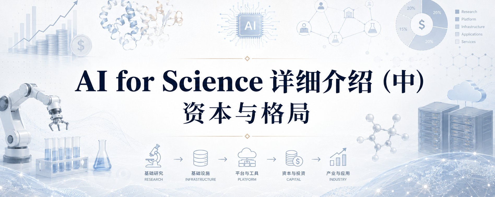
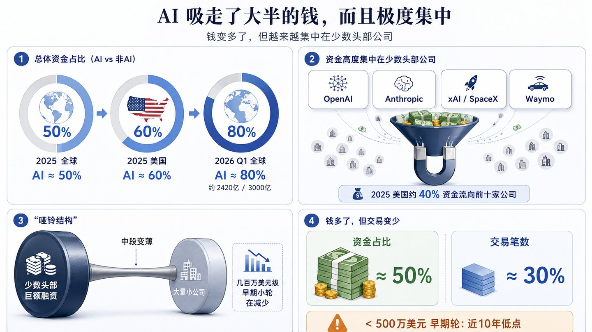
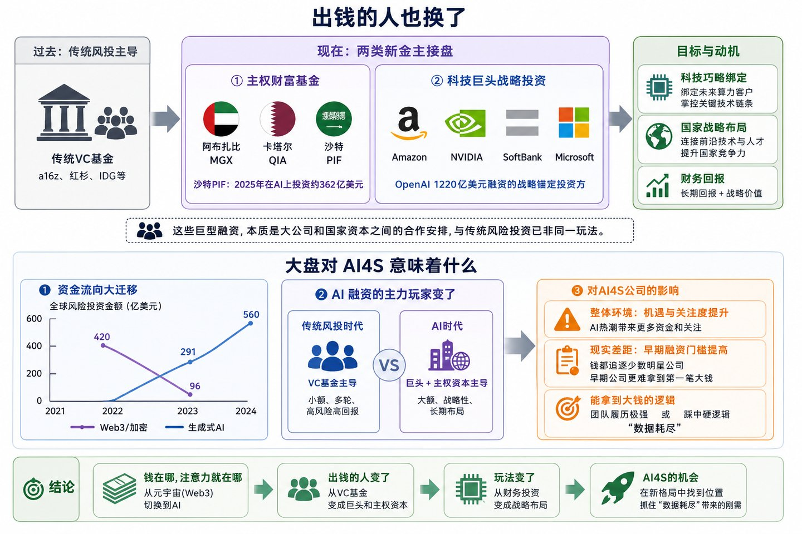
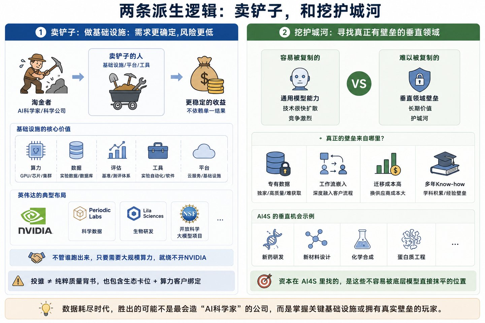
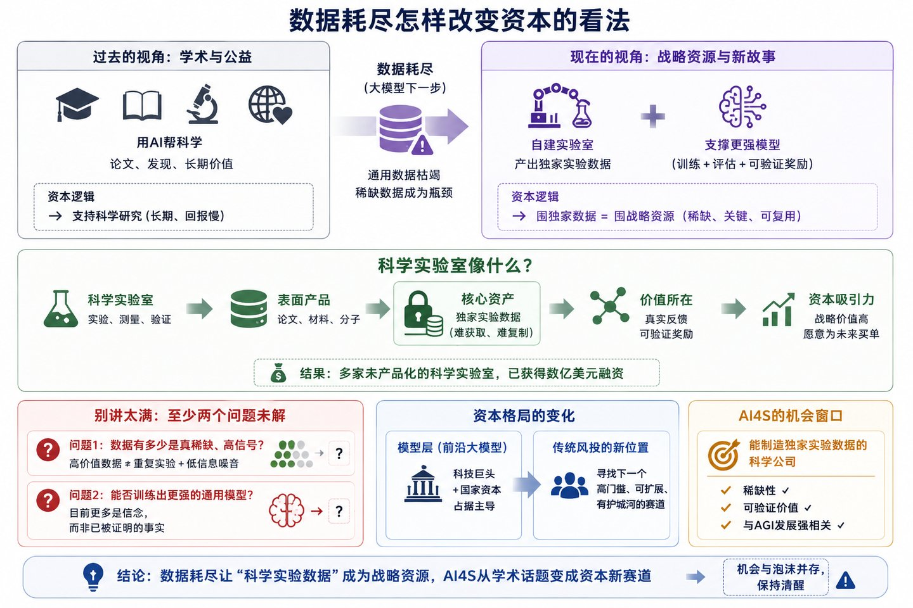
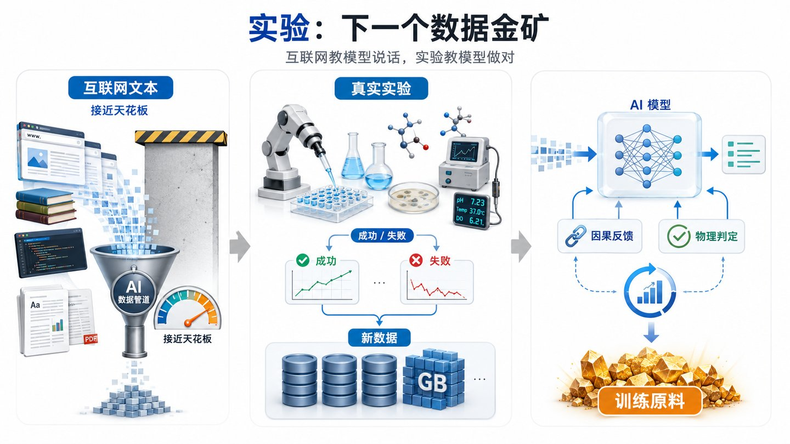
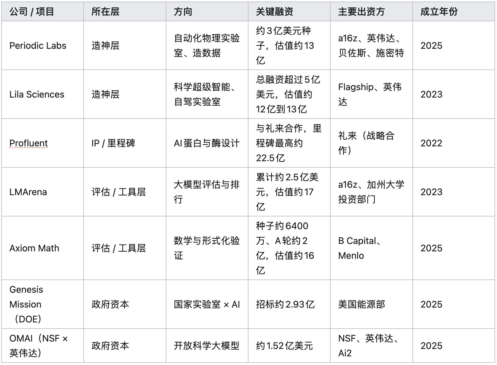
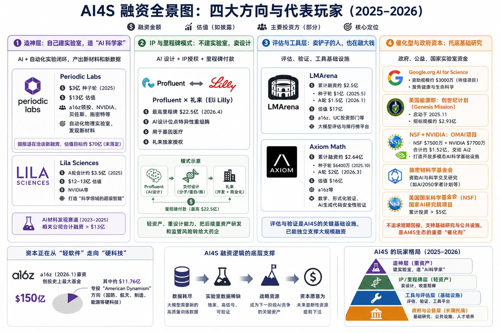
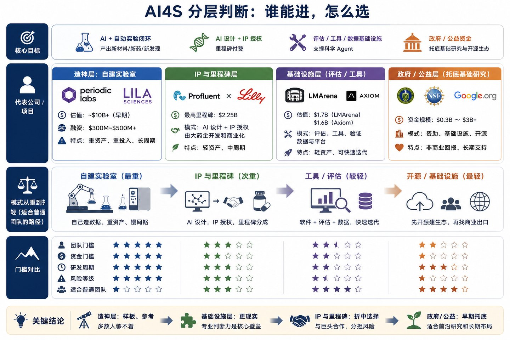
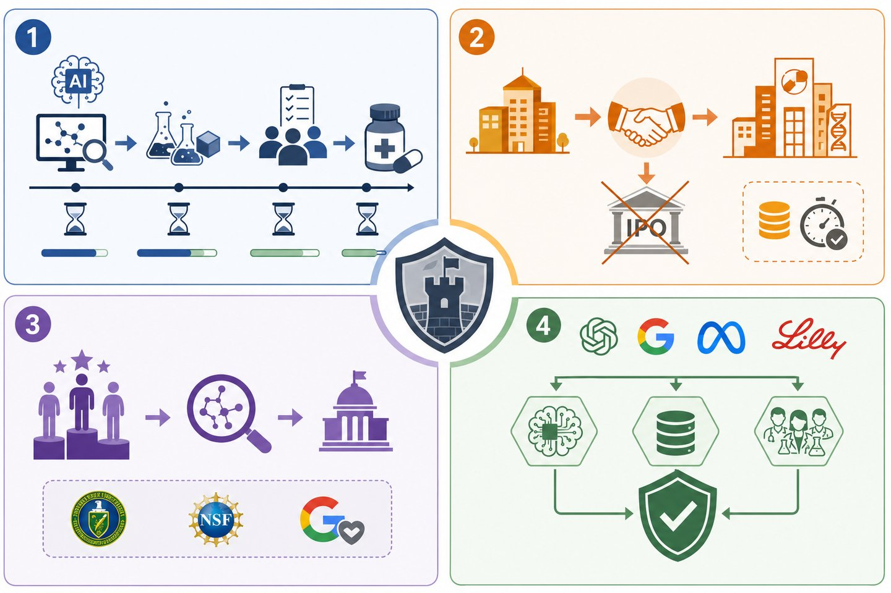

# 引言：从技术版图到资本版图

上篇讲的是AI for Science的技术版图：哪些方向已经跑出来，哪些还停在论文和原型阶段，哪些更像长期想象。看完技术版图之后，下一步要问的就是资本问题：这个领域到底有没有人愿意持续掏钱，钱投向哪里，又避开了哪里。

技术综述关心的是系统能力，资本视角关心的是产业判断。一个demo很惊艳的系统，未必有人愿意下注。一个看起来不起眼的工具层公司，反而可能正在融到大钱。资本不一定比技术更聪明，但它会暴露一件事：市场相信哪条路能变成生意，哪条路还只是科研热度。

这篇文章就换一根轴来看AI for Science（下文沿用上篇的简称AI4S）。我的判断很简单：钱确实在进来，这个赛道还没有关门，但机会并不平均。最上面那层需要顶级团队和数亿美元起步，普通人够不着。下面的工具、评估和垂直基础设施层，反而还有切入口。分清这两层，比笼统地问"AI4S值不值得做"更有用。

# 第一章 资本的宏观背景：一套极度集中的新融资体制  第一章资本的宏观背景：一套极度集中的新融资体制

要看资本怎么进入AI4S，先得看2025到2026年的创投大盘。AI4S不是单独融资，它正好赶上了AI融资最热、也最失衡的一段时间。

## 1.1 AI 吸走了大半的钱，而且极度集中

先看总量。2025年，全球创投融资大约一半投向AI，美国市场这一比例接近六成。到了2026年第一季度，全球创投融资约3000亿美元，其中AI公司拿走约2420亿美元，接近八成。到这个比例，AI已经不只是一个热门方向，它正在重新分配整个创投市场的钱。

问题在于，这些钱并没有平均流向所有AI公司。2025年，美国创投市场大约四成资金，集中到了前十家公司手里。OpenAI在2026年3月获得约1220亿美元承诺资本，估值推到约8520亿。Anthropic在5月拿到约650亿美元，估值约9650亿，反超OpenAI，成了估值最高的前沿AI模型初创公司之一。xAI在2026年一季度融了约200亿美元，2月并进SpaceX，合体估值约1.25万亿美元。Waymo在2月拿了约160亿，主要由母公司Alphabet出。

所以现在的AI融资像一个哑铃。少数头部公司吞下天量资金，另一头是大量刚起步的小公司，中间那段反而变薄了。尤其是几百万美元级别的早期小轮，正在变少。钱看起来更多了，但不是人人都有份，它正在往两端跑。

再看交易笔数会更清楚。2025年，AI拿走了创投里约一半的钱，却只占约三成的交易笔数。也就是说，同样是一笔投资，投向AI公司的单笔金额要大得多。与此同时，五百万美元以下的小额早期轮，占比掉到了近十年的低点。对普通创业者来说，这意味着大盘很热，但第一笔像样的钱，反而比前几年更难拿。

## 1.2 出钱的人也换了

钱投向哪里变了，出钱的人也变了。

传统创投基金已经撑不起OpenAI、Anthropic这种几百亿、上千亿美元级别的融资。接盘的是两类新金主。一类是主权财富基金，比如阿布扎比的MGX、卡塔尔的QIA、沙特的PIF。光沙特PIF一家，2025年在AI上就投了约362亿美元。另一类是科技巨头的战略投资。OpenAI那轮1220亿美元承诺融资里，Amazon、NVIDIA、SoftBank是战略锚定投资方，Microsoft继续参与。

这些钱的目标也和传统风投不一样。英伟达投一家公司，当然有财务回报的考虑，但它也在绑定未来的算力客户。主权基金投进来，图的是把本国和最前沿的AI技术、人才连在一起。所以这些巨型融资，更像大公司和国家资本之间的合作安排，和创业者熟悉的风险投资已经不是一套玩法。

这对理解AI4S很重要。在最烧钱的模型层，决定谁能活下来的，已经不主要是a16z、红杉这些传统风投，而是本来就有钱、有算力、有渠道的科技巨头和国家资本。传统风投要找别的位置，而AI4S正好提供了一个新位置。

## 1.3 这套大盘对 AI4S 意味着什么  1.3 这套大盘对AI4S 意味着什么

把这个背景放到AI4S里看，会发现大环境和公司现实并不完全一致。

从大环境看，AI4S赶上了AI融资热潮，热钱多，关注度高，顶级机构也在看。但具体到公司层面，AI4S里的核心玩家大多还很年轻，很多刚成立不久，还在拿种子轮或A轮。它们的单笔融资，和那些千亿美元级别的模型公司完全不是一个量级。

这个差异带来一个直接后果：早期融资门槛变高了。当全市场的钱都在追少数明星公司，一家普通的早期AI4S公司想拿到第一笔像样的钱，比前几年更难。能拿到大钱的，要么团队履历极强，要么踩中了一个很硬的资本逻辑。这个逻辑，就是下面要讲的“数据耗尽”。

# 第二章 数据耗尽：顶级资本为什么愿意投 AI4S  第二章数据耗尽：顶级资本为什么愿意投AI4S

上篇提到过一个背景：高质量互联网文本正在变少。这一章把这个背景放到资本里看。只有理解了这一点，才能明白为什么a16z、英伟达这样的机构，会去投几个刚成立、连产品都还没有的科学实验室。

## 2.1 互联网文本快用完了，实验是下一个数据金矿

这件事的起点很简单：训练前沿大模型需要高质量数据，而互联网上可用的人类文本正在被消耗。有研究估计，可用的人类书面文本最快在2026年前后就会见底。当继续“喂文本”这条路碰到天花板，下一个高质量数据来源在哪里，就成了整个行业最关心的问题。

很多投资人和创业者开始把答案指向真实世界的科学实验。Periodic Labs的说法很直接：数据是有限的，最前沿的AI模型这几年已经把数据用得差不多了，而他们每做一次实验，不管成功还是失败，都会生成几个GB互联网上没有的新数据。联合创始人Liam Fedus（ChatGPT共同作者之一）说得更直白：下一步，是让实验进入AI循环，让模型和现实世界发生接触。

为什么偏偏是实验数据，而不是回头再多爬一点网页？因为实验数据有两样互联网文本给不了的东西。一是它是因果的，一次真实实验记录的是"这样做就会得到那样的结果"，这种因果链条正是纯文本最缺的。二是它自带对错，材料合不合格、反应成不成，物理世界会给一个不容狡辩的判定，而这种确定无误的反馈信号，恰恰是训练下一代会推理的模型最稀缺的燃料。一句话，互联网教模型说话，实验教模型做对。

放到投资语境里，这句话的意思是：科学实验不再只是科学家的工作，它也可能变成大模型的数据来源。谁能稳定产出互联网上没有的物理、化学、生物数据，谁就可能掌握下一轮模型训练需要的原料。

## 2.2 数据耗尽怎样改变资本的看法

这个变化，改变了资本看AI4S的方式。

过去，“用AI帮科学”更像学术和公益话题，讲的是论文、发现和对人类的长期价值。现在，“数据耗尽”把它和大模型的下一步发展连在了一起。投一家能自建实验室、产出独家实验数据的公司，不再只是支持科学研究，也是在囤一种外面买不到的战略资源。科学这门慢生意，因此有了一个能打动AGI投资人的故事。

再往前推一步，科学实验室开始有点像数据公司。论文、材料、分子是表面产品，底下那些独家实验数据才是更难复制的资产。尤其在“可验证奖励”越来越重要之后，一个能源源不断提供真实反馈的实验室，对模型公司和投资人都很有吸引力。这也是为什么几家还没真正产品化的科学实验室，能拿到数亿美元融资。

但这件事不能讲得太满。“数据耗尽、实验是金矿”有真实逻辑，也有融资话术。创始人和投资人都有动力把它讲得更性感，因为这个故事能撑起一家还没产品的公司几亿美元估值。冷静看，至少还有两个问题没回答。第一，这些实验数据里，究竟有多少是真稀缺、真能让模型变强的高信号数据，又有多少只是重复实验和低信息量噪音？第二，科学实验数据能不能训练出更强的通用模型，现在仍然更多是信念，不是已经被证明的事实。读这篇文章，也要带着这两个问号。

这就解释了前面说的变化。模型层已经被科技巨头和国家资本占住，传统风投需要寻找新的位置。能制造独家实验数据的科学公司，正好提供了这样一个入口。

## 2.3 两条派生的逻辑：卖铲子，和挖护城河

围绕“数据耗尽”，投资人又形成了两种更具体的偏好。

第一种偏好，是宁可做基础设施，也不一定直接去造“AI科学家”。直接做AI科学家，风险高、烧钱快、周期长。给科学Agent提供底座、数据、评估和工具，需求反而更确定。淘金的人未必都能发财，卖工具的人更容易收钱。AI4S里也有同样的逻辑。

英伟达就是最典型的基础设施玩家。它投了Periodic，也投了Lila，还参与了NSF那个开放科学大模型项目。不管最后哪家科学公司跑出来，只要它们需要大规模算力，就绕不开英伟达。这也提醒我们，不能简单把“英伟达投了某家公司”理解成纯粹的质量背书。它当然说明这家公司值得关注，但也包含生态卡位和算力客户绑定的考虑。

第二种偏好，是寻找真正有壁垒的垂直领域。上篇已经讲过，当“做出一个AI应用”越来越容易，真正值钱的是别人复制不了的东西：专有数据、客户工作流里的迁移成本、多年学科积累形成的know-how。资本在AI4S里找的，正是这些不容易被底层模型直接抹平的位置。

# 第三章 代表性融资与玩家格局  第三章代表性融资与玩家格局

讲完资本为什么愿意投，再看钱具体去了哪里。下面几家公司和项目，基本能代表2025到2026年AI4S融资的几个主要方向。

## 3.1 造神层：自己建实验室，造"AI 科学家"

最吸引眼球、也最烧钱的一类，是自己建实验室，想把AI和自动化实验连成闭环。

代表公司是Periodic Labs。两位创始人Liam Fedus（前OpenAI、ChatGPT共同作者）和Ekin Dogus Cubuk（前DeepMind，主导过GNoME材料模型），2025年出来创业，方向是用自动化物理实验室自主跑实验，产出新材料和新数据。它一上来就拿到约3亿美元种子轮，由a16z领投，英伟达的投资部门、贝佐斯、施密特等都在里面，估值约13亿美元。据报道，它后来还在洽谈一笔把估值推到约70亿的新融资，不过这笔尚未落定。一个还在早期的公司，种子轮就拿到3亿美元，足以说明资本有多愿意为这类故事付钱。

另一家是Lila Sciences。它2023年从生物投资机构Flagship Pioneering体系里孵化出来，对外说的是要做“科学领域的超级智能”。它在2025年3月亮相时拿到约2亿美元，随后A轮先拿约2.35亿，又追加约1.15亿，A轮合计约3.5亿美元，英伟达的投资部门也在里面。到这一步，它的总融资超过5亿美元，估值约12亿到13亿。

如果把范围放到AI材料发现这个细分领域，过去两年相关创业公司合计融资已经超过13亿美元。

这些融资背后押的是同一件事：谁先把“AI设计加自动实验”的闭环跑顺，谁就可能批量产出新材料，也能积累别人拿不到的实验数据。但这条路很重，也很险。实验室要建，设备要买，科学家要招，烧钱速度不亚于训练大模型，成果还要好几年才看得出来。后面讨论谁能入场时，这一点很重要。

## 3.2 IP 与里程碑模式：不建实验室，卖设计

并不是每家公司都要自己建实验室。还有一种更轻的做法：只做AI设计，把设计出来的分子、蛋白或酶作为知识产权卖给药企，后续按里程碑收钱。

最典型的是Profluent和礼来的合作。2026年4月，做AI蛋白设计的Profluent和礼来达成战略合作，由Profluent用AI设计位点特异性的重组酶，用于基因医疗，礼来拿独家授权，Profluent最高可以拿到约22.5亿美元的里程碑款。

这种模式的好处很清楚。Profluent不用自己建厂、跑临床、闯监管，它只提供最核心的AI设计能力。后面又重、又慢、又贵的开发，交给礼来这种有钱、有渠道、有监管经验的大药企。AI公司出设计，药企出钱和落地能力，这是AI4S在生命科学里比较务实的一条路。

它还有一个好处：把一部分时间风险转给药企。临床要几年，监管要闯关，这些拖时间又烧钱的事由礼来承担。Profluent只要在前端持续产出好的设计，就有机会一笔笔收里程碑款。对有专业能力、但扛不起重资产和长周期的团队来说，这条路值得认真研究。

## 3.3 评估与工具层：卖铲子的人，也在融大钱

再看工具和评估。这一层常常被低估，很多人觉得“给模型打分”“做工具”只是配套活，不像直接做AI科学家那么性感。但融资数据已经说明，这类公司同样能拿到大钱。

最好的例子是LMArena。它从加州大学伯克利的众包打分项目Chatbot Arena独立出来，专门做大模型评估和排行榜。它在2025年5月拿了约1亿美元种子轮，估值约6亿，由a16z和加州大学投资部门领投。到2026年1月，它又拿了约1.5亿A轮，估值升到约17亿。一个评估平台累计融到约2.5亿美元，说明评估本身已经能成为一门大生意。

另一个例子是Axiom Math，由斯坦福的Carina Hong创办，方向是数学和形式化验证。它2025年10月拿了约6400万美元种子轮，2026年3月又拿了约2亿A轮，估值约16亿。虽然名字里有Math，但它对外更强调的是“证明AI生成的代码是安全的”。纯数学研究只是其中一部分，商业化卖点其实更接近软件验证。

## 3.4 催化型与政府资本：在 VC 不愿去的地方托底3.4 催化型与政府资本：在VC 不愿去的地方托底

AI4S还有一类钱很重要，但容易被忽略：政府和公益机构的钱。它们不一定追求短期回报，作用是先把基础设施和早期研究托起来。

[Google.org](https://google.org/)有一个“AI for Science”资助计划，规模约3000万美元，健康与生命科学是重点方向。美国能源部在2025年11月以行政令启动“创世纪计划”（Genesis Mission），希望调动国家实验室，用AI加速科学发现，后续发布了约2.93亿美元招标。美国国家科学基金会和英伟达还联手做了一个OMAI项目，也就是开放多模态AI科学基础设施。NSF出约7500万美元，英伟达出约7700万美元，合计约1.52亿美元，交给艾伦人工智能研究所（Ai2）去做面向科学的全开放大模型。

政府之外，还有施密特夫妇的施密特科学基金会，长期资助AI与科学交叉研究，比如AI2050学者计划。国家科学基金会自己的“国家AI研究院”项目，累计也投了超过5亿美元。这类钱的共同点是，它们不要求短期商业回报，更适合支持基础研究和公共设施。对想进入AI4S的学者来说，这往往比直接找风投更对口。

与此同时，顶级风投也在往硬科技靠。a16z在2026年1月募了一支约150亿美元的基金，是创投史上最大的一支，其中专门切出约11.76亿美元投国防、航天、制造、能源这些American Dynamism方向。资本正在从轻软件往更硬的技术领域移动，AI4S正好在这股潮里。

把这一章提到的公司和项目放在一起，大致是这样：

从这张表可以看到，反复出现的出资方就那么几个：a16z、英伟达、几家主权基金、几个政府部门。AI4S现在离大众创业赛道还很远，方向主要由少数顶级机构先定义。坏处是门槛高，普通团队不容易挤进去。好处是格局还没定，早进入的人仍然有机会定义某个细分方向。

# 第四章 从成立年份看赛道还早不早  第四章从成立年份看赛道还早不早

接下来要判断一个更实际的问题：AI4S到底还早不早？它是一个刚开始被资本关注的新方向，还是已经被头部玩家占满了？

判断这件事，不用只听创始人怎么讲故事。看两个硬指标就够了：核心玩家什么时候成立，现在融到哪一轮。

## 4.1 成立年份是一个很硬的信号

一个方向是新是旧，往往能从头部公司的“年龄”里看出来。

如果一个方向里最受关注的公司，大多是最近一两年才成立，还在拿种子轮或A轮，那说明这块地刚被发现，位置还没坐满。反过来，如果明星公司已经成立很多年，普遍融到D轮、E轮，估值几十亿甚至上百亿，那通常说明格局已经比较稳定，新人再进去会很难。

所以我看一个新方向，最先看的不是口号。我会先看头部玩家到底是“年轻公司加早期轮”，还是“老公司加后期轮”。

这个指标的好处是很难作假。公司会包装技术，媒体会追热点，创始人会讲愿景，但成立年份和融资轮次相对硬。一个方向如果已经红海化，钱早就把头部公司喂到后期轮，不太可能核心玩家还集体停在种子轮和A轮。

## 4.2 核心玩家都还很年轻

用这把尺子去量AI4S，结果很清楚。

第三章提到的核心玩家，基本都很年轻。Periodic Labs 2025年成立，拿的是种子轮。Lila Sciences 2023年成立，还在早期。LMArena 2023年从学校项目独立出来，刚到A轮。Axiom Math 2025年成立，也刚到A轮。它们几乎都是2023到2025年之间出现的新公司。

唯一稍微早一点的是Profluent，2022年成立，但它走的是和药企合作的轻模式，也还没到后期大轮。把它算进去，结论也不变：AI4S这批核心玩家里，还没有哪家公司已经熬了五年八年、长成庞然大物。这个时间线也和上篇的判断对得上，AI4S的技术版图大致是2024年以后才真正成形，资本也是这之后才开始集中进入。

这说明AI4S还处在早段。最好的位置还没有完全坐满，资本也还在抢早期项目。现在进入AI4S，时间上不算晚，很多细分方向还没形成固定格局。

## 4.3 对照组：一个已经合拢的赛道长什么样

只说AI4S年轻还不够，最好拿一个已经成熟很多的AI垂直方向做对照。

Abridge就是一个很好的对照。它做的是医疗场景里的AI病历记录，也就是把医生和病人的对话自动转成病历。Abridge 2018年成立，到2025年已经走了七年。它在2025年2月完成约2.5亿美元D轮，估值约27.5亿。4个月后，它又完成约3亿美元E轮，估值升到约53亿。它2025年第一季度的签约年化经常性收入约1.17亿美元。

把Abridge和Periodic放在一起看，差别很明显。Abridge已经七年，融到E轮，有五十多亿美元估值，也有上亿美元签约年化收入。Periodic还很年轻，拿的是种子轮，产品和商业化都还在路上。AI4S现在离Abridge那种成熟阶段，至少还隔着好几年。

Abridge也提醒我们，AI垂直赛道从早期到成熟，通常要熬好几年。它2018年成立，真正估值起飞是在2025年前后，中间用了六七年。把这个时间尺度放到AI4S上，结论也很清楚：现在入场不算晚，但也别指望一两年内就见分晓。这是一场按年算的长跑。

## 4.4 它和 2026 年的资本大势同向  4.4 它和2026 年的资本大势同向

还有一个外部信号也能说明问题：顶级资本正在往硬科技方向移动。

前面提到，a16z这样的顶级风投正在把大钱投向硬科技，American Dynamism就是典型旗号。资本正在从轻软件、SaaS这些相对拥挤的方向，转向国防、制造、能源、科研基础设施这些更硬、更需要专业壁垒的领域。AI4S正好在这股潮里。

对想入场的人来说，这里的关键是时机。AI4S还没到尾声，它还在早段。早段的好处是位置还多，很多细分方向还没人定义清楚。坏处是风险也大，商业化路径不一定马上跑得通。

不过，早不等于容易。上篇讲护城河时给过一组自检，在AI4S里也一样适用：你有没有别人拿不到的专有数据？你有没有嵌进科研工作流里，让用户换掉你很麻烦？你有没有多年学科积累形成的know-how？三个问题里答“是”的越多，位置越硬。接下来要讲的就是，AI4S虽然还早，但不是每一层都适合普通团队进去。

# 第五章 分层判断：造神层与基础设施层  第五章分层判断：造神层与基础设施层

AI4S还早，这是好消息。但早不等于谁都能做。不同层的门槛差得很远，必须分开看。

第三章是按融资类型来分：造神层、IP与里程碑、评估工具层、政府资本。这里换成更实用的分法：普通团队到底进不进得去。简单说，造神层很难进，评估和工具层更现实，Profluent那种IP与里程碑模式介于两者之间，政府和公益资金则在早期托底。

## 5.1 造神层：新，但够不着

第一层是造神层，也就是Periodic、Lila这类自建实验室、想做AI科学家的公司。

这一层确实新，也确实热，还有顶级资本撑腰。但对绝大多数人来说，它不现实。它的入场券是名人堂级别的团队，比如前OpenAI、前DeepMind核心研究员，再加上数亿美元起步资金。没有这种履历和资金，连第一轮都很难拿到。它可以当样板看，但不是普通团队最该选的路。

而且别看它们融资风光，这一层的风险最大。它们同时在赌三件事：AI真能自主做出有价值的科学结果，自动实验室真能稳定运行，实验产生的数据真能反过来训练更强的模型。任何一件事不成立，几亿美元都可能烧得很难看。对多数人来说，这一层更适合观察，不适合贸然冲进去。

## 5.2 基础设施层：更现实的入口

第二层是基础设施层，也就是给科学Agent提供底座、评估、工具和数据的那一层。对普通团队来说，这一层更现实。

它更现实，是因为它不要求一开始就有名人团队和数亿美元。一个小团队只要切得足够窄，也能找到位置。这里有两个方向尤其值得看。一个是Agent基础设施，比如评估、工具、编排。LMArena约17亿美元估值已经说明，光做评估也能形成大生意。另一个是深垂直领域，比如物理、材料、天体这些需要专业判断的方向。AI工程能力很重要，但很多时候补不上学科判断力。

说得更具体一点。做评估，可以给某个学科的科研Agent出一套真正专业的考卷，像上篇提到的Gravity-Bench、ReplicationBench那样，由懂这门学科的人来定标准、判对错。做深垂直工具，则可以把某一类专业数据、某一套仿真代码、某一种实验设备，接到Agent工作流里，让它在一个很窄的领域里真正能干活。这两件事都不需要数亿美元起步，需要的是别人没有的专业判断。

这也接回了上篇的主线。造神层的话语权在巨头和顶配团队手里。但在评估、工具、深垂直这些基础设施层，学科判断力反而更重要。对有学科背景的人来说，这才是别人不容易翻过去的墙。

## 5.3 商业模式：从重到轻

从重到轻看，AI4S里大致有几种不同的商业模式。

最重的是自建实验室，比如Periodic和Lila，自己烧钱造数据。轻一点的是IP与里程碑分成，比如Profluent，自己做AI设计，把后续开发交给药企。再轻一点是纯软件工具，比如LMArena、Axiom，主要靠产品、评估体系和数据吃饭。更轻的一种，是先开源、再商业化，比如Ai2拿政府和英伟达的钱做开放科学大模型，先把生态做起来，再找商业出口。

越往轻的一端，越适合资金不多、但有专业判断力的团队。换句话说，先看自己手里有什么，再决定该站在哪一层。

# 第六章 风险面与退出  第六章风险面与退出

前面讲的是钱和机会，但AI4S不是一个轻松的方向。它有几个很硬的约束，绕不过去。

## 6.1 慢：科学的回报周期很长

第一件事是慢。

科学这门生意，和客服agent、编程助手那种企业AI不是一个节奏。一个客服agent几个月就可能看到收入，效果好不好也容易反馈。但一款AI设计的药、一种AI发现的材料，从设计到验证，再到真正上市，往往要好几年，中间还要过实验、临床、监管这些关。第四章提到的Abridge，做的还只是相对快的医疗记录，尚且花了七年才长到五十多亿美元估值。真正的硬科学只会更慢。

这对资本是一个很现实的考验。风投的钱有期限，要退出，要回报，但科学不会按基金周期往前走。慢，是AI4S最底层的风险，来自这门生意本身的节奏。

## 6.2 退出以并购为主，IPO 慢

第二件事是退出。

AI4S公司更可能通过并购退出，而不是自己一路长大去上市。一家做出独家分子设计能力的小公司，更现实的结局是被礼来这样的大药企收购，或者被科技巨头买走。公开市场的退出慢，样本也少。这意味着投AI4S的钱，很大程度上要等产业巨头来接盘，路径比互联网软件窄。

这也不全是坏事。并购的天花板通常低于上市，但速度可能更快，确定性也可能更高。对一个做出了真东西、但不打算自己长成巨头的科学团队来说，被大药企或大厂用好价钱收走，本身就是不错的结果。前提是你手里的东西足够硬，硬到巨头宁愿买，也不愿从头造。

## 6.3 "科学"评估这块细分，对纯 VC 还偏早  6.3 "科学"评估这块细分，对纯VC 还偏早

第三个问题，藏在“评估很重要”这句话后面。

评估这件事，在大类上已经被验证能赚钱，LMArena约17亿美元估值就是证据。但LMArena评的是通用大模型，受众很广，商业化路径也更清楚。一旦缩到“科学评估”，比如给某个学科的科研Agent出考卷、当裁判，受众会窄很多。现在托底这块的，主要还是能源部、国家科学基金会、Google.org这些政府和公益资金。科学评估作为学术和基础设施工作很真实，但作为一门纯商业VC生意，眼下还早。

这和上篇的判断能接上。评估很关键，也很适合有学科背景的人切入。但要清醒，它现在更像一块先靠公益和学术养起来的地，商业化拐点还没完全到。下篇会讲更具体的做法：不一定一开始就走纯VC创业路线，可以先做研究、做评估、建立声誉，再让机会反过来找上门。

## 6.4 还要防一手：巨头随时可能自己下场

最后一个风险，是巨头可能自己下场。前沿大模型公司和大药企，都有动力把AI4S能力收进自己体系里。OpenAI、Google可以自建科学团队，礼来这样的药企也可以自己养AI设计团队。Anthropic也已经开始把Claude往科研工作流里推，Claude Science这种面向科学家的AI工作台，就是一个信号。一旦这些公司认真做，靠“我会一点AI”起家的薄壳公司会最先被挤掉。

所以最后还是回到护城河。能在巨头眼皮底下活下来的，要么有别人拿不到的专有数据，要么已经嵌进客户流程，要么有多年学科积累形成的壁垒。进AI4S之前，最该想清楚的不是“我能不能做个demo”。真正要问的是：我这堵墙够不够硬？

# 小结：钱在进来，但要选对位置

把这一篇收回来。资本已经在进入AI4S，而且进入得很认真。核心玩家普遍年轻，融资阶段也还早，这说明格局还没完全定。a16z、英伟达、主权基金、能源部、国家科学基金会，都在用不同方式往里投钱。

但这不是一个人人都能随便冲进去的方向。最上面的造神层，需要顶级团队和数亿美元资金，普通团队很难碰。更现实的位置在下面：评估、工具、数据、深垂直工作流。这些地方更看重学科判断力，资金反而不是第一门槛。

所以，对一个有学科背景、但没有巨额资本的人来说，问题不该是“AI4S值不值得做”。更具体的问题是：我应该以什么身份进去？从哪一层切？先解决哪一个足够窄、但足够硬的问题？

下篇就讲这个。哪些地方还有空位？物理和其他学科背景的人，怎么把自己的长板变成别人不容易复制的壁垒？下一篇接着讲。

# 相关文章

- [AI for Science 详细介绍（上）：范式与版图](https://x.com/snowboat84/status/2070656715515932930)

# 作者其它文章（选）

- [广义祖父积分学](https://x.com/snowboat84/status/2070291045007671732)
- [什么是“涌现”？涌现的研究史](https://x.com/snowboat84/status/2069931234328027483)
- [互联网泡沫简史](https://x.com/snowboat84/status/2069569161911812606)
- [AI圈大V名单（名单不断扩充中）](https://x.com/snowboat84/status/2069206740546343372)
- [我打造的个人AI系统：哲学基础](https://x.com/snowboat84/status/2068120320578629782)
- [NFT的叙事是如何崩塌的](https://x.com/snowboat84/status/2067756975069516170)
- [什么是耗散结构理论？它和AI有关系吗？](https://x.com/snowboat84/status/2067399314843000842)
- [什么是具身智能？它跟AI的关系是什么？](https://x.com/snowboat84/status/2067032626821747178)
- [长篇分析：SpaceX未来的展望](https://x.com/snowboat84/status/2066674353648046515)
- [Vibe Coding把我系统搞崩了，我对此的总结和心得](https://x.com/snowboat84/status/2065586279010742687)
- [一篇文章讲清楚美国的移民系统](https://x.com/snowboat84/status/2057980486501433383)
- [一文讲清楚美国医疗系统](https://x.com/snowboat84/status/2055081426744422697)
- [细说美国的华人老钱家族](https://x.com/snowboat84/status/2062326581776011623)
- [美国的犹太人和华人分别抢到了什么资源？详细分析](https://x.com/snowboat84/status/2063049247805837815)
- [一篇文章看懂美国教育全生态](https://x.com/snowboat84/status/2054359249917210633)
- [什么是控制论？控制论是AI的上辈子吗？](https://x.com/snowboat84/status/2064496706042069340)
- [祖父积分学概论](https://x.com/snowboat84/status/2056533111983493136)
- [教宗良十四世论人工智能（精华版）](https://x.com/snowboat84/status/2059434342745866391)
- [Vibe Reading：AI 时代读书的系统化方法](https://x.com/snowboat84/status/2050008577511973253)
- [美国税收制度完全指南](https://x.com/snowboat84/status/2060511915617779821)

# 主要数据来源

> 按主题归类，便于逐条核对。资本类数字随时间更新，正式引用前请以下面标注的一手来源为准。

**宏观资本（第一章）**

- OpenAI约1220亿美元承诺资本、估值约8520亿：[OpenAI公告](https://openai.com/index/accelerating-the-next-phase-ai/)。
- Anthropic约650亿美元、估值约9650亿、反超OpenAI：[AP，2026-05-28](https://apnews.com/article/86c432fa375548fd4f111f8164d6ffc1)。
- xAI并入SpaceX、合体估值约1.25万亿：[CNBC，2026-02-03](https://www.cnbc.com/2026/02/03/musk-xai-spacex-biggest-merger-ever.html)。
- Waymo约160亿美元融资：[CNBC，2026-02-02](https://www.cnbc.com/2026/02/02/waymo-announced-16-billion-fundraising-round.html)。
- 头部十家拿走约四成创投资金：[SaaStr引PitchBook](https://www.saastr.com/venture-has-never-been-more-concentrated-40-of-vc-going-to-just-10-deals/)。
- 2026年第一季度创纪录、AI占全球约八成：[Crunchbase News](https://news.crunchbase.com/venture/record-breaking-funding-ai-global-q1-2026/)。
- 沙特PIF、阿布扎比MGX在AI上的部署：[CNBC，2025-10-15](https://www.cnbc.com/2025/10/15/abu-dhabis-mgx-investments-in-trump-crypto-tiktok-openai-.html)。

**数据耗尽与造神层（第二、三章）**

- 高质量文本将在2026年前后见底：[Nature](https://www.nature.com/articles/d41586-024-03990-2)。
- Periodic Labs约3亿美元种子轮、创始团队与"造数据"叙事：[TechCrunch](https://techcrunch.com/2025/10/20/top-openai-google-brain-researchers-set-off-a-300m-vc-frenzy-for-their-startup-periodic-labs/)、[a16z](https://a16z.com/announcement/investing-in-periodic-labs/)。
- Lila Sciences总融资超过5亿美元、估值约12亿到13亿：[FierceBiotech](https://www.fiercebiotech.com/biotech/lila-sciences-adds-115m-series-bringing-total-haul-350m-and-securing-backing-nvidia)、[Axios](https://www.axios.com/newsletters/axios-pro-rata-4959a270-a40d-47b7-a66b-e48172ee4f54)。
- AI材料公司两年融资超13亿美元：[MIT Technology Review](https://www.technologyreview.com/2025/12/15/1129210/ai-materials-science-discovery-startups-investment/)。

**IP与工具层（第三章）**

- Profluent与礼来合作、里程碑最高约22.5亿美元：[Businesswire，2026-04-28](https://www.businesswire.com/news/home/20260428698315/en/Profluent-Announces-Strategic-Partnership-with-Lilly-to-Develop-AI-Designed-Recombinases-for-Genetic-Medicine)。
- LMArena种子约1亿、估值约6亿：[TechCrunch，2025-05-21](https://techcrunch.com/2025/05/21/lm-arena-the-organization-behind-popular-ai-leaderboards-lands-100m/)，A轮约1.5亿、估值约17亿：[Reuters / Investing.com，2026-01](https://www.investing.com/news/stock-market-news/ai-startup-lmarena-triples-its-valuation-to-17-billion-in-latest-fundraise-4433211)。
- Axiom Math种子约6400万：[SiliconANGLE，2025-10](https://siliconangle.com/2025/10/02/ai-startup-axiom-gets-64m-develop-new-knowledge-advanced-mathematics/)，A轮约2亿、估值约16亿：[SiliconANGLE，2026-03](https://siliconangle.com/2026/03/12/verifiable-ai-startup-axiom-raises-200m-prove-ai-generated-code-safe-use/)（这两轮数字差异较大，发表前以一手来源再核一次）。

**政府与催化资本（第三章）**

- [Google.org](https://google.org/) Impact Challenge: AI for Science，约3000万美元：[google.org](https://www.google.org/impact-challenges/ai-science/)。
- 美国能源部Genesis Mission，2025-11行政令、约2.93亿美元招标：[白宫](https://www.whitehouse.gov/presidential-actions/2025/11/launching-the-genesis-mission/)、[energy.gov](https://www.energy.gov/articles/energy-department-announces-293-million-funding-support-genesis-mission-national-science)。
- NSF与英伟达OMAI，约1.52亿美元、Ai2主导：[NSF](https://www.nsf.gov/news/nsf-nvidia-partnership-enables-ai2-develop-fully-open-ai)、[Ai2](https://allenai.org/blog/nsf-nvidia)。
- a16z约150亿美元基金与American Dynamism：[Crunchbase News](https://news.crunchbase.com/venture/a16z-15b-new-funds-american-dynamism-ben-horowitz)。

**对照组（第四章）**

- Abridge成立于2018年、E轮约3亿、估值约53亿：[TechCrunch，2025-06-24](https://techcrunch.com/2025/06/24/in-just-4-months-ai-medical-scribe-abridge-doubles-valuation-to-5-3b/)。
- Anthropic推出Claude Science科学工作台：[TechRadar，2026-07](https://www.techradar.com/pro/anthropic-launches-ai-workbench-for-scientists-using-claude)、[The Verge，2026-07](https://www.theverge.com/ai-artificial-intelligence/961311/anthropic-claude-science-ai-drug-development)。

---

