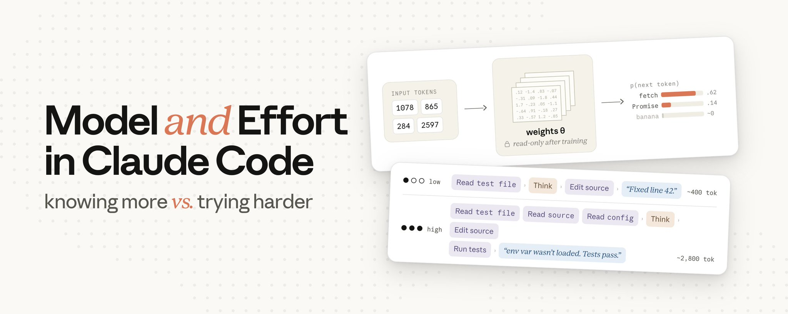

Claude Code 给你两个似乎都能"让答案更好"的设置：模型（model）和努力级别（effort level）。但它们到底对输出做了什么？你怎么知道应该换模型还是只调整努力级别？很容易认为选择更大的模型（如 Fable）会比 Sonnet 给出更聪明的输出，更高的努力级别只是让 Claude 在回答前思考得更久。

第一个假设是对的。根据行业标准基准测试，我们最大的模型确实**更有能力**。

但"努力"不仅仅是"思考时间"。**努力控制的是 Claude 对你的请求总体上投入多少工作量**。这包括思考的时间，但也包括：

- 读取了多少文件；
- 做了多少验证；以及
- 在多步骤任务中推进多远才会回来跟你确认。

在更高努力级别下，Claude 会在回来找你之前采取更多这些行动（读取文件、运行测试、双重检查）。在较低努力级别下，它宁愿向你要更多上下文，也不愿自己花 token 去弄清楚。

## 模型选择的工作原理

要理解模型设置实际控制什么，最好从最开始的时刻讲起 —— 从你按下回车键的那一刻。

Claude Code 将你的消息连同系统提示词、工具定义、你的 CLAUDE.md、对话历史以及所有上下文中的文件组装在一起。所有这些内容作为一个请求发送到 API。

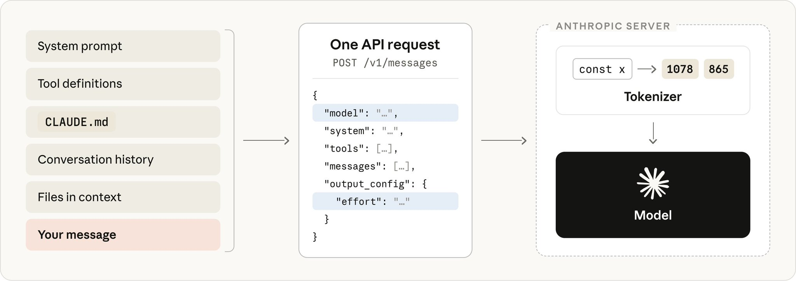

Claude Code 拥有的所有内容被打包进一个 API 请求。在服务器端，文本在到达模型之前先被分词。

然而，模型永远不会看到纯文本。服务器端发生的第一件事是**分词（tokenization）**：文本被拆分成片段，每个片段被映射为模型训练时使用的固定词汇表中的一个整数。`const` 可能映射为 1978，`await` 可能映射为 4293。从这里开始，**你的提示词就是一个整数数组**。

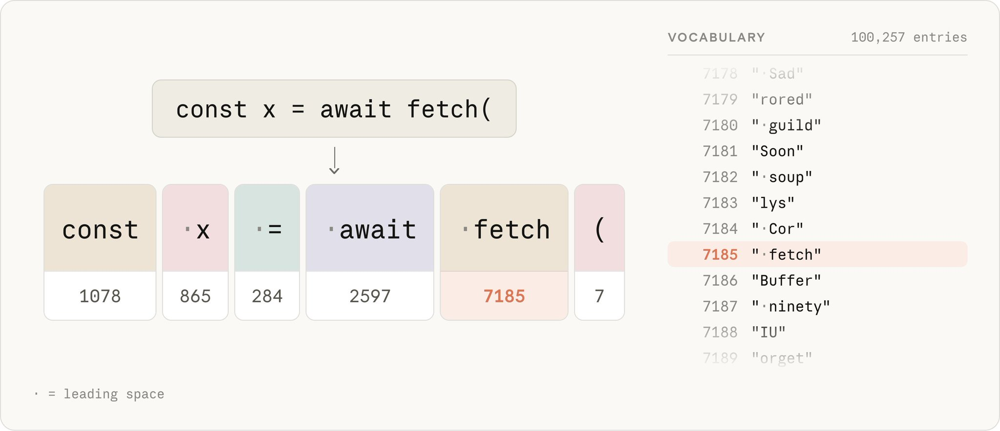

分词器将你的文本拆分成片段，并将每个片段映射为固定词汇表中的一个整数。上面一行每个块变成下面一行的 token ID；ID 数字仅为示意。

模型的工作是接收这个数组并预测下一个 token 是什么。它通过计算词汇表中每个 token 的概率并从最高概率中挑选来完成这个任务。在 "const x = await" 之后，一个训练良好的模型会给 "fetch" 分配高概率（非常可能），给 "banana" 分配接近零的概率（几乎不可能）。

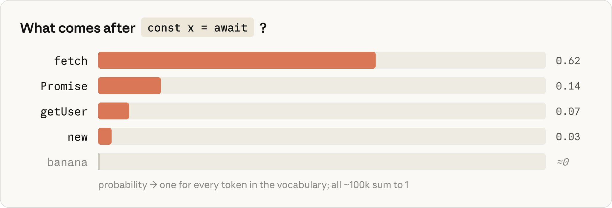

模型的预测是词汇表中每个 token 的概率。最高猜测和一个无关猜测之间的差距是巨大的。

将你的输入 token 转化为这些概率的是**权重（weights）**（也叫参数，parameters）：数十亿个数字被组织成大型矩阵。为了预测一个 token，模型将你的输入通过这些矩阵（一系列矩阵乘法），并在最后读取概率。**权重是模型所"知道"的一切所在的地方**。

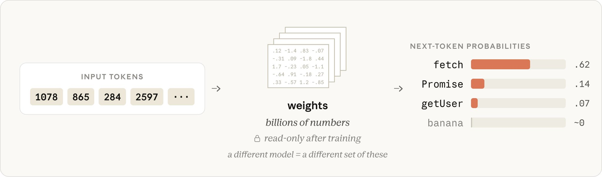

你的提示词进去，概率出来。中间的权重不会改变。

每个模型的权重在训练期间确定，到了你发送请求的时候，**它们是只读的**。你的提示词、你的 CLAUDE.md 或你的上下文中的任何内容都不会改变它们。如果你遇到过 "推理（inference）" 这个词，这就是它的全部含义：在训练完成后使用模型，权重是固定的。

Claude 知道的关于 TypeScript、流行框架或任何其他通用编程知识的所有内容，都在训练时被编码进了那些权重中。

你的提示词和上下文仍然可以引导预测。把真实代码放在 Claude 面前是引导，而且效果非常好。但这并不会给权重本身增加任何东西。

如果一个库在模型训练时还不存在，它就不在权重中。你可以把文档放进上下文，Claude 会使用它们，但那是**引导，不是教学**。Claude 的响应只在这一次请求中被影响，但底层模型没有保留任何东西。

当 Claude 自信地调用一个不存在的 API（幻觉），那是权重在产生一个从训练模式中看起来合理的 token 序列，而不是一次失败的查找。

那么切换模型实际上做了什么？它**交换了处理你请求的那套冻结权重**。

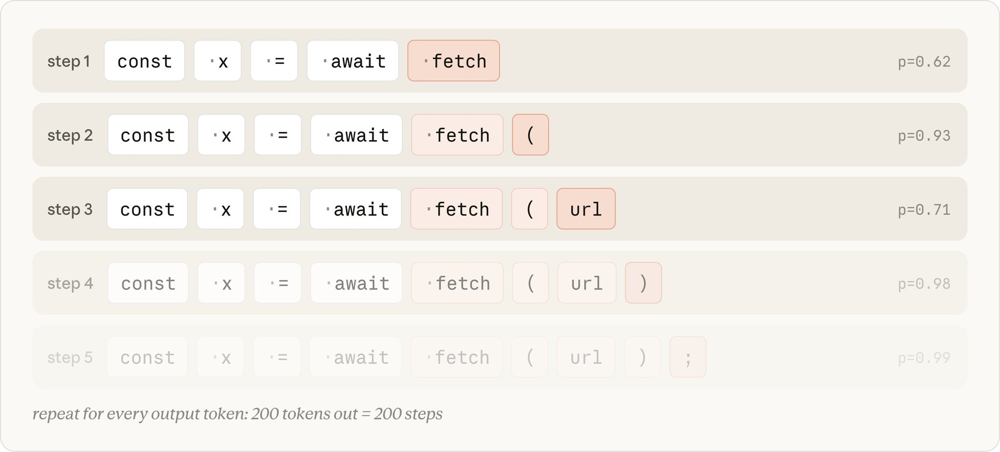

序列每一步增长一个 token。模型每次重新读取整个数组来预测下一个是什么。

模型不会一次性生成整个回答。它预测一个 token，将其追加到序列中，然后重新运行整个计算来获取下一个。一个 200 token 的响应是 200 次通过权重的独立计算。这个循环是你大部分等待时间（和输出成本）的来源。

模型设置决定了哪些权重处理你的请求，也决定了每个输出 token 的成本。

它不决定的是**生成了多少 token**。对于同一个提示词，这个数字可以变化很大，取决于 Claude 决定做多少工作。

而这正是努力级别所控制的。

## 努力级别的工作原理

当 Claude Code 在处理一个任务时，它生成的 token 分为几类：

- **思考（Thinking）**：你在操作之前和之间看到的流式推理输出。
- **工具调用（Tool calls）**：结构化块，命名一个工具（如 Read 或 Edit）及其参数，Claude Code 随后解析并执行。
- **给你的文本（Text to you）**：计划、进度更新、最后的总结。

这些都是来自同一个循环的普通输出 token，按相同的费率计费。例如，思考 token 的生成方式与其他输出 token 完全相同，并在该轮剩余时间里保留在上下文中。

当 Claude 转而编写代码时，它之前的推理已经成为输入的一部分，就像它读取过的文件一样。

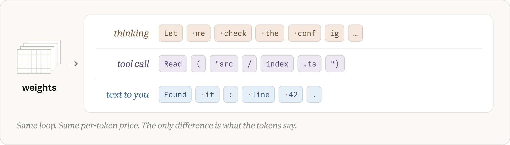

Claude 的所有输出都是 token。思考、工具调用和给你的文本都是从同一个循环生成的。

那么努力级别是如何改变这一切的？努力级别**作为请求的一部分被发送给模型**，就在你的提示词旁边。模型被训练来理解在每个努力级别下应该如何行为，而那种习得的行为被固化在冻结的权重中。

当你的请求到达时，努力级别只是模型响应的又一个输入，就像它响应你的提示词文本一样。它设定了 Claude 在认为任务完成之前需要达到的彻底程度和确定程度。这在每一轮中都被权衡，而更高的置信度需要更多的 token 才能达到。

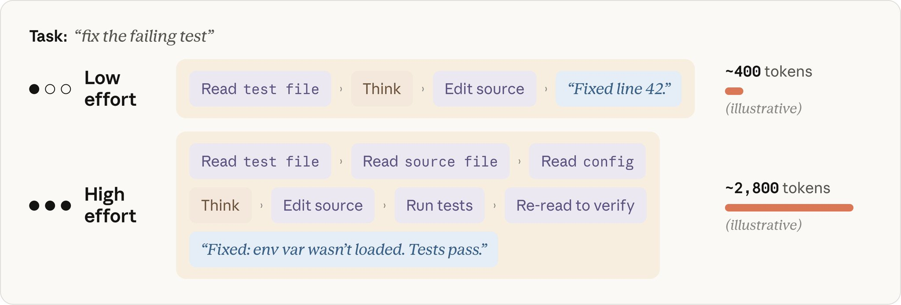

相同的提示词，两个努力级别。高努力路径生成大约 7 倍的 token 来达到更高置信度的答案。

在更高努力级别下，Claude 通常从创建计划开始，而努力级别影响该计划的深度和广度。但计划不是一成不变的。当 Claude 从其行动中获得反馈时，它会更新自己对进展程度和累积结果的确定性的判断。

当三步调试计划中的第 1 步找到了 bug，"调查假设 2 和 3" 可能就不再必要了。Claude 通常会明确说明这一点（例如"第一个检查就找到了，所以剩下的检查不需要了"）并跳过。当任务列表在运行中被修订时，你会在 Claude Code 中看到这种情况发生。

更高努力确实让 Claude 更倾向于双重检查，比如验证它找到的答案，或者仍然查看它本可以跳过的假设。然而，它通常不会仅仅因为努力级别调高了就在简单任务上人为地增加用量。"过度思考"是我们团队在模型训练期间特别关注的问题，因为它会降低效果。

## 如何选择努力级别

对于大多数任务，**使用模型的默认努力级别**。默认级别是 Claude 将其 token 用量扩展到大多数人愿意在任务上花费的水平。

把努力看作是对 Claude 工作多努力、多长时间的**手动覆盖**。当你基于所在领域或所做工作类型对彻底性或速度有强烈偏好时，有意识地使用它，并把它当作一种**通用偏好**，而不是逐任务的决定。

一个发布 Opus 4.8 后的实际说明：在我们的测试中，Opus 4.8 的默认努力设置在相同任务上比 Opus 4.7 的默认努力设置产生了更好的结果，且 token 用量大致相同。

## 当 Claude 出错时应该改什么

当 Claude 出错时，你的第一反应不应该是更改设置。应该是查看你给它的上下文。你的提示词太模糊了吗？Claude 连接了正确的工具吗？它有正确的技能（skills）吗？

如果你在不需要的任务上增加努力级别，修复通常在**上游**：在你的上下文、你的 CLAUDE.md 或任务的划分方式中。

但假设你已经提供了清晰的上下文，Claude 仍然出错。要问自己的问题是：**它是不够努力，还是不够知道？**

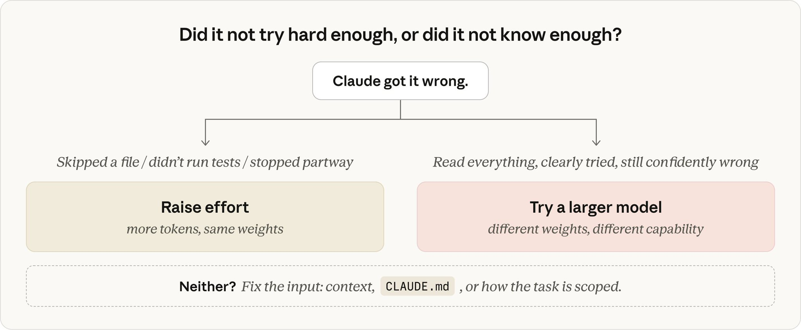

**模型：问题太难了**

当问题是真正困难的时候选择更大的模型 —— 比如微妙的 bug、不熟悉的领域、架构决策。当较小的模型无论你给多少上下文都自信地出错时，你需要的就是更大的模型。

更大的模型也更善于处理模糊性。在较小的模型上，具体的执行指令是更有效的成功配方。

当工作是常规任务时选择较小的模型：你能精确描述的编辑、机械性的更改、关于已经在上下文中的代码的问题。没必要为任务不需要的能力付费。

如果 Claude 拥有了所有相关的上下文、明确地尝试了，仍然出错；这是一个选择更大模型的信号。而如果你已经在用大模型，且工作一直很常规，降级会提高速度并通常降低成本，而不影响输出质量。

**努力：Claude 不够努力**

如果 Claude 做错了是因为不够努力：跳过了文件、没有运行测试、或者没有双重检查它的工作，则选择更高的努力级别。这在你选择了低于模型默认的努力级别时最相关。

## 专家、行家和通才

我喜欢用的一种思考方式是：Fable 是专家（specialist），能处理几乎没有人能解决的问题；Opus 是行家（expert）；Sonnet 是非常好的通才（generalist）。努力级别决定他们任何一个在你的任务上花多少时间。

低努力的 Opus 就像跟一个有深厚经验的行家谈五分钟，他对类似你的问题有丰富的经验。他带来的知识不在你的代码库中任何地方；他之前见过的模式、他知道要检查的陷阱，只有解决过大量类似问题才能积累的那种经验。但五分钟意味着快速阅读你的代码，而不是仔细过每一份文件。

高努力的 Sonnet 是有一整个下午的通才。他编程很厉害，会阅读所有东西、运行各种东西、双重检查他的工作，最终彻底理解你的具体代码。

Fable 是当所有人都卡住时你请来的专家。即使在低努力下，他们也能发现别人都看不到的东西。这种识别能力也正是你花费最多的，所以值得把它留给需要它的任务。

这些都没有哪个是普遍"更好"的。模型设置大致是**能力多强**；努力设置大致是**多彻底**。大多数真正的任务两者都需要一些。

## 努力、模型和 Token 消耗

那么模型选择、努力和 token 消耗三者如何相互作用？这取决于任务。

在相同努力级别的常规工作上，更大和更小的模型通常都能做对。更大的模型消耗更多 token 做额外验证步骤，且每个 token 的价格更高。这就是为什么在常规阶段降到更小模型可以在零质量代价下真正省钱。

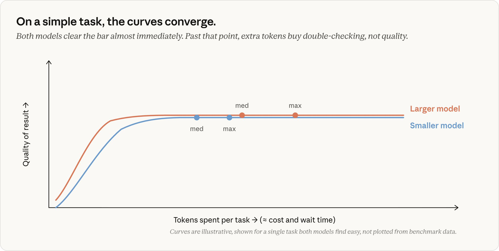

曲线仅供示意，展示的是一个对两个模型来说都足够简单可以快速完成的任务。它们不代表真实的基准测试数据。

在更难的、多步骤的工作上，等式反转了。较小的模型必须在其能力极限上苦苦挣扎，反复迭代，而较大的模型以更少的步骤达到相同的质量水平。

你为更大的模型支付更高的每 token 价格，但在真正让较小模型吃力的问题上，每个任务的总成本可能更低。更重要的是：较大的模型可以完成较小的模型即使在最高努力设置下也完不成的任务。

这在 Fable 上最为显著。在漫长的、多步骤的工作上，它拉开最大的差距。在我们的测试中，它完成了 Opus 和 Sonnet 在任何努力级别下达不到的作业。它的每 token 成本也是最高的，这是把它留给真正需要它的工作的另一个原因。

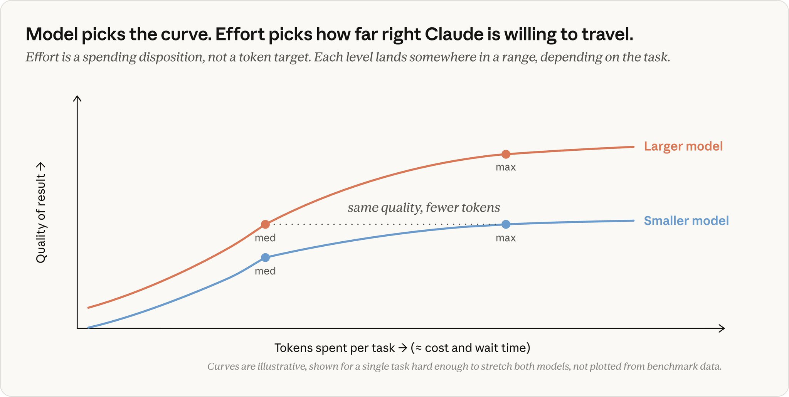

曲线仅供示意，展示的是一个对两个模型来说都足够困难的任务。它们不代表真实的基准测试数据。

以上图表的关键点：努力选择的是 Claude 愿意沿着曲线走多远。这并不意味着 Claude 会需要走到那么远才能完成任务。

最后，努力**塑造** token 消耗，但不**限制**它。系统中唯一的硬性上限是 [max_tokens](https://platform.claude.com/docs/en/build-with-claude/extended-thinking#max-tokens-and-context-window-size-with-extended-thinking)，它会在命中时截断响应，但这是一个生硬的工具，主要与 API 开发者相关。更软性的控制如[任务预算](https://platform.claude.com/docs/en/build-with-claude/task-budgets#task-budgets-are-advisory-not-enforced)或在提示词中要求 Claude 保持简洁更有帮助。它们是模型被训练去遵循的引导（它会在接近限制时试着收尾），而不是一头撞上的墙。

努力改变的是 Claude 做多少工作。模型改变的是 Claude 知道什么。

当你对结果不满意时，在触碰任何一个设置之前先检查上下文：给 Claude 一个清晰的提示词、正确的工具和技能，以及验证自己工作的方式。

如果 Claude 仍然出错，问自己：是它不够知道，还是不够努力？不够知道是模型问题，不够努力是努力级别问题。

> 本文原作者：[@lydiahallie](https://x.com/@lydiahallie)，Claude Code 团队技术成员。原文地址：[Model and effort in Claude Code: knowing more vs. trying harder](https://x.com/ClaudeDevs/status/2074900291062034618)
