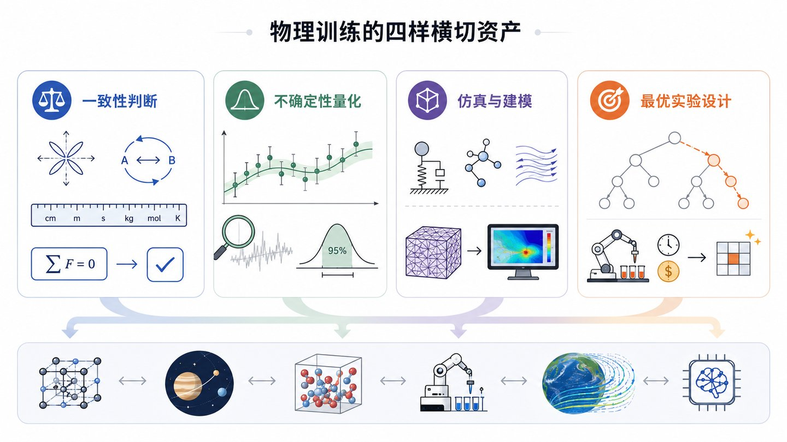
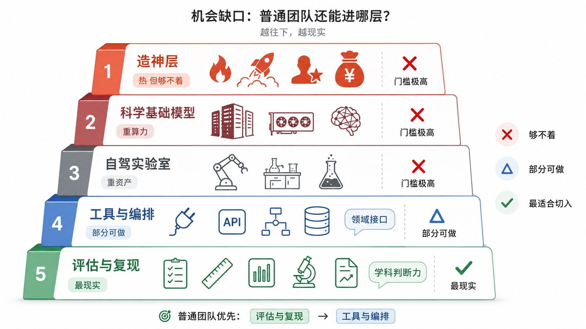
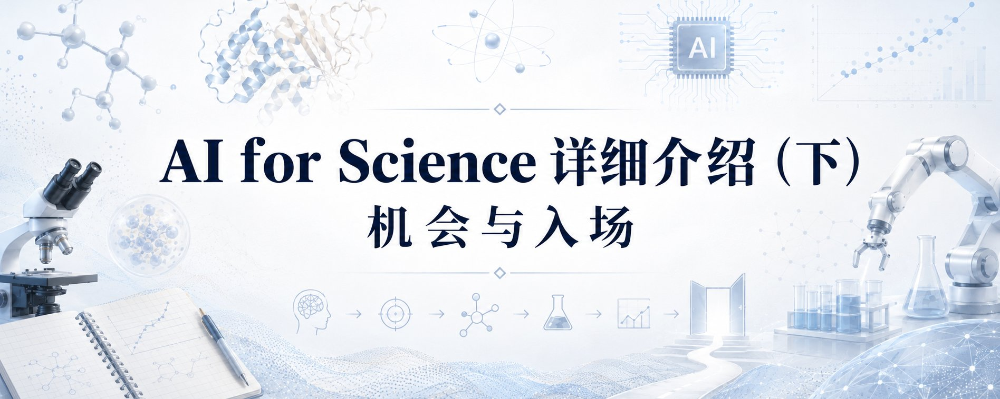
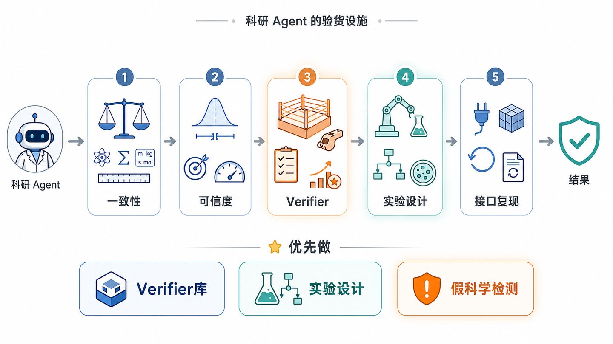
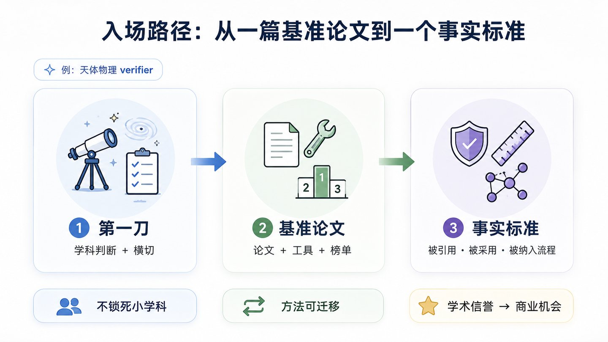
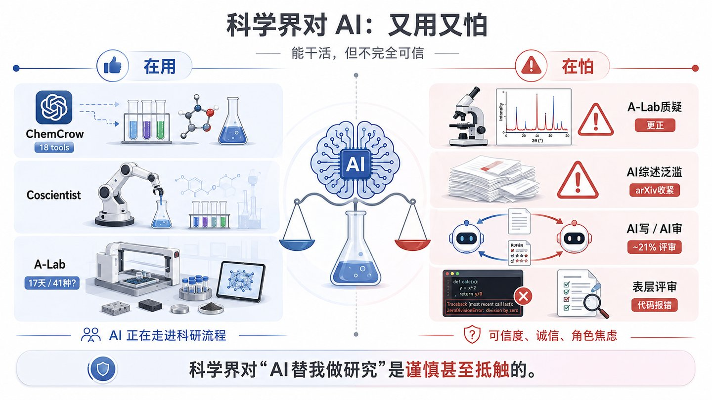
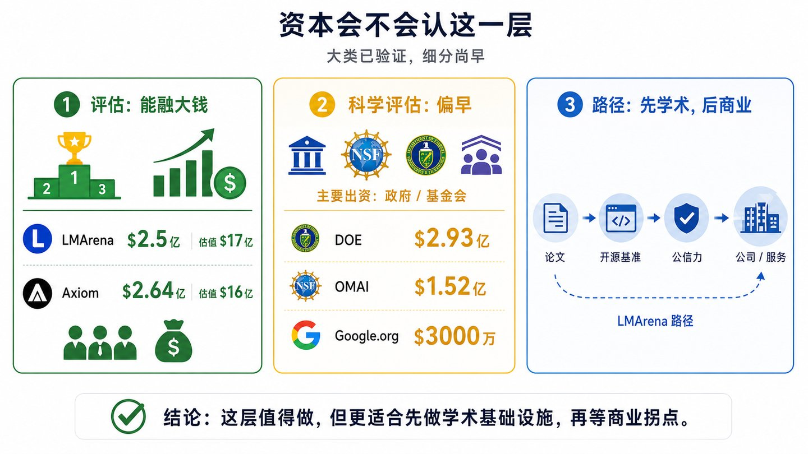

## 引言：从资本版图到入场地图

我们这个系列一共有三篇。上篇画了技术版图，中篇画了资本版图。到这一篇，问题落到最实的一层：这个赛道里，一个没有名人堂履历、也没有数亿美元的人或团队，到底还有没有位置，位置在哪，如何才能进入这个赛道？

中篇的结论可以收成一句话。AI4S的大门依旧是敞开的，但它分层，最上面那层够不着，下面那层够得着。造神层，也就是自建实验室、造"AI科学家"的那类公司，入场券是前OpenAI、前DeepMind级别的团队加数亿美元起步资金，对绝大多数人是橱窗里的样板。真正能进的是基础设施层，给科学Agent供底座、供评估、供工具、供数据的那一层。

这一篇就把下层的机会摊开，讲清三件事。第一，机会缺口具体在哪，需求侧是不是真的要。第二，什么样的背景在这层最有优势。第三，一个人从零起步，第一刀该切在哪，应该怎么走。

# 一、机会缺口：哪一层还有普通人的位置

要判断机会在哪，先得诚实地把够不着的划掉，再看剩下的哪几层是普通团队真能站住脚的。

## 1.1 造神层：热，但够不着

最吸引眼球的是造神层。中篇讲过两个代表，Periodic Labs两位创始人一个来自OpenAI、是ChatGPT的共同作者，一个来自DeepMind、主导过GNoME材料模型，一上来种子轮就是约3亿美元，估值约13亿。Lila Sciences从Flagship体系孵化，总融资超过5亿美元。

这一层的入场门槛，是名人堂团队加数亿美元，缺一样连第一轮都难拿。Lila背后站着专做生物投资的Flagship，Periodic背后是a16z领投、英伟达的投资部门加贝佐斯、施密特跟投，这种阵容不是普通团队能凑出来的。更关键的是，它的赌注最大，要同时赌通三件事，AI真能自主做好科学、自动实验室真能稳定跑、烧出的数据真能喂出更强的模型，一件不成就是数亿美元打水漂。

对绝大多数人，造神层最实在的用处是当风向标，看它成不成，比自己冲进去稳妥得多。把它划掉，谈不上认输，反倒是把目光收回到够得着的那一层，机会反而更清楚。

## 1.2 四层基础设施，哪些够得着

上篇把基础设施拆成四层，科学基础模型、自驾实验室、评估与基准与可复现、工具与编排。从"小团队够不够得着"重新排一遍，结论很明确。

科学基础模型这一层够不着。训练它要重数据、重算力，是大机构和政府联合体的游戏，比如NSF和英伟达联手、交给艾伦研究所去做的那个开放科学大模型项目OMAI，NSF出约7500万、英伟达出约7700万，光启动就是约1.52亿美元。自驾实验室这一层也够不着。看看真金白银的量级就懂了，伯克利那个A-Lab要配机械臂、高温炉、自动X射线衍射仪，凑成一整套自动合成线，才换来17天跑几十个样品，Periodic、Lila这类要自建物理实验室的公司，烧钱速度和训练一个大模型是一个档次。这不是一个小团队租点算力、补几个人能跟的游戏。

工具与编排这一层部分够得着。把某类科学数据库、某套仿真代码、某种设备接进Agent，是可做的，但通用编排层竞争激烈，真正的空位在领域特定的接口。评估与可复现这一层最够得着，不要重资产、不要数亿美元，一个想清楚的小团队就能切进去，而且它恰恰需要别人稀缺的东西，学科判断力。这也和上篇"评估是最被低估、最关键的一层"的判断对上了。

## 1.3 一把筛子：胜负由模型强弱，还是由懂不懂科学决定

在往下钻之前，先立一把通用的筛子，任何一个具体机会都能拿它过一遍。判断一个位置时，问一句，它的胜负主要由模型有多强决定，还是由做的人有多懂科学决定。

如果主要看模型强弱，那是大模型公司的主场，普通团队拿短板去拼别人的长板，绕开。如果主要看学科判断，那是有背景的人能建墙的地方，靠近。出题、定标准答案、判对错、判一个结果在物理上可不可能，这些事模型再强也替不了懂行的人。

拿它试一个具体机会就明白。做一个通用的科学Agent编排框架，胜负主要看工程和模型规模，大厂随时能压过来，这是前者，绕开。做一个判物理结果对不对的检验器，胜负主要看谁更懂这门科学，而大厂手里恰恰缺这种人，这是后者，靠近。同样是给Agent做配套，一个是红海，一个是别人进不来的窄门。这把筛子会贯穿后面几章。

# 二、谁最该切进来：学科判断力是最难补的短板

划出了够得着的那几层，下一个问题是，这层活谁干最合适。答案是有硬学科训练的人，尤其是物理这类定量科学出身的人，因为这层比拼的恰恰是纯AI团队最难补的那块短板。

## 2.1 门槛从模型规模换成了学科判断

基础设施层和造神层最大的不同，是它的胜负手不再是模型规模。评估、验证、把关这类活，纯CS和ML背景的人做起来会卡壳，因为判一个科学结果对不对，需要的是对这门学科的硬判断，而不是更大的模型。

一个很直接的例子。让一个语言Agent去做真实的科研任务，成绩到今天都不高。ScienceAgentBench这个基准取自44篇同行评审论文、共102个任务，最强的Agent三次尝试也只解出约三成，o1自带调试能到约四成。OpenAI自己的PaperBench要求AI从零复现20篇ICML顶会论文，共8000多个可评分子任务，最好的Agent平均复现分约两成，而ML方向的博士给48小时能到约四成。差距不在算力，在于科学任务需要的判断，模型还补不上。

为什么补不上，上篇算过一笔复合失败的账。科研是长链条，一次复现要接连做对读论文、写代码、跑实验、核对数据几十步，每一步哪怕有九成靠谱，十步连乘也只剩三成多。真正的难点在于发现哪一步崩了，判断第七步给出的那个数量级在物理上根本不可能。单看每一步都不算难，难的是揪出链条上错的那一环，而这种一票否决的判断，靠的正是学科训练。模型能一口气生成很长的推理，却缺一个在旁边踩刹车的人。

这正是有学科背景的人的机会。模型缺的那块判断，恰恰是他们训练里最扎实的部分。

## 2.2 物理训练的四样横切资产

以物理为例，这类训练真正值钱、且纯CS背景的人难补的，是四样能力，它们的共同点是不绑定任何具体学科。

第一样是一致性判断。守恒律、对称性、量纲、单位、极限行为，这些是所有定量科学共享的硬约束。一个结果违不违反能量守恒、量纲对不对、在极限下退不退化到已知答案，受过物理训练的人一眼能看出来。

第二样是不确定性量化。一个测量、一个预测到底有多可信，误差怎么传播，统计力学和机器学习本就数学同源，物理人对在高维、含噪空间里做推断有手感。

第三样是仿真与建模，把一个混乱的真实系统抽象成能算的模型、能跑的仿真，这是物理的看家本领，而且材料、气候、流体、天体用的是同一套建模思维。

第四样是最优实验设计，给定有限预算，下一个最该测什么、算什么，这是贝叶斯实验设计和主动学习的地盘，也是物理和统计的交叉强项。这四样，每一样都能横切一大片科学Agent。

它们听着抽象，落到场景里都很具体。一致性判断，是一个材料Agent给出晶体结构时，有人一眼看出它的形成能违反了热力学下限。不确定性量化，是一个系外行星Agent报告发现了一颗行星，有人指出它统计拟合虽好、轨道参数却取错了，可信度远没它自己说的高，这类失误在真实基准里反复出现。

仿真与建模，是把密度泛函、分子动力学这些求解器用对、把输出读对，不被一个跑飞的仿真骗过去。最优实验设计，是自驾实验室每跑完一轮，有人拍板下一个最该试哪个配方。这四种判断，恰恰是纯ML团队最容易翻车、也最难速成的地方。

## 2.3 横切，而不是钻回自己的小学科

有背景的人这时最容易犯一个错，就是一头扎回自己最熟的学科，比如去做天体物理的评估、天体物理的工具。这没错，但它把人关进了一个很小的房间。

中篇那张学科版图说得清楚，天体物理在整个AI4S里钱最少、商业出口最远。如果做的设施只服务一个小学科的Agent，市场天花板就被这个小学科锁死了。真正的破法是换个角度看自己的优势，物理背景最值钱的东西，是那套横切所有定量科学的通用能力，而不是某一个学科的深度。想通这一点，就能从一个小学科的房间里走出来，站到所有科学Agent的门口。

把这个道理翻成一句话。物理这类训练给的最值钱的东西，是一套能横切所有定量科学的通用判断力。守在一个小学科里，它只是一个学科标签，铺到所有科学Agent上，它才变回一把通用武器。这是这一篇反复要落的点，选位置时，宁可要横切的宽，别贪单学科的深。

# 三、机会菜单：科研 Agent 需要哪些验货设施  三、机会菜单：科研Agent 需要哪些验货设施

把机会摊开。组织方式是看这块设施站在Agent流水线的哪个位置，下面按位置分五类，每一类都尽量横切多个学科。这一章是全篇最实的部分。

## 3.1 一致性检验：给所有科学 Agent 当裁判3.1 一致性检验：给所有科学Agent 当裁判

这一类的思路，是在Agent出结果那一刻拦一道，问它这在物理上站不站得住。

最基础的是物理一致性检验器，任何科学Agent跑出个结果，检查它违不违反守恒、对称、已知物理边界。往细里做，还有单位与量纲的校验中间件，专抓Agent最经典的错，单位混用、量纲不对，小到可以就是一个工具，但每个定量科学Agent都得挂。再有数量级与极限的离谱检测，Agent给个数，先问它和已知尺度差了几个数量级，或者在某个极限下退不退化到已知答案，物理人天生是费米估计的高手。

最贴当下痛点的是假科学检测器，用物理一致性去识别AI编造的、看着合理却违反物理的结果。这块的需求已经明摆着，arXiv要收紧综述投稿、顶会约两成评审疑似AI代笔，都是同一个问题的不同侧面，海量看着像模像样、实则未必成立的AI产物正在灌进科学。一个能自动判这段结论在物理上到底站不站得住的检测器，正是这股洪水最缺的闸门，而判物理这件事，纯语言模型自己做不了裁判。这一个直接踩在第四章要讲的需求上。

## 3.2 不确定性与校准：给结果标一个可信度

这一类吃的是不确定性量化这样资产。

一是不确定性量化服务，Agent给个答案，它到底有多可信，做成任何科学Agent都能挂上去的一层。二是误差传播引擎，Agent把好几步算法串起来时，把每步的不确定度顺着链条传下去。上篇讲过一个复合失败，一条十步的链，每步九成靠谱，连起来只剩三成多，误差传播就是它的定量版本，而这正是计量物理的老本行。

三是校准检测，Agent嘴上说九成把握，实际真有九成吗，查它的置信度准不准，这件事横切所有学科。举个场景，一个材料Agent先预测晶体结构，再拿它去算能带、再推导电导率，三步各带一点误差，最后给出的电导率可能早就飘出可信范围，可它自己浑然不觉。把每一步的不确定度沿链条老实传下去、并在末端给一个诚实的误差棒，是纯ML流程里最常被省掉、也最该补上的一环。

## 3.3 训练场与 verifier：资本最热的一块3.3 训练场与verifier：资本最热的一块

这一类踩在当下最烧钱的地方，训练Agent。

现在训练推理和Agent模型，最主流的方法是给它可验证的奖励，业内叫RLVR，全称Reinforcement Learning with Verifiable Rewards。它的软肋是严重依赖一个能给出二元判定的验证器，在数学、代码这种有客观标准答案的地方好用，因为答案对错一跑就知道。一旦出了这个范围，多数开放式的科学问题根本没有现成的可靠验证器，你没法像判一道数学题那样，机械地判定一个新材料的性质预测或一个物理推导是不是对的。这个缺口被业内直接称作没人解决的验证器难题。

而它恰恰是懂科学的人能补的。谁来判一个推导、一个实验结果是不是真满足物理，这层是所有训练科学Agent的人都要用的设施，又纯粹是学科判断。这个缺口有多真，看前面两个基准的成绩就知道，最强的Agent在ScienceAgentBench上约三成、在PaperBench上约两成，卡住它们的常常不在代码本身，它们缺的是一个可靠的判定器，来告诉它哪一步在科学上站不住。谁能为一整类科学任务造出这种判定器，谁就握住了训练科学Agent的一道关口。

再往上还有两块。一是物理仿真的训练与考核环境，科学Agent要在环境里训练和被考核，物理仿真是造这些训练场和考场的通用底料。二是可控难度的合成任务工厂，用物理仿真当标准答案机，批量生成有真值、难度可调、还能塞分布外陷阱的科学任务。有的基准就是往一个模拟里塞进一条改过的物理定律，看Agent会不会照搬教科书答案，这种思路完全可以做成一条通用产线。

## 3.4 最优实验设计：自驾实验室的大脑

先说清楚这件事是什么。做科学尤其做实验，真正贵的是每做一次的成本，想法反而便宜。一次材料合成、一次昂贵的仿真、一次天文观测，都要烧钱烧时间。所以在一堆候选里先做哪个、下一个再做哪个，选得好坏直接决定同样的预算能出多少成果。专门研究下一步最该测什么的学问，就叫最优实验设计，它的两个主力工具，一个是贝叶斯实验设计，说白了是用已有结果不断更新对哪里最可能有惊喜的判断，一个是主动学习，让模型自己挑最值得测、最能长本事的样本。

这颗大脑是所有自驾实验室的核心。A-Lab那种一天要跑几十个样品的自动线，机械臂、高温炉都只是手脚，真正值钱的是那个决定这一批合成什么、下一批往哪调的调度器。选得准，同样的炉子能多发现好几种新材料，选得差就是烧钱空转。材料、生物、天文都一样，每一个自驾实验室、每一个要花钱采数据的Agent，都绕不开它。

机会正在于，这颗大脑今天几乎没人单独拿出来做成一层通用设施，多数团队把它埋在各自的实验室里各做各的，重复造轮子。而它恰好落在贝叶斯实验设计、物理和统计的交叉甜区，上篇就点过，高维实验设计加不确定性管理，是物理背景者的天然甜区。谁能把它抽象成一个任何自驾实验室都能挂上去的调度中间件，就占住了一个资本密集、竞争又少的位置。

## 3.5 接口与复现：把仿真和验证接给 Agent  3.5 接口与复现：把仿真和验证接给Agent

这一类偏工程，但同样吃学科判断，里面有两块。

先说接口。科学计算里有一批老牌求解器，比如算电子结构的密度泛函、算分子运动的分子动力学、算多体引力的N体模拟，它们是各学科几十年攒下的算力底座。现在的麻烦是，要让一个Agent自己去调用这些求解器，接口五花八门、报错各不相同，Agent一调就崩，或者拿到一个跑飞的结果还照单全收。谁能把这些求解器包成干净、带物理报错、Agent能稳定调用的标准工具，谁就成了所有仿真密集科学Agent绕不过的一层，而且这件事做对一次，所有人复用。

再说复现。同一个AI科学结果，换个人、换一次能不能重新跑出来，这在科学里叫可复现，是判断一个结果算不算数的底线。AI偏偏在这里添了新麻烦，同样的输入，模型两次输出可能不一样，这种非确定性正在加剧本就存在的可复现危机。做一个通用的复现验证工具，自动判定一个AI结果换环境能不能重现、能不能查出有人故意塞进去的错，这类验货设施每一个严肃的科学团队都需要。

## 3.6 优先级：最值得先做的三块

菜单很长，真要动手不必全做，选横切最广、最贴当下钱口、又最吃学科判断的几刀就够。挑出来是这三个。

第一刀是科学verifier库，也就是3.3讲的那个判定器。它踩在训练Agent这个最烧钱的地方，而科学领域的可靠判定器又奇缺，做出来是所有训练科学Agent的人都要买的设施。

第二刀是最优实验设计中间件，自驾实验室的大脑，资本密集、竞争又少，横切所有要决定下一步的科学Agent。

第三刀是假科学检测器，最贴下一章要讲的那个科学界急着要盾牌的当下痛点，故事也最好讲。

有人会问，那评估和基准去哪了。它没消失，只是散进了上面几类里。把眼界从给一个学科做一套考卷，放大到建一层横切所有科学Agent的验货设施之后，评估就成了这层设施的一种用法，而verifier、实验设计、不确定性量化这些反而市场更大，也更难被一个小团队抢先占满。所以这一篇把评估打散进整张菜单，不再单列成一道主菜。

# 四、需求侧：学术界真的愿意要吗

前三章都在讲能供什么。但有一个最容易被乐观情绪盖过、也最要命的问题，需求侧到底要不要。很多AI进专业领域的项目，死掉的原因不在技术，在于那个领域的人根本不买账。这一章必须直面它。

## 4.1 一个教训：替代型应用为什么被反感

先看一类反复出现的失败。凡是把AI摆成替代专业人士的姿态，几乎都会撞上那个行业的集体抵触，无论技术多好。

例子并不难找。2023年好莱坞编剧工会大罢工，停摆近五个月，核心诉求之一就是限制用AI写剧本，紧接着演员工会也罢工，反对片方用AI扫描、复制演员的形象和声音。同一年，大批画师在ArtStation上集体贴出拒绝AI作画的抗议图，图库巨头Getty Images把生成式AI公司Stability AI告上法庭。这些反弹的共同点很清楚，从业者觉得这东西是冲着抢我的活、复制我这门手艺来的，一旦是这个定位，本能反应就是抵制。

教育界也是一样。老师普遍抵触那种把自己当成替代老师的AI产品，比如直接给学生打分、直接代替讲课的系统，却对帮我批改初稿、帮我出练习题这种辅助定位的工具接受得多。真正的差别是它站在从业者的对面还是这边，跟技术强弱关系不大。

这个教训对AI4S极其重要，因为科学界对AI的态度，和这些行业并没有本质不同。

## 4.2 科学界对 AI：又用又怕，而且怕得很具体  4.2 科学界对AI：又用又怕，而且怕得很具体

把镜头转向科学界，是一幅又用又怕的复杂图景，而且怕得很具体，有实打实的事件可查。

先看用。ChemCrow用GPT-4接了18个化学工具，自主规划并完成了驱虫剂和几种催化剂的合成。Coscientist在2023年就能自主设计并操控机器人跑化学实验。伯克利国家实验室的A-Lab更激进，2023年在Nature上报告17天自主合成了41种新化合物。AI确实在往科研深处走。

但同一批成果里就藏着畏惧。A-Lab那41种，很快被伦敦大学学院的材料化学家Robert Palgrave公开质疑，指出它的X射线衍射分析有严重问题，一部分所谓新材料其实是同一种物质或存在混相，真实数目远低于41，论文后来做了更正。

更普遍的焦虑在学术生态层面。arXiv在2025年10月底收紧了计算机方向综述和立场类文章的投稿，要求先过同行评审，起因正是AI生成的水综述泛滥。检测机构Pangram Labs扫描ICLR 2026全部约7.6万条评审，估算其中约21%完全由AI生成，AI写、AI审的闭环正在成形。有人评估Sakana的AI Scientist系统，发现它的自动评审停在表层，把随机梯度下降里早有的小批量技巧误判成新颖发现，还有约四成实验直接因为代码报错失败。

还有一层更深的焦虑，当AI能在关键研究任务上逼近甚至超过人手，如果它能替我做，我还剩什么，这个问题真实地影响着研究者的采纳意愿。多项调查也显示，相当多研究者怀疑AI生成内容的准确性和完整性。这种抵触背后有具体事件、具体数据撑着，并非一时的守旧情绪。

一句话，科学界对AI替我做研究是警惕甚至抵触的。一个替代科学家的Agent，会撞上一堵和教育界一样硬、甚至更硬的墙。

## 4.3 关键转向：做守门人，而不是替代者

科学界怕AI这件事，恰恰为验货设施这一层创造了需求，这是AI4S和教育那类失败最本质的区别。

逻辑很顺。科学界正被AI生成内容淹没、被分不清真假困扰、被AI写AI审的闭环威胁、被加剧的可复现危机折磨，他们最急需的，是能帮自己辨别、验证、把关AI的工具。而第三章那张菜单上的东西，假科学检测、一致性检验、不确定性量化、可复现验证，正好就是这样的工具。

这就把定位彻底翻了过来。做这层设施，是站在科学家这边、递给他们一面对抗AI泛滥的盾牌，而不是抢他们的饭碗。需求方甚至在主动呼唤，大型科研合作组已经公开把建立验证框架、领域专属评估基准列进优先事项。面对的是一个焦虑的、主动在找人补位的市场，而不是一个需要苦苦说服的抵触市场。而且横切的好处在这里又显出来，这面盾牌不绑定任何一个学科，需求面比单学科评估宽得多。

这里还有一层时间上的顺风。科学界对AI的信任正处在低点，A-Lab的材料数被打折、AI综述被arXiv拦在门外、AI代笔的评审被检测机构逮住，这些事一件接一件。越是这样，能证明我把过关的工具就越有人要。守门人这门生意，恰恰在造神热潮最喧嚣、翻车也最多的时候，最有存在感。

## 4.4 一条死守的定位红线

把这一章收成一条必须从第一天守到最后一天的红线，做盾牌，不做替代。

先把线画清楚。同样一身技术本事，摆成两种姿态，结局天差地别。摆成帮科学家把关、验证、复现的工具，科学家欢迎，需求方主动来找。摆成替科学家做研究、自动产出论文、甚至挂名当作者的系统，撞上的就是本章开头那堵墙，编剧、画师、老师怎么抵制替代型AI，科学家就会怎么抵制一个替代型的科研Agent。

Sakana那个AI Scientist就是踩线的典型。它想直接当科学家，自动写论文、自动评审，结果被同行按着挑毛病，表层评审、把老技巧当新发现、约四成实验跑不通，技术还没站稳，口碑先垮了。它栽的跟头栽在姿态上，把自己摆成了科学家的替身，能力强不强反而是次要的。

这条线还会悄悄移动，不总那么好认。一个本来老实做验货的工具，很容易在产品迭代里往替代那头飘，一个假科学检测器，本职是判对错，可一旦开始自动改写结论、自动补实验、最后署上自己的名，就从帮手变成了竞争对手。判断自己站在哪一边，有个很简单的自检，问一句，我这东西是让科学家更有底气地署上自己的名，还是在替他署名。前者是盾牌，后者是替代。

最后还有一层是话术。同一个功能，介绍成帮你复核、帮你兜底，和介绍成不用你也行、比你更准，听在从业者耳朵里是两回事。守门人这门生意，产品要站在科学家这边，连对外的一句话也要站在科学家这边。这条线一旦站错，技术再好也救不回来，因为你把最该服务的那群人，变成了自己的对手。

# 五、资本会不会认这一层

需求侧搞清楚了，还要回答资本侧。验货设施这层，钱认不认。答案分两层说，避免被乐观或悲观任何一边带偏。

## 5.1 大类已验证：评估能融大钱

先看大类。做评估能不能成为一门大生意，资本已经用真金白银回答了，能。最硬的例子是LMArena，它从加州大学伯克利的众包打分项目Chatbot Arena独立出来，专做大模型评估和排行榜。2025年5月拿约1亿美元种子轮、估值约6亿，到2026年1月又拿约1.5亿A轮，估值升到约17亿。

一个给模型打分的平台累计融到约2.5亿美元，估值一年内从约6亿翻到约17亿，说明评估本身就是被资本认可、能融大钱的方向，而不是可有可无的配套活。这里要留一个伏笔，LMArena评的是通用大模型，它证明的是评估这个大类能赚钱，而不是科学评估这个细分已经能赚钱，两件事差着一个身位，下一节分开说。

同一层里还有Axiom Math，做数学和形式化验证，2025年10月种子约6400万，2026年3月A轮约2亿、估值约16亿。虽然名字里有Math，它对外更强调的是证明AI生成的代码安全可用，商业化卖点其实更接近软件验证。

## 5.2 细分尚早：科学评估对纯 VC 还偏早  5.2 细分尚早：科学评估对纯VC 还偏早

但要把话说全。LMArena评的是通用大模型，全世界都想知道哪个模型最强，受众极广、商业化路径清楚。一旦细化到科学评估，给某个学科的科研Agent出考卷，受众一下子窄到只剩这门学科里的研究者和几家做科学Agent的公司，纯商业的盘子小了不止一个数量级。

所以这块地现在几乎见不到纯VC，托底的清一色是国家级和基金会的钱。梳理一下就很清楚。美国能源部2025年11月以行政令启动创世纪计划，要调动国家实验室用AI加速科学发现，后续放出约2.93亿美元招标。国家科学基金会和英伟达联手做OMAI，也就是开放的多模态AI科学设施，NSF出约7500万、英伟达出约7700万，合计约1.52亿，交给非营利的艾伦人工智能研究所去做全开放的科学大模型。

再往下数还有一串。谷歌的公益部门[Google.org](https://google.org/)有一个约3000万美元的AI科学资助计划，重点砸健康和生命科学。施密特夫妇的施密特科学基金会长期资助AI与科学交叉，比如AI2050学者计划，国家科学基金会自己的国家AI研究院项目也累计投了超过5亿美元。这些钱有个共同点，都不追短期回报，专门去VC不愿意去、但对公共利益重要的地方托底。

出资名单清一色是政府和基金会，本身就说明问题。科学评估作为一项严肃的学术和基础设施工作，是真实且被重视的，但作为一门纯商业的风投生意，眼下确实还偏早。这并不是坏消息，它恰恰说明这块地还在被公共资金养着、等一个商业化拐点，早进来的人有的是时间把位置坐稳。

## 5.3 含义：先学术，后商业

大类已验证、细分尚早，这个组合恰好指向一条最适合学科背景者的路，先做学术，再谈商业，别一上来就纯VC创业。

理由很顺。既然这块地现在主要靠公益和学术的钱养着，学术圈里的人就是天然的近水楼台。发一篇扎实的基准论文、把工具和榜单开源、在领域里把声誉立起来，是学者本来就擅长、风险又极低的动作，启动阶段甚至不需要一分钱风投，前面那些国家科学基金会、能源部、施密特基金会的资助，本身就是给这个阶段准备的钱。

LMArena就是这条路走通的活样本。它的前身Chatbot Arena，2023年只是伯克利一群人搞的研究项目，靠一篇论文和一个让大家匿名投票比模型的公开榜单，一点点把公信力做起来，做到全行业默认用它的排名。等这份声誉攒够了，商业化的钱才追着进来，把它按约17亿美元估值投成一家公司。先有学术公信力，后有商业估值，顺序不能反。

对做科学验货设施的人，这条路可以照抄。先在自己最熟的学科里，靠公共资金支持，做出一个别人都来引用的基准或检验器，把标准制定权攥在手里。等科学Agent真正铺开、这块的商业化拐点到来，手里握着声誉和标准的人，才有资格谈把它做成服务、做成认证，或者被需要这套能力的公司高价收走。这条路的具体走法，就是下一章的三步。

# 六、入场路径：从一篇基准论文到一个事实标准

前五章给了方向、菜单、定位和资本判断。这一章落到最具体的一步，一个有学科背景的人从零起步，第一刀切在哪，怎么走。

## 6.1 选第一刀：挑一个只有懂科学的人能做、且横切的切口

回到第一章那把筛子，再叠加横切这条主线，选第一刀的标准就两条。一是只有懂这门科学的人才能做好，比的是学科判断而不是模型规模。二是它能横切到多个学科，不被锁进一个小房间。

按这两条，第三章那三个最锋利的切口都合格，假科学检测、科学verifier库、最优实验设计。挑哪个看最想先攻哪块，但有一个务实的起步技巧，先在自己最熟的领域把它跑通一次。以天体物理背景为例，就拿天体物理当第一块试验田，因为在这里出题最准、判分最稳、阻力最小。但这只是练手场，终点在更宽的地方，第一个东西从设计的第一天起，骨架就要是横切的，方法要能原样搬到材料、气候、生物的Agent上去。

举个具体的样子。一个天体物理背景的人，第一刀可以做一个轨道一致性检验器，任何一个声称发现了系外行星或双星轨道的Agent，把结果丢给它，它检查开普勒第三定律、能量和角动量守恒、以及在长周期极限下退不退化到已知解，对不上就报警。这个检验器在天体物理最好出题、最好判分，但它的骨架是纯物理约束，原样就能改成材料领域的形成能一致性、气候领域的能量收支一致性。一篇基准论文，加一个开源的检验工具和公开榜单，就是一个能横切的起点，而且几乎不烧钱。

## 6.2 三步走

把练手和横切合成一条路径，最稳的走法是学术先行，分三步。

第一步，在最熟的领域发出第一个，开源，立声誉。比如拿天体物理做一个横切设计的verifier或一致性检验器，配一篇基准论文和公开榜单。这一步几乎不需要资本，就能把做科学Agent验货设施这件事跑通，并在领域内立住名声。它的产物不只是论文，更是一套可复用的方法论，一套怎么给科研Agent出题、判分、把关的打法。

第二步，把同一套能力横展到更多学科、更热的方向。用第一步攒下的方法论和声誉，把这套横切能力铺到材料、气候这些钱景更好的方向去，靠的是横切武器的可迁移性，不必为每个学科从头补课。第三步，成为科学Agent可靠性的事实标准，等商业化拐点。让做出来的检验器、verifier或实验设计层被引用、被采用，最好被造Agent的公司和实验室纳入流程。一旦它成了大家默认用来衡量科学Agent靠不靠谱的那把尺子，就握住了标准制定权，等商业化拐点到来，可以从容选择做持续服务、做认证，或被需要这套能力的公司并购。

这条三步路，本质是把学术信誉当启动资本。没有数亿美元，但有一篇篇能被同行引用的扎实工作，靠它一点点把标准和声誉攒起来，等钱和商业化拐点自己找上门。这正是LMArena走过的路，从一个伯克利的课余打分项目，到被资本按约17亿美元估值追着投，中间靠的就是先把公信力做扎实，让所有人默认用它的榜单。学术背景者最擅长的恰恰是这一步，把一件事做到别人都来引用。

## 6.3 为什么这条比主攻一个小学科强

最后说清楚，这条横切路线为什么比主攻材料评估或天体评估都强。

一是不被锁进小学科，市场天花板不再被某一个学科封死，而是所有科学Agent。二是学科判断当通用武器，那四样横切资产可以反复复用，做一次卖很多学科，不必为每个学科从头补课。三是它最贴合学科背景者该走的路子，靠一篇篇扎实的研究把声誉立住，让机会反过来找上门，而不是一上来就赌一个重资产的大局。它慢，但稳，而且越做越宽。

# 小结：造神者，还是守门人

三篇走到这里，可以把整个系列收成一个选择。

上篇说，AI正在从读科学走向做科学，范式转变是真的，但它做得还很不可靠，ScienceAgentBench约三成、PaperBench约两成的成绩就是证据。中篇说，资本已经认了这个方向，门是开的，钱在加码，但代价是慢，而且这扇门分层。下篇把够得着的那层讲透了，对一个有学科背景、却没有巨额资本的人，能进也该进的，是基础设施层里那些只有懂科学的人才能做、巨头又懒得做的活，用学科判断当一把横切所有科学的通用武器，去建任何科学Agent都要用的检验、验证、训练设施。

所以最后的选择，其实是个身份问题，造神者，还是守门人。造神者要造出AI科学家，那是名人堂团队加数亿美元的豪赌，也是最可能先爆的雷。守门人不做这个赌，他给这场造神运动当裁判、当验货员，当那面让科学界对抗AI泛滥的盾牌，凭的是别人翻不过去的学科判断力，不是钱。他站在科学家这边、不抢饭碗，正好躲开了编剧、画师、老师抵制替代型AI撞上的那堵墙，守的也是所有定量科学的门，而不只是一个学科的门。

守门人这条路还有一个常被忽略的好处，它不必一上来就赌上身家。像LMArena那样，先从一篇论文、一个开源榜单起步，靠公共资金养着，把公信力和标准一点点立起来，等这块地的商业化拐点到了，声誉和标准都攥在自己手里。这条路慢，但每一步都算数，越走越宽。

最后回到那句最该被问出口的话。每一个AI自己设计出分子、自己合成出材料的高光背后，都需要有人冷静地问一句，它真的做对了吗，还是只是看起来做对了。A-Lab那四十多种新材料后来被材料化学家逐一核查、打了不小的折扣，就是这句冷问的价值。

能可靠回答这个问题的人，价值一点不比造神的人低，而且在未来很长一段时间里都会是稀缺的。门开着，钱在加码，而最难被取代的，是懂科学的人手里那把别人没有的尺子。

# 相关文章

- [AI for Science 详细介绍（上）：范式与版图](https://x.com/snowboat84/status/2070656715515932930)
- [AI for Science 详细介绍（中）：资本与格局](https://x.com/snowboat84/status/2075095303389413496)

# 作者其它文章（选）

- [流体力学研究史](https://x.com/snowboat84/status/2077983459369418941)
- [什么是推理模型？](https://x.com/snowboat84/status/2077613128746164625)
- [什么是希尔伯特的第六问题？这个问题重要吗？](https://x.com/snowboat84/status/2077249534049259588)
- [RAG：从前世今生到技术全景](https://x.com/snowboat84/status/2076868301809225932)
- [什么是信息论？它和AI是什么关系？](https://x.com/snowboat84/status/2075781603847188852)
- [AI可解释性综述](https://x.com/snowboat84/status/2075374060637503560)
- [Skill是什么：写给零基础](https://x.com/snowboat84/status/2074652382299132237)
- [元宇宙衰亡史：炒作，破产，谁赚走了钱？](https://x.com/snowboat84/status/2074278858988380322)
- [AI 大V 人物小传（下）](https://x.com/snowboat84/status/2073554517065609544)
- [区块链的叙事是如何崩塌的](https://x.com/snowboat84/status/2073195935883288671)
- [一篇文章讲清楚美国的移民系统](https://x.com/snowboat84/status/2057980486501433383)
- [一文讲清楚美国医疗系统](https://x.com/snowboat84/status/2055081426744422697)
- [细说美国的华人老钱家族](https://x.com/snowboat84/status/2062326581776011623)
- [美国的犹太人和华人分别抢到了什么资源？详细分析](https://x.com/snowboat84/status/2063049247805837815)
- [一篇文章看懂美国教育全生态](https://x.com/snowboat84/status/2054359249917210633)
- [AI圈大V名单（推特版）](https://x.com/snowboat84/status/2069206740546343372)
- [什么是控制论？控制论是AI的上辈子吗？](https://x.com/snowboat84/status/2064496706042069340)
- [祖父积分学概论](https://x.com/snowboat84/status/2056533111983493136)
- [教宗良十四世论人工智能（精华版）](https://x.com/snowboat84/status/2059434342745866391)
- [Vibe Reading：AI 时代读书的系统化方法](https://x.com/snowboat84/status/2050008577511973253)

---
