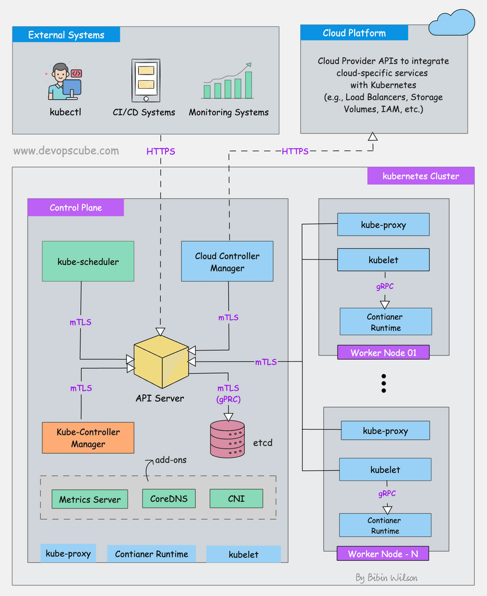
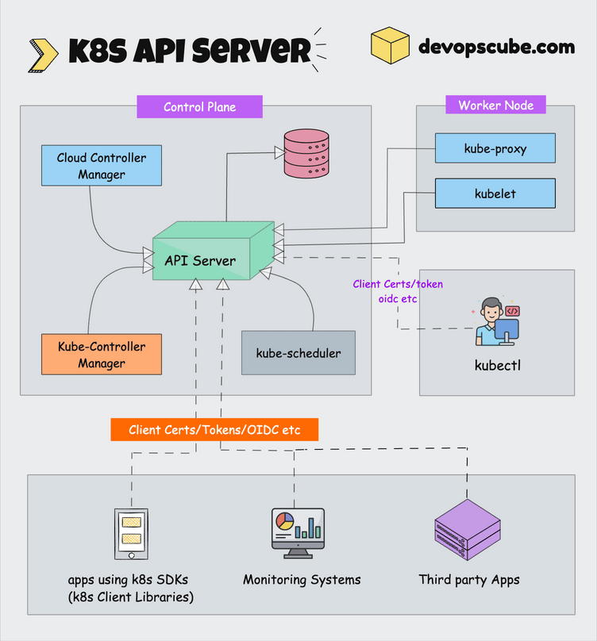
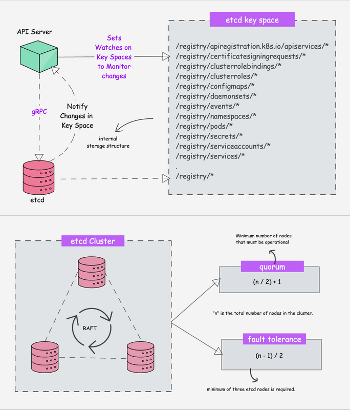
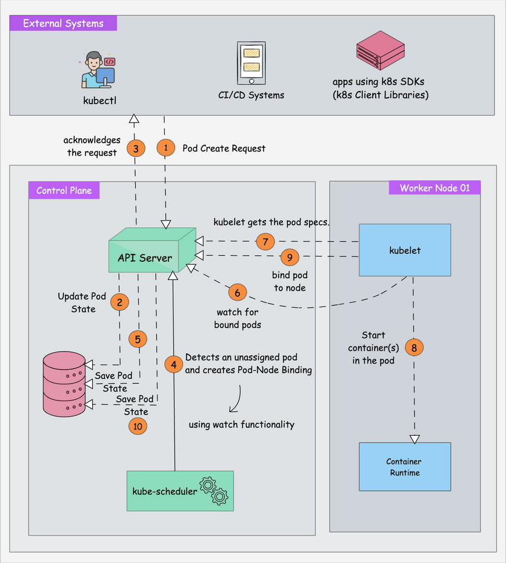
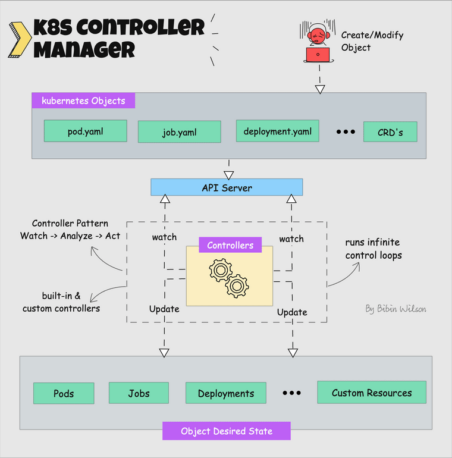
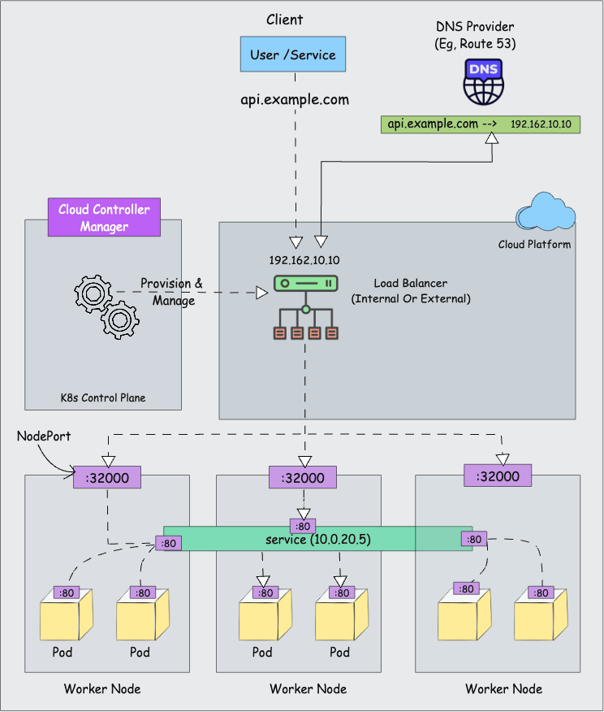
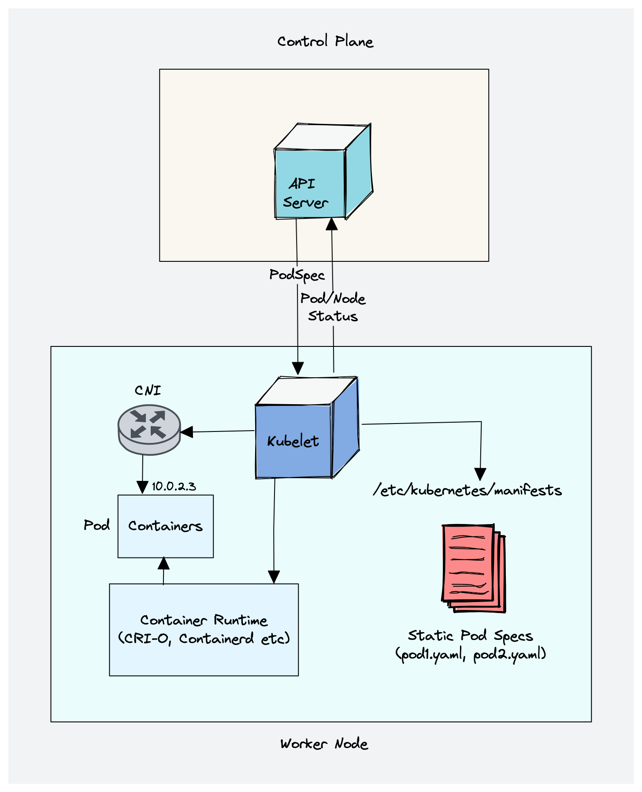
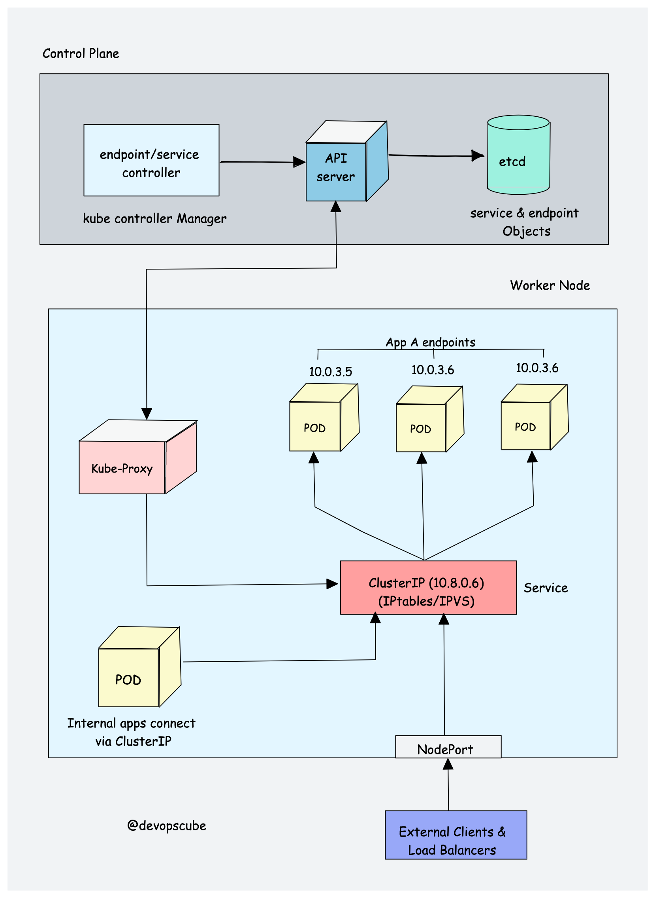
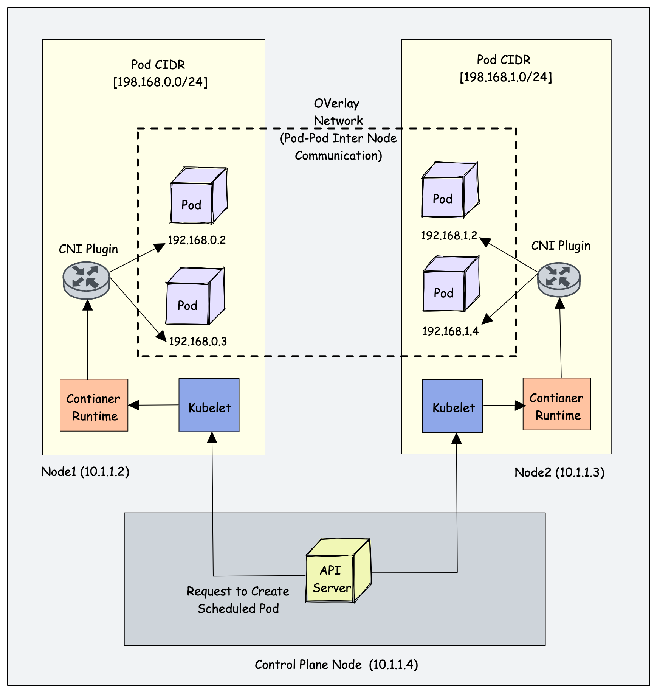

# Kubernetes 架构详解（附图解）

在本指南中，你将全面深入地了解 Kubernetes 架构。在这份图解指南里，我会拆解每一个 Kubernetes 组件——从控制平面到 kubelet，向你展示 Kubernetes 集群究竟是如何运作的。

如果你希望：

1. 理解 Kubernetes 的架构
2. 掌握 Kubernetes 各组件背后的基本概念
3. 详细了解每一个 Kubernetes 组件
4. 探索将这些组件串联起来的工作流程

那么这份 Kubernetes 架构指南对你而言将非常有价值。

**注意**：为了更好地理解 Kubernetes 架构，有一些前置知识需要掌握。请查看 [Kubernetes 学习指南](https://devopscube.ghost.io/learn-kubernetes-complete-roadmap/?ref=devopscube.com) 中的前置要求以了解更多。

## 什么是 Kubernetes 架构？

下面的 **Kubernetes 架构图**展示了 Kubernetes 集群的所有组件，以及外部系统如何与 Kubernetes 集群建立连接。

点击查看高清大图

关于 Kubernetes，你首先需要理解的一点是：它是一个**分布式系统**。也就是说，它由多个组件组成，这些组件通过网络分布在不同服务器上。这些服务器可以是虚拟机，也可以是裸金属服务器。我们将其称为 Kubernetes 集群。

⚠️

如果你是初学者，并且没有太多动手经验，本指南中的某些概念可能会有些难以理解。如果是这种情况，我建议你先花些时间学习我们的 [Kubernetes 教程](https://devopscube.com/kubernetes-tutorials-beginners/)，之后再回来深入研读。

一个 Kubernetes 集群由控制平面节点（control plane nodes）和工作节点（worker nodes）组成。

### 控制平面（Control Plane）

控制平面负责容器编排并维护集群的期望状态。它包含以下组件：

1. kube-apiserver
2. etcd
3. kube-scheduler
4. kube-controller-manager
5. cloud-controller-manager

一个集群可以有一个或多个控制平面节点。

### 工作节点（Worker Node）

工作节点负责运行容器化应用。工作节点包含以下组件：

1. kubelet
2. kube-proxy
3. 容器运行时（Container Runtime）

现在让我们深入了解一下这些组件。

## Kubernetes 控制平面组件

首先，让我们看看每个控制平面组件以及其背后的重要概念。

### 1. kube-apiserver

**kube-apiserver** 是 Kubernetes 集群的中枢，它暴露了 Kubernetes API。它具有高度可扩展性，能够处理大量并发请求。

终端用户以及其他集群组件都通过 API server 与集群通信。极少数情况下，监控系统或第三方服务也会与 API server 交互以接入集群。

因此，当你使用 [kubectl](https://devopscube.com/kubectl-aliases/) 管理集群时，在后端，你实际上是通过 **HTTP REST API** 经由 TLS 与 API server 通信。

此外，API server 与集群中其他组件之间的通信也通过 TLS 进行，以防止对集群的未授权访问。

点击查看高清大图

Kubernetes **api-server** 负责以下工作：

1. **API 管理**：暴露集群 API 端点并处理所有 API 请求。API 是有版本的，并且同时支持多个 API 版本。
2. **认证**（使用客户端证书、持有者令牌和 HTTP 基本认证）和 **授权**（ABAC 和 RBAC 评估）
3. 处理 API 请求并验证 pod、service 等 API 对象的数据（验证和变更准入控制器）
4. API server 协调控制平面与工作节点组件之间的所有流程。
5. API server 还包含一个 [聚合层（aggregation layer）](https://kubernetes.io/docs/concepts/extend-kubernetes/api-extension/apiserver-aggregation/?ref=devopscube.com)，允许你扩展 Kubernetes API 以创建自定义 API 资源和控制器。
6. **kube-apiserver 主动发起连接**的唯一组件是 **etcd**。所有其他组件都连接到 API server。
7. API server 还**支持监听（watch）资源变化**。例如，客户端可以对特定资源建立 watch，并在这些资源被创建、修改或删除时收到实时通知。
8. 每个组件（Kubelet、scheduler、controllers）都**独立监听 API server**，以判断自己需要做什么。

此外，api-server 内置了 **apiserver proxy**。

它是 API server 进程的一部分。它内置了一个**代理**，可将请求转发到集群资源。这主要用于**管理和调试目的**，而不是用于将应用暴露到集群外部。

**安全提示**：为了减小集群攻击面，保护 API server 至关重要。Shadowserver 基金会曾进行过一项实验，发现了 [38 万个公开可访问的 Kubernetes API server](https://www.shadowserver.org/news/over-380-000-open-kubernetes-api-servers/?ref=devopscube.com)。

### 2. etcd

Kubernetes 是一个分布式系统，它需要一个像 etcd 这样高效、支持其分布式特性的分布式数据库。它充当集群的唯一真相来源（single source of truth）。所有 Kubernetes 对象、配置和元数据都存储在这里。

[etcd](https://github.com/etcd-io/etcd?ref=devopscube.com) 是一个开源的强一致性分布式键值存储。那么这意味着什么呢？

1. **强一致性**：如果对某个节点进行了更新，强一致性会确保它立即更新到集群中的所有其他节点。另外，根据 [CAP 定理](https://en.wikipedia.org/wiki/CAP_theorem?ref=devopscube.com)，在保证强一致性和分区容错性的同时实现 100% 可用性是不可能的。
2. **分布式**：etcd 被设计为以集群方式在多个节点上运行，而不牺牲一致性。
3. **键值存储**：一种以键和值的形式存储数据的非关系型数据库。它还暴露了键值 API。数据存储构建在 [BboltDB](https://github.com/etcd-io/bbolt?ref=devopscube.com) 之上，后者是 BoltDB 的一个分支。

etcd 使用 [Raft 共识算法](https://raft.github.io/?ref=devopscube.com) 来实现强一致性和可用性。它以 leader-member（领导者-成员）方式工作，以实现高可用并抵御节点故障。

那么，etcd 是如何与 Kubernetes 协同工作的？

简单来说，当你使用 kubectl 获取 Kubernetes 对象详情时，数据来自 etcd。同样，当你部署一个像 pod 这样的对象时，etcd 中会创建一条记录。

简而言之，关于 etcd 你需要了解以下内容：

1. etcd 存储 Kubernetes 对象（pods、secrets、daemonsets、[deployments](https://devopscube.com/kubernetes-deployment-tutorial/)、configmaps、statefulsets 等）的所有配置、状态和元数据。
2. `etcd` 允许客户端使用 `Watch()` API 订阅事件。Kubernetes api-server 利用 etcd 的 watch 功能来追踪对象状态的变化。
3. etcd [使用 gRPC](https://etcd.io/docs/v3.5/learning/api/?ref=devopscube.com) 暴露键值 API。此外，[gRPC gateway](https://etcd.io/docs/v3.3/dev-guide/api_grpc_gateway/?ref=devopscube.com) 是一个 RESTful 代理，将所有 HTTP API 调用转换为 gRPC 消息。这使其成为 Kubernetes 的理想数据库。
4. etcd 以键值格式将所有对象存储在 **/registry** 目录键下。例如，default 命名空间下名为 Nginx 的 pod 的信息可以在 **/registry/pods/default/nginx** 下找到。

点击查看高清大图

此外，etcd 是控制平面中唯一的 **Statefulset**（有状态集）组件。在 [基于 kubeadm 的集群](https://devopscube.com/setup-kubernetes-cluster-kubeadm/) 中，它通常作为由 kubelet 管理的 [**静态 Pod**](https://devopscube.com/create-static-pod-kubernetes/) 运行。

### 3. kube-scheduler

kube-scheduler 负责**将 Kubernetes pod 调度到工作节点上**。

当你部署一个 pod 时，你会指定 pod 的需求，例如 CPU、内存、亲和性、污点或容忍、优先级、持久卷（PV）等。调度器的主要任务是识别创建请求，并选择满足需求的最佳节点来运行 pod。

下图展示了**调度器如何工作**的高层概览。

点击查看高清大图

💡

对于专用硬件（如 GPU、FPGA、智能网卡），调度器可以利用动态资源分配（Dynamic Resource Allocation，DRA）。

这是 Kubernetes 的一项功能（自 v1.34 起稳定），为调度器提供集群中硬件设备的实时信息。

因此，如果启用了 DRA，调度器就可以对专用设备进行**硬件感知调度**，这对 AI/ML 工作负载尤为有用。

### 4. Kube Controller Manager

**什么是控制器？** [控制器](https://kubernetes.io/docs/concepts/architecture/controller/?ref=devopscube.com) 是运行无限控制循环的程序。也就是说，它会持续运行并监视对象的实际状态和期望状态。如果实际状态与期望状态存在差异，它会确保 Kubernetes 资源/对象处于期望状态。

根据官方文档：

> 在 Kubernetes 中，控制器是监视集群状态的控制循环，并在需要时进行更改或请求更改。每个控制器都试图将当前集群状态向期望状态推进。

假设你想创建一个 deployment，你在清单 YAML 文件中指定期望状态（声明式方法）。例如，2 个副本、一个卷挂载、configmap 等。内置的 deployment 控制器会确保 deployment 始终处于期望状态。如果用户将 deployment 更新为 5 个副本，deployment 控制器会识别这一变化并确保期望状态为 5 个副本。

**Kube controller manager** 是管理所有 Kubernetes 控制器的组件。pods、namespaces、jobs、replicaset 等 Kubernetes 资源/对象都由各自的控制器管理。

点击查看高清大图

以下是重要的内置 Kubernetes 控制器列表：

1. Deployment 控制器
2. Replicaset 控制器
3. DaemonSet 控制器
4. Job 控制器（[Kubernetes Jobs](https://devopscube.com/create-kubernetes-jobs-cron-jobs/)）
5. CronJob 控制器
6. endpoints 控制器
7. namespace 控制器
8. [service accounts](https://devopscube.com/kubernetes-api-access-service-account/) 控制器
9. Node 控制器

以下是关于 Kube controller manager 你应该了解的内容：

1. 它管理所有控制器，而控制器则试图让集群保持期望状态。
2. 你可以通过与自定义资源定义（CRD）关联的**自定义控制器**来扩展 Kubernetes。

### 5. Cloud Controller Manager (CCM)

当 Kubernetes 部署在云环境中时，cloud controller manager 充当云平台 API 与 Kubernetes 集群之间的桥梁。

这样，Kubernetes 核心组件可以独立工作，并允许云提供商通过 Cloud Controller 二进制文件与 Kubernetes 集成。

**Cloud Controller Manager 是 Kubernetes 与你的云提供商之间的桥梁**。它与云提供商的 API 通信，以管理负载均衡器、路由和节点元数据等资源。

Cloud Controller Manager 动画工作流程

Cloud Controller Manager 包含一组**云平台特定的控制器**，确保云特定组件（nodes、[Loadbalancers](https://devopscube.com/aws-load-balancers/)、storage 等）的期望状态。以下是 cloud controller manager 中的三个主要控制器：

1. **Node 控制器**：该控制器通过与云提供商 API 通信来更新与节点相关的信息。例如，节点标签与注解、获取主机名、节点健康状况等。
2. **Route 控制器**：负责在云平台上配置网络路由，以便不同节点上的 pod 可以相互通信。
3. **Service 控制器**：负责为 Kubernetes service 部署负载均衡器、分配 IP 地址等。

总体而言，Cloud Controller Manager 通过与云提供商的 API 通信来处理所有云特定的操作。这使核心 Kubernetes 控制平面保持**与云无关**。

## Kubernetes 工作节点的核心组件

现在让我们看看每个工作节点组件。

### 1. Kubelet

Kubelet 是一个代理组件，运行在集群中的每个节点上。它不以容器方式运行，而是作为守护进程运行，由 systemd 管理。

它向 API server 注册节点，并监视调度到该节点的 pod。当一个 pod 被分配后，它与容器运行时通信，以创建、更新或删除容器，从而匹配期望状态。

简单来说，kubelet 负责以下工作：

1. 为 pod 创建、修改和删除容器。
2. 负责处理存活（liveness）、就绪（readiness）和启动（startup）探针。
3. 负责通过读取 pod 配置挂载卷，并在主机上为卷挂载创建相应目录。
4. 通过调用 API server，并借助 `cAdvisor` 和 `CRI` 等实现来收集和报告节点及 pod 状态。

Kubelet 还管理静态 Pod（Static Pods）。这些 pod 在节点上本地定义，而不通过 Kubernetes API。在基于 kubeadm 的集群中，控制平面组件本身在集群引导期间就作为静态 Pod 运行。

以下是关于 kubelet 的一些要点：

1. Kubelet 使用 CRI（容器运行时接口）gRPC 接口与容器运行时通信。
2. 它还暴露一个 HTTP 端点用于流式日志，并为客户端提供 exec 会话。
3. 使用 CSI（容器存储接口）gRPC 来配置块存储卷。
4. 它使用集群中配置的 CNI 插件来分配 pod IP 地址，并为 pod 设置必要的网络路由和防火墙规则。

点击查看高清大图

💡

自 Kubernetes v1.35（正式可用）起，kubelet 可以在 pod 运行期间调整其 CPU 和内存的请求与限制，通常无需重启容器，这是原地 pod 调整（in-place pod resize）功能的一部分。

### 2. Kube proxy（可选）

要理解 kube-proxy，你需要对 Kubernetes **Service** 和 **EndpointSlices** 有基本了解。

Kubernetes 中的 Service 是一种将一组 pod 对内或对外流量暴露的方式。当你创建 service 对象时，它会被分配一个虚拟 IP，称为 **clusterIP**。它仅在 Kubernetes 集群内可访问。

**EndpointSlices 存储**支撑某个 Service 的 pod 的 IP 地址和端口。当 pod 创建和销毁时，EndpointSlice 控制器会自动创建和更新它们。这就是 Service 知道将流量发送到哪些后端 pod 的方式。

你无法 ping 通 ClusterIP，因为它仅用于服务发现，而不像 pod IP 那样可被 ping 通。

现在让我们来了解 Kube Proxy。

Kube-proxy 是一个以 [daemonset](https://devopscube.com/kubernetes-daemonset/) 方式运行在每个节点上的守护进程。它是一个代理组件，为 pod 实现 Kubernetes Service 概念（为一组 pod 提供单一 DNS 并带负载均衡）。它主要代理 UDP、TCP 和 SCTP，并不理解 HTTP。

当你使用 Service（ClusterIP）暴露 pod 时，Kube-proxy 会创建网络规则，将流量发送到该 Service 对象下分组的后端 pod（endpoints）。也就是说，所有的负载均衡和服务发现都由 Kube proxy 处理。

**那么 Kube-proxy 是如何工作的？**

Kube proxy 与 API server 通信，以获取 Service（ClusterIP）以及相应 pod IP 和端口的详情。它通过 API server **监视 Service 和 EndpointSlice**。每当有变化发生，它就更新节点上的转发规则。

然后 Kube-proxy 使用以下任一模式来创建/更新将流量路由到 Service 后面 pod 的规则：

1. [**IPTables**](https://wiki.centos.org/HowTos/Network/IPTables?ref=devopscube.com)：这是默认模式。在 IPTables 模式下，流量由 IPtable 规则处理。这意味着会为每个 service 创建 IPtable 规则。这些规则捕获发往 ClusterIP 的流量，然后将其转发到后端 pod。此外，在该模式下，kube-proxy 随机选择后端 pod 进行负载均衡。一旦连接建立，请求会发送到同一个 pod，直到连接终止。
2. [**NFTables**](http://kubernetes.io/blog/2025/02/28/nftables-kube-proxy/?ref=devopscube.com)：该模式主要解决 `iptables` 在性能和可扩展性上的限制，通常用于拥有数千个 service 的大型集群。

点击查看高清大图

我在 kube-proxy 标题中**标注了"可选"**。原因如下：

现代 CNI 插件实现了自己的数据包转发和负载均衡逻辑，与 kube-proxy 所做的工作相匹配。这意味着在没有 kube-proxy 运行的情况下，Kubernetes **网络仍然可以工作**。在这种情况下，可以跳过 kube-proxy。

这种用例的一个经典例子是 [Cilium](https://github.com/cilium/cilium?ref=devopscube.com)（基于 eBPF 的 CNI）。它在 Linux 内核中使用 [**eBPF**](https://ebpf.io/?ref=devopscube.com) 直接处理 Kubernetes Service 流量（ClusterIP、NodePort、LoadBalancer），而不依赖 kube-proxy 所使用的 iptables/nftables 规则。

### 3. 容器运行时（Container Runtime）

你可能了解 [Java 运行时（JRE）](https://aws.amazon.com/what-is/java-runtime-environment/?ref=devopscube.com)。它是在主机上运行 Java 程序所需的软件。类似地，容器运行时是运行容器所需的软件组件。

容器运行时运行在 Kubernetes 集群中的所有节点上。它负责从容器镜像仓库拉取镜像、运行容器、为容器分配和隔离资源，并管理主机上容器的整个生命周期。

为了更好地理解，让我们看看两个关键概念：

1. **容器运行时接口（CRI）**：它是一组 API，允许 Kubernetes 与不同的容器运行时交互。它使不同的容器运行时可以在 Kubernetes 中互换使用。CRI 定义了创建、启动、停止和删除容器，以及管理镜像和容器网络的 API。
2. **开放容器倡议（OCI）**：它是一组关于容器格式和运行时的标准。

Kubernetes 支持兼容 CRI 的容器运行时，例如 **containerd**、**CRI-O**，以及其他实现了 [**容器运行时接口**](https://github.com/kubernetes/community/blob/master/contributors/devel/sig-node/container-runtime-interface.md?ref=devopscube.com) **(CRI)** 的运行时。

💡

如果使用 Docker Engine，则需要一个外部 CRI 适配器，例如 **cri-dockerd**。

*那么 Kubernetes 是如何利用容器运行时的？*

正如我们在 Kubelet 部分所学，kubelet 代理负责使用 CRI API 与容器运行时交互，以管理容器的生命周期。它还从容器运行时获取所有容器信息，并将其提供给控制平面。

## Kubernetes 集群附加组件（Addon Components）

除核心组件外，Kubernetes 集群还需要附加组件才能完全运行。选择附加组件取决于项目需求和使用场景。

以下是集群上你可能需要的一些常见附加组件：

1. **CNI 插件（容器网络接口）**
2. **CoreDNS（DNS 服务器）**：CoreDNS 在 Kubernetes 集群中充当 DNS 服务器。启用此附加组件后，你可以启用基于 DNS 的服务发现。
3. **Metrics Server（资源指标）**：此附加组件帮助你收集集群中节点和 pod 的性能数据与资源使用情况。
4. **Web UI（Kubernetes Dashboard）**：此附加组件启用 Kubernetes 仪表盘，通过 Web UI 管理对象。
5. **CSI 节点插件**：用于配置存储。

让我们详细了解 CNI 插件。

### CNI 插件

首先，你需要了解 [**容器网络接口（CNI）**](https://www.cni.dev/?ref=devopscube.com)。

它是一种基于插件的架构，具有厂商中立的[规范](https://github.com/containernetworking/cni/blob/spec-v1.0.0/SPEC.md?ref=devopscube.com)和库，用于为容器创建网络接口。

它并非 Kubernetes 专属。借助 CNI，容器网络可以在 Kubernetes、Mesos、CloudFoundry、Podman、Docker 等容器编排工具之间实现标准化。

在容器网络方面，不同公司可能有不同需求，例如网络隔离、安全、加密等。随着容器技术的发展，许多网络提供商创建了基于 CNI 的解决方案，提供广泛的网络能力。你可以称之为 CNI 插件（CNI-Plugins）。

这允许用户从不同提供商中选择最适合其需求的网络解决方案。

CNI 插件如何与 Kubernetes 协同工作？

- kube-controller-manager 为每个节点**分配一个 pod CIDR**。每个 pod 从此 CIDR 范围获得一个唯一 IP 地址。
- 当 kubelet 要求容器运行时创建一个 pod 时，**运行时会调用配置好的 CNI 插件**。然后，CNI 插件创建 pod 网络接口、分配 IP 地址，并将 pod 接入集群网络。
- CNI 插件还**处理 pod 之间的网络通信**，无论它们位于同一节点还是不同节点，通常使用 overlay 网络。

点击查看高清大图

以下是 CNI 插件提供的高层功能：

1. Pod 网络
2. 使用 Network Policy 进行 pod 网络安全与隔离，控制 pod 之间以及命名空间之间的流量。

一些流行的 CNI 插件包括：

1. Calico
2. Flannel
3. Cilium（使用 eBPF）
4. [Amazon VPC CNI](https://devopscube.com/secondary-network-eks-cluster/)（用于 AWS VPC）
5. Azure CNI（用于 Azure 虚拟网络）

Kubernetes 网络是一个庞大的话题，并且会因托管平台不同而有所差异。

## Kubernetes 架构常见问题

### Kubernetes 控制平面的主要目的是什么？

控制平面负责维护集群及其上运行应用的期望状态。它由 API server、etcd、Scheduler 和 controller manager 等组件组成。

### Kubernetes 集群中工作节点的目的是什么？

工作节点是集群中运行容器的服务器（裸金属或虚拟机）。它们由控制平面管理，并从控制平面接收关于如何运行属于 pod 的容器的指令。

### Kubernetes 中控制平面与工作节点之间的通信是如何保证安全的？

控制平面与工作节点之间的通信使用 PKI 证书来保证安全，不同组件之间的通信通过 TLS 进行。这样，只有受信任的组件才能相互通信。

### Kubernetes 中 etcd 键值存储的目的是什么？

Etcd 主要存储 Kubernetes 对象、集群信息、节点信息以及集群的配置数据，例如集群上运行应用的期望状态。

### 如果 etcd 宕机，Kubernetes 应用会怎样？

如果 etcd 发生故障，正在运行的应用不会受到影响。但是，在没有正常运行的 etcd 的情况下，将无法创建或更新任何对象。

### kube-proxy 仍然需要吗？

不需要。虽然它仍是核心的一部分，但大多数高性能集群现在使用 eBPF（如 Cilium）来更高效地处理网络。

### Kubernetes 中的 L4 和 L7 路由是什么？

Kubernetes Service 对象使用 IP 和端口进行流量路由，这被称为 L4 路由；而 Gateway API 使用 HTTP 详情（如路径、主机等），因此是 L7 路由。

## 结论

理解 **Kubernetes 架构**有助于你进行日常的 Kubernetes 实施与运维。

在实施[生产级集群](https://devopscube.com/production-ready-kubernetes-cluster/)时，对 Kubernetes 组件有正确的认识将帮助你运行应用并进行故障排查。

此外，Kubernetes 已不再仅仅是一个"[容器编排](https://devopscube.com/docker-container-clustering-tools/)"工具。它是 AI 时代的分布式操作系统。由于其架构支持 AI/MLOps 工作流所需的功能，它正成为 AI/[MLOps](https://devopscube.com/devops-to-mlops/) 工作负载的首选平台。

到 2026 年，其架构已演进出诸如**原地扩缩容**、**以 GPU 为中心的调度**以及**eBPF 驱动的网络**等功能。

交给你了！

希望本指南能帮助你更好地理解 Kubernetes 核心。如果你有任何疑问或建议，请在下方留言。

---

> **来源**: [https://devopscube.com/kubernetes-architecture-explained/](https://devopscube.com/kubernetes-architecture-explained/)
