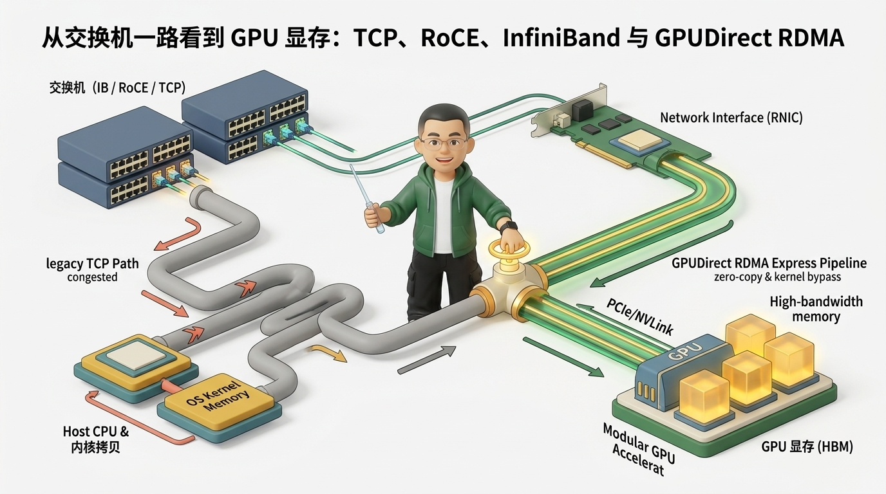
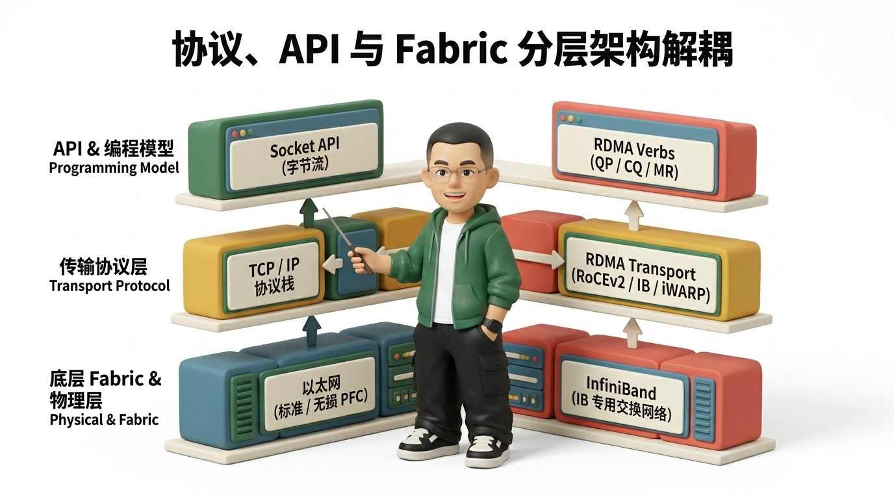
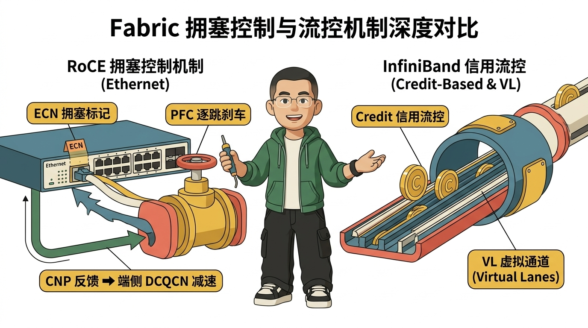
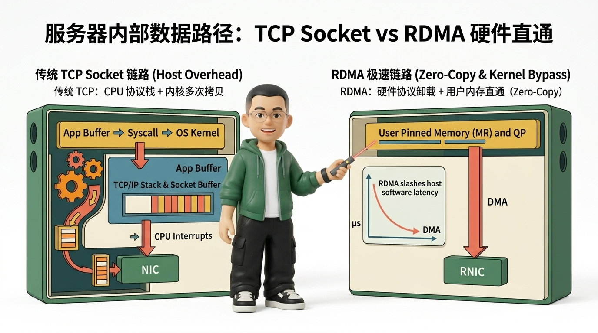
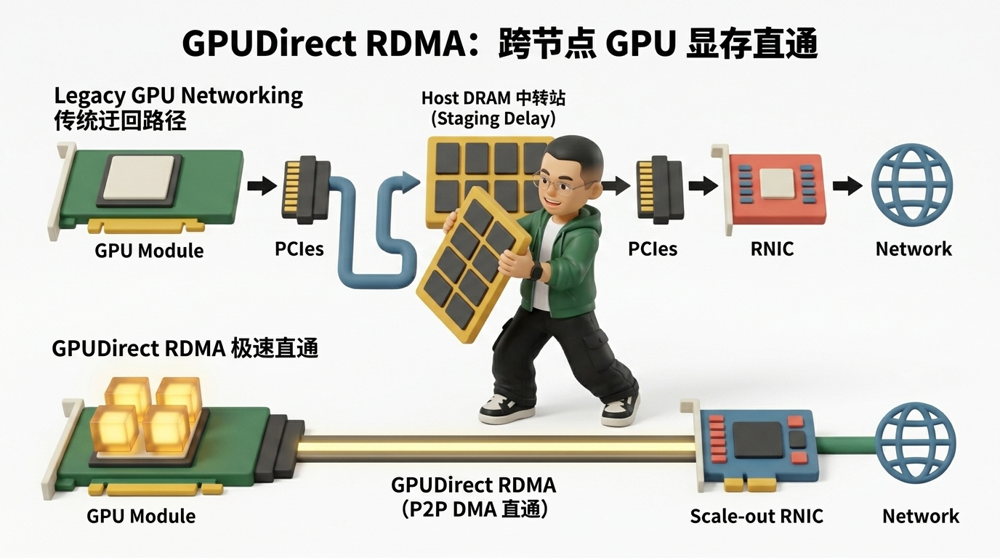
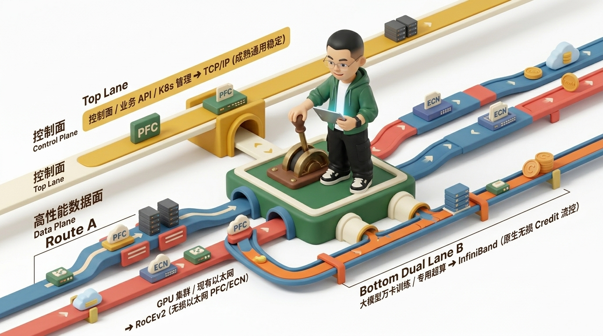

# 别再把 RDMA 当成一根更快的网线：从交换机一路看到 GPU 显存

**作者：Ringi ｜ 云原生与 AI 基础设施探索者**

---


*图 0｜从交换机一路看到 GPU 显存：TCP、RoCE、InfiniBand 与 GPUDirect RDMA 全景数据路径*

---

## 💡 如果只记“RDMA 比 TCP 快”，后面一定会乱

我更喜欢从机房里的两台交换机开始讲这件事。左边是一台跑 RoCE 的 **Ethernet Switch**，右边是一台 **InfiniBand Switch**。正常流量下，两边都能把包转得极快；真正能看出性格差异的，是几百张 GPU 同时往同一个方向发起 AllReduce 通信、交换机出口队列瞬间堆起来的时候。

这时核心问题就不再是“端口是 400G 还是 800G”，而是：
- **谁先发现拥塞？**
- **谁给端点反馈？**
- **谁执行减速？**
- **谁在底层暂停上游？**
- **谁负责硬件重传与路径重选？**

把这条主线捋顺，`TCP`、`RDMA`、`RoCE`、`InfiniBand`、`PFC`、`ECN`、`QP`、`MR` 和 `GPUDirect RDMA` 就不会再是一串散乱的英文缩写。

> **⚠️ Ringi 的架构判断第一准则**
> **不要问“谁更快”，先问“数据到底经过了谁的内存与总线，拥塞时又是谁在做硬件决策”。**

---

## 一、先把概念放回正确的层级

最常见的误区，是把 `TCP`、`RDMA`、`RoCE` 和 `InfiniBand` 摆在同一张扁平表格里进行横向对比。**它们并不在同一个抽象层级。**

- **API 与编程模型层**：
  - `Socket`：面向连接的可靠字节流抽象，发送端把字节流交给协议栈，接收端按顺序读取。
  - `RDMA Verbs`：面向远程内存访问的硬件语义，应用预先注册 `Memory Region (MR)`，创建 `Queue Pair (QP)`，直接提交 `SEND`、`RDMA READ`、`RDMA WRITE` 或 `CAS` 等硬件 Work Request。
- **传输协议层 (Transport)**：
  - `TCP/IP`：运行在 CPU 与操作系统内核中的复杂软件协议栈。
  - `RDMA Transport`：硬件卸载的传输协议（RC / UC / UD），可承载于 InfiniBand 专有物理层，也可通过 `RoCEv2` 封装于 UDP/IP 进而跨三层路由，甚至可通过 `iWARP` 承载于 TCP 之上。因此 **“RDMA = InfiniBand” 从概念上根本不成立**。
- **底层 Fabric 与物理网络层**：
  - `Ethernet`：标准以太网 / 无损以太网（开启 PFC / ECN）。
  - `InfiniBand`：原生为超算与 AI 设计的专有无损互连网络。


*图 1｜先把协议、API 与 Fabric 分层解耦，否则后续的性能与架构比较都会串层*

> **📝 Ringi Note：核心解耦认知**
> - **TCP vs RDMA**：本质是 **“Host 数据路径、CPU 介入度与传输语义”** 的比较；
> - **Ethernet vs InfiniBand**：本质是 **“网络 Fabric 体系与物理流控哲学”** 的比较。

---

## 二、拥塞时，两种 Fabric 才真正露出差别

假设 4 台 GPU Server 同时向同一个目标节点灌入 AllGather 数据。入口瞬时流量叠加达到 `4 × 400G = 1.6Tbps`，而目标交换机出口只有 `1 × 400G`。在这个场景里没有任何物理设备能违背数学定律：**队列一定会增长**。

真正的架构分水岭在于：**队列增长到什么程度开始动作？由谁来动作？**

### 1. 经典 RoCEv2 Fabric（反应式拥塞治理闭环）
在以太网跑 RoCE 时，`ECN` 与 `PFC` 经常搭配出现，但两者的职责分工截然不同：
- **ECN（显式拥塞通知，长期节流）**：
  - 交换机检测到出口队列超过 `ECN 阈值`，在 IP 头部的 ECN 字段打上拥塞标记。
  - 接收端 RNIC 收到标记包后，生成 `CNP (Congestion Notification Packet)` 反向通知源端。
  - 源端 RNIC 通过 `DCQCN (Data Center QCN)` 算法主动调低发包速率。它解决的是 **“长期别再这么猛烈地注入流量”**。
- **PFC（基于优先级的逐跳流控，紧急刹车）**：
  - PFC 是 Hop-by-Hop 的二层硬件暂停机制。当下游 Buffer 即将溢出时，向下游相邻交换机发送 Pause 帧，暂停指定 Priority 队列的发送。
  - **代价与风险**：PFC 可以有效防止瞬时丢包，但 Pause 帧会沿树状拓扑逐跳向上游蔓延，配置不当极易引发 **Head-of-Line Blocking（队头阻塞）** 甚至 **PFC 死锁**。

> **💡 演进趋势**
> 现代超大规模生产环境 RoCE 正在由重度依赖 PFC 向 **PFC-less / Lossy RoCE**（如依靠精准快速的端侧 RTT / 硬件 Telemetry 拥塞算法与选择性重传）演进。

### 2. InfiniBand Fabric（预防式信用流控体系）
InfiniBand 的底层逻辑从一开始就截然不同：
- **Credit-Based 链路流控**：发送端在发包前必须先持有接收端发布的可用 Buffer 信用额度（Credit）。有 Credit 才能发，无 Credit 则直接阻塞在本地。
- **Virtual Lanes (VL) 硬件隔离**：结合 Subnet Manager、LID 路由与独立 VL，从协议栈物理层保障原生无损，不存在以太网复杂的跨层协议拼凑。


*图 2｜RoCE 依赖“ECN 拥塞标记 + PFC 逐跳刹车 + 端侧 DCQCN 减速”的反应式闭环；IB 则是基于“Credit 令牌 + VL 隔离”的预防式流控*

---

## 三、TCP 和 RDMA 的差距，更多发生在服务器内部

把镜头从交换机拉回服务器 Host 内部，才是理解 TCP 与 RDMA 性能鸿沟的根本所在。

### 1. 传统 TCP Socket 路径（软件协议栈开销）
传统 Socket 通信必须深度穿越内核 TCP/IP 栈：
```text
App Buffer ➔ Syscall ➔ OS Kernel (TCP/IP 栈 & Socket Buffer) ➔ CPU 硬/软中断 ➔ NIC
```
- **核心瓶颈**：每次 I/O 都伴随用户态与内核态切换（Syscall）、复杂的序列号/ACK 处理、多层 Buffer 拷贝以及 CPU 协议栈消耗。当网络迈入 400Gbps/800Gbps 时代，**Host CPU 会被网络协议栈直接吃满（CPU Bottleneck）**。
- **专业事实澄清**：现代 Linux 拥有 TSO/GSO/GRO、`MSG_ZEROCOPY`、`sendfile` 等优化，TCP 并不等于“协议层强制多次内存拷贝”，而是其 **Host 软件处理路径与上下文开销显著更重**。

### 2. RDMA Verbs 极速直通（硬件卸载与远程内存语义）
RDMA 采用软硬件协同的激进优化：
```text
User Pinned Memory (MR) ➔ Queue Pair (QP/CQ) ➔ RNIC 硬件直接 DMA ➔ Remote Memory
```
1. **Zero-Copy（零拷贝）**：RNIC 硬件直接对用户注册内存（Pinned MR）发起 DMA，彻底消除中间缓冲区搬运；
2. **Steady-State Kernel Bypass（稳态绕过内核）**：建立连接后，数据面的 Work Request 提交与 Doorbell 敲击全部在用户态完成，绕过内核；
3. **Protocol Offload（硬件协议卸载）**：分片、CRC、ACK、重传等传输逻辑全部下沉由 RNIC ASIC 芯片完成；
4. **Remote Memory 语义**：`RDMA WRITE` 可直接将本地数据写入远端已授权的物理内存地址，无需远端 CPU 执行 `recv()` 或感知应用上下文。


*图 3｜TCP 与 RDMA 的关键差异：不仅在于拷贝次数，更在于稳态 Host 数据路径的长度与 CPU 卸载深度*

---

## 四、到了 GPU 集群，Host DRAM 可能就是那一站“绕路”

在分布式大模型训练（如 Megatron-LM、DeepSeek 的 AllReduce、TP/PP/EP 通信）中，核心张量数据天然驻留在 **GPU 显存（HBM）** 中。

### 1. 传统跨节点 GPU 通信（Host DRAM 多重中转）
在没有 GPUDirect 的时代，跨节点 GPU 数据流动必须经过痛苦的辗转搬运：
```text
GPU HBM ➔ PCIe ➔ Host DRAM 中转 ➔ PCIe ➔ RNIC ➔ 交换网络 ➔ 对端 RNIC ➔ 对端 Host DRAM ➔ PCIe ➔ 对端 GPU HBM
```
这种漫长的 Staging 极大地消耗了主机内存带宽和 PCIe 总线带宽，导致大模型训练在通信同步阶段产生严重的 GPU 流水线气泡（GPU Bubbles）。

### 2. GPUDirect RDMA（PCIe Peer-to-Peer 显存直通）
GPUDirect RDMA 借助 PCIe Peer-to-Peer (P2P) DMA 技术，彻底打通了网卡与显存的直通大道：
```text
GPU HBM ➔ PCIe Switch 直接 P2P DMA ➔ RNIC ➔ 高速 Fabric ➔ 对端 RNIC ➔ 对端 GPU HBM
```
- **核心收益**：完全绕过 Host CPU 和主机内存（Host DRAM），跨节点通信延迟从几十微秒压降至 **< 2~5 μs**，为万卡集群提供了近乎线性的扩展加速比。
- **架构澄清**：跨节点 GPU 到网卡的主干路径建立在 **PCIe Switch / Root Complex** 之上；而 **NVLink / NVSwitch** 主要解决单节点内（Scale-Up）多卡之间的高速互连，不能将所有 GPU 到 RNIC 的路径混为一谈。


*图 4｜GPUDirect RDMA 的核心价值：让 GPU HBM 显存与 Scale-out 网络网卡直接贯通，彻底消除 Host DRAM 中转瓶颈*

---

## 五、工业级技术选型：控制面与数据面解耦

架构设计中最忌讳“技术教条主义”——**RDMA 性能优异，绝不意味着要在所有场景消灭 TCP**。

### 📊 核心多维决策矩阵

| 评估维度 | 传统 TCP / IP | RoCEv2 (无损以太网) | InfiniBand (IB) |
| :--- | :--- | :--- | :--- |
| **典型定位** | **控制面、微服务、API 通信** | **大规模 AI / 存储数据面 (以太网生态)** | **极致超算 / 万卡 AI 专用集群** |
| **Fabric 基础** | 普通以太网，广泛兼容 | 标准/无损以太网，需精调 PFC/ECN | 专用 IB 交换机、专用线缆与网卡 |
| **流控机制** | 丢包重传、窗口慢启动 | DCQCN 拥塞标记 + PFC 逐跳刹车 | 原生 Credit 信用流控 + VL 虚拟通道 |
| **CPU 占用** | 较高（协议栈与系统调用开销） | 极低（RNIC 硬件协议卸载） | 极低（HCA 硬件协议卸载） |
| **GPUDirect** | 较难支持，通常需 Host 中转 | 原生支持 GPUDirect RDMA | 原生支持 GPUDirect RDMA |
| **运维与调试** | 工具极成熟（tcpdump/Wireshark） | 需掌握 QoS、RoCE 丢包与拥塞排障 | 依赖专用 IB Subnet Manager 与诊断工具 |
| **总体 TCO** | 最低，复用现有网络资产 | 硬件成本较低，运维调优门槛较高 | 采购与专属配件成本较高，交付即高效 |


*图 5｜成熟生产架构的选型哲学：控制面稳健复用 TCP/IP，高性能数据面按生态与成本权衡选择 RoCEv2 或 InfiniBand*

> **💡 Ringi 的生产级落地建议**
> 1. **控制面与通用业务**（K8s 调度、REST API、Metrics、分布式存储元数据）：坚决使用 **TCP/IP**，成熟、容错强、调试极简；
> 2. **已有大型以太网基础设施的 AI/存储集群**：采用 **RoCEv2**，精细化打磨 PFC/ECN/DCQCN 阈值监控体系；
> 3. **新建万卡大模型训练集群 / 超算中心**：若追求开箱即得的极致稳定低延迟与无损通信，**InfiniBand** 依然是确定性最强的架构选择。

---

## 六、如果面试官只给你两分钟（通关口诀）

> **💬 阿里 P8 架构师标准通关作答**
> “我不会把 TCP 和 RDMA 简单当成两个速度不同的同层协议。
> 
> **TCP** 是基于内核协议栈的可靠字节流传输；而 **RDMA** 是一种硬件远程内存访问能力，可由 InfiniBand、RoCEv2 甚至 iWARP 承载。
> 
> - **在 Fabric 层面**：RoCEv2 运行在以太网上，通过 **ECN 标记、CNP 反馈、PFC 刹车与端侧 DCQCN** 形成拥塞闭环；InfiniBand 则是原生面向 HPC/AI 的专用 Fabric，采用 **Credit 信用令牌与 Virtual Lanes** 实现硬件无损。
> - **在 Host 内部**：TCP 受制于内核协议栈与多次上下文处理；RDMA 依靠 **Zero-Copy、Kernel Bypass 和 Protocol Offload** 实现微秒级直通。
> - **在 GPU 集群中**：结合 **GPUDirect RDMA**，RNIC 能够通过 PCIe P2P 直接读写 GPU 显存，彻底消除 Host DRAM 的中转损耗。
> 
> 最终的工业级架构绝非盲目替换，而是**控制面稳守 TCP，数据面按场景与生态拥抱 RDMA**。”

---

## 结尾：真正该记住的是“整条数据路径”

网络知识最容易学歪的地方，就是背了一堆零散的协议缩写，却从未在脑海里画出数据包走过的物理路径。

只要你能从 **GPU HBM 显存** 一路推演到 **PCIe Switch ➔ RNIC ➔ Leaf 交换机 ➔ Spine 交换机 ➔ 远端 RNIC ➔ 远端 GPU 显存**，所有的协议差异与架构权衡都会不言自明。

> **⚠️ Ringi 终局心法**
> **TCP 的核心是“可靠地把字节交给远端进程”；RDMA 的核心是“让网卡硬件直接参与两台机器之间的内存搬运”。**

---

### 📌 技术边界与严谨声明
1. **RDMA ≠ InfiniBand**：RDMA 是传输与数据路径能力，InfiniBand 是其经典承载网络之一。
2. **RoCEv2 ≠ 必须 PFC**：传统生产依赖 PFC+ECN，现代架构正在探索 PFC-less 与选择性重传以太网。
3. **TCP 亦有 Zero-Copy**：现代 Linux 内核支持多种零拷贝与 NIC Offload 技术，区分核心在于稳态 Host 开销与直接内存语义。
4. **GPUDirect 核心总线**：跨节点 GPU 到网卡数据面以 **PCIe Peer-to-Peer** 为核心基石，NVLink 则专注节点内 Scale-up 拓扑。

---

### 📚 权威参考与延伸阅读（References）

1. **IBTA 官方规范**：*InfiniBand Architecture Specification & Supplement to InfiniBand Architecture Specification Volume 1 Release 1.2.1 (RoCEv2)*, InfiniBand Trade Association (IBTA).
2. **DCQCN 拥塞控制经典论文**：Zhu, Y., Eran, H., Firestone, D., Guo, C., Lipshteyn, M., Liron, Y., ... & Zhang, M. (SIGCOMM 2015). *"Congestion Control for Large-Scale RDMA Deployments."* ACM SIGCOMM Computer Communication Review.
3. **PFC 与无损以太网标准**：IEEE Standards Association. *IEEE 802.1Qbb: Priority-based Flow Control (PFC)*.
4. **NVIDIA 官方白皮书**：*NVIDIA GPUDirect RDMA Architecture & Programming Guide*, NVIDIA Developer Documentation.
5. **NCCL 深度学习通信架构**：*NVIDIA Collective Communications Library (NCCL) Developer Guide*, NVIDIA Docs.
6. **IETF 标准规范**：Ramakrishnan, K., Floyd, S., & Black, D. (RFC 3168). *"The Addition of Explicit Congestion Notification (ECN) to IP"*.
7. **现代 Linux 内核网络栈与 RDMA**：Linux Kernel Documentation. *"InfiniBand/RDMA Subsystem & Memory Registration (MR) Internals"*.
8. **大规模工业界超算落地实践**：Meta Engineering & Alibaba Cloud. *"RoCEv2 & RDMA at Scale in Hyperscale AI Datacenters"*.

---

### 关于作者：Ringi

**做对的事情，把事情做对！（Do the right things, do things right.）**

**Ringi（lilinji）** ｜GeneTind ｜ ☸️ CNCF Ambassador ｜ 🐳 Docker Captain ｜ ☁️ AWS 云架构师 ｜ 🥑 DevRel & Product Evangelist

专注云原生与 AI 基础设施、大模型分布式算力调度、K8s 系统工程与 AI Agent 知识工作流。用极客精神做人人都能用好的 AI 工具。

- 🌐 个人博客：[lilinji.github.io](https://lilinji.github.io)
- 🐦 X (Twitter)：[@golucklee](https://x.com/golucklee)
- 💡 知乎：[@li-lin-ji-99](https://www.zhihu.com/people/li-lin-ji-99)
- 💻 GitHub：[@lilinji](https://github.com/lilinji)


