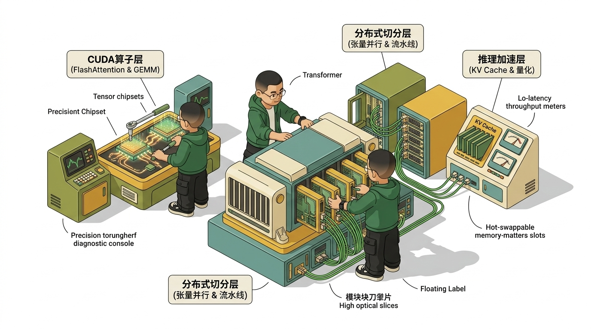
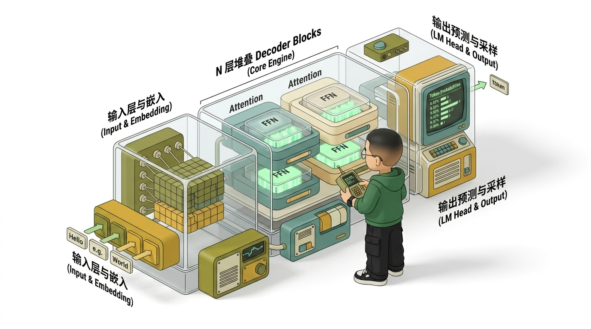
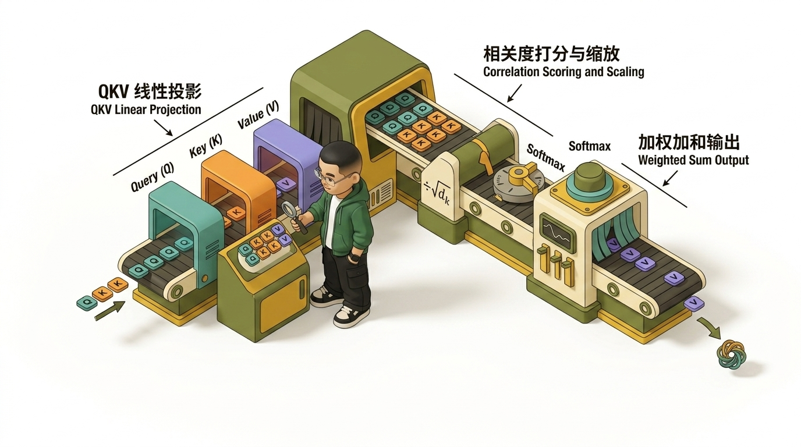
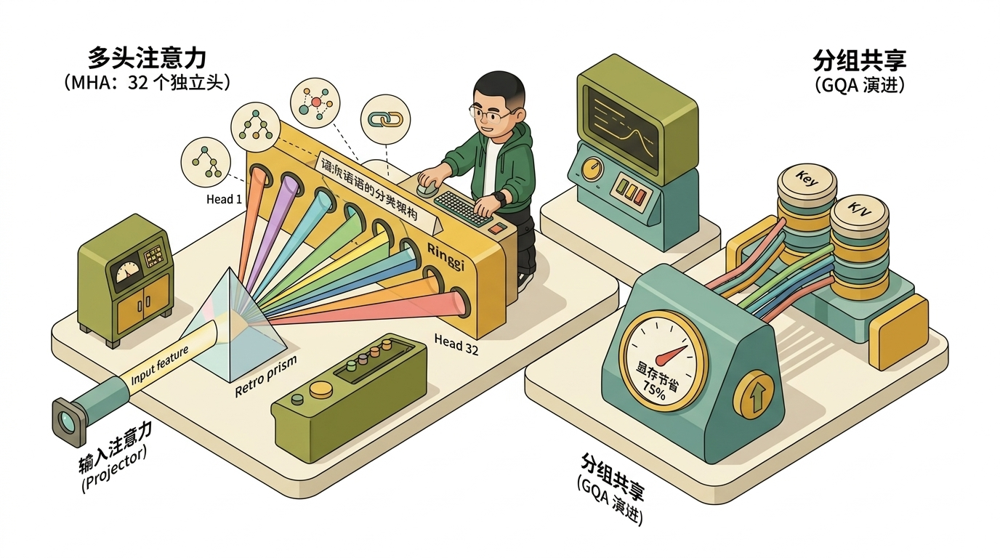
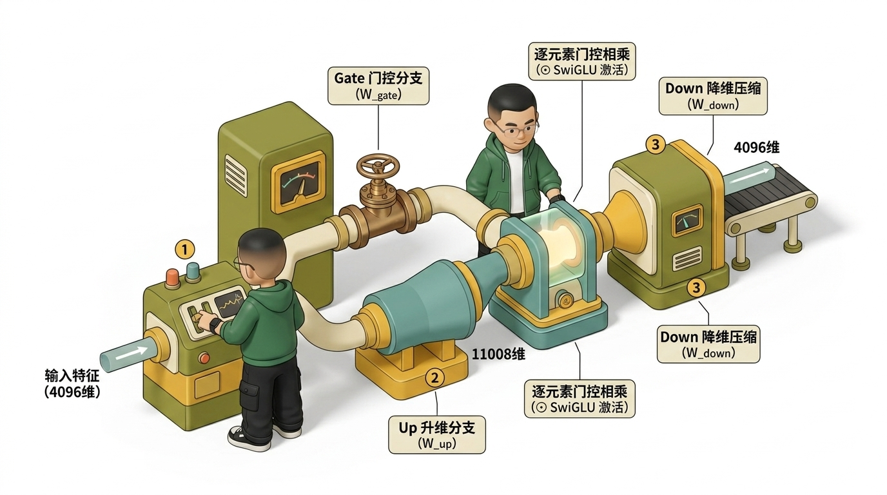
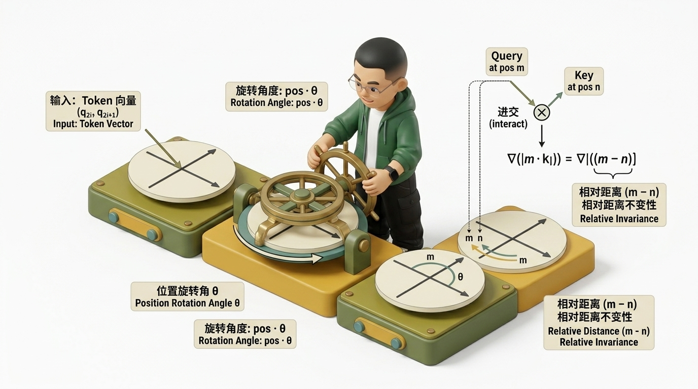
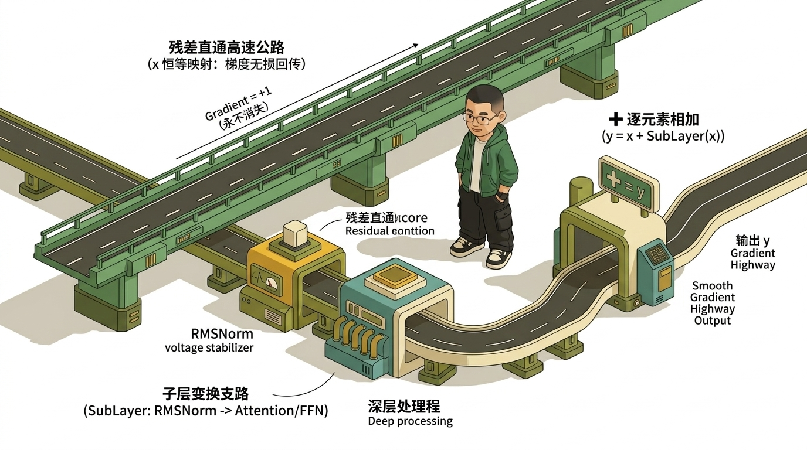
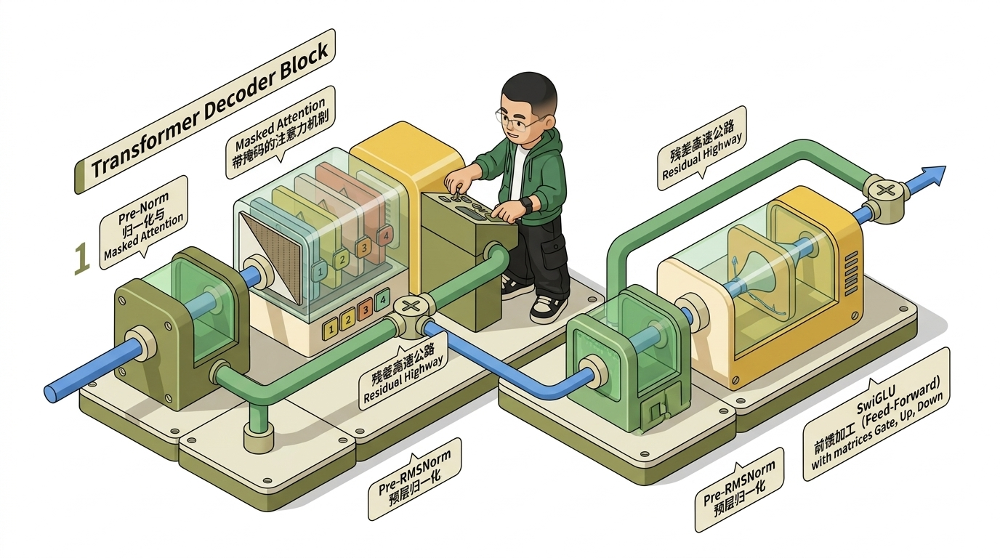
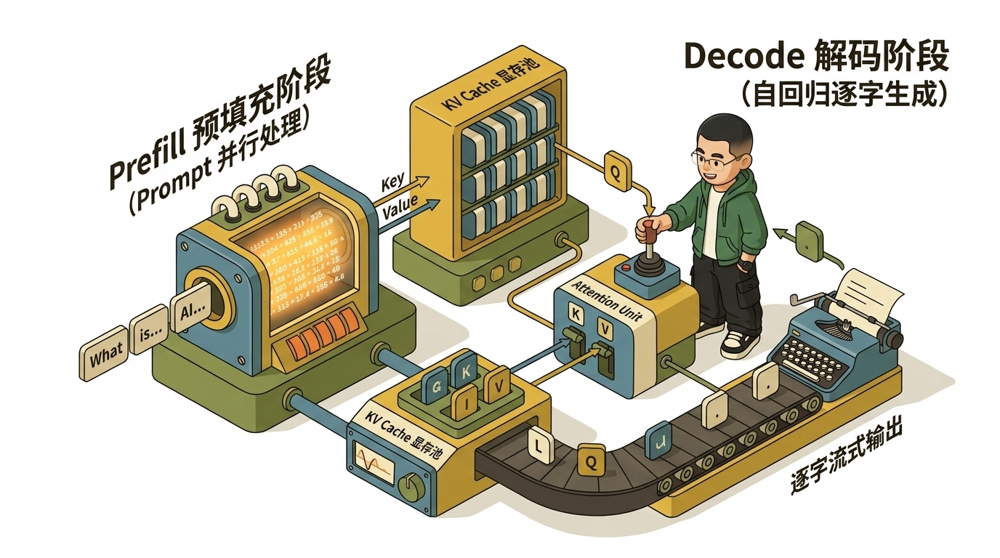

# 🚀 AI Infra 大话西游实战之Transformer小白学习笔记（一）

> **Google 大神 × 👓 Ringi 导学版（公式全兼容 / 小白友好 / AI Infra 实战贯通）**
>
> 📌 **导读寄语**：
> 学习 Transformer 不是为了死记硬背公式，而是要建立清晰的**数据流动直觉**与**硬件执行心智模型**。
> 本笔记以 Google 大神的第一性原理视角，结合极客导师 **Ringi** 的手办级 3D 架构工坊插图，把每个公式、每个张量形状（Shape）以及后续在 CUDA / 分布式训练 / vLLM 推理中的对应关系彻底讲透！

---

## 📑 目录导航

- [1. 为什么 AI Infra 工程师必须懂 Transformer](#1-为什么-ai-infra-工程师必须懂-transformer)
  - [1.1 汽车发动机比喻](#11-汽车发动机比喻)
  - [1.2 AI Infra 各层级与 Transformer 模块映射全景](#12-ai-infra-各层级与-transformer-模块映射全景)
- [2. Transformer 网络结构全貌](#2-transformer-网络结构全貌)
  - [2.1 原始 Transformer：Encoder-Decoder 架构](#21-原始-transformerencoder-decoder-架构)
  - [2.2 当前大模型王者：Decoder-only 架构](#22-当前大模型王者decoder-only-架构)
  - [2.3 三大架构变体对比与演进逻辑](#23-三大架构变体对比与演进逻辑)
- [3. Self-Attention 机制（核心引擎）](#3-self-attention-机制核心引擎)
  - [3.1 直觉理解：图书馆查资料与信息加权聚合](#31-直觉理解图书馆查资料与信息加权聚合)
  - [3.2 Q、K、V 的物理意义：同一个 Token 的三副眼镜](#32-qkv-的物理意义同一个-token-的三副眼镜)
  - [3.3 逐步拆解完整计算流程（6 步推导 + 数值小算盘）](#33-逐步拆解完整计算流程6-步推导--数值小算盘)
  - [3.4 为什么复杂度是 <span class="math">\(O(N^2)\)</span>？长上下文之痛](#34-为什么复杂度是-on2长上下文之痛)
  - [3.5 Multi-Head Attention：为什么要多头？](#35-multi-head-attention为什么要多头)
  - [3.6 MHA → MQA → GQA 的演进直觉](#36-mha--mqa--gqa-的演进直觉)
- [4. 前馈网络（FFN）——深度加工厂](#4-前馈网络ffn深度加工厂)
  - [4.1 角色分工：Attention 负责开会，FFN 负责独立吸收](#41-角色分工attention-负责开会ffn-负责独立吸收)
  - [4.2 结构解析：为什么先升维再降维？](#42-结构解析为什么先升维再降维)
  - [4.3 参数量分析：为什么 FFN 占了模型 2/3 的参数？](#43-参数量分析为什么-ffn-占了模型-23-的参数)
  - [4.4 激活函数演进：ReLU → GELU → SwiGLU](#44-激活函数演进relu--gelu--swiglu)
- [5. 位置编码（Position Encoding）——赋予序列时空感](#5-位置编码position-encoding赋予序列时空感)
  - [5.1 为什么 Transformer 天生是个“词序脸盲”？](#51-为什么-transformer-天生是个词序脸盲)
  - [5.2 经典方案：Sinusoidal 正余弦位置编码](#52-经典方案sinusoidal-正余弦位置编码)
  - [5.3 大模型霸主：RoPE（旋转位置编码）的几何魔术](#53-大模型霸主rope旋转位置编码的几何魔术)
- [6. LayerNorm 与残差连接——深层训练的定海神针](#6-layernorm-与残差连接深层训练的定海神针)
  - [6.1 残差连接（Residual Connection）：梯度高速公路](#61-残差连接residual-connection梯度高速公路)
  - [6.2 LayerNorm：特征维度的信号调节器](#62-layernorm特征维度的信号调节器)
  - [6.3 Pre-Norm vs Post-Norm：数十亿美元训练稳定性之争](#63-pre-norm-vs-post-norm数十亿美元训练稳定性之争)
- [7. 完整的 Transformer Decoder Block 组装与参数手算](#7-完整的-transformer-decoder-block-组装与参数手算)
  - [7.1 Pre-Norm Decoder Block 完整数据流与因果掩码](#71-pre-norm-decoder-block-完整数据流与因果掩码)
  - [7.2 LLaMA-2-7B 全流程张量维度追踪（Shape 追踪表）](#72-llama-2-7b-全流程张量维度追踪shape-追踪表)
  - [7.3 参数量白板手算：7B 参数都花在了哪里？](#73-参数量白板手算7b-参数都花在了哪里)
  - [7.4 静态与动态显存规划公式（AI Infra 必背）](#74-静态与动态显存规划公式ai-infra-必背)
- [8. 从 Transformer 到 LLM：自回归生成与推理加速](#8-从-transformer-到-llm自回归生成与推理加速)
  - [8.1 自回归生成（Autoregressive）：一次吐一个 Token](#81-自回归生成autoregressive一次吐一个-token)
  - [8.2 Prefill 与 Decode 两阶段：算力受限 vs 带宽受限](#82-prefill-与-decode-两阶段算力受限-vs-带宽受限)
  - [8.3 KV Cache 的由来与计算量优化](#83-kv-cache-的由来与计算量优化)
  - [8.4 KV Cache 显存开销与现代推理系统（PagedAttention）](#84-kv-cache-显存开销与现代推理系统pagedattention)
- [9. 终极大复习与极客速记口诀](#9-终极大复习与极客速记口诀)
- [10. Google 大神 × Ringi 检验清单与进阶路线](#10-google-大神--ringi-检验清单与进阶路线)

---

# 1. 为什么 AI Infra 工程师必须懂 Transformer

```
                ┌─────────────────────────────────────────┐
                │          👓 Ringi 极客小剧场             │
                │ "不懂 Transformer 架构去写 CUDA Kernel， │
                │  就像闭着眼睛去给 F1 赛车调校发动机！"   │
                └─────────────────────────────────────────┘
```

## 1.1 汽车发动机比喻

如果你准备深入 **AI Infra**（AI 基础设施）——无论是在底层写 CUDA C++ 算子、在集群搞 Megatron-LM / DeepSpeed 分布式训练，还是在 vLLM / TensorRT-LLM 搞高性能推理服务——你天天面对的核心工作对象都是同一个东西：**Transformer 模型**。

这就像汽车赛车工程师必须懂发动机结构一样：
- 你不需要自己从头画机械草图（那是算法研究员 / 架构师的活）；
- 但你必须清楚知道**曲轴在哪里、活塞怎么往复运动、喷油嘴怎么供油**——否则你根本不知道哪个环节卡住了吞吐，该去优化哪个部件！

---

## 1.2 AI Infra 各层级与 Transformer 模块映射全景



AI Infra 的每一项核心优化技术，都直接精确对应 Transformer 的某一个数学算子或物理结构：

### 映射关系速查表

| AI Infra 层级 | 核心工程任务 | 对应的 Transformer 模块与物理本质 |
| :--- | :--- | :--- |
| **CUDA 算子优化** | FlashAttention-1/2/3、高效 GEMM 优化 | Self-Attention 中的 \(Q K^T\) 与 \(P V\) 大矩阵乘法 |
| **CUDA 算子优化** | Fused Softmax、Online Softmax | Attention 中的指数求和与归一化算子 |
| **CUDA 算子优化** | LayerNorm / RMSNorm 算子融合 | 每个 Block 输入与输出处的归一化操作 |
| **分布式训练** | 张量并行（Tensor Parallelism） | Attention 的多头（Multi-Head）切分与 FFN 的矩阵列/行切分 |
| **分布式训练** | 流水线并行（Pipeline Parallelism） | 模型中 \(N\) 层 Decoder Block 的逐层跨卡堆叠 |
| **分布式训练** | ZeRO / FSDP 显存分片 | 所有可学习参数矩阵（\(W_Q, W_K, W_V, W_O, W_{gate}, W_{up}, W_{down}\)）的存储与通信 |
| **推理部署加速** | KV Cache 显存管理（PagedAttention） | Self-Attention 中每一轮迭代缓存的 \(K, V\) 矩阵 |
| **推理部署加速** | 模型量化（INT8 / FP8 / INT4） | 权重矩阵与 KV Cache 的位宽压缩 |
| **系统架构调度** | Prefill / Decode 解耦调度（DistServe/Splitwise） | 自回归生成两阶段（Compute Bound vs Memory Bound）特性差异 |

> 💡 **Ringi 划重点**：
> **“不懂 Transformer，就不知道自己在优化什么。”** 后续在工程中遇到的每一个优化算法，都能在本文中找到它作用的具象代码行与数学公式。

---

# 2. Transformer 网络结构全貌

在深入每个矩阵乘法之前，我们先站在 Google 架构师的高度俯瞰整体蓝图。

## 2.1 原始 Transformer：Encoder-Decoder 架构

2017 年 Google 经典论文 _《Attention Is All You Need》_ 提出的原始结构由两部分组成：

- **Encoder**：全向双向注意力（每个 token 都可以看到整句话的所有 token），主要负责**阅读理解**。
- **Decoder**：带因果掩码的注意力（不能看未来的词）+ 交叉注意力（Cross-Attention，向 Encoder 索要信息），负责**自回归生成**。

---

## 2.2 当前大模型王者：Decoder-only 架构

GPT 系列（以及后来的 LLaMA、Mistral、Qwen、DeepSeek 等）证明了一个震撼业界的结论：
**根本不需要 Encoder 和 Cross-Attention，只用 Decoder 就足够解决人类所有语言任务！**

当前主流 LLM 结构采用极度优雅的**三段式**：



### 经典三段式数据流动流程：
1. **输入阶段（Input Stage）**：
<div class="math">$$
   \text{Prompt Tokens} \longrightarrow \text{Token Embedding (词表查找)} \longrightarrow \text{注入位置编码 (如 RoPE)}
$$</div>
2. **核心堆叠阶段（Repeated N Blocks）**：
<div class="math">$$
   X_{l+1} = X_l + \text{Self-Attention}(\text{Norm}(X_l)) + \text{FFN}(\text{Norm}(\dots))
$$</div>
3. **输出阶段（Output Stage）**：
<div class="math">$$
   \text{Final Norm} \longrightarrow \text{LM Head 线性映射} \longrightarrow \text{Softmax 采样} \longrightarrow \text{预测下一个 Token}
$$</div>

---

## 2.3 三大架构变体对比与演进逻辑

| 架构类型 | 代表模型 | 注意力可见机制 | 典型应用领域 | 优缺点分析 |
| :--- | :--- | :--- | :--- | :--- |
| **Encoder-only** | BERT, RoBERTa | **双向注意力**（每个 token 看全句） | 文本分类、实体识别、语义检索 | 擅长理解，但无法自然做长文本自回归生成 |
| **Encoder-Decoder** | 原始 Transformer, T5, BART | **Encoder 双向 + Decoder 因果 + Cross-Attn** | 机器翻译、文本摘要生成 | 架构复杂，推理时需维护两套 KV 缓存，工程沉重 |
| **Decoder-only** | GPT-4, LLaMA, Qwen, DeepSeek | **因果注意力**（只允许看当前和前面的词） | 对话、代码生成、所有生成式任务 | **统一训练目标（Next-token 预测）+ 极致工程简洁度** |

> 💡 **Ringi 导师解惑**：
> 为什么 Decoder-only 能统治整个大模型时代？
> 
> 1. **万物皆可 Next-Token Prediction**：翻译、推理、写代码、甚至图像多模态，全部统一为自回归预测，不需要为不同任务换模型架构。
> 2. **工程部署极致高效**：全模型只有一种标准的 Decoder Block，显存分配、KV Cache 调度、张量并行通信模式整齐划一。

---

# 3. Self-Attention 机制（核心引擎）

Self-Attention 是 Transformer 的心脏，也是算力与显存消耗最密集的重灾区。

## 3.1 直觉理解：图书馆查资料与信息加权聚合

<div class="math">$$
\boxed{\text{算谁重要（注意力权重）} \longrightarrow \text{按重要程度加权拿取信息}}
$$</div>

先建立一个小白直觉：**Attention 就是让句子里的每个词去“关注”其他所有词，然后按关注度加权打包信息。**

举个例子：句子为 `小明 喜欢 吃 苹果`。
当模型处理 `吃` 这个动作时：
- 它需要知道“谁在吃”（小明，占 10% 注意力）；
- “吃什么”（苹果，占 70% 注意力）；
- 最终 `吃` 这个词更新后的特征向量为：
<div class="math">$$
  \text{New\_Feature}_{\text{吃}} = 0.1 \times \text{小明} + 0.1 \times \text{喜欢} + 0.1 \times \text{吃} + 0.7 \times \text{苹果}
$$</div>

---

## 3.2 Q、K、V 的物理意义：同一个 Token 的三副眼镜

在 Self-Attention 中，每个 token 都会通过三组不同的投影矩阵，同时拥有三个身份：



- **Query (<span class="math">\(Q\)</span>)**：提问者，发出检索需求（*“我是‘吃’，我在找什么宾语？”*）；
- **Key (<span class="math">\(K\)</span>)**：索引标牌，用于和别人的 Query 匹配（*“我是‘苹果’，我是可食用水果”*）；
- **Value (<span class="math">\(V\)</span>)**：真正的内容载荷，匹配成功后贡献给别人（*“提供苹果的完整语义特征”*）。

> 📌 **核心口诀**：
> 
> <div class="math">$$\boxed{Q \text{ 与 } K \text{ 点积决定【关注比例】，} V \text{ 决定【真正带走什么信息】}}$$</div>

---

## 3.3 逐步拆解完整计算流程（6 步推导 + 数值小算盘）

假设输入序列有 <span class="math">\(N\)</span> 个 token，隐藏层维度为 <span class="math">\(d\)</span>（即输入矩阵 <span class="math">\(X \in \mathbb{R}^{N \times d}\)</span>）。

### 步骤 1：线性投影生成 <span class="math">\(Q, K, V\)</span>
<div class="math">$$
Q = X W_Q, \quad K = X W_K, \quad V = X W_V
$$</div>
其中 <span class="math">\(X \in \mathbb{R}^{N \times d}\)</span>，<span class="math">\(W_Q, W_K, W_V \in \mathbb{R}^{d \times d}\)</span>，输出的 <span class="math">\(Q, K, V\)</span> 形状均为 <span class="math">\((N, d)\)</span>。
> 🛠️ **AI Infra 视点**：这是 3 次标准的 GEMM（通用矩阵乘法）操作，Tensor Core 的绝对主场。

---

### 步骤 2：计算注意力原始分数（<span class="math">\(Q K^T\)</span>）
衡量每对 token 之间的相关程度：
<div class="math">$$
S = Q K^T \in \mathbb{R}^{N \times N}
$$</div>
<span class="math">\(S[i][j]\)</span> 表示第 <span class="math">\(i\)</span> 个 token 对第 <span class="math">\(j\)</span> 个 token 的原始打分。

_小白极简数值推导_：
若 <span class="math">\(q = [1, 2]\)</span>，<span class="math">\(k = [3, 4]\)</span>，则：
<div class="math">$$
q \cdot k^T = 1 \times 3 + 2 \times 4 = 11
$$</div>
点积数值越大，说明两个向量的方向越接近、语义越相关。

---

### 步骤 3：缩放（Scale）——为什么要除以 <span class="math">\(\sqrt{d_k}\)</span>？
<div class="math">$$
S_{\text{scaled}} = \frac{Q K^T}{\sqrt{d_k}}
$$</div>
> 👓 **Ringi 划重点（公式兼容与原理解析）**：
> 当维度 <span class="math">\(d_k\)</span> 很大时（例如 <span class="math">\(d_k = 128\)</span>），<span class="math">\(Q\)</span> 和 <span class="math">\(K\)</span> 的点积相当于 128 个独立分量相乘求和，方差会放大到 <span class="math">\(d_k\)</span>。
> 这会导致点积数值极其巨大（比如上百），送入 Softmax 后输出会被“推向饱和区”——最大值变成 1，其他全变成 0，**梯度几乎完全消失（Gradient Vanishing）**！
> 除以 <span class="math">\(\sqrt{d_k}\)</span> 就像给分数**“装上降温空调”**，把方差拉回到 1，保证反向传播梯度通畅。

---

### 步骤 4：Softmax 归一化（原始分数变注意力比例）
<div class="math">$$
A = \text{softmax}(S_{\text{scaled}}) \in \mathbb{R}^{N \times N}
$$</div>
对 <span class="math">\(S_{\text{scaled}}\)</span> 矩阵的每一行进行 Softmax，使每行所有元素变成正数且和为 1：
<div class="math">$$
A[i][j] = \frac{e^{S_{\text{scaled}}[i][j]}}{\sum_{k=1}^{N} e^{S_{\text{scaled}}[i][k]}}
$$</div>

---

### 步骤 5：加权求和（用注意力比例捞取 Value）
<div class="math">$$
\text{Output} = A \cdot V \in \mathbb{R}^{N \times d}
$$</div>
第 <span class="math">\(i\)</span> 个 token 的新向量就是序列中所有 token 的 <span class="math">\(V\)</span> 按照第 <span class="math">\(i\)</span> 行权重 <span class="math">\(A[i]\)</span> 进行加权融合。

---

### 步骤 6：输出线性投影
<div class="math">$$
\text{Final} = \text{Output} \cdot W_O \in \mathbb{R}^{N \times d}
$$</div>
经过权重矩阵 <span class="math">\(W_O \in \mathbb{R}^{d \times d}\)</span> 映射，完成当前多头特征的综合整理。

---

### 🏆 完整标准公式总结
<div class="math">$$
\boxed{\text{Attention}(Q, K, V) = \text{softmax}\left(\frac{Q K^T}{\sqrt{d_k}} + \text{Mask}\right) V}
$$</div>

---

## 3.4 为什么复杂度是 O(N^2)？长上下文之痛

从数学公式即可清晰看出显存与计算瓶颈：

```
Q (N × d)  ×  K^T (d × N)  ───>  S (N × N 注意力矩阵)
```

1. **计算量**：<span class="math">\(O(N^2 \cdot d)\)</span>，因为生成 <span class="math">\(N \times N\)</span> 个元素，每个元素需要 <span class="math">\(d\)</span> 次乘加。
2. **显存占用**：<span class="math">\(O(N^2)\)</span>，必须在显存中开辟 <span class="math">\(N \times N\)</span> 大小的临时矩阵存储 Softmax 前后的权重。

> 💥 **算力与显存暴击**：
> 当上下文长度 <span class="math">\(N\)</span> 从 2K 扩展到 128K 时：
> 
> <div class="math">$$\left(\frac{128\text{K}}{2\text{K}}\right)^2 = 64^2 = 4096 \text{ 倍}$$</div>
> 
> 计算量与注意力矩阵显存暴涨 **4096 倍**！

```
                ┌──────────────────────────────────────────────┐
                │             👓 Ringi 极客小剧场               │
                │ "这就是为什么诞生了 FlashAttention！          │
                │  标准 Attention 频繁把 N×N 矩阵写回慢速 HBM， │
                │  FlashAttention 用 Tiling 分块 + 片上 SRAM   │
                │  在线 Softmax 计算，把 HBM 读写降到 O(N)！"    │
                └──────────────────────────────────────────────┘
```

---

## 3.5 Multi-Head Attention：为什么要多头？

单头 Attention 就像一个人只有单重视角（可能只关注了语法搭配）。
**Multi-Head Attention（MHA）** 将隐藏维度 <span class="math">\(d_{\text{model}}\)</span> 切分成 <span class="math">\(h\)</span> 个独立的“头”（Head），每个头维度 <span class="math">\(d_k = d_{\text{model}} / h\)</span>。



### 多头机制与张量并行（Tensor Parallelism）天然契合
在 Megatron-LM 分布式训练中：
- 32 个头可以均分给 4 张 GPU（每张卡算 8 个头）；
- 各卡计算自身对应的 <span class="math">\(W_Q, W_K, W_V\)</span> 局部矩阵；
- 最后各卡做一次 `AllReduce` 汇总，通信成本极低！

---

## 3.6 MHA → MQA → GQA 的演进直觉

为了在推理时大幅削减 KV Cache 显存占用，行业经历了三代演进：

- **MHA (Multi-Head Attention)**：<span class="math">\(Q, K, V\)</span> 头部数量完全相等（1:1:1），效果好但推理显存巨大。
- **MQA (Multi-Query Attention)**：所有 <span class="math">\(Q\)</span> 头共享同一对 <span class="math">\(K, V\)</span>，KV Cache 暴降为 <span class="math">\(1/h\)</span>，但模型表达力有所损耗。
- **GQA (Grouped-Query Attention)**：折中方案！例如 8 个 <span class="math">\(Q\)</span> 头分为 2 组，每组共享 1 对 <span class="math">\(K, V\)</span>（LLaMA-2-70B、LLaMA-3、Mistral 标配）。

---

# 4. 前馈网络（FFN）——深度加工厂

如果说 Attention 是全班同学坐在一起开圆桌会议交换观点，那么 **FFN 就是会后每个人回到自己工位上独立思考、消化记忆并形成最终结论。**

## 4.1 角色分工：Attention 负责开会，FFN 负责独立吸收

- **Attention**：发生 **Token 与 Token 之间的横向信息交互**（混合不同位置的信息）。
- **FFN**：对 **每个 Token 的特征向量做独立的纵向非线性深度加工**，Token 之间互不干扰（Point-wise）。

---

## 4.2 结构解析：为什么先升维再降维？

标准 FFN 结构为两层全连接：
<div class="math">$$
\text{FFN}(x) = W_2 \cdot \text{activation}(W_1 x + b_1) + b_2
$$</div>



> 💡 **Google 大神思考**：
> 为什么要先升维（扩大 4 倍或 8/3 倍）再降维？
> 就像解压缩文件一样：高维空间有更大的特征容量，可以让模型在一个更广阔的几何空间里把交织缠绕的语义概念非线性“展开”，加工提炼后再压缩回原始维度。

---

## 4.3 参数量分析：为什么 FFN 占了模型 2/3 的参数？

我们手算一个标准的 Transformer Block：
- 隐藏维度为 <span class="math">\(d_{\text{model}}\)</span>，FFN 中间维度 <span class="math">\(d_{\text{ff}} \approx 4 d_{\text{model}}\)</span>。

| 模块 | 包含的权重参数矩阵 | 参数量公式 | LLaMA-2-7B 真实单层参数量 |
| :--- | :--- | :--- | :--- |
| **Attention** | \(W_Q, W_K, W_V, W_O\) | \(4 \times d_{\text{model}}^2\) | \(4 \times 4096^2 \approx \mathbf{67.1\text{M}}\) (33%) |
| **FFN (标准)** | \(W_1, W_2\) | \(2 \times d_{\text{model}} \times 4 d_{\text{model}} = 8 d_{\text{model}}^2\) | - |
| **FFN (SwiGLU)** | \(W_{\text{gate}}, W_{\text{up}}, W_{\text{down}}\) | \(3 \times d_{\text{model}} \times \left(\frac{8}{3} d_{\text{model}}\right) \approx 8 d_{\text{model}}^2\) | \(3 \times 4096 \times 11008 \approx \mathbf{135.3\text{M}}\) (67%) |

> 📌 **关键结论**：
> 在整个 Transformer 中，**FFN 占据了整整约 67%（2/3）的参数量**！
> 这也是为什么在大模型分布式并行中，FFN 的切分效率直接决定了集群吞吐；在 MoE（混合专家模型）中，正是把 FFN 复制多份切分成各个专家网络。

---

## 4.4 激活函数演进：ReLU → GELU → SwiGLU

### 1. ReLU
<div class="math">$$
\text{ReLU}(x) = \max(0, x)
$$</div>
缺点：当输入为负时导数为 0，神经元容易“永久死亡”。

### 2. GELU（高斯误差线性单元）
<div class="math">$$
\text{GELU}(x) = x \cdot \Phi(x) = x \cdot P(X \le x), \quad X \sim \mathcal{N}(0, 1)
$$</div>
不是生硬地开/关，而是根据输入大小赋予平滑的通过概率，GPT-2/3、BERT 广泛采用。

### 3. SwiGLU（现代大模型标配）
<div class="math">$$
\text{SwiGLU}(x) = \left( \text{Swish}(x W_{\text{gate}}) \odot (x W_{\text{up}}) \right) W_{\text{down}}
$$</div>
其中 <span class="math">\(\text{Swish}(z) = z \cdot \sigma(z)\)</span>，<span class="math">\(\odot\)</span> 为逐元素相乘。
> 🌟 **优势**：引入了一个专门负责**“把关”**的门控分支 <span class="math">\(W_{\text{gate}}\)</span>，动态控制每个特征通道的放行比例，表达能力远超单个激活函数。

---

# 5. 位置编码（Position Encoding）——赋予序列时空感

## 5.1 为什么 Transformer 天生是个“词序脸盲”？

回顾 Attention 计算公式：<span class="math">\(S = Q K^T\)</span>。
如果把句子 `猫 抓 鼠` 打乱成 `鼠 抓 猫`，只要输入向量跟着换行，计算出来的每对词之间的注意力值完全一样！
数学上称为 **排列等变性（Permutation Equivariance）**——如果不显式注入位置信息，Transformer 根本分不清主语和宾语！

---

## 5.2 经典方案：Sinusoidal 正余弦位置编码

2017 年原始 Transformer 采用基于不同频率正弦/余弦的固定绝对位置编码：
<div class="math">$$
\begin{aligned}
\text{PE}_{(\text{pos}, 2i)} &= \sin\left(\frac{\text{pos}}{10000^{2i / d_{\text{model}}}}\right) \\
\text{PE}_{(\text{pos}, 2i+1)} &= \cos\left(\frac{\text{pos}}{10000^{2i / d_{\text{model}}}}\right)
\end{aligned}
$$</div>
- **直觉**：类似于时钟系统，低维分量变化极快（像“秒针”），高维分量变化极慢（像“时针”），组合起来构成每个位置的唯一时间戳。
- **缺点**：直接加到 Embedding 上，随着层数加深会被网络变换逐渐稀释，且长文本外推能力差。

---

## 5.3 大模型霸主：RoPE（旋转位置编码）的几何魔术

RoPE（Rotary Position Embedding）由苏剑林等提出，是当今 LLaMA、Qwen、DeepSeek、Mistral 的统一绝对标准。



### 几何旋转本质
RoPE 不在输入 Embedding 上加向量，而是在**计算 Attention 前，把 <span class="math">\(Q\)</span> 和 <span class="math">\(K\)</span> 向量的每相邻两个维度当成 2D 平面坐标，按位置角度进行逆时针旋转**：

<div class="math">$$
\begin{bmatrix} q'_{2i} \\ q'_{2i+1} \end{bmatrix}
=
\begin{bmatrix}
\cos(\text{pos} \cdot \theta_i) & -\sin(\text{pos} \cdot \theta_i) \\
\sin(\text{pos} \cdot \theta_i) & \cos(\text{pos} \cdot \theta_i)
\end{bmatrix}
\begin{bmatrix} q_{2i} \\ q_{2i+1} \end{bmatrix}
$$</div>

### 神奇的数学特性：相对位置自然涌现
两个旋转后的向量做内积时，发生复数共轭相乘，**绝对位置消去，结果仅依赖于它们的相对距离 <span class="math">\((m - n)\)</span>**：
<div class="math">$$
\langle \text{RoPE}(q, m), \text{RoPE}(k, n) \rangle = g(q, k, m - n)
$$</div>

> 💡 **Ringi 划重点**：
> 
> 1. **为什么更好**：语言中“第 3 个词与第 5 个词相距 2”比“它们分别在第 3 和第 5 位”重要得多。
> 2. **CUDA 算子融合**：RoPE 是纯逐元素旋转，完全不需要分配显存矩阵，通常直接融合在 QKV GEMM 之后的同一个 CUDA Kernel 中完成！

---

# 6. LayerNorm 与残差连接——深层训练的定海神针

## 6.1 残差连接（Residual Connection）：梯度高速公路



数学公式极简：
<div class="math">$$
y = x + \text{SubLayer}(x)
$$</div>

### 为什么要加这条捷径？
1. **彻底解决梯度消失**：反向传播求导时：
<div class="math">$$
   \frac{\partial y}{\partial x} = 1 + \frac{\partial \text{SubLayer}(x)}{\partial x}
$$</div>
   因为始终存在一个恒等项 <span class="math">\(+1\)</span>，梯度可以沿着主干道无损直达最浅层，使得堆叠 100 层以上的超深网络成为可能。
2. **增量学习**：模型只需要学习每一层对输入的“微调增量”（Delta），学习难度大幅降低。

---

## 6.2 LayerNorm：特征维度的信号调节器

对单个 Token 向量在所有特征维度上做均值/方差归一化：
<div class="math">$$
\text{LayerNorm}(x) = \frac{x - \mu}{\sqrt{\sigma^2 + \epsilon}} \odot \gamma + \beta
$$</div>
其中 <span class="math">\(\mu\)</span> 为均值，<span class="math">\(\sigma^2\)</span> 为方差，<span class="math">\(\gamma, \beta\)</span> 为可学习的缩放与平移参数。

> 🛠️ **现代演进：RMSNorm**
> 现代大模型（LLaMA/Mistral 等）普遍改用 **RMSNorm**，省去计算均值 <span class="math">\(\mu\)</span> 的步骤，直接用均方根归一化，效果几乎相同，但减少了一遍内存扫描，GPU 跑得更快！
> 
> <div class="math">$$\text{RMSNorm}(x) = \frac{x}{\sqrt{\frac{1}{d} \sum_{i=1}^d x_i^2 + \epsilon}} \odot \gamma$$</div>

---

## 6.3 Pre-Norm vs Post-Norm：数十亿美元训练稳定性之争

| 对比维度 | Post-Norm（原始方案） | Pre-Norm（现代大模型统一方案） |
| :--- | :--- | :--- |
| **公式结构** | \(x_{l+1} = \text{LN}(x_l + \text{SubLayer}(x_l))\) | \(x_{l+1} = x_l + \text{SubLayer}(\text{LN}(x_l))\) |
| **残差干道** | 残差主干道被 LN 阻断，梯度回传被导数调制 | **残差主干道是一条“纯净高速路”，梯度无损直通** |
| **训练稳定性** | 极易发生梯度爆炸，必须非常精细地调小学习率 Warmup | **开箱即用，数十亿参数以上百卡千卡训练永不炸 loss** |

---

# 7. 完整的 Transformer Decoder Block 组装与参数手算

现在我们把所有零件拼装成一块完整的积木：

## 7.1 Pre-Norm Decoder Block 完整数据流与因果掩码



---

## 7.2 LLaMA-2-7B 全流程张量维度追踪（Shape 追踪表）

以大模型基准 **LLaMA-2-7B** 为例：
- 序列长度 <span class="math">\(N = 2048\)</span>，隐藏层维度 <span class="math">\(d_{\text{model}} = 4096\)</span>
- 头数 <span class="math">\(h = 32\)</span>，单头维度 <span class="math">\(d_k = 128\)</span>
- FFN 中间维度 <span class="math">\(d_{\text{ff}} = 11008\)</span>

| 执行步骤 | 算子 / 计算公式 | 输入 Shape | 输出 Shape | 说明 |
| :--- | :--- | :--- | :--- | :--- |
| **输入** | - | - | `(2048, 4096)` | \(N \times d_{\text{model}}\) |
| **Norm 1** | \(\text{RMSNorm}(X)\) | `(2048, 4096)` | `(2048, 4096)` | 形状不变 |
| **QKV 投影** | \(Q, K, V = X W_{Q,K,V}\) | `(2048, 4096)` | `(2048, 4096)` | 3 次 GEMM |
| **分头 Reshape** | 拆成 32 个头 | `(2048, 4096)` | `(2048, 32, 128)` | 多头独立空间 |
| **RoPE 旋转** | 注入位置编码 | `(2048, 32, 128)` | `(2048, 32, 128)` | 2D 平面旋转 |
| **点积打分** | \(S = Q K^T / \sqrt{128}\) | `(2048, 128) x (128, 2048)` | `(32, 2048, 2048)` | 得到注意力分数矩阵 |
| **因果掩码** | \(S + \text{Mask}\) | `(32, 2048, 2048)` | `(32, 2048, 2048)` | 未来位置赋 \(-\infty\) |
| **Softmax** | \(\text{softmax}(S)\) | `(32, 2048, 2048)` | `(32, 2048, 2048)` | 权重和为 1 |
| **加权乘 V** | \(A \cdot V\) | `(2048, 2048) x (2048, 128)` | `(32, 2048, 128)` | 聚合上下文信息 |
| **Concat 拼接** | 合并所有头 | `(32, 2048, 128)` | `(2048, 4096)` | 恢复全维度 |
| **输出投影** | \(\text{Concat} \cdot W_O\) | `(2048, 4096)` | `(2048, 4096)` | 线性融合 |
| **残差 1** | \(X + \text{Attn\_Out}\) | `(2048, 4096)` | `(2048, 4096)` | 第一条高速公路 |
| **Norm 2** | \(\text{RMSNorm}(h)\) | `(2048, 4096)` | `(2048, 4096)` | 形状不变 |
| **FFN Gate/Up** | \(W_{\text{gate}}, W_{\text{up}}\) 投影 | `(2048, 4096)` | `(2048, 11008)` | 升维与门控通道 |
| **SwiGLU 激活** | \(\text{Swish}(\text{Gate}) \odot \text{Up}\) | `(2048, 11008)` | `(2048, 11008)` | 逐元素相乘 |
| **FFN Down** | 降维投影 \(W_{\text{down}}\) | `(2048, 11008)` | `(2048, 4096)` | 压缩回隐藏维度 |
| **残差 2** | \(h + \text{FFN\_Out}\) | `(2048, 4096)` | `(2048, 4096)` | 第二条高速公路 |

> 🌟 **极其重要的性质**：
> 输入是 `(2048, 4096)`，输出依然是 `(2048, 4096)`！
> 形状完全一致，意味着这 32 层 Block 可以像乐高积木一样无缝串联。

---

## 7.3 参数量白板手算：7B 参数都花在了哪里？

### 1. 单个 Decoder Block 的参数量手算
- **Attention 部分**：
<div class="math">$$
  W_Q, W_K, W_V, W_O \implies 4 \times (4096 \times 4096) = 4 \times 16,777,216 \approx \mathbf{67.11\text{ M}}
$$</div>
- **FFN (SwiGLU) 部分**：
<div class="math">$$
  W_{\text{gate}}, W_{\text{up}}, W_{\text{down}} \implies 3 \times (4096 \times 11008) = 3 \times 45,088,768 \approx \mathbf{135.27\text{ M}}
$$</div>
- **RMSNorm 缩放参数**：
<div class="math">$$
  2 \times 4096 \approx \mathbf{8.19\text{ K}}
$$</div>
- **单层合计**：
<div class="math">$$
  67.11\text{M} + 135.27\text{M} \approx \mathbf{202.38\text{ M}}
$$</div>

### 2. 全模型总参数量手算（32 层）
- **32 层 Block**：<span class="math">\(32 \times 202.38\text{ M} \approx \mathbf{6,476\text{ M}}\)</span>
- **Token Embedding**：<span class="math">\(32000 \times 4096 \approx \mathbf{131.07\text{ M}}\)</span>
- **LM Head 输出头**：<span class="math">\(4096 \times 32000 \approx \mathbf{131.07\text{ M}}\)</span>
- **全模型精确总计**：
<div class="math">$$
  6,476\text{M} + 131\text{M} + 131\text{M} \approx \mathbf{6.738\text{ B}} \approx \mathbf{7\text{B}}
$$</div>

---

## 7.4 静态与动态显存规划公式（AI Infra 必背）

```
                ┌──────────────────────────────────────────────┐
                │             👓 Ringi 极客小剧场               │
                │ "单张 80GB A100 显卡，为什么放不下 7B 模型的训练？│
                │  因为训练显存 = 权重 + 梯度 + 优化器状态！"   │
                └──────────────────────────────────────────────┘
```

1. **纯模型权重（FP16 / BF16，每个参数 2 字节）**：
<div class="math">$$
   6.74\text{B} \times 2\text{ Bytes} \approx \mathbf{13.48\text{ GB}}
$$</div>
2. **反向传播梯度（FP16，每个参数 2 字节）**：
<div class="math">$$
   6.74\text{B} \times 2\text{ Bytes} \approx \mathbf{13.48\text{ GB}}
$$</div>
3. **AdamW 优化器状态（FP32 Master 权重 + 一阶动量 + 二阶动量 = 每个参数 16 字节）**：
<div class="math">$$
   6.74\text{B} \times 16\text{ Bytes} \approx \mathbf{107.84\text{ GB}}
$$</div>
4. **训练静态显存总计**：
<div class="math">$$
   13.48 + 13.48 + 107.84 = \mathbf{134.8\text{ GB}} \quad (\gg 80\text{ GB}!)
$$</div>
   > 💡 这就是为什么必须使用 **ZeRO / FSDP** 显存切分技术，将优化器状态分摊到多张显卡上！

---

# 8. 从 Transformer 到 LLM：自回归生成与推理加速

## 8.1 自回归生成（Autoregressive）：一次吐一个 Token

大模型推理是一个逐词生成的循环：

```
输入 Prompt: "今天天气真"
Step 1: ["今天", "天气", "真"]         ──> 预测下一个: "好"
Step 2: ["今天", "天气", "真", "好"]     ──> 预测下一个: "呀"
Step 3: ["今天", "天气", "真", "好", "呀"] ──> 预测下一个: "<EOS>" (结束)
```

---

## 8.2 Prefill 与 Decode 两阶段：算力受限 vs 带宽受限

LLM 在线推理分为性质完全不同的两个阶段：



| 对比维度 | Prefill 预填充阶段 | Decode 解码阶段 |
| :--- | :--- | :--- |
| **处理数据量** | 一次性处理全部 Prompt（例如 \(N=2048\)） | 每一步只处理 1 个新 Token（\(N=1\)） |
| **计算模式** | 大矩阵乘大矩阵（GEMM），GPU Tensor Core 满载 | 向量乘大矩阵（GEMV），算力利用率不足 10% |
| **系统瓶颈** | **算力受限（Compute Bound）** | **显存带宽受限（Memory Bound）**（疯狂搬运显存） |
| **工程优化重点** | FlashAttention、算子融合、提高吞吐 | **KV Cache 管理、量化压缩、投机采样** |

---

## 8.3 KV Cache 的由来与计算量优化

在 Decode 阶段，生成第 <span class="math">\(n\)</span> 个词时：
- 新 Token 的 <span class="math">\(Q_n\)</span> 需要和历史前 <span class="math">\((n-1)\)</span> 个 Token 的 <span class="math">\(K_1, \dots, K_{n-1}\)</span> 做点积；
- 然后与历史的 <span class="math">\(V_1, \dots, V_{n-1}\)</span> 做加权求和。

- **无 KV Cache**：每生成一个新词，都要把前面所有的词重新算一遍 <span class="math">\(Q, K, V\)</span>，计算复杂度为 <span class="math">\(O(N^2 \cdot d^2)\)</span>，算力极度浪费。
- **开启 KV Cache**：Prefill 阶段一次性将历史的 <span class="math">\(K, V\)</span> 缓存在 GPU 显存中，Decode 阶段每一步只需计算当前 1 个 Token 的 <span class="math">\(Q, K, V\)</span>，并将新 <span class="math">\(K, V\)</span> 追加到 Cache 中，计算复杂度降为 <span class="math">\(O(N \cdot d^2)\)</span>！

---

## 8.4 KV Cache 显存开销与现代推理系统（PagedAttention）

### 1. KV Cache 显存占用手算公式（LLaMA-2-7B）
<div class="math">$$
\text{单 Token 显存} = 2 \times (\text{层数 } L) \times (\text{头数 } h) \times (\text{头维度 } d_k) \times (\text{精度字节数})
$$</div>
代入 LLaMA-2-7B（32 层，32 头，每头 128 维，FP16 占 2 字节）：
<div class="math">$$
\text{单 Token 显存} = 2 \times 32 \times 32 \times 128 \times 2\text{ Bytes} = \mathbf{524,288\text{ Bytes}} = \mathbf{512\text{ KB}}
$$</div>

- 若一个请求长 **4096 Token**：
<div class="math">$$
  4096 \times 512\text{ KB} = \mathbf{2\text{ GB}}
$$</div>
- 若并发 Batch Size 为 **16**：
<div class="math">$$
  16 \times 2\text{ GB} = \mathbf{32\text{ GB}} \quad (\text{已占据 80GB 显卡的近一半显存！})
$$</div>

> 💡 **Ringi 划重点**：
> 传统的连续显存预分配会导致严重的内存碎片化（利用率通常 <span class="math">\(\lt 40\%\)</span>）。
> **vLLM (PagedAttention)** 借鉴了操作系统的虚拟内存分页机制，将 KV Cache 划分为固定大小的物理 Block，通过 Page Table 动态按需映射，彻底消除了显存碎片，将显存利用率提升至 **<span class="math">\(96\%\)</span> 以上**！这也是现代大模型推理服务吞吐暴涨的核心秘诀。

---

# 9. 终极大复习与极客速记口诀

```text
========================================================================
             🌟 Transformer 极客一页纸核心速记 🌟
========================================================================
1. 模型本质    : 一堆相同 Decoder Block 的串联堆叠。
2. Block 结构  : Pre-Norm -> Masked Attention -> Add -> Pre-Norm -> FFN -> Add。
3. Attention   : 找谁相关，按相关度比例加权拿取信息。
4. Q, K, V     : Q 是我要找什么，K 是我是什么索引，V 是我提供什么内容。
5. 核心公式    : Attention(Q,K,V) = softmax( (QKᵀ / √dk) + Mask ) * V
6. 为什么除√dk : 降低点积方差，防止 Softmax 饱和导致梯度消失。
7. 为什么多头  : 多角度捕捉语法、语义等不同维度的特征关联。
8. FFN 作用    : 每个 Token 在自己工位上的非线性特征深度加工（占 2/3 参数）。
9. RoPE 旋转   : 在 2D 空间旋转向量，使内积天然蕴含相对位置差。
10. Pre-Norm   : 残差主干道无损直通，百层深网训练永不炸 Loss。
11. Prefill    : 大矩阵 GEMM，算力瓶颈（Compute Bound）。
12. Decode     : 逐字自回归生成，显存带宽瓶颈（Memory Bound）。
13. KV Cache   : 缓存历史 K 和 V，将生成复杂度从 O(N²) 降到 O(N)。
14. FlashAttn  : 利用片上 SRAM 做 Tiling，将 HBM 显存 IO 从 O(N²) 降为 O(N)。
15. PagedAttn  : 借鉴虚拟内存分页管理 KV Cache，彻底消除显存碎片。
========================================================================
```

---

# 10. Google 大神 × Ringi 检验清单与进阶路线

## 10.1 小白通关自我检验清单

完成本文学习后，请尝试合上笔记回答以下 10 个灵魂拷问：

- [ ] **Q1**：能不看资料，在纸上画出一个完整的 Pre-Norm Decoder Block 结构流向图，并标注所有残差与 Norm 位置吗？
- [ ] **Q2**：能说清为什么现代大模型全都在用 Decoder-only 架构，而不是 Encoder-Decoder 吗？
- [ ] **Q3**：能用自己的话说清 <span class="math">\(Q, K, V\)</span> 三个矩阵的物理含义，以及点积的几何直觉吗？
- [ ] **Q4**：能默写 Attention 核心公式，并准确解释为什么要除以 <span class="math">\(\sqrt{d_k}\)</span> 吗？
- [ ] **Q5**：能推导出 Self-Attention 的 <span class="math">\(O(N^2)\)</span> 计算量与显存开销，并说明 FlashAttention 优化的核心思想吗？
- [ ] **Q6**：能说明为什么 Multi-Head Attention 天然适合做 Megatron-LM 张量并行（TP）切分吗？
- [ ] **Q7**：能独立手算出 LLaMA-2-7B 的单层 Block 和全模型参数量（~6.7B），并解释为什么 FFN 占了 67% 吗？
- [ ] **Q8**：能解释为什么 RoPE 旋转位置编码做内积时只与相对位置差 <span class="math">\((m-n)\)</span> 有关吗？
- [ ] **Q9**：能说清 Prefill 和 Decode 两个阶段的物理特性区别（Compute Bound vs Memory Bound）吗？
- [ ] **Q10**：能手算出给定配置下 KV Cache 的显存大小，并解释 vLLM 的 PagedAttention 解决了什么痛点吗？

---

## 10.2 进阶推荐阅读与论文清单

### 必读经典论文（AI Infra 基石）

1. **Transformer 开山之作**：_Vaswani et al., 2017._ [Attention Is All You Need](https://arxiv.org/abs/1706.03762)
2. **RoPE 旋转位置编码**：_Su et al., 2021._ [RoFormer: Enhanced Transformer with Rotary Position Embedding](https://arxiv.org/abs/2104.09864)
3. **SwiGLU 门控激活**：_Shazeer, 2020._ [GLU Variants Improve Transformer](https://arxiv.org/abs/2002.05202)
4. **LLaMA 架构标杆**：_Touvron et al., 2023._ [LLaMA: Open and Efficient Foundation Language Models](https://arxiv.org/abs/2302.13971)
5. **FlashAttention 显存优化**：_Dao et al., 2022._ [FlashAttention: Fast and Memory-Efficient Exact Attention with IO-Awareness](https://arxiv.org/abs/2205.14135)
6. **GQA 分组注意力**：_Ainslie et al., 2023._ [GQA: Training Generalized Multi-Query Transformer Models](https://arxiv.org/abs/2305.13245)
7. **vLLM PagedAttention**：_Kwon et al., 2023._ [Efficient Memory Management for Large Language Model Serving with PagedAttention](https://arxiv.org/abs/2309.06180)
8. **Transformer架构-快速入门篇**：[Transformer架构-快速入门篇](https://zhuanlan.zhihu.com/p/2024097255049700186)

### 经典视频与实践教程

- **Andrej Karpathy**：《Let's build GPT from scratch》（YouTube 必看代码级实战）
- **3Blue1Brown**：《But what is a GPT? Visual Intro to Transformers》（几何直觉级神作）
- **Jay Alammar**：《The Illustrated Transformer》（图解 Transformer 经典图文）