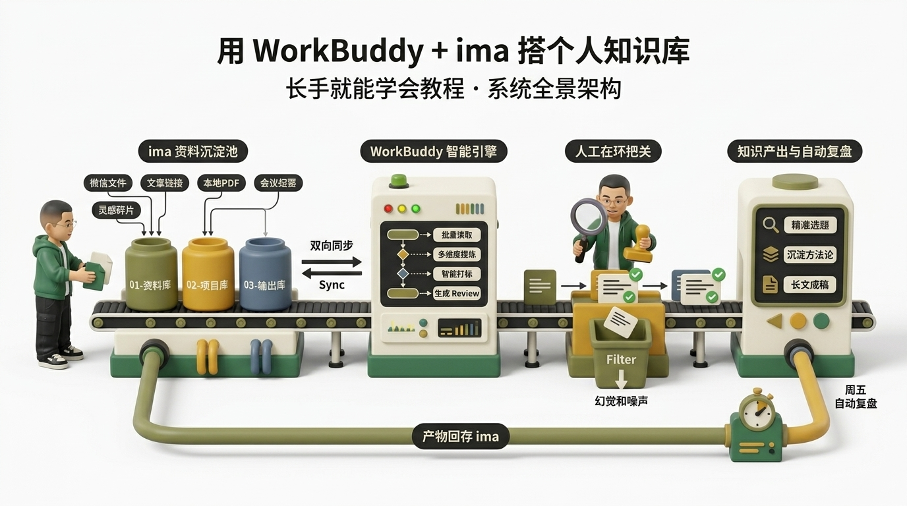
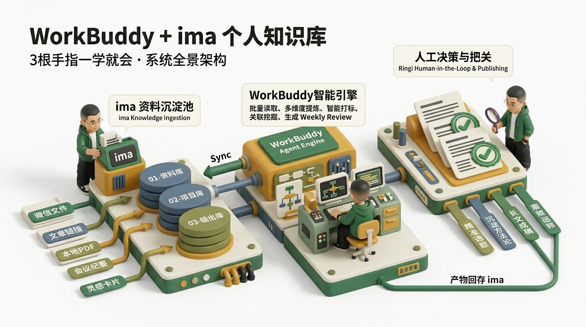
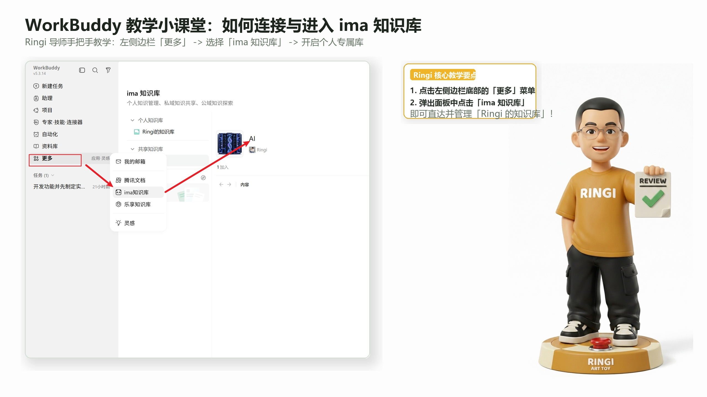
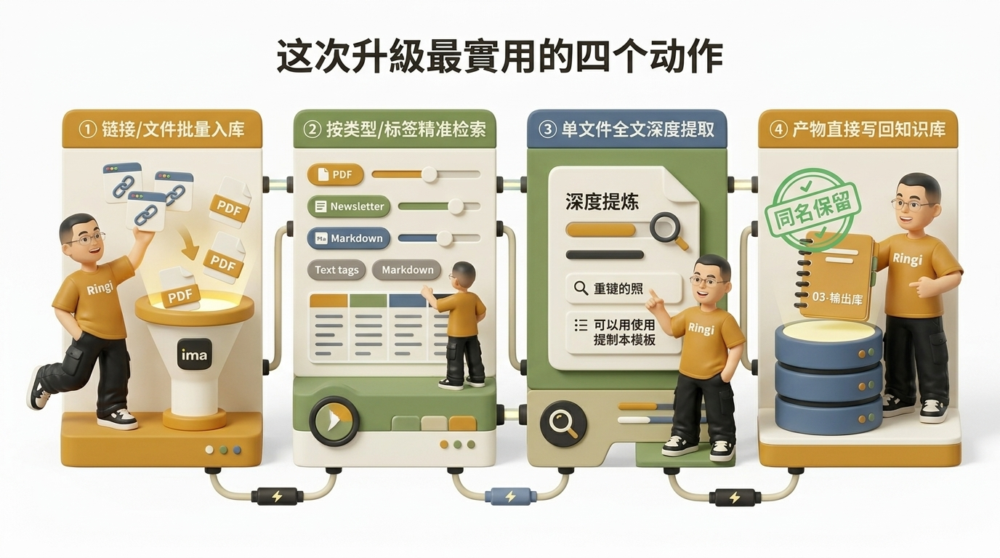
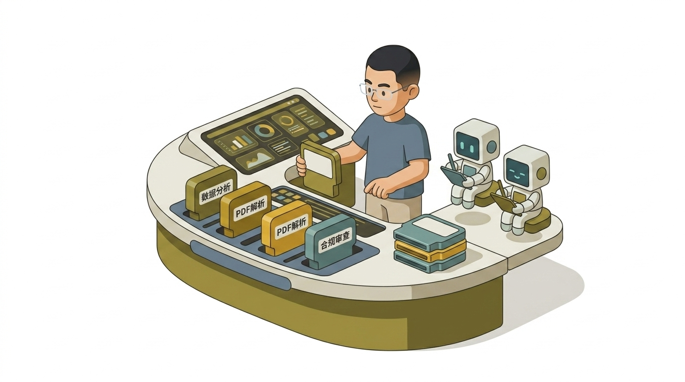
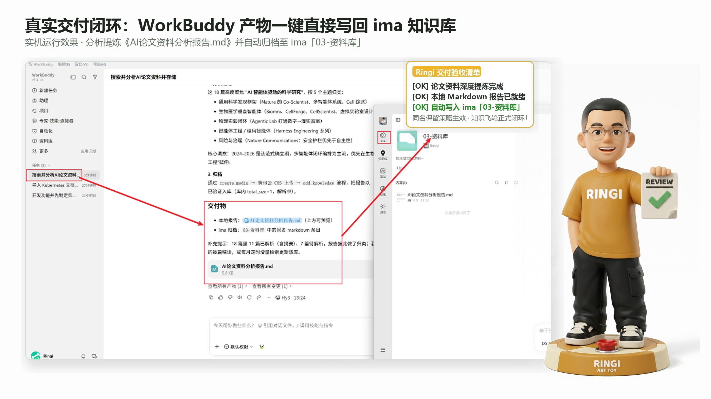

# 万字长文｜WorkBuddy 从入门到精通：别再拿聊天框做 AI 交付了！

**作者：Ringi ｜ 云原生与 AI 基础设施探索者**

> 💡 **原文灵感**：[@miles_mazy](https://x.com/miles_mazy/status/2090727310257430759?s=46) ｜ **架构提炼与实战重构**：Ringi

---


*图 0｜WorkBuddy 从大模型到企业级落地全景交付架构（Ringi 独家架构小剧场）*

---

## 💡 为什么 90% 的 AI 演示在真实交付中都会翻车？

在国内做 AI 交付，**真正难的从来不是模型能写出多么惊艳的诗，而是如何把模型无缝放进客户现有的真实工作流里**。

到了政企与大型客户现场，网络、数据、采购、账号隔离和运维合规会先把方案像筛子一样筛一遍：
- **网络隔离**：国外工具再好，无法稳定访问、无法通过合规专线，只能停在录屏演示里；
- **权限黑盒**：没有细粒度的读写控制，客户永远不敢把内网核心文档交给 AI；
- **产物难交付**：聊天框里吐出的一万字，还要人工一段段复制、排版、查错、重构，省下的时间全花在搬砖上；
- **修改不可逆**：一旦让 Agent 跑脚本覆盖了原文件，找不到版本差异，直接导致灾难性翻车。

所以，**WorkBuddy 一定要学**。它把**模型理解、本地工作空间、细粒度权限、原生技能、国内连接器与交付物看板**装进了同一条任务链路。

它让 AI 能够**把文件做出来、把修改留下来、把过程透明化，再交给人去验收**。

> **⚠️ Ringi 的架构第一准则**
> **不要问“模型有多聪明”，先看“任务边界有多硬”。**
> 聊天框只产生临时对话，工作空间才沉淀资产。AI 交付的核心是受控与可溯源。

| 维度 | 普通聊天工具（ChatGPT / Claude Web） | AI 交付工作台（WorkBuddy） |
| :--- | :--- | :--- |
| **交互形态** | 网页对话框，单向问答 | 本地化桌面工作台，人机协同执行 |
| **文件读写** | 需手动上传，输出为文本代码块 | 挂载本地工作空间，直接生成/读写真实文件 |
| **权限控制** | 无权限概念或全盘开放 | 支持默认受控、完全访问、人在回路确认 |
| **执行模式** | 单一生成模式 | 问答（Ask）、计划先行（Plan）、直接执行（Default） |
| **变更审计** | 无法查看具体哪行代码/文档被改 | 类似 Git Diff 的“查看所有变更”看板 |
| **国内生态** | 难以连接国内办公系统 | 原生支持腾讯文档、企业微信、邮箱、飞书等连接器 |

---

## 🏗️ 核心架构：解决从模型到交付的“最后一公里”

普通聊天工具的典型动作是“你问一句，它回一段”。WorkBuddy 更接近一名**坐在你电脑前、随时待命的资深执行者**：先理解目标，再翻阅材料，制定执行步骤，读取或修改获得授权的文件，必要时调用外部技能与连接器，最后把完整结果交给你检查。


*图 1｜WorkBuddy 核心执行流与安全护栏：从材料输入到产物验收（Ringi 独家架构小剧场）*

一个工业级交付任务通常会经过以下标准化路径：

```text
选择工作空间 ➔ 挂载背景资料 ➔ 明确四步输出要求 ➔ 规划并受控执行 ➔ 产物自动生成 ➔ Diff 查看文件变更 ➔ 人工终审与归档
```

- **工作空间（Workspace）**：负责严格限定资料的物理读取范围，形成天然的数据沙箱；
- **权限模式（Permissions）**：负责限制 Agent 的读写与网络动作，保证高风险操作人在回路；
- **模型路由（Models）**：负责语义解析与复杂推理，支持国内主流大模型与自建私有模型；
- **产物与变更面板（Artifacts & Diff）**：负责透明化展示生成文件与版本改动，让验收一目了然。

---

## 🛡️ 交付第一纪律：死守这三大安全边界


*图 2｜交付三大安全边界：隔离工作空间、默认权限闸门与原文件安全保险箱（Ringi 独家架构小剧场）*

### 1. 必须建立隔离的“练习工作空间”
**绝对不要拿桌面、下载目录或正在交付的生产项目做第一次测试！**
先新建一个干净的空文件夹，例如：

```text
WorkBuddy-练习/
├── 会议纪要.txt
└── 销售数据.csv
```

把文件的副本放进去，保留原件。即使初次提示词有歧义，破坏半径也被死死锁在练习区内。等你熟悉了“产物”与“变更”面板后，再逐步迁移真实项目。

### 2. 坚持从“默认权限”起步
在本机界面中，权限下拉菜单默认是“默认权限”。展开后还能看到“允许完全访问”的开关。

> **⚠️ 避坑提醒**
> **“完全访问”只会扩大破坏范围，绝不会让模型变聪明！**
> 批量整理文件、跨多磁盘目录搬运时才可能需要它；日常阅读资料、生成文档、分析表格时，坚决不要开启完全访问。

如果任务涉及**删除、覆盖、上传、发信、付款或批量修改**，务必在指令末尾加上：
`“执行高风险操作前，必须先列出计划并等待我确认”`。

### 3. 分清版本差异与升级时机
界面提示“新版本就绪”时，**切忌在交付任务执行中随手点击重启升级**。升级会强行中断当前线程，甚至改变已有的 UI 交互逻辑。一定要在结束手头工作、备份好数据后再统一升级。

---

## 🧭 架构解耦：一张图看懂 6 大核心名词

刚接触 WorkBuddy 时，很多人会被一堆产品菜单搞晕：任务、工作空间、权限、技能、专家、连接器……下面用一张结构表彻底厘清：

| 模块名称 | 核心职责 | 实战隐喻 |
| :--- | :--- | :--- |
| **任务（Task）** | 承载单次具体工作的输入与输出流 | 具体的工单流水线 |
| **工作空间（Workspace）** | 物理隔离的本地文件夹，限定材料与产物范围 | 施工现场的围挡 |
| **权限（Permissions）** | 控制文件读写、网络外发、敏感操作的授权级别 | 安全防护门禁 |
| **技能（Skills）** | 针对特定格式（PDF/Excel/代码）的专项处理工具 | 随身携带的专业工具箱 |
| **连接器（Connectors）** | 打通企业现有生态（腾讯文档/企业微信/邮箱/飞书） | 业务系统的标准水龙头 |
| **项目（Projects）** | 沉淀全流程模板、角色分工与知识库资产 | 标准化施工图纸 |

---

## 🚀 实战教学：5 步跑通第一个完整交付任务

下面以实际跑通的实战案例演示：将一份杂乱的 `meeting-notes.txt`（包含会议议题、参会人发言与待办事项），转化为标准可交付的 `action-list.md`（行动清单）。


*图 3｜Ringi 实操演示：在工作台内完成从文件输入到结构化产物输出（Ringi 独家架构小剧场）*

### 第一步：精准选择工作空间
点击输入框左下角的文件夹图标，选定刚才创建的练习目录（如 `demo-workspace`）。这样就给 AI 画定了一个绝对安全的操作圈。

### 第二步：运用“四步指令法则”编写 Prompt
想要结果精准可控，必须按**动作、输入、输出、约束**四要素来写：


*图 4｜任务四步指令法则：动作、输入、输出、约束形成闭环（Ringi 独家架构小剧场）*

```text
【动作】：请读取当前工作空间中的 meeting-notes.txt，提取其中的待办事项。
【输入】：meeting-notes.txt
【输出】：新建 action-list.md，包含“任务项、负责人、截止时间、验收标准”四列 Markdown 表格。
【约束】：
1. 严格保留 meeting-notes.txt 原文件，严禁覆盖或删除；
2. 若某项任务未提及截止时间，填写“待确认”，严禁自行捏造日期；
3. 输出完毕后，主动汇报新建文件的绝对路径与内容摘要。
```

### 第三步：发送并观察执行过程
点击发送后，不要切走窗口。观察 WorkBuddy 的执行轨迹：它会展示正在读取哪一行、是否调用了解析器、正在向哪里写入。

### 第四步：验收产物，不只看聊天文字
任务完成后，**不要只在左侧对话框里读文本，直接看向右侧的“产物（Artifacts）”看板**。点击 `action-list.md`，在右侧直接预览排版，检查表格列数、日期是否准确。

### 第五步：查看所有文件变更（Diff 审查）
点击右上角或状态栏的 **“查看所有变更（View Changes）”**。绿色代表新增内容，红色代表删除内容。只有确认原文件完好、新文件规范后，这次交付才算真正合格！

---

## 🚦 问、想、做：执行权限的“人在回路”安全闸门

WorkBuddy 内置了三档核心执行模式，分别对应不同的安全层级：


*图 5｜人在回路（Human-in-the-Loop）三档模式：只读摸底、计划先行、受控执行（Ringi 独家架构小剧场）*

### 1. 仅问答 Ask（只读模式）：先摸底，绝不碰文件
- **适用场景**：第一次阅读几十页晦涩的招标文件、客户代码库或财务明细；
- **行为特征**：模型只能阅读文件并给出回答，系统完全禁写，任何写操作都会被物理拦截；
- **经验总结**：在没搞清楚文档结构前，先用 Ask 提问：“这篇文档一共涉及哪几个核心交付节点？”

### 2. 计划 Plan（构思模式）：先出方案，确认后再动工
- **适用场景**：重构复杂代码、重新组织数十个目录结构、重写方案大纲；
- **行为特征**：WorkBuddy 会先输出一份详细的执行步骤清单（计划卡片），等待你逐条核对并点击“批准”后，才会进入执行阶段；
- **经验总结**：避免 AI 一上来就大刀阔斧乱改，给你提供后悔和纠偏的机会。

### 3. 默认 Default（受控执行模式）：目标明确，一键落地
- **适用场景**：输入清晰、输出格式规范、规则明确的标准日常任务；
- **行为特征**：直接规划并执行生成产物，遇到删除、覆盖等敏感操作依然会弹窗向你索要二次授权。

---

## 🔌 技能与专家团：把专业方法和分工带入任务


*图 6｜技能插槽与多角色专家团协同：专业化分工与按需组装（Ringi 独家架构小剧场）*

### 1. 技能市场：扩展工具箱但需警惕安全
技能市场提供了针对 PDF 深度解析、Excel 高级建模、网页抓取等大量插件能力。

> **⚠️ 技能安装“三看原则”**：
> 1. **它会读取什么**：是否需要扫描敏感凭据或整个磁盘？
> 2. **它会运行什么**：是否需要在本地执行 Python/Shell 脚本？
> 3. **它会把数据发往何处**：是否存在未经许可的第三方服务器回传？

### 2. 专家团（Multi-Agent）：分工协作与成本控制
WorkBuddy 允许配置多角色专家团（如：行业分析师 + 资深文案 + 合规审查员）：

> **💡 成本控制建议**：
> 专家团会产生数倍的 Token 与积分消耗。简单的改写或格式转换千万别用专家团，复杂可行性研究与全案策划才是它的用武之地。

---

## 🌐 连接器：打通国内企业真实生态

这是 WorkBuddy 区别于国外工具的核心杀手锏。客户数据本来就在这些系统里，能直接读写，就少了一层人工搬运的巨大损耗。


*图 7｜国内生态连接器数据流向：从 QQ 邮箱/腾讯文档到 WorkBuddy 资产库（Ringi 独家架构小剧场）*

- **腾讯文档 / 飞书文档**：直接读取内网在线知识库，生成后自动回写共享；
- **企业微信 / QQ 邮箱**：自动提取邮件中的附件与待办，归档为本地任务清单；
- **自建 API / 数据库连接器**：企业私有化部署时，直连内部 MySQL、ERP 与工单系统。

---

## 📂 项目与知识库：从一次成功到可重复交付


*图 8｜项目模板与团队知识库资产：沉淀标准化交付蓝图（Ringi 独家架构小剧场）*

### 1. 项目模板（Projects）：把最佳实践标准化
通过项目面板，可以把产品需求全流程、竞品调研、Bug 跟踪等流程固化为标准化工作流，团队成员直接开箱即用。

### 2. 移动端与远程助理（Assistant）
支持通过手机发起轻量任务。但记住：**手机端适合下达边界明确的只读或归纳任务，复杂代码与工程交付必须回到电脑前验收。**

---

## ⏱️ 自动化：把重复工作交给时间表

自动化是流程成熟后的自然结果，绝不能用来掩盖一条漏洞百出的流程。


*图 9｜自动化定时任务与维护边界：先跑通单次，再定时调度（Ringi 独家架构小剧场）*

1. **先单次、后定时**：必须先在本地手动跑顺输入、路径、输出和 Diff 校验；
2. **低频、只读起步**：初期建议配置周报汇总、竞品动态监控等只读任务；
3. **定期维护授权**：连接器 Token 过期或网络变动时，及时检查自动化运行日志。

---

## 🗄️ 资产管理三层架构：本地 vs 项目资产 vs 云端网盘

很多团队常常把这三者混为一谈，导致数据丢失或泄露：


*图 10｜交付物归档与资产管理：本地、项目与云端三层解耦（Ringi 独家架构小剧场）*

1. **本地工作空间**：生命周期最短，用于当前机器上的实时计算与临时生成；
2. **项目资产库**：生命周期与项目同步，保存全团队共享的背景规范与核心资料；
3. **云端网盘**：用于最终交付物的对外分发、永久归档与多端同步。

---

## 🛠️ 交付现场 8 大突发故障排查手册

| 常见故障现象 | 根因定位 | 独家排查与解法 |
| :--- | :--- | :--- |
| **1. 点击发送无反应** | 本地网络波动或本地守护进程未就绪 | 检查本地客户端右下角网络指示灯，测试本地代理配置（如 ClashX 端口） |
| **2. 长时间卡在“准备中”** | 文件体积过大（如几百兆的日志或超大 PDF） | 先将大文件拆分，或在 Ask 模式下指定仅解析前 100 行 |
| **3. 报“找不到文件”** | 相对路径错误或工作空间选错 | 检查左下角当前工作空间路径，确保指令中引用的文件名大小写完全一致 |
| **4. 产物内容截断/不全** | 单次输出达到 Token 上限 | 指令中要求“分章节生成，先写第 1-3 节”，然后追问继续 |
| **5. 误修改了非目标文件** | 权限开得太大或未指定修改范围 | 立即在右上角打开“查看所有变更”，点击单文件回滚按钮 |
| **6. Markdown 预览乱码** | 编码非 UTF-8 without BOM | 将原文件另存为标准 UTF-8 编码后再重新导入 |
| **7. 连接器调用失败** | OAuth Token 过期或账号权限被回收 | 进入连接器设置页，重新点击“测试连接”并重新授权登录 |
| **8. 积分消耗超出预期** | 误开了高成本专家团或循环 Agent | 将多角色协作降级为单模型，复杂任务手动拆解为单步执行 |

---

## 📋 拿来即用：5 大高频交付 Prompt 标准模板

### 模板 1：只读摸底与需求梳理（Ask 模式）
```text
【模式】：Ask 仅问答
【目标】：请阅读【文件名】，提炼出本文档的核心业务诉求。
【输出】：按“核心目标、涉及部门、关键里程碑节点、已知风险”四个维度列出 Markdown 清单。
【约束】：只读不改，严禁对工作空间做任何写操作；若文档中未明确提及某项，写“未说明”。
```

### 模板 2：复杂工程先出方案（Plan 模式）
```text
【模式】：Plan 计划模式
【目标】：准备对【旧代码/旧文档目录】进行模块化重构。
【输出】：列出完整的执行步骤卡片，包含每一步要读取的文件、新建的文件、修改的区域。
【约束】：在我明确回复“批准执行”之前，禁止执行任何实际的修改或新建动作。
```

### 模板 3：安全生成全新交付文件（严禁覆盖原件）
```text
【模式】：Default 受控执行
【动作】：读取【输入文件.txt】，在当前目录下新建【输出文件.md】。
【输出要求】：包含完整的【字段/表格/章节】，排版符合标准 GFM Markdown 语法。
【绝对约束】：保留原文件，禁止覆盖、重命名或移动现有内容。执行完成后输出新建文件路径。
```

### 模板 4：精准局部修改（外科手术式微调）
```text
【模式】：Default 受控执行
【目标】：仅修改【目标文件】中的【具体函数/指定章节段落】。
【约束】：
1. 保持其他所有段落、代码注释、格式和文件结构 100% 不变；
2. 修改前先用文字说明你准备调整的具体行号与逻辑，修改后展示 Diff 差异。
```

### 模板 5：交付前全量质量核查（审阅者模式）
```text
【模式】：Ask 仅问答
【角色】：请作为资深技术审阅专家对【产物文件】进行终审，不要直接修改。
【核查维度】：核对事实准确性、数字逻辑、日期闭环、格式一致性与可运行性。
【输出】：将发现的问题分为“必须修复（严重影响交付）”、“建议优化”、“待人工确认”三类，并指出对应行号。
```

---

## 🗓️ 新人 7 天进阶实战打卡表

- [ ] **Day 1（建立边界）**：新建独立测试文件夹，放进一份脱敏会议纪要，跑通四步指令并验收产物；
- [ ] **Day 2（模式切换）**：用 Ask 模式摸底 50 页技术文档，用 Plan 模式生成重构计划；
- [ ] **Day 3（Diff 审计）**：故意给出一个局部修改指令，在“查看所有变更”看板里逐行比对 Diff 并学习回滚；
- [ ] **Day 4（技能拓展）**：在技能市场安装一款官方文件解析技能，测试 Excel 数据统计与图表生成；
- [ ] **Day 5（生态连接）**：绑定腾讯文档或邮箱连接器，实操一条“从云文档提取数据并归档到本地”的任务；
- [ ] **Day 6（资产沉淀）**：创建一个自定义项目模板，把团队的高频交付规范固化为标准化工作流；
- [ ] **Day 7（自动化编排）**：配置一条每周一早晨自动汇总上周项目进展的定时任务，设置好警报边界。

---

## 🏁 结语：WorkBuddy 带来的交付范式跃迁

WorkBuddy 的核心价值可以用一句话总结：**它把大模型从虚无缥缈的聊天框，真正带进了脚踏实地的工业级交付里。**


*图 11｜AI 交付专家转型之路：以确定性交付驱动 100% 验收通过（Ringi 独家架构小剧场）*

在政企与严苛的客户现场，花哨的演示只能赢来掌声，**能打开、能核对、能审查、能留痕的交付物才能赢来合同**。

建立隔离空间、坚持最小权限、善用人在回路、认真审查每次 Diff——当你掌握了这套方法，不论大模型如何日新月异地迭代，你都能稳稳站在 AI 生产力的最前沿。

---

> **作者简介**：**Ringi Lee**，云原生与 AI 基础设施探索者。关注大模型系统工程、分布式算力集群与 AI-Agent 落地实践。
