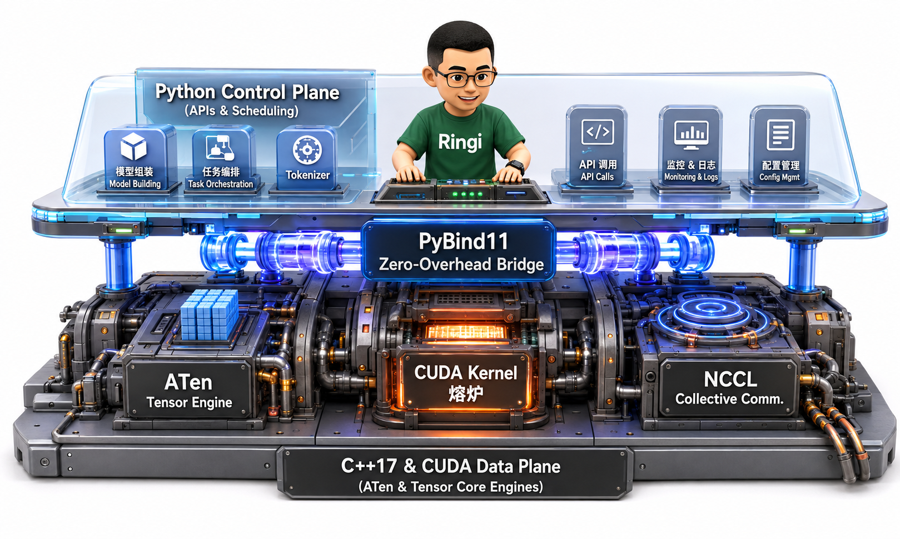
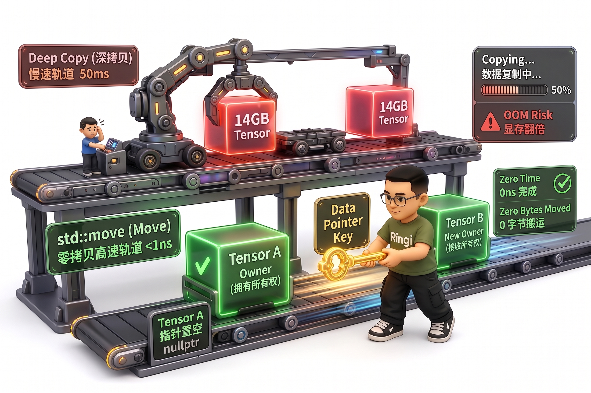

# 第01讲：AI Infra 工程师的 C++ 与 Python 底层必修课

> **主讲人**：👓 **Ringi**（AI Infrastructure 工程师）  
> **所属模块**：Module 00：性能工程与系统前置  
> **关键词**：C++17 / RAII / 智能指针 / 移动语义 / 模板 / PyBind11 / ATen / PyTorch C++ Extension / Autograd  
> **学习目标**：建立从 Python API 一路追踪到 C++、ATen、CUDA/设备执行层的能力，并能够独立编写、编译、导入和验证一个最小 PyTorch C++ 扩展。

AI Infra 处在算法、框架、编译器、操作系统和硬件的交界处。同一个问题往往要在多种语言和工具之间来回切换：用 Python 描述模型与实验，用 C++ 实现性能敏感路径，用 CUDA 驱动 GPU，再用 Linux 工具定位进程、内存、动态库和网络问题。

本讲不追求把 C++ 语法完整背一遍，而是建立一条贯通算力底座的主线：**能读懂、能修改、能调试，也知道每一微秒性能成本与显存开销发生在哪里**。

<!-- more -->

## 📑 目录导航

- [写在前面：这不是一篇“C++ 语法大全”](#写在前面这不是一篇c-语法大全)
- [0. Ringi 开场：为什么会 Python 还远远不够？](#0-ringi-开场为什么会-python-还远远不够)
  - [0.1 Python 更像“控制面”，C++ 更像“数据面”](#01-python-更像控制面c-更像数据面)
  - [0.2 Python 的性能开销到底在哪里？](#02-python-的性能开销到底在哪里)
  - [0.3 什么时候应该下沉到 C++？](#03-什么时候应该下沉到-c)
- [1. 现代 C++（C++11/14/17）核心必备武器库](#1-现代-cc111417核心必备武器库)
  - [1.1 先建立物理直觉：变量、地址、指针与引用](#11-先建立物理直觉变量地址指针与引用)
  - [1.2 指针：保存地址的变量](#12-指针保存地址的变量)
  - [1.3 引用：已有对象的别名](#13-引用已有对象的别名)
  - [1.4 const T& 为什么如此常见？](#14-const-t-为什么如此常见)
  - [1.5 栈、堆与“真正应该关心的东西”：生命周期](#15-栈堆与真正应该关心的东西生命周期)
  - [1.6 RAII：现代 C++ 最重要的思想之一](#16-raii现代-c-最重要的思想之一)
  - [1.7 智能指针：让所有权写进类型系统](#17-智能指针让所有权写进类型系统)
  - [1.8 移动语义：std::move 到底做了什么？](#18-移动语义stdmove-到底做了什么)
  - [1.9 完美转发：std::forward](#19-完美转发stdforward)
  - [1.10 模板：为什么 AI / CUDA 代码里到处都是 <T>？](#110-模板为什么-ai--cuda-代码里到处都是-t)
  - [1.11 一个很重要的现代 C++ 原则：Rule of Zero](#111-一个很重要的现代-c-原则rule-of-zero)
- [2. Python C 扩展与 PyTorch 桥梁：PyBind11 实战](#2-python-c-扩展与-pytorch-桥梁pybind11-实战)
  - [2.1 Python 是怎么 import C++ 的？](#21-python-是怎么-import-c-的)
  - [2.2 PyBind11 最小实战：C++ 向量加法](#22-pybind11-最小实战c-向量加法)
  - [2.3 std::vector vs Python list：一个非常关键的性能陷阱](#23-stdvector-vs-python-list一个非常关键的性能陷阱)
  - [2.4 真正的 Zero-Copy 应该看什么？](#24-真正的-zero-copy-应该看什么)
  - [2.5 PyBind11 与 GIL](#25-pybind11-与-gil)
  - [2.6 Python ↔ C++ 边界的性能原则](#26-python--c-边界的性能原则)
- [3. PyTorch C++ 扩展：从 torch::Tensor 到 ATen](#3-pytorch-c-扩展从-torchtensor-到-aten)
  - [3.1 PyTorch 的 C++ 底座：ATen](#31-pytorch-的-c-底座aten)
  - [3.2 at::Tensor 不是“整块数据对象”](#32-attensor-不是整块数据对象)
  - [3.3 为什么 Tensor View 可以很便宜？](#33-为什么-tensor-view-可以很便宜)
  - [3.4 最小 PyTorch C++ Extension](#34-最小-pytorch-c-extension)
  - [3.5 用 torch.utils.cpp_extension.load JIT 编译](#35-用-torchutilscpp_extensionload-jit-编译)
  - [3.6 JIT load() 在背后做了什么？](#36-jit-load-在背后做了什么)
  - [3.7 torch.utils.cpp_extension.load 常见参数](#37-torchutilscpp_extensionload-常见参数)
  - [3.8 AOT：不要每次启动程序都现场编译](#38-aot不要每次启动程序都现场编译)
  - [3.9 更正式的 PyTorch Custom Operator：Dispatcher 注册](#39-更正式的-pytorch-custom-operatordispatcher-注册)
  - [3.10 自定义 C++ 算子如何保持 Autograd 可导？](#310-自定义-c-算子如何保持-autograd-可导)
  - [情况 A：C++ 函数内部只组合已有 ATen 可导算子](#情况-ac-函数内部只组合已有-aten-可导算子)
  - [情况 B：你自己写了一个“黑盒” CPU/CUDA Kernel](#情况-b你自己写了一个黑盒-cpucuda-kernel)
  - [3.11 torch.autograd.Function 和 Custom Operator 是一回事吗？](#311-torchautogradfunction-和-custom-operator-是一回事吗)
- [4. 动手实战：从 0 跑通一个 C++ Extension](#4-动手实战从-0-跑通一个-c-extension)
  - [4.1 环境要求](#41-环境要求)
  - [4.2 项目结构](#42-项目结构)
  - [4.3 op.cpp](#43-opcpp)
  - [4.4 test_cpp_extension.py](#44-test_cpp_extensionpy)
  - [4.5 运行](#45-运行)
  - [4.6 为什么这个例子能测 Autograd？](#46-为什么这个例子能测-autograd)
  - [4.7 如何证明没有把 Tensor 数据复制到 Python list？](#47-如何证明没有把-tensor-数据复制到-python-list)
  - [4.8 如果下一步改成 CUDA 会发生什么？](#48-如果下一步改成-cuda-会发生什么)
- [5. Ringi 避坑指南](#5-ringi-避坑指南)
  - [5.1 ❌ 返回局部对象引用](#51--返回局部对象引用)
  - [5.2 ❌ 返回局部变量指针](#52--返回局部变量指针)
  - [5.3 ❌ 以为裸指针等于 Zero-Copy](#53--以为裸指针等于-zero-copy)
  - [5.4 ❌ shared_ptr 到处用](#54--shared_ptr-到处用)
  - [5.5 ❌ 以为 std::move 后对象“不能用了”](#55--以为-stdmove-后对象不能用了)
  - [5.6 ❌ 对函数返回值乱加 std::move](#56--对函数返回值乱加-stdmove)
  - [5.7 ❌ C++ 算子里频繁调用 Python API](#57--c-算子里频繁调用-python-api)
  - [5.8 ❌ 忽略 Tensor dtype](#58--忽略-tensor-dtype)
  - [5.9 ❌ 忽略 device](#59--忽略-device)
  - [5.10 ❌ 忽略 contiguous / stride](#510--忽略-contiguous--stride)
  - [5.11 ❌ 忽略 GPU 异步执行](#511--忽略-gpu-异步执行)
  - [5.12 ❌ 一出编译错误就重装 CUDA](#512--一出编译错误就重装-cuda)
- [6. 大厂面试高频题](#6-大厂面试高频题)
  - [面试题 1：std::unique_ptr 与 std::shared_ptr 区别？](#面试题-1stdunique_ptr-与-stdshared_ptr-区别)
  - [面试题 2：RAII 为什么对 CUDA 显存管理重要？](#面试题-2raii-为什么对-cuda-显存管理重要)
  - [面试题 3：std::move 为什么能提高大对象传递性能？](#面试题-3stdmove-为什么能提高大对象传递性能)
  - [面试题 4：Python list 传到 const std::vector<float>& 是 Zero-Copy 吗？](#面试题-4python-list-传到-const-stdvectorfloat-是-zero-copy-吗)
  - [面试题 5：为什么 PyTorch Tensor 复制句柄很便宜？](#面试题-5为什么-pytorch-tensor-复制句柄很便宜)
  - [面试题 6：PyTorch Tensor 的 shape 与 stride 分别是什么？](#面试题-6pytorch-tensor-的-shape-与-stride-分别是什么)
  - [面试题 7：PyTorch 自定义 C++ 算子怎样支持 Autograd？](#面试题-7pytorch-自定义-c-算子怎样支持-autograd)
  - [面试题 8：为什么 C++ 扩展可能比 Python 还慢？](#面试题-8为什么-c-扩展可能比-python-还慢)
  - [面试题 9：什么时候释放 GIL？](#面试题-9什么时候释放-gil)
  - [面试题 10：为什么不能返回局部对象引用？](#面试题-10为什么不能返回局部对象引用)
- [7. Debug：C++ Extension 出错怎么定位？](#7-debugc-extension-出错怎么定位)
  - [7.1 第一步：确认 Python 与 PyTorch](#71-第一步确认-python-与-pytorch)
  - [7.2 第二步：确认编译器](#72-第二步确认编译器)
  - [7.3 第三步：确认 Ninja](#73-第三步确认-ninja)
  - [7.4 第四步：如果包含 CUDA，确认工具链](#74-第四步如果包含-cuda确认工具链)
  - [7.5 第五步：看完整编译命令](#75-第五步看完整编译命令)
  - [7.6 第六步：区分 compile / link / import](#76-第六步区分-compile--link--import)
- [8. 性能工程视角：这节课真正要建立的思维](#8-性能工程视角这节课真正要建立的思维)
  - [8.1 从“值”升级到“Buffer”](#81-从值升级到buffer)
  - [8.2 从“函数”升级到“边界”](#82-从函数升级到边界)
  - [8.3 从“代码正确”升级到“生命周期正确”](#83-从代码正确升级到生命周期正确)
- [9. 本讲自测 Checklist](#9-本讲自测-checklist)
- [10. 课后练习](#10-课后练习)
  - [练习 1：修改 C++ Add](#练习-1修改-c-add)
  - [练习 2：增加 dtype 检查](#练习-2增加-dtype-检查)
  - [练习 3：测试非 contiguous Tensor](#练习-3测试非-contiguous-tensor)
  - [练习 4：观察 Tensor 共享](#练习-4观察-tensor-共享)
  - [练习 5：比较 list 与 Tensor 边界](#练习-5比较-list-与-tensor-边界)
  - [练习 6：实现 RAII Buffer](#练习-6实现-raii-buffer)
- [11. Ringi 总结](#11-ringi-总结)
  - [第一：所有权意识](#第一所有权意识)
  - [第二：生命周期意识](#第二生命周期意识)
  - [第三：数据布局意识](#第三数据布局意识)
  - [第四：边界意识](#第四边界意识)
  - [第五：异步意识](#第五异步意识)
  - [第六：测量意识](#第六测量意识)
- [12. 下一讲承接](#12-下一讲承接)
- [附录 A：最小代码包](#附录-a最小代码包)
  - [A.1 op.cpp](#a1-opcpp)
  - [A.2 test_cpp_extension.py](#a2-test_cpp_extensionpy)
- [附录 B：参考资料](#附录-b参考资料)

---

## 写在前面：这不是一篇“C++ 语法大全”

很多同学第一次接触 AI Infra，会有一个很自然的疑问：

> “我会 Python，也会 `import torch`，模型能训练、能推理，为什么还要学 C++？”

如果你的目标只是调用现成模型，Python 确实已经足够强大。

但如果你的目标是下面这些工作：

- 优化大模型推理延迟；
- 修改 vLLM / TensorRT-LLM / SGLang 的核心执行路径；
- 编写 CUDA Kernel；
- 定位 PyTorch 算子性能问题；
- 处理 Tensor 的生命周期、显存与 Stream；
- 排查 NCCL、CUDA Runtime、动态链接库问题；
- 为 PyTorch 增加自定义算子；
- 阅读框架内部 Dispatcher / ATen / C10 代码；
- 做 CPU / GPU 性能工程；

那么只会 Python 很快就会撞到一堵墙。

AI Infra 的真实调用链通常更像这样：

```text
Python 用户代码
    │
    ▼
PyTorch Python API
    │
    ▼
Dispatcher / ATen / C10（C++）
    │
    ├── CPU Kernel（C++ / SIMD）
    │
    └── CUDA Kernel / cuBLAS / cuDNN / NCCL
                │
                ▼
        GPU Runtime / Driver / Hardware
```

你在 Python 里写下：

```python
y = torch.matmul(x, w)
```

看起来只是一行代码，但真正干活的部分通常并不在 Python。

**AI Infra 工程师最重要的能力，不是背多少 C++ 语法，而是能沿着这条调用链向下追踪：数据在哪里、谁拥有它、什么时候释放、有没有复制、在哪个设备执行、由哪个线程或 Stream 调度。**

---

# 0. Ringi 开场：为什么会 Python 还远远不够？

## 0.1 Python 更像“控制面”，C++ 更像“数据面”



可以把 AI Infra 中常见的语言分工粗略理解为三层：

| 层次 | 常见技术 | 主要职责 |
|---|---|---|
| 编排层 | Python / Shell | 模型定义、实验、训练脚本、任务编排 |
| 系统层 | C / C++ | Tensor 实现、调度、内存管理、通信、Runtime |
| 设备层 | CUDA C++ / Triton | GPU Kernel、访存优化、并行计算、算子融合 |

Python 的最大优点是开发效率高。

C++ 的最大优点是：

- 生命周期可控；
- 内存布局可控；
- 可以直接调用系统 API；
- 可以接入 CUDA / NCCL / Driver；
- 模板可以在编译期生成高性能特化代码；
- 没有 Python 对象模型带来的逐元素动态开销。

因此实际系统一般是：

> **Python 负责“我要做什么”，C++ / CUDA 负责“具体怎么高效做”。**

---

## 0.2 Python 的性能开销到底在哪里？

### 0.2.1 解释器与动态分派

考虑一个纯 Python 循环：

```python
def add_python(a: list[float], b: list[float]) -> list[float]:
    out = []
    for x, y in zip(a, b):
        out.append(x + y)
    return out
```

这里每一次 `x + y` 都不是简单的一条 CPU 浮点加法指令。

解释器需要处理：

1. Python 对象；
2. 类型检查；
3. 操作符分派；
4. 引用计数；
5. Python list 的对象指针；
6. 动态内存管理。

而连续数组上的 C++ 循环：

```cpp
for (std::size_t i = 0; i < n; ++i) {
    out[i] = a[i] + b[i];
}
```

编译器可以进一步：

- 内联；
- 自动向量化；
- 展开循环；
- 使用 SIMD；
- 消除不必要的边界检查。

---

### 0.2.2 Python 对象不是“裸数据”

在 C++ 中：

```cpp
float x = 1.0f;
```

`x` 可以直接对应内存中的 4 个字节浮点数据。

而 Python：

```python
x = 1.0
```

`x` 更准确地说是一个**名字**，绑定到一个 Python 对象。

这个对象除了数值本身，还需要类型、引用计数等运行时元数据。

因此：

```python
values = [1.0, 2.0, 3.0]
```

也不是一段紧凑的三个 `float`。

Python `list` 本质上更接近：

```text
list
 ├── pointer ──> Python float object
 ├── pointer ──> Python float object
 └── pointer ──> Python float object
```

而 Tensor / NumPy 数组通常更接近：

```text
metadata
  │
  └── data pointer ──> [float][float][float][float]...
```

这就是为什么 AI 系统如此强调：

- contiguous；
- dtype；
- shape；
- stride；
- storage；
- data pointer；
- zero-copy。

---

### 0.2.3 GIL：要理解，但不要背成一句口号

传统 CPython 默认构建中存在 **GIL（Global Interpreter Lock）**。

这意味着在一个进程中，多个线程通常不能同时执行 Python 字节码。

所以：

```python
Thread-1: Python CPU loop
Thread-2: Python CPU loop
```

通常不会因为有两个 CPU Core 就自动获得 2 倍性能。

但是下面这种理解也是错的：

> “有 GIL，所以 Python 线程完全没用。”

实际情况是：

- 阻塞 I/O 期间可以让其他线程运行；
- NumPy / PyTorch 等原生扩展可以把耗时计算放到 C/C++；
- C/C++ 扩展可以在安全条件下释放 GIL；
- GPU Kernel 启动后，实际计算发生在 GPU 上。

另外，从 Python 3.13 开始，CPython 已经提供可选的 free-threaded 构建，可以在特定构建中关闭 GIL。**但不能因此假设生产环境中的所有 Python 都已经没有 GIL**。写扩展时仍然要理解 Python C API、线程状态与 GIL 的边界。

---

## 0.3 什么时候应该下沉到 C++？

不要一看到 Python 就重写成 C++。

推荐优化顺序：

```text
算法复杂度
    ↓
减少无意义的 I/O / 序列化 / 数据复制
    ↓
批处理 / 向量化
    ↓
减少 Python ↔ C++ 边界调用次数
    ↓
Profiler 确认热点
    ↓
C++ / CUDA / Triton
```

如果一个函数只执行 2 微秒，但你调用它 100 万次，那么真正的问题可能不是 C++ 算得不够快，而是：

> **边界调用太碎。**

AI Infra 中常见的正确优化不是：

```text
1000000 次小调用 × 每次快一点
```

而是：

```text
1 次批量调用 × 一次处理大量数据
```

---

# 1. 现代 C++（C++11/14/17）核心必备武器库

---

## 1.1 先建立物理直觉：变量、地址、指针与引用

在 64 位 Linux 进程里，每个进程看到的是自己的**虚拟地址空间**。

例如：

```cpp
#include <iostream>

int main() {
    int x = 42;

    std::cout << "value   = " << x << '\n';
    std::cout << "address = " << &x << '\n';

    return 0;
}
```

可能输出：

```text
value   = 42
address = 0x7ffd0f23a82c
```

其中：

```cpp
&x
```

表示取变量 `x` 的地址。

---

## 1.2 指针：保存地址的变量

```cpp
int x = 42;
int* p = &x;
```

此时：

```text
x = 42

p
│
└──────> x 所在的内存地址
```

通过：

```cpp
*p
```

可以访问该地址上的对象。

```cpp
*p = 100;
```

此时：

```cpp
std::cout << x;  // 100
```

---

## 1.3 引用：已有对象的别名

```cpp
int x = 42;
int& ref = x;

ref = 100;
std::cout << x;  // 100
```

引用与指针的典型差异可以先这样记：

| 项目 | 指针 | 引用 |
|---|---|---|
| 语法 | `T*` | `T&` |
| 可为空 | 可以 | 正常引用语义下不应为空 |
| 可重新指向 | 可以 | 初始化后绑定同一个对象 |
| 常见语义 | 可选对象、数组地址、底层 API | 非拥有访问、函数参数 |

在 AI Infra 代码中你会经常看到：

```cpp
void run(const Tensor& x);
```

意思通常是：

> 我需要访问 `x`，但这个函数不拥有 `x`，也不打算复制 `x` 这个 C++ 句柄。

---

## 1.4 `const T&` 为什么如此常见？

假设：

```cpp
struct Config {
    std::string model_path;
    std::vector<int> devices;
};
```

如果写：

```cpp
void launch(Config config);
```

按值传递可能需要构造一个新的 `Config`。

如果只读：

```cpp
void launch(const Config& config);
```

通常更合适。

但注意：

> 对 `torch::Tensor` 这种本身就是轻量引用计数句柄的类型，“按值传 Tensor”与“复制整块 Tensor 数据”完全不是一回事。

这是后面理解 `at::Tensor` 的关键。

---

## 1.5 栈、堆与“真正应该关心的东西”：生命周期

初学 C++ 时常听到：

- 栈；
- 堆。

但工程中更重要的问题是：

> **这个对象活多久？谁负责释放？**

例如：

```cpp
void bad() {
    int* p = new int(42);
}
```

函数结束后，`p` 这个指针变量没了，但 `new int(42)` 分配的内存还在。

没有人再能释放它。

这叫：

```text
memory leak
```

再看：

```cpp
int* p = new int(42);
delete p;
std::cout << *p;
```

`delete` 后仍然访问：

```cpp
*p
```

这就是悬空指针问题。

---

## 1.6 RAII：现代 C++ 最重要的思想之一

**RAII = Resource Acquisition Is Initialization**

不要只把它理解成一句翻译：

> 资源获取即初始化。

真正工程意义是：

> **把资源的生命周期绑定到 C++ 对象生命周期。**

对象进入作用域时拿资源。

对象离开作用域时自动释放资源。

---

### 1.6.1 手工资源管理为什么危险？

```cpp
void process() {
    FILE* f = fopen("data.bin", "rb");

    if (!f) {
        return;
    }

    do_something();

    fclose(f);
}
```

如果：

```cpp
do_something();
```

中间抛异常，`fclose` 可能永远不会执行。

---

### 1.6.2 RAII 写法

```cpp
#include <cstdio>
#include <stdexcept>

class File {
public:
    explicit File(const char* path)
        : handle_(std::fopen(path, "rb")) {
        if (handle_ == nullptr) {
            throw std::runtime_error("failed to open file");
        }
    }

    ~File() {
        if (handle_ != nullptr) {
            std::fclose(handle_);
        }
    }

    File(const File&) = delete;
    File& operator=(const File&) = delete;

private:
    std::FILE* handle_;
};
```

调用：

```cpp
void process() {
    File file("data.bin");
    do_something();
}
```

即使 `do_something()` 抛异常，栈展开时 `File::~File()` 仍然执行。

---

### 1.6.3 RAII 在 AI Infra 中管理什么？


不仅是 CPU 内存。

它可以管理：

```text
CPU heap memory
file descriptor
socket
mutex
thread
CUDA device memory
CUDA stream
CUDA event
NCCL communicator
temporary workspace
mmap region
```

例如概念上的 CUDA Buffer：

```cpp
class CudaBuffer {
public:
    explicit CudaBuffer(std::size_t bytes) {
        cudaMalloc(&ptr_, bytes);
    }

    ~CudaBuffer() {
        if (ptr_ != nullptr) {
            cudaFree(ptr_);
        }
    }

private:
    void* ptr_{nullptr};
};
```

这才是“大厂底层代码不喜欢裸 `malloc/free`、裸 `cudaMalloc/cudaFree` 满天飞”的根本原因。

> 严格来说，不是“永远不能手写 malloc/free”，而是**资源所有权必须被封装，异常路径和提前返回路径也必须安全**。

---

## 1.7 智能指针：让所有权写进类型系统

C++ 中最常用：

```cpp
std::unique_ptr<T>
std::shared_ptr<T>
std::weak_ptr<T>
```

---

### 1.7.1 `std::unique_ptr`

唯一所有权。

```cpp
auto buffer = std::make_unique<Buffer>(1024);
```

语义：

```text
buffer 独占拥有 Buffer
```

不能普通复制：

```cpp
auto b = buffer;  // 编译失败
```

可以移动：

```cpp
auto b = std::move(buffer);
```

此后所有权转移给 `b`。

### 推荐原则

> 如果资源不需要共享所有权，优先 `unique_ptr`。

---

### 1.7.2 `std::shared_ptr`

共享所有权。

```cpp
auto p1 = std::make_shared<Buffer>(1024);
auto p2 = p1;
```

内部维护引用计数：

```text
p1 ─┐
    ├──> Buffer
p2 ─┘

use_count = 2
```

当最后一个拥有者销毁时，对象才释放。

代价包括：

- 控制块；
- 引用计数；
- 多线程下引用计数通常需要原子操作；
- 循环引用问题。

因此：

> `shared_ptr` 不是“懒得想生命周期时的默认答案”。

---

### 1.7.3 `std::weak_ptr`

用于观察 `shared_ptr` 管理的对象，但不增加强引用计数。

典型用途是打破循环引用。

---

## 1.8 移动语义：`std::move` 到底做了什么？



这是面试高频坑点。

先看：

```cpp
std::vector<float> a(100000000);
std::vector<float> b = a;
```

这里 `b = a` 是复制。

可能需要重新申请大块内存，然后复制所有元素。

---

### 1.8.1 移动

```cpp
std::vector<float> b = std::move(a);
```

对于 `std::vector`，通常可以直接把：

- data pointer；
- size；
- capacity；

转移给 `b`。

概念上：

```text
移动前：

a ---> [巨大 Buffer]

移动后：

a ---> empty/valid-but-unspecified
b ---> [原来的巨大 Buffer]
```

真正的数据 Buffer 不需要逐元素复制。

---

### 1.8.2 关键纠正：`std::move` 本身并不“移动任何数据”

`std::move(x)` 本质上是把表达式转换成可以匹配右值引用的形式。

它告诉编译器：

> “如果目标类型支持移动语义，现在可以把这个对象的资源拿走。”

真正执行资源转移的是：

```cpp
T(T&&)
```

或者：

```cpp
T& operator=(T&&)
```

也就是移动构造 / 移动赋值。

---

### 1.8.3 不要把 `std::move` 神化成“Tensor 零拷贝按钮”

例如 PyTorch 的 `at::Tensor` 本身是一个**引用计数句柄**。

复制：

```cpp
at::Tensor b = a;
```

并不等于复制整块 GPU Storage。

很多情况下只是让两个 Tensor 句柄指向同一个底层 `TensorImpl`，并更新引用计数。

所以面试中回答：

> “大 Tensor 一定要 `std::move`，否则会复制几 GB 显存。”

这是不准确的。

正确回答应该是：

> 对拥有大型资源的 C++ 容器或对象，移动语义可以转移所有权，避免深拷贝；但具体收益取决于类型。对 `at::Tensor` 这类引用计数句柄，复制句柄本身并不会复制底层 Tensor Storage。

---

## 1.9 完美转发：`std::forward`

移动语义解决：

> “对象已经是右值时，如何移动？”

完美转发解决：

> “模板函数收到参数后，如何保留调用方原本的左值/右值属性？”

典型写法：

```cpp
template <typename T, typename... Args>
std::unique_ptr<T> make_object(Args&&... args) {
    return std::make_unique<T>(
        std::forward<Args>(args)...
    );
}
```

这里的：

```cpp
Args&&
```

在模板推导语境中是 forwarding reference。

`std::forward` 会根据原始参数类型决定：

- 继续当左值；
- 还是继续当右值。

---

## 1.10 模板：为什么 AI / CUDA 代码里到处都是 `<T>`？

看一个最简单模板：

```cpp
template <typename T>
T add(T a, T b) {
    return a + b;
}
```

调用：

```cpp
add<float>(1.0f, 2.0f);
add<int>(1, 2);
```

编译器会针对具体类型实例化代码。

---

### 1.10.1 为什么 Kernel 很适合模板？

AI 中同一个算子可能需要支持：

```text
float32
float16
bfloat16
fp8
int8
```

如果每种类型复制一套 Kernel：

```cpp
add_float(...)
add_half(...)
add_bfloat16(...)
```

代码会非常重复。

模板可以写成：

```cpp
template <typename scalar_t>
void kernel(const scalar_t* x,
            const scalar_t* y,
            scalar_t* out,
            std::size_t n) {
    for (std::size_t i = 0; i < n; ++i) {
        out[i] = x[i] + y[i];
    }
}
```

然后：

```cpp
kernel<float>(...);
kernel<half>(...);
```

---

### 1.10.2 模板的性能意义

模板不仅是为了复用代码。

它还允许：

- 编译期特化；
- 常量传播；
- inline；
- 消除动态类型分派；
- 根据 dtype / block size 生成不同 Kernel。

所以你后面读 CUDA 代码时，经常会见到：

```cpp
template <
    typename T,
    int BLOCK_SIZE,
    int NUM_WARPS
>
__global__ void kernel(...);
```

---

## 1.11 一个很重要的现代 C++ 原则：Rule of Zero

如果你的类成员本身都是 RAII 类型：

```cpp
class ModelBuffer {
private:
    std::vector<float> host_;
    std::unique_ptr<DeviceBuffer> device_;
};
```

一般不需要自己手写：

```cpp
~ModelBuffer()
ModelBuffer(const ModelBuffer&)
ModelBuffer(ModelBuffer&&)
operator=
```

让标准库类型自己处理。

这叫：

> **Rule of Zero**

AI Infra 底层代码越复杂，越应该让所有权逻辑尽可能局部、机械、可证明。

---

# 2. Python C 扩展与 PyTorch 桥梁：PyBind11 实战

---

## 2.1 Python 是怎么 `import` C++ 的？

假设 Python：

```python
import fastops
```

如果 `fastops` 是 C/C++ 扩展，那么磁盘上实际可能存在：

Linux：

```text
fastops.cpython-314-x86_64-linux-gnu.so
```

Windows 常见：

```text
fastops.cp314-win_amd64.pyd
```

`.pyd` 本质上也是 Windows DLL 形式的 Python 扩展模块。

Python 导入时大致经历：

```text
import fastops
    │
    ▼
Python import system
    │
    ▼
加载动态库 .so / .pyd
    │
    ▼
查找模块初始化入口
    │
    ▼
创建 Python module object
    │
    ▼
注册 C++ 函数
```

PyBind11 的价值就是：

> 帮你把复杂的 Python C API 封装成现代 C++ 接口。

---

## 2.2 PyBind11 最小实战：C++ 向量加法

项目结构：

```text
pybind_vector_add/
├── CMakeLists.txt
├── vector_add.cpp
└── test.py
```

---

### 2.2.1 `vector_add.cpp`

```cpp
#include <pybind11/pybind11.h>
#include <pybind11/stl.h>

#include <stdexcept>
#include <vector>

namespace py = pybind11;

std::vector<float> vector_add(
    const std::vector<float>& a,
    const std::vector<float>& b
) {
    if (a.size() != b.size()) {
        throw std::invalid_argument(
            "a and b must have the same length"
        );
    }

    std::vector<float> out(a.size());

    for (std::size_t i = 0; i < a.size(); ++i) {
        out[i] = a[i] + b[i];
    }

    return out;
}

PYBIND11_MODULE(fast_vector, m) {
    m.doc() = "Minimal pybind11 vector add example";

    m.def(
        "vector_add",
        &vector_add,
        py::arg("a"),
        py::arg("b")
    );
}
```

---

### 2.2.2 `CMakeLists.txt`

```cmake
cmake_minimum_required(VERSION 3.20)

project(fast_vector LANGUAGES CXX)

find_package(
    Python
    COMPONENTS Interpreter Development
    REQUIRED
)

find_package(pybind11 CONFIG REQUIRED)

pybind11_add_module(
    fast_vector
    vector_add.cpp
)

target_compile_features(
    fast_vector
    PRIVATE cxx_std_17
)
```

---

### 2.2.3 创建环境

```bash
python3 -m venv .venv
source .venv/bin/activate

python -m pip install --upgrade pip
python -m pip install pybind11 cmake ninja
```

---

### 2.2.4 编译

```bash
cmake -S . -B build \
  -Dpybind11_DIR="$(python -m pybind11 --cmakedir)" \
  -DCMAKE_BUILD_TYPE=Release

cmake --build build --parallel
```

---

### 2.2.5 `test.py`

```python
from pathlib import Path
import sys

build_dir = Path(__file__).parent / "build"
sys.path.insert(0, str(build_dir))

import fast_vector

a = [1.0, 2.0, 3.0]
b = [10.0, 20.0, 30.0]

out = fast_vector.vector_add(a, b)

print(out)

assert out == [11.0, 22.0, 33.0]
```

运行：

```bash
python test.py
```

预期：

```text
[11.0, 22.0, 33.0]
```

---

## 2.3 `std::vector` vs Python `list`：一个非常关键的性能陷阱

你可能会看到：

```cpp
std::vector<float> vector_add(
    const std::vector<float>& a,
    const std::vector<float>& b
);
```

然后误以为：

> “这里用了 `const &`，所以 Python list 没复制。”

错。

当你：

```python
fast_vector.vector_add([1.0, 2.0], [3.0, 4.0])
```

PyBind11 需要把 Python `list` 转成：

```cpp
std::vector<float>
```

这通常意味着：

```text
Python list
    │
    ├── 取元素
    ├── Python float -> C++ float
    └── 填进 std::vector
             │
             ▼
          C++ function
```

返回时又要：

```text
std::vector<float>
    │
    ▼
Python list
```

也就是说：

> `const std::vector<float>&` 只能避免**进入 C++ 函数之后再复制一次这个 vector**，不能消除 Python ↔ C++ 边界转换。

---

## 2.4 真正的 Zero-Copy 应该看什么？

高性能接口应该尽量直接传连续 Buffer。

典型选择：

```text
NumPy ndarray
PyTorch Tensor
memoryview / buffer protocol
DLPack
共享内存
```

而不是：

```text
Python list of Python float objects
```

---

### 2.4.1 NumPy 思路

PyBind11 支持：

```cpp
py::array_t<float>
```

概念上可以直接拿到：

```text
shape
stride
data pointer
```

如果数据类型与布局满足要求，就不必先把所有元素转换成一个新的 `std::vector<float>`。

但是 zero-copy 永远有前提：

- dtype 是否匹配；
- contiguous 是否满足；
- alignment 是否满足；
- 谁拥有内存；
- C++ 使用期间 Python 对象是否还活着；
- 是否允许写；
- 生命周期是否跨线程。

所以：

> **Zero-Copy 从来不只是“拿一个裸指针”。它本质上是内存所有权与生命周期协议。**

---

## 2.5 PyBind11 与 GIL

Python 调用 PyBind11 C++ 函数时，PyBind11 默认不会自动把 GIL 放掉。

如果 C++ 函数执行很久，并且整个计算期间：

- 不访问 Python 对象；
- 不调用 Python C API；
- 不回调 Python；

可以考虑释放 GIL。

例如：

```cpp
void heavy_compute();

PYBIND11_MODULE(fastops, m) {
    m.def(
        "heavy_compute",
        &heavy_compute,
        py::call_guard<py::gil_scoped_release>()
    );
}
```

或者：

```cpp
m.def("heavy_compute", [] {
    py::gil_scoped_release release;
    heavy_compute();
});
```

但是：

> 一旦 C++ 代码需要访问 Python 对象，必须重新满足 Python 的线程状态 / GIL 要求。

不要为了“看起来高级”随便释放 GIL。

---

## 2.6 Python ↔ C++ 边界的性能原则

记住四条：

### 原则 1：减少调用次数

差：

```python
for i in range(1_000_000):
    ext.add_one(x[i])
```

好：

```python
ext.add_one_batch(x)
```

---

### 原则 2：避免 Python 容器逐元素转换

差：

```text
list[float]
```

好：

```text
Tensor / ndarray / buffer
```

---

### 原则 3：清楚生命周期

不要让 C++ 保存一个指向已经释放 Python Buffer 的指针。

---

### 原则 4：C++ 热路径不要频繁回调 Python

否则会重新引入：

- GIL；
- Python frame；
- 类型转换；
- 动态分派。

---

# 3. PyTorch C++ 扩展：从 `torch::Tensor` 到 ATen

---

## 3.1 PyTorch 的 C++ 底座：ATen

你在 Python 中：

```python
x = torch.randn(1024, device="cuda")
```

C++ 世界中最核心的 Tensor 类型之一是：

```cpp
at::Tensor
```

在扩展中常见：

```cpp
torch::Tensor
```

很多使用场景下它们表示同一套 Tensor C++ 抽象。

---

## 3.2 `at::Tensor` 不是“整块数据对象”


这是非常关键的一层认知。

可以把它粗略理解为：

```text
at::Tensor
    │
    ▼
intrusive_ptr<TensorImpl>
    │
    ├── sizes
    ├── strides
    ├── dtype
    ├── device
    ├── storage_offset
    ├── dispatch metadata
    │
    ▼
Storage
    │
    ▼
data pointer
    │
    ▼
CPU RAM / CUDA VRAM / other device memory
```

真正的大块数据一般由 Storage 管理。

Tensor 句柄本身主要管理：

- 对 TensorImpl 的引用；
- shape；
- stride；
- dtype；
- device；
- storage relation；
- dispatch / autograd 等元数据。

因此：

```cpp
at::Tensor b = a;
```

一般不是“复制整个 Tensor 数据”。

它更接近：

```text
两个 Tensor handle
      │
      └────> 共享某个底层实现 / Storage
```

---

## 3.3 为什么 Tensor View 可以很便宜？

例如 Python：

```python
x = torch.arange(12)
y = x.view(3, 4)
```

`view` 很多时候不复制底层 Storage。

只是产生新的：

```text
sizes
strides
storage_offset
```

因此 AI Infra 中必须理解：

> shape 一样，不代表内存布局一样。

例如：

```python
x = torch.randn(4, 8)
y = x.transpose(0, 1)
```

`y` 可能不是 contiguous。

如果你的 C++ / CUDA Kernel 假设输入连续，却没有检查 stride，就可能直接算错。

---

## 3.4 最小 PyTorch C++ Extension

我们先做最简单的：

```cpp
custom_add(a, b)
```

暂时不写 CUDA Kernel。

---

### 3.4.1 项目结构

```text
cpp_extension_demo/
├── op.cpp
└── test_cpp_extension.py
```

---

### 3.4.2 `op.cpp`

```cpp
#include <torch/extension.h>

torch::Tensor custom_add(
    const torch::Tensor& a,
    const torch::Tensor& b
) {
    TORCH_CHECK(
        a.device() == b.device(),
        "a and b must be on the same device"
    );

    TORCH_CHECK(
        a.scalar_type() == b.scalar_type(),
        "a and b must have the same dtype"
    );

    TORCH_CHECK(
        a.sizes() == b.sizes(),
        "a and b must have the same shape"
    );

    return a + b;
}

PYBIND11_MODULE(TORCH_EXTENSION_NAME, m) {
    m.def(
        "custom_add",
        &custom_add,
        "Custom add implemented with ATen"
    );
}
```

这里：

```cpp
return a + b;
```

最终会进入 PyTorch/ATen 的算子分发体系。

这个例子还没有自己写 CPU Kernel，它的价值是先打通：

```text
Python
  ↓
PyBind
  ↓
C++
  ↓
ATen
  ↓
PyTorch backend
```

---

## 3.5 用 `torch.utils.cpp_extension.load` JIT 编译

`test_cpp_extension.py`：

```python
from pathlib import Path

import torch
from torch.utils.cpp_extension import load

ROOT = Path(__file__).resolve().parent

custom_ops = load(
    name="ringi_custom_ops",
    sources=[str(ROOT / "op.cpp")],
    extra_cflags=["-O3", "-std=c++17"],
    verbose=True,
)

def main() -> None:
    a = torch.tensor([1.0, 2.0, 3.0])
    b = torch.tensor([10.0, 20.0, 30.0])

    actual = custom_ops.custom_add(a, b)
    expected = a + b

    print("actual  :", actual)
    print("expected:", expected)

    torch.testing.assert_close(actual, expected)

    print("PASS")

if __name__ == "__main__":
    main()
```

运行：

```bash
python test_cpp_extension.py
```

第一次运行会触发编译。

后续如果源码与编译条件未变化，构建缓存可以避免每次从零开始。

---

## 3.6 JIT `load()` 在背后做了什么？

简化来看：

```text
Python
 │
 │ torch.utils.cpp_extension.load(...)
 ▼
生成构建文件
 │
 ▼
调用 C++ compiler / Ninja
 │
 ▼
编译 op.cpp
 │
 ▼
链接 libtorch / Python 扩展依赖
 │
 ▼
生成动态库
 │
 ▼
加载到当前 Python 进程
 │
 ▼
返回 Python module
```

这就是为什么 C++ Extension 出错时，你经常会同时看到：

```text
Python error
compiler error
linker error
dynamic loader error
ABI error
```

它不是单纯的“Python 包”。

---

## 3.7 `torch.utils.cpp_extension.load` 常见参数

```python
load(
    name="my_ext",
    sources=["op.cpp"],
    extra_cflags=["-O3"],
    verbose=True,
)
```

重要参数：

| 参数 | 含义 |
|---|---|
| `name` | 扩展模块名 |
| `sources` | C++ / CUDA 源文件 |
| `extra_cflags` | 传给 C++ 编译器 |
| `extra_cuda_cflags` | 传给 NVCC |
| `extra_ldflags` | 额外链接参数 |
| `build_directory` | 指定构建目录 |
| `verbose` | 显示详细构建日志 |

如果源码包含：

```text
kernel.cu
```

PyTorch 的扩展构建系统可以检测 CUDA 源文件并调用对应工具链。

---

## 3.8 AOT：不要每次启动程序都现场编译

教学阶段：

```python
load(...)
```

非常方便。

生产环境更常见的是：

```text
源码
 ↓
构建 wheel / extension
 ↓
安装
 ↓
import
```

例如可以使用：

```python
from setuptools import setup
from torch.utils.cpp_extension import (
    BuildExtension,
    CppExtension,
)

setup(
    name="ringi_custom_ops",
    ext_modules=[
        CppExtension(
            name="ringi_custom_ops",
            sources=["op.cpp"],
            extra_compile_args=["-O3"],
        )
    ],
    cmdclass={
        "build_ext": BuildExtension
    },
)
```

然后构建 wheel。

这样部署环境就不必在每次进程启动时重新编译。

---

## 3.9 更正式的 PyTorch Custom Operator：Dispatcher 注册

上面的 PyBind 例子很好理解。

但如果你希望自定义算子更完整地参与：

```text
torch.compile
Autograd
FakeTensor / Meta
export
vmap
Dispatcher
CPU/CUDA backend dispatch
```

那么更正式的方向是注册 PyTorch Custom Operator。

C++ 侧常见：

```cpp
TORCH_LIBRARY(ringi, m) {
    m.def("custom_add(Tensor a, Tensor b) -> Tensor");
}
```

并为具体 DispatchKey 注册实现。

概念上：

```text
operator schema
      │
      ▼
PyTorch Dispatcher
      │
      ├── CPU implementation
      ├── CUDA implementation
      ├── Autograd
      ├── Meta/Fake
      └── other backends
```

这才是理解 PyTorch “一个算子为什么能在 CPU/CUDA/Autograd/Compile 中工作”的核心入口。

---

## 3.10 自定义 C++ 算子如何保持 Autograd 可导？

这是面试高频题。

要分情况回答。

---

## 情况 A：C++ 函数内部只组合已有 ATen 可导算子

例如：

```cpp
return a * b + 1;
```

如果这些调用走 PyTorch 正常的 Autograd/Dispatcher 路径，已有算子的梯度规则可以继续构图。

此时你不是发明了一个新的数学原语，而是在 C++ 中组合已有算子。

---

## 情况 B：你自己写了一个“黑盒” CPU/CUDA Kernel

例如：

```text
my_fused_attention_kernel<<<...>>>()
```

PyTorch 不可能凭空知道：

```text
dy/dx
```

是什么。

这时就需要为你的 Operator 注册 backward / autograd formula。

现代 PyTorch Custom Operator 路线中，可以通过相应的 `torch.library` / C++ Dispatcher 注册机制补齐 Autograd。

并且应该使用：

```python
torch.library.opcheck(...)
```

等工具检查注册契约。

---

## 3.11 `torch.autograd.Function` 和 Custom Operator 是一回事吗？

不是。

`torch.autograd.Function` 是自定义前向/反向的一种机制。

但一个完整的 PyTorch Operator 还可能需要兼容：

- Dispatcher；
- `torch.compile`；
- export；
- vmap；
- FakeTensor；
- device dispatch；
- schema；
- alias / mutation contract。

所以工程中不要只会说：

> “自定义算子 = 写一个 `torch.autograd.Function`。”

现在更应该理解完整的 Operator 注册体系。

---

# 4. 动手实战：从 0 跑通一个 C++ Extension

这一节直接给出最小可运行包。

---

## 4.1 环境要求

建议：

```text
Linux
Python 3.10+
PyTorch
C++17 compiler
Ninja
```

检查：

```bash
python --version
python -c "import torch; print(torch.__version__)"
c++ --version
ninja --version
```

---

## 4.2 项目结构

```text
cpp_extension_demo/
├── op.cpp
└── test_cpp_extension.py
```

---

## 4.3 `op.cpp`

```cpp
#include <torch/extension.h>

torch::Tensor custom_add(
    const torch::Tensor& a,
    const torch::Tensor& b
) {
    TORCH_CHECK(
        a.defined() && b.defined(),
        "inputs must be defined tensors"
    );

    TORCH_CHECK(
        a.device() == b.device(),
        "device mismatch: ",
        a.device(),
        " vs ",
        b.device()
    );

    TORCH_CHECK(
        a.scalar_type() == b.scalar_type(),
        "dtype mismatch: ",
        a.scalar_type(),
        " vs ",
        b.scalar_type()
    );

    TORCH_CHECK(
        a.sizes() == b.sizes(),
        "shape mismatch: ",
        a.sizes(),
        " vs ",
        b.sizes()
    );

    return a + b;
}

PYBIND11_MODULE(TORCH_EXTENSION_NAME, m) {
    m.def(
        "custom_add",
        &custom_add,
        "Ringi custom add"
    );
}
```

---

## 4.4 `test_cpp_extension.py`

```python
from pathlib import Path

import torch
from torch.utils.cpp_extension import load

ROOT = Path(__file__).resolve().parent

ext = load(
    name="ringi_custom_add_ext",
    sources=[
        str(ROOT / "op.cpp"),
    ],
    extra_cflags=[
        "-O3",
        "-std=c++17",
    ],
    verbose=True,
)

def check_forward() -> None:
    torch.manual_seed(42)

    a = torch.randn(1024, dtype=torch.float32)
    b = torch.randn(1024, dtype=torch.float32)

    actual = ext.custom_add(a, b)
    expected = torch.add(a, b)

    torch.testing.assert_close(
        actual,
        expected,
        rtol=0,
        atol=0,
    )

    print("[PASS] forward")

def check_autograd() -> None:
    a = torch.randn(
        16,
        dtype=torch.float64,
        requires_grad=True,
    )

    b = torch.randn(
        16,
        dtype=torch.float64,
        requires_grad=True,
    )

    out = ext.custom_add(a, b)
    loss = out.sum()

    loss.backward()

    torch.testing.assert_close(
        a.grad,
        torch.ones_like(a),
    )

    torch.testing.assert_close(
        b.grad,
        torch.ones_like(b),
    )

    print("[PASS] autograd")

def check_error() -> None:
    a = torch.randn(4)
    b = torch.randn(5)

    try:
        ext.custom_add(a, b)
    except RuntimeError as exc:
        print("[PASS] error path:", exc)
    else:
        raise AssertionError(
            "shape mismatch should fail"
        )

def main() -> None:
    print("torch version:", torch.__version__)

    check_forward()
    check_autograd()
    check_error()

    print("ALL TESTS PASSED")

if __name__ == "__main__":
    main()
```

---

## 4.5 运行

```bash
python test_cpp_extension.py
```

你应该至少看到：

```text
[PASS] forward
[PASS] autograd
[PASS] error path: ...
ALL TESTS PASSED
```

---

## 4.6 为什么这个例子能测 Autograd？

因为：

```cpp
return a + b;
```

最终使用的是 PyTorch 已有的加法算子。

也就是说你的 C++ 函数只是：

```text
Python
  ↓
C++ wrapper
  ↓
已有 PyTorch add operator
```

而不是一个 Autograd 完全不知道的自定义黑盒 Kernel。

---

## 4.7 如何证明没有把 Tensor 数据复制到 Python list？

我们传入的是：

```python
torch.Tensor
```

不是：

```python
list[float]
```

PyTorch 的 Python Tensor 与 C++ Tensor 之间有专门的桥接与生命周期管理。

C++ 收到的不是“把每个元素重新做成一个 `std::vector<float>`”。

这正是为什么高性能框架都围绕 Tensor / Buffer 抽象设计。

---

## 4.8 如果下一步改成 CUDA 会发生什么？

项目会变成：

```text
cpp_extension_demo/
├── binding.cpp
├── kernel.cu
└── test.py
```

调用链：

```text
Python
  ↓
binding.cpp
  ↓
CUDA launcher
  ↓
kernel<<<grid, block, stream>>>()
  ↓
GPU
```

你还需要继续理解：

- device；
- current CUDA stream；
- async launch；
- synchronization；
- kernel error；
- dtype dispatch；
- contiguous；
- alignment；
- shared memory；
- warp；
- occupancy；
- memory coalescing。

这就是下一阶段真正进入 AI Infra CUDA 世界的入口。

---

# 5. Ringi 避坑指南

---

## 5.1 ❌ 返回局部对象引用

错误：

```cpp
const std::string& bad() {
    std::string x = "hello";
    return x;
}
```

函数结束时：

```cpp
x
```

已经销毁。

返回引用指向已经不存在的对象。

这是典型：

```text
dangling reference
```

---

## 5.2 ❌ 返回局部变量指针

错误：

```cpp
int* bad() {
    int x = 42;
    return &x;
}
```

函数退出后地址失效。

---

## 5.3 ❌ 以为裸指针等于 Zero-Copy

```cpp
float* ptr;
```

只告诉你：

> 某个地址上可能有 float。

它没有告诉你：

- 内存是不是还活着；
- 谁负责释放；
- 长度是多少；
- 在 CPU 还是 GPU；
- contiguous 吗；
- 谁拥有它；
- 什么时候能释放；
- 是否正在被异步 Kernel 使用。

所以：

> **裸指针只是地址，不是完整的数据协议。**

---

## 5.4 ❌ `shared_ptr` 到处用

如果所有东西都是：

```cpp
std::shared_ptr<T>
```

最后你会发现：

- 谁真正拥有资源不清楚；
- 生命周期变长；
- 循环引用；
- 引用计数有成本；
- 释放时机不可预测。

默认先想：

```text
谁是唯一 owner？
```

---

## 5.5 ❌ 以为 `std::move` 后对象“不能用了”

标准 C++ 更准确的说法是：

> moved-from object 仍然必须处于有效但通常未指定的状态。

例如：

```cpp
std::vector<int> a{1, 2, 3};
auto b = std::move(a);
```

你可以安全地：

```cpp
a.clear();
a.push_back(4);
```

但不要假设：

```cpp
a == {1, 2, 3}
```

---

## 5.6 ❌ 对函数返回值乱加 `std::move`

例如：

```cpp
std::vector<float> make_buffer() {
    std::vector<float> out(1024);
    return std::move(out);
}
```

现代 C++ 中通常直接：

```cpp
return out;
```

更好。

编译器可以使用：

```text
RVO / NRVO
```

消除复制。

乱写 `std::move` 反而可能妨碍优化。

---

## 5.7 ❌ C++ 算子里频繁调用 Python API

例如：

```text
C++ inner loop
    ↓
Python callback
    ↓
C++
    ↓
Python callback
```

这会引入：

- GIL；
- Python object；
- callback；
- 边界转换；
- 解释器开销。

性能敏感路径应该尽量：

```text
一次进入 C++
    ↓
批量完成
    ↓
一次返回
```

---

## 5.8 ❌ 忽略 Tensor dtype

错误：

```cpp
float* ptr = tensor.data_ptr<float>();
```

如果传入：

```text
float16
bfloat16
float64
```

怎么办？

所以真实 Kernel 一般必须检查：

```cpp
tensor.scalar_type()
```

或者做 dtype dispatch。

---

## 5.9 ❌ 忽略 device

你拿到：

```cpp
torch::Tensor x
```

必须搞清楚：

```text
CPU?
CUDA?
XPU?
other backend?
```

不要把 CUDA Tensor 的地址当 CPU 地址直接解引用。

---

## 5.10 ❌ 忽略 contiguous / stride

错误思维：

```text
shape = [1024, 1024]
所以内存一定连续
```

不一定。

例如 transpose 产生的 Tensor 可能共享原 Storage，但 stride 已改变。

真实 Kernel 必须：

- 支持 arbitrary stride；
- 或明确要求 contiguous；
- 或内部调用 `.contiguous()`。

但要注意：

```cpp
auto x2 = x.contiguous();
```

如果输入本来不连续，这可能发生真实数据复制。

所以“为了方便全部 `.contiguous()`”也可能成为性能问题。

---

## 5.11 ❌ 忽略 GPU 异步执行

CUDA Kernel launch 通常是异步的。

CPU 发起：

```text
kernel launch
```

不代表 GPU 已经算完。

所以测性能时如果直接：

```python
start = time.time()
op()
end = time.time()
```

可能只测到了 launch 开销。

GPU benchmark 通常需要：

```python
torch.cuda.synchronize()
```

或者使用 CUDA Event / `torch.utils.benchmark` 等合适工具。

---

## 5.12 ❌ 一出编译错误就重装 CUDA

C++ Extension 出错可能发生在：

```text
Python
C++ compiler
libstdc++
PyTorch headers
ABI
linker
CUDA Toolkit
NVCC
driver
dynamic loader
```

先定位层次，不要先重装全世界。

---

# 6. 大厂面试高频题

---

## 面试题 1：`std::unique_ptr` 与 `std::shared_ptr` 区别？

推荐回答：

`unique_ptr` 表示唯一所有权，不可复制但可以移动，额外成本很低，应该作为默认拥有型指针。`shared_ptr` 表示共享所有权，通过控制块和引用计数管理生命周期，适合确实存在多个 owner 的对象，但有额外计数成本，并要注意循环引用；循环引用通常使用 `weak_ptr` 打破。

---

## 面试题 2：RAII 为什么对 CUDA 显存管理重要？

推荐回答：

CUDA 内存属于资源，可能遇到异常、提前返回、多分支路径。如果直接在业务代码中手工 `cudaMalloc/cudaFree`，容易遗漏释放或重复释放。RAII 把 `cudaFree` 放到析构函数中，让资源生命周期与 C++ 对象作用域绑定，可以显著降低泄漏和错误释放风险。Stream、Event、NCCL communicator 也可以使用同样的设计。

---

## 面试题 3：`std::move` 为什么能提高大对象传递性能？

不要回答：

> “`std::move` 会自动做零拷贝。”

更好的回答：

`std::move` 只是把表达式转换成右值形式，使类型可以选择移动构造或移动赋值。如果类型拥有 heap buffer，例如 `std::vector`，移动通常可以转移内部指针和容量，从而避免逐元素深拷贝。具体收益取决于类型；对 `at::Tensor` 这样的引用计数句柄，普通复制句柄本身也不会复制整个 Tensor Storage。

---

## 面试题 4：Python list 传到 `const std::vector<float>&` 是 Zero-Copy 吗？

不是。

PyBind11 的 STL 自动转换通常需要把 Python list 的元素转换到一个 C++ `std::vector` 中。

`const &` 只能避免 C++ 函数内部再次复制这个 vector。

高性能接口应该优先考虑：

```text
NumPy ndarray
PyTorch Tensor
buffer protocol
DLPack
```

---

## 面试题 5：为什么 PyTorch Tensor 复制句柄很便宜？

因为 `at::Tensor` 更接近引用计数 handle。

多个 Tensor 对象可以指向同一个 TensorImpl / Storage。

例如：

```cpp
at::Tensor b = a;
```

通常只会产生新的句柄引用关系，而不是复制整块显存。

真正复制数据一般是：

```python
x.clone()
```

或其他明确需要新 Storage 的操作。

---

## 面试题 6：PyTorch Tensor 的 shape 与 stride 分别是什么？

`shape/sizes` 描述每个维度长度。

`stride` 描述沿某个维度移动一个元素时，在底层 Storage 中需要跨多少个元素。

因此 transpose 可以只修改 stride，而不复制 Storage。

这也是为什么自定义 Kernel 不能只看 shape。

---

## 面试题 7：PyTorch 自定义 C++ 算子怎样支持 Autograd？

要分两类：

1. 如果 C++ 中只是组合已有 PyTorch/ATen 可导算子，Autograd 可以沿已有算子继续记录；
2. 如果注册了自己的黑盒 CPU/CUDA Kernel，就必须为该 Operator 提供正确的 Autograd/backward 注册，并验证梯度与 Operator schema 契约。

---

## 面试题 8：为什么 C++ 扩展可能比 Python 还慢？

常见原因：

- 每次调用计算量太小；
- Python ↔ C++ 边界开销占主导；
- list / vector 来回转换；
- 不必要 memcpy；
- 线程创建；
- cache miss；
- 没向量化；
- `.contiguous()` 发生复制；
- GPU Kernel 太小；
- 强制同步；
- 编译参数没优化；
- 算法复杂度没变。

所以：

> C++ 不是性能魔法，性能工程必须 measurement-driven。

---

## 面试题 9：什么时候释放 GIL？

当 C/C++ 扩展进入一个较长的原生计算区间，并且该区间：

- 不访问 Python 对象；
- 不调用 Python C API；
- 不需要 Python callback；

可以释放 GIL，让其他 Python 线程继续运行。

如果需要再次调用 Python，就必须正确恢复线程状态 / GIL 约束。

---

## 面试题 10：为什么不能返回局部对象引用？

局部对象离开作用域后生命周期结束。

返回其引用或地址会产生：

```text
dangling reference / dangling pointer
```

后续访问属于未定义行为。

---

# 7. Debug：C++ Extension 出错怎么定位？

建立固定排查顺序。

---

## 7.1 第一步：确认 Python 与 PyTorch

```bash
which python
python --version

python - <<'PY'
import torch

print(torch.__version__)
print(torch.__file__)
print(torch.version.cuda)
print(torch.cuda.is_available())
PY
```

---

## 7.2 第二步：确认编译器

```bash
which c++
c++ --version
```

---

## 7.3 第三步：确认 Ninja

```bash
ninja --version
```

---

## 7.4 第四步：如果包含 CUDA，确认工具链

```bash
nvidia-smi
nvcc --version
```

注意：

```text
nvidia-smi 显示的 CUDA compatibility
```

与：

```text
本机 nvcc Toolkit 版本
```

不是同一个概念。

---

## 7.5 第五步：看完整编译命令

使用：

```python
load(
    ...,
    verbose=True,
)
```

不要只复制最后一行：

```text
Error: build failed
```

真正有价值的是前面第一条 compiler error。

---

## 7.6 第六步：区分 compile / link / import

### 编译错误

典型：

```text
error: no matching function
error: undeclared identifier
```

属于源码 / C++ API 层。

### 链接错误

典型：

```text
undefined reference
```

属于符号 / library / ABI / link flags 层。

### import 错误

典型：

```text
undefined symbol
cannot open shared object file
```

属于动态加载 / ABI / runtime library 层。

---

# 8. 性能工程视角：这节课真正要建立的思维

---

## 8.1 从“值”升级到“Buffer”

初学编程看：

```text
变量的值是多少？
```

AI Infra 要继续问：

```text
这个值在哪个 Buffer？
Buffer 在 CPU 还是 GPU？
地址是什么？
stride 是什么？
谁拥有它？
什么时候释放？
是否需要 copy？
哪个 Stream 正在使用？
```

---

## 8.2 从“函数”升级到“边界”

看到：

```python
y = custom_op(x)
```

不要只想：

> custom_op 做了什么数学运算？

还要问：

```text
Python → C++ 有没有转换？
C++ → CUDA 有没有 memcpy？
有没有 device sync？
有没有 GIL？
有没有创建临时 Tensor？
有没有 contiguous copy？
有没有 allocator 开销？
```

---

## 8.3 从“代码正确”升级到“生命周期正确”

一个 C++ 函数即使数学公式对，也可能因为：

- use-after-free；
- data race；
- dangling pointer；
- double free；
- async lifetime；
- stream ordering；

而完全不可用。

这也是 C++ 对 AI Infra 工程师的重要性。

---

# 9. 本讲自测 Checklist

学完这一讲，你应该能回答：

- [ ] Python 为什么适合做编排，但不适合承担所有性能敏感路径？
- [ ] GIL 限制的究竟是什么？
- [ ] 指针和引用的核心区别是什么？
- [ ] 什么是对象生命周期？
- [ ] RAII 为什么比“记得 free”更可靠？
- [ ] `unique_ptr` 和 `shared_ptr` 如何选择？
- [ ] `std::move` 本身是否真的移动数据？
- [ ] 什么叫 moved-from valid but unspecified state？
- [ ] 为什么模板适合 dtype dispatch？
- [ ] Python `list` 转 `std::vector` 为什么通常不是 Zero-Copy？
- [ ] PyBind11 在跨语言调用里解决了什么？
- [ ] 什么情况下可以释放 GIL？
- [ ] `at::Tensor` 为什么不是整块 Tensor 数据本身？
- [ ] Storage / TensorImpl / Tensor handle 大致是什么关系？
- [ ] shape 和 stride 为什么必须同时理解？
- [ ] `torch.utils.cpp_extension.load` 做了什么？
- [ ] JIT 与 AOT Extension 有什么区别？
- [ ] 为什么自定义 CUDA Kernel 需要额外处理 Autograd？
- [ ] C++ Extension 报错时如何区分 compile / link / import？
- [ ] 为什么“用 C++ 重写”不一定自动变快？

---

# 10. 课后练习

---

## 练习 1：修改 C++ Add

把：

```cpp
return a + b;
```

修改成：

```cpp
return a * 2 + b;
```

然后在 Python 中验证结果。

---

## 练习 2：增加 dtype 检查

只允许：

```text
float32
```

其他 dtype 抛出：

```cpp
TORCH_CHECK(...)
```

---

## 练习 3：测试非 contiguous Tensor

Python：

```python
x = torch.randn(4, 8)
y = x.transpose(0, 1)

print(y.is_contiguous())
print(y.stride())
```

观察你的 C++ 算子是否仍然正确。

---

## 练习 4：观察 Tensor 共享

Python：

```python
x = torch.arange(10)
y = x.view(2, 5)

print(x.data_ptr())
print(y.data_ptr())
```

理解：

```text
不同 Tensor view
可以共享底层 Storage
```

---

## 练习 5：比较 list 与 Tensor 边界

分别实现：

```text
PyBind11: list -> vector -> list
PyTorch: Tensor -> Tensor
```

输入 100 万个 float，测量两种接口。

重点不要只看 C++ 循环时间，还要看：

```text
boundary conversion
```

---

## 练习 6：实现 RAII Buffer

实现：

```cpp
class Buffer
```

要求：

- 构造时申请内存；
- 析构时释放；
- 禁止复制；
- 支持移动；
- 可以查询 size。

---

# 11. Ringi 总结

这一讲最重要的不是：

```text
记住多少 C++ 关键字
```

而是建立六个意识。

---

## 第一：所有权意识

任何资源都要问：

```text
Who owns it?
```

---

## 第二：生命周期意识

任何指针都要问：

```text
How long does it live?
```

---

## 第三：数据布局意识

任何 Tensor 都要问：

```text
dtype?
shape?
stride?
device?
contiguous?
storage?
```

---

## 第四：边界意识

任何 Python/C++ 调用都要问：

```text
有没有类型转换？
有没有 copy？
有没有 GIL？
调用次数多不多？
```

---

## 第五：异步意识

任何 GPU 操作都要问：

```text
在哪个 Stream？
什么时候真正完成？
什么时候才能释放？
```

---

## 第六：测量意识

任何性能优化都要先问：

```text
瓶颈真的在这里吗？
```

---

你最终要形成这样的思维链：

```text
Python API
   ↓
Python object / Tensor wrapper
   ↓
C++ binding
   ↓
ATen / Dispatcher
   ↓
TensorImpl / Storage
   ↓
CPU / CUDA implementation
   ↓
Runtime / Driver
   ↓
Hardware
```

能够顺着这条链一路往下追，你才真正迈进了 AI Infra 的门。

---

# 12. 下一讲承接

下一讲建议进入：

> **第02讲：GPU 执行模型与 CUDA C++ 入门——Thread / Block / Grid / Warp / Memory Hierarchy**

这一讲学到的：

- 指针；
- RAII；
- 模板；
- Tensor Storage；
- C++ Extension；

都会在 CUDA 中直接复用。

下一讲会继续回答：

```text
一个 Tensor 的 data_ptr
到底如何被成千上万个 GPU Thread 并行处理？
```

以及：

```text
为什么写对一个 CUDA Kernel 很容易，
写快一个 CUDA Kernel 却非常难？
```

---

# 附录 A：最小代码包

## A.1 `op.cpp`

```cpp
#include <torch/extension.h>

torch::Tensor custom_add(
    const torch::Tensor& a,
    const torch::Tensor& b
) {
    TORCH_CHECK(
        a.device() == b.device(),
        "device mismatch"
    );

    TORCH_CHECK(
        a.scalar_type() == b.scalar_type(),
        "dtype mismatch"
    );

    TORCH_CHECK(
        a.sizes() == b.sizes(),
        "shape mismatch"
    );

    return a + b;
}

PYBIND11_MODULE(TORCH_EXTENSION_NAME, m) {
    m.def(
        "custom_add",
        &custom_add,
        "Ringi custom add"
    );
}
```

## A.2 `test_cpp_extension.py`

```python
from pathlib import Path

import torch
from torch.utils.cpp_extension import load

ROOT = Path(__file__).resolve().parent

ext = load(
    name="ringi_custom_add_ext",
    sources=[str(ROOT / "op.cpp")],
    extra_cflags=["-O3", "-std=c++17"],
    verbose=True,
)

a = torch.randn(
    1024,
    dtype=torch.float64,
    requires_grad=True,
)

b = torch.randn(
    1024,
    dtype=torch.float64,
    requires_grad=True,
)

actual = ext.custom_add(a, b)
expected = a + b

torch.testing.assert_close(
    actual,
    expected,
)

loss = actual.sum()
loss.backward()

torch.testing.assert_close(
    a.grad,
    torch.ones_like(a),
)

torch.testing.assert_close(
    b.grad,
    torch.ones_like(b),
)

print("ALL TESTS PASSED")
```

---

# 附录 B：参考资料

> 本文基于课程大纲重新组织与原创撰写，并参考以下项目/官方文档用于知识校验与延伸阅读。

1. AIInfraGuide：编程语言基础  
   <https://github.com/caomaolufei/AIInfraGuide/blob/main/docs/guides/%E6%A8%A1%E5%9D%97%E4%B8%80-%E5%89%8D%E7%BD%AE%E7%9F%A5%E8%AF%86/%E7%AC%AC1%E7%AB%A0-%E7%BC%96%E7%A8%8B%E8%AF%AD%E8%A8%80%E5%9F%BA%E7%A1%80.md>

2. lilinji / DevopsBooklet：Python 实例手册增强完善版  
   <https://github.com/lilinji/DevopsBooklet/blob/master/Python%E5%AE%9E%E4%BE%8B%E6%89%8B%E5%86%8C_%E5%A2%9E%E5%BC%BA%E5%AE%8C%E5%96%84%E7%89%88.md>

3. PyTorch Documentation：Custom C++ and CUDA Operators  
   <https://docs.pytorch.org/tutorials/advanced/cpp_custom_ops.html>

4. PyTorch Documentation：`torch.utils.cpp_extension`  
   <https://docs.pytorch.org/docs/stable/cpp_extension.html>

5. PyTorch Documentation：Extending PyTorch  
   <https://docs.pytorch.org/docs/stable/notes/extending.html>

6. PyTorch Documentation：`torch.library`  
   <https://docs.pytorch.org/docs/stable/library.html>

7. PyBind11 Documentation：STL Containers  
   <https://pybind11.readthedocs.io/en/stable/advanced/cast/stl.html>

8. PyBind11 Documentation：Global Interpreter Lock  
   <https://pybind11.readthedocs.io/en/stable/advanced/misc.html>

9. CPython Documentation：Free-threaded Python  
   <https://docs.python.org/3/howto/free-threading-python.html>

10. PyTorch Source：ATen `TensorBase` / `TensorImpl`  
    <https://github.com/pytorch/pytorch/blob/main/aten/src/ATen/core/TensorBase.h>  
    <https://github.com/pytorch/pytorch/blob/main/c10/core/TensorImpl.h>

---

> **Ringi 的一句话复盘：**  
> Python 让你快速调用 AI 系统；C++ 让你真正看见这个系统如何管理内存、调度算子、连接 GPU，并最终解释“为什么它快、为什么它慢、为什么它挂”。

