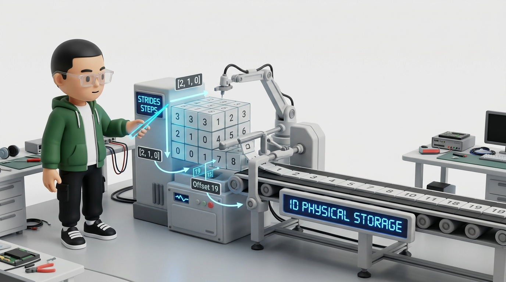
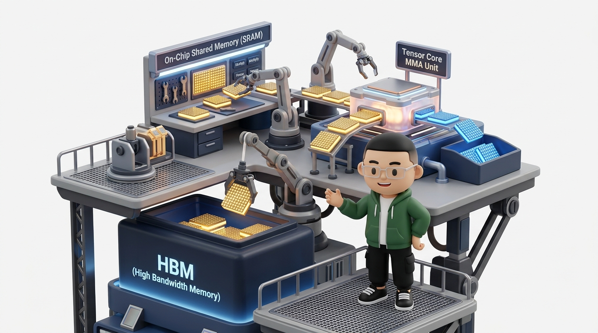
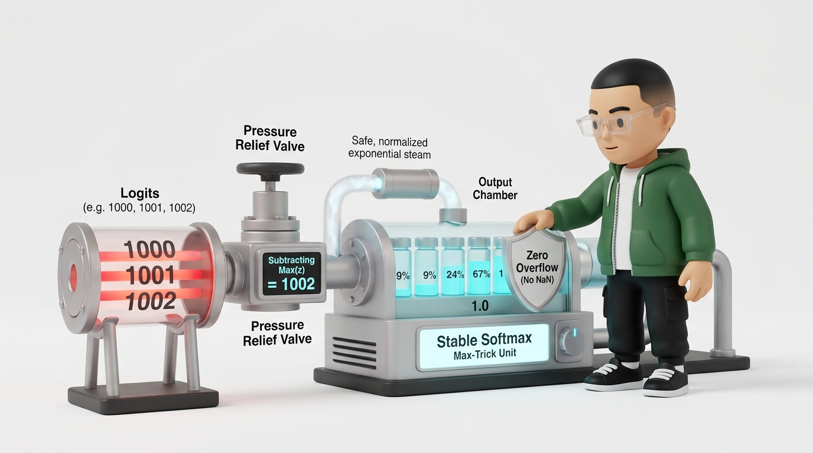

# 📐 第02讲：AI Infra 数学第一性原理——从张量物理寻址、GEMM 算力账本到自动微分与数值防爆

> **主讲人**：👓 **Ringi**（大厂 AI Infrastructure 工程师）  
> **所属模块**：Module 00: 性能工程与系统前置  
> **篇章范式**：📐 模型架构、算法与显存建模篇（Model Architecture & Memory Ledger Paradigm）  
> **核心导读**：AI Infra 不要求每天手推纯数定理，但要求看到公式时能立刻回答 **Ringi 三问**：**张量是什么 Shape？需要多少 FLOPs 计算与显存带宽？底层硬件怎样实现才稳定？** 本讲融合 6 张 16:9 手办级 3D 架构工坊插图、全流程数学手算推导、8 大工业综合算例、4 组可运行 PyTorch 验证代码与 12 道课后思考题，带你用“第一性原理”彻底击穿 AI Infra 核心数学底座！

<!-- more -->

## 📑 目录导航

- [0. Ringi 开场：AI Infra 工程师怎么看数学？](#0-ringi-开场ai-infra-工程师怎么看数学)
- [1. 学习目标、符号与三类核心工程问题](#1-学习目标符号与三类核心工程问题)
- [2. 线性代数：张量、变换、分解与物理内存布局](#2-线性代数张量变换分解与物理内存布局)
  - [2.1 标量、向量、矩阵与张量](#21-标量向量矩阵与张量)
  - [2.2 Shape、索引和 Strides 步长寻址机制](#22-shape索引和-strides-步长寻址机制)
  - [2.3 零拷贝转置与 is_contiguous 避坑](#23-零拷贝转置与-is_contiguous-避坑)
  - [2.4 逐元素运算与广播机制（Broadcast）](#24-逐元素运算与广播机制broadcast)
  - [2.5 点积与余弦相似度（Attention 几何投影）](#25-点积与余弦相似度attention-几何投影)
  - [2.6 范数（Norm）与浮点容差（atol / rtol）](#26-范数norm与浮点容差atol--rtol)
  - [2.7 矩阵乘法是一组点积](#27-矩阵乘法是一组点积)
  - [2.8 Batched Matrix Multiplication（BMM 批矩阵乘）](#28-batched-matrix-multiplicationbmm-批矩阵乘)
  - [2.9 线性变换与仿射变换](#29-线性变换与仿射变换)
  - [2.10 转置、单位矩阵与逆矩阵](#210-转置单位矩阵与逆矩阵)
  - [2.11 线性相关、张成空间与矩阵秩（Rank）](#211-线性相关张成空间与矩阵秩rank)
  - [2.12 特征值与特征向量](#212-特征值与特征向量)
  - [2.13 奇异值分解（SVD）](#213-奇异值分解svd)
  - [2.14 LoRA 的低秩参数更新原理](#214-lora-的低秩参数更新原理)
- [3. 分块矩阵与 GEMM 工程直觉](#3-分块矩阵与-gemm-工程直觉)
  - [3.1 为什么必须分块计算（Tiling）？](#31-为什么必须分块计算tiling)
  - [3.2 朴素 GEMM 计算量（2MKN）与访存灾难](#32-朴素-gemm-计算量2mkn与访存灾难)
  - [3.3 算术强度（Arithmetic Intensity）与 Roofline 瓶颈定位](#33-算术强度arithmetic-intensity与-roofline-瓶颈定位)
  - [3.4 Tile 尺寸权衡：不是越大越好](#34-tile-尺寸权衡不是越大越好)
  - [3.5 尾块（Boundary Tile）、Padding 与 Tensor Core 对齐](#35-尾块boundary-tilepadding-与-tensor-core-对齐)
  - [3.6 浮点分块结果为什么可能不逐位一致？](#36-浮点分块结果为什么可能不逐位一致)
- [4. 概率论：从随机变量到大模型生成采样](#4-概率论从随机变量到大模型生成采样)
  - [4.1 随机变量与自回归序列链式分解](#41-随机变量与自回归序列链式分解)
  - [4.2 联合概率、边缘概率与条件概率](#42-联合概率边缘概率与条件概率)
  - [4.3 独立与条件独立性](#43-独立与条件独立性)
  - [4.4 Bayes 公式](#44-bayes-公式)
  - [4.5 期望：概率加权平均及其线性性质](#45-期望概率加权平均及其线性性质)
  - [4.6 方差、标准差与 LayerNorm 总体方差](#46-方差标准差与-layernorm-总体方差)
  - [4.7 协方差、相关系数与 PCA](#47-协方差相关系数与-pca)
  - [4.8 样本均值、方差与 Mini-batch 统计](#48-样本均值方差与-mini-batch-统计)
  - [4.9 最大似然估计（MLE）与负对数似然（NLL）](#49-最大似然估计mle与负对数似然nll)
- [5. Softmax、交叉熵与信息论](#5-softmax交叉熵与信息论)
  - [5.1 Logits 的本质与 Softmax 平移不变性](#51-logits-的本质与-softmax-平移不变性)
  - [5.2 为什么计算 \(e^{1000}\) 会崩？——Stable Softmax（Max-Trick）](#52-为什么计算--会崩stable-softmaxmax-trick)
  - [5.3 LogSumExp（LSE）与交叉熵算子融合](#53-logsumexplse与交叉熵算子融合)
  - [5.4 温度参数 Temperature 物理机制](#54-温度参数-temperature-物理机制)
  - [5.5 交叉熵 Loss 计算](#55-交叉熵-loss-计算)
  - [5.6 信息熵（Entropy）](#56-信息熵entropy)
  - [5.7 KL 散度（Kullback-Leibler Divergence）](#57-kl-散度kullback-leibler-divergence)
  - [5.8 大模型困惑度（Perplexity, PPL）](#58-大模型困惑度perplexity-ppl)
  - [5.9 解码采样策略：Greedy、Top-k 与 Top-p (Nucleus)](#59-解码采样策略greedytop-k-与-top-p-nucleus)
- [6. 微积分与反向传播（Backpropagation）深度解构](#6-微积分与反向传播backpropagation深度解构)
  - [6.1 导数：局部变化率](#61-导数局部变化率)
  - [6.2 偏导数与梯度下降](#62-偏导数与梯度下降)
  - [6.3 Jacobian 雅可比矩阵与 Hessian 曲率](#63-jacobian-雅可比矩阵与-hessian-曲率)
  - [6.4 链式法则与复合函数求导](#64-链式法则与复合函数求导)
  - [6.5 计算图与反向模式自动微分（VJP）](#65-计算图与反向模式自动微分vjp)
  - [6.6 为什么反向传播需要保留中间 Activation？](#66-为什么反向传播需要保留中间-activation)
  - [6.7 线性层反向传播手算：两次 GEMM 与一次归约](#67-线性层反向传播手算两次-gemm-与一次归约)
  - [6.8 Softmax 的 Jacobian 矩阵](#68-softmax-的-jacobian-矩阵)
  - [6.9 Softmax + 交叉熵联合求导的神奇简化](#69-softmax--交叉熵联合求导的神奇简化)
  - [6.10 梯度检查（Gradient Checking）有限差分法](#610-梯度检查gradient-checking有限差分法)
- [7. 优化算法、梯度稳定性与归一化](#7-优化算法梯度稳定性与归一化)
  - [7.1 全量梯度、SGD 与 Mini-batch](#71-全量梯度sgd-与-mini-batch)
  - [7.2 动量 Momentum 机制](#72-动量-momentum-机制)
  - [7.3 Adam 与 AdamW 状态自适应与 16 字节显存账本](#73-adam-与-adamw-状态自适应与-16-字节显存账本)
  - [7.4 梯度消失与梯度爆炸物理根源](#74-梯度消失与梯度爆炸物理根源)
  - [7.5 残差连接（Residual Connection）Jacobian 恒等通路](#75-残差连接residual-connectionjacobian-恒等通路)
  - [7.6 初始化尺度与方差传播控制](#76-初始化尺度与方差传播控制)
  - [7.7 LayerNorm 算子实现](#77-layernorm-算子实现)
  - [7.8 RMSNorm 物理算子精简](#78-rmsnorm-物理算子精简)
  - [7.9 全局梯度裁剪（Gradient Clipping）与跨卡 AllReduce](#79-全局梯度裁剪gradient-clipping与跨卡-allreduce)
- [8. 数值计算与混合精度训练（Mixed Precision）](#8-数值计算与混合精度训练mixed-precision)
  - [8.1 IEEE 754 浮点编码结构表](#81-ieee-754-浮点编码结构表)
  - [8.2 精度（Precision）vs 动态范围（Dynamic Range）](#82-精度precisionvs-动态范围dynamic-range)
  - [8.3 舍入误差与机器精度 \(\epsilon_{mach}\)](#83-舍入误差与机器精度)
  - [8.4 浮点加法非结合性与并行归约误差](#84-浮点加法非结合性与并行归约误差)
  - [8.5 溢出、下溢与非有限值（NaN / inf）](#85-溢出下溢与非有限值nan--inf)
  - [8.6 灾难性消减与 Welford 在线方差算法](#86-灾难性消减与-welford-在线方差算法)
  - [8.7 条件数（Condition Number）与病态问题](#87-条件数condition-number与病态问题)
  - [8.8 混合精度训练的基本模式](#88-混合精度训练的基本模式)
  - [8.9 Loss Scaling 动态缩放原理](#89-loss-scaling-动态缩放原理)
  - [8.10 稳定算法与算子融合的天然契合](#810-稳定算法与算子融合的天然契合)
- [9. AI Infra 核心实战综合大算例（8 大全景案例）](#9-ai-infra-核心实战综合大算例8-大全景案例)
- [10. 动手实战：PyTorch 最小可运行验证代码包](#10-动手实战pytorch-最小可运行验证代码包)
- [11. Ringi 避坑指南（❌ 错误理解 vs ✅ 正确理解）](#11-ringi-避坑指南-错误理解-vs--正确理解)
- [12. 大厂 AI Infra 经典面试题与白板推导题](#12-大厂-ai-infra-经典面试题与白板推导题)
- [13. Ringi 5 点核心速记口诀、自我检验清单与 12 道课后思考题](#13-ringi-5-点核心速记口诀自我检验清单与-12-道课后思考题)
  - [14. 参考资料与经典论文](#14-参考资料与经典论文)

---

# 0. Ringi 开场：AI Infra 工程师怎么看数学？

```
                ┌─────────────────────────────────────────┐
                │          👓 Ringi 极客小剧场             │
                │ "算法研究员看公式是语义与空间投影，      │
                │  AI Infra 工程师看公式是显存与算力账本！"│
                └─────────────────────────────────────────┘
```

很多刚接触 AI Infra 的同学常问我：
> *“Ringi，做 AI 基础设施到底需要多深的数学底子？需要像算法研究员那样天天推导泛函分析和复杂的收敛性定理吗？”*

我的回答永远是：**不需要死记硬背枯燥的形式化定理，但必须对公式背后的“硬件账本”具备极强的物理直觉！**

在算法研究员眼里，一个公式代表的是模型的语义表达能力；而在大厂 AI Infra 工程师眼里，每看到一个数学公式，脑海中必须立刻闪现出 **Ringi 三问**：

```
                ┌────────────────────────────────────────────────────────┐
                │                  👓 Ringi 三问心智模型                  │
                │                                                        │
                │ 1. 📐 Shape 是什么？（输入/输出维度、Strides 步长分布）│
                │ 2. 💰 钱花在哪里？（FLOPs 计算量、显存读写与通信字节数）│
                │ 3. ⚙️ 硬件怎么跑？（SRAM 分块复用、Tensor Core、精度风险）│
                │                                                        │
                └────────────────────────────────────────────────────────┘
```


本讲我们将剥离形式化纯数证明，直接从大厂工程实践出发，系统建立 AI Infra 必需的**线性代数、概率采样、微积分自动微分与数值计算**四大数学底座！

---

# 1. 学习目标、符号与三类核心工程问题

### 1.1 学习目标
完成本章后，你将建立起顶级 AI Infra 工程师的直觉反应能力：
1. 区分标量、向量、矩阵和高阶张量，熟练推导任何算子运算前后的 Shape 与物理 Strides；
2. 解释点积、范数、矩阵乘法、秩、特征分解与 SVD 的物理直觉与工程映射；
3. 把矩阵乘法拆成 Block，从数学等价性理解 GEMM Tiling 与片上 SRAM 数据复用；
4. 熟练推导自回归生成序列的概率链式分解，编写温度采样、Top-k 与 Top-p 算法；
5. 掌握 Stable Softmax、LogSumExp 的数值防爆机制与算子融合；
6. 用链式法则读懂计算图，手推线性层反向传播，证明为什么反向计算量恰好是前向的 2 倍；
7. 洞悉 IEEE 754 浮点编码结构，掌握混合精度训练、动态 Loss Scaling 与 NaN 排查 Runbook；
8. 准确估算任何 Transformer 算子的参数量、激活量、FLOPs、访存量与算术强度（Arithmetic Intensity）。

### 1.2 本章符号对照表

| 符号 | 含义 | AI Infra 典型工程载体 |
| :--- | :--- | :--- |
| \(x\) | 标量 (Scalar) | 学习率 \(\eta\)、温度系数 \(T\)、Loss 标量值 |
| \(\mathbf{x}\) | 向量 (Vector) | 单 Token 隐藏层表示 \(\mathbf{x} \in \mathbb{R}^H\)、RMSNorm 权重 \(\gamma\) |
| \(\mathbf{X}\) | 矩阵 / 高阶张量 (Matrix / Tensor) | 权重矩阵 \(W \in \mathbb{R}^{H \times 4H}\)、批处理特征图 |
| \(X_{ij}\) | 矩阵第 \(i\) 行第 \(j\) 列元素 | 物理内存偏移 \(\text{offset} = i \cdot \text{stride}[0] + j \cdot \text{stride}[1]\) |
| \(\mathbf{X}^\top\) | 矩阵转置 | 零拷贝视图变换（Shape 与 Strides 对调） |
| \(\mathbf{X}^{-1}\) | 逆矩阵 | 线性方程组求解（工程中优先使用 LU/Cholesky 分解） |
| \(\|\mathbf{x}\|_2\) | 向量 L2 范数 | 全局梯度裁剪（Global Gradient Clip）跨卡规约 |
| \(\mathbb{E}[X]\) / \(\operatorname{Var}(X)\) | 期望与方差 | LayerNorm / RMSNorm 归一化统计量 |
| \(\nabla_{\mathbf{x}} f\) | 函数对 \(\mathbf{x}\) 的梯度向量 | 反向传播误差传递量（Backprop Gradient） |
| \(\odot\) | Hadamard 逐元素乘积 (Element-wise) | SwiGLU 门控激活、Dropout Mask 掩码 |

在分布式与大模型代码中，统一采用 **Batch-First** 记法：
- \(B\)：Batch Size（批大小）；
- \(S\)：Sequence Length（序列长度）；
- \(H\)：Hidden Size（隐藏层维度）；
- \(V\)：Vocabulary Size（词表大小）；
- \(N_h\)：Attention Head 数量；
- \(D_h = H / N_h\)：每个 Attention Head 的特征维度。

### 1.3 读公式时的 Ringi 三问
以语言模型输出投影层为例：

$$
\mathbf{Y} = \mathbf{X}\mathbf{W}, \qquad \mathbf{X} \in \mathbb{R}^{(BS) \times H}, \quad \mathbf{W} \in \mathbb{R}^{H \times V}
$$

1. **第一问：Shape 是否匹配？** 内维 \(H\) 相同，输出 Shape 是 \((BS) \times V\)。
2. **第二问：代价是多少？** 每个输出元素做 \(H\) 次乘加，计算量为 \(2BSHV\text{ FLOPs}\)。
3. **第三问：底层实现风险是什么？** 权重和输出 Logits 极大；必须考虑数据类型（FP16/BF16）、内存布局、SRAM 分块、张量并行切分与 Softmax 数值稳定性。

---

# 2. 线性代数：张量、变换、分解与物理内存布局

## 2.1 标量、向量、矩阵与张量

在 Python 层面我们操作的是 `torch.Tensor` 对象，但在物理底层硬件中，张量是**携带元数据的一维连续字节数组指针**：

```text
Physical Tensor = Data Pointer (指向虚拟显存首地址)
                + Storage Offset (偏移量)
                + Shape (各维度逻辑大小)
                + Strides (各维度物理步长)
                + Dtype (数据类型: FP32 / FP16 / BF16 / INT8)
                + Device (所在设备: cuda:0 / cpu)
                + Layout (内存排布: Strided / Sparse)
```

两个张量 Shape 相同，不代表物理内存布局相同；数值相同，也不代表 Dtype 和误差特性相同！



---

## 2.2 Shape、索引和 Strides 步长寻址机制

以一个 Shape 为 `(2, 3)` 的行主序（Row-Major）矩阵为例：

$$
\mathbf{X} = \begin{bmatrix} 1 & 2 & 3 \\ 4 & 5 & 6 \end{bmatrix}
$$

底层物理存储是一个一维连续数组：`[1, 2, 3, 4, 5, 6]`。
- **Strides 步长数组** 为 `(3, 1)`（第 0 维换行需跨越 3 个元素，第 1 维换列跨越 1 个元素）；
- **物理寻址映射公式**：
  $$
  \text{Offset}(i, j) = i \times \text{stride}[0] + j \times \text{stride}[1] = 3i + j
  $$

推广到 \(N\) 维高维张量 \(\mathbf{X} \in \mathbb{R}^{d_0 \times d_1 \times \dots \times d_{n-1}}\)，访问任意元素 \((i_0, i_1, \dots, i_{n-1})\) 的底层线性内存偏移为：

$$
\text{Linear Offset} = \sum_{k=0}^{n-1} i_k \times \text{stride}[k]
$$

---

## 2.3 零拷贝转置与 `is_contiguous` 避坑

执行转置 \(\mathbf{X}^\top\) 时：
- **Shape 变为**：`(3, 2)`；
- **Strides 变为**：`(1, 3)`；
- **物理数据完全没有搬运！**

#### 💥 避坑实战：为什么转置后调用 `.view()` 会报错？
当张量被转置后，内存中相邻逻辑元素的物理间距不再是 1（`stride[-1] != 1`），破坏了紧凑行优先顺序（`is_contiguous() == False`）。
- **`.view()`**：强制要求连续，返回共享同一 Storage 的新视图；
- **`.contiguous()`**：开辟新显存，做一次真实的全局数据深拷贝重排；
- **`.reshape()`**：若连续则调用 view，若非连续则隐式调用 contiguous。

---

## 2.4 逐元素运算与广播机制（Broadcast）

逐元素加法 \(\mathbf{C} = \mathbf{A} + \mathbf{B}\) 要求两矩阵 Shape 相同。而广播机制允许张量在特定维度虚拟扩展：

$$
\mathbf{X} \in \mathbb{R}^{B \times S \times H}, \quad \mathbf{b} \in \mathbb{R}^{H} \implies \mathbf{Y} = \mathbf{X} + \mathbf{b} \in \mathbb{R}^{B \times S \times H}
$$

从尾部维度向前对齐时，每对维度必须满足：
1. 两者大小相等；或
2. 至少一个大小为 1；或
3. 某一方不存在该维度。

- **物理实现**：\(\mathbf{b}\) 在底层并未复制 \(B \times S\) 份，而是被赋予了 `stride[0]=0, stride[1]=0, stride[2]=1` 的逻辑视图；
- **语义陷阱**：若将本应为 \([B, S]\) 的张量误写为 \([S, B]\) 且某维恰好为 1，广播机制会静默运行出错误结果，不报任何异常！

---

## 2.5 点积与余弦相似度（Attention 几何投影）

两个 \(D\) 维向量的点积：

$$
\mathbf{q}^\top \mathbf{k} = \sum_{i=1}^D q_i k_i = \|\mathbf{q}\|_2 \|\mathbf{k}\|_2 \cos\theta
$$

两种经典工程直觉：
1. **加权求和**：\(\mathbf{q}\) 是加权系数，\(\mathbf{k}\) 是特征数值；
2. **方向相似性**：余弦相似度 \(\cos\theta = \frac{\mathbf{q}^\top\mathbf{k}}{\|\mathbf{q}\|_2\|\mathbf{k}\|_2}\)。

在 Transformer Self-Attention 中，\(Q\) 与 \(K\) 的点积衡量了语义匹配度；为防止随维度 \(D_h\) 增大导致点积方差膨胀、Softmax 梯度饱和消失，必须除以缩放因子 \(\sqrt{D_h}\)。

---

## 2.6 范数（Norm）与浮点容差（atol / rtol）

常见向量范数与矩阵 Frobenius 范数：
- \(L_1\) 范数：\(\|\mathbf{x}\|_1 = \sum |x_i|\)；
- \(L_2\) 范数：\(\|\mathbf{x}\|_2 = \sqrt{\sum x_i^2}\)；
- \(L_\infty\) 范数：\(\|\mathbf{x}\|_\infty = \max |x_i|\)；
- Frobenius 范数：\(\|\mathbf{A}\|_F = \sqrt{\sum_i \sum_j A_{ij}^2}\)。

在算子测试中检验两个浮点结果是否一致，必须采用复合容差公式：

$$
|\hat{y} - y| \le \text{atol} + \text{rtol} \times |y|
$$

- FP32 对齐：`atol = 1e-5, rtol = 1e-4`
- FP16 / BF16 对齐：`atol = 1e-2, rtol = 1e-2`

---

## 2.7 矩阵乘法是一组点积

若 \(\mathbf{A} \in \mathbb{R}^{M \times K}, \mathbf{B} \in \mathbb{R}^{K \times N}\)，输出 \(\mathbf{C} = \mathbf{A}\mathbf{B} \in \mathbb{R}^{M \times N}\) 的每个元素 \(C_{ij} = \sum_{k=1}^K A_{ik} B_{kj}\) 都是 \(\mathbf{A}\) 的第 \(i\) 行与 \(\mathbf{B}\) 的第 \(j\) 列的向量内积。

标准 GEMM 形式：\(\mathbf{C} \leftarrow \alpha \mathbf{A}\mathbf{B} + \beta \mathbf{C}\)。  
矩阵乘法满足结合律 \((\mathbf{A}\mathbf{B})\mathbf{C} = \mathbf{A}(\mathbf{B}\mathbf{C})\)，但不满足交换律。选择不同的乘法结合顺序，中间张量显存与 FLOPs 会有天壤之别！

---

## 2.8 Batched Matrix Multiplication（BMM 批矩阵乘）

在多头注意力（Multi-Head Attention）中：

$$
\mathbf{Q} \in \mathbb{R}^{B \times N_h \times S_q \times D_h}, \quad \mathbf{K}^\top \in \mathbb{R}^{B \times N_h \times D_h \times S_k} \implies \mathbf{Q}\mathbf{K}^\top \in \mathbb{R}^{B \times N_h \times S_q \times S_k}
$$

前两维 \((B, N_h)\) 是 Batch 维，每个 `(batch, head)` 独立并发执行一个标准的 GEMM 矩阵乘。

---

## 2.9 线性变换与仿射变换

- **严格线性变换**：\(f(a\mathbf{x} + b\mathbf{y}) = a f(\mathbf{x}) + b f(\mathbf{y})\)，对应无偏置矩阵乘 \(\mathbf{y} = \mathbf{W}\mathbf{x}\)；
- **仿射变换（Affine）**：包含偏置项 \(\mathbf{y} = \mathbf{W}\mathbf{x} + \mathbf{b}\)。  
由于连续多个线性层可以无损合并为一个大矩阵，因此**非线性激活函数（ReLU, GELU, SwiGLU）是深层网络拥有非线性拟合能力的唯一源泉**。

---

## 2.10 转置、单位矩阵与逆矩阵

- \((\mathbf{A}\mathbf{B})^\top = \mathbf{B}^\top \mathbf{A}^\top\)；
- \(\mathbf{I}\mathbf{A} = \mathbf{A}\mathbf{I} = \mathbf{A}\)；
- \(\mathbf{A}^{-1}\mathbf{A} = \mathbf{I}\)。在工程求解线性方程组 \(\mathbf{A}\mathbf{x} = \mathbf{b}\) 时，绝不显式求逆矩阵 \(\mathbf{A}^{-1}\)（计算慢且误差大），而是采用 LU / Cholesky / QR 分解直接回代求解。

---

## 2.11 线性相关、张成空间与矩阵秩（Rank）

矩阵的**秩（Rank）** \(\operatorname{rank}(\mathbf{A}) \le \min(M, N)\) 代表矩阵中线性无关的特征方向数量。  
若矩阵低秩（\(r \ll \min(M, N)\)），则矩阵存在极大的信息冗余，可以分解为 \(\mathbf{A} \approx \mathbf{U}\mathbf{V}\)（\(\mathbf{U} \in \mathbb{R}^{M \times r}, \mathbf{V} \in \mathbb{R}^{r \times N}\)），将参数量从 \(MN\) 骤降至 \(r(M+N)\)。

---

## 2.12 特征值与特征向量

对方阵 \(\mathbf{A}\)，若存在非零向量 \(\mathbf{v}\) 与标量 \(\lambda\) 使得：

$$
\mathbf{A}\mathbf{v} = \lambda \mathbf{v}
$$

则 \(\mathbf{v}\) 为特征向量，\(\lambda\) 为特征值。矩阵变换在该方向上只做缩放、不改变方向。特征值的大小决定了系统经过多层变换后信号是放大（\(\lambda > 1\)）还是衰减（\(\lambda < 1\)），直接关联到梯度爆炸与消失。

---

## 2.13 奇异值分解（SVD）

任意实矩阵 \(\mathbf{A} \in \mathbb{R}^{M \times N}\) 都可以进行奇异值分解：

$$
\mathbf{A} = \mathbf{U} \mathbf{\Sigma} \mathbf{V}^\top
$$

其中 \(\mathbf{\Sigma}\) 对角线上是降序排列的奇异值 \(\sigma_1 \ge \sigma_2 \ge \dots \ge 0\)。截断前 \(r\) 个最大奇异值得到的矩阵 \(\mathbf{A}_r\) 是该矩阵在 Frobenius 范数下的**理论最优秩-\(r\) 近似**。

---

## 2.14 LoRA 的低秩参数更新原理

对预训练大模型权重 \(\mathbf{W}_0 \in \mathbb{R}^{d_{out} \times d_{in}}\)，LoRA 冻结 \(\mathbf{W}_0\)，仅训练低秩增量矩阵：

$$
\mathbf{W} = \mathbf{W}_0 + \Delta \mathbf{W} = \mathbf{W}_0 + \frac{\alpha}{r} \mathbf{B}\mathbf{A}, \quad \mathbf{A} \in \mathbb{R}^{r \times d_{in}}, \quad \mathbf{B} \in \mathbb{R}^{d_{out} \times r}
$$

以 \(d_{in} = d_{out} = 4096, r = 16\) 为例：
- 原全量参数：\(4096 \times 4096 = 16,777,216\)（约 16.7M 参数）；
- LoRA 参数量：\(16 \times (4096 + 4096) = 131,072\)（约 0.13M 参数）；
- **参数量缩减了 99.22%**！极大地节省了微调时的可训练参数与 AdamW 显存开销。

---

# 3. 分块矩阵与 GEMM 工程直觉

## 3.1 为什么必须分块计算（Tiling）？



GPU 的计算速度（Tensor Core 达到数百 TFLOPS）远快于显存带宽（HBM 仅数 TB/s）。
分块（Tiling）的核心思想是：**将大矩阵切分成适合放入片上高速 Shared Memory（SRAM）的小块，在 SRAM 内重复利用数百次，极大降低对全局 HBM 的重复读写请求！**

把矩阵沿 \(M, N, K\) 维度切分成 Block：

$$
\mathbf{C}_{11} = \mathbf{A}_{11}\mathbf{B}_{11} + \mathbf{A}_{12}\mathbf{B}_{21}
$$

每个输出块沿 \(K\) 维度累加局部乘积，改变了计算次序与数据搬运路径，但数学目标完全等价。

---

## 3.2 朴素 GEMM 计算量（2MKN）与访存灾难

对于 \(\mathbf{A}(M \times K) \times \mathbf{B}(K \times N)\)：
- 输出元素数：\(MN\)；
- 每个元素执行 \(K\) 次乘法与 \(K\) 次加法；
- **总计算量**：
  $$
  \text{FLOPs} = 2MKN
  $$
- 若无 Tiling 分块，每个元素重复从 HBM 读取，访存字节数为 \(2(MKN + KNM) \times \text{sizeof(dtype)}\)，将直接导致 GPU 算力严重饥饿！

---

## 3.3 算术强度（Arithmetic Intensity）与 Roofline 瓶颈定位

$$
\text{Arithmetic Intensity (AI)} = \frac{\text{FLOPs}}{\text{Bytes Transferred from HBM}} \quad (\text{FLOPs/Byte})
$$

对于理想分块优化的 FP16 GEMM：

$$
AI \approx \frac{2MKN}{2(MK + KN + MN)} = \frac{MKN}{MK + KN + MN}
$$

| 场景 | 典型尺寸 | 算术强度 AI | 硬件瓶颈类型 | 优化方向 |
| :--- | :--- | :---: | :---: | :--- |
| **训练 / Prefill** | \(M=4096, N=4096, K=4096\) | \(\approx 1365 \text{ FLOPs/B}\) | **Compute Bound** (算力受限) | 榨干 Tensor Core、增大 Tile |
| **单 Token Decode** | \(M=1, N=4096, K=4096\) | \(\approx 1 \text{ FLOPs/B}\) | **Memory Bound** (带宽受限) | 算子融合、KV Cache 量化、PagedAttention |

---

## 3.4 Tile 尺寸权衡：不是越大越好

更激进的 Tile 尺寸虽然提高了数据复用率，但会消耗巨量的片上 Shared Memory 和寄存器，导致每个 SM 能够同时驻留的 Active Block / Warp 数量暴跌（Occupancy 降低），丧失了隐藏指令延迟的能力。必须在**数据复用、占用率与边界开销**之间寻找最佳平衡点。

---

## 3.5 尾块（Boundary Tile）、Padding 与 Tensor Core 对齐

当矩阵维度无法被 Tile 大小整除时，边界线程会越界。工业级实现通常：
1. **边界 Mask 保护**：增加分支判断（略微增加控制开销）；
2. **硬件 Padding 对齐**：NVIDIA Tensor Core MMA 指令要求 \(M, N, K\) 最好是 **8、16 或 64 的整数倍**。将 Vocab 从 32001 Padding 到 32256，端到端吞吐量反而提升 10% 以上！

---

## 3.6 浮点分块结果为什么可能不逐位一致？

实数加法满足结合律，但浮点加法**不满足结合律**（\((a+b)+c \ne a+(b+c)\)）。  
不同的 Tile 划分、Warp 规约树顺序与 Tensor Core 累加路径会微调浮点累加次序。因此：优化后的 CUDA Kernel 与参考实现之间存在微小数值差异是完全正常的，必须使用 `atol + rtol` 进行验证。

---

# 4. 概率论：从随机变量到大模型生成采样

## 4.1 随机变量与自回归序列链式分解

大语言模型在数学上是一个条件概率模型。由概率论乘法法则：

$$
P(x_1, x_2, \dots, x_T) = \prod_{t=1}^T P(x_t \mid x_1, \dots, x_{t-1})
$$

- **训练阶段**：并行输入全部历史 Token，一次性计算全序列交叉熵；
- **推理阶段**：每一步自回归采样出下一个 Token 并追加到末尾。

---

## 4.2 联合概率、边缘概率与条件概率

- **联合概率**：\(P(X=x, Y=y)\)；
- **边缘概率**：\(P(X=x) = \sum_y P(X=x, Y=y)\)；
- **条件概率**：\(P(X=x \mid Y=y) = \frac{P(X=x, Y=y)}{P(Y=y)}\)。

---

## 4.3 独立与条件独立性

若 \(P(X, Y) = P(X)P(Y)\)，则两变量独立。分布式数据并行（DDP）与随机采样均基于样本独立同分布（i.i.d.）假设。

---

## 4.4 Bayes 公式

$$
P(X \mid Y) = \frac{P(Y \mid X)P(X)}{P(Y)}
$$

先验（Prior）、似然（Likelihood）与后验（Posterior）的概率转化枢纽。

---

## 4.5 期望：概率加权平均及其线性性质

离散期望：\(\mathbb{E}[X] = \sum_x x P(X=x)\)。  
**线性性质**：\(\mathbb{E}[aX + bY] = a\mathbb{E}[X] + b\mathbb{E}[Y]\)（不要求 \(X, Y\) 独立！）。大模型训练的优化目标即为最小化真实数据分布上的期望损失。

---

## 4.6 方差、标准差与 LayerNorm 总体方差

方差公式：\(\operatorname{Var}(X) = \mathbb{E}[(X-\mu)^2] = \mathbb{E}[X^2] - \mu^2\)。  
深度学习算子中统一采用**除以 \(H\) 的总体方差**：

$$
\sigma^2 = \frac{1}{H}\sum_{i=1}^H (x_i - \mu)^2
$$

---

## 4.7 协方差、相关系数与 PCA

协方差矩阵 \(\mathbf{\Sigma} = \mathbb{E}[(\mathbf{x}-\boldsymbol{\mu})(\mathbf{x}-\boldsymbol{\mu})^\top]\) 对称半正定。主成分分析（PCA）通过对协方差矩阵做特征分解，提取方差最大的主成分方向。

---

## 4.8 样本均值、方差与 Mini-batch 统计

用 Mini-batch 样本均值 \(\bar{x} = \frac{1}{B}\sum_{i=1}^B x_i\) 近似全量分布。分布式训练时，不同 Rank 必须通过全局规约才能得到准确统计量。

---

## 4.9 最大似然估计（MLE）与负对数似然（NLL）

$$
\mathcal{L}_{NLL} = - \sum_{t=1}^T \log P_\theta(x_t \mid x_{<t})
$$

对数将连乘转化为求和，从根本上防止了浮点下溢。

---

# 5. Softmax、交叉熵与信息论

## 5.1 Logits 的本质与 Softmax 平移不变性

Logits \(z \in \mathbb{R}^V\) 经过 Softmax 转换为概率：

$$
P_i = \frac{e^{z_i}}{\sum_{j=1}^V e^{z_j}}
$$

**平移不变性**：\(\operatorname{Softmax}(z + C) = \operatorname{Softmax}(z)\)。

---

## 5.2 为什么计算 \(e^{1000}\) 会崩？——Stable Softmax（Max-Trick）



当 \(z_i > 88.7\) 时，FP32 会溢出为 `inf`。
**Max-Trick 稳定化**：令 \(m = \max_j (z_j)\)，计算：

$$
P_i = \frac{e^{z_i - m}}{\sum_{j=1}^V e^{z_j - m}}
$$

最大输入变为 \(0\)，\(e^0 = 1\)，彻底杜绝溢出！

---

## 5.3 LogSumExp（LSE）与交叉熵算子融合

$$
\operatorname{LSE}(z) = \log \sum_{j=1}^V e^{z_j} = m + \log \sum_{j=1}^V e^{z_j - m}
$$

融合算子直接计算 \(\log \operatorname{Softmax}(z)_i = z_i - \operatorname{LSE}(z)\)，避免生成巨大的中间概率张量。

---

## 5.4 温度参数 Temperature 物理机制

$$
P_i(T) = \frac{e^{z_i / T}}{\sum_j e^{z_j / T}}
$$

- \(T \to 0\)：退化为 Greedy Search（贪心）；
- \(T = 1\)：原生概率分布；
- \(T > 1\)：分布平坦，富有创造力。

---

## 5.5 交叉熵 Loss 计算

真实分布 \(\mathbf{q}\) 与模型分布 \(\mathbf{p}\) 的交叉熵：\(H(\mathbf{q}, \mathbf{p}) = -\sum_i q_i \log p_i\)。对于 One-hot 标签 \(y\)，简化为 \(\mathcal{L} = -\log p_y\)。

---

## 5.6 信息熵（Entropy）

$$
H(\mathbf{p}) = - \sum_i p_i \log p_i
$$

衡量系统的不确定性。当均匀分布时熵最大（\(\log V\)），当完全确定时熵为 0。

---

## 5.7 KL 散度（Kullback-Leibler Divergence）

$$
D_{KL}(\mathbf{q} \parallel \mathbf{p}) = \sum_i q_i \log \frac{q_i}{p_i} \ge 0
$$

交叉熵可分解为：\(H(\mathbf{q}, \mathbf{p}) = H(\mathbf{q}) + D_{KL}(\mathbf{q} \parallel \mathbf{p})\)。在 RLHF / PPO 中用于约束新旧策略的偏移。

---

## 5.8 大模型困惑度（Perplexity, PPL）

$$
\text{PPL} = e^{\bar{\mathcal{L}}}
$$

表示模型在预测下一个词时平均面临的“有效候选词数”。

---

## 5.9 解码采样策略：Greedy、Top-k 与 Top-p (Nucleus)

- **Greedy**：选择最大 Logit 对应的词；
- **Top-k**：截取概率最大的前 \(k\) 个词；
- **Top-p**：按概率降序累加，截取累计概率达到 \(p\)（如 0.9）的动态最小子集。

---

# 6. 微积分与反向传播（Backpropagation）深度解构

## 6.1 导数：局部变化率

$$
f'(x) = \lim_{h \to 0} \frac{f(x+h) - f(x)}{h}
$$

---

## 6.2 偏导数与梯度下降

梯度 \(\nabla_\theta \mathcal{L}\) 指示函数上升最快方向，更新公式：\(\theta_{t+1} = \theta_t - \eta \nabla_\theta \mathcal{L}\)。

---

## 6.3 Jacobian 雅可比矩阵与 Hessian 曲率

- **Jacobian**：\(\mathbf{J}_{ij} = \frac{\partial y_i}{\partial x_j}\)（一阶偏导矩阵）；
- **Hessian**：\(\mathbf{H}_{ij} = \frac{\partial^2 f}{\partial x_i \partial x_j}\)（二阶曲率矩阵）。

---

## 6.4 链式法则与复合函数求导

$$
\frac{dy}{dx} = \frac{dy}{du} \cdot \frac{du}{dx}
$$

---

## 6.5 计算图与反向模式自动微分（VJP）

PyTorch 采用反向模式自动微分（Vector-Jacobian Product），从标量 Loss 逆向遍历 DAG，仅需 1 次反向即可求出所有参数梯度。

---

## 6.6 为什么反向传播需要保留中间 Activation？


线性层权重梯度公式为 \(\frac{\partial L}{\partial W} = X^\top G\)。前向输入 \(X\) 必须一直保存在显存中直到反向计算完成，这是训练显存开销的核心大头！

---

## 6.7 线性层反向传播手算：两次 GEMM 与一次归约

设前向：\(Y = XW + b\)，上游梯度为 \(G = \frac{\partial L}{\partial Y}\)：

1. **输入梯度（GEMM 1）**：
   $$
   \frac{\partial L}{\partial X} = G \cdot W^\top \in \mathbb{R}^{B \times d_{in}} \quad (\text{FLOPs: } 2B \cdot d_{in} \cdot d_{out})
   $$
2. **权重梯度（GEMM 2）**：
   $$
   \frac{\partial L}{\partial W} = X^\top \cdot G \in \mathbb{R}^{d_{in} \times d_{out}} \quad (\text{FLOPs: } 2d_{in} \cdot B \cdot d_{out})
   $$
3. **偏置梯度（Reduction）**：
   $$
   \frac{\partial L}{\partial b} = \sum_{i=1}^B G_{i, :} \in \mathbb{R}^{d_{out}}
   $$

> 💡 **核心定理**：前向 1 次 GEMM（\(2P\) FLOPs），反向 2 次 GEMM（\(4P\) FLOPs），反向计算量恰好是前向的 **2 倍**！

---

## 6.8 Softmax 的 Jacobian 矩阵

$$
\mathbf{J}_{softmax} = \operatorname{diag}(\mathbf{p}) - \mathbf{p}\mathbf{p}^\top, \quad \frac{\partial p_i}{\partial z_j} = p_i(\delta_{ij} - p_j)
$$

---

## 6.9 Softmax + 交叉熵联合求导的神奇简化

$$
\frac{\partial \mathcal{L}}{\partial z_i} = P_i - y_i
$$

若真实标签为 \(y\)，梯度即为预测概率减真实标签，误差越大修正力度越大！

---

## 6.10 梯度检查（Gradient Checking）有限差分法

$$
\frac{\partial f}{\partial x_i} \approx \frac{f(\mathbf{x} + \epsilon \mathbf{e}_i) - f(\mathbf{x} - \epsilon \mathbf{e}_i)}{2\epsilon}
$$

用于检验手写 CUDA/C++ 反向算子的数学正确性。

---

# 7. 优化算法、梯度稳定性与归一化

## 7.1 全量梯度、SGD 与 Mini-batch

经验风险最小化使用 Mini-batch 梯度 \(\hat{g} = \frac{1}{B}\sum_{i \in \mathcal{B}} \nabla_\theta L_i(\theta)\) 进行随机估计更新。

---

## 7.2 动量 Momentum 机制

$$
\mathbf{v}_t = \beta \mathbf{v}_{t-1} + (1-\beta) \mathbf{g}_t, \quad \theta_{t+1} = \theta_t - \eta \mathbf{v}_t
$$

平滑短期噪声，在持续一致的梯度方向上加速。

---

## 7.3 Adam 与 AdamW 状态自适应与 16 字节显存账本

AdamW 维护一阶矩 \(m_t\) 与二阶矩 \(v_t\)。对于每个模型参数：
- 模型权重（FP16）：\(2\text{ 字节}\)
- 梯度（FP16）：\(2\text{ 字节}\)
- FP32 Master Weights：\(4\text{ 字节}\)
- FP32 Momentum \(m_t\)：\(4\text{ 字节}\)
- FP32 Variance \(v_t\)：\(4\text{ 字节}\)
- **总显存消耗**：\(2 + 2 + 4 + 4 + 4 = 16\text{ 字节 / 参数}\)！

---

## 7.4 梯度消失与梯度爆炸物理根源

深层网络反向传播是多个 Jacobian 矩阵的连乘：\(\frac{\partial L}{\partial h_0} = \frac{\partial L}{\partial h_L} \prod_{l=1}^L \frac{\partial h_l}{\partial h_{l-1}}\)。矩阵谱半径持续偏离 1 将引发指数级衰减或爆炸。

---

## 7.5 残差连接（Residual Connection）Jacobian 恒等通路

残差块 \(y = x + F(x)\) 的 Jacobian 矩阵为 \(\frac{\partial y}{\partial x} = \mathbf{I} + \frac{\partial F}{\partial x}\)。单位阵 \(\mathbf{I}\) 提供了无阻碍的梯度高速通道，使得千层深度的网络依然能够稳定训练。

---

## 7.6 初始化尺度与方差传播控制

Xavier / Kaiming 初始化根据 \(1/\sqrt{\text{fan\_in}}\) 控制方差传递，防止深层前向信号饱和或归零。

---

## 7.7 LayerNorm 算子实现

$$
\operatorname{LayerNorm}(x_i) = \gamma_i \frac{x_i - \mu}{\sqrt{\sigma^2 + \epsilon}} + \beta_i
$$

减均值并除以标准差，需要 2 次跨维度规约（均值与方差）。

---

## 7.8 RMSNorm 物理算子精简

$$
\operatorname{RMSNorm}(x_i) = \gamma_i \frac{x_i}{\sqrt{\frac{1}{H}\sum x_i^2 + \epsilon}}
$$

不减均值，仅需 1 次规约，Kernel 访存显著精简。

---

## 7.9 全局梯度裁剪（Gradient Clipping）与跨卡 AllReduce

$$
\mathbf{g} \leftarrow \mathbf{g} \cdot \min\left(1, \frac{C}{\|\mathbf{g}\|_2 + \epsilon}\right)
$$

在分布式训练中，汇总所有显卡上的全局梯度范数必须触发一次跨节点的 `AllReduce` 通信。

---

# 8. 数值计算与混合精度训练（Mixed Precision）

## 8.1 IEEE 754 浮点编码结构表

| 格式 | 总位数 | 指数位 | 尾数位 | 动态范围 | 最小正非零值 | 最大绝对值 | 工业用途 |
| :--- | :---: | :---: | :---: | :---: | :---: | :---: | :--- |
| **FP32** | 32 | 8 | 23 | \(\approx 10^{\pm 38}\) | \(1.4 \times 10^{-45}\) | \(3.4 \times 10^{38}\) | 优化器主权重、高精基准 |
| **TF32** | 19 | 8 | 10 | \(\approx 10^{\pm 38}\) | \(1.4 \times 10^{-45}\) | \(3.4 \times 10^{38}\) | Tensor Core 内部硬件计算 |
| **FP16** | 16 | 5 | 10 | \(\approx 10^{\pm 5}\) | \(5.96 \times 10^{-8}\) | **65,504** | 精度高但范围窄，需 Loss Scale |
| **BF16** | 16 | 8 | 7 | \(\approx 10^{\pm 38}\) | \(1.4 \times 10^{-45}\) | \(3.4 \times 10^{38}\) | **现代大模型首选训练精度** |
| **FP8 (E4M3)** | 8 | 4 | 3 | \(\approx 10^{\pm 2}\) | \(0.00195\) | 448 | Hopper 前向 GEMM 加速 |
| **FP8 (E5M2)** | 8 | 5 | 2 | \(\approx 10^{\pm 5}\) | \(5.96 \times 10^{-8}\) | 57,344 | 反向梯度计算 |

---

## 8.2 精度（Precision）vs 动态范围（Dynamic Range）

- **指数位决定动态范围**：防止数值溢出（`inf`）或下溢（0）；
- **尾数位决定精度**：减少微小数值相加时的舍入截断误差。

---

## 8.3 舍入误差与机器精度 \(\epsilon_{mach}\)

二进制无法精确表示很多十进制小数（如 `0.1 + 0.2 != 0.3`）。当更新量 \(\delta\) 远小于主权重 \(x\) 的最小可表示步进时，\(\operatorname{fl}(x + \delta) = x\)，更新会被直接抹杀！

---

## 8.4 浮点加法非结合性与并行归约误差

\(\text{fl}(\text{fl}(a + b) + c) \ne \text{fl}(a + \text{fl}(b + c))\)。多 GPU 并行规约次序轻微变动会导致分布式训练的 Loss 在末尾几位小数无法逐位一致。

---

## 8.5 溢出、下溢与非有限值（NaN / inf）

排查 Loss 变成 `NaN` 时，必须定位**第一个**非有限张量，常见根源包括除零、开负数方根、未缩放的 Attention 打分与 FP16 动态 Loss Scale 超调。

---

## 8.6 灾难性消减与 Welford 在线方差算法

避免使用 \(\operatorname{Var}(X) = \mathbb{E}[X^2] - (\mathbb{E}[X])^2\)（两接近大数相减丢失有效位）。采用 Welford 增量算法保持数值单遍稳定：

$$
\delta = x_n - \mu_{n-1}, \quad \mu_n = \mu_{n-1} + \frac{\delta}{n}, \quad M_{2,n} = M_{2,n-1} + \delta(x_n - \mu_n)
$$

---

## 8.7 条件数（Condition Number）与病态问题

矩阵条件数 \(\kappa(\mathbf{A}) = \|\mathbf{A}\| \|\mathbf{A}^{-1}\|\) 描述输入扰动对输出的放大倍数。区分“问题本身的病态性”与“算法实现的数值稳定性”。

---

## 8.8 混合精度训练的基本模式

1. 大型 GEMM 输入采用 FP16/BF16，走 Tensor Core；
2. 乘加累加器在内部采用 FP32 累加；
3. Softmax、LayerNorm 与优化器状态保持 FP32。

---

## 8.9 Loss Scaling 动态缩放原理


前向 Loss 放大 \(S=65536\) 倍，反向求导后再除以 \(S\)，解决 FP16 梯度下溢问题。若检测到溢出则跳过本次更新并调小 \(S\)。

---

## 8.10 稳定算法与算子融合的天然契合

Stable Softmax、Welford 方差与 Fused CrossEntropy 不仅解决了数值稳定性，更通过减少 HBM 读写搬运极大提升了端到端性能。

---

# 9. AI Infra 核心实战综合大算例（8 大全景案例）

### 9.1 算例一：Transformer 线性层的 Shape、FLOPs 与显存代价
设 \(B=8, S=2048, H=4096\)，线性层权重 \(W \in \mathbb{R}^{H \times 4H}\)（\(4096 \times 16384\)）：
- **输入张量展平**：\(X' \in \mathbb{R}^{(BS) \times H} = \mathbb{R}^{16384 \times 4096}\)；
- **前向计算量**：\(2 \cdot (BS) \cdot H \cdot 4H = 8BSH^2 = 8 \times 8 \times 2048 \times 4096^2 \approx 2.20 \times 10^{12}\text{ FLOPs} \approx 2.20\text{ TFLOPs}\)；
- **反向计算量**：\(2 \times 2.20 = 4.40\text{ TFLOPs}\)。

---

### 9.2 算例二：多头 Attention 完整维度与 \(O(S^2)\) 显存爆炸推导
从输入 \(X \in \mathbb{R}^{B \times S \times H}\) 生成 \(Q, K, V \in \mathbb{R}^{B \times N_h \times S \times D_h}\)：
- **分数矩阵**：\(S = \frac{QK^\top}{\sqrt{D_h}} \in \mathbb{R}^{B \times N_h \times S \times S}\)；
- **显存占用（FP16）**：\(2 B N_h S^2\text{ 字节}\)；
- **当 \(B=1, N_h=32, S=32768\) 时**：
  $$
  2 \times 1 \times 32 \times 32768^2 = 68,719,476,736\text{ 字节} = 64\text{ GiB}！
  $$
- **结论**：这就是为什么长上下文必须用 FlashAttention（不显式物化 \(S \times S\) 矩阵）！

---

### 9.3 算例三：为什么 Attention 点积必须除以 \(\sqrt{D_h}\)？
假设 \(q_i, k_i \sim \mathcal{N}(0, 1)\) 独立同分布：
- 点积 \(q^\top k = \sum_{i=1}^{D_h} q_i k_i\) 的方差为 \(\operatorname{Var}(q^\top k) = D_h\)；
- 标准差为 \(\sqrt{D_h}\)。除以 \(\sqrt{D_h}\) 使方差恢复为 1，避免 Softmax 进入极端饱和区导致梯度消失。

---

### 9.4 算例四：Online Softmax 分块状态合并推导（FlashAttention 数学核心）
将 Logits 拆成多个 Tile 块。已处理部分的状态为 \((m, l)\)（最大值与指数和），新 Tile 块状态为 \((m_b, l_b)\)：
1. **全局最大值更新**：\(m_{new} = \max(m, m_b)\)；
2. **指数和重标定合并**：
   $$
   l_{new} = e^{m - m_{new}} l + e^{m_b - m_{new}} l_b
   $$
这使得 Softmax 可以在片上 SRAM 分块流式完成，无需将 \(S \times S\) 写入 HBM！

---

### 9.5 算例五：LoRA 微调的参数比例与额外前向 GEMM 开销
在 \(d_{in}=d_{out}=4096\) 的线性层上加 rank=16 LoRA：
- 参数量占比仅为 \(\frac{16(4096+4096)}{4096^2} \approx 0.78\%\)；
- 在线推理需多执行 2 次小矩阵乘：\(x \cdot A^\top ([BS, 16])\) 与 \((xA^\top) \cdot B^\top ([BS, 4096])\)；
- 部署时可将 \(B A\) 离线合并回主权重消除额外延迟。

---

### 9.6 算例六：分布式训练中为什么全局均值必须加权？
Rank 0 处理 7 个有效 Token（Loss 均值 2.0），Rank 1 处理 5 个有效 Token（Loss 均值 3.0）：
- **错误算法**：简单平均 \((2.0 + 3.0) / 2 = 2.5\)；
- **正确算法**：加权平均 \(\frac{7 \times 2.0 + 5 \times 3.0}{7 + 5} = \frac{29}{12} \approx 2.417\)。各 Rank 必须分别规约 `loss_sum` 与 `token_count` 后相除。

---

### 9.7 算例七：大模型训练与推理单张量显存估算公式
对于 Shape 为 \((B, S, H)\)、类型为 \(b\) 字节的张量：

$$
\text{Memory (Bytes)} = B \times S \times H \times b
$$

例如 BF16 的 \((8, 4096, 8192)\)：\(8 \times 4096 \times 8192 \times 2 = 512\text{ MiB}\)。

---

### 9.8 算例八：从数学公式到 CUDA Kernel 的 10 步工程检查表
1. 📐 输入、输出与中间张量的 Shape 分别是什么？
2. 🔄 哪些维度保留，哪些维度被归约（Reduce）？
3. 📦 算子能否分块（Tiling）？分块状态如何递推合并？
4. 💰 FLOPs 计算量与理论最小 HBM 访存量是多少？算术强度处于哪个区间？
5. ⚠️ 是否存在非连续 Strides、转置或隐式广播？
6. 🎯 哪些累加操作必须提升到 FP32 高精度？
7. 🛡️ 是否存在指数溢出、除零或灾难性消减？
8. ⚡ 中间临时张量能否通过算子融合在片上消除？
9. 📏 边界条件与非 8/16 倍数尾块如何 Padding？
10. 🧪 使用什么参考实现与复合容差（atol/rtol）进行单元测试？

---

# 10. 动手实战：PyTorch 最小可运行验证代码包

```python
import torch
import torch.nn.functional as F

print("=" * 60)
print("实战 1: 验证张量 Strides 与转置零拷贝")
print("=" * 60)
x = torch.arange(6, dtype=torch.float32).reshape(2, 3)
print(f"原张量 X:\n{x}")
print(f"Shape: {x.shape}, Strides: {x.stride()}, is_contiguous: {x.is_contiguous()}")

xt = x.t()
print(f"\n转置张量 XT:\n{xt}")
print(f"Shape: {xt.shape}, Strides: {xt.stride()}, is_contiguous: {xt.is_contiguous()}")
print(f"物理内存地址是否相同: {x.data_ptr() == xt.data_ptr()}")

print("\n" + "=" * 60)
print("实战 2: 验证 Naive Softmax 溢出 vs Stable Softmax")
print("=" * 60)
big_logits = torch.tensor([1000.0, 1001.0, 1002.0])

# Naive Softmax
naive_exp = torch.exp(big_logits)
print(f"Naive Softmax (溢出 NaN): {naive_exp / torch.sum(naive_exp)}")

# Stable Softmax
max_val = torch.max(big_logits)
stable_exp = torch.exp(big_logits - max_val)
print(f"Stable Softmax (完美稳定): {stable_exp / torch.sum(stable_exp)}")

print("\n" + "=" * 60)
print("实战 3: 验证手写线性层反向传播梯度与 PyTorch Autograd 对齐")
print("=" * 60)
B, Din, Dout = 2, 3, 4
X = torch.randn(B, Din, requires_grad=True)
W = torch.randn(Din, Dout, requires_grad=True)
b = torch.randn(Dout, requires_grad=True)

Y = torch.matmul(X, W) + b
loss = Y.sum()
loss.backward()

G = torch.ones_like(Y)
dX_manual = torch.matmul(G, W.t())
dW_manual = torch.matmul(X.t(), G)
db_manual = G.sum(dim=0)

print(f"dX 对齐绝对误差: {(X.grad - dX_manual).abs().max().item():.2e}")
print(f"dW 对齐绝对误差: {(W.grad - dW_manual).abs().max().item():.2e}")
print(f"db 对齐绝对误差: {(b.grad - db_manual).abs().max().item():.2e}")

print("\n" + "=" * 60)
print("实战 4: 验证 FP16 小梯度下溢与 Loss Scale 恢复")
print("=" * 60)
small_grad = torch.tensor(1e-6, dtype=torch.float32)
print(f"FP32 小梯度: {small_grad.item():.2e} -> FP16 下溢结果: {small_grad.to(torch.float16).item()} (丢失!)")

scale = 1024.0
scaled_grad = (small_grad * scale).to(torch.float16)
print(f"Loss Scale 放大并还原后的结果: {(scaled_grad.to(torch.float32) / scale).item():.2e} (精度完美保留!)")
```

---

# 11. Ringi 避坑指南（❌ 错误理解 vs ✅ 正确理解）

| 场景 | ❌ 常见小白错误理解 | ✅ 大厂 AI Infra 正确理解 | 为什么？ |
| :--- | :--- | :--- | :--- |
| **张量转置** | “转置会把显存数据重新搬运一遍，很耗时。” | 转置只修改 Shape 和 Strides 元数据，是**零拷贝**。 | 物理连续数组未动，仅修改步长计算公式。 |
| **反向传播** | “反向传播只是求个导数，计算量比前向小。” | 反向传播计算量（\(4P\) FLOPs）是前向（\(2P\) FLOPs）的 **2 倍**！ | 1 个前向线性层需 1 次 GEMM；反向要求导 \(dX\) 与 \(dW\)，需要 **2 次 GEMM**。 |
| **浮点格式** | “BF16 比 FP16 先进，所以 BF16 的数值精度更高。” | BF16 的精度（7位尾数）**低于** FP16（10位尾数），但动态范围更大。 | BF16 用 8 位指数换取了防溢出能力，牺牲了微小精度。 |
| **GPU 利用率** | “`nvidia-smi` 看到 GPU-Util 100%，说明算力跑满了。” | GPU-Util 只表示硬件有线程活动，不代表 Tensor Core 在全速计算。 | 算子受限于访存（Memory Bound）时，大部分周期 SM 都在等待读写 HBM。 |

---

# 12. 大厂 AI Infra 经典面试题与白板推导题

### 题 1【概念题】：为什么 PyTorch 自定义 CUDA 算子通常要求输入张量必须是 `contiguous` 的？
- **思考路径**：
  1. CUDA 线程通常用一维全局索引 `idx = blockIdx.x * blockDim.x + threadIdx.x`；
  2. 如果张量非连续（如转置过），物理地址与一维线性索引脱节，直接按指针偏移读取会读到错误数据；
  3. 连续张量才能实现相邻线程访问相邻显存地址，触发 GPU 关键的 **Memory Coalescing（全局内存合并访问）**。

---

### 题 2【白板推导题】：请现场手推一个线性层 \(Y = XW\) 的反向传播公式并给出 FLOPs。
- **思考路径**：
  1. 写出 \(X \in [B, K], W \in [K, N], Y \in [B, N]\)；
  2. 前向计算量：\(2BKN\) FLOPs；
  3. 上游梯度 \(G = \frac{\partial L}{\partial Y} \in [B, N]\)；
  4. 推导 \(\frac{\partial L}{\partial X} = G \cdot W^\top \in [B, K]\)（计算量 \(2BKN\)）；
  5. 推导 \(\frac{\partial L}{\partial W} = X^\top \cdot G \in [K, N]\)（计算量 \(2BKN\)）；
  6. 结论：反向总计算量为 \(4BKN\) FLOPs，是前向的 2 倍。

---

### 题 3【性能工程题】：大模型 Decode 阶段为什么不能充分利用 GPU 算力？从数学角度如何解释？
- **思考路径**：
  1. 列出算术强度公式 \(AI = \frac{2MKN}{2(MK + KN + MN)}\)；
  2. 指出 Decode 阶段每次只输入 1 个 Token，此时 \(M=1\)；
  3. 将 \(M=1\) 带入公式，化简得到 \(AI \approx 1\text{ FLOP/Byte}\)；
  4. 结合 H100 硬件 Roofline 拐点（\(150\text{ FLOPs/Byte}\)），得出 Decode 是极度严重的 Memory-bound，算子大部分时间在等权重和 KV Cache 从 HBM 搬运。

---

### 题 4【系统设计题】：在千卡混合精度训练中，为什么 AdamW 优化器需要为每个参数消耗 16 字节显存？
- **思考路径**：
  1. 模型前向/反向权重与梯度使用 FP16/BF16（各 2 字节）；
  2. AdamW 优化器为了数值稳定，维护 **FP32 Master Weights（4 字节）**；
  3. 维护 **FP32 一阶动量 Momentum \(m_t\)（4 字节）**；
  4. 维护 **FP32 二阶方差 Variance \(v_t\)（4 字节）**；
  5. 加上 FP16 梯度本身的 2 字节与 FP16 权重的 2 字节，参数相关总显存为 \(2 + 2 + 4 + 4 + 4 = 16\text{ 字节/参数}\)！

---

# 13. Ringi 5 点核心速记口诀、自我检验清单与 12 道课后思考题

```text
       ┌────────────────────────────────────────────────────────────┐
       │             👓 Ringi 数学基础 5 点核心速记                 │
       │                                                            │
       │ 1. 张量本质一维串，Strides 步长连成线，转置零拷慎 view 变。  │
       │ 2. GEMM 算力两倍乘，Tiling 分块片上转，尺寸对齐八倍算。     │
       │ 3. Softmax 必减最大值，LogSumExp 融合显存省。              │
       │ 4. 反向求导两次乘，激活常驻显存沉，重算技术换乾坤。        │
       │ 5. BF16 范围保平稳，Adam 细账精累加，混合精度把效提。      │
       └────────────────────────────────────────────────────────────┘
```

### ✅ 自我检验清单
- [ ] 看到 `(B, S, H) @ (H, V)` 能立即写出输出 Shape 与 \(2BSHV\) FLOPs
- [ ] 能区分逐元素乘、点积、矩阵乘与 Batched Matmul
- [ ] 能根据 Shape 和 Strides 准确计算任意位置的物理内存线性偏移
- [ ] 能解释范数、秩、特征值与奇异值分解 SVD 的物理直觉
- [ ] 能推导低秩分解与 LoRA 的参数量缩减比例
- [ ] 能从 Block 矩阵乘法解释 GEMM Tiling 的数学等价性
- [ ] 能估算 GEMM 的 FLOPs、理论最小 HBM 访存量与算术强度
- [ ] 能推导自回归语言模型的概率乘法链式分解
- [ ] 能手写数值稳定的 Stable Softmax 与 LogSumExp
- [ ] 能说明交叉熵、信息熵与 KL 散度的数学联系
- [ ] 能用链式法则手推线性层对输入 \(X\)、权重 \(W\) 和偏置 \(b\) 的梯度公式
- [ ] 知道 Softmax + 交叉熵对 Logits 的梯度是优雅的 \(P_i - y_i\)
- [ ] 能解释残差连接 Jacobian 恒等通路为何能解决深层梯度消失
- [ ] 能区分 IEEE 754 中精度与动态范围的物理权衡
- [ ] 能说明 FP16 为什么必须搭配 Loss Scaling，而 BF16 通常不需要
- [ ] 能解释为什么浮点非结合性导致分布式训练 Loss 无法逐位一致
- [ ] 能从 Attention Shape 推导 \(O(S^2)\) 显存爆炸（\(S=32k\) 需 64GB）
- [ ] 能根据 10 步工程检查表完成一个新算子的系统性能剖析

---

### 📝 12 道课后深度思考题
1. 推导 `(B, Nh, Sq, Dh) @ (B, Nh, Dh, Sk)` 的输出 Shape，并指出 Batch 维与归约维。
2. 给定 \(M=4096, K=4096, N=16384\) 的 FP16 GEMM，计算总 FLOPs 与理想最小 HBM 输入输出字节数。
3. 编写程序验证 \(\operatorname{Softmax}(z + c) = \operatorname{Softmax}(z)\)，并比较 Naive 实现与 Stable 实现在超大 Logits 下的差异。
4. 从 Softmax Jacobian 矩阵与交叉熵 Loss 开始，在白板上手推 \(\frac{\partial L}{\partial z_i} = P_i - y_i\)。
5. 推导 \(Y = \operatorname{GELU}(XW + b)\) 的反向 Shape 传播链路。
6. 比较 FP16、BF16 和 FP32 对序列 `[1.0, 1e-3, 1e-3, ...]` 求和时的舍入误差，并改变累加求和顺序观察结果。
7. 实现 Welford 方差增量算法，与经典公式 \(\mathbb{E}[X^2] - (\mathbb{E}[X])^2\) 在“大均值、极小方差”数据上进行数值精度对比。
8. 对一个 \(4096 \times 4096\) 的全连接权重，计算 Rank 8、16、64 LoRA 的参数比例和额外前向 FLOPs。
9. 计算 \(B=2, N_h=32, S=8192, D_h=128\) 时显式物化 FP16 Attention Score 矩阵所需的显存大小。
10. 两个 Rank 分别处理 7 个和 5 个有效 Token，局部 Loss 均值分别为 2.0 和 3.0；计算正确的全局均值，并说明为什么简单平均是错的。
11. 使用有限差分中心差分法验证手写线性层反向算子，尝试不同扰动步长 \(\epsilon\) 并观察截断误差与舍入误差的权衡。
12. 任意挑选一个 PyTorch 常用算子，按照本讲的“10 步工程检查表”撰写一份一页纸系统性能分析报告。

---

## 14. 参考资料与经典论文

- 📖 **Deep Learning Book**: [Chapter 2 Linear Algebra](https://www.deeplearningbook.org/contents/linear_algebra.html), [Chapter 3 Probability](https://www.deeplearningbook.org/contents/prob.html), [Chapter 4 Numerical Computation](https://www.deeplearningbook.org/contents/numerical.html)
- 📄 **Matrix Calculus**: *Matrix Calculus for Deep Learning* (Parr & Howard, arXiv:1802.01528)
- 📄 **Automatic Differentiation**: *Automatic Differentiation in Machine Learning: a Survey* (Baydin et al., JMLR 2017)
- 📄 **Mixed Precision Training**: *Mixed Precision Training* (Micikevicius et al., ICLR 2018)
- 📄 **LoRA 论文**: *LoRA: Low-Rank Adaptation of Large Language Models* (Hu et al., ICLR 2022)
- 📄 **FlashAttention 论文**: *FlashAttention: Fast and Memory-Efficient Exact Attention with IO-Awareness* (Dao et al., NeurIPS 2022)
- 📚 **PyTorch 源码**: `torch/csrc/autograd/` & `aten/src/ATen/native/`

