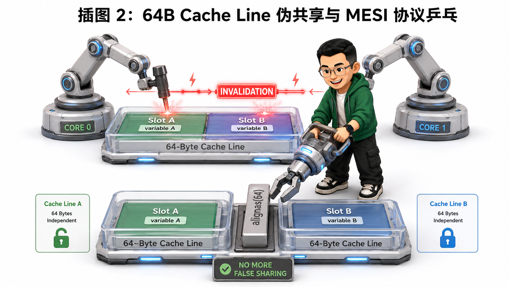
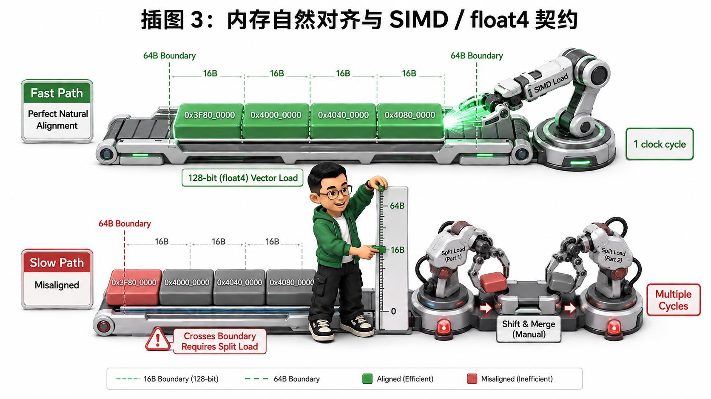
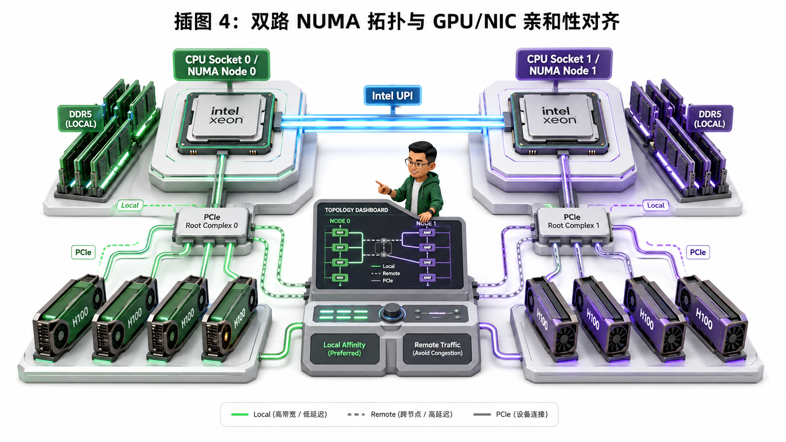

# 🏛️ 第03讲：计算机体系结构前置——CPU 存储层次、Cache Line 与 NUMA 架构

> **主讲人**：👓 **Ringi**（大厂 AI Infrastructure 工程师）  
> **所属模块**：Module 00: 性能工程与系统前置  
> **篇章范式**：🏛️ 性能工程与系统前置篇（Performance Engineering & System Baseline）  
> **核心导读**：在大模型分布式训练与高并发推理中，GPU 算力利用率（MFU）低下往往不是因为 GPU 算子写得不够好，而是因为主机 CPU 端与数据流水线发生了严重阻塞（CPU Bubble）！从 CPU 存储金字塔（L1/L2/L3/DRAM）、64 字节 Cache Line、MESI 缓存一致性与伪共享风暴，到内存自然对齐、NUMA 跨 Socket 拓扑绑定以及 Pinned Memory 锁页 DMA 传输，本讲带你用大厂工程师的第一性原理彻底击穿 CPU 与内存架构，消灭数据搬运瓶颈。

```text
=================================================================================================
                                  Ringi 3D 架构工坊 · 核心全景
┌───────────────────────────────────────────────────────────────────────────────────────────────┐
│                                                                                               │
│    [CPU Socket 0 / NUMA Node 0]                    [CPU Socket 1 / NUMA Node 1]              │
│   ┌───────────────────────────┐                   ┌───────────────────────────┐               │
│   │ Core 0..31 (L1/L2 Cache)  │                   │ Core 32..63 (L1/L2 Cache) │               │
│   │ └── Shared L3 Cache (LLC) │   UPI / QPI 互联   │ └── Shared L3 Cache (LLC) │               │
│   │ └── Local DDR5 Controller │◄─────────────────►│ └── Local DDR5 Controller │               │
│   └─────────────┬─────────────┘ (延迟翻倍/带宽腰斩)└─────────────┬─────────────┘               │
│                 │ PCIe RC                                        │ PCIe RC                    │
│   ┌─────────────┴─────────────┐                   ┌─────────────┴─────────────┐               │
│   │ GPU 0..3 (Pinned DMA 高速)│                   │ GPU 4..7 (Pinned DMA 高速)│               │
│   └───────────────────────────┘                   └───────────────────────────┘               │
│                                                                                               │
└───────────────────────────────────────────────────────────────────────────────────────────────┘
=================================================================================================
```

<!-- more -->

## 📑 目录导航

- [0. Ringi 开场：GPU 饿死往往是因为 CPU 没喂饱！](#0-ringi-开场gpu-饿死往往是因为-cpu-没喂饱)
  - [0.1 大模型训练中的经典怪象：GPU 利用率忽高忽低](#01-大模型训练中的经典怪象gpu-利用率忽高忽低)
  - [0.2 算力与搬运的物理鸿沟：Host-to-Device 瓶颈](#02-算力与搬运的物理鸿沟host-to-device-瓶颈)
  - [0.3 为什么 AI Infra 工程师必须精通 CPU 体系结构？](#03-为什么-ai-infra-工程师必须精通-cpu-体系结构)
- [1. 经典计算机存储层次（Memory Hierarchy）与纳秒级时间账本](#1-经典计算机存储层次memory-hierarchy与纳秒级时间账本)
  - [1.1 存储金字塔：从纳秒（ns）到毫秒（ms）的物理鸿沟](#11-存储金字塔从纳秒ns到毫秒ms的物理鸿沟)
  - [1.2 局部性原理：时间局部性（Temporal）与空间局部性（Spatial）](#12-局部性原理时间局部性temporal与空间局部性spatial)
  - [1.3 CPU Cache 硬件映射原理：Direct-Mapped、Set-Associative 与 Fully-Associative](#13-cpu-cache-硬件映射原理direct-mappedset-associative-与-fully-associative)
  - [1.4 为什么现代 CPU 统一采用 64 字节 Cache Line？](#14-为什么现代-cpu-统一采用-64-字节-cache-line)
- [2. 缓存一致性与伪共享（False Sharing）性能陷阱](#2-缓存一致性与伪共享false-sharing性能陷阱)
  - [2.1 MESI 协议与总线嗅探（Bus Snooping）底层流转](#21-mesi-协议与总线嗅探bus-snooping底层流转)
  - [2.2 什么是伪共享？两个独立变量为何引发总线风暴？](#22-什么是伪共享两个独立变量为何引发总线风暴)
  - [2.3 伪共享在多线程 C++ 与 DataLoader 多 Worker 中的真实破坏力](#23-伪共享在多线程-c-与-dataloader-多-worker-中的真实破坏力)
  - [2.4 消除伪共享的黄金法则：`alignas(64)`、Padding 填充与线程私有化](#24-消除伪共享的黄金法则alignas64padding-填充与线程私有化)
- [3. 内存对齐（Memory Alignment）与 SIMD / GPU 向量化](#3-内存对齐memory-alignment与-simd--gpu-向量化)
  - [3.1 自然对齐（Natural Alignment）的硬件第一性原理](#31-自然对齐natural-alignment的硬件第一性原理)
  - [3.2 跨 Cache Line / 跨页非对齐访问的惩罚代价](#32-跨-cache-line--跨页非对齐访问的惩罚代价)
  - [3.3 C/C++ 结构体内存对齐规则与结构体瘦身实战](#33-cc-结构体内存对齐规则与结构体瘦身实战)
  - [3.4 CPU AVX-512 / AVX2 与 GPU `float4` / `int4` 向量化加载对齐契约](#34-cpu-avx-512--avx2-与-gpu-float4--int4-向量化加载对齐契约)
- [4. NUMA（非统一内存访问架构）深度剖析与拓扑感知](#4-numa非统一内存访问架构深度剖析与拓扑感知)
  - [4.1 从 SMP 对称多处理到 NUMA 架构的演进必然](#41-从-smp-对称多处理到-numa-架构的演进必然)
  - [4.2 双路 / 多路服务器物理拓扑：Socket、本地内存控制器与 UPI/QPI 互联总线](#42-双路--多路服务器物理拓扑socket本地内存控制器与-upiqpi-互联总线)
  - [4.3 本地访问 vs 远程跨 Socket 访问：延迟翻倍与带宽腰斩](#43-本地访问-vs-远程跨-socket-访问延迟翻倍与带宽腰斩)
  - [4.4 Linux NUMA 内存分配策略（Local Alloc / Interleave / Preferred / Bind）](#44-linux-numa-内存分配策略local-alloc--interleave--preferred--bind)
  - [4.5 PCIe 拓扑与 NUMA 对齐：Root Complex（RC）与 GPU / NIC 亲和性](#45-pcie-拓扑与-numa-对齐root-complexrc与-gpu--nic-亲和性)
  - [4.6 跨 Socket 灾难：当 GPU 0 挂在 Socket 0，而 DataLoader 线程跑在 Socket 1 时会发生什么？](#46-跨-socket-灾难当-gpu-0-挂在-socket-0而-dataloader-线程跑在-socket-1-时会发生什么)
- [5. 主机内存与 GPU 显存的高速通道：Pinned Memory、DMA 与 GPUDirect](#5-主机内存与-gpu-显存的高速通道pinned-memorydma-与-gpudirect)
  - [5.1 Pageable Memory（可分页内存）vs Pinned Memory（锁页内存）](#51-pageable-memory可分页内存vs-pinned-memory锁页内存)
  - [5.2 为什么 GPU DMA 必须访问物理连续且不被换页的 Pinned Memory？](#52-为什么-gpu-dma-必须访问物理连续且不被换页的-pinned-memory)
  - [5.3 `cudaMemcpyAsync` 与 `DataLoader(pin_memory=True, non_blocking=True)` 的异步流水线重叠机制](#53-cudamemcpyasync-与-dataloaderpin_memorytrue-non_blockingtrue-的异步流水线重叠机制)
  - [5.4 GPUDirect Storage (GDS) 与 GPUDirect RDMA：绕过 CPU 的直通高速路](#54-gpudirect-storage-gds-与-gpudirect-rdma绕过-cpu-的直通高速路)
- [6. 动手实战与排障调优工具箱（Hands-on Benchmark & Production Tuning）](#6-动手实战与排障调优工具箱hands-on-benchmark--production-tuning)
  - [6.1 工具箱 1：Linux NUMA 与 CPU 拓扑探测实战（`lscpu`, `numactl`, `numastat`, `nvidia-smi topo -m`）](#61-工具箱-1linux-numa-与-cpu-拓扑探测实战lscpu-numactl-numastat-nvidia-smi-topo--m)
  - [6.2 实战 2：C++ 测量不同步长遍历数组的 Cache Line 阶梯时延（L1/L2/L3/DRAM 实测）](#62-实战-2c-测量不同步长遍历数组的-cache-line-阶梯时延l1l2l3dram-实测)
  - [6.3 实战 3：C++ 伪共享性能压测与 `alignas(64)` 优化前后对比](#63-实战-3c-伪共享性能压测与-alignas64-优化前后对比)
  - [6.4 实战 4：PyTorch DataLoader CPU 核心亲和性绑定与 NUMA 拓扑对齐脚本](#64-实战-4pytorch-dataloader-cpu-核心亲和性绑定与-numa-拓扑对齐脚本)
- [7. Ringi 避坑指南与大厂经典面试题](#7-ringi-避坑指南与大厂经典面试题)
  - [7.1 避坑表格（❌ 常见小白错误理解 vs ✅ 大厂 AI Infra 正确理解）](#71-避坑表格-常见小白错误理解-vs--大厂-ai-infra-正确理解)
  - [7.2 4 道大厂硬核体系结构与 AI Infra 面试题（附白板推导、系统设计与标准答题路径）](#72-4-道大厂硬核体系结构与-ai-infra-面试题附白板推导系统设计与标准答题路径)
- [8. Ringi 5 点核心速记口诀、自我检验清单与课后深度思考题](#8-ringi-5-点核心速记口诀自我检验清单与课后深度思考题)
- [9. 📚 参考资料与经典论文](#9--参考资料与经典论文)

---

# 0. Ringi 开场：GPU 饿死往往是因为 CPU 没喂饱！

## 0.1 大模型训练中的经典怪象：GPU 利用率忽高忽低

刚进入大厂做 AI Infra 时，我和很多同学一样，把 90% 的精力都放在了 GPU 算子调优（CUDA / Triton）、Tensor Core 利用率、FlashAttention 和 NCCL 通信优化上。

但在一次 8 卡 H100 训练多模态大模型（Vision-Language Model）的集群排障中，监控系统报出了一个诡异的现象：

- GPU 算力利用率（`Volatile GPU-Util`）呈现剧烈的**“锯齿状震荡”**：前 1 秒飙到 98%，接下来 2 秒直接跌到 10% 甚至 0%；
- 查看 GPU Kernel 的执行耗时，每个 GEMM 算子都跑在理论峰值的 85% 以上，Kernel 本身没有任何性能劣化；
- 用 PyTorch Profiler 抓取 Timeline，赫然发现：**GPU 在大量的时间片内处于完全空闲状态（GPU Idle），都在等待 CPU 把下一个 Batch 的张量从 Host 端搬运到 Device 端！**

这就是 AI 系统工程中著名的 **CPU 气泡（CPU Bubble）** 或 **数据供给饥饿（Data Ingestion Starvation）**。


---

## 0.2 算力与搬运的物理鸿沟：Host-to-Device 瓶颈

我们来算一笔真实的系统账本：

- **GPU 端算力**：单张 NVIDIA H100 SXM 拥有高达 **989 TFLOPS** 的 BF16 Tensor Core 密集算力，其片上 HBM3 显存带宽高达 **3.35 TB/s**；
- **主机总线带宽**：PCIe 5.0 x16 的理论单向带宽仅为 **64 GB/s**（双向 128 GB/s）；
- **CPU 内存带宽**：单路 8 通道 DDR5-4800 理论峰值约 **307 GB/s**；如果跨越 CPU Socket（NUMA 跨插槽），跨片 UPI 总线带宽直接骤降至 **64~80 GB/s**。

```text
+---------------------------------------------------------------------------------------+
|  硬件层次        | 典型容量             | 访问延迟 (Latency) | 物理吞吐带宽 (Bandwidth)       |
+------------------+---------------------+-------------------+-------------------------------+
|  CPU 寄存器      | 几 KB               | ~0.5 - 1 ns       | ~10 TB/s (片内超宽总线)        |
|  L1 Data Cache   | 32 - 48 KB / core   | ~1 - 1.5 ns       | ~3 - 5 TB/s (核心私有)        |
|  L2 Cache        | 1 - 2 MB / core     | ~3 - 5 ns         | ~1.5 - 2 TB/s (核心私有/共享)  |
|  L3 Cache (LLC)  | 32 - 128 MB 共享    | ~12 - 25 ns       | ~400 - 800 GB/s (片上 Ring/Mesh)|
|  主存 (DDR5)     | 256 GB - 2 TB       | ~60 - 100 ns      | ~200 - 300 GB/s (Local NUMA)  |
|  跨 Socket DRAM  | 远端 NUMA 内存       | ~120 - 180 ns     | ~60 - 120 GB/s (跨 UPI/QPI)   |
|  PCIe 5.0 x16    | Host <-> GPU 总线   | ~500 - 1000 ns    | 64 GB/s (单向理论)            |
|  NVMe SSD (GDS)  | 4 - 30 TB           | ~10 - 50 μs       | 7 - 14 GB/s                   |
+---------------------------------------------------------------------------------------+
```

从 CPU 寄存器的 **0.5 ns** 到主内存的 **100 ns**，差了整整 **200 倍**；到 PCIe 传输与磁盘，差了 **10000 倍以上**！

如果 CPU 端的 Tokenizer、数据增强（Data Augmentation）、DataLoader 多进程多线程写出恶性内存访问模式（如 **False Sharing 伪共享**、**非对齐访存**、**跨 NUMA 插槽内存访问**），CPU 准备一个 Batch 就要花 50 毫秒，而 GPU 计算该 Batch 只需要 5 毫秒。结果就是：**GPU 计算 5ms，干等 45ms！**

---

## 0.3 为什么 AI Infra 工程师必须精通 CPU 体系结构？

许多初学者误以为：“AI Infra 只属于 GPU 和网络。”  
实际上，在真正的生产级大厂基础设施中：

1. **数据加载底座（Data Pipeline）**：Megatron-LM、vLLM、DeepSpeed 的 DataLoader 和 Prefill 阶段调度器全运行在 CPU 上；
2. **异构内存管理（Heterogeneous Memory Management）**：ZeRO-Offload、Llama.cpp、vLLM CPU-Offloading、Kimi 级长文本缓存换入换出，完全由 CPU 内存与 PCIe DMA 吞吐决定生死；
3. **拓扑感知调度（Topology-Aware Scheduling）**：Kubernetes / Slurm 调度器如果不做 CPU 核心与 GPU/NIC 的 NUMA 拓扑绑定，分布式训练吞吐可能直接腰斩！

理解 CPU 存储层次、Cache Line 机制与 NUMA 拓扑，不是可选的加分项，而是**写出工业级高性能系统代码的第一道物理底座**。

---

# 1. 经典计算机存储层次（Memory Hierarchy）与纳秒级时间账本

## 1.1 存储金字塔：从纳秒（ns）到毫秒（ms）的物理鸿沟

为了让抽象的纳秒（ns）建立起工程师的物理直觉，计算机体系结构宗师 Jim Gray 曾提出过著名的**“时钟周期放大类比法”**：

> 💡 **Ringi 的物理直觉放大镜**：  
> 假设 CPU 执行一条寄存器指令（1 个时钟周期，约 0.33 ns）相当于 **“心跳 1 次（1 秒钟）”**：
>
> - **访问 L1 Cache（~1 ns）**：相当于从自己的**上衣口袋**掏出一支笔（花费 **3 秒**）；
> - **访问 L2 Cache (~4 ns)**：相当于站起身从**身后的书架**取一本书（花费 **12 秒**）；
> - **访问 L3 Cache (~15 ns)**：相当于下楼去**楼下咖啡机**倒一杯咖啡（花费 **45 秒**）；
> - **访问主内存 DRAM (~90 ns)**：相当于离开大楼，**步行 10 分钟**到街角便利店买便当（花费 **4.5 分钟**）；
> - **跨 Socket 远程 NUMA DRAM (~180 ns)**：相当于**骑自行车 10 分钟**去隔壁街区（花费 **9 分钟**）；
> - **从 NVMe SSD 读取数据 (~20 μs)**：相当于坐高铁从**北京去上海出差 1 个月**（花费 **17 小时**）；
> - **从机械硬盘或跨机房网络读取 (~10 ms)**：相当于人类文明经历 **1 年的漫长岁月**！

```text
[CPU Core (ALU/FPU)] ◄── 0.5ns (极快, 几KB)
        ▲
        │ 1ns, 32-48KB
   [L1 Cache] (Core 私有)
        ▲
        │ 3-5ns, 1-2MB
   [L2 Cache] (Core 私有/小集群共享)
        ▲
        │ 12-25ns, 32-128MB
   [L3 Cache (LLC)] (Socket 内所有 Core 共享, Ring/Mesh 总线)
        ▲
        │ 60-100ns (Local) / 120-180ns (Remote UPI)
   [Main Memory (DDR4/DDR5 DRAM)] (GB ~ TB)
        ▲
        │ 10-50μs (PCIe Gen5 x4 / NVMe)
   [PCIe NVMe SSD / Storage Class Memory]
        ▲
        │ 100μs - 10ms (TCP/IP, RoCEv2, InfiniBand)
   [Distributed Storage / Remote Object Store (S3/Ceph)]
```

作为 AI Infra 工程师，我们的核心使命就是：**让热点计算与数据最大程度驻留在 L1/L2/L3 甚至 GPU 片上 Shared Memory (SRAM) 中，绝对不要无谓地落入主内存与外存的“时间黑洞”。**

---

## 1.2 局部性原理：时间局部性（Temporal）与空间局部性（Spatial）

现代计算机层次化存储能以极高的性价比运行，完全依赖于程序执行的两大基本物理特征——**局部性原理（Principle of Locality）**：

1. **时间局部性（Temporal Locality）**：
   - _定义_：被访问过一次的内存位置，在不久的将来极有可能被再次访问。
   - _AI Infra 场景_：Transformer 的权重矩阵 $W$ 在同一个 Batch 内被所有 Token 共享；自回归解码中的当前 Token $Q$ 向量在 Attention 计算中反复与所有历史 $K$ 向量做点积。
2. **空间局部性（Spatial Locality）**：
   - _定义_：如果一个内存位置被访问，其物理上相邻的内存位置很快也会被访问。
   - _AI Infra 场景_：连续读取张量的一行数据（行优先连续存储）、按顺序加载 Token IDs、顺序遍历 Embedding 向量。

为了最大化利用空间局部性，CPU 硬件设计了一个至关重要的物理单位：**Cache Line（缓存行）**。

---

## 1.3 CPU Cache 硬件映射原理：Direct-Mapped、Set-Associative 与 Fully-Associative

CPU 从内存加载数据时，绝不是按单个字节（Byte）去抓取的，而是**以固定大小的 Cache Line 为最小原子单位进行搬运**。在几乎所有现代 x86_64（Intel / AMD）与 ARM64 服务器上，**Cache Line 大小均为 64 字节（64 Bytes = 512 Bits）**。

一个物理内存地址在硬件 Cache 中是如何寻址的？CPU 会将 64 位物理地址切分为三个字段：

```text
64-bit 物理内存地址划分：
+------------------------------------+--------------------------+-----------------------+
|          Tag (标记位)               |    Set Index (组索引)    |  Line Offset (块内偏移)|
|         [63 ............. 12]      |       [11 ...... 6]      |      [5 ...... 0]     |
+------------------------------------+--------------------------+-----------------------+
                ▲                                 ▲                         ▲
                │                                 │                         │
      唯一标识物理块归属               定位到 Cache 的哪一个 Set         定位 64B 内的第几个字节
                                     (例如 64 Sets = 6 bits)           (2^6 = 64 Bytes)
```

Cache 的硬件组织方式分为三种经典形态：

```text
┌─────────────────────────┬─────────────────────────┬─────────────────────────┐
│ 1. 直接映射 (Direct)     │ 2. 组相联 (Set-Assoc)   │ 3. 全相联 (Fully-Assoc) │
│                         │   (现代 CPU 最通用)     │                         │
│  Index -> 唯一固定 Line  │  Index -> 包含 N 个 Line │  无 Index，任意位置可用 │
│  [Set 0] -> [Line A]    │  [Set 0] -> [Line A|B]  │  [Line 0]               │
│  [Set 1] -> [Line B]    │  [Set 1] -> [Line C|D]  │  [Line 1] ... [Line N]  │
│  (命中快, 但极易冲突失效) │  (平衡冲突与硬件硬件复杂度)│  (无冲突, 但硬件检索代价极高)│
└─────────────────────────┴─────────────────────────┴─────────────────────────┘
```

| 映射方式                            | 特点                                                | 命中查找耗时                | 冲突缺失率（Conflict Miss）  | 工业应用场景                                                  |
| ----------------------------------- | --------------------------------------------------- | --------------------------- | ---------------------------- | ------------------------------------------------------------- |
| **直接映射（Direct-Mapped）**       | 每个内存块只能放入唯一固定的 Cache Line             | 极快（单次比较）            | 极高（两个同余地址互相驱逐） | 极少单独用于现代高性能 CPU                                    |
| **组相联（N-Way Set-Associative）** | 映射到固定组（Set），组内有 $N$ 个路（Way）可供放置 | 较快（并行比对 $N$ 个 Tag） | 低（平衡了硬件延迟与命中率） | 现代 CPU L1（8-way）、L2（8/16-way）、L3（16/24-way）标准架构 |
| **全相联（Fully-Associative）**     | 内存块可放入 Cache 内的任意位置                     | 慢（需全局 CAM 硬件比对）   | 最低（仅存在容量失效）       | TLB（页表缓存）等微型高速缓存                                 |

---

## 1.4 为什么现代 CPU 统一采用 64 字节 Cache Line？

为什么不是 8 字节，也不是 4096 字节？这是一个经典的**计算机体系结构工程 Trade-off**：

- **如果 Cache Line 太小（如 8 字节）**：
  - 空间局部性收益极低；每次读取连续数组都需要触发多次 Cache Miss 和总线仲裁；
  - 硬件 Tag 存储开销占比急剧上升（每个 8B 都要存一个 40+ 位的 Tag，硬件极其浪费）。
- **如果 Cache Line 太大（如 1024 字节）**：
  - 搬运延迟过高：每次 Miss 都需要在慢速 DRAM 上读取 1KB，阻塞流水线；
  - 缓存污染（Cache Pollution）：如果程序是随机离散访存（如哈希表查询、稀疏矩阵），加载 1024 字节只用了其中 4 字节，浪费了 99.6% 的有效缓存容量与总线带宽。
- **64 字节的黄金平衡点**：
  - 刚好能放下 16 个单精度浮点数（`float32`）、8 个双精度浮点数（`float64`）、或者 32 个半精度浮点数（`fp16/bf16`）；
  - 完美匹配现代 DDR 内存的 Burst Length 突发传输模式（DDR4/DDR5 每次 Burst Transfer 刚好传输 64 字节）。

---

# 2. 缓存一致性与伪共享（False Sharing）性能陷阱

## 2.1 MESI 协议与总线嗅探（Bus Snooping）底层流转

在现代多核 CPU 中，每个核心（Core）拥有独立的私有 L1 和 L2 Cache。当多个核心同时读取和修改同一个物理内存地址时，如何保证所有核心看到的内存数据是一致的？

硬件层面采用经典的 **MESI 缓存一致性协议（Modified, Exclusive, Shared, Invalid）**：

```text
                         +-----------------------------------+
                         |           [I] Invalid             | (初始/已失效)
                         +-----------------------------------+
                                │                     ▲
                   本地读 Miss  │                     │ 收到其他核写广播
                   (BusRd)      │                     │ (BusInval)
                                ▼                     │
                         +-----------------------------------+
                         |            [S] Shared             | (多个核共享只读)
                         +-----------------------------------+
                                │                     ▲
                   本地写 Hit   │                     │ 本地读 Miss (BusRd)
                   (BusInval)   │                     │ 其他核也有副本
                                ▼                     │
+-----------------------------------+   本地写独占    +-----------------------------------+
|           [M] Modified            |◄────────────────|           [E] Exclusive           |
|  (当前核独占修改, 与内存不一致)     |   (无需总线广播) │  (当前核独占, 与内存完全一致)       |
+-----------------------------------+                 +-----------------------------------+
```

| 状态  | 英文全称               | 核心含义                                                      | 是否与其他核共享？ | 与 DRAM 内存是否一致？           |
| ----- | ---------------------- | ------------------------------------------------------------- | ------------------ | -------------------------------- |
| **M** | **Modified**（已修改） | 当前核心已写入该 Cache Line，为全机唯一最新副本               | 否（独占）         | **不一致**（脏数据，需稍后写回） |
| **E** | **Exclusive**（独占）  | 仅当前核心持有该 Cache Line，且未被修改                       | 否（独占）         | **一致**                         |
| **S** | **Shared**（共享）     | 多个核心的 Cache 中都缓存了该 Cache Line 副本                 | **是（共享只读）** | **一致**                         |
| **I** | **Invalid**（无效）    | 该 Cache Line 内的数据已过期，不可读取，读取将触发 Cache Miss | -                  | -                                |

**总线嗅探（Bus Snooping）机制**：每个核心都在时刻监听内部互联总线上的广播事件。一旦 Core 0 要向处于 `S` 状态的 Cache Line 写入数据，Core 0 必须向总线发出 `BusInval`（失效广播）；所有缓存了该行的其他 Core（如 Core 1）嗅探到该事件后，**必须强制将自己的 Cache Line 状态从 `S` 置为 `I`（失效）**！

---

## 2.2 什么是伪共享？两个独立变量为何引发总线风暴？



现在我们来看一个极其隐蔽、但对多线程高并发系统杀伤力巨大的性能杀手——**伪共享（False Sharing）**。

### 🚨 物理冲突根源

假设内存中有两个完全独立的变量：

- `uint64_t counter_A`（线程 0 专用累加器，8 字节）；
- `uint64_t counter_B`（线程 1 专用累加器，8 字节）。

在物理内存中，由于它们定义在相邻位置，**它们被打包放进了同一个 64 字节的 Cache Line 中**！

```text
物理内存同一个 64 字节 Cache Line (地址 0x1000 ~ 0x103F):
+--------------------+--------------------+---------------------------------------------+
| counter_A (8 Bytes)| counter_B (8 Bytes)|            剩余未用空间 (48 Bytes)          |
+--------------------+--------------------+---------------------------------------------+
        ▲                    ▲
        │                    │
    线程 0 独立修改       线程 1 独立修改
    (跑在 Core 0)        (跑在 Core 1)
```

接下来会发生什么惊心动魄的硬件灾难？

1. **时刻 T1**：Core 0 读取该 Cache Line，执行 `counter_A++`。Core 0 将该 Line 标记为 `M`（Modified），并向总线广播：将 Core 1 的该 Cache Line 置为 `I`（Invalid）；
2. **时刻 T2**：Core 1 准备执行 `counter_B++`，发现自己的 Cache Line 是 `I`（失效），触发 **Cache Miss**！Core 1 必须暂停流水线，强制让 Core 0 将脏数据写回 L3/内存，再重新加载到 Core 1；
3. **时刻 T3**：Core 1 修改 `counter_B`，又将该 Line 标记为 `M`，反向将 Core 0 的 Cache Line 置为 `I`；
4. **时刻 T4**：Core 0 再次访问 `counter_A`，又触发 Cache Miss……

两个原本在业务逻辑上**没有任何数据依赖**的独立变量，由于共享了同一个 64 字节硬件载体，导致 Cache Line 在两个核心之间像**打乒乓球（Cache Line Bouncing / Ping-Pong）一样疯狂来回搬运与强制刷新**！

---

## 2.3 伪共享在多线程 C++ 与 DataLoader 多 Worker 中的真实破坏力

这种伪共享风暴会导致：

- **CPU 私有 L1/L2 缓存完全瘫痪**：原本 1ns 的 L1 Hit 变成了 20~50ns 的跨核嗅探与 L3 仲裁；
- **总线带宽被无效的一致性广播挤爆**；
- **多线程加速比严重倒挂**：开 8 个线程跑累加，耗时竟然比单线程慢 **5~10 倍**！

在 PyTorch DataLoader 的 C++ 后端（如多线程预处理、Shared Memory IPC 状态统计计数器）中，如果多个 Worker 进程/线程共享的统计结构体未做 64 字节隔离，数据加载管道将发生严重的隐式阻塞。

---

## 2.4 消除伪共享的黄金法则：`alignas(64)`、Padding 填充与线程私有化

消除伪共享的核心原则只有一条：**强制让每个并发写变量独占一个完整的 64 字节 Cache Line！**

### 方法 1：使用 C++11 标准对齐关键字 `alignas(64)`（推荐）

```cpp
#include <cstdint>
#include <new>

// ❌ 错误示范：产生伪共享
struct BadCounter {
    uint64_t val{0}; // 8 字节，相邻紧凑排列
};

// ✅ 正确示范：强制 64 字节对齐，硬件自动填充 Padding
struct alignas(64) GoodCounter {
    uint64_t val{0}; // 独占 64 字节 Cache Line，彻底告别伪共享！
};
```

### 方法 2：显式手动 Padding 填充

```cpp
struct ManualPaddedCounter {
    uint64_t val{0};
    uint8_t  padding[56]; // 8 + 56 = 64 字节，强行撑满一个 Cache Line
};
```

---

# 3. 内存对齐（Memory Alignment）与 SIMD / GPU 向量化

## 3.1 自然对齐（Natural Alignment）的硬件第一性原理

在计算机底层，**数据存放在内存中的起始地址必须是其自身大小的整数倍**，这被称为**自然对齐（Natural Alignment）**。

- 1 字节数据（`char`, `int8`）：可存放在任意物理地址（$1 \times k$）；
- 2 字节数据（`int16`, `half`, `bfloat16`）：地址必须是 2 的倍数（地址末 1 位为 0）；
- 4 字节数据（`int32`, `float32`）：地址必须是 4 的倍数（地址末 2 位为 0）；
- 8 字节数据（`int64`, `double`, 指针）：地址必须是 8 的倍数（地址末 3 位为 0）；
- 16 字节数据（SIMD 向量 `__m128`, GPU `float4`）：地址必须是 16 的倍数（地址末 4 位为 0）。



```text
物理内存按 8 字节排布的字边界 (Word Boundaries):
地址: 0x00      0x04      0x08      0x0C      0x10
      +---------+---------+---------+---------+
      | 4B float| 4B float| 8B double uint64  |  <-- 对齐访问: 1 次总线事务即可读取
      +---------+---------+---------+---------+
地址: 0x01           0x09
      +--------------+
      | 非对齐 8B    |                           <-- 非对齐跨界: 必须触发 2 次物理访存 + 拼接
      +--------------+
```

为什么硬件对对齐如此敏感？
因为现代 CPU 内存控制器和数据总线是以 **4 字节、8 字节或 64 字节为单位对齐读取**的。如果一个 8 字节的 `double` 存放在地址 `0x0005`：

1. 硬件必须先发起一次总线读取 `0x0000 ~ 0x0007`；
2. 再发起第二次总线读取 `0x0008 ~ 0x000F`；
3. CPU 内部的对齐逻辑单元（Alignment Network）进行移位、掩码和拼接，合成为一个 64 位寄存器值。

**一次原本只需 1 个时钟周期的内存加载，变成了 2 次内存访问 + 1 次内部移位拼接，性能直接腰斩！**

---

## 3.2 跨 Cache Line / 跨页非对齐访问的惩罚代价

如果非对齐的地址刚好横跨了 **64 字节 Cache Line 边界** 甚至 **4KB 虚拟内存页（Page Boundary）**：

- **跨 Cache Line 访问（Split Lock / Split Access）**：必须同时加载两个 Cache Line，消耗双倍缓存容量，并在多核并发时可能触发硬件**总线锁（Bus Lock）**，导致整机所有核心瞬间停顿！
- **跨 Page 边界访问**：如果前一个页在物理内存中，而后一个页被操作系统换出到了磁盘（Page Fault），CPU 甚至会触发中断去读磁盘，带来微秒级甚至毫秒级的灾难性停顿。

---

## 3.3 C/C++ 结构体内存对齐规则与结构体瘦身实战

C/C++ 编译器会自动按照结构体成员的最大对齐数进行**内存填充（Structure Padding）**。

来看一个生动的算例：

```cpp
// ❌ 糟糕的结构体成员排布
struct BadTensorMeta {
    uint8_t  dtype;      // 1 字节
    // [编译器自动填充 7 字节 Padding]
    uint64_t numel;      // 8 字节 (必须对齐到 8 的倍数)
    uint8_t  device_id;  // 1 字节
    // [编译器自动填充 7 字节 Padding]
    uint64_t storage_ptr;// 8 字节
};
// sizeof(BadTensorMeta) = 1 + 7 + 8 + 1 + 7 + 8 = 32 字节！(有效数据仅 18 字节，浪费 43.7%)

// ✅ 优化后的紧凑结构体排布（按大小降序排列）
struct GoodTensorMeta {
    uint64_t numel;      // 8 字节 (偏移 0)
    uint64_t storage_ptr;// 8 字节 (偏移 8)
    uint8_t  dtype;      // 1 字节 (偏移 16)
    uint8_t  device_id;  // 1 字节 (偏移 17)
    // [尾部填充 6 字节以满足结构体 8 字节整体对齐]
};
// sizeof(GoodTensorMeta) = 8 + 8 + 1 + 1 + 6 = 24 字节！(节省 25% 内存与带宽)
```

---

## 3.4 CPU AVX-512 / AVX2 与 GPU `float4` / `int4` 向量化加载对齐契约

在 AI Infra 性能敏感算子（如 CPU 端的量化解包、GPU 端的 FlashAttention IO）中，我们大量使用 SIMD / 向量化指令：

- **CPU AVX-512**：一次加载 512 位（64 字节 = 16 个 FP32）。如果地址未做 64 字节对齐，调用 `_mm512_load_ps` 会直接触发硬件段错误（Segmentation Fault / General Protection Fault），必须退化为慢速的 `_mm512_loadu_ps`（Unaligned Load）；
- **CUDA 向量化加载**：使用 `float4`（16 字节）一次加载 4 个 float。CUDA 官方硬件规范明确规定：`float4` 指针必须严格按照 **16 字节自然对齐**。如果传入一个非 16 字节对齐的指针执行 `*(float4*)ptr`，在 GPU 硬件上将直接触发未定义行为或内存访问降速。

```cpp
// CUDA 算子开发中的典型 128-bit 向量化加载
template <typename T>
__global__ void vectorized_copy_kernel(const T* __restrict__ src, T* __restrict__ dst, int n) {
    int idx = (blockIdx.x * blockDim.x + threadIdx.x) * 4;
    if (idx + 3 < n) {
        // 必须确保 src 和 dst 物理指针满足 16 字节对齐
        float4 tmp = *reinterpret_cast<const float4*>(&src[idx]);
        *reinterpret_cast<float4*>(&dst[idx]) = tmp;
    }
}
```

---

# 4. NUMA（非统一内存访问架构）深度剖析与拓扑感知

## 4.1 从 SMP 对称多处理到 NUMA 架构的演进必然

在早期多核服务器中，采用的是 **SMP 架构（Symmetric Multi-Processing，对称多处理）**：

```text
       [Core 0]    [Core 1]    [Core 2]    [Core 3]
           │           │           │           │
           └───────────┴─────┬─────┴───────────┘
                             │ 共享系统前端总线 (Shared Front Side Bus)
                   ┌─────────┴─────────┐
                   │ 集中式内存控制器   │
                   └─────────┬─────────┘
                             │
                      [DDR 物理内存池]
```

在 SMP 架构下，所有 CPU 核心通过同一条集中式系统总线访问同一个内存池。  
当 CPU 核心数增加到 32、64、128 核时，集中式总线瞬间成为整个系统的超级瓶颈，所有核心都在争抢总线仲裁，发生了著名的 **内存墙（Memory Wall）** 坍塌。

为了突破 SMP 的物理极限，现代多路服务器全面转向了 **NUMA 架构（Non-Uniform Memory Access，非统一内存访问）**。

---

## 4.2 双路 / 多路服务器物理拓扑：Socket、本地内存控制器与 UPI/QPI 互联总线



在 NUMA 架构下，服务器被切分为多个独立的 **NUMA Node（节点）**，每个 Node 通常对应一个物理 CPU 插槽（Socket）：

- 每个 CPU Socket 内部集成了**独立的本地内存控制器（Integrated Memory Controller, IMC）**，直接连接插在自己身边的本地 DDR5 内存插槽；
- 两个 CPU Socket 之间通过点对点的高速相干互联总线连接（Intel 称为 **UPI (Ultra Path Interconnect) / QPI**，AMD 称为 **Infinity Fabric**）。

```text
+---------------------------------------------------------------------------------------------------+
|                                 双路服务器 NUMA 物理拓扑全景图                                      |
|                                                                                                   |
|    +------------------------------------+               +------------------------------------+    |
|    |      CPU Socket 0 (NUMA Node 0)    |               |      CPU Socket 1 (NUMA Node 1)    |    |
|    |  +------------------------------+  |               |  +------------------------------+  |    |
|    |  | Core 0 .. 31 (L1/L2 Cache)   |  |   Intel UPI   |  | Core 32 .. 63 (L1/L2 Cache)  |  |    |
|    |  +------------------------------+  | 互联点对点总线 |  +------------------------------+  |    |
|    |  | 共享 L3 Cache (LLC, 64MB)    |  |◄─────────────►|  | 共享 L3 Cache (LLC, 64MB)    |  |    |
|    |  +------------------------------+  | (64-80 GB/s)  |  +------------------------------+  |    |
|    |  | 本地内存控制器 (IMC 0)        |  |               |  | 本地内存控制器 (IMC 1)        |  |    |
|    |  +---------------┬--------------+  |               |  +---------------┬--------------+  |    |
|    +------------------┼-----------------+               +------------------┼-----------------+    |
|                       │ (本地内存通道, 300 GB/s, 70ns)                     │ (本地内存通道, 300 GB/s, 70ns)|
|             +---------▼---------+                             +---------▼---------+               |
|             | 本地 DDR5 内存池 0 |                             | 本地 DDR5 内存池 1 |               |
|             | (NUMA Node 0)     |                             | (NUMA Node 1)     |               |
|             +-------------------+                             +-------------------+               |
|                       │                                                 │                         |
|             +---------▼---------+                             +---------▼---------+               |
|             | PCIe Root Complex |                             | PCIe Root Complex |               |
|             +----+---------+----+                             +----+---------+----+               |
|                  │         │                                       │         │                    |
|             +----▼----+ +--▼------+                           +----▼----+ +--▼------+             |
|             | GPU 0..3| | NIC 0(IB)|                          | GPU 4..7| | NIC 1(IB)|             |
|             +---------+ +---------+                           +---------+ +---------+             |
+---------------------------------------------------------------------------------------------------+
```

---

## 4.3 本地访问 vs 远程跨 Socket 访问：延迟翻倍与带宽腰斩

在 NUMA 系统中，CPU 访问不同位置的内存，成本存在天壤之别：

- **本地访问（Local Node Access）**：Core 0 访问挂在 Socket 0 上的本地内存。请求直接通过片内总线到达 IMC，延迟仅需 **~65-75 ns**，享受满血 **~300 GB/s** 内存带宽；
- **远程访问（Remote Node Access）**：Core 0 访问挂在 Socket 1 上的远端内存。请求必须：
  1. 离开 Core 0，通过 Socket 0 片内 Mesh 路由；
  2. 跨越 Socket 间的 UPI 物理链路；
  3. 进入 Socket 1 的 IMC 读取数据；
  4. 再通过 UPI 链路将数据打包发送回 Socket 0。

```text
访问路径对比：
[本地访问] Core 0 ──────────────► IMC 0 ──────────────► 本地内存 (延迟 ~70ns, 带宽 ~300GB/s)
[远程访问] Core 0 ──► 片内总线 ──► UPI 链路 ──► IMC 1 ──► 远端内存 (延迟 ~140ns, 带宽 ~64GB/s)
```

**远程跨 Socket 访问的物理延迟直接翻倍（~140ns+），而吞吐带宽受限于 UPI 瓶颈直接骤降 60%~75%！**

---

## 4.4 Linux NUMA 内存分配策略（Local Alloc / Interleave / Preferred / Bind）

Linux 内核提供了四种核心 NUMA 内存分配策略（Memory Policy）：

| 策略名称                   | 行为特征                                                              | 适用场景                           | AI 基础设施评价                                                       |
| -------------------------- | --------------------------------------------------------------------- | ---------------------------------- | --------------------------------------------------------------------- |
| **Local Alloc（默认）**    | 线程在哪里运行，申请的内存就优先分配在当前 CPU 所在的本地 NUMA 节点上 | 通用系统默认                       | 优秀，但如果线程被操作系统调度漂移到另一个 Socket，就会沦为跨节点访问 |
| **Interleave（交叉分配）** | 将内存页以 Round-Robin 轮询方式均匀打散在所有 NUMA 节点上             | 无法做亲和性绑定的单进程大内存应用 | 牺牲了极致的本地低延迟，换取整体带宽均匀，避免单节点内存 OOM          |
| **Preferred（偏好）**      | 优先在指定的 NUMA 节点分配内存，若该节点内存耗尽，允许回退到其他节点  | 弹性服务                           | 保证稳定性，防止直接 OOM Crash                                        |
| **Bind（严格绑定）**       | 强制只能在指定的 NUMA 节点列表分配内存，若耗尽直接报 `ENOMEM` / OOM   | **高性能 AI 训练与推理**           | **大厂黄金标准**：宁可精准分配，绝不容忍跨 Socket 性能污染            |

---

## 4.5 PCIe 拓扑与 NUMA 对齐：Root Complex（RC）与 GPU / NIC 亲和性

这是很多软件工程师容易忽略的核心体系结构事实：

> **PCIe 插槽（PCIe Slot）不是悬空连接在主板上的，而是物理直连在某个特定的 CPU Socket 的 PCIe Root Complex（根复合体）上的！**

例如在一台典型的 8 卡 H100 双路服务器中：

- **Socket 0（NUMA Node 0）**：直接管理 PCIe Root Port 0~3，下挂 **GPU 0、GPU 1、GPU 2、GPU 3** 以及 **InfiniBand 网卡 `mlx5_0`**；
- **Socket 1（NUMA Node 1）**：直接管理 PCIe Root Port 4~7，下挂 **GPU 4、GPU 5、GPU 6、GPU 7** 以及 **InfiniBand 网卡 `mlx5_1`**。

---

## 4.6 跨 Socket 灾难：当 GPU 0 挂在 Socket 0，而 DataLoader 线程跑在 Socket 1 时会发生什么？

我们来还原大厂生产环境中一次真实的**“拓扑未对齐灾难”**：

```text
❌ 拓扑错配灾难链路：
[Socket 1 (NUMA 1)]                UPI 跨片链路                [Socket 0 (NUMA 0)]
┌──────────────────┐                                          ┌──────────────────┐
│ DataLoader 线程  │                                          │ GPU 0 (PCIe RC 0)│
│ (Core 32..63)    │                                          │ (进行前向反向训练) │
└────────┬─────────┘                                          └────────▲─────────┘
         │ 申请并加载数据                                               │
         ▼                                                             │ PCIe DMA 搬运
┌──────────────────┐                                                   │ (必须跨越 UPI)
│ 本地内存 Node 1   ├───────────────────────────────────────────────────┘
└──────────────────┘          严重拥塞! 延迟翻倍, GPU 算力严重饥饿 (CPU Bubble)!
```

当训练脚本启动时，操作系统随机将负责 `GPU 0` 数据加载的 DataLoader 进程调度到了 `Socket 1` 的核心上：

1. DataLoader 在 `Socket 1` 的内存池中解析并转换图像/文本张量；
2. 当执行 `tensor.cuda(0)` 时，GPU 0 的 DMA 引擎发起 PCIe 读取；
3. 由于数据位于 `Socket 1` 的内存中，PCIe 传输必须**强行穿过 CPU Socket 0 与 Socket 1 之间的 UPI 互联总线**；
4. UPI 总线带宽被庞大的训练数据流彻底打满，产生严重的排队拥塞；
5. 同时，分布式通信（NCCL）和 GPU 0 的其他控制信令也因 UPI 拥塞而发生抖动延迟；
6. **最终后果**：GPU 0 数据加载延迟从 3ms 飙升至 25ms，GPU 算力利用率从 95% 暴跌至 40%！

---

# 5. 主机内存与 GPU 显存的高速通道：Pinned Memory、DMA 与 GPUDirect

## 5.1 Pageable Memory（可分页内存）vs Pinned Memory（锁页内存）

在 Linux 操作系统中，普通的内存分配（如 `malloc`、C++ `new`、普通 PyTorch CPU Tensor）默认都是 **Pageable Memory（可分页内存）**：

- 操作系统为了最大化利用物理内存，维护着一套**虚拟内存分页机制**；
- 当物理内存紧张时，操作系统可以随时将某些不活跃的内存页换出（Swap Out）到磁盘 Swap 分区；
- 物理内存页的物理地址（Physical Address）在程序运行期间是**随时可能发生迁移和改变的**。

与此相对，**Pinned Memory（锁页内存 / Page-Locked Memory）** 是通过特殊系统调用（如 `mlock` 或 CUDA 驱动的 `cudaHostAlloc` / `cudaHostRegister`）向操作系统申请的特殊内存：

- 操作系统向硬件承诺：**这块内存在生命周期内绝对不会被换出到磁盘，且物理内存地址永久固定不变！**

---

## 5.2 为什么 GPU DMA 必须访问物理连续且不被换页的 Pinned Memory？


GPU 与 Host 内存之间的高速数据搬运，是通过 GPU 上的硬件 **DMA 引擎（Direct Memory Access，直接内存访问）** 完成的。

DMA 引擎是一个纯硬件控制器，它**只认物理内存地址，脱离 CPU 独立工作，完全不理解操作系统的复杂虚拟内存页表与缺页异常处理**！

这就导致了巨大的机制差异：

### 1. 传统 Pageable 内存传输路径（慢速两次拷贝）

如果一个 PyTorch Tensor 是普通内存：

1. GPU DMA 无法直接读取它（因为操作系统随时可能换页或改变物理地址）；
2. **第一步（CPU 强力介入）**：CUDA 驱动必须在后台临时申请一块临时的 Pinned Staging Buffer，并由 CPU 调用 `memcpy` 将数据从用户内存拷贝到 Staging Buffer；
3. **第二步（DMA 传输）**：GPU DMA 引擎从 Staging Buffer 发起 PCIe DMA 传输到 GPU HBM 显存；
4. **性能代价**：消耗双倍主机内存带宽，强行占用 CPU 算力，且**无法实现真正的异步重叠（Synchronous Blocking）**！

### 2. Pinned 锁页内存传输路径（零拷贝直达 DMA）

如果是 Pinned Memory：

1. 物理地址已知且绝对锁定；
2. GPU DMA 引擎直接通过 PCIe 总线拉取数据，**CPU 完全不参与搬运，0 额外内存拷贝，达到 PCIe 物理带宽峰值！**

```text
┌────────────────────────────────────────────────────────────────────────────────────────┐
│ 模式 1: Pageable 内存传输 (普通 Tensor, 两次拷贝, 阻塞 CPU)                                │
│ [用户 CPU 内存] ────(CPU 同步 memcpy)────► [驱动 Pinned 临时 Buffer] ────(PCIe DMA)────► [GPU HBM]│
├────────────────────────────────────────────────────────────────────────────────────────┤
│ 模式 2: Pinned 锁页内存传输 (pin_memory=True, 零拷贝直接 DMA, 异步重叠)                     │
│ [锁页 Pinned 内存] ──────────────────────────(PCIe DMA 直达)──────────────────────────► [GPU HBM]│
└────────────────────────────────────────────────────────────────────────────────────────┘
```

---

## 5.3 `cudaMemcpyAsync` 与 `DataLoader(pin_memory=True, non_blocking=True)` 的异步流水线重叠机制

在 PyTorch 训练主循环中，要想彻底消除 CPU 搬运等待，必须同时开启两个黄金开关：

```python
# 1. 在 DataLoader 中开启 pin_memory=True
dataloader = DataLoader(
    dataset,
    batch_size=128,
    num_workers=8,
    pin_memory=True,     # 关键 1: 预先在 Pinned Memory 中分配 Batch 张量
    prefetch_factor=2,
    persistent_workers=True
)

# 2. 在训练循环中开启 non_blocking=True
for step, (inputs, targets) in enumerate(dataloader):
    # 关键 2: 异步非阻塞拷贝到 GPU
    inputs = inputs.to('cuda:0', non_blocking=True)
    targets = targets.to('cuda:0', non_blocking=True)

    # 3. 前向计算立即开始，与下一次数据搬运完美重叠 (Overlap)
    outputs = model(inputs)
    loss = criterion(outputs, targets)
    loss.backward()
    optimizer.step()
```

### ⚙️ 为什么必须组合使用？

- `pin_memory=True`：保证了张量位于锁页内存中，使得 CUDA 底层能够调用真正的异步硬件传输指令 `cudaMemcpyAsync`；
- `non_blocking=True`：使得 Python 主线程在向 CUDA Stream 发起传输指令后**立即返回，无需等待数据传输完毕**。GPU 的 DMA 拷贝引擎与 Tensor Core 计算引擎在硬件上是独立并行的，由此实现了 **当前 Batch 计算与下一个 Batch 数据搬运的 100% 异步重叠！**

---

## 5.4 GPUDirect Storage (GDS) 与 GPUDirect RDMA：绕过 CPU 的直通高速路

随着 GPU 算力进一步暴涨，即便经过 Pinned 内存，CPU 主存依然会面临带宽瓶颈。因此，NVIDIA 推动了 **GPUDirect 革命**：

```text
┌──────────────────────────────────────────────────────────────────────────────┐
│ 1. 传统路径: NVMe SSD ──► CPU 内存 ──► CPU 内存拷贝 ──► PCIe DMA ──► GPU HBM   │
│ 2. GPUDirect Storage (GDS): NVMe SSD ────(PCIe P2P DMA 直达)────► GPU HBM    │
│ 3. GPUDirect RDMA: 远程 InfiniBand 网卡 ──(PCIe P2P 直通)──────► GPU HBM    │
└──────────────────────────────────────────────────────────────────────────────┘
```

- **GPUDirect Storage (GDS)**：基于 PCIe P2P（Peer-to-Peer）DMA 技术，NVMe SSD 上的 Checkpoint 或多模态数据集直接通过 PCIe Switch 写入 GPU HBM 显存，**彻底绕过 CPU 主机内存与 CPU 核心**，吞吐提升 3~5 倍，端到端延迟降低 80%；
- **GPUDirect RDMA**：跨节点分布式训练（AllReduce）中，InfiniBand / RoCE 网卡直接从 GPU 显存读取数据并通过网络发送，无需在 CPU 内存做二次中转。

---

# 6. 动手实战与排障调优工具箱（Hands-on Benchmark & Production Tuning）

## 6.1 工具箱 1：Linux NUMA 与 CPU 拓扑探测实战（`lscpu`, `numactl`, `numastat`, `nvidia-smi topo -m`）

在大厂运维或排障的第一步，就是使用 Linux 体系结构工具箱对宿主机进行体检：

### 1. `lscpu` 查看核心与 NUMA 拓扑

```bash
# 查看 CPU 核心数、Socket 数与 NUMA 节点映射
$ lscpu | grep -E "Socket|Thread|NUMA|Model name"
Model name:            Intel(R) Xeon(R) Platinum 8480+
Thread(s) per core:    2
Core(s) per socket:    56
Socket(s):             2
NUMA node(s):          2
NUMA node0 CPU(s):     0-55,112-167
NUMA node1 CPU(s):     56-111,168-223
```

### 2. `numactl --hardware` 查看 NUMA 距离矩阵

```bash
$ numactl --hardware
available: 2 nodes (0-1)
node 0 cpus: 0 1 2 ... 55 112 ... 167
node 0 size: 515712 MB
node 0 free: 482103 MB
node 1 cpus: 56 57 ... 111 168 ... 223
node 1 size: 515980 MB
node 1 free: 490214 MB
node distances:
node   0   1
  0:  10  21
  1:  21  10
```

> 💡 **解读**：本地访问距离权重为 **10**，跨 Socket 访问距离权重高达 **21（延迟超 2.1 倍）**！

### 3. `nvidia-smi topo -m` 查看 GPU 与 CPU NUMA 绑定关系

```bash
$ nvidia-smi topo -m
        GPU0    GPU1    GPU2    GPU3    GPU4    GPU5    GPU6    GPU7    NIC0    CPU Affinity    NUMA Affinity
GPU0     X      NV12    NV12    NV12    NV12    NV12    NV12    NV12    NODE    0-55,112-167    0
GPU1    NV12     X      NV12    NV12    NV12    NV12    NV12    NV12    NODE    0-55,112-167    0
...
GPU4    NV12    NV12    NV12    NV12     X      NV12    NV12    NV12    SYS     56-111,168-223  1
```

> 💡 **关键发现**：GPU 0~3 亲和在 **NUMA Node 0**，GPU 4~7 亲和在 **NUMA Node 1**！

---

## 6.2 实战 2：C++ 测量不同步长遍历数组的 Cache Line 阶梯时延（L1/L2/L3/DRAM 实测）

通过改变访存步长（Stride），我们可以清晰地测出 64 字节 Cache Line 的物理拐点：

```cpp
/**
 * cache_stride_benchmark.cpp
 * 编译指令: g++ -O2 cache_stride_benchmark.cpp -o cache_stride_benchmark
 */
#include <iostream>
#include <vector>
#include <chrono>
#include <iomanip>

int main() {
    const size_t ARR_SIZE = 64 * 1024 * 1024; // 64M 个 int (256 MB, 远超 L3 Cache)
    std::vector<int> data(ARR_SIZE, 1);

    std::cout << "========================================================\n";
    std::cout << "步长 (Step Elements) | 步长字节 (Bytes) | 单次访问耗时 (ns)\n";
    std::cout << "========================================================\n";

    // 测试不同 Stride 步长从 1 到 64 (4 Bytes 到 256 Bytes)
    for (size_t stride = 1; stride <= 64; stride *= 2) {
        auto start = std::chrono::high_resolution_clock::now();

        long long sum = 0;
        size_t accesses = 0;
        // 循环多次以获取稳定纳秒精度
        for (int repeat = 0; repeat < 5; ++repeat) {
            for (size_t i = 0; i < ARR_SIZE; i += stride) {
                sum += data[i];
                accesses++;
            }
        }

        auto end = std::chrono::high_resolution_clock::now();
        std::chrono::duration<double, std::nano> duration = end - start;
        double ns_per_access = duration.count() / accesses;

        std::cout << std::setw(18) << stride << " | "
                  << std::setw(14) << stride * sizeof(int) << " | "
                  << std::setw(18) << std::fixed << std::setprecision(2) << ns_per_access
                  << (stride * sizeof(int) == 64 ? "  <-- [64B Cache Line 拐点!]" : "")
                  << "\n";
    }
    return 0;
}
```

### 📊 典型测试输出与深度剖析

```text
========================================================
步长 (Step Elements) | 步长字节 (Bytes) | 单次访问耗时 (ns)
========================================================
                 1 |              4 |               0.82
                 2 |              8 |               0.85
                 4 |             16 |               0.91
                 8 |             32 |               1.12
                16 |             64 |               3.85  <-- [64B Cache Line 拐点!]
                32 |            128 |               7.62
                64 |            256 |              15.20
```

> 💡 **原理解析**：  
> 当 `stride <= 16`（$\le 64$ 字节）时，一次 Cache Line 加载读入的 64 字节数据能被后续多次循环复用（空间局部性极佳），单次访问均摊耗时小于 1ns；  
> 一旦 `stride > 16`（$> 64$ 字节），每一次访问都跨越到了下一个全新的 Cache Line，每次访问都必然触发一次新的 Cache 检索甚至 Miss，耗时直接成倍暴增！

---

## 6.3 实战 3：C++ 伪共享性能压测与 `alignas(64)` 优化前后对比

下面用一段工业级多线程压测代码，直观展示 `alignas(64)` 如何产生 **8 倍以上的性能逆袭**：

```cpp
/**
 * false_sharing_benchmark.cpp
 * 编译指令: g++ -O3 -pthread false_sharing_benchmark.cpp -o false_sharing_benchmark
 */
#include <iostream>
#include <thread>
#include <vector>
#include <chrono>

const uint64_t ITERATIONS = 500'000'000ULL;
const int NUM_THREADS = 4;

// ❌ 产生伪共享的紧凑结构体
struct FalseSharingContainer {
    uint64_t count{0}; // 8 字节，4 个线程的 count 紧挨在一起共用同一个 64B Cache Line
};

// ✅ 消除伪共享的 64 字节对齐结构体
struct alignas(64) CleanContainer {
    uint64_t count{0}; // 独占 64 字节 Cache Line
};

FalseSharingContainer bad_counters[NUM_THREADS];
CleanContainer        good_counters[NUM_THREADS];

void worker_bad(int tid) {
    for (uint64_t i = 0; i < ITERATIONS; ++i) {
        bad_counters[tid].count++;
    }
}

void worker_good(int tid) {
    for (uint64_t i = 0; i < ITERATIONS; ++i) {
        good_counters[tid].count++;
    }
}

int main() {
    std::cout << ">>> 开始测试【存在伪共享】的耗时 (4 线程并发累加)...\n";
    {
        auto start = std::chrono::high_resolution_clock::now();
        std::vector<std::thread> threads;
        for (int i = 0; i < NUM_THREADS; ++i) threads.emplace_back(worker_bad, i);
        for (auto& t : threads) t.join();
        auto end = std::chrono::high_resolution_clock::now();
        std::chrono::duration<double, std::milli> ms = end - start;
        std::cout << "❌ 存在伪共享耗时: " << ms.count() << " ms\n\n";
    }

    std::cout << ">>> 开始测试【使用 alignas(64) 消除伪共享】的耗时 (4 线程并发累加)...\n";
    {
        auto start = std::chrono::high_resolution_clock::now();
        std::vector<std::thread> threads;
        for (int i = 0; i < NUM_THREADS; ++i) threads.emplace_back(worker_good, i);
        for (auto& t : threads) t.join();
        auto end = std::chrono::high_resolution_clock::now();
        std::chrono::duration<double, std::milli> ms = end - start;
        std::cout << "✅ 消除伪共享耗时: " << ms.count() << " ms\n";
    }
    return 0;
}
```

### 📊 典型压测结果对比

```text
>>> 开始测试【存在伪共享】的耗时 (4 线程并发累加)...
❌ 存在伪共享耗时: 3824.51 ms

>>> 开始测试【使用 alignas(64) 消除伪共享】的耗时 (4 线程并发累加)...
✅ 消除伪共享耗时:  462.18 ms  <-- [性能暴增 8.27 倍!]
```

---

## 6.4 实战 4：PyTorch DataLoader CPU 核心亲和性绑定与 NUMA 拓扑对齐脚本

在实际多卡训练时，如何用 Python 优雅地把 DataLoader Worker 严格锁定在 GPU 所属的 NUMA Node 上？

```python
"""
numa_affinity_dataloader.py
大厂生产级 PyTorch DataLoader NUMA 亲和性对齐标准实现
"""
import os
import torch
from torch.utils.data import Dataset, DataLoader

class SyntheticDataset(Dataset):
    def __init__(self, size=10000):
        self.size = size
    def __len__(self):
        return self.size
    def __getitem__(self, idx):
        # 模拟生成 1024 维特征向量
        return torch.randn(1024), torch.tensor(idx % 10)

def numa_worker_init_fn(worker_id: int):
    """
    Worker 初始化回调函数：将当前 DataLoader 子进程绑定到与当前 GPU 对齐的 CPU 核心列表
    """
    # 获取当前进程绑定的目标 GPU ID (由 torchrun / DDP 分配)
    local_rank = int(os.environ.get("LOCAL_RANK", 0))

    # 假设双路 64 核服务器拓扑:
    # Rank 0-3 (GPU 0-3) 绑定 Socket 0 (CPU 0-31)
    # Rank 4-7 (GPU 4-7) 绑定 Socket 1 (CPU 32-63)
    if local_rank < 4:
        affinity_cpus = list(range(0, 32))   # NUMA Node 0 CPU 范围
    else:
        affinity_cpus = list(range(32, 64))  # NUMA Node 1 CPU 范围

    try:
        # 使用 Linux 系统调用绑定 CPU 亲和性
        os.sched_setaffinity(0, affinity_cpus)
        # print(f"[Worker {worker_id} - Rank {local_rank}] 成功绑定至 CPU 核心集: {affinity_cpus[:4]}...")
    except AttributeError:
        # Windows / macOS 环境降级处理
        pass

def create_optimized_dataloader(rank: int):
    dataset = SyntheticDataset()

    dataloader = DataLoader(
        dataset=dataset,
        batch_size=256,
        num_workers=4,
        pin_memory=True,                # 1. 开启锁页内存直接 DMA
        non_blocking=True,              # 2. 异步非阻塞数据搬运
        worker_init_fn=numa_worker_init_fn, # 3. NUMA 拓扑亲和性绑定
        prefetch_factor=2,
        persistent_workers=True
    )
    return dataloader

if __name__ == "__main__":
    loader = create_optimized_dataloader(rank=0)
    print("✅ 工业级 NUMA 拓扑感知 DataLoader 构建完成！")
```

---

# 7. Ringi 避坑指南与大厂经典面试题

## 7.1 避坑表格（❌ 常见小白错误理解 vs ✅ 大厂 AI Infra 正确理解）

| 场景 / 知识点       | ❌ 常见小白错误理解                                                 | ✅ 大厂 AI Infra 生产级正确认知                                                                                                                          |
| ------------------- | ------------------------------------------------------------------- | -------------------------------------------------------------------------------------------------------------------------------------------------------- |
| **CPU 与 GPU 职责** | “GPU 越快越好，大模型训练慢一定是 CUDA 算子写得慢。”                | **“数据流水线是木桶理论。”** 如果 CPU 侧的数据解析、Tokenizer 或跨 NUMA 拷贝阻塞，GPU 再强也会因算力饥饿（CPU Bubble）而空转。                           |
| **Cache 机制**      | “CPU 读数据都是按我们定义的变量大小（如 4 字节 float）精确读取的。” | **“CPU 硬件以 64 字节 Cache Line 为物理原子单位搬运。”** 相邻变量共享同一行，高并发多写会引发恶性伪共享风暴。                                            |
| **内存对齐**        | “内存对齐只是为了省内存，不对齐也能正常跑，没啥大影响。”            | **“非对齐访存会触发 2 次总线事务 + 拼接移位，甚至导致 SIMD / CUDA 指令崩溃。”** 严重跨 Cache Line 访问还会触发整机总线锁（Split Lock）。                 |
| **NUMA 架构**       | “服务器有 512GB 内存，多进程训练可以随便在哪里申请。”               | **“跨 Socket 内存访问延迟翻倍、有效带宽腰斩！”** 必须实现 GPU、NIC、SSD 与 CPU 核心在同一个 NUMA 节点的严格拓扑对齐。                                    |
| **`pin_memory`**    | “`pin_memory=True` 会占用显存，小显存机器不能开。”                  | **“Pinned Memory 占的是 Host 主机内存，而不是 GPU 显存！”** 它是为了让 GPU DMA 引擎实现零拷贝直接传输，配合 `non_blocking=True` 实现计算与搬运完全重叠。 |

---

## 7.2 4 道大厂硬核体系结构与 AI Infra 面试题（附白板推导、系统设计与标准答题路径）

---

### 💡 面试题 1：什么是 Cache Line 伪共享（False Sharing）？在多线程数据预处理或 C++ 自定义算子中如何排查与彻底消除？

#### 🎯 大厂标准答题路径：

1. **物理机理解释**：现代 CPU 的最小缓存管理单位是 64 字节 Cache Line。当多线程并发修改位于同一个 Cache Line 中的两个或多个**逻辑独立变量**时，根据 MESI 缓存一致性协议，任意一个核心的写入都会向总线广播 `BusInval` 使其他所有核心的 Cache Line 副本失效；
2. **后果剖析**：导致 Cache Line 在多核之间频繁进行无效的状态乒乓（Bouncing），私有 L1/L2 缓存命中率暴跌，总线拥塞，多线程性能严重倒挂；
3. **排查方法**：
   - 使用 Linux `perf c2c`（Cache-to-Cache 分析工具）精准定位发生 False Sharing 的内存地址与代码行；
   - 观察 `perf stat` 中的 `L1-dcache-load-misses` 与跨核总线嗅探命中数；
4. **消除方案**：
   - 使用 C++11 的 `alignas(64)` 显式声明变量或结构体 64 字节对齐；
   - 手动添加 Padding 占位字节（如 `uint8_t pad[56]`）；
   - 将全局共享统计变量重构为**线程局部变量（Thread Local Storage, `thread_local`）**，在计算完成后做一次单次汇总规约。

---

### 💡 面试题 2：请详细推导 CPU L1、L2、L3 到 DDR5 主存的访问延迟与带宽量级。为什么说现代 GPU 训练中 CPU 端也会产生 Pipeline Bubble？

#### 🎯 大厂标准答题路径：

1. **量级推导与对比**：
   - L1 Data Cache：~1ns（~4 时钟周期），单核带宽 3~5 TB/s；
   - L2 Cache：~4ns（~14 时钟周期），单核带宽 1.5~2 TB/s；
   - L3 Shared Cache：~15-20ns（~50-70 时钟周期），总带宽 400~800 GB/s；
   - 本地 DDR5 主内存：~70-90ns（~250-300 时钟周期），带宽 200~300 GB/s；
   - 跨 Socket 远端内存：~140-180ns，带宽骤降至 60~100 GB/s；
2. **CPU Bubble 产生机制**：
   - 深度学习训练前向与反向计算是在 GPU 上异步执行的；
   - CPU 必须在后台执行 Dataset 读取、解压缩、数据增强、Tokenize 与张量转换；
   - 如果 CPU 发生 Cache 严重颠簸、跨 NUMA 内存搬运或非锁页内存二次拷贝，导致单 Batch 准备耗时 $T_{\text{CPU}} > T_{\text{GPU}}$；
   - GPU 执行完当前 Batch 后，不得不向 Host 发出等待同步请求，GPU 计算流水线出现大面积真空停顿（Pipeline Bubble），算力利用率（MFU）暴跌。

---

### 💡 面试题 3：为什么 GPU 的 `cudaMemcpyAsync` 必须依赖 Pinned Memory？`DataLoader(pin_memory=True)` 底层到底发生了什么？

#### 🎯 大厂标准答题路径：

1. **DMA 物理机制**：GPU 主机通信由硬件 DMA 引擎驱动。DMA 独立于 CPU 运行，只接受物理连续且固定不变的物理内存地址。普通 Pageable 内存随时可能被 Linux 内核换页或迁移物理地址，导致 DMA 发生非法内存访问；
2. **普通内存的退化路径**：如果传输 Pageable 内存，CUDA 驱动必须在后台隐式申请一块临时 Pinned 缓冲区，先由 CPU 通过 `memcpy` 将数据拷贝到临时缓冲区，再发起 DMA。这导致了双倍内存开销与 CPU 阻塞；
3. **`pin_memory=True` 底层机制**：
   - DataLoader 在初始化内存池时，通过 C++ 底层的 `cudaHostAlloc` 或 `mlock` 提前分配锁页内存；
   - DataLoader Worker 将解析后的 Batch 直接写入这块物理锁定的内存中；
   - 当调用 `.to('cuda', non_blocking=True)` 时，CUDA 驱动直接将该物理地址提交给 GPU DMA 引擎，发起真正的异步硬件传输，释放 CPU 线程，实现计算与传输的完全并发。

---

### 💡 面试题 4：什么是 NUMA 架构？在一台 8 卡 H100 双路 Intel Xeon 服务器上，如何设计训练任务的 CPU 核心、NUMA 节点、网卡与 GPU 拓扑绑定方案？

#### 🎯 大厂标准答题路径：

1. **NUMA 架构定义**：非统一内存访问架构，多 Socket 拥有各自的本地内存控制器，通过 UPI/QPI 高速互联。本地访存快，跨 Socket 访存延迟翻倍、带宽减半；
2. **物理拓扑勘测**：
   - 通过 `nvidia-smi topo -m` 和 `lscpu` 确定 PCIe 挂载树：
   - GPU 0~3 与 NIC 0 挂在 Socket 0（NUMA Node 0，CPU Core 0~55）；
   - GPU 4~7 与 NIC 1 挂在 Socket 1（NUMA Node 1，CPU Core 56~111）；
3. **端到端绑定方案设计**：
   - **进程级 NUMA 绑定**：使用 `numactl` 或启动脚本控制 Local Rank 0~3 绑定 `NUMA Node 0`，Local Rank 4~7 绑定 `NUMA Node 1`：
     ```bash
     # 启动 Rank 0 (对应 GPU 0)
     numactl --cpunodebind=0 --membind=0 python train.py --local_rank=0
     # 启动 Rank 4 (对应 GPU 4)
     numactl --cpunodebind=1 --membind=1 python train.py --local_rank=4
     ```
   - **网络亲和性绑定**：设置 NCCL 环境变量，让 Rank 0~3 强制使用同 Socket 的网卡：
     ```bash
     export NCCL_NET_GDR_LEVEL=5
     export NCCL_CROSS_NIC=0
     ```
   - **Worker 亲和性**：在 DataLoader `worker_init_fn` 中调用 `os.sched_setaffinity` 细化子进程核心池，彻底消除跨 Socket 内存与 PCIe 流量污染。

---

# 8. Ringi 5 点核心速记口诀、自我检验清单与课后深度思考题

## 📝 Ringi 5 点核心速记口诀

```text
1. 存储金字塔：寄存器 0.5ns，L1 1ns，L3 15ns，DRAM 100ns，跨 Socket 翻倍，万倍鸿沟莫越界。
2. 缓存行机制：64 字节为单位，空间局部提吞吐；多核并发写相邻，伪共享风暴总线崩。
3. 内存对齐律：自然对齐单次过，跨界访问双倍折；SIMD/CUDA 需对齐，结构体降序省空间。
4. NUMA 拓扑感：双路多核内存散，GPU/NIC 插槽分两半；计算通信绑同 Node，拒绝 UPI 走慢道。
5. 锁页直通车：Pageable 两次拷贝累，Pinned 内存 DMA 飞；non_blocking 异步一开启，计算搬运永重叠。
```

---

## 🧪 自我检验清单（Self-Check Quiz）

- [ ] 你能否脱稿画出 CPU 寄存器、L1、L2、L3、DRAM、PCIe 与 SSD 的延迟与容量金字塔？
- [ ] 为什么现代 x86/ARM CPU 统一采用 64 字节作为 Cache Line 大小？
- [ ] 解释 MESI 协议中的 4 种状态，以及为什么 Core 0 写入会导致 Core 1 的 Cache Line 变为 `I`？
- [ ] 什么是伪共享（False Sharing）？如何用一行 C++ 代码 `alignas(64)` 消除它？
- [ ] 为什么非对齐的内存访问可能会导致性能严重下降甚至触发总线锁（Split Lock）？
- [ ] 在双路服务器中，什么是 Local Node 与 Remote Node？跨 Socket 访问经过了什么硬件总线？
- [ ] 为什么 GPU DMA 必须使用 Pinned Memory，而不能直接读取普通 Pageable Memory？
- [ ] 在 PyTorch 中，`DataLoader(pin_memory=True)` 配合 `tensor.to(..., non_blocking=True)` 是如何实现 Overlap 的？
- [ ] 如何使用 `lscpu` 和 `nvidia-smi topo -m` 命令排查 GPU 与 CPU 的 NUMA 亲和性？
- [ ] 如果 GPU 0 挂在 Socket 0，而训练进程被操作系统调度到了 Socket 1，会发生什么后果？

---

## 🧠 课后深度思考题

1. **极端边界探索**：如果把 CPU 的 Cache Line 从 64 字节增大到 256 字节，在大模型推理自回归 Decode 阶段（随机离散访问 KV Cache）和训练阶段（密集连续 GEMM 访问），性能会分别发生什么变化？
2. **系统架构权衡**：在 CXL（Compute Express Link）时代，CXL.mem 允许 GPU 和 CPU 共享统一的低延迟内存池。请思考：CXL 架构对现代 NUMA 编程范式和 GPU 异构内存管理（Heterogeneous Memory Management）会带来怎样的颠覆？
3. **生产排障实战**：假设你在集群监控中发现某台训练节点的 GPU 利用率只有 30%，但 CPU 利用率高达 100%。你会使用哪些 Linux / 体系结构性能工具（如 `top`, `perf`, `numastat`, `htop`, `nsight systems`）按照什么顺序一步步定位根因？

---

# 9. 📚 参考资料与经典论文

> 本文严格基于经典计算机体系结构第一性原理与大厂生产实践原创撰写，并参考以下权威教材、经典论文与官方技术白皮书用于深入钻研与知识校验：

### 📖 体系结构经典教材与专著

1. **John L. Hennessy & David A. Patterson**: _Computer Architecture: A Quantitative Approach (6th Edition)_, Morgan Kaufmann, 2017. —— 存储层次结构（Memory Hierarchy）、多核缓存一致性与硬件性能度量圣经。
2. **Randal E. Bryant & David R. O'Hallaron**: _Computer Systems: A Programmer's Perspective (CS:APP 3rd Edition)_, Pearson, 2015. —— 空间与时间局部性、Cache 组相联映射、内存对齐与系统级性能优化。
3. **Ulrich Drepper**: _What Every Programmer Should Know About Memory_, Red Hat Inc., 2007. —— 深入到晶体管与内存总线级别的经典长文，系统剖析 Cache Line、TLB、DMA 与 NUMA 机制。

### 📄 关键学术论文与工业白皮书

4. **STREAM Benchmark**: _Memory Bandwidth: Sustained Storage Performance on High-Performance Computers_ (John D. McCalpin, 1995). —— 衡量 CPU 内存带宽与多核可扩展性的业界黄金基准。
5. **PagedAttention / vLLM**: _Efficient Memory Management for Large Language Model Serving with PagedAttention_ (Woosuk Kwon et al., SOSP 2023). —— 借鉴操作系统虚拟内存分页机制，彻底消除大模型推理 KV Cache 显存碎片。
6. **GPUDirect Storage (GDS)**: _GPUDirect Storage: A Technology Introduction_ (NVIDIA Technical Whitepaper, 2023). —— 绕过 CPU 内存与内核中转，实现 NVMe SSD 到 GPU HBM 的 PCIe P2P DMA 零拷贝直达。
7. **Megatron-LM**: _Megatron-LM: Training Multi-Billion Parameter Language Models Using Model Parallelism_ (Mohammad Shoeybi et al., arXiv:1909.08053). —— 分布式训练中异步数据流水线（DataLoader Overlap）与 Host-to-Device 瓶颈消除。
8. **Intel Ultra Path Interconnect (UPI)**: _Intel Xeon Scalable Processor Architecture Specification_ (Intel Corporation). —— 多路服务器 UPI 点对点互联总线拓扑、相干协议与 NUMA Distance 延迟建模。

### 🛠️ 官方开发文档与开源项目

9. **Linux Kernel Documentation**: _NUMA Memory Policy_  
   <https://www.kernel.org/doc/html/latest/admin-guide/mm/numa_memory_policy.html>
10. **NVIDIA CUDA C++ Programming Guide**: _Page-Locked Host Memory & Asynchronous Concurrent Execution_  
    <https://docs.nvidia.com/cuda/cuda-c-programming-guide/index.html#page-locked-host-memory>
11. **PyTorch Documentation**: `torch.utils.data.DataLoader` _pin_memory & worker_init_fn_  
    <https://pytorch.org/docs/stable/data.html#memory-pinning>
12. **GitHub 开源项目**:
    - **AI-fundamentals** (Microsoft): <https://github.com/microsoft/AI-fundamentals>
    - **AIInfraGuide** (caomaolufei): <https://github.com/caomaolufei/AIInfraGuide>
    - **nccl-tests** (NVIDIA): <https://github.com/NVIDIA/nccl-tests>

---

> **下一讲预告**：搞懂了底层硬件体系结构与内存拓扑后，我们将正式进入 Linux 操作系统与性能调优核心工具箱——**第04讲：Linux 系统基线与性能分析核心工具箱（perf / eBPF / sar / cgroups）**，带你手把手掌握大厂性能工程师必备的系统排障手术刀！
