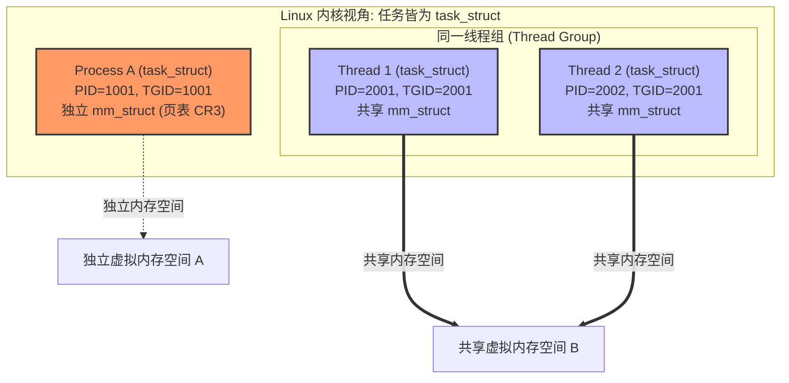
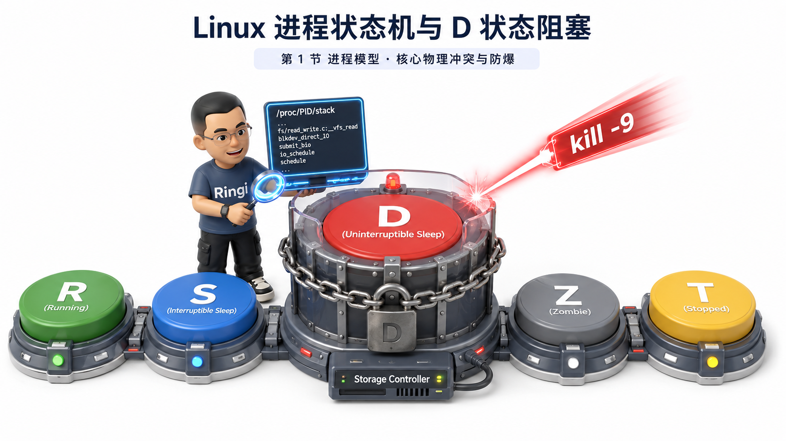
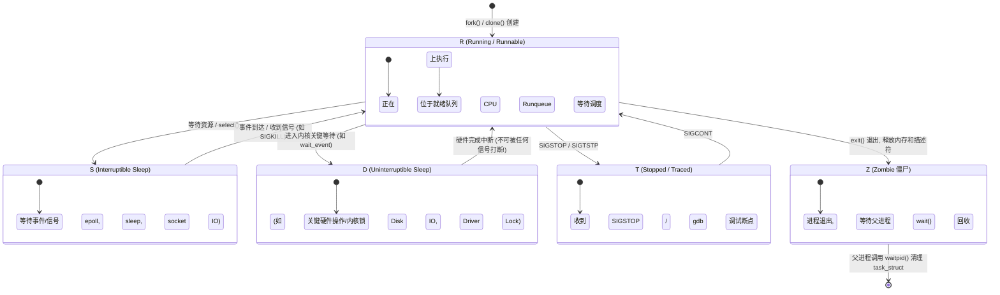
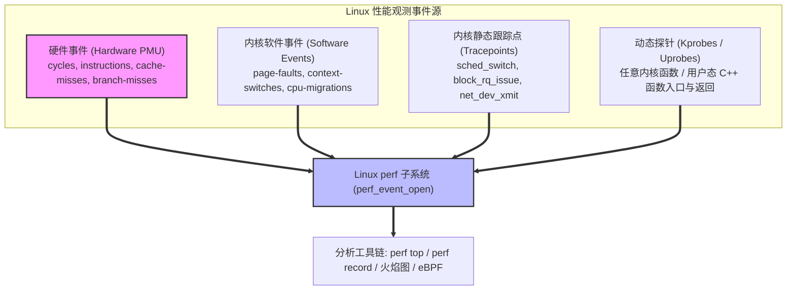

# 🏛️ 第04讲：Linux 系统基线与性能分析核心工具箱

> **主讲人**：👓 **Ringi**（大厂 AI Infrastructure 工程师）  
> **所属模块**：[Module 00: 性能工程与系统前置](./README.md)  
> **篇章范式**：🏛️ 性能工程与系统前置篇（Performance Engineering & System Baseline）  
> **核心导读**：在 AI Infra 领域，“排查性能瓶颈绝不能靠猜”！当千卡集群训练突然 Hang 住、GPU 算力利用率（MFU）从 95% 暴跌至 0%、某个 DataLoader Worker 变成无法 `kill -9` 的 D 状态（Uninterruptible Sleep）、或者单卡显存爆满但 CPU 利用率只有 5% 时，缺乏操作系统底层观测能力的工程师往往束手无策。本讲从 Linux 进程调度与上下文切换物理开销、Load Average 内核指数衰减模型、四大黄金资源（CPU/内存/磁盘/网络）的 USE 监控体系，一路深入到硬件 PMU 计数器、`perf` 堆栈采样与 On-CPU / Off-CPU 火焰图实战，带你亲手打造大厂生产级系统听诊器。


```text
=================================================================================================
                                  Ringi 3D 架构工坊 · 核心全景
┌───────────────────────────────────────────────────────────────────────────────────────────────┐
│                                                                                               │
│    [应用与框架层 (User Space)]                                                                 │
│    ┌─────────────────────────────────────────────────────────────────────────────────────┐    │
│    │ PyTorch / Megatron / vLLM (Python 控制面 + C++ 数据面 + CUDA Runtime)                │    │
│    └───────────────────────────────────────────┬─────────────────────────────────────────┘    │
│                                                │ 系统调用 (Syscall) / 缺页异常 (Page Fault)     │
│    [Linux 内核观测层 (Kernel Space)]            ▼                                             │
│    ┌─────────────────────────────────────────────────────────────────────────────────────┐    │
│    │ CPU 调度器 (CFS/EEVDF) │ 虚拟内存与页面置换 (Page Cache/Swap) │ VFS 与通用块层 (IO) │    │
│    ├─────────────────────────────────────────────────────────────────────────────────────┤    │
│    │ 观测工具链: top / vmstat / iostat / sar / perf / eBPF / Tracepoints / PMU 计数器     │    │
│    └───────────────────────────────────────────┬─────────────────────────────────────────┘    │
│                                                │ 硬件中断 / DMA / 指令流水线                    │
│    [物理硬件底座 (Hardware Layer)]              ▼                                             │
│    ┌─────────────────────────────────────────────────────────────────────────────────────┐    │
│    │ CPU (x86_64/ARM64) │ 主存 (DDR5 DRAM) │ NVMe SSD / 本地磁盘 │ 网卡 (RoCE/IB) │ GPU   │    │
│    └─────────────────────────────────────────────────────────────────────────────────────┘    │
│                                                                                               │
└───────────────────────────────────────────────────────────────────────────────────────────────┘
=================================================================================================
```

<!-- more -->

## 📑 目录导航

- [0. Ringi 开场：排查性能瓶颈，别猜，看工具！](#0-ringi-开场排查性能瓶颈别猜看工具)
  - [0.1 大模型生产排障实录：一次千卡训练神秘“假死”风暴](#01-大模型生产排障实录一次千卡训练神秘假死风暴)
  - [0.2 “不猜原则”与 Brendan Gregg 的 USE 性能分析方法论](#02-不猜原则与-brendan-gregg-的-use-性能分析方法论)
  - [0.3 为什么 AI Infra 工程师必须精通 Linux 内核与观测工具链？](#03-为什么-ai-infra-工程师必须精通-linux-内核与观测工具链)
- [1. Linux 进程、线程与并发执行内核模型](#1-linux-进程线程与并发执行内核模型)
  - [1.1 进程（Process）vs 线程（Thread）vs 协程（Coroutine）的底层物理本质](#11-进程processvs-线程threadvs-协程coroutine的底层物理本质)
  - [1.2 进程调度、上下文切换（Context Switch）与 Cache 污染开销](#12-进程调度上下文切换context-switch与-cache-污染开销)
  - [1.3 Linux 进程状态机深度解剖（R, S, D, Z, T）](#13-linux-进程状态机深度解剖r-s-d-z-t)
  - [1.4 致命的 D 状态（Uninterruptible Sleep）：为什么 `kill -9` 杀不掉？GPU 驱动锁死与文件 IO 卡挂](#14-致命的-d-状态uninterruptible-sleep为什么-kill--9-杀不掉gpu-驱动锁死与文件-io-卡挂)
  - [1.5 僵尸进程（Zombie）与孤儿进程（Orphan）的生命周期治理](#15-僵尸进程zombie与孤儿进程orphan的生命周期治理)
- [2. 系统四大黄金资源基线与核心监控工具链（CPU / 内存 / 磁盘 / 网络）](#2-系统四大黄金资源基线与核心监控工具链cpu--内存--磁盘--网络)
  - [2.1 CPU 与负载观测：top, htop, uptime 与 Load Average 内核指数衰减算法](#21-cpu-与负载观测top-htop-uptime-与-load-average-内核指数衰减算法)
  - [2.2 虚拟内存与换页机制：vmstat, free, Page Cache, Dirty Page 脏页回写与 Swap 换页雪崩](#22-虚拟内存与换页机制vmstat-free-page-cache-dirty-page-脏页回写与-swap-换页雪崩)
  - [2.3 存储与磁盘 IO 性能账本：iostat, 排队论（Little's Law）、%util、await 与 Checkpoint 写入瓶颈](#23-存储与磁盘-io-性能账本iostat-排队论littles-lawutilawait-与-checkpoint-写入瓶颈)
  - [2.4 网络吞吐与丢包侦测：sar, ethtool, iftop, 网卡 Ring Buffer 与微突发丢包（Microburst Drops）](#24-网络吞吐与丢包侦测sar-ethtool-iftop-网卡-ring-buffer-与微突发丢包microburst-drops)
  - [2.5 USE 方法论综合全景决策表](#25-use-方法论综合全景决策表)
- [3. Linux 高级性能分析利器：perf 性能计数器与 FlameGraph 火焰图](#3-linux-高级性能分析利器perf-性能计数器与-flamegraph-火焰图)
  - [3.1 Linux 性能事件采样体系：Tracepoints、Kprobes/Uprobes 与硬件 PMU](#31-linux-性能事件采样体系tracepointskprobesuprobes-与硬件-pmu)
  - [3.2 perf 工具集实战：perf top, perf stat 与 IPC（每周期指令数）分析](#32-perf-工具集实战perf-top-perf-stat-与-ipc每周期指令数分析)
  - [3.3 perf record / perf report 堆栈采样与符号解析原理](#33-perf-record--perf-report-堆栈采样与符号解析原理)
  - [3.4 CPU 火焰图（FlameGraph）第一性原理：X 轴与 Y 轴物理含义、向量化展开与热点定位](#34-cpu-火焰图flamegraph第一性原理x-轴与-y-轴物理含义向量化展开与热点定位)
  - [3.5 进阶突破：Off-CPU 阻塞火焰图（解决“CPU 占不满但延迟极高”的终极杀手锏）](#35-进阶突破off-cpu-阻塞火焰图解决cpu-占不满但延迟极高的终极杀手锏)
- [4. 动手实战与排障工具箱（Hands-on Benchmark & Production Tooling）](#4-动手实战与排障工具箱hands-on-benchmark--production-tuning)
  - [4.1 实战 1：编写大厂生产级一键系统健康巡检脚本 `system_health_check.sh`](#41-实战-1编写大厂生产级一键系统健康巡检脚本-system_health_checksh)
  - [4.2 实战 2：Python/C++ 构造 CPU 密集、IO 阻塞（D 状态）与锁竞争实测验证](#42-实战-2pythonc-构造-cpu-密集io-阻塞d-状态与锁竞争实测验证)
  - [4.3 实战 3：从零抓取 PyTorch 训练过程的 On-CPU 与 Off-CPU 火焰图端到端实操](#43-实战-3从零抓取-pytorch-训练过程的-on-cpu-与-off-cpu-火焰图端到端实操)
  - [4.4 实战 4：大模型训练节点内核参数调优脚本 `sysctl_ai_tuning.sh`](#44-实战-4大模型训练节点内核参数调优脚本-sysctl_ai_tuningsh)
- [5. Ringi 避坑指南与大厂经典面试题](#5-ringi-避坑指南与大厂经典面试题)
  - [5.1 避坑表格（❌ 常见小白错误理解 vs ✅ 大厂 AI Infra 正确理解）](#51-避坑表格-常见小白错误理解-vs--大厂-ai-infra-正确理解)
  - [5.2 4 道大厂硬核 Linux 系统工程与性能排障面试题（附白板推导、内核机制与标准答题路径）](#52-4-道大厂硬核-linux-系统工程与性能排障面试题附白板推导内核机制与标准答题路径)
- [6. Ringi 5 点核心速记口诀、自我检验清单与课后深度思考题](#6-ringi-5-点核心速记口诀自我检验清单与课后深度思考题)
- [7. 📚 参考资料与经典书籍论文](#7--参考资料与经典书籍论文)

---

# 0. Ringi 开场：排查性能瓶颈，别猜，看工具！

## 0.1 大模型生产排障实录：一次千卡训练神秘“假死”风暴

在大厂参与千卡分布式训练集群运维时，我曾遇到过一次令人极其难忘的“幽灵故障”：

那是一个周五晚上，一个 128 节点（1024 张 H100）的 70B 大模型预训练任务突然触发了集群报警——**所有节点的 GPU 算力利用率在 3 秒钟内全部从 95% 跌到了 0%，但整个训练任务并未报错退出，进程仍在后台运行，Slurm 也没有捕获到任何 Exit Code。**

当时排障现场一片混乱：
- 算法同学怀疑：“是不是梯度爆炸了？还是 Loss 突刺触发了某种条件死循环？”
- 网络同学排查：“是不是 RoCE 交换机 PFC 死锁导致了 NCCL 通信 Hang 住？”
- 驱动同学猜测：“是不是某张卡的 GPU 发生了 Xid 硬件掉卡？”

然而，当我们连上其中一台看似正常的 Worker 节点执行分析时：
1. `nvidia-smi` 赫然显示：8 张 GPU 全部处于 **P0 最高性能状态**，显存全部占满，但 `GPU-Util` 恒定为 **0%**；
2. 执行 `top` 命令：系统平均负载 `Load Average` 竟然高达 **128.4**（该机型为双路 64 核 CPU，核数为 128），但奇怪的是，`%Cpu(s)` 中的用户态 CPU 使用率 `us` 只有 **1.2%**，系统态 `sy` 只有 **0.8%**，空闲率 `id` 高达 **98%**！
3. 查看进程状态：PyTorch 的 8 个主进程和数十个 DataLoader 衍生子进程的状态列全部赫然显示为一个大写的字母——**`D`（Disk Sleep，即不可中断睡眠态）**！
4. 尝试执行 `kill -9 <PID>`，控制台毫无反应，进程宛如钢铁铸就，纹丝不动；
5. 执行 `iostat -xz 1`，某个挂载了分布式共享文件系统（Ceph / NFS）的本地挂载点，其 `%util` 恒定为 **100.00%**，`await` 飙升到了惊人的 **32000 ms（32 秒）**！

**真相大白**：原来是在保存 Checkpoint 权重时，其中一个节点由于挂载目录所在的文件存储网关发生了偶发性网络拥塞，导致内核的 VFS 写入阻塞在 `sync()` 系统调用上，进程进入了不可中断睡眠态（D 状态）。由于分布式训练的同步屏障（Barrier）机制，**1 个节点的 1 个线程卡在内核 D 状态，导致全球 1024 张卡全部陪着它干等，集群算力损失高达数万元/小时！**

这次故障让我彻底明白了一个底层真理：**在现代 AI Infra 系统中，哪怕上层算法和 CUDA Kernel 写得再天衣无缝，只要操作系统底层的 CPU 调度、内存换页、VFS 缓存或网络队列出现一丁点阻塞，整座由千卡构建的算力大厦就会在一瞬间轰然停摆。**

---

## 0.2 “不猜原则”与 Brendan Gregg 的 USE 性能分析方法论

在性能工程领域，计算机性能学宗师、火焰图发明人 **Brendan Gregg** 曾提出过著名的性能分析公理：

> 💡 **Ringi 导师金句**：  
> **“Never guess, always measure.”（永远不要靠猜，永远依赖数据与工具测量。）**  
> 性能排障绝不是拿着一堆内核参数去碰运气，而是遵循严密的物理证据链：**从宏观资源饱和度指标，层层下钻到微观指令级热点与阻塞调用栈。**

在 Linux 性能分析领域，大厂工业界普遍采用 Brendan Gregg 总结的 **USE 方法论（USE Method）**：

对于系统中的每一个独立硬件/软件资源（CPU、内存、存储控制器、网络接口、GPU）：
1. **Utilization（利用率）**：在给定时间区间内，该资源处于忙碌状态的时间百分比（例如：CPU 处于非空闲状态的时间占比、GPU SM 忙碌百分比）；
2. **Saturation（饱和度）**：该资源被过载请求排队等待的程度（例如：CPU 运行队列长度、磁盘等待 IO 队列深度、网络发送队列积压）；
3. **Errors（错误数）**：该资源发生的错误事件计数（例如：网卡 CRC 校验错误、丢包计数、PCIe Correctable/Uncorrectable Errors、GPU Xid 错误）。

```text
┌──────────────────────────────────────────────────────────────────────────────────┐
│                             USE 性能分析方法论全景决策流                          │
├───────────────┬─────────────────────────┬───────────────────────┬────────────────┤
│ 资源类型      │ 1. 利用率 (Utilization)  │ 2. 饱和度 (Saturation)│ 3. 错误 (Errors)│
├───────────────┼─────────────────────────┼───────────────────────┼────────────────┤
│ CPU 处理器    │ top / mpstat (%usr+%sys)│ vmstat (r 列) / Load  │ perf (硬件中断) │
│ 物理内存/交换 │ free / vmstat (used/free)│ vmstat (si/so 换页)   │ dmesg (OOM kill)│
│ 磁盘/存储设备 │ iostat (%util)          │ iostat (avgqu-sz/await)│ smartctl/dmesg │
│ 网络接口卡    │ sar -n DEV (rxpck/txpck)│ iftop / netstat (丢包)│ ethtool -S (drop)│
│ GPU 算力与卡  │ nvidia-smi (GPU-Util)   │ nvidia-smi (挂起队列) │ dmesg (Xid 错误)│
└───────────────┴─────────────────────────┴───────────────────────┴────────────────┘
```

---

## 0.3 为什么 AI Infra 工程师必须精通 Linux 内核与观测工具链？


很多初学者容易产生一个认知偏差：“既然我是搞大模型（LLM）与 AI Infra 的，我只要懂 PyTorch、DeepSpeed、vLLM 和 CUDA 就可以了，Linux 运维与内核知识是不是应该丢给 SRE（运维工程师）？”

在大厂真实的工程分工中，这是完全错误的！原因在于：

1. **分布式训练是强协同系统（Tight Coupling）**：千卡训练采用同步 SGD，每一次 Step 都要进行跨卡 AllReduce。整个集群的执行速度取决于**最慢的那个节点（Straggler Node / 慢节点）**。如果一台机器发生 CPU 调度抖动、内存换页或网络丢包，整个千卡集群的吞吐都会被拖垮；
2. **高性能推理服务需要极致的 P99 延迟保障**：在 vLLM / TensorRT-LLM 在线推理服务中，长尾延迟（P99 / P999 Latency）往往由 Linux 内核上下文切换、内存分配锁争抢（glibc `malloc` 的 `mmap_sem`）、Page Fault 缺页中断或软中断（SoftIRQ）引起；
3. **异构计算链路涉及全栈硬件**：从 Host CPU 主存到 GPU 显存的 PCIe DMA 搬运、GPUDirect Storage (GDS) 直通、RDMA 跨机通信，全部依赖 Linux 内核驱动和子系统支撑。

掌握 Linux 系统基线与性能分析工具箱，就是为你的 AI Infra 武器库装上**微秒级的全景透视镜**。

---

# 1. Linux 进程、线程与并发执行内核模型

## 1.1 进程（Process）vs 线程（Thread）vs 协程（Coroutine）的底层物理本质

在进入性能分析前，我们必须从 Linux 内核的第一性原理重新审视计算机执行并发的本质：

```text
┌─────────────────────────────────────────────────────────────────────────────────────────┐
│                               并发实体内核与用户态全景对比                                │
├───────────────┬──────────────────────────┬──────────────────────────┬───────────────────┤
│ 维度          │ 进程 (Process)           │ 原生线程 (pthread / LWP) │ 用户态协程 (Coroutine)│
├───────────────┼──────────────────────────┼──────────────────────────┼───────────────────┤
│ 内核实体      │ `task_struct` (独立资源) │ `task_struct` (共享资源) │ 无内核实体 (仅用户空间)│
│ 内存地址空间  │ 完全独立 (独立 `mm_struct`)│ 完全共享同一 `mm_struct` │ 完全共享所属线程内存 │
│ 文件与描述符  │ 独立 `files_struct`      │ 共享 `files_struct`      │ 共享所属线程描述符 │
│ 创建与销毁开销│ 大 (~100-500 μs, Copy MM)│ 中 (~10-20 μs, 共享 MM)  │ 极小 (~0.1-1 μs)  │
│ 上下文切换耗时│ 1 ~ 3 μs (刷 TLB + Cache)│ 0.5 ~ 1 μs (无需刷 TLB)  │ 10 ~ 50 ns (纯寄存器)│
│ AI Infra 典型 │ PyTorch DDP / 多 Worker   │ PyTorch C++ 算子内部多线程│ Python asyncio / HTTP │
└───────────────┴──────────────────────────┴──────────────────────────┴───────────────────┘
```



> 🔍 **内核第一性原理**：  
> 在 Linux 内核中，**根本没有单独的“线程”结构体！** 内核调度的唯一单位是 `task_struct`（称为轻量级进程 Lightweight Process, LWP）。  
> 无论是通过 `fork()` 创建进程，还是通过 `pthread_create()` 创建线程，底层调用的都是内核系统调用 `clone()`：
> - `fork()`：`clone(SIGCHLD)`（不共享内存、文件和信号处理，产生独立的 `mm_struct`）；
> - `pthread_create()`：`clone(CLONE_VM | CLONE_FS | CLONE_FILES | CLONE_SIGHAND | CLONE_THREAD, ...)`（共享虚拟内存空间 `CLONE_VM`、文件系统 `CLONE_FS` 与描述符 `CLONE_FILES`，并放入同一个线程组 `CLONE_THREAD`）。

---

## 1.2 进程调度、上下文切换（Context Switch）与 Cache 污染开销

当操作系统决定将 CPU 核心从任务 A 切换到任务 B 时，会触发**上下文切换（Context Switch）**。

上下文切换的成本可以分为两大类：

### 1. 直接开销（Direct Overhead）：~1 微秒（μs）
- **保存与恢复寄存器**：通用寄存器（RAX, RBX...）、指令指针（RIP）、栈指针（RSP）以及浮点/向量寄存器（AVX-512 / SSE 状态）；
- **切换内核栈与 `task_struct`**；
- **跨进程切换地址空间（切换页表基址寄存器 CR3）**：通知硬件 MMU 切换页表目录。

### 2. 间接开销（Indirect Overhead，性能杀手！）：~10 到 100 微秒（μs）
- **TLB（Translation Lookaside Buffer）失效与重填**：切换 CR3 后，CPU MMU 的地址转换快表全部失效，后续的每次内存访问都会触发昂贵的多级页表漫游（Page Table Walk）；
- **CPU L1/L2/L3 Cache 污染（Cache Pollution / Cold Cache）**：任务 A 在 Cache 中精心建立的热点数据（如 Transformer 算子的局部缓存块）会被任务 B 的代码和数据无情驱逐。当任务 A 重新被调度回来时，面临的是满盘皆输的 **Cache Miss（冷缓存惩罚）**！

```text
[任务 A 正在 Core 0 高速运行] ──► L1/L2 Cache 命中率 98%, IPC = 2.5
          │
          ▼ 触发上下文切换 (Context Switch: 消耗 ~1.5 μs)
[保存 A 寄存器, 刷洗 TLB (CR3), 加载 任务 B 寄存器]
          │
          ▼
[任务 B 运行并无情驱逐 Cache 中属于 A 的数据]
          │
          ▼ 再次切换回任务 A (耗时 ~1.5 μs)
[任务 A 遭遇全盘 Cache Miss] ──► 频繁阻塞在主存访存 (60-100ns), IPC 骤降至 0.4!
```

> ⚠️ **AI Infra 避坑提醒**：  
> 在 PyTorch DataLoader 中，很多同学喜欢盲目调大 `num_workers`（比如一台 64 核机器配 `num_workers=128`）。  
> 结果会导致系统每秒发生数万次**非自愿上下文切换（Involuntary Context Switch）**，CPU 核心把大量时间浪费在寄存器存盘、TLB 刷洗和 Cache 互相践踏上，数据加载吞吐不升反降！

---

## 1.3 Linux 进程状态机深度解剖（R, S, D, Z, T）

在 Linux 中，通过 `ps`, `top` 查看进程时，每个任务都处于特定的状态机节点：





| 状态标识 | 英文全称 | 核心含义 | 是否计入 Load Average？ | 是否响应 `kill -9`？ |
|---|---|---|---|---|
| **R** | Running / Runnable | 正在 CPU 上执行，或者在调度就绪队列中等待 CPU | **是** | 是 |
| **S** | Interruptible Sleep | 可中断睡眠态。正在等待网络数据、锁或定时器 | 否 | **是**（立即终止） |
| **D** | Uninterruptible Sleep | **不可中断睡眠态**。正在等待关键内核硬件操作（如磁盘/驱动） | **是（核心陷阱！）** | **否（坚决不响应！）** |
| **Z** | Zombie | 僵尸态。进程已死，内存已释放，仅剩 `task_struct` 占位 | 否 | 否（它已经死了） |
| **T** | Stopped / Traced | 暂停态。收到 `SIGSTOP` 信号或正处于 GDB 调试断点中 | 否 | 是 |

---

## 1.4 致命的 D 状态（Uninterruptible Sleep）：为什么 `kill -9` 杀不掉？GPU 驱动锁死与文件 IO 卡挂

### 为什么内核需要 D 状态？
假设一个进程正在向磁盘块设备执行关键写入，或者正在和 GPU 驱动进行显存物理页映射。如果在这个瞬间，操作系统允许外部信号（如 `kill -9`）强行打断并销毁该进程：
- 硬件控制器可能正在向进程提供的虚拟地址做 DMA 写入，进程被销毁会导致该物理内存被重新分配，引发**严重的内存数据破坏（Memory Corruption）**；
- 驱动内部持有的全局互斥锁（Mutex）无法释放，导致**整机内核死锁（Kernel Deadlock）**。

因此，Linux 内核设计了 `wait_event()` 原语：**在进程等待硬件中断或关键内核锁完成之前，将进程标记为 D 状态，屏蔽包括 `SIGKILL`（9号信号）在内的一切外部信号！**

### 为什么在 AI Infra 中 D 状态频频暴雷？
在 AI 训练与推理集群中，D 状态高发于以下三大场景：
1. **NFS / Ceph / Lustre 分布式文件系统卡死**：某个存储网关无响应，进程在 `write()` 或 `sync()` 时陷入内核 VFS 层无限期等待；
2. **NVIDIA GPU 驱动发生死锁或硬件 Hang**：当 GPU 出现严重的硬件错误（如 PCIe 链路断开、NVLink 错误、Xid 31/79 掉卡）时，NVIDIA 内核模块（`nvidia.ko`）在等待硬件寄存器响应时死等，导致 CUDA 调用线程永久停留在 D 状态；
3. **内存剧烈紧缺时的 Direct Reclaim（直接内存回收）**：当系统内存彻底枯竭且没有 Swap 时，内核分配内存的线程会直接陷入 D 状态，在内核中同步扫描并回收文件脏页，引发全系统卡死。

> 🛠️ **Ringi 排障秘籍：如何抓出 D 状态卡死的内核调用栈？**  
> 当遇到无法杀死的 D 状态进程时，千万不要直接重启机器！执行以下命令，直接读取该进程在内核中的挂起栈：
> ```bash
> cat /proc/<PID>/stack
> ```
> 如果看到输出中包含 `nfs_wait_bit_uninterruptible` 或 `nv_kern_ioctl`，就能瞬间定位到底是**存储网络挂起**还是 **GPU 驱动死锁**！

---

## 1.5 僵尸进程（Zombie）与孤儿进程（Orphan）的生命周期治理

### 1. 孤儿进程（Orphan Process）
- **发生场景**：父进程先于子进程意外退出或崩溃（例如训练框架的主进程被 kill，但启动的 DataLoader Worker 还在运行）；
- **内核机制**：孤儿进程会被系统的 1 号进程（`systemd` 或 `init`）收养，由 1 号进程负责在其退出时执行回收，**一般不会造成资源泄漏**。

### 2. 僵尸进程（Zombie Process）
- **发生场景**：子进程调用 `exit()` 退出，内核已经释放了它的全部代码段、数据段、堆和栈内存，但父进程并没有调用 `wait()` 或 `waitpid()` 去读取子进程的退出状态码；
- **危害**：僵尸进程虽然不占 CPU 和物理内存，但它会**永久占用一个系统进程 ID（PID）和内核 `task_struct` 槽位**！Linux 系统的最大 PID 数量是有限的（由 `/proc/sys/kernel/pid_max` 决定，默认通常为 32768 或 4194304）。如果多进程训练任务不断泄露僵尸进程，会导致系统 PID 耗尽，从而无法创建任何新进程（报错：`fork: Cannot allocate memory`）！

```bash
# 一键清理僵尸进程的正确姿势：找到僵尸进程的父进程并终止父进程
ps -A -ostat,ppid,pid,cmd | grep -e '^[Zz]'
# 杀死父进程（PPID），让 systemd 接管并自动回收僵尸
kill -9 <PPID>
```

---

# 2. 系统四大黄金资源基线与核心监控工具链（CPU / 内存 / 磁盘 / 网络）


## 2.1 CPU 与负载观测：top, htop, uptime 与 Load Average 内核指数衰减算法

### 1. Load Average（平均负载）的内核第一性原理

在终端执行 `uptime` 或 `top`，最上面一行总会输出三个数字：
```bash
load average: 12.50, 8.20, 4.15
```
这分别代表过去 **1 分钟、5 分钟、15 分钟** 的系统平均负载。

很多初学者甚至部分中级工程师都有一个极其经典的误区：
> ❌ **错误认识**：“Load Average 就是 CPU 使用率的平均值。”

**这是完全错误的！**

> 🔍 **内核源码剖析（`kernel/sched/loadavg.c`）**：  
> Linux 的平均负载统计的是：**系统处于「可运行状态（R 状态）」与「不可中断睡眠状态（D 状态）」的平均活跃任务数之和！**
> 
> $$
> \text{Active Tasks} = N_{\text{TASK\_RUNNING}} + N_{\text{TASK\_UNINTERRUPTIBLE}}
> $$
> 其中 `TASK_RUNNING` = 可运行状态（R 状态），`TASK_UNINTERRUPTIBLE` = 不可中断睡眠（D 状态，IO 阻塞）。
>
> 内核每隔 5 秒对当前活跃任务数采样一次，并采用**指数衰减移动平均（Exponential Decay Moving Average）** 进行更新：
> 
> $$
> L(t) = L(t - \Delta t) \cdot e^{-\Delta t / \tau} + n \cdot (1 - e^{-\Delta t / \tau})
> $$
> 
> 其中 $\tau$ 为时间衰减常数（分别对应 1、5、15 分钟），$n$ 为当前采样的活跃任务数。

### 2. 为什么 CPU 使用率 5%，但 Load 可以高达 100？
根据上述公式：
- **场景 A**：128 核机器，128 个线程全在拼命做矩阵乘法（R 状态） $\to$ CPU 100%，Load = 128（**正常 CPU 算力打满**）；
- **场景 B**：128 核机器，128 个线程全在等待故障的 NFS 磁盘响应（D 状态），CPU 根本没在计算 $\to$ CPU 0%，Load = 128（**严重 IO 阻塞故障！**）。

### 3. `top` 命令的核心字段拆解
```text
%Cpu(s): 12.5 us,  3.2 sy,  0.0 ni, 82.1 id,  1.8 wa,  0.0 hi,  0.4 si,  0.0 st
```
- **`us` (User)**：用户态 CPU 时间百分比（运行 PyTorch 模型、CUDA 启动代码）；
- **`sy` (System)**：内核态 CPU 时间百分比（系统调用、页表操作、上下文切换）；如果 `sy` > 20%，通常意味着锁竞争或高频系统调用；
- **`wa` (I/O Wait)**：CPU 空闲且等待磁盘/网络 IO 完成的时间占比。如果 `wa` 很高，说明存储是严重瓶颈；
- **`si` (SoftIRQ)**：软中断 CPU 时间。如果很高（> 10%），说明网络数据包吞吐极大，网卡软中断已打满单核。

---

## 2.2 虚拟内存与换页机制：vmstat, free, Page Cache, Dirty Page 脏页回写与 Swap 换页雪崩

### 1. `free -h` 的正确打开方式
```text
              total        used        free      shared  buff/cache   available
Mem:          503Gi        32Gi        12Gi       4.0Gi       459Gi       467Gi
Swap:          32Gi         0Bi        32Gi
```

- **`total`**：总物理内存大小；
- **`used`**：应用程序已经分配并占用的内存（不可被直接回收）；
- **`free`**：完全未被使用的物理内存；
- **`buff/cache`（Page Cache + Buffer）**：内核用于缓存磁盘文件数据的内存。**这是 Linux 的加速特性，当应用程序申请内存时，内核可以瞬间自动回收 Cache 供程序使用！**
- **`available`**：**真正可供启动新任务的可用内存**（`available` $\approx$ `free` + 可回收的 `buff/cache`）。

> 💡 **Ringi 踩坑实录：大模型权重加载与 Page Cache 暴涨**  
> 当你使用 `torch.load("model.safetensors")` 加载 200GB 权重时，会发现系统的 `buff/cache` 瞬间飙升 200GB，`free` 跌到几百兆。别慌！这完全正常，说明权重文件被内核缓存到了 Page Cache 中，第二次加载会享受内存级的闪电读取速度。

### 2. 致命的 Swap（交换分区）与换页雪崩（Thrashing）
在常规 Web 服务器上，开启 Swap 可以在内存超载时把不常用的内存页写入磁盘，防止程序崩溃。但在 **AI Infra 分布式训练与高性能推理集群中，Swap 是头号杀手！**

- **为什么？**  
  物理 DRAM 的访存延迟是 **60~100 ns**，而最快的 NVMe SSD 访存延迟也是 **10~20 μs（慢了 200 倍以上）**。  
  一旦训练进程的物理页被 Swap 到磁盘，GPU 试图通过 DMA 或 CPU 试图访问该张量时，会触发昂贵的**缺页异常（Major Page Fault）**，导致整个线程挂起数毫秒去等磁盘读写。
  在千卡同步训练中，1 个节点的 1 次 Swap 换页就会导致 1024 张卡集体卡顿！

```bash
# 使用 vmstat 1 监控内存换页：
# 重点关注 si (Swap In) 和 so (Swap Out) 列！只要连续出现大于 0，说明内存正在疯狂换页！
procs -----------memory---------- ---swap-- -----io---- -system-- ------cpu-----
 r  b   swpd   free   buff  cache   si   so    bi    bo   in   cs us sy id wa st
 2  0      0 12582912 512000 481239040    0    0    12    45 1200 3500 15  3 82  0  0
```

> 🛡️ **大厂工业级规范**：  
> **所有 GPU 训练与推理节点，必须彻底禁用 Swap 或将 `vm.swappiness` 设为 0/1！**
> ```bash
> swapoff -a  # 立即关闭 swap
> # 在 /etc/sysctl.conf 中配置：
> vm.swappiness = 0
> ```

---

## 2.3 存储与磁盘 IO 性能账本：iostat, 排队论（Little's Law）、%util、await 与 Checkpoint 写入瓶颈

在大模型预训练中，每隔固定 Step 就会触发一次 Checkpoint 权重保存（数百 GB 到数 TB）。如果磁盘性能未达基线，保存 Checkpoint 会导致训练严重卡死。

### 1. `iostat -xz 1` 核心指标权威拆解
```text
Device    r/s     w/s     rkB/s     wkB/s  rrqm/s  wrqm/s  %rrqm  %wrqm  r_await  w_await   aqu-sz  rareq-sz  wareq-sz  svctm  %util
nvme0n1  12.0  1500.0     128.0  750000.0    0.00   85.00   0.00   5.36     0.45     2.10     3.15     10.67    500.00   0.06  95.50
```

- **`r/s, w/s` (IOPS)**：每秒读/写请求次数；
- **`rkB/s, wkB/s` (Throughput)**：每秒读/写吞吐量（例如这里写吞吐为 $750000\text{ KB/s} \approx 732\text{ MB/s}$）；
- **`r_await, w_await` (Response Time)**：读/写请求的**平均响应时间（包含排队等待时间 + 硬件服务时间，单位 ms）**。NVMe SSD 的正常写入 `w_await` 应在 **< 2 ms**，如果飙升到数十甚至上千毫秒，说明存储已极度超载；
- **`aqu-sz` (Average Queue Size)**：请求队列平均深度；
- **`%util`**：设备处于忙碌状态的时间百分比。

### 2. 排队论（Little's Law）在存储 IO 中的第一性原理
根据经典排队论 **利特尔法则（Little's Law）**：
$$
L = \lambda \cdot W
$$
- $L$：系统内平均排队请求数（`aqu-sz`）；
- $\lambda$：到达吞吐率（$\text{IOPS} = r/s + w/s$）；
- $W$：平均等待与服务时间（`await`）。

$$
\text{await} = \frac{\text{aqu-sz}}{\text{IOPS}}
$$

> ⚠️ **%util 的误区与 SSD 并发特性**：  
> 在传统的单磁头机械硬盘上，`%util` 达到 100% 意味着磁盘完全饱和。但在现代企业级 NVMe SSD 上，由于内部拥有数十个通道（Flash Channels）和上百个并发 Die，**`%util` 达到 100% 并不代表吞吐不能继续提升，真正的饱和度指标是 `await` 是否开始指数级恶化！**

---

## 2.4 网络吞吐与丢包侦测：sar, ethtool, iftop, 网卡 Ring Buffer 与微突发丢包（Microburst Drops）

在分布式训练（AllReduce / AllToAll）中，网络通信带宽直接决定了线性扩展比。

### 1. `sar -n DEV 1` 监控吞吐
```text
IFACE      rxpck/s   txpck/s    rxkB/s    txkB/s   rxcmp/s   txcmp/s  rxmcst/s   %ifutil
eth0       85000.0   92000.0 1250000.0 1340000.0      0.00      0.00      0.00     98.5
```
- **`rxkB/s, txkB/s`**：收发带宽（$1340000\text{ kB/s} \approx 1.34\text{ GB/s} \approx 10.7\text{ Gbps}$）；
- **`%ifutil`**：网卡物理带宽利用率。

### 2. 微突发丢包（Microburst Drops）与 Ring Buffer
在大规模 AllGather / ReduceScatter 集合通信中，数百个节点会在微秒级别**同时向同一台机器发送数据**，形成剧烈的 **Incast 微突发流量**。这会导致网卡硬件的接收环形缓冲区（Rx Ring Buffer）瞬间被打满，触发静默丢包！

```bash
# 1. 查看网卡底层丢包与 FIFO 溢出统计
ethtool -S eth0 | grep -E "drop|discard|error|fifo"

# 2. 查看当前 Ring Buffer 大小与最大硬件支持大小
ethtool -g eth0

# 3. 将 Ring Buffer 调至硬件最大值（防止微突发丢包）
ethtool -G eth0 rx 4096 tx 4096
```

---

## 2.5 USE 方法论综合全景决策表

在生产排障中，当你登录一台性能异常的机器时，按照下表进行 **3 分钟快速体检**：

```text
┌──────────────────────────────────────────────────────────────────────────────────────────────────┐
│                               大厂 AI 节点 3 分钟 USE 决策体检表                                  │
├─────────┬──────────────────────┬────────────────────────┬────────────────────────────────────────┤
│ 检查阶段│ 资源类型             │ 核心命令与关注指标     │ 异常阈值与故障判定                     │
├─────────┼──────────────────────┼────────────────────────┼────────────────────────────────────────┤
│ Step 1  │ 系统负载与 CPU 状态  │ `uptime`, `top`        │ Load > CPU 核数，且 us% 低 / D 状态多  │
│         │                      │ (us, sy, wa, si)       │ sy% > 20% (锁/上下文切换) wa% 高 (IO卡)│
├─────────┼──────────────────────┼────────────────────────┼────────────────────────────────────────┤
│ Step 2  │ 物理内存与换页状态   │ `free -h`, `vmstat 1`  │ available 极低 (< 2GB)                 │
│         │                      │ (si, so 列)            │ si/so 持续 > 0 (发生 Swap 雪崩!)       │
├─────────┼──────────────────────┼────────────────────────┼────────────────────────────────────────┤
│ Step 3  │ 磁盘存储与 IO 阻塞   │ `iostat -xz 1`         │ await > 20ms, %util 100% 持续          │
│         │                      │ (await, %util, aqu-sz) │ 检查 Checkpoint 目录或日志盘是否写爆   │
├─────────┼──────────────────────┼────────────────────────┼────────────────────────────────────────┤
│ Step 4  │ 网络互联与丢包       │ `sar -n DEV 1`,        │ drop 计数持续增加 (微突发丢包)         │
│         │                      │ `ethtool -S <NIC>`     │ PFC / Pause 帧激增 (RoCE 网络死锁)     │
├─────────┼──────────────────────┼────────────────────────┼────────────────────────────────────────┤
│ Step 5  │ GPU 与 PCIe 驱动状态 │ `nvidia-smi`,          │ Xid 报错 (31/79 掉卡, 45 NVLink 故障)  │
│         │                      │ `dmesg -T | grep NVRM` │ GPU-Util 为 0% 但处于 P0 态 (驱动卡死) │
└─────────┴──────────────────────┴────────────────────────┴────────────────────────────────────────┘
```

---

# 3. Linux 高级性能分析利器：perf 性能计数器与 FlameGraph 火焰图


## 3.1 Linux 性能事件采样体系：Tracepoints、Kprobes/Uprobes 与硬件 PMU

当宏观的 `top` / `vmstat` 告诉你“CPU 占用率很高”或“系统态很高”时，你依然不知道：**到底是哪一行代码、哪一个函数、哪一个锁在消耗 CPU？**

这就需要进入微观性能剖析（Profiling）的世界。Linux 内核提供了极为强大的性能事件源：



1. **硬件 PMU（Performance Monitoring Unit）**：CPU 片上硬件计数器，能够在零性能损失下统计物理时钟周期数（`cycles`）、执行指令数（`instructions`）、L1/L2/L3 Cache Miss、分支预测失败数（`branch-misses`）；
2. **内核 Tracepoints**：内核源码中预埋的静态 Hook 点（如调度器切换 `sched:sched_switch`、磁盘发起请求 `block:block_rq_issue`）；
3. **动态探针（Kprobes / Uprobes）**：动态向运行中的内核或用户态 ELF 二进制注入断点指令，实现对任意函数的无侵入耗时观测。

---

## 3.2 perf 工具集实战：perf top, perf stat 与 IPC（每周期指令数）分析

### 1. `perf stat` 测量全局硬件指标与 IPC
```bash
perf stat -p <PID> sleep 5
```
典型输出：
```text
 Performance counter stats for process 40821 (python):

     19,842.12 msec task-clock:u              #    3.968 CPUs utilized          
             0      context-switches:u        #    0.000 /sec                   
             0      cpu-migrations:u          #    0.000 /sec                   
         1,245      page-faults:u             #   62.745 /sec                   
59,428,192,044      cycles:u                  #    2.995 GHz                    
71,313,830,452      instructions:u            #    1.20  insn per cycle (IPC)   
   812,410,219      branches:u                #   40.944 M/sec                  
    12,401,920      branch-misses:u           #    1.53% of all branches       
 1,842,109,211      cache-references:u        #   92.838 M/sec                  
   184,210,921      cache-misses:u            #   10.00% of all L1D hits       

       5.000941203 seconds time elapsed
```

> 🔍 **核心指标第一性原理：IPC（Instructions Per Cycle，每时钟周期指令数）**：  
> $$
> \text{IPC} = \frac{\text{instructions}}{\text{cycles}}
> $$
> - **现代高端 CPU 理论峰值 IPC**：通常可达 **3.0 ~ 4.0**（超标量乱序执行多发射）；
> - **IPC > 1.5**：说明程序计算流水线饱满，属于**算力密集型（Compute-Bound）**；
> - **IPC < 0.7 甚至 < 0.3**：说明 CPU 大量时钟周期在“空转等待”（Stall），主要由于 **Cache Miss（等待内存读取）**、分支预测失败或内存总线拥塞导致，属于典型的**访存受限型（Memory-Bound）**！

---

## 3.3 perf record / perf report 堆栈采样与符号解析原理

### 1. 采样模式与频率选择
`perf record` 通过定时产生硬件中断，对当前 CPU 正在执行的指令指针（RIP）及其调用栈进行抓取。

```bash
# -F 99: 每秒采样 99 次 (避免 100Hz 导致与定时器中断产生锁步采样偏见)
# -p <PID>: 目标进程 ID
# -g: 开启完整调用栈捕获 (Call Graph)
# -- sleep 10: 采样持续 10 秒
perf record -F 99 -p <PID> -g -- sleep 10
```

### 2. 符号解析与 Frame Pointer 的重要性
为了让 `perf` 能够看懂十六进制内存地址（如 `0x7f8a12bc`）对应的函数名（如 `at::native::embedding_backward`），必须确保编译时带上了调试符号：
- **C++ 编译选项**：`-g -fno-omit-frame-pointer`；
- **如果去掉了 Frame Pointer（栈基址指针 RBP）**，`perf` 将无法沿栈底向上回溯，导出的火焰图会出现断裂或全是一片 `[unknown]`！

---

## 3.4 CPU 火焰图（FlameGraph）第一性原理：X 轴与 Y 轴物理含义、向量化展开与热点定位

由 Brendan Gregg 发明的 **火焰图（FlameGraph）**，是将 `perf` 抓取到的海量多维调用栈进行可视化聚合的终极艺术。

```text
┌────────────────────────────────────────────────────────────────────────────────────────┐
│                              CPU 火焰图物理几何与解读法则                                │
├────────────────────────────────────────────────────────────────────────────────────────┤
│                                                                                        │
│   Y 轴                                                                                 │
│   (调用栈深度)                                                                         │
│    ▲                                                                                   │
│    │               ┌───────────────────┐                                               │
│    │               │  kernel_gemm_fp16 │ ◄── 真正占 CPU 最多的叶子函数（顶端平顶块）   │
│    │       ┌───────┴───────────────────┴───────┐                                       │
│    │       │        at::native::linear         │                                       │
│    │   ┌───┴───────────────────────────────────┴───┐                                   │
│    │   │           torch::nn::Linear               │                                   │
│    │ ┌─┴───────────────────────────────────────────┴─┐ ┌─────────────────────────┐     │
│    │ │              Python forward()                 │ │   DataLoader worker     │     │
│    │ └───────────────────────────────────────────────┴─┴─────────────────────────┘     │
│    └─────────────────────────────────────────────────────────────────────────────►     │
│      X 轴 (按函数字母排序，宽度代表被采样到的 CPU 时间占比，绝对不代表时间先后顺序！)       │
│                                                                                        │
└────────────────────────────────────────────────────────────────────────────────────────┘
```

### 火焰图的两大几何公理：
1. **Y 轴代表调用栈深度（Call Stack Depth）**：
   - 越往上是子函数，越往下是父函数；
   - 处于最顶端的“平顶块（Plateau）”代表当前正在消耗 CPU 资源的热点叶子函数！
2. **X 轴代表该函数在所有采样样本中的总占比（Sample Percentage / Span Width）**：
   - **X 轴绝对不代表时间轴（不是从左到右随时间流逝）！** 它是将所有相同的调用栈按照字母表字典序聚合合并后的结果；
   - **框越宽，说明该函数消耗的 CPU 时间越长**。排查优化的首要目标就是找到那些**最宽的平顶块**！

---

## 3.5 进阶突破：Off-CPU 阻塞火焰图（解决“CPU 占不满但延迟极高”的终极杀手锏）

在真实的 AI 系统排障中，最诡异的 Bug 往往不是“CPU 占了 100%”，而是：
> **“服务响应极其缓慢，但 CPU 利用率只有 10%！”**

常规的 On-CPU 火焰图只能分析正在 CPU 上运行的代码，**对于那些因等待锁、等待磁盘 IO、等待网络数据而挂起的代码，On-CPU 火焰图完全是一片空白！**

这就是 **Off-CPU 分析（Off-CPU Analysis）** 诞生的背景：

```text
┌──────────────────────────────────────────────────────────────────────────────────┐
│                     On-CPU 火焰图 vs Off-CPU 火焰图 对比                         │
├───────────────┬─────────────────────────────────┬────────────────────────────────┤
│ 维度          │ On-CPU 火焰图                   │ Off-CPU 火焰图                 │
├───────────────┼─────────────────────────────────┼────────────────────────────────┤
│ 监测对象      │ 处于 CPU 执行态的代码           │ 处于阻塞/挂起态的代码          │
│ 触发机制      │ 定时时钟中断采样 (Timer Event)  │ 调度器切出事件 (`sched_switch`)│
│ 宽度含义      │ 消耗 CPU 计算时间的长短         │ 阻塞/等待总时长的长短          │
│ 典型发现问题  │ 算法低效、密集循环、非向量化计算│ 锁竞争 (futex)、GIL 阻塞、IO 慢│
│ AI Infra 场景 │ 算子调优、张量计算优化          │ 数据流水线饥饿、NCCL 锁、卡死  │
└───────────────┴─────────────────────────────────┴────────────────────────────────┘
```

> 🛠️ **Off-CPU 分析原理**：  
> 利用 eBPF 或内核 Tracepoint（`sched:sched_switch`），在任务被调度器切出 CPU（挂起）时记录时间戳 $T_1$，在任务被重新调度上 CPU 时记录时间戳 $T_2$。  
> 阻塞耗时 $\Delta T = T_2 - T_1$。将 $\Delta T$ 作为权重绘制出的火焰图，就是 **Off-CPU 火焰图**！它能一眼让你看到线程到底卡在哪一个 `pthread_mutex_lock` 或 `epoll_wait` 上。

---

# 4. 动手实战与排障工具箱（Hands-on Benchmark & Production Tooling）

## 4.1 实战 1：编写大厂生产级一键系统健康巡检脚本 `system_health_check.sh`

在大厂集群中，当报警触发时，手动敲十几个命令效率极低。以下是用于快速采集 CPU、内存、存储、网络与 GPU 状态的一键体检脚本：

```bash
#!/usr/bin/env bash
# ==============================================================================
# system_health_check.sh
# 工业级 AI Infra 节点系统基线与硬件健康度一键体检工具
# Author: Ringi Lee
# ==============================================================================

set -uo pipefail

# 颜色定义
RED='\033[0;31m'
GREEN='\033[0;32m'
YELLOW='\033[0;33m'
BLUE='\033[0;34m'
BOLD='\033[1m'
NC='\033[0m' # No Color

echo -e "${BOLD}${BLUE}=================================================================${NC}"
echo -e "${BOLD}${BLUE}          👓 Ringi AI Infra 节点全系统基线体检报告               ${NC}"
echo -e "${BOLD}${BLUE}=================================================================${NC}"
echo -e "巡检时间: $(date '+%Y-%m-%d %H:%M:%S')  主机名: $(hostname)"
echo ""

# 1. CPU 与系统负载检查
echo -e "${BOLD}[1. CPU 架构与系统负载]${NC}"
CPU_CORES=$(nproc)
LOAD_1=$(uptime | awk -F'load average:' '{print $2}' | awk -F, '{print $1}' | tr -d ' ')
LOAD_5=$(uptime | awk -F'load average:' '{print $2}' | awk -F, '{print $2}' | tr -d ' ')
LOAD_15=$(uptime | awk -F'load average:' '{print $2}' | awk -F, '{print $3}' | tr -d ' ')

echo -e "物理逻辑核心数: ${GREEN}${CPU_CORES}${NC}"
echo -e "Load Average (1/5/15m): ${LOAD_1}, ${LOAD_5}, ${LOAD_15}"

# 判断 Load 是否过载
LOAD_1_INT=$(echo "${LOAD_1}" | awk '{print int($1)}')
if [ "${LOAD_1_INT}" -gt "${CPU_CORES}" ]; then
    echo -e "${RED}[ALERT] 1分钟负载已超过逻辑核心总数 (${LOAD_1} > ${CPU_CORES})!${NC}"
else
    echo -e "${GREEN}[OK] 负载处于健康区间。${NC}"
fi

# 检查是否存在 D 状态进程
D_COUNT=$(ps -A -ostat | grep -c "D" || true)
if [ "${D_COUNT}" -gt 0 ]; then
    echo -e "${RED}[ALERT] 发现 ${D_COUNT} 个处于 D 状态 (不可中断睡眠) 的卡死进程!${NC}"
    ps -eo pid,ppid,user,stat,pcpu,pmem,comm,wchan:20 | grep -E " D| D\+" | head -n 5
else
    echo -e "${GREEN}[OK] 未发现 D 状态异常进程。${NC}"
fi
echo ""

# 2. 内存与 Swap 换页检查
echo -e "${BOLD}[2. 物理内存与 Swap 换页]${NC}"
FREE_MEM_GB=$(free -g | awk '/Mem:/ {print $4}')
AVAIL_MEM_GB=$(free -g | awk '/Mem:/ {print $7}')
TOTAL_MEM_GB=$(free -g | awk '/Mem:/ {print $2}')
SWAP_USED_MB=$(free -m | awk '/Swap:/ {print $3}')

echo -e "物理内存: 总量 ${TOTAL_MEM_GB}G | 可用(Available): ${AVAIL_MEM_GB}G"
echo -e "Swap 已使用: ${SWAP_USED_MB} MB"

if [ "${SWAP_USED_MB}" -gt 100 ]; then
    echo -e "${RED}[ALERT] Swap 发生使用 (${SWAP_USED_MB} MB)! AI 训练可能发生吞吐雪崩!${NC}"
else
    echo -e "${GREEN}[OK] Swap 处于安全状态。${NC}"
fi
echo ""

# 3. 存储磁盘使用与挂载检查
echo -e "${BOLD}[3. 存储磁盘空间与挂载点]${NC}"
df -hP | grep -E "^/dev/|^Filesystem|ceph|nfs" | while read -r line; do
    echo -e "  ${line}"
done
echo ""

# 4. 网络丢包与 Ring Buffer 检查
echo -e "${BOLD}[4. 网络接口丢包与异常]${NC}"
DEFAULT_IFACE=$(ip route | grep default | awk '{print $5}' | head -n 1)
if [ -n "${DEFAULT_IFACE}" ]; then
    echo -e "主网络接口: ${DEFAULT_IFACE}"
    RX_DROPS=$(cat "/sys/class/net/${DEFAULT_IFACE}/statistics/rx_dropped" 2>/dev/null || echo "0")
    TX_DROPS=$(cat "/sys/class/net/${DEFAULT_IFACE}/statistics/tx_dropped" 2>/dev/null || echo "0")
    echo -e "累计丢包统计: Rx Dropped=${RX_DROPS}, Tx Dropped=${TX_DROPS}"
    if [ "${RX_DROPS}" -gt 1000 ]; then
        echo -e "${YELLOW}[WARN] 检测到较多接收丢包，建议检查 ethtool Ring Buffer 与交换机 PFC。${NC}"
    fi
fi
echo ""

# 5. NVIDIA GPU 与驱动健康状态
echo -e "${BOLD}[5. NVIDIA GPU 驱动与 Xid 错误检测]${NC}"
if command -v nvidia-smi &>/dev/null; then
    GPU_NUM=$(nvidia-smi --query-gpu=count --format=csv,noheader | head -n 1)
    DRIVER_VER=$(nvidia-smi --query-gpu=driver_version --format=csv,noheader | head -n 1)
    echo -e "检测到 NVIDIA 显卡数量: ${GREEN}${GPU_NUM}${NC} | 驱动版本: ${DRIVER_VER}"
    
    # 检查 dmesg 中最近的 Xid 错误
    XID_ERR=$(dmesg -T | grep -i "NVRM: Xid" | tail -n 3 || true)
    if [ -n "${XID_ERR}" ]; then
        echo -e "${RED}[ALERT] 发现内核 NVRM Xid 硬件/驱动异常报警:${NC}"
        echo -e "${RED}${XID_ERR}${NC}"
    else
        echo -e "${GREEN}[OK] 未发现 GPU Xid 驱动异常日志。${NC}"
    fi
else
    echo -e "${YELLOW}[INFO] 未检测到 nvidia-smi，跳过 GPU 检查。${NC}"
fi

echo -e "${BOLD}${BLUE}=================================================================${NC}"
echo -e "${BOLD}${BLUE}                       体检完成                                  ${NC}"
echo -e "${BOLD}${BLUE}=================================================================${NC}"
```

---

## 4.2 实战 2：Python/C++ 构造 CPU 密集、IO 阻塞（D 状态）与锁竞争实测验证

为了直观观察操作系统指标的联动变化，我们编写一个轻量级 Python 测试套件 `perf_lab_simulator.py`，分别模拟三种典型的性能瓶颈：

```python
"""
perf_lab_simulator.py
模拟三种经典生产系统瓶颈：
1. CPU 密集型 (测试 top us% 与 IPC)
2. 线程锁竞争型 (测试 sys% 上下文切换与 futex 阻塞)
3. 磁盘 IO 阻塞型 (测试 wa% 与 D 状态)
"""

import os
import sys
import time
import threading
import multiprocessing

def cpu_bound_worker(duration_sec=10):
    """模拟纯 CPU 密集运算：计算大数乘法与哈希"""
    print(f"[{os.getpid()}] CPU 密集型 Worker 启动...")
    end_time = time.time() + duration_sec
    x = 0
    while time.time() < end_time:
        x = (x * 1103515245 + 12345) & 0x7FFFFFFF

def lock_contention_worker(shared_lock, duration_sec=10):
    """模拟严重锁竞争：高频申请释放互斥锁触发 context-switch"""
    end_time = time.time() + duration_sec
    counter = 0
    while time.time() < end_time:
        with shared_lock:
            counter += 1

def io_bound_worker(duration_sec=10):
    """模拟密集磁盘写入与直接落盘 (fsync)"""
    print(f"[{os.getpid()}] 磁盘 IO 密集型 Worker 启动...")
    test_file = f"/tmp/perf_io_test_{os.getpid()}.dat"
    end_time = time.time() + duration_sec
    data = b"0" * (1024 * 1024 * 4) # 4MB 数据块
    
    with open(test_file, "wb") as f:
        while time.time() < end_time:
            f.write(data)
            f.flush()
            os.fsync(f.fileno()) # 强制刷盘，触发内核等待
            
    if os.path.exists(test_file):
        os.remove(test_file)

if __name__ == "__main__":
    mode = sys.argv[1] if len(sys.argv) > 1 else "cpu"
    
    if mode == "cpu":
        print("=== 模式 1: 启动 8 进程打满 CPU (观察 top us% 与 perf IPC) ===")
        procs = [multiprocessing.Process(target=cpu_bound_worker) for _ in range(8)]
        for p in procs: p.start()
        for p in procs: p.join()
        
    elif mode == "lock":
        print("=== 模式 2: 启动 16 线程高频争夺全局锁 (观察 top sy% 与 vmstat cs 列) ===")
        lock = threading.Lock()
        threads = [threading.Thread(target=lock_contention_worker, args=(lock,)) for _ in range(16)]
        for t in threads: t.start()
        for t in threads: t.join()
        
    elif mode == "io":
        print("=== 模式 3: 启动 4 进程同步强刷磁盘 (观察 iostat %util 与 top wa%) ===")
        procs = [multiprocessing.Process(target=io_bound_worker) for _ in range(4)]
        for p in procs: p.start()
        for p in procs: p.join()
```

---

## 4.3 实战 3：从零抓取 PyTorch 训练过程的 On-CPU 与 Off-CPU 火焰图端到端实操

```text
┌──────────────────────────────────────────────────────────────────────────────────┐
│                   生成生产级 CPU 火焰图的完整工业 Pipeline 流                     │
├──────────────────────────────────────────────────────────────────────────────────┤
│                                                                                  │
│   1. 采样: `perf record -F 99 -p <PID> -g -- sleep 15`                          │
│                                │                                                 │
│                                ▼ 输出 `perf.data`                                │
│   2. 解析: `perf script > out.perf-script`                                       │
│                                │                                                 │
│                                ▼ 展开原始调用栈文本                              │
│   3. 折叠: `./FlameGraph/stackcollapse-perf.pl out.perf-script > out.folded`     │
│                                │                                                 │
│                                ▼ 合并相同调用栈与样本权重                        │
│   4. 渲染: `./FlameGraph/flamegraph.pl out.folded > cpu_flamegraph.svg`         │
│                                │                                                 │
│                                ▼ 生成矢量交互式 SVG 火焰图!                      │
│                                                                                  │
└──────────────────────────────────────────────────────────────────────────────────┘
```

### 端到端实战命令清单：
```bash
# 步骤 1: 克隆官方 FlameGraph 渲染工具仓库
git clone https://github.com/brendangregg/FlameGraph.git

# 步骤 2: 找到你的 PyTorch / Python 训练主进程 PID
PID=$(pgrep -f "train.py" | head -n 1)

# 步骤 3: 使用 perf 采集 15 秒堆栈数据 (-F 99 避免锁步偏见，-g 开启调用链)
perf record -F 99 -p ${PID} -g -- sleep 15

# 步骤 4: 导出脚本并折叠调用栈
perf script > out.perf-script
./FlameGraph/stackcollapse-perf.pl out.perf-script > out.folded

# 步骤 5: 生成炫酷的 SVG 交互式矢量火焰图
./FlameGraph/flamegraph.pl --title "PyTorch Training On-CPU FlameGraph" out.folded > pytorch_on_cpu.svg

# 步骤 6 (进阶): 使用 py-spy 无侵入生成 Python 原生混合火焰图 (包含 Python 代码行号)
pip install py-spy
py-spy record -o pytorch_native_flame.svg --pid ${PID} --native --duration 15
```

---

## 4.4 实战 4：大模型训练节点内核参数调优脚本 `sysctl_ai_tuning.sh`

以下脚本提炼自大厂万卡 GPU 训练集群的生产内核参数基线，用于解决内存换页雪崩、网络 Socket 缓冲区不足与脏页回写抖动：

```bash
#!/usr/bin/env bash
# ==============================================================================
# sysctl_ai_tuning.sh
# 大模型预训练与推理服务器 Linux 内核生产参数一键优化
# ==============================================================================

set -euo pipefail

echo "正在注入 AI Infra 生产级内核优化参数..."

cat << 'EOF' > /etc/sysctl.d/99-ai-infra-tuning.conf
# 1. 内存与换页治理
# 彻底降低 swap 倾向，防止训练过程发生内存换页雪崩
vm.swappiness = 0
# 允许内存过度承诺，防止大内存 fork 报错
vm.overcommit_memory = 1
# 提高系统最大内存映射区数量 (适配 PyTorch 与 CUDA 频繁 mmap)
vm.max_map_count = 2621440

# 2. 脏页回写控制 (平滑磁盘 Checkpoint 写入，防止系统卡死)
# 当脏页达到内存 5% 时唤醒后台后台线程异步刷盘
vm.dirty_background_ratio = 5
# 当脏页达到内存 20% 时阻塞写入进程进行同步强刷
vm.dirty_ratio = 20

# 3. 高性能网络 Socket 缓冲区 (适配 100G/200G/400G 网卡)
net.core.rmem_max = 67108864
net.core.wmem_max = 67108864
net.core.rmem_default = 33554432
net.core.wmem_default = 33554432
net.ipv4.tcp_rmem = 4096 87380 33554432
net.ipv4.tcp_wmem = 4096 65536 33554432

# 4. 提高网络队列深度与文件描述符
net.core.netdev_max_backlog = 250000
net.core.somaxconn = 65535
fs.file-max = 20971520
EOF

# 立即应用配置
sysctl --system

echo "✅ 内核优化参数注入完成！当前 swappiness: $(sysctl vm.swappiness)"
```

---

# 5. Ringi 避坑指南与大厂经典面试题

## 5.1 避坑表格（❌ 常见小白错误理解 vs ✅ 大厂 AI Infra 正确理解）

```text
┌────────────────────────────────────────────────────────────────────────────────────────────────────────┐
│                                 Ringi AI Infra 避坑与认知升级指南                                      │
├────┬───────────────────────────────────────┬───────────────────────────────────────────────────────────┤
│序号│ ❌ 常见小白错误理解                   │ ✅ 大厂 AI Infra 正确理解                                │
├────┼───────────────────────────────────────┼───────────────────────────────────────────────────────────┤
│ 1  │ “Load Average 高就代表 CPU 算力打满了”│ 错误！Load 包含 R 状态和 D 状态。D 状态阻塞（如 IO 卡死） │
│    │                                       │ 会导致 CPU 几乎为 0% 但 Load 暴涨至几百！                 │
├────┼───────────────────────────────────────┼───────────────────────────────────────────────────────────┤
│ 2  │ “内存 free 越少，说明系统越危险要 OOM”│ 错误！Linux 会把空闲内存全部分配给 Page Cache（缓存文件）。│
│    │                                       │ 真正决定是否 OOM 的指标是 `available` 和 `si/so` 换页！  │
├────┼───────────────────────────────────────┼───────────────────────────────────────────────────────────┤
│ 3  │ “训练节点开 Swap 可以防止 OOM 崩溃”   │ 错误！AI 训练发生 Swap 会导致访存延迟暴增万倍，触发分布式 │
│    │                                       │ 同步雪崩。宁可直接 OOM 快速重启，也绝不能开 Swap！       │
├────┼───────────────────────────────────────┼───────────────────────────────────────────────────────────┤
│ 4  │ “只要进程无响应，就执行 `kill -9`”    │ 错误！处于 D 状态（Uninterruptible Sleep）的进程屏蔽所有 │
│    │                                       │ 信号，`kill -9` 毫无作用，必须排查驱动死锁或存储挂载点！ │
├────┼───────────────────────────────────────┼───────────────────────────────────────────────────────────┤
│ 5  │ “火焰图的横轴 X 轴代表时间先后顺序”   │ 错误！火焰图 X 轴是所有采样堆栈按字母表的聚合排序，宽度只 │
│    │                                       │ 代表抽样比例（耗时占比），不代表执行先后！               │
├────┼───────────────────────────────────────┼───────────────────────────────────────────────────────────┤
│ 6  │ “CPU 利用率低说明程序当前没有性能瓶颈”│ 错误！锁等待（futex）、GIL 争抢、IO 等待会导致 CPU 极低但 │
│    │                                       │ 延迟极高，必须使用 **Off-CPU 火焰图** 抓出阻塞元凶！      │
└────┴───────────────────────────────────────┴───────────────────────────────────────────────────────────┘
```

---

## 5.2 4 道大厂硬核 Linux 系统工程与性能排障面试题（附白板推导、内核机制与标准答题路径）

### 💡 面试题 1：当遇到一台服务器 CPU Load 极高（如 Load=64）但 CPU 使用率（%CPU）极低（如 5%）时，可能的原因是什么？请给出一步步排查的指令链路。

> **🎯 大厂标准答题路径**：
> 1. **第一性原理定性**：根据 Linux 内核 `loadavg.c` 模型，$\text{Load} = N_{\text{TASK\_RUNNING}} + N_{\text{TASK\_UNINTERRUPTIBLE}}$。当 CPU 使用率低而 Load 极高时，说明系统中积压了大量处于 **D 状态（Uninterruptible Sleep 不可中断睡眠）** 的进程，任务并非在消耗算力，而是在内核中等待硬件或锁资源。
> 2. **Step-by-Step 排查指令链**：
>    - **第一步：确认进程状态**：执行 `ps -eo state,pid,ppid,comm | grep -E '^D'`，抓出所有处于 D 状态的进程 PID 与命令名；
>    - **第二步：读取内核挂起调用栈**：执行 `cat /proc/<PID>/stack`，查看该进程阻塞在内核的哪一个系统调用和驱动函数中；
>    - **第三步：排查存储 IO 瓶颈**：执行 `iostat -xz 1`，检查是否有磁盘的 `%util` 接近 100% 且 `await` 异常过大；执行 `df -h` 检查是否有 NFS/Ceph 挂载点断联；
>    - **第四步：排查 GPU 驱动与锁死**：执行 `dmesg -T | grep -E "NVRM|Xid|hung_task"`，排查 NVIDIA 驱动是否存在掉卡或互斥锁死锁。

---

### 💡 面试题 2：训练过程中某个 DataLoader Worker 突然卡在 D 状态，`kill -9` 杀不掉，导致显卡被卡死，如何定位根因？为什么不能直接强制 kill？

> **🎯 大厂标准答题路径**：
> 1. **为什么杀不掉？**：D 状态是 Linux 为了保护内核数据结构一致性和硬件 DMA 安全而设立的机制。进程正在执行内核关键路径（如等待硬件中断或持有驱动互斥量），内核主动屏蔽了所有未决信号（Pending Signals，包括不可捕获的 `SIGKILL`）。
> 2. **根因定位方法**：
>    - 通过 `cat /proc/<PID>/stack` 抓取栈帧；
>    - 若栈顶为 `nfs_wait_bit_uninterruptible` / `call_rwsem_down_read_failed`，证明为文件系统死锁或网络存储挂载点无响应；
>    - 若栈顶为 `nv_kern_ioctl` / `os_acquire_mutex`，证明为 GPU 驱动层锁死；
> 3. **解决方案**：如果是存储挂载点故障，尝试恢复存储服务端网络或执行 `umount -l`（Lazy Umount）强行解除挂载；如果驱动已经死锁，只能通过节点下线并软重启机器恢复。

---

### 💡 面试题 3：为什么分布式训练节点开启了 Swap 会导致整个千卡集群的吞吐发生“雪崩”？如何从内核参数与调度层面根除？

> **🎯 大厂标准答题路径**：
> 1. **物理延迟鸿沟与分布式同步屏障（Barrier）**：
>    - DRAM 访问延迟约为 **60~100 ns**，而 Swap 触发磁盘换入（Swap In）的 Major Page Fault 耗时高达 **10~20 μs（慢了数百倍）**；
>    - 分布式训练（DDP / Megatron）在每一个 Step 的梯度同步阶段必须执行全集群集合通信（AllReduce）。根据**木桶效应（Straggler Problem）**，只要 1024 张卡中有 1 个 Worker 发生了几毫秒的 Swap 换页卡顿，其余 1023 张卡都必须在通信算子处空转等待，导致集群 MFU 暴跌。
> 2. **根除方案**：
>    - 物理层面：执行 `swapoff -a` 彻底关闭交换空间；
>    - 内核层面：设置 `vm.swappiness = 0`，最大程度禁止内核在内存不足时尝试换页；
>    - 调度层面：在 Kubernetes 中为训练 Pod 设置 `limits.memory == requests.memory`（Guaranteed QoS 级别），并配置 `oom_score_adj = -1000` 防止被系统误杀。

---

### 💡 面试题 4：如何通过 `perf` 和火焰图区分系统性能瓶颈是由于内存带宽瓶颈（Memory Bound）、锁竞争（Lock Contention）还是指令流水线停顿（Stalls）？

> **🎯 大厂标准答题路径**：
> 1. **使用 `perf stat` 测量全局指标**：
>    - **Memory Bound（访存受限）**：观察到 **IPC 极低（< 0.6）**，同时 `cache-misses`（尤其是 LLC / L3 Cache Miss）比率极高（> 15%），说明 CPU 流水线大量时间在等待内存控制器返回数据；
>    - **锁竞争（Lock Contention）**：观察到 `context-switches`（非自愿上下文切换）极高（每秒数万次），且 `top` 中系统态 CPU（`sy%`）显著高于用户态（`us%`）；
> 2. **结合 On-CPU 与 Off-CPU 火焰图定位**：
>    - 若 On-CPU 火焰图中存在大面积的 `spin_lock`、`mutex::lock` 平顶块，说明发生了**忙等待自旋锁竞争**；
>    - 若 On-CPU 采样量极低，但绘制 **Off-CPU 火焰图** 发现大量堆栈集中在 `sys_futex`、`pthread_cond_wait` 上，说明发生了**休眠互斥锁阻塞**。

---

# 6. Ringi 5 点核心速记口诀、自我检验清单与课后深度思考题

## 🎓 Ringi 5 点核心速记口诀
1. **排查性能别靠猜，USE 方法定信标；利用饱和与错误，三步定位快准狠。**
2. **Load 包含 R 与 D，CPU 虽低 D 亦高；进程卡死莫硬杀，先查 `/proc/stack` 栈。**
3. **内存先看 Avail，Cache 占满勿惊慌；训练节点禁 Swap，杜绝雪崩保千卡。**
4. **iostat 盯 await，网络丢包查 Ring；微突发致通信卡，调优 Buffer 显神通。**
5. **perf 硬件测 IPC，高算低访看周期；On 抓热点 Off 抓锁，火焰图下一目明。**

---

## 📋 自我检验清单（Self-Check Checklist）
- [ ] 能否清晰阐述 Load Average 的内核计算公式，以及为什么不可中断睡眠（D 状态）会被计入负载？
- [ ] 能否向算法同学解释清楚为什么 `free -h` 中 `buff/cache` 占用很高并不代表系统内存不足？
- [ ] 能否熟练使用 `vmstat 1` 中的 `si` 和 `so` 列判断系统是否正在发生致命的 Swap 换页？
- [ ] 能否说明为什么处于 D 状态的进程无法被 `kill -9` 终止，并给出查看其内核栈的方法？
- [ ] 能否解释 CPU 火焰图的 X 轴和 Y 轴物理含义，并说出 On-CPU 与 Off-CPU 火焰图的适用场景差异？

---

## 🧠 课后深度思考题
1. **思考题 1**：在 Kubernetes 集群中运行大型 PyTorch 训练 Pod 时，如果不配置 CPU 亲和性（CPU Pinning / `taskset`），为什么 CFS 调度器的跨 CPU 核心迁移会导致明显的训练吞吐抖动？
2. **思考题 2**：现代企业级 NVMe SSD 的随机写入 IOPS 可以达到数十万，为什么在大模型保存 Checkpoint 时，如果不做异步化（Asynchronous Checkpoint）或限制写入并发，依然会导致推理服务的 P99 延迟急剧恶化？
3. **思考题 3**：尝试在你的 Linux 环境中运行 `perf_lab_simulator.py` 的锁竞争模式，并使用 `perf record` 生成一张真实的 CPU 火焰图，观察 `futex` 系统调用的占比。

---

# 7. 📚 参考资料与经典书籍论文

1. **Brendan Gregg**. *Systems Performance: Enterprise and the Cloud (2nd Edition)*, Addison-Wesley, 2020. （系统性能分析圣经）
2. **Brendan Gregg**. *BPF Performance Tools: Deep Analysis and Enterprise Cloud Observability*, Addison-Wesley, 2019.
3. **Robert Love**. *Linux Kernel Development (3rd Edition)*, Addison-Wesley, 2010. （Linux 进程模型与调度第一性原理）
4. **Linux 内核源码**: `kernel/sched/loadavg.c`, `kernel/sched/core.c`, `mm/vmscan.c`.
5. **FlameGraph 官方工具链**: [https://github.com/brendangregg/FlameGraph](https://github.com/brendangregg/FlameGraph)
6. **Py-Spy 采样分析器**: [https://github.com/benfred/py-spy](https://github.com/benfred/py-spy)

