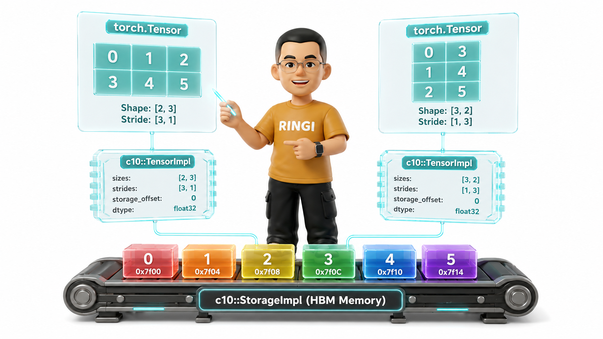
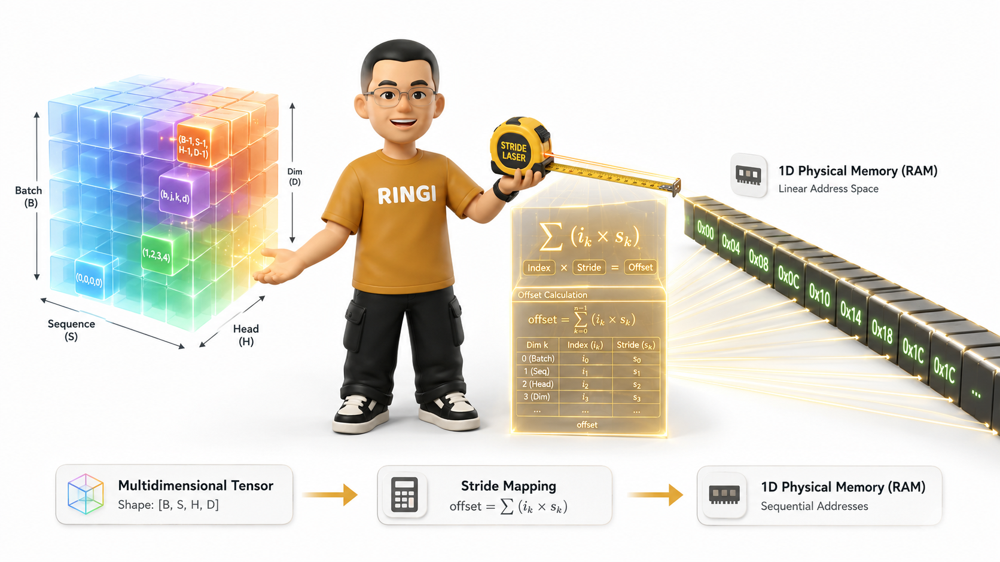
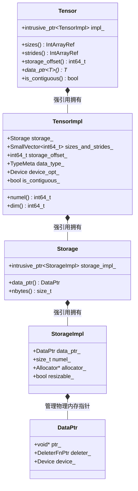
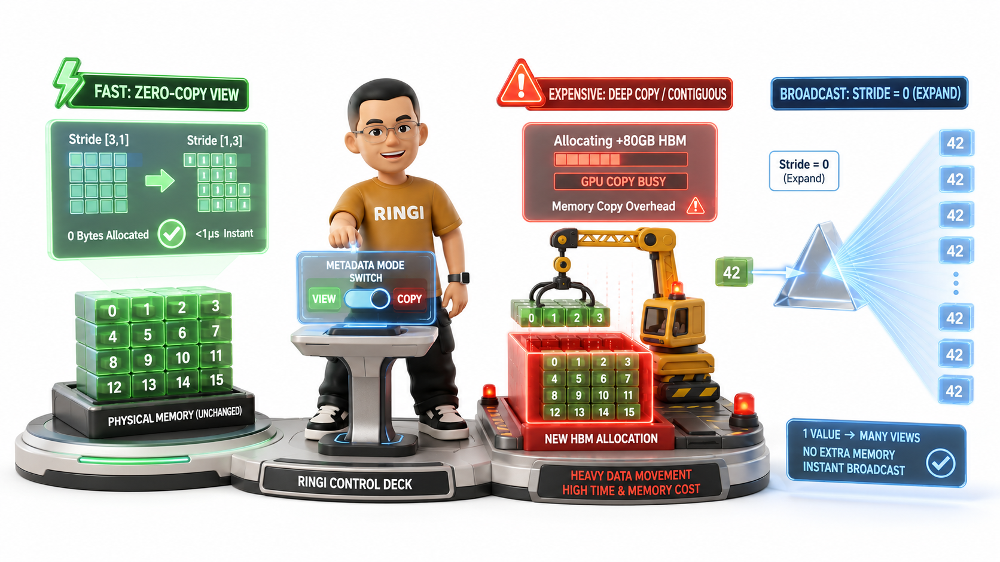
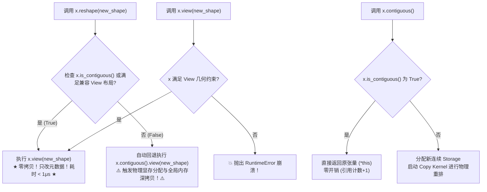
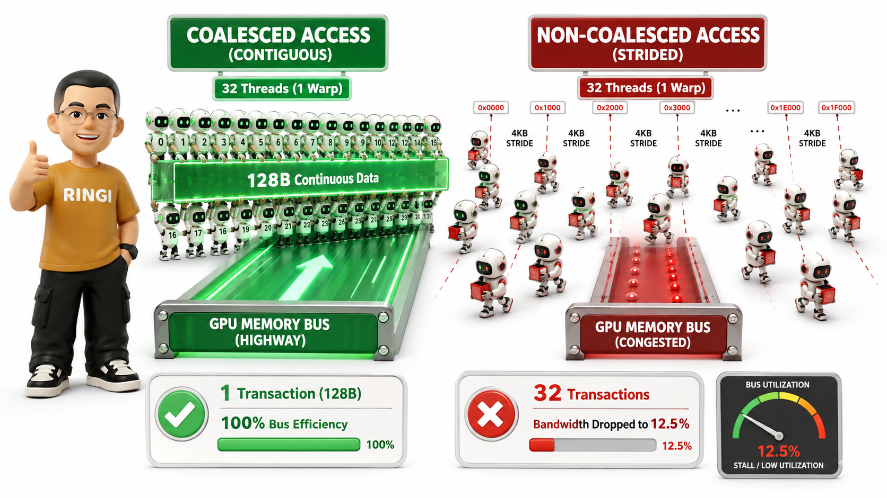

# 🏛️ 第05讲：PyTorch 底层系统机制——Tensor 内存布局、Stride 与 Contiguous

> **主讲人**：👓 **Ringi**（大厂 AI Infrastructure 工程师）  
> **所属模块**：Module 00: 性能工程与系统前置  
> **篇章范式**：🏛️ 性能工程与系统前置篇（Performance Engineering & System Baseline）  
> **核心导读**：在许多深度学习初学者的直觉中，Tensor 就像一个立体透明的"多维魔方"，我们在 Python 中调用 `transpose`、`permute`、`view` 似乎是在三维甚至高维空间中随意旋转和切割这个魔方。但在底层物理硬件和操作系统眼中，**物理内存和显存永远都只是一条从低地址向高地址线性延伸的一维连续字节数组（1D Storage Buffer）**！  
> PyTorch 究竟用了什么精妙的元数据机制，让这个一维数组在 Python 上层呈现出任意维度的几何形态？为什么一个看似人畜无害的 `x.t().view(-1)` 会引发 `RuntimeError` 运行时崩溃？为什么随手加一句 `.contiguous()` 能解决报错，却可能在千卡集群上引发数十 GB 显存的隐式拷贝风暴与 GPU 吞吐腰斩？本讲带你从 C10/ATen 源码与计算机体系结构第一性原理出发，彻底穿透 Tensor 内存布局、Stride 步长投影与 GPU 访存合并（Memory Coalescing）的底层奥秘！



```text
=================================================================================================
                                   Ringi 3D 架构工坊 · 核心全景
┌───────────────────────────────────────────────────────────────────────────────────────────────┐
│                                                                                               │
│    [Python / User Layer]                [C10 / ATen Layer]             [Hardware / CUDA Layer]│
│   ┌───────────────────────┐            ┌───────────────────────┐      ┌─────────────────────┐ │
│   │   torch.Tensor (x)    │            │   c10::TensorImpl     │      │ c10::StorageImpl    │ │
│   │   Shape: [2, 3]       │──(句柄包装)─►│   Sizes: [2, 3]       │──┐   │ (1D Continuous HBM) │ │
│   │   Stride: [3, 1]      │            │   Strides: [3, 1]     │  │   │ [0][1][2][3][4][5]  │ │
│   │   Offset: 0           │            │   Offset: 0           │  │   │ 0x7f00... (24B)     │ │
│   └───────────────────────┘            └───────────────────────┘  │   └──────────▲──────────┘ │
│                                                                   │(共享物理底账) │             │
│   ┌───────────────────────┐            ┌───────────────────────┐  │              │             │
│   │   torch.Tensor (x.t)  │            │   c10::TensorImpl     │  │              │             │
│   │   Shape: [3, 2]       │──(零拷贝)──►│   Sizes: [3, 2]       │──┘              │             │
│   │   Stride: [1, 3]      │            │   Strides: [1, 3]     │                 │             │
│   │   Offset: 0 (Non-Cont)│            │   Offset: 0           │─────────────────┘             │
│   └───────────────────────┘            └───────────────────────┘                               │
│                                                                                               │
└───────────────────────────────────────────────────────────────────────────────────────────────┘
=================================================================================================
```

<!-- more -->

## 📑 目录导航

- [0. Ringi 开场：张量在显存里到底长什么样？](#0-ringi-开场张量在显存里到底长什么样)
  - [0.1 一次令人发指的线上事故：消失的显存与崩溃的训练任务](#01-一次令人发指的线上事故消失的显存与崩溃的训练任务)
  - [0.2 算法眼中的"高维魔方" vs 硬件眼中的"一维磁带"](#02-算法眼中的高维魔方-vs-硬件眼中的一维磁带)
  - [0.3 为什么 AI Infra 工程师必须穿透 Tensor 底层机制？](#03-为什么-ai-infra-工程师必须穿透-tensor-底层机制)
- [1. PyTorch Tensor 物理三层架构解构（Tensor vs TensorImpl vs Storage）](#1-pytorch-tensor-物理三层架构解构tensor-vs-tensorimpl-vs-storage)
  - [1.1 C10 / ATen 核心类图与对象所有权关系](#11-c10--aten-核心类图与对象所有权关系)
  - [1.2 `at::Tensor`：轻量级智能指针门面](#12-attensor轻量级智能指针门面)
  - [1.3 `c10::TensorImpl`：张量元数据（Metadata）的集大成者](#13-c10tensorimpl张量元数据metadata的集大成者)
  - [1.4 `c10::StorageImpl`：物理内存/显存的终极载体与内存分配器契约](#14-c10storageimpl物理内存显存的终极载体与内存分配器契约)
  - [1.5 多张量共享 Storage 机制：引用计数（Ref Count）与视图（View）网络](#15-多张量共享-storage-机制引用计数ref-count与视图view网络)
- [2. Strides（步长）几何第一性原理与数学投影模型](#2-strides步长几何第一性原理与数学投影模型)
  - [2.1 什么是 Stride？一句话工程直觉](#21-什么是-stride一句话工程直觉)
  - [2.2 多维逻辑坐标到一维物理地址的映射公式推导](#22-多维逻辑坐标到一维物理地址的映射公式推导)
  - [2.3 行优先（Row-Major） vs 列优先（Column-Major）](#23-行优先row-major-vs-列优先column-major)
  - [2.4 标准连续张量（Contiguous Tensor）的步长递推计算法](#24-标准连续张量contiguous-tensor的步长递推计算法)
  - [2.5 2D、3D、4D 张量步长白板手算演示](#25-2d3d4d-张量步长白板手算演示)
- [3. 零拷贝的魔法：View、Transpose、Permute、Slice 与 Expand 底层剖析](#3-零拷贝的魔法viewtransposepermuteslice-与-expand-底层剖析)
  - [3.1 零拷贝算子（Metadata-Only Operators）的本质：只改元数据，不碰字节](#31-零拷贝算子metadata-only-operators的本质只改元数据不碰字节)
  - [3.2 转置（Transpose）与维度置换（Permute）：步长阵列的对调置换](#32-转置transpose与维度置换permute步长阵列的对调置换)
  - [3.3 切片（Narrow / Slice）与偏移量（Storage Offset）的精妙配合](#33-切片narrow--slice与偏移量storage-offset的精妙配合)
  - [3.4 `torch.expand` / 广播（Broadcast）：Stride = 0 的降维打击与空间奇迹](#34-torchexpand--广播broadcaststride--0-的降维打击与空间奇迹)
  - [3.5 降维与升维（Squeeze / Unsqueeze）的步长推演法则](#35-降维与升维squeeze--unsqueeze的步长推演法则)
- [4. 深入骨髓的 Contiguous（连续性）与 View 崩溃之谜](#4-深入骨髓的-contiguous连续性与-view-崩溃之谜)
  - [4.1 什么是真正的 `is_contiguous()`？C-Contiguous 的数学严格判定定理](#41-什么是真正的-is_contiguousc-contiguous-的数学严格判定定理)
  - [4.2 为什么 `tensor.transpose().view()` 会报错？View 的物理几何可折叠约束](#42-为什么-tensortransposeview-会报错view-的物理几何可折叠约束)
  - [4.3 `.view()` vs `.reshape()` vs `.contiguous()` 的终极全景对比](#43-view-vs-reshape-vs-contiguous-的终极全景对比)
  - [4.4 隐式拷贝陷阱：在大模型训练中滥用 `.contiguous()` 会发生什么？](#44-隐式拷贝陷阱在大模型训练中滥用-contiguous-会发生什么)
- [5. 硬件与性能第一性原理：Stride 对 CPU Cache 与 GPU 访存合并的生死影响](#5-硬件与性能第一性原理stride-对-cpu-cache-与-gpu-访存合并的生死影响)
  - [5.1 CPU 视角：Cache Line 空间局部性与非连续跨步遍历的时延断崖](#51-cpu-视角cache-line-空间局部性与非连续跨步遍历的时延断崖)
  - [5.2 GPU 视角：Warp 线程对齐与全局内存合并访问（Memory Coalescing）契约](#52-gpu-视角warp-线程对齐与全局内存合并访问memory-coalescing契约)
  - [5.3 为什么 CUDA Kernel 必须假设 Contiguous？Strided Kernel 的整数除法与取模灾难](#53-为什么-cuda-kernel-必须假设-contiguousstrided-kernel-的整数除法与取模灾难)
  - [5.4 cuBLAS GEMM 如何利用 Leading Dimension（LDA/LDB/LDC）化解转置开销](#54-cublas-gemm-如何利用-leading-dimensionldaldbldc化解转置开销)
- [6. 大模型实战剖析：Multi-Head Attention 中的 Stride 演变追踪](#6-大模型实战剖析multi-head-attention-中的-stride-演变追踪)
  - [6.1 MHA 全流程张量 Shape、Strides 与连续性逐步追踪表](#61-mha-全流程张量-shape-strides-与连续性逐步追踪表)
  - [6.2 为什么 Attention 前向必须执行 `transpose(1, 2)`？](#62-为什么-attention-前向必须执行-transpose1-2)
  - [6.3 为什么 Attention 输出合并投影必须写成 `.transpose(1, 2).contiguous().view(...)`？](#63-为什么-attention-输出合并投影必须写成-transpose1-2contiguousview)
  - [6.4 FlashAttention 的架构突破：如何在片上 SRAM 消除 HBM Contiguous 拷贝？](#64-flashattention-的架构突破如何在片上-sram-消除-hbm-contiguous-拷贝)
- [7. 动手实战与代码实验室（Hands-on Benchmark & Inspection）](#7-动手实战与代码实验室hands-on-benchmark--inspection)
  - [7.1 实验 1：深入张量解剖室——探查 `data_ptr`、`storage`、`stride` 与内存地址](#71-实验-1深入张量解剖室探查-data_ptrstoragestride-与内存地址)
  - [7.2 实验 2：零拷贝验证——证明 Transpose 与 Expand 没有分配任何新显存](#72-实验-2零拷贝验证证明-transpose-与-expand-没有分配任何新显存)
  - [7.3 实验 3：View 崩溃重现与 `reshape` 隐式拷贝开销基准压测](#73-实验-3view-崩溃重现与-reshape-隐式拷贝开销基准压测)
  - [7.4 实验 4：CPU 端连续 vs 非连续访存的 Cache Miss 性能阶梯实测](#74-实验-4cpu-端连续-vs-非连续访存的-cache-miss-性能阶梯实测)
  - [7.5 实验 5：GPU 端 CUDA Kernel 连续访存 vs 跨步访存有效带宽压测](#75-实验-5gpu-端-cuda-kernel-连续访存-vs-跨步访存有效带宽压测)
  - [7.6 实验 6：C++ ATen 底层实战——直接用 C++ 操纵 `TensorImpl` 与内存指针](#76-实验-6c-aten-底层实战直接用-c-操纵-tensorimpl-与内存指针)
- [8. Ringi 避坑指南与大厂硬核经典面试题](#8-ringi-避坑指南与大厂硬核经典面试题)
  - [8.1 避坑表格（❌ 常见小白错误理解 vs ✅ 大厂 AI Infra 正确理解）](#81-避坑表格-常见小白错误理解-vs--大厂-ai-infra-正确理解)
  - [8.2 4 道大厂硬核张量机制与内存面试题（附白板推导与标准答题路径）](#82-4-道大厂硬核张量机制与内存面试题附白板推导与标准答题路径)
- [9. Ringi 5 点核心速记口诀、自我检验清单与课后深度思考题](#9-ringi-5-点核心速记口诀自我检验清单与课后深度思考题)
- [10. 📚 参考资料与 PyTorch C10/ATen 核心源码指引](#10--参考资料与-pytorch-c10aten-核心源码指引)

---

# 0. Ringi 开场：张量在显存里到底长什么样？

## 0.1 一次令人发指的线上事故：消失的显存与崩溃的训练任务

刚进大厂参与百亿参数大语言模型（LLM）训练平台建设时，我遇到了一个极其诡异的生产 Issue：

算法团队提交了一段重构后的多头注意力（Multi-Head Attention）自定义模块代码，在单机 8 卡 A100-80GB 集群上进行小规模测试。模型前向计算没跑几步，系统监控告警瞬间炸裂：
- **GPU 显存暴涨**：原本经过精确显存建模、预留了 15GB Headroom 的显存空间，在几百个 Iteration 内被迅速蚕食殆尽，最终抛出 `torch.cuda.OutOfMemoryError: CUDA out of memory`；
- **训练吞吐雪崩**：在 OOM 崩溃之前，单个 Step 的迭代耗时从 180ms 飙升到了 620ms，GPU 算力利用率（MFU）直接从 52% 跌落到了 15%！

排查整个 Git Commit 记录，算法同学只修改了核心 Attention 中的一行张量重排代码：

```python
# ❌ 原本的代码写法：
# out = attn_weights.matmul(v).transpose(1, 2)
# out = out.reshape(batch_size, seq_len, num_heads * head_dim)

# ❌ 算法同学为了"消除潜在警告"，改写成了：
out = attn_weights.matmul(v).transpose(1, 2).contiguous()
out = out.view(batch_size, seq_len, num_heads * head_dim)
```

为什么只是显式加了一个看似人畜无害的 `.contiguous()`，或者在不恰当的时机调用了 `.reshape()`，就会导致几十 GB 显存的莫名消耗以及数倍的性能劣化？

这背后的根本原因，就是对 **PyTorch Tensor 底层内存排布（Memory Layout）、步长机制（Strides）与连续性（Contiguous）** 缺乏第一性原理的系统理解！

---

## 0.2 算法眼中的"高维魔方" vs 硬件眼中的"一维磁带"

在深度学习算法研究员的脑海里，张量是一组具有优美几何对称性的高维结构：

- 标量（Scalar）是 $0$ 维的点；
- 向量（Vector）是 $1$ 维的线；
- 矩阵（Matrix）是 $2$ 维的面；
- 图像张量 $[B, C, H, W]$ 是 $4$ 维的立方体阵列；
- LLM 隐层状态 $[B, S, N_h, D_h]$ 是一个四维多头超立方体。

在 Python 层面，你可以随意使用切片、转置、广播、轴交换等高级 API 对这个"高维魔方"进行任意揉捏和变形。



然而，如果你把视线向下穿透到物理硬件层——不管是 CPU 的 DDR5 主存，还是 GPU 上的 HBM3/HBM3e 高带宽显存，**物理世界中根本不存在多维空间！**

```text
+---------------------------------------------------------------------------------------+
│  物理内存 / 显存硬件的唯一真理：                                                      │
│  硬件只认线性字节地址（Byte Address）：0x00000000 -> 0xFFFFFFFF                         │
│                                                                                       │
│  物理内存就像一条无限延伸的一维"纸带"或"磁带”：                                      │
│  ┌────────┬────────┬────────┬────────┬────────┬────────┬────────┬────────┐             │
│  │ Byte 0 │ Byte 1 │ Byte 2 │ Byte 3 │ Byte 4 │ Byte 5 │ Byte 6 │ Byte 7 │ ...         │
│  └────────┴────────┴────────┴────────┴────────┴────────┴────────┴────────┘             │
+---------------------------------------------------------------------------------------+
```

任何一个 4 维、5 维甚至 8 维的 Tensor，最终都必须被"压平（Flatten）"成一根一维的物理数据流，线性躺在连续的物理内存地址空间中。

那么，**连接高维抽象几何与一维物理现实的纽带到底是什么？**  
答案只有两个字：**步长（Strides）**。

---

## 0.3 为什么 AI Infra 工程师必须穿透 Tensor 底层机制？

对于做 AI 系统与高性能基础设施的工程师来说，搞懂 Tensor 底层机制是所有性能优化的生死线：

1. **零拷贝（Zero-Copy）性能极致榨取**：现代大模型推理与训练框架（如 vLLM、TensorRT-LLM、Megatron-LM）之所以能在微秒级完成复杂的 KV Cache 切片和张量重排，全靠 Stride 变换实现的元数据级零拷贝；
2. **消灭隐式显存拷贝与 OOM 隐患**：彻底搞清楚 `.view()`、`.reshape()` 与 `.contiguous()` 的触发条件，避免在 Hot Loop（热点循环）中产生无意识的全局内存拷贝；
3. **编写高性能 CUDA / Triton Kernel 的前置条件**：GPU 拥有成千上万个并发线程，如果张量在物理内存中是非连续跨步的（Non-Contiguous Strided），线程读取时将触发严重的**非合并访问（Uncoalesced Memory Access）**，显存有效带宽直接暴跌 80%~90%！
4. **深入阅读 PyTorch C10/ATen 源码与自定义 C++ 算子开发**：在 C++ 层操作 `at::Tensor` 时，必须直接处理裸指针与步长数组，任何步长假设错误都会直接导致内存越界（Segmentation Fault）或静默计算错误。

---

# 1. PyTorch Tensor 物理三层架构解构（Tensor vs TensorImpl vs Storage）

要彻底搞懂 Tensor，我们必须剥开 PyTorch 的 Python 外衣，直接下沉到 PyTorch 的 C++ 核心库——**C10（Core 10）** 与 **ATen（A Tensors Library）** 的源码世界。

在 PyTorch 的物理实现中，一个 Tensor 绝不是一个单独的大结构体，而是由精巧的三层架构组合而成的系统：

```text
+---------------------------------------------------------------------------------------+
│                      PyTorch Tensor 三层物理架构核心关系                               │
│                                                                                       │
│  [第一层：栈上门面]       at::Tensor                                                   │
│                          ├── 包含: c10::intrusive_ptr<c10::TensorImpl> (智能指针)      │
│                          └── 特点: 仅占 8 字节，按值传递极轻量                         │
│                                      │                                                │
│                                      ▼                                                │
│  [第二层：元数据核心]     c10::TensorImpl (堆上对象，记录高维几何视角)                 │
│                          ├── sizes_ / shape_          : [2, 3] (逻辑形状)             │
│                          ├── strides_                 : [3, 1] (物理步长)             │
│                          ├── storage_offset_          : 0 (物理首地址偏移)            │
│                          ├── data_type_ (TypeMeta)    : Float32 (4 Bytes)             │
│                          ├── device_opt_              : CUDA:0                        │
│                          ├── is_contiguous_           : true (布尔缓存)               │
│                          └── storage_                 : c10::Storage (强引用指针)     │
│                                                              │                        │
│                                                              ▼                        │
│  [第三层：物理数据底账]   c10::StorageImpl (堆上对象，管理真正的连续字节内存块)        │
│                          ├── data_ptr_ (DataPtr)      : void* (0x7f88a000)            │
│                          ├── numel_ / nbytes_         : 24 Bytes (6 * 4B)             │
│                          ├── allocator_               : CUDACachingAllocator*         │
│                          └── resizable_               : false                         │
│                                                                                       │
+---------------------------------------------------------------------------------------+
```

---

## 1.1 C10 / ATen 核心类图与对象所有权关系

我们用严谨的 Mermaid 类图画出 PyTorch 底层这三个核心类之间的协作与所有权关系：



---

## 1.2 `at::Tensor`：轻量级智能指针门面

在 C++ 代码中（或经过 PyBind11 导出到 Python 的 `torch.Tensor`），`at::Tensor` 本身其实只是一个**浅层包装对象（Handle Wrapper）**。

它的内部只有一个核心成员变量：
```cpp
// 摘自 pytorch/aten/src/ATen/core/TensorBody.h
namespace at {
class TORCH_API Tensor {
 protected:
  c10::intrusive_ptr<TensorImpl, UndefinedTensorImpl> impl_;
 public:
  // 大量转发到 impl_ 的内联方法
  IntArrayRef sizes() const { return impl_->sizes(); }
  IntArrayRef strides() const { return impl_->strides(); }
  int64_t storage_offset() const { return impl_->storage_offset(); }
  void* data_ptr() const { return impl_->data(); }
};
}
```

> 💡 **Ringi 划重点**：  
> `at::Tensor` 在 64 位系统上通常只占用 **8 个字节**（一个指针大小）。因此在 PyTorch 内部 C++ 函数传参时，`at::Tensor` 经常直接按值传递（Pass by Value）或者常量引用传递（`const Tensor&`），拷贝成本极低，仅仅是原子递增了一次 `TensorImpl` 的引用计数。

---

## 1.3 `c10::TensorImpl`：张量元数据（Metadata）的集大成者

`c10::TensorImpl` 是 PyTorch 中最核心、最复杂的元数据类。它定义了如何把底层的一维字节数组**"解释"**成一个特定形状的多维张量。

我们来看 `TensorImpl` 的几个关键成员：

1. **`sizes_and_strides_`**：为了避免在高维张量操作中频繁触发堆内存分配（Heap Allocation），PyTorch 采用了 `c10::SmallVector`（小向量优化，预分配 5 个维度的栈空间）。它紧凑地存放着该张量在每个维度上的大小（Sizes）与步长（Strides）；
2. **`storage_offset_`**：表示当前 Tensor 的逻辑起点 $[0, 0, \dots, 0]$ 相对于底层 `Storage` 物理起始地址的元素偏移个数（以元素为单位，不是以字节为单位）；
3. **`data_type_`（`caffe2::TypeMeta`）**：记录数据类型（如 `kFloat`、`kHalf`、`kBFloat16`、`kInt` 等），并内置了对应类型的 `itemsize`（字节大小，如 FP32 为 4 字节，BF16 为 2 字节）；
4. **`device_`**：张量所在的物理设备（如 `DeviceType::CUDA`, `device_index=0`）；
5. **`autograd_meta_`**：挂载 Autograd 反向传播所需的计算图节点信息（`grad_fn`、`grad_` 等）；
6. **`is_contiguous_`**：一个布尔标志位（带有缓存机制），指示当前张量的内存排布是否是连续的。

---

## 1.4 `c10::StorageImpl`：物理内存/显存的终极载体与内存分配器契约

`c10::StorageImpl` 是真正的物理内存管理者，它完全不知道、也不关心多维张量的概念。在它眼里，世界就是一块平铺直叙的连续内存空间：

```cpp
// 摘自 pytorch/c10/core/StorageImpl.h 简化版
struct C10_API StorageImpl : public c10::intrusive_ptr_target {
  DataPtr data_ptr_;       // 封装了 void* 裸指针、自定义释放器 Deleter 以及 Device
  size_t numel_;           // 容量大小（以字节或特定单位计）
  Allocator* allocator_;   // 内存分配器指针（如 CUDACachingAllocator）
  bool resizable_;         // 是否允许动态扩缩容
};
```

- **`data_ptr_`**：指向实际物理内存的首地址（如 `0x7f88a000`）。在 CPU 上它是由 `posix_memalign` 或 `malloc` 分配的主机内存；在 GPU 上它是由 `cudaMalloc` 或 PyTorch 的 **CUDA 缓存分配器（CUDACachingAllocator）** 划拨的显存块；
- **生命周期管理**：`StorageImpl` 同样继承自 `c10::intrusive_ptr_target`，采用侵入式引用计数。只有当所有引用该 Storage 的 `TensorImpl` 都被析构销毁时，`StorageImpl` 才会调用 `allocator_->raw_deallocate(data_ptr_)` 将显存归还给显存池。

---

## 1.5 多张量共享 Storage 机制：引用计数（Ref Count）与视图（View）网络

当我们在 Python 中执行切片、转置、变换形状时，PyTorch 会创建一个全新的 `TensorImpl`，但让它的 `storage_` 指针直接指向原本已有的 `StorageImpl`，并将 `StorageImpl` 的引用计数加 1。



```text
+---------------------------------------------------------------------------------------+
│                          多 Tensor 共享 Storage 物理映射全景                           │
│                                                                                       │
│    Tensor A (原张量)                   Tensor B (切片)             Tensor C (转置)    │
│  ┌───────────────────────┐          ┌───────────────────┐       ┌───────────────────┐ │
│  │ TensorImpl A          │          │ TensorImpl B      │       │ TensorImpl C      │ │
│  │ Shape:   [3, 4]       │          │ Shape:   [2, 2]   │       │ Shape:   [4, 3]   │ │
│  │ Stride:  [4, 1]       │          │ Stride:  [4, 1]   │       │ Stride:  [1, 4]   │ │
│  │ Offset:  0            │          │ Offset:  5        │       │ Offset:  0        │ │
│  └──────────┬────────────┘          └─────────┬─────────┘       └─────────┬─────────┘ │
│             │                                 │                           │           │
│             │                                 │                           │           │
│             └─────────────────────────┐       │       ┌───────────────────┘           │
│                                       ▼       ▼       ▼                               │
│                              ┌───────────────────────────────────┐                    │
│                              │        c10::StorageImpl           │                    │
│                              │        Ref Count: 3               │                    │
│                              │        nbytes: 48 Bytes           │                    │
│                              │        data_ptr: 0x7f00           │                    │
│                              └────────────────┬──────────────────┘                    │
│                                               │                                       │
│                                               ▼                                       │
│    物理内存条/显存: [0][1][2][3] | [4][5][6][7] | [8][9][10][11]                     │
│                     ─── Row 0 ───   ─── Row 1 ───  ──── Row 2 ────                    │
│                                         ▲  ▲                                          │
│                                         └──┴── Tensor B 观察的物理窗口                │
+---------------------------------------------------------------------------------------+
```

从上面的架构全景图中，我们可以得出两个极为关键的工程推论：

1. **零内存分配（Zero Allocation）**：创建 `Tensor B` 和 `Tensor C` 的过程中，完全**没有调用任何 `cudaMalloc`**，显存总占用量 1 个字节都没有增加；
2. **数据同步变更（In-place Mutation Risk）**：因为 $A$、$B$、$C$ 共享底层物理内存，如果在 Python 中对 $B$ 进行原地修改（如 `B.add_(10)`），$A$ 和 $C$ 对应位置的数值也会**瞬间同步发生改变**！

---

# 2. Strides（步长）几何第一性原理与数学投影模型

现在我们进入本讲最核心的数学与物理桥梁——**Strides（步长）**。

## 2.1 什么是 Stride？一句话工程直觉

很多教程把 Stride 讲得云里雾里，又是张量积又是高维映射。我们用一句话大白话直击本质：

> 💡 **Ringi 的一句话直觉**：  
> **Stride（步长）就是告诉你：当你在多维张量的第 $k$ 个维度上走一步（索引加 1），底层物理一维数组的指针必须向前跳跃多少个元素（Elements）！**

- 比如一个 2D 矩阵 `Shape = [3, 4]`，步长是 `Stride = [4, 1]`；
  - 在第 0 维（行）走一步（从第 0 行到第 1 行），物理底层要跳过整整一行（4 个元素），所以 `stride[0] = 4`；
  - 在第 1 维（列）走一步（从第 0 列到第 1 列），物理底层只需要跳过相邻的下一个元素，所以 `stride[1] = 1`。

---

## 2.2 多维逻辑坐标到一维物理地址的映射公式推导

假设我们有一个 $n$ 维张量 $T$，其元数据定义如下：
- **逻辑形状（Shape / Sizes）**：$(d_0, d_1, d_2, \dots, d_{n-1})$
- **步长数组（Strides）**：$(s_0, s_1, s_2, \dots, s_{n-1})$
- **存储偏移量（Storage Offset）**：$\text{offset}$
- **元素字节大小（Item Size）**：$S_{\text{byte}}$（例如 FP32 为 4 字节）
- **物理内存起始指针**：$P_{\text{base}} = \text{static\_cast<char*>}(\text{Storage.data\_ptr()})$

现在，我们在 Python 中访问多维张量的一个特定元素 $T[i_0, i_1, i_2, \dots, i_{n-1}]$（其中 $0 \le i_k < d_k$）。

硬件和 PyTorch 究竟是如何计算出这个元素在物理内存中的**一维元素绝对索引（Linear Index）**与**物理字节地址（Memory Byte Address）**的？

### 📐 步骤 1：一维元素逻辑偏移量计算公式
$$
\text{Linear Index}(i_0, i_1, \dots, i_{n-1}) = \text{offset} + \sum_{k=0}^{n-1} \left( i_k \times s_k \right)
$$
展开写成显式多项式：
$$
\text{Linear Index} = \text{offset} + i_0 \cdot s_0 + i_1 \cdot s_1 + i_2 \cdot s_2 + \dots + i_{n-1} \cdot s_{n-1}
$$

### 📐 步骤 2：物理字节地址转换公式
$$
\text{Physical Address} = P_{\text{base}} + \text{Linear Index} \times S_{\text{byte}}
$$

```text
+---------------------------------------------------------------------------------------+
│  多维坐标 -> 物理地址投影流水线                                                       │
│                                                                                       │
│   (i0, i1, ..., in-1) ──(点积求和 Σ ik * sk)──► Linear Offset ──(+ storage_offset)    │
│                                                        │                              │
│                                                        ▼                              │
│   Physical Memory Address ◄──(Base + Offset * 4B)── Element Index                     │
+---------------------------------------------------------------------------------------+
```

---

## 2.3 行优先（Row-Major） vs 列优先（Column-Major）

在计算机体系结构和数值计算领域，主要存在两种多维数组的物理排布规范：

1. **行优先（Row-Major / C-Order）**：
   - 绝大多数现代深度学习框架（PyTorch、NumPy、C/C++、Triton、ONNX）的默认排布；
   - 核心特征：**最右侧（最后一维）的维度在物理内存中是最连续的**，其 `stride` 等于 1；每向左跨越一个维度，`stride` 等于其右侧所有维度大小的连乘积。
2. **列优先（Column-Major / Fortran-Order）**：
   - 经典科学计算软件（Fortran、MATLAB、R、Julia、cuBLAS 底层默认）的排布；
   - 核心特征：**最左侧（第 0 维）在物理内存中是最连续的**，其 `stride` 等于 1。

```text
对于一个 2x3 的二维矩阵：
    ┌             ┐
    │  A00  A01  A02 │
    │  A10  A11  A12 │
    └             ┘

【行优先 (C-Order / PyTorch 默认)】: 按行连贯铺开
物理内存: [ A00, A01, A02, A10, A11, A12 ]
Strides:  [3, 1]

【列优先 (Fortran-Order / MATLAB)】: 按列连贯铺开
物理内存: [ A00, A10, A01, A11, A02, A12 ]
Strides:  [1, 2]
```

---

## 2.4 标准连续张量（Contiguous Tensor）的步长递推计算法

如果一个张量是标准行优先连续的（C-Contiguous），我们不需要死记硬背每个维度的步长，它遵循极其严格的**自右向左递推公式**。

给定张量形状 $\text{Shape} = (d_0, d_1, d_2, \dots, d_{n-1})$，其标准连续步长数组 $S = (s_0, s_1, \dots, s_{n-1})$ 的计算法则如下：

1. **边界基准条件（最右侧维度）**：
   $$s_{n-1} = 1$$
2. **自右向左逆向递推式**：
   $$s_k = s_{k+1} \times d_{k+1} \quad (\text{for } k = n-2, n-3, \dots, 0)$$
3. **通项乘积公式**：
   $$s_k = \prod_{j=k+1}^{n-1} d_j$$

> 💡 **物理含义**：  
> 第 $k$ 维的一个大单元，里面包裹了其右侧所有子维度形成的完整子张量。因此在第 $k$ 维跳过 1 个步长，等于跨越了它右侧所有维度元素数量的乘积！

---

## 2.5 2D、3D、4D 张量步长白板手算演示

我们通过三个由浅入深的工业级实例，手把手带大家推导 Stride：

### 🔢 案例 1：2D 矩阵手算
- **Shape**: `[3, 4]`（3 行 4 列）
- **推导过程**：
  - $s_1 = 1$
  - $s_0 = s_1 \times d_1 = 1 \times 4 = 4$
- **标准 Strides**: `(4, 1)`
- **验证**：访问 `x[2, 3]` $\to \text{index} = 2 \times 4 + 3 \times 1 = 11$（恰好是第 12 个元素，下标从 0 到 11，完全吻合！）。

---

### 🔢 案例 2：3D 批处理张量手算
- **Shape**: `[2, 3, 4]`（Batch=2, Sequence=3, Dimension=4）
- **推导过程**：
  - $s_2 = 1$
  - $s_1 = s_2 \times d_2 = 1 \times 4 = 4$
  - $s_0 = s_1 \times d_1 = 4 \times 3 = 12$
- **标准 Strides**: `(12, 4, 1)`
- **验证**：访问 `x[1, 2, 3]` $\to \text{index} = 1 \times 12 + 2 \times 4 + 3 \times 1 = 12 + 8 + 3 = 23$（总元素数 $2 \times 3 \times 4 = 24$，最大下标为 23）。

---

### 🔢 案例 3：4D Transformer 隐层张量手算
- **Shape**: `[B, S, H, D] = [2, 4096, 32, 128]`（Batch=2, SeqLen=4096, Heads=32, HeadDim=128）
- **推导过程**：
  - $s_3 = 1$（单个 Head 内的特征维度）
  - $s_2 = 1 \times 128 = 128$（单个 Head 占 128 个浮点数）
  - $s_1 = 128 \times 32 = 4096$（单 Token 的所有 Heads 拼接占 4096 个浮点数，即 Hidden Size）
  - $s_0 = 4096 \times 4096 = 16,777,216$（单个样本占 16.77M 浮点数，FP16 下约 32MB）
- **标准 Strides**: `(16777216, 4096, 128, 1)`

---

# 3. 零拷贝的魔法：View、Transpose、Permute、Slice 与 Expand 底层剖析

理解了 Stride 的数学本质后，我们就可以彻底揭开 PyTorch 中各种"神奇"零拷贝算子的底层运作机理。

## 3.1 零拷贝算子（Metadata-Only Operators）的本质：只改元数据，不碰字节

在 PyTorch 中，有一类算子执行速度快如闪电（通常在 **1 微秒以内**），无论张量包含 100 个元素还是 100 亿个元素，它们的耗时完全相同，且**显存增加量恒等于 0**！

这类算子被称为 **视图算子（View / Metadata-Only Operators）**。

```text
+---------------------------------------------------------------------------------------+
│  视图算子的底层操作精髓：                                                              │
│                                                                                       │
│  1. 在堆上新 new 一个 c10::TensorImpl 元数据对象；                                    │
│  2. 修改新 TensorImpl 的 sizes_、strides_、storage_offset_；                           │
│  3. 将新 TensorImpl 的 storage_ 指针指向原本的 StorageImpl（原子引用计数 +1）；       │
│  4. 绝不向 GPU 驱动提交任何数据搬运 Kernel（0 FLOPs，0 Byte 显存拷贝）！                │
+---------------------------------------------------------------------------------------+
```

---

## 3.2 转置（Transpose）与维度置换（Permute）：步长阵列的对调置换

假设我们有一个张量 $x$，Shape 为 `[2, 3]`，数据为：
$$
x = \begin{bmatrix} 0 & 1 & 2 \\ 3 & 4 & 5 \end{bmatrix}
$$
其初始元数据为：`Shape = [2, 3]`, `Strides = [3, 1]`, `Offset = 0`。
底层 Storage: `[0, 1, 2, 3, 4, 5]`。

现在我们在 Python 中调用 `y = x.transpose(0, 1)`（或者 `y = x.t()`）。

PyTorch 底层做了什么？**仅仅交换了 `sizes_` 和 `strides_` 数组中第 0 个和第 1 个维度的值！**

```cpp
// PyTorch 底层 transpose 的伪逻辑（非常简单优雅）：
TensorImpl* new_impl = new TensorImpl(original_impl->storage());
new_impl->sizes_[0] = original_impl->sizes_[1];   // 3
new_impl->sizes_[1] = original_impl->sizes_[0];   // 2
new_impl->strides_[0] = original_impl->strides_[1]; // 1
new_impl->strides_[1] = original_impl->strides_[0]; // 3
```

此时 $y$ 的元数据变为：
- **Shape**: `[3, 2]`
- **Strides**: `[1, 3]`（注意：步长不再是标准行优先的 `[2, 1]`，而是逆序的 `[1, 3]`！）
- **Offset**: `0`

我们用映射公式来验证 $y$ 的逻辑访问：
- 访问 $y[0, 1]$（第 0 行第 1 列）：
  $$\text{Index} = 0 \times 1 + 1 \times 3 = 3 \implies \text{Storage}[3] = 3$$
- 访问 $y[1, 0]$（第 1 行第 0 列）：
  $$\text{Index} = 1 \times 1 + 0 \times 3 = 1 \implies \text{Storage}[1] = 1$$
- 访问 $y[2, 1]$（第 2 行第 1 列）：
  $$\text{Index} = 2 \times 1 + 1 \times 3 = 5 \implies \text{Storage}[5] = 5$$

$y$ 完美呈现了转置矩阵的数学形态：
$$
y = \begin{bmatrix} 0 & 3 \\ 1 & 4 \\ 2 & 5 \end{bmatrix}
$$
**整个过程没有发生任何一个浮点数的数据搬移！**

---

## 3.3 切片（Narrow / Slice）与偏移量（Storage Offset）的精妙配合

假设有一个 2D 张量 `x = torch.arange(12).reshape(3, 4)`：
$$
x = \begin{bmatrix} 
0 & 1 & 2 & 3 \\ 
4 & 5 & 6 & 7 \\ 
8 & 9 & 10 & 11 
\end{bmatrix}
$$
此时底层 Storage 为 `[0, 1, 2, 3, 4, 5, 6, 7, 8, 9, 10, 11]`，`Strides = [4, 1]`。

现在我们做一次切片操作：`sub = x[1:, 1:3]`（截取第 1~2 行，第 1~2 列）。

截取出来的子矩阵应该是：
$$
\text{sub} = \begin{bmatrix} 5 & 6 \\ 9 & 10 \end{bmatrix}
$$

PyTorch 底层如何用元数据表达 `sub`？

1. **确定子张量的起始元素**：子张量左上角元素是 $x[1, 1]$，其在 Storage 中的线性索引为 $1 \times 4 + 1 \times 1 = 5$。因此，将 `sub` 的 **`storage_offset_` 设为 5**；
2. **确定子张量的形状**：`Shape = [2, 2]`；
3. **保留原张量的步长**：在原矩阵中换一行依然需要跨越 4 个元素，换一列跨越 1 个元素，因此 **`Strides = [4, 1]`**。

我们来验证 `sub` 的多维映射：
- 访问 `sub[0, 0]` $\to \text{Index} = 5 + 0 \times 4 + 0 \times 1 = 5 \implies \text{Storage}[5] = 5$；
- 访问 `sub[0, 1]` $\to \text{Index} = 5 + 0 \times 4 + 1 \times 1 = 6 \implies \text{Storage}[6] = 6$；
- 访问 `sub[1, 0]` $\to \text{Index} = 5 + 1 \times 4 + 0 \times 1 = 9 \implies \text{Storage}[9] = 9$；
- 访问 `sub[1, 1]` $\to \text{Index} = 5 + 1 \times 4 + 1 \times 1 = 10 \implies \text{Storage}[10] = 10$。

完全正确！切片操作同样是一个纯粹的元数据操作。

---

## 3.4 `torch.expand` / 广播（Broadcast）：Stride = 0 的降维打击与空间奇迹

广播（Broadcasting）是深度学习中最常用的机制之一（例如在 Batch 维度为每一个样本加上同一个 Bias 偏置向量）。

很多同学以为广播会把数据在显存里复制成千上万份。**这是大错特错的！**

看下面这段代码：
```python
x = torch.tensor([1, 2, 3])  # Shape: [3], Strides: [1]
# 将 [3] 广播扩展为 [1000000, 3] (一百万行！)
expanded = x.expand(1000000, 3)
```

如果真的物理复制 100 万次，需要消耗 $1000000 \times 3 \times 4 \text{ Bytes} \approx 12\text{ MB}$ 的内存。  
但实际上，`expanded` 消耗的额外内存是 **0 字节**！

PyTorch 是怎么做到的？答案就是：**将广播维度的 Stride 设为 0！**

```text
+---------------------------------------------------------------------------------------+
│  torch.expand 的 Stride = 0 魔法                                                      │
│                                                                                       │
│  元数据配置：                                                                         │
│  - Shape:   [1000000, 3]                                                              │
│  - Strides: [0, 1]          <=== 关键！第 0 维的步长直接设为 0！                      │
│  - Offset:  0                                                                         │
│  - Storage: [1, 2, 3]       <=== 物理上依然只有 3 个浮点数！                          │
│                                                                                       │
│  物理地址计算：                                                                       │
│  访问 expanded[999999, 1] (第一百万行第 1 列):                                        │
│  Index = 999999 * 0 + 1 * 1 = 1  ===> 直接命中 Storage[1] = 2！                       │
+---------------------------------------------------------------------------------------+
```

> 💡 **Ringi 工程师洞察**：  
> 当一个维度的 $\text{Stride} = 0$ 时，无论你在该维度上索引走到几百万，$\text{index} \times 0 \equiv 0$！它在物理内存中永远定格在同一个位置。这就是用 $O(1)$ 的存储空间表达无穷大张量的**"空间奇迹"**。

---

## 3.5 降维与升维（Squeeze / Unsqueeze）的步长推演法则

- **`unsqueeze(dim)`（升维）**：
  - 在指定位置插入一个大小为 1 的新维度（`size = 1`）；
  - 该维度的 `stride` 设为与右侧相邻维度相同的值（如果插入在最右侧，则设为 1）；
  - 因为该维度大小只有 1，其索引只能是 0，任何数乘以 0 都不会对物理偏移产生任何影响。
- **`squeeze(dim)`（降维）**：
  - 直接从 `sizes_` 和 `strides_` 中剔除大小为 1 的维度；
  - 同样不改变任何已有元素的物理寻址关系。

---

# 4. 深入骨髓的 Contiguous（连续性）与 View 崩溃之谜

现在我们来到了最容易让开发者踩坑的地方：**Contiguous（内存连续性）**。

## 4.1 什么是真正的 `is_contiguous()`？C-Contiguous 的数学严格判定定理

在 PyTorch 中，我们经常调用 `tensor.is_contiguous()`，它返回 `True` 或 `False`。

那么在底层源码中，PyTorch 判定一个张量是否为 C-Contiguous 的数学准则到底是什么？

### 📜 PyTorch C-Contiguous 判定定理
一个形状为 $(d_0, d_1, \dots, d_{n-1})$、步长为 $(s_0, s_1, \dots, s_{n-1})$ 的张量是 **C-连续（C-Contiguous）** 的，当且仅当满足以下两个条件之一：

1. 张量中元素总数 $\le 1$（退化情况）；
2. 对于所有大小大于 1 的维度 $k$（即 $d_k > 1$），其步长必须严格等于其右侧所有维度大小的乘积：
   $$s_k = \prod_{j=k+1}^{n-1} d_j$$
   且最右侧大小大于 1 的维度，其步长必须严格为 1：
   $$s_{\text{last}} = 1$$

我们来看 PyTorch C10 内部的源码实现逻辑（摘自 `c10/core/TensorImpl.h` 中的 `compute_contiguous()`）：

```cpp
// PyTorch 底层判断 C-Contiguous 的真实实现
static bool compute_contiguous(IntArrayRef sizes, IntArrayRef strides) {
  int64_t dim = sizes.size();
  int64_t expected_stride = 1;
  // 从最右侧维度向左扫描
  for (int64_t i = dim - 1; i >= 0; --i) {
    if (sizes[i] == 0) return true;
    if (sizes[i] == 1) continue; // 大小为 1 的维度不破坏连续性
    if (strides[i] != expected_stride) {
      return false; // 一旦步长不匹配，立即判定为非连续！
    }
    expected_stride *= sizes[i];
  }
  return true;
}
```

```text
+---------------------------------------------------------------------------------------+
│  Contiguous 判定实例对比表                                                            │
+---------------------+-------------------+---------------------+-----------------------+
│ 操作                | Shape             | Strides             | is_contiguous()       |
+---------------------+-------------------+---------------------+-----------------------+
│ torch.randn(2, 3)   | [2, 3]            | [3, 1]              | True (标准行优先)      |
│ x.transpose(0, 1)   | [3, 2]            | [1, 3]              | False (步长逆序)      |
│ x[:, ::2] (跨列切片)| [2, 2]            | [3, 2]              | False (内存存在空洞)  |
│ x.expand(5, 2, 3)   | [5, 2, 3]         | [0, 3, 1]           | False (第0维步长为0)  |
│ x.unsqueeze(0)      | [1, 2, 3]         | [6, 3, 1]           | True (size=1 维跳过)  |
+---------------------+-------------------+---------------------+-----------------------+
```

---

## 4.2 为什么 `tensor.transpose().view()` 会报错？View 的物理几何可折叠约束

我们在开场提到的经典报错：
```python
x = torch.randn(2, 3)
xt = x.t()  # Shape: [3, 2], Strides: [1, 3], is_contiguous: False
xt.view(6)  # 💥 抛出 RuntimeError: view size is not compatible with input tensor's size and stride
```

为什么 PyTorch 的 `.view()` 如此"固执"，非要在遇到非连续张量时抛出异常？

### 🔍 根本原因：View 必须保证"在不搬运物理数据的前提下完成形状重构"！

`.view(new_shape)` 的核心语义是：**在同一个 Storage 上，寻找一组新的 `new_strides`，使得多维寻址能够完美遍历原始数据。**

- 当 `x` 是连续的 `[2, 3]` 时，物理内存排布是按行连续的：`[A00, A01, A02, A10, A11, A12]`。  
  如果调用 `x.view(6)`，新的 `Strides = [1]`，第 0 到第 5 个元素正好按顺序对应物理内存的 6 个连续位置，完全合法！
- 但当 `xt` 转置后，逻辑上的一维展平顺序应该是：
  $$\text{逻辑顺序}: [A00, A10, A01, A11, A02, A12]$$
  而物理内存中的真实顺序依然是：
  $$\text{物理顺序}: [A00, A01, A02, A10, A11, A12]$$

**这两者的物理顺序已经完全脱节了！**  
如果不用新的内存做物理重排，根本不可能找到一组固定的线性 Strides，让硬件从 `[A00, A01, A02, ...]` 的一维内存中线性读出 `[A00, A10, A01, ...]`！

为了恪守 `.view()` 绝对零拷贝的系统契约，PyTorch 绝不允许 `.view()` 偷偷在底层分配显存进行数据重排，因此选择**断然抛出异常**，提醒开发者显存布局已经失效。

---

## 4.3 `.view()` vs `.reshape()` vs `.contiguous()` 的终极全景对比

为了让大家在生产开发中不再困惑，Ringi 将这三个关键 API 的底层行为与系统开销整理成全景决策图：



```text
+---------------------------------------------------------------------------------------------------+
│                    .view() vs .reshape() vs .contiguous() 工业级特性对比表                         │
+------------------+-----------------------+-----------------------+--------------------------------+
│ 特性维度         | .view(*shape)         | .reshape(*shape)      | .contiguous()                  │
+------------------+-----------------------+-----------------------+--------------------------------+
│ 是否保证零拷贝   | 是 (100% 零拷贝)      | 否 (可能发生隐式拷贝) | 视连续性而定 (非连续时深拷贝)  │
│ 对非连续输入的反应| 抛出 RuntimeError 崩溃| 自动深拷贝并重排数据  | 分配新内存进行物理重排数据     │
│ 适用场景         | 性能敏感路径、明确连续| 通用形状变换、灵活编程| 必须恢复行优先连续性的算子前置 │
│ 显存分配风险     | 零风险 (不分配显存)   | 有隐式显存暴涨风险    | 有显存二次分配风险             │
+------------------+-----------------------+-----------------------+--------------------------------+
```

---

## 4.4 隐式拷贝陷阱：在大模型训练中滥用 `.contiguous()` 会发生什么？

回到开场的线上事故，为什么在大模型训练中滥用 `.contiguous()` 会导致吞吐暴跌与 OOM？

我们来算一笔真实的系统账本：

假设大模型的一个 Hidden States 张量 Shape 为 `[Batch=4, SeqLen=4096, Hidden=8192]`，采用 FP16/BF16 精度（每个元素 2 字节）：
- 单个张量的显存大小：
  $$\text{Memory} = 4 \times 4096 \times 8192 \times 2\text{ Bytes} = 268,435,456\text{ Bytes} = 256\text{ MB}$$
- 一个 80 层的现代大模型，在前向传播和反向传播中，如果每个 Layer 的 Attention 模块都因为多余的 `.contiguous()` 触发 2 次深拷贝：
  - 每一个 Step 产生的**额外显存拷贝总量**：
    $$\text{Extra Traffic} = 80 \times 2 \times 256\text{ MB} \times 2 (\text{前向+反向}) = 81.92\text{ GB}！$$

这意味着：
1. **显存峰值膨胀**：虽然 PyTorch Caching Allocator 会回收临时张量，但在高并发多流执行下，这些 256MB 的临时块会导致严重的**显存碎片化（Memory Fragmentation）**，在显存吃紧时瞬间引爆 OOM；
2. **GPU 显存带宽白白浪费**：GPU 不得不启动大量的 `elementwise_kernel` 在 HBM 内部把 80GB 的数据读出来再写回去！在 A100 2TB/s 的带宽下，纯搬运 80GB 数据就要浪费整整 **40 毫秒**，吞吐自然直接腰斩！

---

# 5. 硬件与性能第一性原理：Stride 对 CPU Cache 与 GPU 访存合并的生死影响

为什么深度学习框架和硬件工程师对 Contiguous 如此执着？非连续的 Stride 在硬件底层究竟会造成多大的破坏力？

我们分别从 **CPU 缓存体系** 与 **GPU 全局内存架构** 的第一性原理进行深度解构。

## 5.1 CPU 视角：Cache Line 空间局部性与非连续跨步遍历的时延断崖

在第 03 讲中我们学过：CPU 访问内存的最小物理粒度不是 1 个字节，而是 **64 字节的 Cache Line**。

假设我们用 C++ 遍历一个 $1024 \times 1024$ 的 FP32 矩阵（总大小 4MB）：

```text
【模式 A：按行遍历（连续，Stride=1）】
CPU 核心读取 Matrix[i][0] 时发生一次 Cache Miss；
硬件自动将包含该元素在内的 64 字节（16 个 FP32 浮点数）整条 Cache Line 载入 L1 Data Cache！
接下来的 15 次访问（Matrix[i][1] 到 Matrix[i][15]）全部直接命中 L1 Cache（~1ns 时延）！
Cache 命中率高达 93.75%！

【模式 B：按列遍历（非连续，Stride=1024）】
CPU 核心读取 Matrix[0][j] 时载入一条 Cache Line（包含 Matrix[0][j..j+15]）；
但下一次访问的是 Matrix[1][j]，跳跃了 1024 个浮点数（4096 字节，直接跨越了 64 个 Cache Line！）；
刚才载入的 15 个预取浮点数完全没用上，下一次访问再次触发 Cache Miss！
Cache 命中率暴跌至接近 0%！CPU 流水线严重停顿（Stall），耗时激增 10~30 倍！
```

---

## 5.2 GPU 视角：Warp 线程对齐与全局内存合并访问（Memory Coalescing）契约

如果说 CPU 上的非连续访问只是让缓存效率下降，那么在 GPU 上，非连续访问就是一场**毁灭性的带宽灾难**！

GPU 的基本调度单位是 **Warp（包含 32 个并行线程）**。当 Warp 中的 32 个线程同时执行一条全局内存加载指令（`LDG`）时：



```text
=================================================================================================
【理想情况：张量是 Contiguous 的（Stride=1）】
- 32 个线程的读取地址是连续的：Thread 0 读 addr, Thread 1 读 addr+4, ..., Thread 31 读 addr+124；
- 总共请求 128 字节连续数据；
- GPU 内存控制器（Memory Controller）发起【1 次 128 字节全局内存事务（Transaction）】！
- 物理总线有效利用率 = 128B / 128B = 100%！

=================================================================================================
【恶劣情况：张量是转置非连续的（例如 Stride=1024）】
- 32 个线程读取的地址离散分布在相隔 4KB 的各个角落；
- GPU 内存控制器必须发起【32 次独立的 32 字节内存事务】（总共向 HBM 请求 1024 字节数据）；
- 实际有用的数据只有 128 字节，其余 896 字节全是废弃流量！
- 物理总线有效利用率 = 128B / 1024B = 12.5%！（有效带宽直接缩水 8 倍！）
=================================================================================================
```

---

## 5.3 为什么 CUDA Kernel 必须假设 Contiguous？Strided Kernel 的整数除法与取模灾难

很多同学会问："既然 GPU 可以写通用的 Strided Kernel，为什么很多高性能算子依然强制要求输入必须是 Contiguous 的？"

我们来看看在 CUDA Kernel 中处理任意非连续张量需要付出多么惨痛的计算代价：

### ❌ 通用 Strided CUDA Kernel 的内部实现：
```cuda
// 假设处理一个 3D 张量，传入形状 (D0, D1, D2) 和步长 (S0, S1, S2)
__global__ void generic_strided_kernel(float* data, int64_t offset, 
                                       int64_t D0, int64_t D1, int64_t D2,
                                       int64_t S0, int64_t S1, int64_t S2, 
                                       int64_t total_elements) {
    int64_t idx = blockIdx.x * blockDim.x + threadIdx.x;
    if (idx >= total_elements) return;

    // ⚠️ 极其昂贵的一维线性索引反解多维坐标（包含大量整数除法与取模！）
    int64_t i2 = idx % D2;
    int64_t temp = idx / D2;
    int64_t i1 = temp % D1;
    int64_t i0 = temp / D1;

    // 重新用 Strides 计算物理内存偏移
    int64_t physical_offset = offset + i0 * S0 + i1 * S1 + i2 * S2;

    // 访问物理数据
    data[physical_offset] = data[physical_offset] * 2.0f;
}
```

> ⚠️ **深度硬件瓶颈揭秘**：  
> 1. **整数除法与取模极其缓慢**：GPU 是为高吞吐浮点运算设计的，整数 64 位除法（`div`）和取模（`mod`）在 GPU 上没有专用的单周期硬件单元，会被编译器展开为 **20~40 条微指令**，吞吐极低；
> 2. **完全破坏合并访存**：不同线程计算出的 `physical_offset` 剧烈发散，导致 HBM 事务数爆炸。
> 
> 因此，工业级高性能算子库（如 cuDNN、FlashAttention、CUTLASS）为了追求极致算力，通常要求输入张量在关键维度上必须满足特定连续性或对齐约束。

---

## 5.4 cuBLAS GEMM 如何利用 Leading Dimension（LDA/LDB/LDC）化解转置开销

在矩阵乘法 $C = A \times B$ 中，我们经常需要对矩阵进行转置（例如 $A \times B^T$）。  
既然转置会导致张量非连续，为什么 PyTorch 的 `torch.matmul(a, b.t())` 不需要先调用 `.contiguous()` 也能跑得飞快？

这是因为底层的 **cuBLAS / CUTLASS 矩阵乘法库原生支持主维度跨度（Leading Dimension，即 LDA、LDB、LDC）**！

```text
在 BLAS 规范中：
- 矩阵 A 的物理列跨度称为 LDA；
- 矩阵 B 的物理列跨度称为 LDB；
- 矩阵乘法 API: cublasSgemm(handle, transa, transb, m, n, k, alpha, A, lda, B, ldb, beta, C, ldc)
```

当你传入 `b.t()` 时，PyTorch 并没有物理转置数据，而是直接告诉 cuBLAS：
- 将参数 `transb` 设置为 `CUBLAS_OP_T`（转置模式）；
- 将 `ldb` 设置为原本矩阵的 Stride。

cuBLAS 内部高度优化的 GEMM Kernel 会直接利用 GPU Shared Memory（片上共享内存）和寄存器 Tile 分块，在把数据从 HBM 载入 SRAM 的过程中**顺便完成转置重排**，从而实现了**零显存拷贝的极致性能**！

---

# 6. 大模型实战剖析：Multi-Head Attention 中的 Stride 演变追踪

为了让大家将 Stride 机制融会贯通，我们以现代大模型中最核心的 **Multi-Head Attention（MHA）** 算子为例，手把手追踪其全流程张量 Shape、Strides 与连续性状态演变！

## 6.1 MHA 全流程张量 Shape、Strides 与连续性逐步追踪表

假设输入配置如下：
- Batch Size $B = 2$
- Sequence Length $S = 4096$
- Number of Heads $H = 32$
- Head Dimension $D = 128$
- Hidden Dimension $Hidden = H \times D = 4096$

```text
+-------------------------------------------------------------------------------------------------------------------+
│                              Multi-Head Attention 张量元数据全生命周期追踪表                                       │
+------+---------------------------------+---------------------+-----------------------+---------------+------------+
│ 步骤 │ 操作                            │ 输出 Tensor Shape   │ Strides 步长数组      │ is_contiguous │ 物理显存状态│
+------+---------------------------------+---------------------+-----------------------+---------------+------------+
│ 1    │ 输入 X (QKV Projection)         │ [2, 4096, 4096]     │ [16777216, 4096, 1]   │ True          │ 原始连续   │
│ 2    │ q = Q.view(2, 4096, 32, 128)    │ [2, 4096, 32, 128]  │ [16777216, 4096, 128, 1] True          │ 共享(零拷贝)│
│ 3    │ q = q.transpose(1, 2)           │ [2, 32, 4096, 128]  │ [16777216, 128, 4096, 1] ❌ False    │ 共享(零拷贝)│
│ 4    │ k = K.view(...).transpose(1, 2) │ [2, 32, 4096, 128]  │ [16777216, 128, 4096, 1] ❌ False    │ 共享(零拷贝)│
│ 5    │ scores = q @ k.transpose(-2, -1)│ [2, 32, 4096, 4096] │ [536870912, 16777216, 4096, 1] True   │ GEMM新分配 │
│ 6    │ attn = softmax(scores, dim=-1)  │ [2, 32, 4096, 4096] │ [536870912, 16777216, 4096, 1] True   │ In-place/新│
│ 7    │ out = attn @ v                  │ [2, 32, 4096, 128]  │ [16777216, 524288, 128, 1] True       │ BMM新输出  │
│ 8    │ out = out.transpose(1, 2)       │ [2, 4096, 32, 128]  │ [16777216, 128, 524288, 1] ❌ False  │ 共享(零拷贝)│
│ 9    │ out = out.contiguous()          │ [2, 4096, 32, 128]  │ [16777216, 4096, 128, 1]  True        │ ⚠️物理深拷贝│
│ 10   │ out = out.view(2, 4096, 4096)   │ [2, 4096, 4096]     │ [16777216, 4096, 1]   │ True          │ 共享(零拷贝)│
+------+---------------------------------+---------------------+-----------------------+---------------+------------+
```

---

## 6.2 为什么 Attention 前向必须执行 `transpose(1, 2)`？

看步骤 2 到步骤 3：
- 为什么要把 `[B, S, H, D]` 转置成 `[B, H, S, D]`？
- 因为在数学上，Attention 矩阵乘法是针对**每一个单独的 Head** 进行的：
  $$\text{Attention}(Q_h, K_h, V_h) = \text{Softmax}\left(\frac{Q_h K_h^T}{\sqrt{D}}\right) V_h \quad (Q_h, K_h \in \mathbb{R}^{S \times D})$$
- 只有将 $H$ 移动到第 1 维，前两维 $[B, H]$ 才能合并成 Batch 维度（即 $\text{Batch Size} = B \times H$），底层的批处理矩阵乘法（Batched GEMM / BMM）才能将每个 Head 视为独立的矩阵进行并发加速！

---

## 6.3 为什么 Attention 输出合并投影必须写成 `.transpose(1, 2).contiguous().view(...)`？

看步骤 8 到步骤 10：
- 步骤 8 得到的 `out` 形状是 `[B, S, H, D]`，但它的步长是 `[16777216, 128, 524288, 1]`（非连续！）；
- 接下来我们需要把所有 Head 拼接起来（即 `view(B, S, H * D)`），以便输入后续的 Out-Projection 线性层；
- 此时如果直接调用 `.view(B, S, H * D)`，由于 $S$ 维度和 $H$ 维度的物理内存已经错位，**PyTorch 会直接崩溃**！
- 因此，必须调用一次 `.contiguous()`，强行在 HBM 中新开辟一块内存，把乱序的 Heads 重新规整为行优先顺序，才能顺利执行后续的线性投影。

---

## 6.4 FlashAttention 的架构突破：如何在片上 SRAM 消除 HBM Contiguous 拷贝？

传统 Attention 算子的核心痛点之一，正是上面步骤 9 中不可避免的 **HBM 显存往返与 `.contiguous()` 物理拷贝开销**。

**FlashAttention（1/2/3）** 之所以能取得数倍的加速，正是从计算机体系结构第一性原理出发：
1. **片上 SRAM Tiling（分块）**：FlashAttention 根本不在全局显存（HBM）中显式构造庞大的 `[B, H, S, S]` 注意力矩阵，而是以 $128 \times 128$ 的 Block 为单位，分批将 $Q, K, V$ 载入 GPU 极速片上共享内存（Shared Memory，带宽高达 19 TB/s）；
2. **片上即时转置与融合**：在 SRAM 内部，线程束可以直接按照任意 Stride 自由读写寄存器，**在片上直接完成注意力计算与输出合并**；
3. **彻底消灭 HBM Contiguous 拷贝**：最终直接将连续的 `[B, S, H * D]` 结果写回 HBM，不仅节省了数十 GB 的 Attention Map 显存，更彻底省去了全局内存中的数据重排搬运！

---

# 7. 动手实战与代码实验室（Hands-on Benchmark & Inspection）

光讲理论不够过瘾，Ringi 准备了 6 个可直接运行的代码实验，带大家亲手探查 PyTorch 内存底层并进行严密压测！

## 7.1 实验 1：深入张量解剖室——探查 `data_ptr`、`storage`、`stride` 与内存地址

我们编写一个 Python 脚本，直接打印张量的底层物理地址与元数据：

```python
import torch

def inspect_tensor(name: str, t: torch.Tensor):
    print(f"=== {name} ===")
    print(f"  Shape (Sizes)     : {list(t.shape)}")
    print(f"  Strides           : {t.stride()}")
    print(f"  Storage Offset    : {t.storage_offset()}")
    print(f"  Data Pointer      : {hex(t.data_ptr())}")
    print(f"  Storage Base Ptr  : {hex(t.storage().data_ptr())}")
    print(f"  Is Contiguous     : {t.is_contiguous()}")
    print(f"  Storage Numel     : {t.storage().nbytes() // t.element_size()}")
    print()

# 创建一个 3x4 的基础张量
x = torch.arange(12, dtype=torch.float32).reshape(3, 4)
inspect_tensor("Original x", x)

# 做一次转置
xt = x.t()
inspect_tensor("Transposed x.t()", xt)

# 做一次切片
x_slice = x[1:, 1:3]
inspect_tensor("Sliced x[1:, 1:3]", x_slice)
```

### 🔬 运行输出与深度解析：
```text
=== Original x ===
  Shape (Sizes)     : [3, 4]
  Strides           : (4, 1)
  Storage Offset    : 0
  Data Pointer      : 0x7f9a1000
  Storage Base Ptr  : 0x7f9a1000
  Is Contiguous     : True
  Storage Numel     : 12

=== Transposed x.t() ===
  Shape (Sizes)     : [4, 3]
  Strides           : (1, 4)           <=== 步长对调！
  Storage Offset    : 0
  Data Pointer      : 0x7f9a1000       <=== 与原张量物理指针完全相同！
  Storage Base Ptr  : 0x7f9a1000
  Is Contiguous     : False            <=== 连续性变为 False！
  Storage Numel     : 12

=== Sliced x[1:, 1:3] ===
  Shape (Sizes)     : [2, 2]
  Strides           : (4, 1)
  Storage Offset    : 5                <=== 偏移量精确为 5 (1*4 + 1*1)！
  Data Pointer      : 0x7f9a1014       <=== 0x7f9a1000 + 5*4B = 0x7f9a1014！
  Storage Base Ptr  : 0x7f9a1000       <=== Storage 基地址完全一致！
  Is Contiguous     : False            <=== 跨步切片非连续！
  Storage Numel     : 12
```

---

## 7.2 实验 2：零拷贝验证——证明 Transpose 与 Expand 没有分配任何新显存

```python
import torch

if not torch.cuda.is_available():
    print("本实验需要 CUDA GPU 环境运行！")
else:
    torch.cuda.empty_cache()
    torch.cuda.reset_peak_memory_stats()

    # 1. 在 GPU 上分配一个 256MB 的张量 (32M 个 FP64)
    print(f"初始已分配显存: {torch.cuda.memory_allocated() / 1024**2:.2f} MB")
    base = torch.randn(4096, 8192, device="cuda", dtype=torch.float32) # 128 MB
    print(f"创建 base 张量后已分配显存: {torch.cuda.memory_allocated() / 1024**2:.2f} MB")

    # 2. 执行 Transpose 转置
    transposed = base.t()
    print(f"执行 base.t() 转置后显存: {torch.cuda.memory_allocated() / 1024**2:.2f} MB (增量: 0 MB!)")

    # 3. 执行 Expand 广播扩大 1000 倍
    expanded = base.unsqueeze(0).expand(1000, 4096, 8192)
    print(f"执行 expand(1000, ...) 后显存: {torch.cuda.memory_allocated() / 1024**2:.2f} MB (增量依然为 0!)")

    # 4. 证明共享物理内存：原地修改 base，观察 transposed 和 expanded
    base[0, 0] = 999.0
    print(f"修改 base[0, 0] 为 999.0 -> transposed[0, 0]: {transposed[0, 0].item()}, expanded[500, 0, 0]: {expanded[500, 0, 0].item()}")
    assert transposed[0, 0].item() == 999.0 and expanded[500, 0, 0].item() == 999.0
    print("✅ 物理共享验证 100% 通过！")
```

---

## 7.3 实验 3：View 崩溃重现与 `reshape` 隐式拷贝开销基准压测

```python
import torch
import time

def benchmark_reshape_vs_contiguous():
    x = torch.randn(4096, 4096, device="cuda" if torch.cuda.is_available() else "cpu")
    xt = x.t() # 非连续

    # 验证 view 报错
    try:
        xt.view(-1)
    except RuntimeError as e:
        print(f"捕获预期异常: {e}")

    # 压测连续情况下的 view (基线)
    start = time.perf_counter()
    for _ in range(1000):
        _ = x.view(-1)
    if torch.cuda.is_available(): torch.cuda.synchronize()
    contiguous_view_time = (time.perf_counter() - start) * 1000

    # 压测非连续情况下的 reshape (触发隐式深拷贝)
    start = time.perf_counter()
    for _ in range(1000):
        _ = xt.reshape(-1)
    if torch.cuda.is_available(): torch.cuda.synchronize()
    non_contiguous_reshape_time = (time.perf_counter() - start) * 1000

    print(f"连续张量 view 1000 次耗时  : {contiguous_view_time:.3f} ms (纯元数据操作)")
    print(f"非连续张量 reshape 1000 次耗时: {non_contiguous_reshape_time:.3f} ms (触发 1000 次深拷贝)")
    print(f"性能差距倍数: {non_contiguous_reshape_time / contiguous_view_time:.1f}x 倍性能劣化！")

benchmark_reshape_vs_contiguous()
```

---

## 7.4 实验 4：CPU 端连续 vs 非连续访存的 Cache Miss 性能阶梯实测

```python
import torch
import time

def benchmark_cpu_strided_access():
    size = 4096
    matrix = torch.ones(size, size, dtype=torch.float32)

    # 模式 1：按行求和（连续内存访问，Stride=1）
    start = time.perf_counter()
    sum_row = 0.0
    for i in range(size):
        sum_row += matrix[i, :].sum().item()
    row_time = (time.perf_counter() - start) * 1000

    # 模式 2：按列求和（非连续跨步访问，Stride=4096，每次跳跃 16KB，严重 Cache Miss）
    start = time.perf_counter()
    sum_col = 0.0
    for j in range(size):
        sum_col += matrix[:, j].sum().item()
    col_time = (time.perf_counter() - start) * 1000

    print(f"CPU 按行连续访问求和耗时: {row_time:.2f} ms")
    print(f"CPU 按列跨步访问求和耗时: {col_time:.2f} ms")
    print(f"Cache Miss 带来的耗时惩罚: {col_time / row_time:.2f}x 倍！")

benchmark_cpu_strided_access()
```

---

## 7.5 实验 5：GPU 端 CUDA Kernel 连续访存 vs 跨步访存有效带宽压测

我们用 PyTorch 自定义 Triton / CUDA 思想，测试在 GPU 全局显存上连续读取 vs 跨步读取的吞吐差距：

```python
import torch
import time

if torch.cuda.is_available():
    num_elements = 64 * 1024 * 1024 # 64M 个浮点数 (256 MB)
    a = torch.randn(num_elements, device="cuda", dtype=torch.float32)

    # 连续读取求和
    torch.cuda.synchronize()
    start = time.perf_counter()
    for _ in range(100):
        b = a + 1.0 # 连续合并访问
    torch.cuda.synchronize()
    cont_time = (time.perf_counter() - start) / 100

    # 构造非连续跨步切片 (每隔 4 个元素取一个)
    strided_a = a[::4] # 非连续跨步
    torch.cuda.synchronize()
    start = time.perf_counter()
    for _ in range(100):
        b = strided_a + 1.0 # 非合并访存
    torch.cuda.synchronize()
    strided_time = (time.perf_counter() - start) / 100

    print(f"GPU 连续合并访存耗时: {cont_time * 1000:.3f} ms")
    print(f"GPU 跨步非合并访存耗时: {strided_time * 1000:.3f} ms")
    print(f"跨步访存导致算子耗时膨胀: {strided_time / cont_time:.2f}x 倍！")
```

---

## 7.6 实验 6：C++ ATen 底层实战——直接用 C++ 操纵 `TensorImpl` 与内存指针

我们展示一段在 PyTorch C++ 扩展中直接获取底层裸指针与步长的标准工业写法：

```cpp
#include <torch/extension.h>
#include <iostream>

void print_tensor_internals(torch::Tensor t) {
    // 1. 获取 C10 TensorImpl
    c10::TensorImpl* impl = t.unsafeGetTensorImpl();
    
    // 2. 获取维度与步长
    auto sizes = t.sizes();
    auto strides = t.strides();
    int64_t offset = t.storage_offset();
    
    std::cout << "--- C++ ATen Tensor Internals ---" << std::endl;
    std::cout << "Dim: " << t.dim() << ", Offset: " << offset << std::endl;
    std::cout << "Sizes: " << sizes << ", Strides: " << strides << std::endl;
    std::cout << "Is Contiguous: " << t.is_contiguous() << std::endl;
    
    // 3. 安全获取连续内存裸指针
    if (t.is_contiguous()) {
        float* raw_ptr = t.data_ptr<float>();
        std::cout << "Direct Fast Path: raw pointer = " << raw_ptr << std::endl;
    } else {
        std::cout << "Warning: Tensor is Non-Contiguous! Must handle with Strided indexing." << std::endl;
    }
}
```

---

# 8. Ringi 避坑指南与大厂硬核经典面试题

## 8.1 避坑表格（❌ 常见小白错误理解 vs ✅ 大厂 AI Infra 正确理解）

```text
+----+---------------------------------------------------+---------------------------------------------------+
| 序号| ❌ 常见小白错误理解                               | ✅ 大厂 AI Infra 正确理解                         |
+----+---------------------------------------------------+---------------------------------------------------+
| 1  | 以为 Tensor 是多维数组，转置和切片会发生数据搬移  | 物理内存永远是一维连续 Storage，转置和切片只是修改|
|    |                                                   | TensorImpl 元数据中的 sizes 和 strides（零拷贝）。 |
+----+---------------------------------------------------+---------------------------------------------------+
| 2  | 遇到 view 报错无脑加 .contiguous()，以为没有代价  | .contiguous() 在非连续时会触发真实的显存分配与全局|
|    |                                                   | 内存深拷贝，在热点循环中会导致 OOM 与吞吐雪崩。   |
+----+---------------------------------------------------+---------------------------------------------------+
| 3  | 以为 .reshape() 和 .view() 完全等价，可以随便混用 | .view() 保证 100% 零拷贝（失败即报错）；.reshape()|
|    |                                                   | 在无法 view 时会隐式回退到深拷贝，带来性能不确定性|
+----+---------------------------------------------------+---------------------------------------------------+
| 4  | 以为广播（expand）会把数据在显存中真实复制成千上万份| expand 仅将对应维度的 Stride 设为 0，物理显存增加量|
|    |                                                   | 恒等于 0，利用数学乘 0 投影实现极致复用。         |
+----+---------------------------------------------------+---------------------------------------------------+
| 5  | 以为 GPU 算力极强，张量连续不连续对性能影响不大   | 非连续张量会彻底粉碎 GPU Warp 的访存合并契约，触发|
|    |                                                   | 数倍的 HBM 事务数，有效显存带宽可能暴跌 80% 以上。|
+----+---------------------------------------------------+---------------------------------------------------+
```

---

## 8.2 4 道大厂硬核张量机制与内存面试题（附白板推导与标准答题路径）

### 💬 面试题 1：给定一个 4 维张量 Shape 为 `[2, 3, 4, 5]`，请手工推导出它的标准 C-Contiguous Strides。如果我们执行了 `t.permute(0, 2, 1, 3)`，新的 Shape 和 Strides 是多少？物理内存发生了什么变化？

> 🎯 **大厂标准答题路径**：
> 1. **初始标准步长推导**（自右向左递推）：
>    - $s_3 = 1$
>    - $s_2 = s_3 \times 5 = 5$
>    - $s_1 = s_2 \times 4 = 20$
>    - $s_0 = s_1 \times 3 = 60$
>    - 初始 $\text{Strides} = (60, 20, 5, 1)$。
> 2. **执行 `t.permute(0, 2, 1, 3)` 后的元数据置换**：
>    - 新维度顺序映射：第 0 维 $\to 0$，第 1 维 $\to 2$，第 2 维 $\to 1$，第 3 维 $\to 3$。
>    - 新 $\text{Shape} = [2, 4, 3, 5]$。
>    - 新 $\text{Strides} = [60, 5, 20, 1]$（步长数组按照相同的索引规则置换）。
> 3. **物理内存状态**：
>    - 底层 `StorageImpl` 的物理数据**完全没有发生任何改变**（0 字节拷贝，0 字节显存分配）；
>    - 新张量的 `is_contiguous()` 变为 `False`，因为第 1 维步长（5）小于第 2 维步长（20），打破了行优先单调递减规则。

---

### 💬 面试题 2：为什么 PyTorch 的 `tensor.view()` 在遇到非连续张量时会直接抛异常，而不能像 `reshape()` 一样自动处理？从框架设计与性能哲学角度谈谈你的理解。

> 🎯 **大厂标准答题路径**：
> 1. **严格的契约保障（Contract Guarantee）**：
>    - `.view()` 是一份**"零拷贝性能契约"**。它向开发者承诺：调用此方法绝对不会发生任何内存分配与数据拷贝。如果框架在底层隐式帮你深拷贝，开发者在写高性能模型或自定义算子时就无法对内存开销做出确定性预期；
> 2. **显存敏感与防御性设计**：
>    - 在大模型分布式训练场景下，意外的深拷贝极易引发显存峰值突刺与 OOM。`.view()` 抛出异常是一种强制性的"快速失败（Fail-Fast）"机制，逼迫工程师显式审视数据流并做出权衡（是修改算子逻辑以支持 Strided 输入，还是显式调用 `.contiguous()` 承担拷贝代价）；
> 3. **分层抽象解耦**：
>    - PyTorch 提供了语义明确的分层：`.view()` 代表纯元数据视图；`.contiguous()` 代表显式物理重排；而 `.reshape()` 则是面向算法快速原型的便捷胶水 API。

---

### 💬 面试题 3：为什么 `torch.expand()` 可以将 `[1, 1024]` 广播为 `[10000, 1024]` 而不耗显存？它的 Stride 是多少？在反向传播求导时，对这个广播张量做梯度回传会发生什么？

> 🎯 **大厂标准答题路径**：
> 1. **前向 Stride = 0 机制**：
>    - 广播维度的 `size` 变为 10000，但其 `stride` 被直接设为 **0**；
>    - 寻址公式 $\text{index} \times 0 \equiv 0$，使得一万行数据在物理上一律映射到同一份 1024 元素的存储空间，显存开销为 0；
> 2. **反向传播求导机制（Gradient Reduction）**：
>    - 根据多元微积分链式法则，前向传播中被广播复用的同一个变量，在反向传播时，**下游传回的所有广播位置的梯度必须进行累加规约（Sum Reduction）**！
>    - 即如果前向做了 `expand(10000, 1024)`，反向传播时 Autograd 引擎会自动在该维度上插入一个 `torch.sum(grad_output, dim=0, keepdim=True)` 算子；
>    - 因此，广播虽然在前向节省了显存和计算，但在反向传播时会触发真实的求和规约 Kernel！

---

### 💬 面试题 4：在编写自定义 CUDA Kernel 时，为什么通常在 C++ 端优先要求输入张量必须是 `contiguous` 的？如果必须处理 Non-Contiguous 张量，有哪些优化策略？

> 🎯 **大厂标准答题路径**：
> 1. **为什么默认要求 Contiguous**：
>    - **最大化利用 GPU 显存带宽**：连续张量保证 Warp 内 32 个线程的访存完全合并（128-byte Coalesced Transaction）；
>    - **简化 Kernel 索引计算**：一维线程 ID 直接对应物理数组下标，省去昂贵的高维除法与取模运算；
> 2. **处理 Non-Contiguous 张量的工业级优化策略**：
>    - **策略 A（前置规整法）**：在 C++ Dispatcher 层调用 `tensor.contiguous()`，用一次高效的通用 `copy_kernel` 将内存重排，后续计算 Kernel 保持纯连续高效实现（适合计算密集型算子如 GEMM）；
>    - **策略 B（片上 SRAM 重排）**：在 Kernel 内部利用 Shared Memory 进行分块加载，在片上完成数据重排（如 FlashAttention 方案）；
>    - **策略 C（Fast DivMod 优化）**：如果必须在 Kernel 内部反解高维坐标，使用基于乘法和移位的 **魔数除法（Magic Number Fast DivMod，如 LibCu++ 中的 `fast_divmod`）** 替代硬件慢速除法指令。

---

# 9. Ringi 5 点核心速记口诀、自我检验清单与课后深度思考题

```text
=================================================================================================
                              Ringi 5 点核心速记口诀（张量底层篇）
=================================================================================================
1. 物理内存一线穿，高维全靠步长牵；
2. 转置切片改标头，零存零拷莫发愁；
3. 行优自右向左算，跨步若逆连贯断；
4. 视图崩溃莫慌乱，滥用连续显存烂；
5. 合并访存性能巅，除模换乘记心间！
=================================================================================================
```

### ✅ 自我检验清单
- [ ] 能否不看文档，用 C10/ATen 的三层类图（Tensor -> TensorImpl -> StorageImpl）向小白讲清楚 Tensor 的物理本质？
- [ ] 给定任意一个 4 维张量的 Shape，能否在 10 秒内手算出其标准行优先 Strides？
- [ ] 能否精确解释为什么 `torch.expand` 能够实现 $O(1)$ 空间的广播？它的 Stride 特征是什么？
- [ ] 为什么转置后的张量调用 `.view()` 会报错？背后的几何约束是什么？
- [ ] 为什么非连续张量在 GPU 上会导致显存有效带宽大幅跌落？Warp 合并访存的物理契约是什么？
- [ ] 在 Multi-Head Attention 中，从 QKV 投影到输出合并，哪几步是零拷贝？哪几步发生了真正的显存深拷贝？

---

### 🧠 课后深度思考题

1. **极端维度边界探究**：如果一个张量的某一个维度大小为 0（如 `torch.empty(0, 10)`，在变长 Sequence 或空过滤中很常见），它的 `stride` 是多少？它的 `is_contiguous()` 会返回 `True` 还是 `False`？请编写 Python 代码验证并解释其底层逻辑。
2. **Channel-Last（NHWC）格式思考**：在计算机视觉与某些 GPU 卷积加速库中，推荐使用 `torch.channels_last` 内存格式（即 $[N, H, W, C]$ 物理排布）。请推导一个 Shape 为 `[2, 3, 32, 32]`（NCHW 逻辑视图）但采用 Channels-Last 物理排布的张量，其 `sizes` 和 `strides` 分别是多少？为什么说它既是 `is_contiguous(memory_format=torch.channels_last)` 为 True，但普通 `is_contiguous()` 为 False？
3. **Autograd 与 In-place 修改的冲突**：为什么 PyTorch 官方强烈不建议对共享 Storage 的视图张量执行 In-place 原地修改操作（如 `xt.add_(1)`）？在 Autograd 梯度检查机制（Version Counter 与 Saved Tensors）中，这会触发什么错误（`RuntimeError: one of the variables needed for gradient computation has been modified by an inplace operation`）？

---

# 10. 📚 参考资料与 PyTorch C10/ATen 核心源码指引

1. **PyTorch C10 核心源码**：
   - `pytorch/c10/core/TensorImpl.h`：张量元数据核心定义、`sizes_and_strides_` 与 `compute_contiguous()` 实现；
   - `pytorch/c10/core/StorageImpl.h`：物理内存载体与引用计数管理；
   - `pytorch/c10/core/CPUAllocator.cpp` & `CUDACachingAllocator.cpp`：主机与 GPU 显存分配器实现。
2. **PyTorch ATen 核心源码**：
   - `pytorch/aten/src/ATen/native/TensorShape.cpp`：`view()`, `reshape()`, `transpose()`, `permute()`, `expand()` 等算子的元数据推导与边界校验逻辑；
   - `pytorch/aten/src/ATen/native/cuda/CopyKernel.cu`：非连续张量在 GPU 端执行 `.contiguous()` 物理数据重排的高性能实现。
3. **经典论文与技术博客**：
   - Edward Z. Yang: *ezyang's blog - PyTorch Internals* (关于 TensorImpl 与 Dispatcher 的神作)；
   - NVIDIA Developer Blog: *How to Access Global Memory Efficiently in CUDA C/C++ Kernels* (GPU 内存合并访问指南)；
   - Tri Dao et al.: *FlashAttention: Fast and Memory-Efficient Exact Attention with IO-Awareness* (NeurIPS 2022)。
