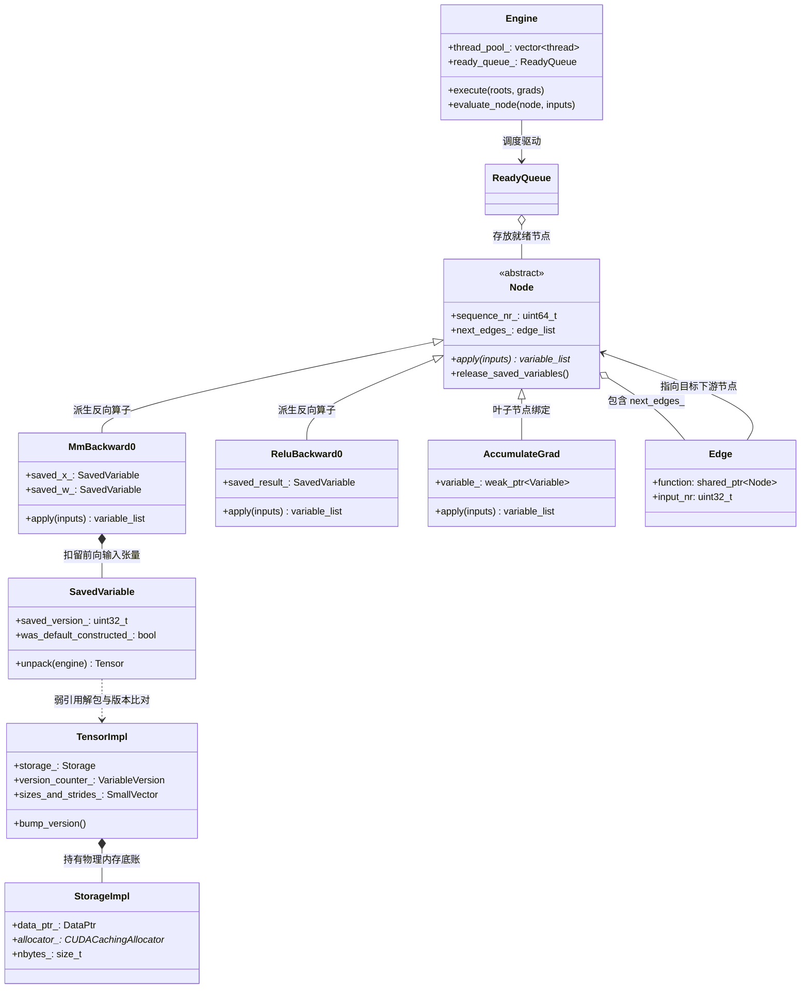
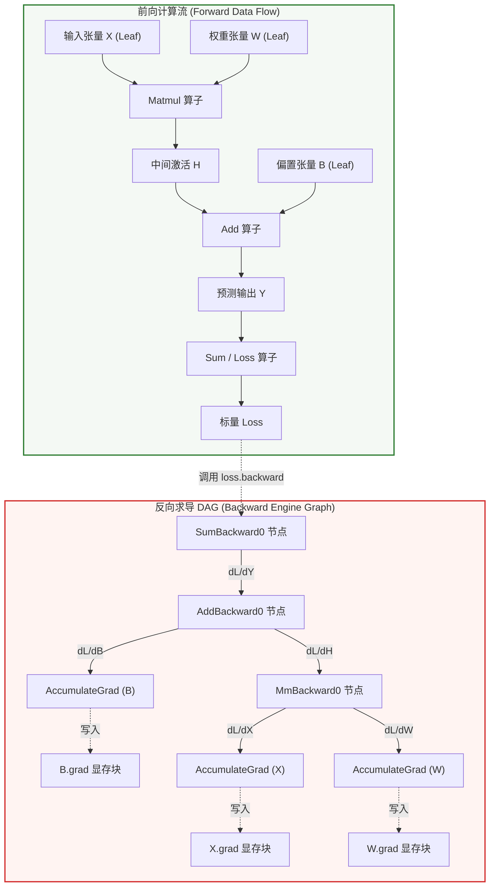
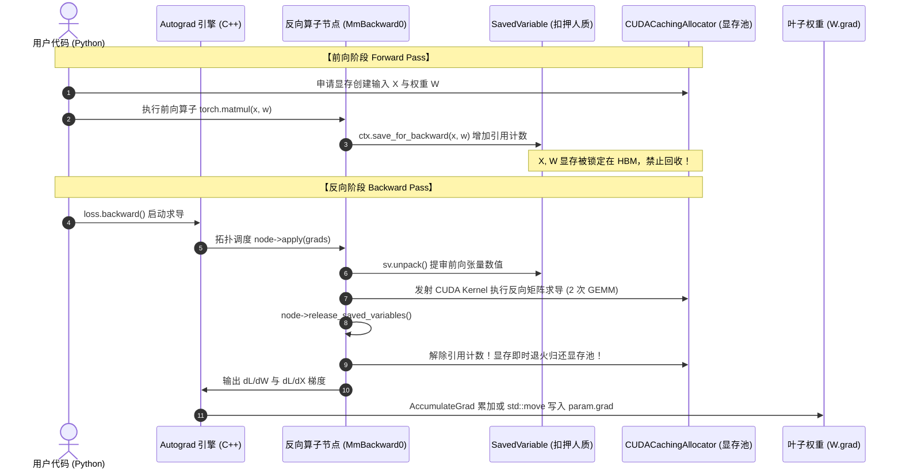
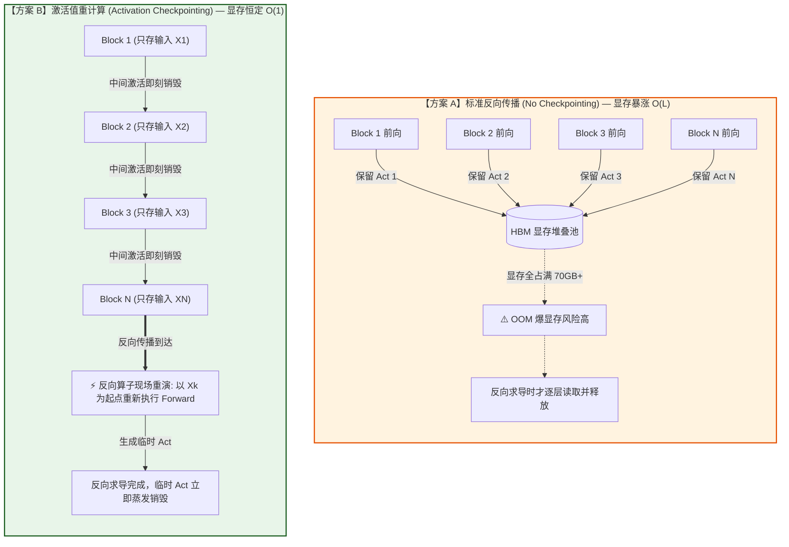
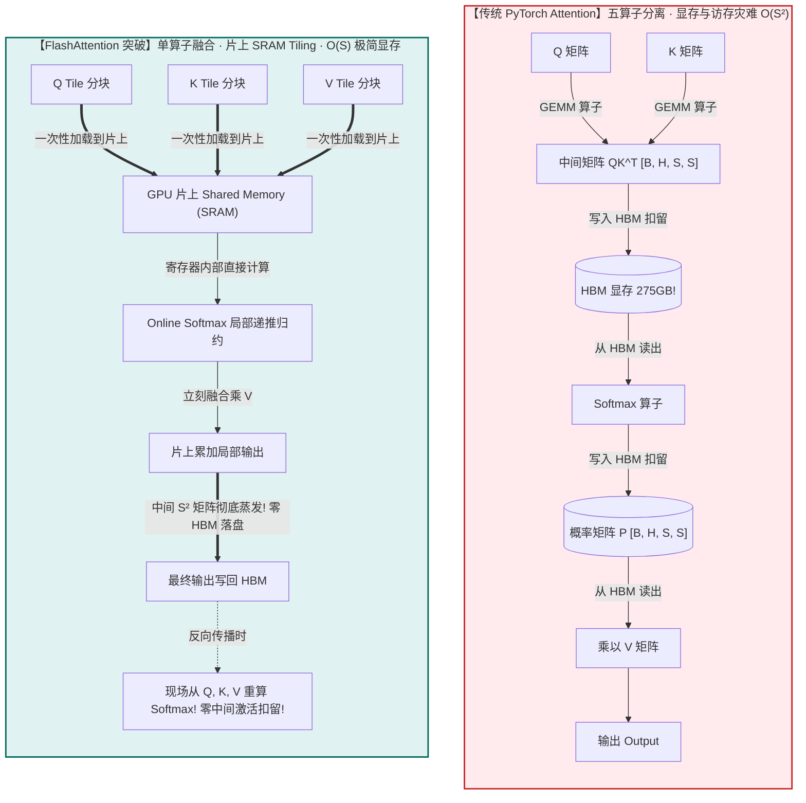

# 🏛️ 第06讲：PyTorch 计算图与 Autograd 显存生命周期——动态 DAG、反向求导机制与 Activation 显存优化

> **主讲人**：👓 **Ringi**（大厂 AI Infrastructure 工程师）  
> **所属模块**：Module 00: 性能工程与系统前置  
> **篇章范式**：🏛️ 性能工程与系统前置篇（Performance Engineering & System Baseline）  
> **核心导读**：很多做深度学习开发的同学都有过这样的痛苦经历：明明自己的模型只有 7B 参数，按照 FP16 精度手算权重只有 14GB，理论上一张 80GB 的 A100/H100 显卡能够轻轻松松塞下，然而只要把训练的 Batch Size 从 2 调到 4，或者把序列长度 Sequence Length 稍微拉长一点，终端就会瞬间无情地抛出 `torch.cuda.OutOfMemoryError`（俗称 OOM 爆显存）！  
> 显存到底被谁吃掉了？为什么前向计算时显存会一路飙升，反向传播时显存又逐步回落？PyTorch 在后台悄悄创建的“动态计算图（DAG）”究竟是什么数据结构？为什么有些张量在前向计算完后必须死死留在显存中不能被释放？为什么随手写一句 `losses.append(loss)` 就能瞬间引发吞噬上百 GB 显存的静默内存泄漏？本讲将带你彻底穿透 Python 外壳，深入 PyTorch C++ 核心库（`torch/csrc/autograd`），手拆动态图构建、反向求导流水线、张量显存生命周期与 Activation Checkpointing（激活值重计算）的底层奥秘！


```text
=================================================================================================
                                   Ringi 3D 架构工坊 · 核心全景
┌───────────────────────────────────────────────────────────────────────────────────────────────┐
│                                                                                               │
│  [前向计算流 Forward Pass: 激活值扣留阶段]                                                    │
│  Input (X) ──► [Linear / GEMM] ──► Activation (A1) ──► [LayerNorm / ReLU] ──► Output (Y)      │
│     │               │ (自动注册)                              │ (自动注册)             │      │
│     │               ▼                                         ▼                        ▼      │
│  [底层 DAG]   AccumulateGrad ◄── MmBackward0 ◄────────── ReluBackward0 ◄── MSELossBackward   │
│                      ▲                │ (ctx.save_for_backward)       │ (ctx.save_for_backward)│
│                      │                ▼                               ▼                        │
│                [权重梯度 W.grad]  [扣留 X, W 到 HBM]              [扣留 A1 或 Mask 到 HBM]     │
│                                                                                               │
│  ───────────────────────────────────────────────────────────────────────────────────────────  │
│                                                                                               │
│  [反向求导流 Backward Pass: 梯度累加与激活值退火归还阶段]                                      │
│  Loss.backward()                                                                              │
│     │                                                                                         │
│     ▼                                                                                         │
│  MSELossBackward ──► 消费并释放 Loss 临时张量 ──► 显存退火归还                                │
│     │                                                                                         │
│     ▼                                                                                         │
│  ReluBackward0   ──► 取出 A1/Mask 计算 dA1 ──► 立即释放 A1 显存 ──► 显存进一步退火            │
│     │                                                                                         │
│     ▼                                                                                         │
│  MmBackward0     ──► 取出 X, W 执行 2 次 GEMM ──► 累加 W.grad ──► 释放 X, W 临时激活值        │
│                                                                                               │
└───────────────────────────────────────────────────────────────────────────────────────────────┘
=================================================================================================
```

<!-- more -->

## 📑 目录导航

- [0. Ringi 开场：训练模型时，显存到底被谁吃了？](#0-ringi-开场训练模型时显存到底被谁吃了)
  - [0.1 一次深夜排障：7B 模型在 80GB 显卡上的离奇 OOM 惨案](#01-一次深夜排障7b-模型在-80gb-显卡上的离奇-oom-惨案)
  - [0.2 线上幽灵事故：`losses.append(loss)` 引发的百万元集群内存雪崩](#02-线上幽灵事故lossesappendloss-引发的百万元集群内存雪崩)
  - [0.3 为什么 AI Infra 工程师必须穿透 Autograd 机制与显存生命周期？](#03-为什么-ai-infra-工程师必须穿透-autograd-机制与显存生命周期)
- [1. PyTorch 动态计算图（DAG）底层构建机制](#1-pytorch-动态计算图dag底层构建机制)
  - [1.1 动态图（Define-by-Run） vs 静态图（Define-and-Run）的第一性原理哲学](#11-动态图define-by-run-vs-静态图define-and-run的第一性原理哲学)
  - [1.2 `torch.Tensor` 的求导元数据：`requires_grad`、`grad` 与 `is_leaf`](#12-torchtensor-的求导元数据requires_gradgrad-与-is_leaf)
  - [1.3 C++ 源码层解密：`torch::autograd::Node`、`Edge` 与 `Function`](#13-c-源码层解密torchautogradnodeedge-与-function)
  - [1.4 `grad_fn` 与 `next_functions`：如何从前向计算自动编织反向有向无环图？](#14-grad_fn-与-next_functions如何从前向计算自动编织反向有向无环图)
  - [1.5 叶子张量（Leaf Tensors）的特殊地位与 `grad_accumulator`](#15-叶子张量leaf-tensors的特殊地位与-grad_accumulator)
  - [1.6 Mermaid 拓扑全景图：前向计算流与反向 DAG 的镜像映射](#16-mermaid-拓扑全景图前向计算流与反向-dag-的镜像映射)
- [2. Forward 与 Backward 显存生命周期的微观世界](#2-forward-与-backward-显存生命周期的微观世界)
  - [2.1 Forward 阶段：前向算子如何通过 `ctx.save_for_backward()` 秘密扣留张量？](#21-forward-阶段前向算子如何通过-ctxsave_for_backward-秘密扣留张量)
  - [2.2 并不是所有前向张量都需要保存！常见算子的“显存扣留账本”对比](#22-并不是所有前向张量都需要保存常见算子的显存扣留账本对比)
  - [2.3 Backward 阶段：`loss.backward()` 触发后，C++ 引擎的执行流水线](#23-backward-阶段lossbackward-触发后c-引擎的执行流水线)
  - [2.4 张量就地释放（Release Saved Tensors）：显存是何时且如何归还给显存池的？](#24-张量就地释放release-saved-tensors显存是何时且如何归还给显存池的)
  - [2.5 显存随训练 Step 流转的“心电图”分析：Peak Memory 究竟诞生在哪个微秒？](#25-显存随训练-step-流转的心电图分析peak-memory-究竟诞生在哪个微秒)
  - [2.6 `optimizer.zero_grad(set_to_none=True)` 的底层真相：清零 vs 置空的性能差距](#26-optimizerzero_gradset_to_nonetrue-的底层真相清零-vs-置空的性能差距)
- [3. 原地操作（In-place Operation）与版本计数器机制](#3-原地操作in-place-operation与版本计数器机制)
  - [3.1 为什么会报 `RuntimeError: modified by an inplace operation`？](#31-为什么会报-runtimeerror-modified-by-an-inplace-operation)
  - [3.2 `c10::TensorImpl::version_counter_` 的自增与安全校验逻辑](#32-c10tensorimplversion_counter_-的自增与安全校验逻辑)
  - [3.3 什么时候 In-place 安全？什么时候是灾难？](#33-什么时候-in-place-安全什么时候是灾难)
- [4. 推理加速与梯度关闭：`no_grad()` vs `inference_mode()` 终极剖析](#4-推理加速与梯度关闭no_grad-vs-inference_mode-终极剖析)
  - [4.1 `with torch.no_grad()`：Thread-Local TLS 开关关闭了什么？](#41-with-torchno_gradthread-local-tls-开关关闭了什么)
  - [4.2 `with torch.inference_mode()`：为什么比 `no_grad()` 还要快？版本计数器与 View 追踪的彻底冻结](#42-with-torchinference_mode为什么比-no_grad-还要快版本计数器与-view-追踪的彻底冻结)
  - [4.3 显存占用与执行开销对比测试基准](#43-显存占用与执行开销对比测试基准)
- [5. 显存救星：激活值重计算（Activation Checkpointing）](#5-显存救星激活值重计算activation-checkpointing)
  - [5.1 鱼与熊掌的抉择：空间复杂度 $O(L)$ 到 $O(1)$ 的惊人飞跃](#51-鱼与熊掌的抉择空间复杂度-ol-到-o1-的惊人飞跃)
  - [5.2 数学推导：为什么重计算只增加 33.3% 的计算量？（$6P \to 8P$ 理论推导）](#52-数学推导为什么重计算只增加-333-的计算量6p-to-8p-理论推导)
  - [5.3 全量重计算（Full Checkpointing） vs 亚线性重计算（$\sqrt{L}$ Checkpointing）](#53-全量重计算full-checkpointing-vs-亚线性重计算sqrtl-checkpointing)
  - [5.4 工业级前沿：选择性激活值重算（Selective Activation Checkpointing）](#54-工业级前沿选择性激活值重算selective-activation-checkpointing)
  - [5.5 为什么在大模型训练中，重计算反而能提高训练吞吐（Throughput）？](#55-为什么在大模型训练中重计算反而能提高训练吞吐throughput)
- [6. Transformer 架构下的 Autograd 显存全景追踪](#6-transformer-架构下的-autograd-显存全景追踪)
  - [6.1 LLaMA / Transformer Block 前向与反向张量生命周期追踪表](#61-llama--transformer-block-前向与反向张量生命周期追踪表)
  - [6.2 Attention 矩阵 $S = QK^T / \sqrt{d}$ 的 $O(S^2)$ 显存海啸与 Autograd 保存行为](#62-attention-矩阵-s--qkt--sqrtd-的-os2-显存海啸与-autograd-保存行为)
  - [6.3 FlashAttention 如何通过计算重构彻底瓦解 Autograd 的 Activation 扣留？](#63-flashattention-如何通过计算重构彻底瓦解-autograd-的-activation-扣留)
- [7. 动手实战与代码实验室（Hands-on Benchmark & Inspection）](#7-动手实战与代码实验室hands-on-benchmark--inspection)
  - [7.1 实验 1：动态 DAG 递归遍历器——纯 Python 手写遍历打印计算图](#71-实验-1动态-dag-递归遍历器纯-python-手写遍历打印计算图)
  - [7.2 实验 2：显存实时心电图追踪器——Step 级细粒度显存剖析](#72-实验-2显存实时心电图追踪器step-级细粒度显存剖析)
  - [7.3 实验 3：In-place 版本冲突现场重现与源码级解决方案](#73-实验-3in-place-版本冲突现场重现与源码级解决方案)
  - [7.4 实验 4：PyTorch Hook 探针实战——监控各层 Activation 与 Gradient 显存](#74-实验-4pytorch-hook-探针实战监控各层-activation-与-gradient-显存)
  - [7.5 实验 5：Activation Checkpointing 压测——显存削减与耗时对比实验](#75-实验-5activation-checkpointing-压测显存削减与耗时对比实验)
  - [7.6 实验 6：生产级内存泄漏复现与排查脚本](#76-实验-6生产级内存泄漏复现与排查脚本)
- [8. Ringi 避坑指南与大厂硬核经典面试题](#8-ringi-避坑指南与大厂硬核经典面试题)
  - [8.1 避坑表格（❌ 常见小白错误理解 vs ✅ 大厂 AI Infra 正确理解）](#81-避坑表格-常见小白错误理解-vs--大厂-ai-infra-正确理解)
  - [8.2 4 道大厂硬核高频面试与白板推导题（附详细推导过程、解题思考路径与标准答案）](#82-4-道大厂硬核高频面试与白板推导题附详细推导过程解题思考路径与标准答案)
- [9. Ringi 5 点核心速记口诀、自我检验清单与课后深度思考题](#9-ringi-5-点核心速记口诀自我检验清单与课后深度思考题)
  - [9.1 5 点押韵核心速记口诀](#91-5-点押韵核心速记口诀)
  - [9.2 6 条白板自我检验清单](#92-6-条白板自我检验清单)
  - [9.3 3 道高阶开放式课后思考题（含极限 Corner Case）](#93-3-道高阶开放式课后思考题含极限-corner-case)
- [10. 📚 参考资料与 PyTorch Autograd 核心源码指引](#10--参考资料与-pytorch-autograd-核心源码指引)

---

# 0. Ringi 开场：训练模型时，显存到底被谁吃了？

## 0.1 一次深夜排障：7B 模型在 80GB 显卡上的离奇 OOM 惨案

刚进入大厂参与 LLM 分布式预训练基础设施建设时，我接到的第一个紧急 P0 级线上工单，就是一个令人匪夷所思的显存溢出事故：

算法团队正在单台 8 卡 NVIDIA A100-SXM4-80GB 服务器上微调一个 70 亿参数（7B）的开源大模型。算法同学在训练脚本启动前，在白板上算了这样一笔账：

- **模型参数（Weights）**：7B 参数采用 BF16（每个参数 2 字节），显存占用为 $7 \times 10^9 \times 2 \approx 14\text{ GB}$；
- **梯度（Gradients）**：与参数一一对应，同样为 BF16，显存占用也是 $14\text{ GB}$；
- **优化器状态（Optimizer States）**：使用标准 AdamW，需要维护 1 份 FP32 的权重副本（$4\text{ B}$）、1 份一阶动量 Momentum（$4\text{ B}$）和 1 份二阶动量 Variance（$4\text{ B}$），每个参数需要 $12\text{ 字节}$，总共 $7 \times 10^9 \times 12 \approx 84\text{ GB}$。在开了 ZeRO-1/ZeRO-2 优化器状态切分后，分摊到 8 张卡上，单卡优化器显存仅为 $84 / 8 = 10.5\text{ GB}$；
- **单卡显存总预算**：静态显存（模型 + 梯度 + 优化器）共计 $14 + 14 + 10.5 = 38.5\text{ GB}$。

面对一张拥有 **80GB** 物理显存的 A100，还剩下了足足 **41.5GB** 的可用空间！

然而，当算法同学把批大小 `batch_size` 设为 4，序列长度 `seq_len` 设为 4096，刚刚敲下回车运行到第 1 个 Step 的前向计算尾声时，屏幕上赫然出现了一片刺眼的红色堆栈：

```text
torch.cuda.OutOfMemoryError: CUDA out of memory.
Tried to allocate 2.00 GiB (GPU 0; 79.15 GiB total capacity;
77.34 GiB already allocated; 1.21 GiB free;
77.50 GiB reserved in total by PyTorch)
```

算法同学直接抓狂了：“为什么？！我的模型明明才用了不到 40GB，剩下的 40 多 GB 显存被什么外星人偷走了？！”

作为 AI Infra 工程师，我在检查了 Profiler 数据后当场指出了真凶：**Activation（前向激活值）！**  
在没有任何重计算（Activation Checkpointing）保护的情况下，多层 Transformer Block 在长上下文、多 Batch 下产生的中间激活张量，在反向传播结束之前，被 PyTorch 的 **Autograd 引擎全部死死锁在 HBM（高带宽显存）中**！这批 Activation 占用的空间，在短短几十毫秒内就膨胀到了 50GB 以上，直接将 80GB 显存彻底撑爆！

---

## 0.2 线上幽灵事故：`losses.append(loss)` 引发的百万元集群内存雪崩

如果说 Activation 显存暴涨属于“明面上的物理开销”，那么另一个事故则完全是由于对 PyTorch 动态图底层机制不了解而引发的“静默幽灵”。

那是一个耗资数百万元的预训练任务。某个初入团队的工程师为了在训练过程中打日志、画 Loss 曲线，在训练的主循环里写下了这样一段代码：

```python
# ❌ 一个价值数十万元的显存泄漏 Bug
loss_history = []

for step, (inputs, targets) in enumerate(train_dataloader):
    optimizer.zero_grad()
    outputs = model(inputs)
    loss = criterion(outputs, targets)
    loss.backward()
    optimizer.step()

    # 看起来极其无辜的一行打点记录：
    loss_history.append(loss)  # <--- 致命死穴！
```

模型在运行前几个 Step 时一切平稳，监控曲线看似完美。然而跑到了第 500 个 Step 时，单卡显存以极为平缓但坚定的速度从 45GB 慢慢爬升到了 79GB，最终在凌晨三点整个千卡集群大面积 OOM 崩溃！

为什么 `loss_history.append(loss)` 会导致显存泄漏？  
因为在 PyTorch 中，`loss` **根本不是一个普通的标量数值浮点数（float）**！它是一个包含了整张反向计算图根节点的 `torch.Tensor`！只要你把 `loss` 放进了一个长寿的 Python 列表里，`loss.grad_fn` 就会死死持有上一层算子节点，上一层算子节点又通过 `next_functions` 递归持有整个网络所有的 `Node`，而每个 `Node` 里又通过 `SavedVariable` 引用着前向传播所扣留的所有高维 Activation 张量！

也就是说，**这行代码让 PyTorch 永远无法销毁过去 500 个 Iteration 中产生的任何一张计算图与任何一个中间激活张量！** 显存池被几千张巨大的计算图塞得密不透风，直到系统轰然倒塌。

正确的写法仅仅需要多加一个调用：`loss_history.append(loss.item())` 或者 `loss.detach()`！

---

## 0.3 为什么 AI Infra 工程师必须穿透 Autograd 机制与显存生命周期？

很多应用层算法工程师习惯了把 PyTorch 当成一个纯黑盒：“我只管定义网络结构，前向写个 `forward()`，反向只要写一行 `loss.backward()`，至于导数怎么算、内存怎么分，PyTorch 会帮我搞定。”

但在现代 AI Infrastructure 领域，这种黑盒思维是致命的。对于大模型基础设施架构师、性能调优专家与分布式系统开发者而言，**计算图与显存生命周期是一切核心技术的底座**：

1. **分布式显存优化技术的基石（ZeRO、FSDP、Megatron）**：不论是 DeepSpeed ZeRO 还是 PyTorch FSDP，其核心本质都是在 Autograd 计算图前向和反向遍历的特定时间窗口内，动态地拉取权重（AllGather）并在算子计算完成后立即将多余权重或梯度就地释放（ReduceScatter）。如果不理解 Autograd 的节点调用时机，根本无法理解分布式通信与计算重叠（Overlap）的精髓；
2. **长文本训练（Long Context）的救命稻草**：当上下文长度拓展到 32K、128K 甚至 1M 时，$O(S^2)$ 乃至 $O(S)$ 的 Activation 显存直接主导了整体硬件需求。**Activation Checkpointing（梯度检查点/重计算）** 是唯一能让长文本跑起来的手段，而重计算的本质就是对 Autograd 动态图进行外科手术式的剪枝与重播；
3. **编写自定义算子（Custom CUDA/Triton Kernel）的必备素养**：当你写了一个前向 Kernel，必须通过继承 `torch.autograd.Function` 并实现 `forward()` 与 `backward()` 把它挂载到计算图上。哪些中间输入必须调用 `ctx.save_for_backward()` 保留？哪些可以丢弃？如果保存了不该保存的大张量，你的 Kernel 就算算得比谁都快，也会因为爆显存而被系统抛弃；
4. **编译与图优化（PyTorch 2.0 TorchDynamo / AOTAutograd）**：PyTorch 2.0 引入的 `torch.compile`，其核心子模块 **AOTAutograd** 的任务就是在模型执行前，提前捕获前向和反向图，将它们编译融合成更高效的 Triton Kernel。不懂 Autograd 动态图，你将彻底丧失理解现代深度学习编译器的能力。

今天，我们就用 Ringi 的极客显微镜，手把手拆解 Autograd 的每一个齿轮！

---

# 1. PyTorch 动态计算图（DAG）底层构建机制

## 1.1 动态图（Define-by-Run） vs 静态图（Define-and-Run）的第一性原理哲学

在深入源码之前，我们必须先从系统设计哲学的高度回答一个根本问题：**为什么是动态图？**

在深度学习框架的发展史上，存在着两条截然不同的技术路线：

| 维度             | 静态计算图（Define-and-Run，如 TensorFlow 1.x、Caffe）              | 动态计算图（Define-by-Run，如 PyTorch）                             |
| :--------------- | :------------------------------------------------------------------ | :------------------------------------------------------------------ |
| **设计哲学**     | 先声明定义图结构，后送入数据执行（图与数据完全解耦）                | 代码即执行，边执行前向计算边动态构建图（图随数据流动产生）          |
| **执行载体**     | 必须通过专门的 `Session.run()` 驱动虚拟机运行图                     | 原生 Python 控制流直接驱动，每一步都是真实的 C++ / CUDA 算子调用    |
| **控制流**       | 难以支持动态条件分支与变长循环（需使用 `tf.cond`, `tf.while_loop`） | 原生支持 Python 的 `if`、`for`、`while`，调试如丝般顺滑             |
| **调试体验**     | 极度痛苦（报错堆栈全在框架底层 Runtime 调度器中，无法打断点）       | 极度友好（可以在任意一行插入 `pdb.set_trace()`，随时 print 张量值） |
| **显存优化空间** | 理论上限极高（因为执行前全图已知，可以进行全局内存复用规划）        | 运行时开销稍大（每轮迭代重新构图，需要依赖动态内存池缓冲）          |

```text
+---------------------------------------------------------------------------------------+
|  动态图的核心物理直觉：                                                               |
|  在前向传播执行 Python 代码的瞬间，PyTorch 实际上在做两件事：                        |
|  1. [正向业务]: 调用底层的 ATen / cuBLAS / cuDNN Kernel，把输出数值实打实地算出来；  |
|  2. [幕后织网]: 顺藤摸瓜，在 C++ 堆内存中记录下每一个算子的逆向操作节点，            |
|                并将它们用指针串联成一张反向有向无环图（Backward DAG）！               |
+---------------------------------------------------------------------------------------+
```

---

## 1.2 `torch.Tensor` 的求导元数据：`requires_grad`、`grad` 与 `is_leaf`

在 Python 层面，一个普通的 `torch.Tensor` 怎么知道自己要不要参与反向传播？它的体内藏着哪些关键的元数据标记？

让我们在 Python 中打印一个 Tensor 的核心属性：

```python
import torch

x = torch.tensor([2.0, 3.0], requires_grad=True)
w = torch.tensor([1.5, 2.5], requires_grad=True)
b = torch.tensor([0.5, 0.5], requires_grad=True)

y = x * w + b
loss = y.sum()

print(f"x.is_leaf: {x.is_leaf}, x.requires_grad: {x.requires_grad}, x.grad_fn: {x.grad_fn}")
print(f"y.is_leaf: {y.is_leaf}, y.requires_grad: {y.requires_grad}, y.grad_fn: {y.grad_fn}")
print(f"loss.grad_fn: {loss.grad_fn}")
```

输出结果：

```text
x.is_leaf: True, x.requires_grad: True, x.grad_fn: None
y.is_leaf: False, y.requires_grad: True, y.grad_fn: <AddBackward0 object at 0x7f88a0>
loss.grad_fn: <SumBackward0 object at 0x7f88b2>
```

请仔细观察这三个至关重要的属性：

### 1. `requires_grad`（布尔标记）

- 一旦一个 Tensor 的 `requires_grad=True`，所有由它衍生计算出来的后续张量，其 `requires_grad` **自动且不可逆地被传染为 True**；
- 只要一个运算的输入参数中存在至少一个 `requires_grad=True` 的 Tensor，PyTorch 的调度器（Dispatcher）就会路由到带有 Autograd 追踪的算子实现包装器，记录求导历史。

### 2. `is_leaf`（叶子节点判定）

- **什么是叶子节点（Leaf Tensor）**？由用户显式创建的、不是由任何算子计算出来的张量（例如神经网络中通过 `nn.Parameter` 初始化的权重 $W$ 和偏置 $b$，或者手动创建的输入 $X$）；
- 为什么必须区分叶子节点？**为了节约极其宝贵的内存和计算资源！** 在深度学习训练中，我们的终极目标是更新权重参数 $W$。因此，默认情况下，**PyTorch 的 Autograd 引擎只会在反向传播结束后为叶子节点保留梯度（存储在 `param.grad` 中）**！所有中间非叶子节点（如上述的 $y$）计算出的一阶导数 $\frac{\partial L}{\partial y}$，在反向传播流水线将其传递给前序节点后，**会被立刻就地销毁**，绝对不会存留到 Python 端（除非你显式调用 `y.retain_grad()`）。

### 3. `grad_fn`（反向求导节点指针）

- 对于叶子节点，$x$ 是起点，它不是被算出来的，所以它的 `x.grad_fn = None`；
- 对于非叶子节点，$y$ 是通过加法出来的，所以它的 `y.grad_fn` 指向了一个名为 `<AddBackward0>` 的 C++ 堆对象；$loss$ 是通过求和出来的，所以它的 `loss.grad_fn` 指向了 `<SumBackward0>`。

---

## 1.3 C++ 源码层解密：`torch::autograd::Node`、`Edge` 与 `Function`

现在，让我们脱掉 Python 的外壳，进入 PyTorch 的 C++ 源码世界（路径位于 `torch/csrc/autograd/`）。

在 C++ 底层，动态计算图的节点被抽象为一个核心基类：**`torch::autograd::Node`**（在老版本 PyTorch 中曾被称为 `Function`）。

```cpp
// 摘自 PyTorch 核心源码 torch/csrc/autograd/function.h (简化版)
struct TORCH_API Node : std::enable_shared_from_this<Node> {
 public:
  // 执行反向求导计算的核心虚函数
  virtual variable_list apply(variable_list&& inputs) = 0;

  // 获取指向前序节点的有向边（边连接着更早生成的 Node）
  const edge_list& next_edges() const {
    return next_edges_;
  }

  // 拓扑排序与执行序列号
  uint64_t sequence_nr() const {
    return sequence_nr_;
  }

 private:
  // 记录在反向计算时，梯度应当流向哪些下游节点以及对应的输入插槽（Input Slot）
  edge_list next_edges_;

  // 线程安全的执行序列号，用于拓扑排序与优先级队列调度
  uint64_t sequence_nr_;
};
```

与 `Node` 紧密协作的另一个轻量级结构体是 **`Edge`**：

```cpp
// 摘自 torch/csrc/autograd/edge.h
struct Edge {
  // 指向目标 Node 的智能指针
  std::shared_ptr<Node> function;

  // 目标 Node 的第几个输入参数插槽（Slot Index）
  uint32_t input_nr;
};
```

这里的设计极其优雅：

- 一个复杂的算子可能有多个输入（例如矩阵乘法 $Y = XW$ 有两个输入 $X$ 和 $W$）；
- 反向传播计算出 $\nabla Y$ 后，需要将导数分别回传给生成 $X$ 的节点和生成 $W$ 的节点；
- `next_edges_` 数组精准记录了：**梯度应当送入哪个 `Node`（`function`）的哪一个输入参数槽位（`input_nr`）**！




---

## 1.4 `grad_fn` 与 `next_functions`：如何从前向计算自动编织反向有向无环图？

当我们在 Python 中执行 `loss.grad_fn.next_functions` 时，我们实际上就是在直接访问底层 C++ 的 `next_edges_` 列表！

让我们写一段代码手拆这个连接关系：

```python
import torch

x = torch.randn(2, 3, requires_grad=True)
w = torch.randn(3, 4, requires_grad=True)
b = torch.randn(4, requires_grad=True)

# 前向计算
h = torch.matmul(x, w)       # 生成 MmBackward0 节点
y = h + b                    # 生成 AddBackward0 节点
loss = y.sum()               # 生成 SumBackward0 节点

print("=== 查看反向 DAG 节点链 ===")
print("1. loss.grad_fn:", loss.grad_fn)
print("2. loss.grad_fn.next_functions:", loss.grad_fn.next_functions)

add_node = loss.grad_fn.next_functions[0][0]
print("3. add_node.next_functions:", add_node.next_functions)

mm_node = add_node.next_functions[0][0]
print("4. mm_node.next_functions:", mm_node.next_functions)
```

输出细节：

```text
=== 查看反向 DAG 节点链 ===
1. loss.grad_fn: <SumBackward0 object at 0x7f8810>
2. loss.grad_fn.next_functions: ((<AddBackward0 object at 0x7f8818>, 0),)
3. add_node.next_functions: ((<MmBackward0 object at 0x7f8820>, 0), (<AccumulateGrad object at 0x7f8828>, 0))
4. mm_node.next_functions: ((<AccumulateGrad object at 0x7f8830>, 0), (<AccumulateGrad object at 0x7f8838>, 0))
```

请紧盯第 3 行和第 4 行的输出！

- `AddBackward0` 的 `next_functions` 包含两个元素：
  - 第 0 个是 `<MmBackward0>`：对应中间结果 $h$ 的反向求导；
  - 第 1 个是 `<AccumulateGrad>`：对应叶子张量 $b$ 的梯度累加器！
- `MmBackward0` 的 `next_functions` 也包含两个元素：
  - 分别是两个 `<AccumulateGrad>` 节点，分别对应叶子张量 $x$ 和权重 $w$！

一张由节点和边严格交织的有向无环图（DAG），就这样在前向代码跑完的刹那，在内存中静悄悄地构筑完毕！

---

## 1.5 叶子张量（Leaf Tensors）的特殊地位与 `grad_accumulator`

在上面的输出中，出现了一个特殊的节点类型：**`<AccumulateGrad>`**。

在很多浅层教程中，大家都以为反向传播到达叶子节点后就直接结束了。但从计算机系统视角来看，**梯度到底是怎么写入 `param.grad` 的？**

每一个需要求导的叶子节点 Tensor，在第一次被算子使用时，PyTorch 的 Autograd 引擎都会在底层为它绑定一个专属的 **`AccumulateGrad`** 节点（继承自 `Node`）。
它的 `apply()` 函数核心伪代码极其简单粗暴：

```cpp
// 伪代码：torch/csrc/autograd/functions/accumulate_grad.cpp
variable_list AccumulateGrad::apply(variable_list&& grads) {
  auto& grad = grads[0];
  auto variable = variable_.lock(); // 获取绑定的叶子 Tensor 弱引用

  if (!variable->grad().defined()) {
    // 如果这是反向传播第一次给该叶子节点算出的梯度：
    // 直接把这块显存赋给 param.grad！
    variable->mutable_grad() = grad;
  } else {
    // 如果该叶子节点被多处使用（例如同一个权重在多处共享）：
    // 执行就地累加：param.grad += grad！
    variable->mutable_grad().add_(grad);
  }
  return variable_list(); // 叶子节点没有下游，返回空列表
}
```

这个微小的机制解释了深度学习中一个最核心的常识：**为什么每个 Step 训练开始前必须调用 `optimizer.zero_grad()`？**  
因为如果上一轮的 `param.grad` 没有被清空或置空，`AccumulateGrad` 就会在旧梯度的基础上无休止地 `add_()` 累加上去，导致权重更新方向完全错乱！

---

## 1.6 Mermaid 拓扑全景图：前向计算流与反向 DAG 的镜像映射

为了让读者形成坚如磐石的物理直觉，我们用 Mermaid 将前向数据流与反向计算图做一次并排镜像映射：



---

# 2. Forward 与 Backward 显存生命周期的微观世界

理解了计算图的骨架，现在我们把目光聚焦到本讲的核心焦点：**物理显存究竟是在哪一个纳秒被分配的？又是在哪一个纳秒被释放的？**

## 2.1 Forward 阶段：前向算子如何通过 `ctx.save_for_backward()` 秘密扣留张量？

在深度学习的数学推导中，微积分的链式法则是纯粹的符号求导：

$$
\frac{\partial L}{\partial x} = \frac{\partial L}{\partial y} \cdot \frac{\partial y}{\partial x}
$$

然而在计算机系统执行数值计算时，**求导公式往往需要用到前向传播的输入或输出的具体数值！**

举个最经典的例子：全连接层（矩阵乘法） $Y = X \cdot W$。  
根据多元微积分矩阵求导法则，当反向传播从下游传入损失对输出的梯度 $\nabla_Y L = G$ 时，损失对输入 $X$ 和权重 $W$ 的梯度分别为：

$$
\frac{\partial L}{\partial X} = G \cdot W^T
$$

$$
\frac{\partial L}{\partial W} = X^T \cdot G
$$

请停下来想一想这背后的物理意义：

- 为了计算 $\frac{\partial L}{\partial X}$，反向算子必须使用 **前向时的权重 $W$**；
- 为了计算 $\frac{\partial L}{\partial W}$，反向算子必须使用 **前向时的输入激活值 $X$**！

这意味着什么？意味着在执行前向矩阵乘法时，算子必须把 $X$ 这个张量**完整地保存在 GPU 显存中**，一直保留到反向传播执行 `MmBackward0` 的那一瞬间！

在 PyTorch 自定义算子中，这个动作是通过上下文对象 `ctx.save_for_backward(tensors...)` 完成的：

```python
class MyLinearFunction(torch.autograd.Function):
    @staticmethod
    def forward(ctx, x, w):
        # 1. 执行前向计算：产出结果
        y = torch.matmul(x, w)

        # 2. 扣押人质！把 x 和 w 存入上下文对象中，防止被显存池垃圾回收！
        ctx.save_for_backward(x, w)
        return y

    @staticmethod
    def backward(ctx, grad_output):
        # 3. 反向传播时，重新提审人质：
        x, w = ctx.saved_tensors

        # 4. 计算梯度
        grad_x = torch.matmul(grad_output, w.t())
        grad_w = torch.matmul(x.t(), grad_output)

        # 5. 函数执行完毕，x 和 w 在此处的生命周期终结！
        return grad_x, grad_w
```

在 C++ 底层，`ctx.save_for_backward()` 会构造一个 `torch::autograd::SavedVariable` 对象。这个对象持有了底层张量物理存储 `StorageImpl` 的引用计数。  
**只要反向计算图还在，这些张量的引用计数就永远无法清零，CUDA 显存分配器就绝对不敢回收这片显存！**

---

## 2.2 并不是所有前向张量都需要保存！常见算子的“显存扣留账本”对比

很多初学者容易产生一个严重误区：“前向传播的所有中间结果，统统都会被保存下来。”  
**完全错误！** 现代深度学习框架极其抠门，算子在实现时遵循严格的**最小显存扣留原则**：只存数学上不可或缺的张量！

让我们来逐个审视深度学习中最常见算子的反向求导数学公式与显存扣留账本：

| 常用算子（Operator）                  | 前向计算公式                                                       | 反向梯度计算公式（已知 $\nabla_Y L$）                                                | 反向计算必须依赖的张量（Saved Tensors）                       | 显存扣留成本分析                                                |
| :------------------------------------ | :----------------------------------------------------------------- | :----------------------------------------------------------------------------------- | :------------------------------------------------------------ | :-------------------------------------------------------------- |
| **加法 Add ($Y = X_1 + X_2$)**        | $Y = X_1 + X_2$                                                    | $\nabla_{X_1} = \nabla_Y, \quad \nabla_{X_2} = \nabla_Y$                             | **完全不需要保存任何张量！** ($\emptyset$)                    | **0 字节！** 显存极度友好！                                     |
| **乘法 Mul ($Y = X_1 \odot X_2$)**    | $Y = X_1 \odot X_2$                                                | $\nabla_{X_1} = \nabla_Y \odot X_2, \quad \nabla_{X_2} = \nabla_Y \odot X_1$         | 必须保存输入 $X_1$ 和 $X_2$                                   | 需暂存两份完整的输入显存                                        |
| **全连接 GEMM ($Y = XW$)**            | $Y = XW$                                                           | $\nabla_X = \nabla_Y W^T, \quad \nabla_W = X^T \nabla_Y$                             | 必须保存前向输入 $X$ 与权重 $W$                               | 扣留 $X$（随 Batch/Seq 动态膨胀）                               |
| **ReLU 激活 ($Y = \max(0, X)$)**      | $y_i = \begin{cases} x_i, & x_i > 0 \\ 0, & x_i \le 0 \end{cases}$ | $\nabla_{x_i} = \begin{cases} \nabla_{y_i}, & x_i > 0 \\ 0, & x_i \le 0 \end{cases}$ | 只需保存输出 $Y$（或布尔掩码 Mask $X > 0$）                   | 极致优化时可用 1-bit 掩码存储替代 16-bit 浮点数                 |
| **GELU / SiLU 激活**                  | $Y = X \cdot \Phi(X)$                                              | 复杂的非线性导数公式                                                                 | 必须保存输入 $X$                                              | 扣留完整的输入 $X$                                              |
| **Softmax ($Y = \text{softmax}(X)$)** | $y_i = \frac{e^{x_i}}{\sum e^{x_j}}$                               | $\nabla_{x_i} = y_i \left( \nabla_{y_i} - \sum_j \nabla_{y_j} y_j \right)$           | **只需保存输出 $Y$！** 不需要保存输入 $X$！                   | 巧妙利用已算好的输出，节约输入存储                              |
| **LayerNorm / RMSNorm**               | $Y = \frac{X - \mu}{\sqrt{\sigma^2 + \epsilon}} \gamma + \beta$    | 需均值 $\mu$、方差 $\sigma^2$ 以及归一化后的 $\hat{X}$                               | 必须保存输入 $X$、方差 $\sigma^2$、均值 $\mu$ 与权重 $\gamma$ | 中间统计量占用较小，但需保存前向输入                            |
| **Dropout ($Y = X \odot M$)**         | $Y = \frac{X \odot \text{Mask}}{1 - p}$                            | $\nabla_X = \frac{\nabla_Y \odot \text{Mask}}{1 - p}$                                | **只需保存随机掩码 Mask（1-bit）**                            | 不存输入，甚至工业级算子通过保存随机种子（Seed）现场重算 Mask！ |

> 💡 **Ringi 极客思考**：  
> 请大家特别注意 **Dropout** 和 **FlashAttention** 的设计思想！  
> 在工业级 CUDA Kernel 中，为了连 1-bit 的 Mask 显存都不想占用，工程师甚至不会通过 `ctx.save_for_backward()` 保存布尔掩码，而是**仅仅在前向时记录一个 64 位的随机数生成器偏移量（Philox RNG Seed & Offset）**！反向传播时，直接用这个 Seed 重新生成一模一样的伪随机数掩码！用微不足道的几条 ALU 计算指令，彻底换掉了数百兆字节的高带宽显存访存！这是最极致的显存换计算！

---

## 2.3 Backward 阶段：`loss.backward()` 触发后，C++ 引擎的执行流水线

当你在 Python 端轻描淡写地敲下 `loss.backward()` 时，底层实际上发生了一场惊心动魄的系统级协同战役：

```text
+---------------------------------------------------------------------------------------+
|                       PyTorch Autograd Engine 执行六步流水线                          |
|                                                                                       |
|  [Step 1: 入口检查]                                                                   |
|  验证 loss 是否为标量（若为张量需传入 gradient 权重）；检查是否有 requires_grad=True。 |
|                                                                                       |
|  [Step 2: 拓扑排序 (Topological Sort)]                                                |
|  从 loss.grad_fn 开始，通过深度优先搜索（DFS）遍历整张有向无环图，计算每个 Node 的入度 |
|  （In-degree dependencies），构建就绪队列（Ready Queue）。                             |
|                                                                                       |
|  [Step 3: 线程池启动与并发执行]                                                       |
|  Autograd 引擎拥有独立的 C++ 工作线程池（默认线程数等于 CPU 核心数）。                |
|  将入度为 0 的节点（即 loss.grad_fn）压入执行队列。                                   |
|                                                                                       |
|  [Step 4: 节点 Apply 与 Kernel 派发]                                                  |
|  工作线程从队列中弹出 Node，调用 node->apply(grads)：                                 |
|  - 4.1 从 SavedVariable 中解包（Unpack）前向暂存的张量；                             |
|  - 4.2 派发反向计算的 CUDA Kernel 到对应的 CUDA Stream 中异步执行；                  |
|  - 4.3 产出对输入端各 Slot 的输出梯度。                                              |
|                                                                                       |
|  [Step 5: 现场销毁 Saved Tensors (显存释放的关键时刻！)]                               |
|  node 执行完毕后，调用 node->release_saved_variables()！解绑对前向张量的强引用！      |
|  StorageImpl 引用计数归零，内存块立即返还给 CUDACachingAllocator 显存池！             |
|                                                                                       |
|  [Step 6: 依赖递减与下游推进]                                                         |
|  将当前节点产生的梯度累加到对应下级 Node 的输入缓存槽中；                            |
|  将对应下级 Node 的依赖计数减 1；若依赖计数清零，则将其推入 Ready Queue 继续执行；    |
|  直至所有节点处理完毕，遇到 AccumulateGrad 则直接把最终梯度累加写入 param.grad！       |
+---------------------------------------------------------------------------------------+
```

---

## 2.4 张量就地释放（Release Saved Tensors）：显存是何时且如何归还给显存池的？

这里隐藏着一个价值连城的系统细节：**前向保存的 Activation 张量，究竟是在什么时候被释放的？**

答案是：**一旦消费它的反向算子 `apply()` 执行完毕，立即就地释放（On-the-fly Release）！**

在 PyTorch 的源码 `torch/csrc/autograd/engine.cpp` 中，引擎在调用完一个节点的 `apply()` 后，会立刻调用该节点的清理钩子：

```cpp
// 核心逻辑等价伪代码：torch/csrc/autograd/engine.cpp
void evaluate_node(Node* node, variable_list&& inputs) {
  // 1. 调用反向求导计算
  variable_list outputs = node->apply(std::move(inputs));

  // 2. 极其关键的一行代码：立刻清理本节点保存的所有前向变量！
  node->release_saved_variables();

  // 3. 将产出的 outputs 梯度向前序节点传递
  for (size_t i = 0; i < outputs.size(); ++i) {
    auto& edge = node->next_edge(i);
    // ... 传递梯度并递减依赖计数 ...
  }
}
```

请仔细品味这个机制的伟大之处！  
在反向传播过程中，计算是**从网络输出层逆流而上，一路算回到网络输入层**的：

- 当反向传播运行到第 32 层 Transformer 时，第 32 层的 Activation 被消费并立刻释放；
- 当反向传播推行到第 16 层时，第 17~32 层所有的前向 Activation 已经在显存中荡然无存！
- 显存并不是等到整个 `loss.backward()` 完全跑完才“轰然大释放”，而是**伴随着反向算子的逐层回溯，如同点燃的导火索一样，一路燃烧、一路释放！**




---

## 2.5 显存随训练 Step 流转的“心电图”分析：Peak Memory 究竟诞生在哪个微秒？

为了让大家真正看懂一个训练迭代内的显存动态波动，我们绘制出了一张标准的**单个训练 Step 显存波动心电图（Memory Footprint Timeline）**：

```text
显存占用 (VRAM)
  ▲
  │                                    [★ 显存峰值 Peak Memory]
  │                                           ┌───┐
  │                                          ┌┘   └┐
  │                                         ┌┘     └┐ (反向开始：梯度逐步生成，
  │                                        ┌┘       └┐ 激活值一路就地释放)
  │                                       ┌┘         └┐
  │                  (前向传播 Forward:  ┌┘           └┐
  │                   Activation 逐层累加)┌┘             └┐
  │                                     ┌┘               └┐
  │                                    ┌┘                 └──┐
  │                                   ┌┘                     └──┐
  │ 静态显存基线 ────────────────────┘                         └─── [反向结束: 激活全清空,
  │ (Weights + Gradients + Optimizer)                                 只留 W.grad 显存]
  │
  └─────────────────────────────────────────────────────────────────────────────► 时间 (t)
    [Zero Grad]     [Forward Pass 阶段]     [Loss]   [Backward Pass 阶段]     [Step]
```

### 显存四账本在各阶段的微观状态：

1. **起点（Zero Grad 之后）**：
   - 静态显存：模型权重 $W$（BF16/FP16，占 $2\text{ Bytes/param}$）；
   - 优化器状态：AdamW 占 $12\sim 16\text{ Bytes/param}$；
   - 激活值 Activation：**0 字节**；
   - 梯度 Gradient：如果设置了 `set_to_none=True`，梯度为 **0 字节**！
2. **前向传播阶段（Forward Pass）**：
   - 权重、优化器显存纹丝不动；
   - 每经过一个 Linear、LayerNorm、Attention，`ctx.save_for_backward()` 就会扣留一批 Activation；
   - 显存曲线呈台阶状持续攀升，**在计算出 Loss 的瞬间达到或接近全场最高峰值（Peak Memory）**！
3. **反向传播阶段（Backward Pass）**：
   - 激活值显存：随着每一层反向算子的执行完毕，`release_saved_variables()` 逐层退火，激活值显存急剧下降；
   - 梯度显存：每一层叶子节点的 `AccumulateGrad` 被触发，`param.grad` 显存块被逐步分配并写入（如果先前是 None）；
   - **峰值 Corner Case**：在反向传播的前一两个算子执行时，旧的激活值大部分还没来得及释放，而最初几个算子的输出梯度又已经生成，此时常常会爆发出微秒级的**极限最大显存脉冲（True Peak）**！
4. **终点（Optimizer Step 阶段）**：
   - 激活值显存彻底归零；
   - 梯度显存全部就绪（占 $2\text{ Bytes/param}$）；
   - 优化器更新权重后，调用 `zero_grad()` 迎接下一个 Step。

---

## 2.6 `optimizer.zero_grad(set_to_none=True)` 的底层真相：清零 vs 置空的性能差距

在大厂的工业级训练代码中，你几乎看不到裸露的 `optimizer.zero_grad()`，而是清一色写着：

```python
optimizer.zero_grad(set_to_none=True)
```

这个看似不起眼的布尔参数 `set_to_none=True`，背后究竟隐藏着怎样的性能密码？

### 1. `set_to_none=False`（旧版默认行为：真实内存填零）

- **做了什么**：遍历模型所有的 `param`，如果 `param.grad` 已经存在，则调用 CUDA Kernel 执行 `param.grad.zero_()`，将显存中的每一个字节覆写为 `0.0`；
- **系统开销**：
  - **庞大的 Kernel Launch 杂销**：如果有 500 个权重 Tensor，CPU 必须向 GPU 连续发射 500 次琐碎的清零 CUDA Kernel；
  - **无效的显存带宽浪费**：GPU 必须把显存中的几百 MB 乃至数 GB 梯度从 HBM 读进 L2 Cache，写成 0 再冲刷写回 HBM，无端空耗宝贵的显存带宽；
  - **显存死死占用**：梯度的内存块在整个 Forward 期间一直占着坑位，绝不释放！

### 2. `set_to_none=True`（现代推荐行为：内存指针置空）

- **做了什么**：在 Python 端直接执行 `param.grad = None`；
- **系统开销**：
  - **零 CUDA Kernel 开销**：纯 CPU 指针解绑，完全不需要发射任何 GPU 清零算子；
  - **显存动态复用**：`param.grad` 引用的显存块立刻被 CUDACachingAllocator 回收进可用显存池。在前向传播阶段，这笔宝贵的显存空间可以直接借给前向的 Activation 使用！
  - **反向执行时原地变身**：在反向传播到达 `AccumulateGrad` 时，由于检测到 `variable->grad()` 为空，引擎**直接把反向算子产出的梯度张量所有权（Ownership）通过 `std::move` 赋给 `param.grad`**，省去了一次完整的 `add_()` 加法内存拷贝！

> 💰 **钱花在哪里（Ringi 账本）**：  
> 在千亿参数大模型训练中，将 `set_to_none=True` 能在不改变任何数学逻辑的前提下，直接带来 **3% ~ 7% 的训练吞吐加速**，并在 Forward 阶段释放数个 GB 的瞬时显存缓冲（Headroom）！

---

# 3. 原地操作（In-place Operation）与版本计数器机制

## 3.1 为什么会报 `RuntimeError: modified by an inplace operation`？

在深度学习代码开发中，排名第一的恶性 Bug 一定是下面这个异常：

```text
RuntimeError: one of the variables needed for gradient computation has been modified
by an inplace operation: [torch.cuda.FloatTensor [1024, 1024]], which is output 0
of ReluBackward0, is at version 1; expected version 0 instead.
```

许多新手看到这个报错一头雾水：“什么叫 In-place operation（原地操作）？什么叫 version 1 expected version 0？”

让我们看一段极简的自残代码：

```python
import torch

x = torch.randn(4, 4, requires_grad=True)
y = torch.relu(x)  # 前向传播：y 需要被 save_for_backward

# 危险原地操作：在 y 被保存后，偷偷修改了 y 自身指向的物理显存！
y += 1.0  # 等价于 y.add_(1.0)

loss = y.sum()
loss.backward()  # 💥 瞬间爆炸！抛出上述 RuntimeError！
```

为什么 PyTorch 要在这个时候无情地崩溃报错？  
因为数学崩溃了！

- 前向传播计算 ReLU 时，算子在显存中存下了前向的 $y$（用于在反向传播时根据 $y > 0$ 构造求导掩码）；
- 紧接着，你通过 `y += 1.0` 在原地直接涂改了 $y$ 物理显存中的数值；
- 等到反向传播调用 `ReluBackward0` 时，算子回头去取这个 $y$，发现里面的数字全变了！如果框架对此不管不顾、继续计算，算出来的导数全是一堆错误的垃圾伪数字！这在机器学习中被称为**静默数值腐败（Silent Numerical Corruption）**，比报错严重一万倍！

---

## 3.2 `c10::TensorImpl::version_counter_` 的自增与安全校验逻辑

PyTorch 是怎么在茫茫几百万个张量中，精准抓住这个把内存偷偷改掉的“内奸”的？

答案就在我们上一讲（第05讲）剖析过的核心底层类：**`c10::TensorImpl`** 中！每一个 `TensorImpl` 实例内部，都悄悄镶嵌了一个版本计数器：

```cpp
// 摘自 c10/core/TensorImpl.h
struct TORCH_API TensorImpl : public c10::intrusive_ptr_target {
  // ...
  inline void bump_version() {
    version_counter_.bump();
  }

  inline uint32_t current_version() const {
    return version_counter_.current_version();
  }

 private:
  // 线程安全的版本计数器结构体
  c10::VariableVersion version_counter_;
};
```

### 校验闭环机制：

```text
+---------------------------------------------------------------------------------------+
|  PyTorch 版本计数器追踪四部曲：                                                       |
|                                                                                       |
|  1. [出生时刻]: 一个 Tensor 被创建出来时，version_counter_ 初始化为 0；               |
|                                                                                       |
|  2. [扣押人质时刻]: 在前向算子调用 ctx.save_for_backward(y) 时：                     |
|     SavedVariable 会在 C++ 内部把该张量当前的 version_counter_（即 0）记录在案！      |
|                                                                                       |
|  3. [暗度陈仓时刻]: 任何就地修改该张量物理内存的算子（凡是以下划线结尾的 API，       |
|     如 add_(), mul_(), relu_(), 或者切片赋值 y[0] = 1）：                            |
|     PyTorch 内部派发器必须强制触发 y.unsafeGetTensorImpl()->bump_version()！          |
|     版本号自增为 1！                                                                  |
|                                                                                       |
|  4. [提审校验时刻]: 反向传播时，SavedVariable::unpack() 提审该张量：                  |
|     立即对比：saved_version (0) 是否等于 current_version (1)？                        |
|     若不相等，立刻中止执行并抛出 RuntimeError，严正拒绝静默数值污染！                 |
+---------------------------------------------------------------------------------------+
```


```mermaid
flowchart TD
    START([1. 张量创建: y = relu(x)]) --> V0["TensorImpl::version_counter_ = 0"]
    V0 --> SAVE["2. 算子前向: ctx.save_for_backward(y)"]
    SAVE --> SNAPSHOT["SavedVariable 捕获快照: saved_version_ = 0"]

    SNAPSHOT --> BRANCH{用户后续操作}

    BRANCH -->|正常 Out-of-place 计算| NORM["z = y + 1.0 (生成新张量)"]
    NORM --> V_KEEP["y 的 version 保持为 0"]
    V_KEEP --> BWD_NORM["反向传播: unpack() 校验 0 == 0"]
    BWD_NORM --> SUCCESS(["✅ 校验通过: 正常计算反向梯度"])

    BRANCH -->|危险 In-place 操作| INPLACE["y += 1.0 (原地修改)"]
    INPLACE --> BUMP["TensorImpl::bump_version() 自增"]
    BUMP --> V1["y 当前版本更新为: current_version = 1"]
    V1 --> BWD_CRASH["反向传播: unpack() 发现 0 != 1"]
    BWD_CRASH --> FAIL(["💥 立即阻断: 抛出 RuntimeError 防数据污染"])

    style SUCCESS fill:#e8f5e9,stroke:#2e7d32,stroke-width:2px;
    style FAIL fill:#ffebee,stroke:#c62828,stroke-width:2px;
```

---

## 3.3 什么时候 In-place 安全？什么时候是灾难？

很多同学因噎废食，认为“既然 In-place 这么危险，那我们在任何地方都绝对不要用 In-place 操作”。  
这种想法又走向了另一个极端。在高性能显存优化中，合理使用 In-place 操作是削减显存峰值的极佳武器！

### ✅ 安全使用 In-place 的场景：

1. **张量不需要求导**：在 `torch.no_grad()` 上下文中，或者对 `requires_grad=False` 的张量做原地操作（例如更新 EMA 影子权重、生成随机数、统计数据分布）；
2. **张量不是任何反向算子所需的 `saved_tensor`**：例如在残差连接后直接接激活函数，且该输入在反向传播时不被依赖；
3. **在计算图的分支末梢**：计算完成且不再有下游反向算子依赖原数据。

### ❌ 绝对灾难的 In-place 场景：

1. 对刚刚计算完、且其输出/输入参与了复杂算子（如 Matmul、Softmax、Norm、Conv）的中间张量做 `+=` 或 `.add_()`；
2. 跨 Step 修改权重或状态却忘了断开计算图。

---

# 4. 推理加速与梯度关闭：`no_grad()` vs `inference_mode()` 终极剖析

在模型评测、验证（Validation）与在线推理服务（Serving）中，我们都会关闭反向传播。但 PyTorch 提供了两个极其相似的 API：

- `with torch.no_grad():`
- `with torch.inference_mode():`

这两者在底层到底有什么本质区别？为什么现代大模型推理框架（如 vLLM）全部强推 `inference_mode()`？

---

## 4.1 `with torch.no_grad()`：Thread-Local TLS 开关关闭了什么？

当我们进入 `with torch.no_grad()` 时，C++ 底层实际上是修改了一个线程局部存储（Thread-Local Storage, TLS）中的布尔全局标志位：

```cpp
// 核心机制等价实现：c10/core/GradMode.h
struct TORCH_API GradMode {
  static bool is_enabled() {
    return grad_mode_flag;
  }
  static void set_enabled(bool enabled) {
    grad_mode_flag = enabled;
  }
};
```

当 `GradMode::is_enabled()` 为 `false` 时：

1. **停止构建 DAG**：所有通过 ATen 执行的前向算子，完全跳过 Autograd 包装器，**绝对不会生成任何 `Node`（如 `AddBackward`）**；
2. **清空 `grad_fn`**：产出的所有张量，其 `tensor.grad_fn` 永远为 `None`，`requires_grad` 永远为 `False`；
3. **零 Activation 扣留**：完全不调用 `ctx.save_for_backward()`，中间变量一旦出作用域，物理显存就地释放！

**但是，`torch.no_grad()` 依然保留了某些开销！**  
它产出的 Tensor 仍然是一个“全功能的普通 Tensor”，PyTorch 仍然会为它维护 `version_counter_`，仍然会追踪复杂的 View 关系（防止有代码在 `no_grad()` 外部对其进行原地修改后影响外层计算图）。

---

## 4.2 `with torch.inference_mode()`：为什么比 `no_grad()` 还要快？版本计数器与 View 追踪的彻底冻结

在 PyTorch 1.9 之后，官方引入了 **`torch.inference_mode()`**。  
如果说 `no_grad()` 是“把录像机的录制按钮关掉”，那么 `inference_mode()` 则是**直接把录像机的电源线彻底拔掉！**

```text
+---------------------------------------------------------------------------------------+
|                       no_grad() vs inference_mode() 底层机制对比                      |
|                                                                                       |
|  维度                  torch.no_grad()              torch.inference_mode()            |
|  ───────────────────────────────────────────────────────────────────────────────────  |
|  是否构建 Autograd DAG   ❌ 否 (不构图)               ❌ 否 (不构图)                   |
|  是否扣留 Activation     ❌ 否 (不扣留)               ❌ 否 (不扣留)                   |
|  版本计数器维护          ✅ 仍维护 version_counter_   ❌ 彻底冻结 (不记录版本号)       |
|  视图（View）跟踪开销    ✅ 仍维持 View 依赖元数据    ❌ 彻底解绑 (零 View 跟踪)       |
|  生成张量能否用于训练    ✅ 可以（脱离上下文后可用）   ❌ 抛出异常 (严禁带入训练图)     |
|  C++ 派发器路径          经过 Autograd 检查层         直接 bypass，直达原生 Kernel     |
|  吞吐量表现              快                           极致快（再快 5% ~ 15%）          |
+---------------------------------------------------------------------------------------+
```

在 `inference_mode()` 中创建的 Tensor，在 C++ 内部被贴上了 `is_inference() = true` 的标签。  
所有的版本自增校验、复杂的张量别名追踪全部被彻底短路（Short-circuit）。因此，对于纯推理服务而言，**`inference_mode()` 具有绝对的性能碾压优势！**

---

## 4.3 显存占用与执行开销对比测试基准

我们将在下文的实验代码区（第 7.3 节）提供严密的 Benchmark 脚本，实测训练、`no_grad` 与 `inference_mode` 在 Latency 和 VRAM 占用上的阶梯式差距。

---

# 5. 显存救星：激活值重计算（Activation Checkpointing）

终于来到了本讲最具工程价值、也是大模型分布式训练中最核心的技术支柱——**Activation Checkpointing（在某些框架中也被称为 Gradient Checkpointing，梯度检查点/激活值重计算）**。

## 5.1 鱼与熊掌的抉择：空间复杂度 $O(L)$ 到 $O(1)$ 的惊人飞跃

让我们面对大模型训练最残酷的硬件现实：
假设一个大模型有 $L$ 层 Transformer Block（例如 LLaMA-70B 有 $L=80$ 层）。

- 在常规的标准训练流程中，**前向传播必须把这 80 层所有产生的中间 Activation 全部死死保存在显存里**；
- 只有当反向传播计算到第 $k$ 层时，第 $k$ 层的激活值才被释放；
- 这意味着，**全网络前向激活值的显存占用，与层数 $L$ 成严格的线性正比关系：$O(L)$！**

层数越深、序列越长，显存爆炸得越快。

```text
=================================================================================================
                                   Ringi 3D 架构工坊 · 核心全景
[普通训练: 80 层 Activation 全量堆积在显存]
 Layer 1 Act ──► Layer 2 Act ──► ... ──► Layer 80 Act  ====> HBM 直接被塞满 80GB OOM 爆炸！

[Activation Checkpointing 核心机制: 只存关卡 Checkpoint，中间全扔掉！]
 Layer 1 In (存!) ─[前向算完把中间全扔了]─► Layer 2 In (存!) ─[中间全扔了]─► ... ─► Layer 80
 显存中只保留 80 个轻量级的 Block 输入张量！空间复杂度直接降为 O(1) 块级空间！
=================================================================================================
```

### 它的工作原理神机妙算：

1. **前向阶段（大胆丢弃）**：把每个 Transformer Block 视为一个整体。进入该 Block 时，**只保存这个 Block 的最初输入张量（称为 Checkpoint/关卡）**。在 Block 内部算出来的几百个中间张量（Attention Score、Dropout Mask、GELU 结果），**全部不调用 `save_for_backward()`，算完直接扔！内存就地释放！**
2. **反向阶段（现场重演）**：当反向传播逆流而上，准备计算这个 Block 的梯度时，发现内部没有中间 Activation 可用。此时，系统**以刚才保存的 Block 输入为起点，把这个 Block 的前向计算现场重新跑一遍（Recompute）**！
3. **即算即用，用完即扔**：重跑出来的新 Activation 立即供当前反向算子使用；反向算子求完导，新 Activation 再次被当场销毁！




---

## 5.2 数学推导：为什么重计算只增加 33.3% 的计算量？（$6P \to 8P$ 理论推导）

很多刚接触 AI Infra 的算法工程师一听到“把前向重新算一遍”，第一反应都是：“天啊！那岂不是把训练时间直接翻倍了？！”

**大错特错！** 让我们用计算机体系结构第一性原理，手把手推导大模型训练的 FLOPs 账本！

### 1. 单个参数的前向与反向浮点计算量（FLOPs）

对于一个拥有 $P$ 个参数（Parameters）的模型，处理一个 Token 时：

- **前向传播（Forward Pass）**：每个参数只经历一次乘加运算（$y = x \cdot w$）。一次乘法加一次加法记为 $2\text{ FLOPs}$。  
  因此，**全模型前向浮点计算量严格等于：$2P\text{ FLOPs/token}$**；
- **反向传播（Backward Pass）**：请回忆上文 2.1 节的矩阵求导，反向传播必须执行**两次独立的矩阵乘法（GEMM）**：
  1. 计算对输入的梯度：$\nabla_X = \nabla_Y \cdot W^T$（计算量为 $2P\text{ FLOPs}$）；
  2. 计算对权重的梯度：$\nabla_W = X^T \cdot \nabla_Y$（计算量为 $2P\text{ FLOPs}$）；  
     因此，**全模型反向浮点计算量严格等于：$4P\text{ FLOPs/token}$**！

### 2. 标准训练 vs 重计算训练的总 FLOPs 对比

- **标准训练（No Checkpointing）总计算量**：
  $$
  \text{FLOPs}_{\text{standard}} = \text{Forward} + \text{Backward} = 2P + 4P = 6P\text{ FLOPs/token}
  $$
- **开启全量激活值重计算（Full Activation Checkpointing）总计算量**：
  - 前向传播跑一遍：$2P$；
  - 反向传播时，每个 Block 的前向必须重新跑一遍：额外增加 **$2P$**；
  - 反向求导计算本身保持不变：$4P$；
    $$
    \text{FLOPs}_{\text{checkpointing}} = 2P + 2P + 4P = 8P\text{ FLOPs/token}
    $$

### 3. 计算开销增幅推导：

$$
\text{Overhead} = \frac{8P - 6P}{6P} = \frac{2P}{6P} = \frac{1}{3} \approx \mathbf{33.33\%}
$$

看到了吗？！  
**它绝不是增加 100% 的时间，在数学理论极限下，它仅仅增加了 33.3% 的浮点运算量！**  
你用区区 33% 的理论计算代价，换来了前向激活值显存狂降 **60% ~ 80%** 的神话级收益！

---

## 5.3 全量重计算（Full Checkpointing） vs 亚线性重计算（$\sqrt{L}$ Checkpointing）

在重计算的发展史上，有两套经典的切分算法策略：

### 1. 亚线性检查点算法（Griewank 2000 / Chen et al. 2016）

- 如果我们把 $L$ 层的网络平均切分为 $k$ 个大段，每个段内部有 $L/k$ 层；
- 我们只在段与段之间设置 Checkpoint，反向时只在段内重算；
- 总显存占用为：保存 Checkpoint 的开销 $O(k)$ + 段内最大前向激活值开销 $O(L/k)$；
- 根据均值不等式，当 $k = \frac{L}{k}$，即 $k = \sqrt{L}$ 时，总显存开销取得数学极小值：
  $$
  \text{Memory}_{\min} = O(\sqrt{L})
  $$
- 这就是著名的 **$\sqrt{L}$ 亚线性显存优化算法**！

### 2. 现代大模型工业标准：Block-level 全量重计算（Full Block Checkpointing）

- 在现代 Transformer 体系中，因为层结构高度规整，工业界直接以 **单个 Transformer Block 为颗粒度** 设置 Checkpoint（即输入进入 Block 前存一次，Block 输出存一次）；
- 每个 Block 内部彻底抛弃所有中间激活；
- 显存占用直接从 $O(L)$ 的多层激活压缩为仅仅维持 1 个 Block 内部的瞬时激活！

---

## 5.4 工业级前沿：选择性激活值重算（Selective Activation Checkpointing）

全量 Block 重计算虽然省显存，但那 33% 的额外计算开销在万卡集群上依然意味着每天数十万元的电费账单。  
有没有一种办法，既能把显存降下去，又几乎不增加计算时间？

这就是 Megatron-LM 团队提出的业界顶尖杀器：**选择性激活值重计算（Selective Activation Checkpointing）**！

### 核心观察（算术强度与显存不对称性）：

在一个 Transformer Block 内部，不同算子的“显存/计算比”存在着极其极端的两极分化：

1. **GEMM 算子（QKV 投影、FFN 升降维）**：
   - 特点：FLOPs 极高，但显存占用相对平缓（$O(B \cdot S \cdot h)$）；
   - 结论：**重算 GEMM 极其不划算！** 因为 GEMM 占了整个网络 90% 以上的 FLOPs，重算它就得付出巨大的时间代价；
2. **Attention 核心算子与 Element-wise 算子（Softmax、Dropout、LayerNorm）**：
   - 特点：FLOPs 极低（几乎全是简单的逐元素运算与规约），但是**显存占用极其恐怖（尤其是 Softmax 的 Attention Score 矩阵，占用与序列长度的平方 $S^2$ 成正比！）**；
   - 结论：**重算它们划算上天了！** Softmax 的计算量只占全网不到 2%，但它吃掉了全网 60% 的激活显存！

```text
+---------------------------------------------------------------------------------------+
|  Selective Checkpointing 黄金法则：                                                   |
|  - 所有的矩阵乘法（GEMM）激活值：通通保留在显存中（不重算，保住算力！）；            |
|  - 所有的 Softmax / Dropout / Norm / GELU 激活值：统统丢弃，反向时就地重算！          |
|  - 最终战果：砍掉 70% 的激活显存峰值，而计算时间仅仅增加区区 2% ~ 4%！                |
+---------------------------------------------------------------------------------------+
```

---

## 5.5 为什么在大模型训练中，重计算反而能提高训练吞吐（Throughput）？

在真实的工业界大模型预训练中，你会观察到一个违反直觉的惊人现象：  
**开启了 Activation Checkpointing（理论上增加了 33% 计算量）的模型，单卡每秒处理的 Token 数（Throughput）反而大幅反超了不开启重计算的模型！**

这怎么可能？！多算了 33% 的计算量，为什么速度反而变快了？

### 答案是：GPU 硬件的利用率（MFU）与批大小（Batch Size）的非线性飞跃！

1. **极小 Batch 时的硬件饥渴**：在不开启重计算时，由于显存极度紧张，你单卡只能把 `batch_size` 设为 1 或 2。在极小 Batch 下，GPU 的成千上万个 CUDA Core / Tensor Core 根本没有被喂饱，计算严重处于 Memory-Bound 或调度瓶颈期，GPU 利用率（MFU）低至可怜的 25%；
2. **显存释放后的 Batch 飞跃**：一旦开启了重计算，显存狂降数十 GB。你瞬间可以把单卡 `batch_size` 从 2 直接扩大到 8 或者 16！
3. **Tensor Core 算力饱和爆发**：根据 Roofline 模型，当 Batch 变大后，GEMM 矩阵乘法的算术强度（Arithmetic Intensity）成倍暴增，GPU 瞬间进入了纯粹的 Compute-Bound 甜点区，Tensor Core 的利用率从 25% 飙升至 55% 以上！
4. **净收益远超代价**：虽然每个 Step 多做了 33% 的计算，但单个 Step 吞吐的能力提升了 200%！两相抵消，全天的训练总进度直接提速一倍！这就是 AI 基础设施工程中经典的 **系统级杠杆效应**！

---

# 6. Transformer 架构下的 Autograd 显存全景追踪

为了彻底巩固前面所有的理论，我们把一个标准的现代 LLaMA Transformer Block 置于聚光灯下，逐个算子手算其张量 Shape、前向是否扣留、反向计算公式与显存开销！

## 6.1 LLaMA / Transformer Block 前向与反向张量生命周期追踪表

假设输入张量形状为：$X \in \mathbb{R}^{B \times S \times h}$，其中：

- $B$: Batch Size（批大小）
- $S$: Sequence Length（序列长度）
- $h$: Hidden Size（隐层维度，如 4096）
- $n$: Head 数量（如 32），单个 Head 维度 $d_k = h / n = 128$
- 精度统一按 BF16 计算（每个元素占 $2\text{ 字节}$）。

| 执行阶段与算子               | 输入 Tensor Shape                    | 输出 Tensor Shape               | `grad_fn` 反向节点 | 是否被 `save_for_backward`？                                 | 单层显存扣留大小（字节）                                              |
| :--------------------------- | :----------------------------------- | :------------------------------ | :----------------- | :----------------------------------------------------------- | :-------------------------------------------------------------------- |
| **1. Input RMSNorm**         | $[B, S, h]$                          | $[B, S, h]$                     | `RmsNormBackward0` | **是**（需存输入 $X$ 与方差 $\sigma$）                       | $2 \times B \cdot S \cdot h$                                          |
| **2. QKV Projection (GEMM)** | $[B, S, h]$                          | $[B, S, 3h]$                    | `MmBackward0`      | **是**（需存输入 $X_{\text{norm}}$ 与权重 $W_{\text{qkv}}$） | $2 \times B \cdot S \cdot h$（权重已计入参数显存）                    |
| **3. RoPE 旋转位置编码**     | $[B, S, n, d_k]$                     | $[B, S, n, d_k]$                | `RopeBackward0`    | **否/可重算**（只需存旋转频域因子 $\cos, \sin$）             | 极小（可忽略）                                                        |
| **4. QK^T 矩阵乘法**         | $[B, n, S, d_k]$                     | $[B, n, S, S]$                  | `BmmBackward0`     | **是**（需存 $Q$ 和 $K$）                                    | $2 \times 2 \times B \cdot n \cdot S \cdot d_k = 4 B \cdot S \cdot h$ |
| **5. Softmax 归一化**        | $[B, n, S, S]$                       | $[B, n, S, S]$                  | `SoftmaxBackward0` | **是**（需存注意力概率矩阵 $P$）                             | **$2 \times B \cdot n \cdot S^2$（💥 $O(S^2)$ 显存爆炸源！）**        |
| **6. Attention Dropout**     | $[B, n, S, S]$                       | $[B, n, S, S]$                  | `DropoutBackward0` | **是**（存 1-bit 掩码 Mask）                                 | $\frac{1}{8} B \cdot n \cdot S^2$                                     |
| **7. Attention Over V**      | $[B, n, S, S] \times [B, n, S, d_k]$ | $[B, S, h]$                     | `BmmBackward0`     | **是**（需存 $P_{\text{drop}}$ 与 $V$）                      | $2 \times B \cdot n \cdot S \cdot d_k = 2 B \cdot S \cdot h$          |
| **8. Out Projection (GEMM)** | $[B, S, h]$                          | $[B, S, h]$                     | `MmBackward0`      | **是**（需存 Attention 输出与 $W_{\text{out}}$）             | $2 \times B \cdot S \cdot h$                                          |
| **9. Residual Add**          | $[B, S, h] + [B, S, h]$              | $[B, S, h]$                     | `AddBackward0`     | **否！完全不存任何张量！**                                   | **0 字节！**                                                          |
| **10. Post RMSNorm**         | $[B, S, h]$                          | $[B, S, h]$                     | `RmsNormBackward0` | **是**（需存残差输出 $X_{\text{res}}$）                      | $2 \times B \cdot S \cdot h$                                          |
| **11. FFN Gate & Up (GEMM)** | $[B, S, h]$                          | $[B, S, 2 \times \frac{8}{3}h]$ | `MmBackward0`      | **是**（需存输入与权重）                                     | $2 \times B \cdot S \cdot h$                                          |
| **12. SwiGLU 激活函数**      | $[B, S, \frac{8}{3}h]$               | $[B, S, \frac{8}{3}h]$          | `MulBackward0` 等  | **是**（需存中间门控激活值）                                 | $2 \times \frac{8}{3} B \cdot S \cdot h$                              |
| **13. FFN Down (GEMM)**      | $[B, S, \frac{8}{3}h]$               | $[B, S, h]$                     | `MmBackward0`      | **是**（需存激活值与权重）                                   | $2 \times \frac{8}{3} B \cdot S \cdot h$                              |
| **14. Final Residual Add**   | $[B, S, h] + [B, S, h]$              | $[B, S, h]$                     | `AddBackward0`     | **否！完全不存！**                                           | **0 字节！**                                                          |

---

## 6.2 Attention 矩阵 $S = QK^T / \sqrt{d}$ 的 $O(S^2)$ 显存海啸与 Autograd 保存行为

请看上面表格中的第 5 行——**Softmax 算子**！  
这是整个深度学习工业界在没有 FlashAttention 时代所有工程师的噩梦：

让我们带入真实数字算一笔震撼人心的账：

- 设 $B=2, n=32, S=8192$（区区 8K 上下文），精度为 FP16（2 字节）；
- 单个 Block 的 Softmax 概率矩阵 $P$ 占用的显存为：
  $$
  \text{VRAM}_{\text{softmax}} = 2 \times B \times n \times S^2 = 2 \times 2 \times 32 \times (8192)^2 = 8,589,934,592\text{ 字节} \approx \mathbf{8.59\text{ GB}}!
  $$
- 如果模型有 32 个 Block，仅仅保存这一个算子的前向激活值，就需要：
  $$
  8.59\text{ GB} \times 32 = \mathbf{274.88\text{ GB}}!
  $$
  **整整 275 GB 显存！即使把 3 张 80GB 的 A100 全拔过来装激活值都不够！**  
  这就是为什么在过去，训练长上下文模型被认为是不可能完成的任务！

---

## 6.3 FlashAttention 如何通过计算重构彻底瓦解 Autograd 的 Activation 扣留？

FlashAttention（Dao et al.）之所以是深度学习历史上最伟大的发明之一，其本质就是**一场针对 Autograd 机制的降维打击！**

在标准的 PyTorch 动态图眼中，Attention 是由：
`BMM(Q, K) -> Div -> Softmax -> Dropout -> BMM(S, V)` 五个独立的算子串联而成的。每一个算子都遵循 Autograd 的契约，疯狂地把中间那张巨大无比的 $[B, n, S, S]$ 矩阵存入 HBM！

**FlashAttention 是怎么破局的？**

1. **从计算图层面连根拔起**：FlashAttention 在外层直接封装成一个单独的 `torch.autograd.Function`，将整个 Attention 融合成单个 CUDA Kernel；
2. **中间矩阵彻底从物理显存中蒸发**：利用片上 Shared Memory（SRAM）分块与 Online Softmax 递推算法，$QK^T$ 矩阵在片上寄存器里即算即用，**根本不落盘到 HBM，甚至连一毫秒都不在物理显存里停留！**
3. **反向求导时完全依赖重算**：在反向传播时，FlashAttention 仅仅依赖最初保存在 HBM 中的轻量级 $Q, K, V$ 张量，**在片上以每秒数百 TFLOPS 的极速重新把局部 Softmax 算一遍！**

通过这种方式，FlashAttention 彻底将 Activation 显存复杂度从 $O(S^2)$ 砸成了 $O(S)$，同时将整体访存量降低了一个数量级！



---

# 7. 动手实战与代码实验室（Hands-on Benchmark & Inspection）

光讲理论不练是假把式。现在，我们启动 6 个设计精巧、可直接在本地或云端 GPU 执行的实验脚本，手把手带领大家穿透 PyTorch 内部！

---

## 7.1 实验 1：动态 DAG 递归遍历器——纯 Python 手写遍历打印计算图

本实验带你手写一个轻量级递归遍历函数，不借助任何第三方可视化库，直接逆向遍历 `loss.grad_fn`，用纯文本在控制台打印出漂亮的 ASCII 计算图拓扑！

```python
import torch

def print_computation_graph(root_fn, indent=0, visited=None):
    """
    递归遍历 PyTorch 反向动态计算图 DAG 并打印 ASCII 拓扑
    """
    if visited is None:
        visited = set()
        print("\n" + "=" * 60)
        print("          Ringi 动态计算图（DAG）拓扑遍历器")
        print("=" * 60)

    if root_fn is None:
        return

    # 防止环状引用或多路汇聚节点的重复打印
    fn_id = id(root_fn)
    is_visited = fn_id in visited
    visited.add(fn_id)

    prefix = "  " * indent + "└─► "
    node_name = type(root_fn).__name__

    # 打印节点与额外属性
    extra_info = ""
    if hasattr(root_fn, "variable"):
        # 叶子节点绑定的张量信息
        var = root_fn.variable
        extra_info = f" [Leaf Variable Shape: {list(var.shape)}, requires_grad={var.requires_grad}]"

    status = " (Re-visited)" if is_visited else ""
    print(f"{prefix}[{node_name}]{extra_info}{status}")

    if not is_visited and hasattr(root_fn, "next_functions"):
        for next_fn, slot_idx in root_fn.next_functions:
            if next_fn is not None:
                print_computation_graph(next_fn, indent + 1, visited)

if __name__ == "__main__":
    # 构造一个包含线性变换、激活函数、分支聚合的前向计算
    x = torch.randn(2, 4, requires_grad=True)
    w1 = torch.randn(4, 8, requires_grad=True)
    b1 = torch.randn(8, requires_grad=True)
    w2 = torch.randn(8, 1, requires_grad=True)

    # 前向过程
    h1 = torch.matmul(x, w1) + b1
    act = torch.relu(h1)

    # 分支计算：一部分直接乘，一部分经由激活函数相加
    out = torch.matmul(act, w2) + (act * 0.5).sum()
    loss = out.mean()

    # 启动遍历
    print_computation_graph(loss.grad_fn)
```

---

## 7.2 实验 2：显存实时心电图追踪器——Step 级细粒度显存剖析

本实验通过细粒度打点追踪 GPU 的 `memory_allocated`（实际占用）与 `memory_reserved`（显存池预留），实测从 Forward、Backward 到 Zero-grad 的完整显存心电图曲线！

```python
import torch

def format_mb(bytes_val):
    return f"{bytes_val / (1024 ** 2):.2f} MB"

def trace_memory():
    if not torch.cuda.is_available():
        print("请在配备 NVIDIA GPU 的环境下运行本实验！")
        return

    device = torch.device("cuda:0")
    torch.cuda.empty_cache()
    torch.cuda.reset_peak_memory_stats()

    print("\n" + "=" * 65)
    print("        PyTorch 单训练 Step 显存生命周期微观追踪器")
    print("=" * 65)

    def log_point(stage_name):
        alloc = torch.cuda.memory_allocated(device)
        peak = torch.cuda.max_memory_allocated(device)
        print(f"[{stage_name:<20}] 已分配: {format_mb(alloc):>9} | 历史峰值: {format_mb(peak):>9}")

    log_point("0. 初始空闲状态")

    # 1. 创建模型权重（静态显存）
    # 构造一个拥有较大维度的矩阵以凸显显存波动
    w1 = torch.randn(4096, 4096, device=device, requires_grad=True)
    w2 = torch.randn(4096, 4096, device=device, requires_grad=True)
    log_point("1. 权重初始化就绪")

    # 2. 输入数据进入 GPU
    x = torch.randn(2048, 4096, device=device, requires_grad=True)
    log_point("2. 输入 X 送入显存")

    # 3. 前向传播：第 1 层 Matmul
    h1 = torch.matmul(x, w1)
    log_point("3. 前向: Matmul-1 产出")

    # 4. 前向传播：GELU 激活（需扣留输入用于求导）
    h2 = torch.nn.functional.gelu(h1)
    log_point("4. 前向: GELU 产出")

    # 5. 前向传播：第 2 层 Matmul
    out = torch.matmul(h2, w2)
    log_point("5. 前向: Matmul-2 产出")

    # 6. 计算标量 Loss
    loss = out.sum()
    log_point("6. 计算 Loss (峰值预警)")

    # 7. 反向传播开始！
    loss.backward()
    log_point("7. Backward 完成!")

    # 8. 观察梯度与激活值状态
    del h1, h2, out, loss, x
    log_point("8. 销毁中间 Python 变量")

    # 9. 梯度清零对比
    w1.grad = None
    w2.grad = None
    log_point("9. grad 置为 None")

if __name__ == "__main__":
    trace_memory()
```

---

## 7.3 实验 3：In-place 版本冲突现场重现与源码级解决方案

本实验带你亲手制造一次标准的 In-place 运行时报错，并通过查看张量内部版本号验证底层抛错机制，最后给出工业级优雅解决方案。

```python
import torch

def inplace_bug_reproduce():
    print("\n" + "=" * 60)
    print("      In-place 版本计数器崩溃现场与安全重构实验")
    print("=" * 60)

    # 1. 制造崩溃现场
    a = torch.tensor([1.0, 2.0, 3.0], requires_grad=True)
    b = a * 2.0  # b.grad_fn = MulBackward0

    print(f"初始状态: b._version = {b._version}")

    # 悄悄原地修改 b
    b.add_(10.0)
    print(f"原地修改后: b._version = {b._version}")

    try:
        loss = (b ** 2).sum()
        loss.backward()
    except RuntimeError as e:
        print("\n[捕获预期中的 RuntimeError 崩溃!]")
        print("错误信息前缀:", str(e).split("\n")[0])

    # 2. 安全优雅的替代方案：
    print("\n[执行安全重构方案...]")
    a_safe = torch.tensor([1.0, 2.0, 3.0], requires_grad=True)
    b_safe = a_safe * 2.0
    # 拒绝原地修改，生成全新的 Out-of-place Tensor！
    b_clean = b_safe + 10.0

    loss_safe = (b_clean ** 2).sum()
    loss_safe.backward()
    print("安全反向传播成功！a_safe.grad =", a_safe.grad)

if __name__ == "__main__":
    inplace_bug_reproduce()
```

---

## 7.4 实验 4：PyTorch Hook 探针实战——监控各层 Activation 与 Gradient 显存

在大型复杂网络中，如何知道具体哪一层是“吃显存大户”？PyTorch 提供了强大的 Hook 机制！本实验通过注册前向与反向 Hook，实现一个零侵入式的显存与 Shape 探针！

```python
import torch
import torch.nn as nn

class MemoryProbeModel(nn.Module):
    def __init__(self):
        super().__init__()
        self.fc1 = nn.Linear(2048, 4096)
        self.relu = nn.ReLU()
        self.fc2 = nn.Linear(4096, 1024)

    def forward(self, x):
        return self.fc2(self.relu(self.fc1(x)))

def register_diagnostic_hooks(model):
    def forward_hook(module, args, output):
        # 统计产出的 Activation 大小
        act_size = output.element_size() * output.nelement() / (1024 ** 2)
        print(f"  [Forward Hook]  层: {module.__class__.__name__:<10} | "
              f"输出 Shape: {str(list(output.shape)):<18} | Activation 显存: {act_size:.2f} MB")

    def backward_hook(module, grad_input, grad_output):
        # 统计回传的梯度大小
        if grad_output[0] is not None:
            g_out = grad_output[0]
            grad_size = g_out.element_size() * g_out.nelement() / (1024 ** 2)
            print(f"  [Backward Hook] 层: {module.__class__.__name__:<10} | "
                  f"回传梯度 Shape: {str(list(g_out.shape)):<18} | 梯度显存: {grad_size:.2f} MB")

    for name, layer in model.named_modules():
        if len(list(layer.children())) == 0:  # 只针对原子算子层
            layer.register_forward_hook(forward_hook)
            layer.register_full_backward_hook(backward_hook)

if __name__ == "__main__":
    print("\n" + "=" * 70)
    print("          PyTorch Hook 激活值与梯度显存探针实验室")
    print("=" * 70)

    model = MemoryProbeModel()
    register_diagnostic_hooks(model)

    dummy_input = torch.randn(64, 2048, requires_grad=True)
    print("\n--- 启动前向传播 ---")
    out = model(dummy_input)

    loss = out.sum()
    print("\n--- 启动反向传播 ---")
    loss.backward()
```

---

## 7.5 实验 5：Activation Checkpointing 压测——显存削减与耗时对比实验

本实验在深度前馈网络上对比**标准前向反向** vs **开启 `torch.utils.checkpoint.checkpoint`** 的真实表现，输出峰值显存对比与耗时证据链！

```python
import torch
import torch.nn as nn
from torch.utils.checkpoint import checkpoint
import time

class DeepBlock(nn.Module):
    def __init__(self, dim):
        super().__init__()
        self.linear1 = nn.Linear(dim, dim)
        self.act = nn.GELU()
        self.linear2 = nn.Linear(dim, dim)

    def forward(self, x):
        return self.linear2(self.act(self.linear1(x))) + x

class DeepNetwork(nn.Module):
    def __init__(self, num_layers=16, dim=2048, use_checkpoint=False):
        super().__init__()
        self.use_checkpoint = use_checkpoint
        self.blocks = nn.ModuleList([DeepBlock(dim) for _ in range(num_layers)])

    def forward(self, x):
        for block in self.blocks:
            if self.use_checkpoint and self.training:
                # 关键：使用 activation checkpointing 包装该 block 的执行！
                x = checkpoint(block, x, use_reentrant=False)
            else:
                x = block(x)
        return x

def benchmark_checkpointing():
    if not torch.cuda.is_available():
        print("需要 GPU 环境进行准确压测！")
        return

    device = torch.device("cuda:0")
    batch_size, seq_len, dim = 16, 512, 2048
    num_layers = 20

    print("\n" + "=" * 75)
    print(f"  Activation Checkpointing 压测 (深度: {num_layers} 层, 特征维: {dim})")
    print("=" * 75)

    for mode in [False, True]:
        torch.cuda.empty_cache()
        torch.cuda.reset_peak_memory_stats()

        model = DeepNetwork(num_layers=num_layers, dim=dim, use_checkpoint=mode).to(device)
        optimizer = torch.optim.AdamW(model.parameters(), lr=1e-3)

        # Warmup
        x = torch.randn(batch_size, dim, device=device, requires_grad=True)
        out = model(x).sum()
        out.backward()
        optimizer.zero_grad(set_to_none=True)

        # 记录 10 次迭代的稳定表现
        torch.cuda.synchronize()
        start_time = time.time()

        for _ in range(10):
            optimizer.zero_grad(set_to_none=True)
            inputs = torch.randn(batch_size, dim, device=device, requires_grad=True)
            outputs = model(inputs)
            loss = outputs.sum()
            loss.backward()
            optimizer.step()

        torch.cuda.synchronize()
        elapsed = (time.time() - start_time) / 10.0 * 1000  # ms/step
        peak_vram = torch.cuda.max_memory_allocated(device) / (1024 ** 2)

        mode_name = "✅ 开启 Checkpointing" if mode else "❌ 标准训练 (无 Checkpointing)"
        print(f"{mode_name:<30} | 迭代耗时: {elapsed:>7.2f} ms | 峰值显存: {peak_vram:>8.2f} MB")

if __name__ == "__main__":
    benchmark_checkpointing()
```

---

## 7.6 实验 6：生产级内存泄漏复现与排查脚本

本实验精准重现前文 0.2 节提到的 `losses.append(loss)` 引发的计算图滞留内存泄漏，并演示如何利用 `gc` 和 `torch.cuda.memory_allocated` 定位真凶！

```python
import torch
import gc

def simulate_loss_leak():
    if not torch.cuda.is_available():
        return

    device = torch.device("cuda:0")
    print("\n" + "=" * 65)
    print("         生产级计算图滞留（Graph Retain）内存泄漏实测")
    print("=" * 65)

    linear = torch.nn.Linear(2048, 2048, device=device)

    # 错误用法容器
    bad_history = []

    print("--- 场景 A: 错误写法 (直接 append 包含计算图的 loss) ---")
    for step in range(5):
        x = torch.randn(512, 2048, device=device, requires_grad=True)
        loss = linear(x).sum()
        loss.backward()

        # 致命错误：把整个计算图挂在 bad_history 里！
        bad_history.append(loss)

        alloc = torch.cuda.memory_allocated(device) / (1024 ** 2)
        print(f"  Step {step + 1}: 已占用显存 = {alloc:.2f} MB (持续泄漏中...)")

    del bad_history
    gc.collect()
    torch.cuda.empty_cache()

    print("\n--- 场景 B: 正确写法 (使用 loss.item() 提取纯标量浮点数) ---")
    good_history = []
    for step in range(5):
        x = torch.randn(512, 2048, device=device, requires_grad=True)
        loss = linear(x).sum()
        loss.backward()

        # 正确做法：只保留 Python float，计算图彻底销毁！
        good_history.append(loss.item())

        alloc = torch.cuda.memory_allocated(device) / (1024 ** 2)
        print(f"  Step {step + 1}: 已占用显存 = {alloc:.2f} MB (平稳恒定)")

if __name__ == "__main__":
    simulate_loss_leak()
```

---

# 8. Ringi 避坑指南与大厂硬核经典面试题

## 8.1 避坑表格（❌ 常见小白错误理解 vs ✅ 大厂 AI Infra 正确理解）

| 序号  | ❌ 常见初学者错误直觉                                                    | ✅ 大厂 AI Infra 工程师正确理解                                                                                                                                            |
| :---- | :----------------------------------------------------------------------- | :------------------------------------------------------------------------------------------------------------------------------------------------------------------------- |
| **1** | “模型训练 OOM 肯定是因为模型参数量太大了，必须减层数。”                  | **错！** 大模型训练中 Activation 显存往往远超模型参数（可达参数量的 3~5 倍）。长文本序列下优先开启 **Activation Checkpointing** 或 FlashAttention 才是正解。               |
| **2** | “前向传播算出来的所有中间张量，都会被保存到显存中备用。”                 | **错！** 框架遵循最小化扣留原则。加法、矩阵转置、Dropout 等算子根本不存输入；Softmax 只存输出；只有 GEMM、Conv、Norm 等算子会保存不可替代的张量。                          |
| **3** | “Activation Checkpointing 会导致训练时间直接翻倍（100% 开销）。”         | **错！** 数学上反向传播原本就需要执行 2 次 GEMM（$4P$ FLOPs）。重算前向仅仅多加了 1 次 GEMM（$2P$ FLOPs），**总计算量只增加 33.3%**，且增大 Batch 后往往能带来净吞吐提升。 |
| **4** | “`torch.no_grad()` 和 `torch.inference_mode()` 只是别名，完全一样。”     | **错！** `inference_mode` 在 C++ 层面进一步彻底冻结了版本计数器自增和 View 追踪，执行路径短路，运行速度与推理吞吐比 `no_grad()` 明显高出 5%~15%。                          |
| **5** | “调用 `optimizer.zero_grad()` 和 `zero_grad(set_to_none=True)` 没区别。” | **错！** 后者省去了发射大量 GPU 清零 Kernel 的开销，直接解绑引用，释放显存给 Forward 复用，反向传播时直接 `std::move` 梯度所有权，提升 3%~7% 吞吐。                        |
| **6** | “反向传播算出的梯度，是在整个 `loss.backward()` 结束后统一落盘的。”      | **错！** 梯度由 `AccumulateGrad` 节点在反向拓扑遍历中**逐个算子实时累加**写入；中间激活值也是在节点求导完成后**立即就地调用 `release_saved_variables` 释放**。             |

---

## 8.2 4 道大厂硬核高频面试与白板推导题（附详细推导过程、解题思考路径与标准答案）

### 题目一：手撕 PyTorch Autograd 核心数据结构与 Backward 执行过程

> **面试官追问**：请详细阐述从 Python 执行 `loss.backward()` 开始，到所有权重 `param.grad` 填充完毕的完整 C++ 内部执行链路。涵盖 `Node`、`Edge`、`SavedVariable` 的协作关系，以及线程池是如何调度的？

#### 💡 答题思考路径与白板标准答案：

1. **核心数据结构三剑客**：
   - **`Node`**：抽象的反向求导节点（如 `MmBackward0`），实现 `apply(inputs)` 纯虚函数；维护 `next_edges_` 记录下级节点指针与参数插槽号；
   - **`Edge`**：有向边，由 `(shared_ptr<Node>, input_slot_id)` 二元组构成，指示梯度的物理路由路径；
   - **`SavedVariable`**：解耦包装器。持有 `c10::TensorImpl` 的弱引用（或特定所有权句柄）和快照版本号（`saved_version_`），负责在反向时 `unpack()` 还原张量并进行 In-place 防篡改版本比对。
2. **Backward 引擎执行六步流**：
   - **Step 1: 构筑执行拓扑图**：Autograd 引擎通过对 `loss.grad_fn` 执行深度优先搜索（DFS），统计整张图的节点依赖数（In-degree dependencies）；
   - **Step 2: 注入就绪队列**：将依赖数为 0 的根节点（即 `loss.grad_fn`，此时传入初始梯度 `torch.tensor(1.0)`）压入引擎的 `ReadyQueue`；
   - **Step 3: 线程池并发消费**：引擎守护的 C++ 工作线程池从 `ReadyQueue` 中弹出任务，进入 `evaluate_node()`：
     - 调用 `node->apply(std::move(inputs))` 派发具体的 CUDA 求导 Kernel；
     - **即时内存退火**：立即调用 `node->release_saved_variables()`，解绑前向激活，归还显存；
   - **Step 4: 梯度路由与依赖递减**：将产出的输出梯度按 `Edge.input_slot` 累加到目标节点的输入槽位中；将目标节点的未就绪依赖计数减 1；
   - **Step 5: 激活下游节点**：一旦某节点的依赖计数归零，立刻将其推入 `ReadyQueue`；
   - **Step 6: 叶子梯度沉淀**：当图遍历推进到叶子节点绑定的 `AccumulateGrad` 时，若 `param.grad` 为空则直接移动赋值；若已存在则调用 `add_()` 原地累加，反向流程彻底闭环。

---

### 题目二：白板推导 Activation Checkpointing 的 FLOPs 开销与显存收益

> **面试官追问**：请从矩阵乘法（GEMM）第一性原理出发，推导为什么大语言模型在 Full Checkpointing 下，理论计算量增加比例严格为 $33.3\%$？并手算在什么显存条件下必须开启该技术？

#### 💡 答题思考路径与白板标准答案：

1. **FLOPs 精确推导**：
   - 设模型参数量为 $P$。处理一个 Token 时：
     - **前向 GEMM**：$Y = XW$，计算量为 $2 \times M \times K \times N$。对于全网参数，前向浮点计算量为：
       $$
       \text{FLOPs}_{\text{fwd}} = 2P\text{ FLOPs/token}
       $$
     - **反向 GEMM**：根据矩阵微分：
       $$
       \nabla_X = \nabla_Y W^T \implies 2P\text{ FLOPs}
       $$
       $$
       \nabla_W = X^T \nabla_Y \implies 2P\text{ FLOPs}
       $$
       因此标准反向计算量严格为：
       $$
       \text{FLOPs}_{\text{bwd}} = 2P + 2P = 4P\text{ FLOPs/token}
       $$
     - **标准总计算量**：$\text{FLOPs}_{\text{std}} = 2P + 4P = 6P$；
     - **重计算总计算量**：反向传播时将前向再次计算一次，多耗费 $2P$：
       $$
       \text{FLOPs}_{\text{ckpt}} = 2P (\text{fwd}) + 2P (\text{recompute}) + 4P (\text{bwd}) = 8P
       $$
     - **理论开销比**：
       $$
       \frac{\text{FLOPs}_{\text{ckpt}} - \text{FLOPs}_{\text{std}}}{\text{FLOPs}_{\text{std}}} = \frac{8P - 6P}{6P} = \frac{2P}{6P} = \frac{1}{3} \approx 33.33\%
       $$
2. **显存临界判定条件**：
   - 显存四账本：$M_{\text{total}} = M_{\text{weights}} + M_{\text{grads}} + M_{\text{optimizer}} + M_{\text{activation}}$；
   - 当不开启重计算时，$M_{\text{activation}} \propto O(L \cdot B \cdot S \cdot h)$；
   - 一旦 $M_{\text{total}} > \text{GPU 物理显存容量} - \text{显存池预留碎片 Headroom (通常 2~3GB)}$，系统必然 OOM；
   - 开启 Full Checkpointing 后，激活显存降为 $O(B \cdot S \cdot h)$（仅维持单个 Block 峰值），节约了约 $\frac{L - 1}{L} \approx 97\%$ 的激活显存，使得超大 Batch 或长上下文得以运行。

---

### 题目三：深度对比 `torch.no_grad()` 与 `torch.inference_mode()`

> **面试官追问**：请从 PyTorch C10/ATen 内核设计层面，深入阐述 `torch.no_grad()` 与 `torch.inference_mode()` 的底层运行差异。为什么在 `inference_mode` 下修改 Tensor 会导致未定义行为或报错？

#### 💡 答题思考路径与白板标准答案：

1. **分层状态与标志位控制**：
   - `torch.no_grad()` 仅设置了 C++ 的 `c10::GradMode::is_enabled() = false`；
   - `torch.inference_mode()` 同时设置了 `GradMode = false` 以及 `c10::InferenceMode::is_enabled() = true` 两个标志位。
2. **两项关键底账的彻底剔除**：
   - **版本计数器（Version Counter）彻底瘫痪**：在 `no_grad()` 下创建的张量，其 `TensorImpl` 依然持有一个有效的 `c10::VariableVersion` 实例，任何就地修改都会原子自增该计数器；而在 `inference_mode()` 下，张量的版本计数器指针直接置空（Zero-overhead），框架完全放弃对原地修改的追踪！
   - **View 关系追踪彻底解绑**：在常规模式下，张量调用 `.view()` 会生成一个持有 `base` 指针的弱引用网络，用以维护复杂的求导链；`inference_mode()` 彻底剥离了这层元数据包装，生成的 View 仅仅是一个拥有独立步长（Strides）的裸对象。
3. **安全隔离机制**：
   - 在 `inference_mode()` 中诞生的张量被标记为“推理专用”，它**绝对无法在后续被带入训练计算图**（若将其与带梯度的张量做运算，PyTorch 会抛出异常警告）。这种激进的优化消除了调度器中大量的分支判定，是推理系统性能压榨的最佳实践。

---

### 题目四：`optimizer.zero_grad(set_to_none=True)` 的体系结构级收益分析

> **面试官追问**：为什么现代大模型训练严格推崇 `optimizer.zero_grad(set_to_none=True)`？请从 CPU 算子发射、GPU 显存读写带宽以及反向传播累加机制三个维度，进行微观系统级剖析。

#### 💡 答题思考路径与白板标准答案：

1. **CPU 视角（消灭 Host 端发射瓶颈）**：
   - 模型拥有数千个参数层。若 `set_to_none=False`，CPU 必须调用 `param.grad.zero_()`，向 CUDA Driver 提交数千个微小的内存覆写 Kernel，在 CPU 单核主频受限或小模型场景下，极易引发严重的主机端发射队列阻塞（CPU Overhead / Launch Bound）；
   - `set_to_none=True` 仅仅是 Python/C++ 层面将指针赋为 `nullptr`，全部在 CPU 栈上瞬时完成，零 GPU 驱动交互。
2. **GPU 访存带宽视角（消灭无意义的 HBM 流量）**：
   - 对 70B 模型而言，梯度张量占 $140\text{ GB}$（FP16/BF16 累计）。全显存填零意味着 GPU 必须消耗宝贵的高带宽内存（HBM）吞吐，产生至少 $140\text{ GB}$ 的写回流量；
   - 置为 None 完全不发生任何 HBM 读写，把全部硬件带宽留给数据加载与算子计算。
3. **反向计算与显存池复用视角（移动语义与峰值缓解）**：
   - **前向期显存复用**：`param.grad` 被置为 None 后，其占用的几 GB 显存被 CUDACachingAllocator 立即回收，前向传播可以直接复用这笔显存来存放 Activation，大幅降低 OOM 概率；
   - **反向期所有权移动**：当 `AccumulateGrad` 遇到 `param.grad == None` 时，反向算子算出的梯度指针通过 C++ `std::move` **直接成为该权重的梯度**，完全不需要执行一次 `grad_acc.add_(new_grad)` 的二次加法运算！

---

# 9. Ringi 5 点核心速记口诀、自我检验清单与课后深度思考题

## 9.1 5 点押韵核心速记口诀

```text
=================================================================================================
                          Ringi Autograd 显存生命周期五句诀
=================================================================================================
前向算完织成图，梯度回传找 grad_fn；
激活扣留死不放，直到反向才退火；
就地修改动版本，报错崩溃莫惊慌；
推理莫忘 inference，冻结版本性能爽；
显存爆炸莫要怕，重算省下七成粮！
=================================================================================================
```

---

## 9.2 6 条白板自我检验清单

在结束本讲学习前，请合上书本，拿出白板，尝试回答以下 6 个核心问题：

- [ ] 1. 能否脱稿画出 `Tensor`、`TensorImpl`、`Node`、`Edge` 与 `SavedVariable` 的关系拓扑图？
- [ ] 2. 能否向一个初学者讲清楚：为什么加法运算不占激活显存，而全连接层必须扣留前向输入？
- [ ] 3. 为什么在训练循环中写 `losses.append(loss)` 会引发显存泄漏？如何用一行代码彻底修复？
- [ ] 4. 请在白板上手推一次为什么 Activation Checkpointing 的计算开销严格是 33.3%？
- [ ] 5. 为什么 `torch.inference_mode()` 比 `torch.no_grad()` 在执行速度上更有优势？
- [ ] 6. 为什么 `optimizer.zero_grad(set_to_none=True)` 能够在反向传播时省去一次梯度的显存加法拷贝？

---

## 9.3 3 道高阶开放式课后思考题（含极限 Corner Case）

### 思考题 1：动态图在流水线并行（Pipeline Parallelism）中的极端挑战

> 在 1F1B（One Forward, One Backward）流水线并行调度中，为什么第 1 个 Stage（网络最前部）往往是显存最容易 OOM 的重灾区？结合本讲的 Activation 生命周期，分析在流水线填满（Warmup 阶段）时，第 1 个 Stage 内部扣留了多少个微批次（Micro-batch）的前向激活？工业界是如何通过 Activation Checkpointing 或 Offload 来平衡各 Stage 显存倾斜的？

### 思考题 2：`retain_graph=True` 的显存炼狱

> PyTorch 的 `loss.backward(retain_graph=True)` 允许用户多次反向传播而不销毁计算图。请深入剖析：调用 `retain_graph=True` 后，本讲 2.4 节提到的 `release_saved_variables()` 是否还会被执行？连续调用 5 次后，系统的显存与梯度状态会发生什么剧烈变化？这种操作在什么小众学术场景（如元学习 MAML、高阶导数 Hessian 计算）下是必须的？

### 思考题 3：FlashAttention 与 Activation Checkpointing 的重叠收益递减

> 许多工程师在将模型接入 FlashAttention 之后，发现再叠加开启全量 Activation Checkpointing 时，吞吐量的下降比以前更明显，而显存的节省幅度却大大缩水。请结合本文 6.2 节的张量账本，分析：**FlashAttention 是否已经隐式吞并了 Activation Checkpointing 最核心的显存收益点？** 在现代大模型训练中，FlashAttention + Selective Checkpointing 的最佳黄金搭档方案应该如何设计？

---

# 10. 📚 参考资料与 PyTorch Autograd 核心源码指引

为了帮助有志于成为顶尖 AI Infra 架构师的同学继续深造，Ringi 整理了本讲涉及的底层核心源码路径与权威参考文献：

### 1. PyTorch 官方核心 C++ 源码仓库（建议克隆本地精读）

- **`torch/csrc/autograd/engine.cpp`**：Autograd 引擎中枢、`ReadyQueue` 调度逻辑、`evaluate_node` 与线程池执行实现；
- **`torch/csrc/autograd/function.h`**：`Node` 基类、`next_edges_` 定义、`release_saved_variables()` 钩子契约；
- **`torch/csrc/autograd/saved_variable.cpp`**：`SavedVariable` 变量扣留、版本号快照记录与 `unpack()` 还原校验；
- **`c10/core/TensorImpl.h`**：`version_counter_` 版本计数器实现与 In-place 自增逻辑；
- **`c10/core/GradMode.h` & `c10/core/InferenceMode.h`**：TLS 线程局部状态开关与推理模式底层实现；
- **`torch/utils/checkpoint.py`**：Python 端 `checkpoint()` 优雅利用 Autograd 前向伪执行与反向重算的完整实现。

### 2. 经典学术论文与工业技术规范

- **Chen et al. (2016)**: _"Training Deep Nets with Sublinear Memory Cost"_. arXiv:1604.06174.（激活值重计算/检查点算法开山之作，首创 $\sqrt{L}$ 亚线性显存理论）；
- **Griewank & Walther (2000)**: _"Algorithm 799: Revolve: an implementation of checkpointing for the reverse or adjoint mode of computational differentiation"_.（自动微分逆向检查点算法经典数学论文）；
- **Dao et al. (2022)**: _"FlashAttention: Fast and Memory-Efficient Exact Attention with IO-Awareness"_. NeurIPS 2022.（将片上 SRAM 算子融合与反向重计算发挥至巅峰的标杆力作）；
- **Korthikanti et al. (2023)**: _"Reducing Activation Recomputation in Large Transformer Models"_. arXiv:2205.05198.（Megatron-LM 团队提出的 Selective Activation Recomputation 架构规范）。

