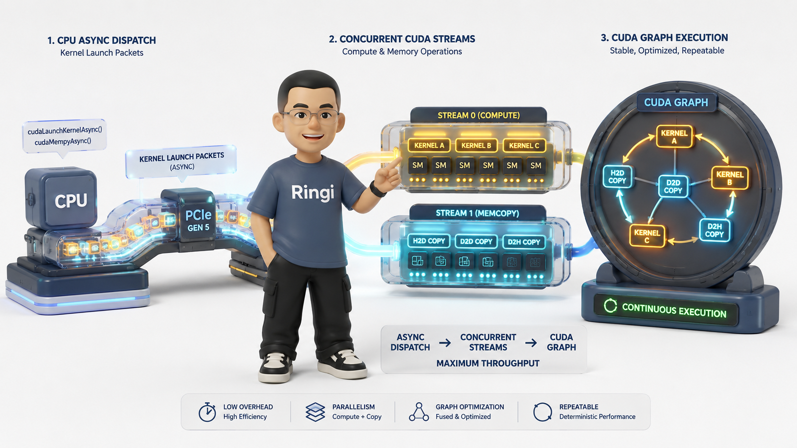
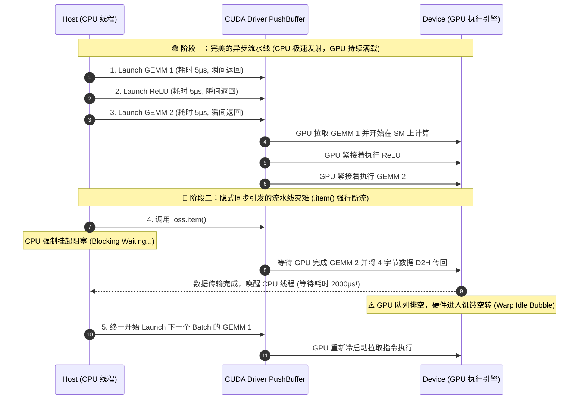
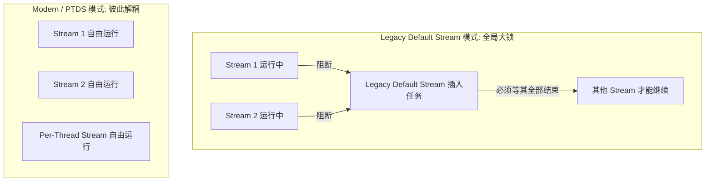
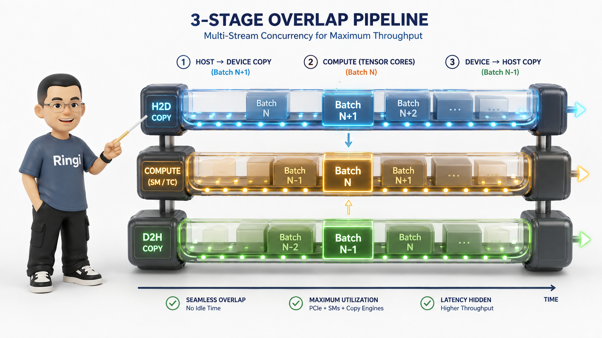
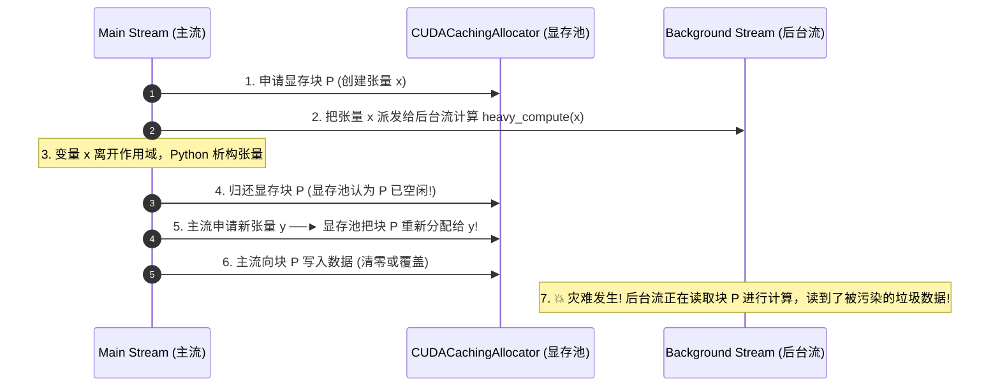
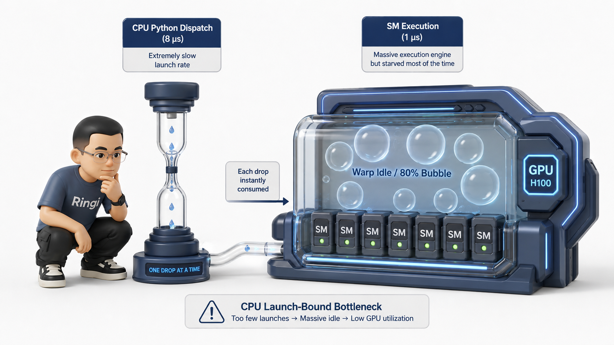
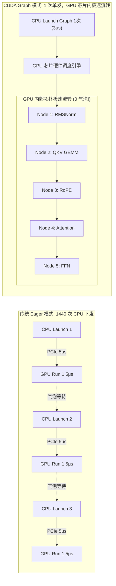

# 🏛️ 第07讲：PyTorch 异步执行流——CUDA Stream 与 CUDA Graph 原理

> **主讲人**：👓 **Ringi**（大厂 AI Infrastructure 工程师）  
> **所属模块**：Module 00: 性能工程与系统前置  
> **篇章范式**：🏛️ 性能工程与系统前置篇（Performance Engineering & System Baseline）  
> **核心导读**：在很多刚接触 GPU 编程或大模型训练的同学眼中，代码的执行逻辑总是理所当然地被当作“同步串行”的：Python 解释器读到第 1 行矩阵乘法，GPU 就把第 1 行算完；读到第 2 行激活函数，GPU 再接着算第 2 行。然而，这种朴素的直觉在现代 GPU 计算体系中是彻底错误的！  
> GPU 本质上是一个独立于 CPU 的**极致并发、完全异步的协处理器（Asynchronous Coprocessor）**。当你在 Python 中调用 `c = torch.matmul(a, b)` 时，CPU 仅仅是把一条计算指令装填进硬件队列后就瞬间扬长而去，实际的计算可能要在几十微秒之后才会在 GPU 内部的流式多处理器（SM）上真正运转。这种异步设计赋予了系统极高的并行吞吐，但也带来了重重致命暗礁：为什么用 `time.time()` 测出的模型耗时只有 0.1 毫秒？为什么随手写一句 `print(loss.item())` 就会导致 Serving 吞吐暴跌 70%？为什么在没有调用 `tensor.record_stream()` 时多流并发会出现静默的数据踩踏（Data Corruption）？为什么在大模型单 Token 生成（Decode）阶段，算力强劲的 H100 显卡有 80% 的时间在饥饿等待 CPU 下发指令？  
> 本讲将带你穿透 Python 运行时与 CUDA 驱动层，手拆 Host-Device 异步流水线、CUDA Stream/Event 硬件调度模型、Launch Overhead 微秒级账本，并彻底掌握大模型推理引擎（如 vLLM、TensorRT-LLM）性能翻倍的终极大杀器——**CUDA Graph 录制与重放机制**！



```text
=================================================================================================
                                   Ringi 3D 架构工坊 · 核心全景
┌───────────────────────────────────────────────────────────────────────────────────────────────┐
│                                                                                               │
│  [Host CPU 侧：指令发射传送带]                                                                │
│  Python 代码 ──► PyTorch Dispatcher ──► CUDA Runtime (cudaLaunchKernel) ──► 驱动 PushBuffer   │
│  (发射耗时 ~5-10 μs)  (极速返回非阻塞)    (排队等待下发)                        │              │
│                                                                                ▼              │
│  ──────────────────────────────────────────────────────────────────────── PCIe 总线 ─────────  │
│                                                                                │              │
│  [Device GPU 侧：硬件队列与执行引擎]                                          ▼              │
│                                                                ┌───────────────────────────┐  │
│  Stream 0 (Compute):  ──► [ GEMM 1 ] ──► [ GEMM 2 ] ──► [Event Record] ──► [ Wait Event ] │  │
│                                                                │                           │  │
│  Stream 1 (Comm/P2P): ──► [ H2D Dma] ──► [ Event Record ] ─────┘                           │  │
│                                                   ▲                                        │  │
│                                                   │ (流间硬件依赖栅栏，CPU 零开销)          │  │
│  ───────────────────────────────────────────────────────────────────────────────────────────  │
│                                                                                               │
│  [CUDA Graph 模式：整图烘焙与单次发射突破 Launch-Bound 瓶颈]                                 │
│  传统模式:  CPU [Launch] ──► GPU [Run] ──► CPU [Launch] ──► GPU [Run] (断断续续，空转严重)    │
│  Graph模式: CPU [Launch 1次] ───────────────────────────────────────────────────────────────► │
│             GPU [ 静态拓扑图内核连续无缝流转: Node1 ──► Node2 ──► Node3 ... ] (算力跑满 95%+)  │
│                                                                                               │
└───────────────────────────────────────────────────────────────────────────────────────────────┘
=================================================================================================
```

<!-- more -->

## 📑 目录导航

- [0. Ringi 开场：`print(time.time())` 测 GPU 时间准吗？](#0-ringi-开场printtimetime-测-gpu-时间准吗)
  - [0.1 线上幽灵：`time.time()` 测出的“0.0001秒前向”弥天大谎](#01-线上幽灵timetime-测出的00001秒前向弥天大谎)
  - [0.2 惨案现场：一个 `.item()` 打日志让大模型 Serving 吞吐暴跌 70% 的断流悲剧](#02-惨案现场一个-item-打日志让大模型-serving-吞吐暴跌-70-的断流悲剧)
  - [0.3 为什么大模型 Decode 阶段 80% 的时间在等 CPU？](#03-为什么大模型-decode-阶段-80-的时间在等-cpu)
- [1. CPU-GPU 异步执行模型与硬件执行流水线](#1-cpu-gpu-异步执行模型与硬件执行流水线)
  - [1.1 Host (CPU) 与 Device (GPU) 的生产者-消费者架构](#11-host-cpu-与-device-gpu-的生产者-消费者架构)
  - [1.2 驱动层指令队列（PushBuffer / Command Queue）与硬件工作分发器（Work Distributor）](#12-驱动层指令队列pushbuffer--command-queue与硬件工作分发器work-distributor)
  - [1.3 隐式同步（Implicit Synchronization）大起底：哪些操作在悄悄打碎你的流水线？](#13-隐式同步implicit-synchronization大起底哪些操作在悄悄打碎你的流水线)
  - [1.4 Mermaid 拓扑图：CPU 异步发射与 GPU 流水线时序分解](#14-mermaid-拓扑图cpu-异步发射与-gpu-流水线时序分解)
- [2. CUDA Stream（流）底层机制与多流并发](#2-cuda-stream流底层机制与多流并发)
  - [2.1 什么是 CUDA Stream？软硬件映射与队列行为](#21-什么是-cuda-stream软硬件映射与队列行为)
  - [2.2 默认流的双重面孔：Legacy Default Stream 与 Per-Thread Default Stream (PTDS)](#22-默认流的双重面孔legacy-default-stream-与-per-thread-default-stream-ptds)
  - [2.3 自定义流、非阻塞流与优先级流（Priority Streams）](#23-自定义流非阻塞流与优先级流priority-streams)
  - [2.4 多流并发的物理条件：SM 算力、寄存器与共享内存的硬件竞争](#24-多流并发的物理条件sm-算力寄存器与共享内存的硬件竞争)
  - [2.5 经典并发范式 1：计算与数据传输重叠（Compute & H2D/D2H 3 级流水线）](#25-经典并发范式-1计算与数据传输重叠compute--h2dd2h-3-级流水线)
  - [2.6 经典并发范式 2：分布式训练中的计算与通信重叠（NCCL Stream 与 Compute Stream）](#26-经典并发范式-2分布式训练中的计算与通信重叠nccl-stream-与-compute-stream)
- [3. CUDA Event（事件）与流间依赖同步 DAG](#3-cuda-event事件与流间依赖同步-dag)
  - [3.1 什么是 CUDA Event？GPU 指令流中的“时间戳与栅栏”](#31-什么是-cuda-eventgpu-指令流中的时间戳与栅栏)
  - [3.2 高精度 GPU 性能打点：`torch.cuda.Event` 的底层原理与纳秒级时钟](#32-高精度-gpu-性能打点torchcudaevent-的底层原理与纳秒级时钟)
  - [3.3 流间同步的两大流派：GPU 端无感等待 vs CPU 端硬同步](#33-流间同步的两大流派gpu-端无感等待-vs-cpu-端硬同步)
  - [3.4 显存安全的终极暗礁：`tensor.record_stream(stream)` 的底层原理与显存池污染惨案](#34-显存安全的终极暗礁tensorrecord_streamstream-的底层原理与显存池污染惨案)
- [4. CPU Launch Overhead 瓶颈与小算子困境](#4-cpu-launch-overhead-瓶颈与小算子困境)
  - [4.1 微秒级时间账本：单个 Kernel 启动开销究竟耗时多久？](#41-微秒级时间账本单个-kernel-启动开销究竟耗时多久)
  - [4.2 Decode 阶段的“算力饥饿”：为什么 70B 模型单 Token 生成时 GPU 在大量空转？](#42-decode-阶段的算力饥饿为什么-70b-模型单-token-生成时-gpu-在大量空转)
  - [4.3 为什么算子融合（Kernel Fusion）不能解决一切问题？](#43-为什么算子融合kernel-fusion不能解决一切问题)
- [5. CUDA Graph（图执行模式）录制与重放原理](#5-cuda-graph图执行模式录制与重放原理)
  - [5.1 从“逐个下发解释执行”到“预编译静态执行图”的第一性原理变革](#51-从逐个下发解释执行到预编译静态执行图的第一性原理变革)
  - [5.2 CUDA Graph 底层架构：Node、Edge 与 Executable Graph (`cudaGraphExec_t`)](#52-cuda-graph-底层架构nodeedge-与-executable-graph-cudagraphexec_t)
  - [5.3 录制三步法（Stream Capture Workflow）：捕获、实例化与重放](#53-录制三步法stream-capture-workflow捕获实例化与重放)
  - [5.4 显存私有池（Private Mempool）：Graph 录制为什么必须使用专门的 Memory Pool？](#54-显存私有池private-mempoolgraph-录制为什么必须使用专门的-memory-pool)
  - [5.5 性能飞跃实测：1 次 CPU 发射代替 500+ 次 Kernel Launch](#55-性能飞跃实测1-次-cpu-发射代替-500-次-kernel-launch)
- [6. CUDA Graph 工业级落地的 5 大严苛约束与破局之道](#6-cuda-graph-工业级落地的-5-大严苛约束与破局之道)
  - [6.1 ⚠️ 5 大硬性约束（Hard Constraints）](#61-️-5-大硬性约束hard-constraints)
  - [6.2 工业级解法 1：Static Input/Output Buffer 复用与 In-place 拷贝](#62-工业级解法-1static-inputoutput-buffer-复用与-in-place-拷贝)
  - [6.3 工业级解法 2：vLLM / TensorRT-LLM 中的 Multi-Bucket CUDA Graphs](#63-工业级解法-2vllm--tensorrt-llm-中的-multi-bucket-cuda-graphs)
  - [6.4 工业级解法 3：PyTorch 2.0 TorchInductor 编译器中的 CUDA Graph Trees 架构](#64-工业级解法-3pytorch-20-torchinductor-编译器中的-cuda-graph-trees-架构)
- [7. 动手实战与代码实验室（Hands-on Benchmark & Inspection）](#7-动手实战与代码实验室hands-on-benchmark--inspection)
  - [7.1 实验 1：CPU-GPU 异步假象与 `Event` 高精度计时器 vs `time.time()` 荒谬对比实验](#71-实验-1cpu-gpu-异步假象与-event-高精度计时器-vs-timetime-荒谬对比实验)
  - [7.2 实验 2：隐式同步（`.item()` / `.cpu()`）断流破坏流水线的微秒级剖析实验](#72-实验-2隐式同步item--cpu-断流破坏流水线的微秒级剖析实验)
  - [7.3 实验 3：多 Stream 3 级流水线（H2D 传输 $\to$ GEMM 计算 $\to$ D2H 传输）重叠压测](#73-实验-3多-stream-3-级流水线h2d-传输-to-gemm-计算-to-d2h-传输重叠压测)
  - [7.4 实验 4：不写 `tensor.record_stream()` 导致显存池静默踩踏与数据污染的凶杀现场复现](#74-实验-4不写-tensorrecord_stream-导致显存池静默踩踏与数据污染的凶杀现场复现)
  - [7.5 实验 5：手工实现一个端到端的 Transformer Layer CUDA Graph 录制与重放压测](#75-实验-5手工实现一个端到端的-transformer-layer-cuda-graph-录制与重放压测)
  - [7.6 实验 6：vLLM 风格的 Multi-Bucket CUDA Graph 简易调度器实现](#76-实验-6vllm-风格的-multi-bucket-cuda-graph-简易调度器实现)
- [8. Ringi 避坑指南与大厂硬核经典面试题](#8-ringi-避坑指南与大厂硬核经典面试题)
  - [8.1 避坑表格（❌ 常见小白错误理解 vs ✅ 大厂 AI Infra 正确理解）](#81-避坑表格-常见小白错误理解-vs--大厂-ai-infra-正确理解)
  - [8.2 4 道大厂高频硬核面试与白板推导题（含详细推导、思考路径与标准答案）](#82-4-道大厂高频硬核面试与白板推导题含详细推导思考路径与标准答案)
- [9. Ringi 5 点核心速记口诀、自我检验清单与课后深度思考题](#9-ringi-5-点核心速记口诀自我检验清单与课后深度思考题)
  - [9.1 5 点押韵核心速记口诀](#91-5-点押韵核心速记口诀)
  - [9.2 6 条白板自我检验清单](#92-6-条白板自我检验清单)
  - [9.3 3 道高阶开放式课后思考题（含极限 Corner Case）](#93-3-道高阶开放式课后思考题含极限-corner-case)
- [10. 🎨 Ringi 3D 架构工坊全套生图 Prompt 蓝图速查表](#10--ringi-3d-架构工坊全套生图-prompt-蓝图速查表)
- [11. 📚 参考资料与 PyTorch CUDA 核心源码指引](#11--参考资料与-pytorch-cuda-核心源码指引)

---

# 0. Ringi 开场：`print(time.time())` 测 GPU 时间准吗？

## 0.1 线上幽灵：`time.time()` 测出的“0.0001秒前向”弥天大谎

很多刚写 PyTorch 的工程师在做性能评测（Profiling）时，最习惯写出类似下面这样的测速代码：

```python
import time
import torch

# 假设我们在 A100 上跑一个 7B 参数的大模型前向
x = torch.randn(1, 4096, 4096, device="cuda")
weight = torch.randn(4096, 4096, device="cuda")

t0 = time.time()
# 执行前向计算：大矩阵乘法
y = torch.matmul(x, weight)
t1 = time.time()

print(f"大模型前向耗时: {(t1 - t0) * 1000:.4f} ms")
```

当你把这段代码在终端里跑起来时，屏幕上打印出来的数字通常会让你惊掉下巴：

```text
大模型前向耗时: 0.0238 ms  # (即 23.8 微秒！)
```

初学者往往欣喜若狂：“天哪！A100 简直神了，算一个 4096 维的大矩阵乘法居然只要 20 多微秒？算力突破天际了！”

作为 AI Infra 工程师，我必须无情地戳破这个美丽的幻想：**你测出来的根本不是 GPU 计算时间，而仅仅是 CPU 把这个计算任务装填进任务队列的时间！**

在真实的硬件物理世界中，当你执行 `y = torch.matmul(x, weight)` 时：

1. **CPU 视角**：Python 解释器调用 PyTorch C++ ATen 库，打包好 Kernel 参数，调用 CUDA Runtime 的 `cudaLaunchKernel` API，把一个名为 `cutlass_gemm_kernel` 的任务丢进 GPU 的硬件指令队列（Hardware Queue）中。做完这件事，CPU **立刻返回**，耗时仅约十几微秒；
2. **GPU 视角**：此时 GPU 硬件调度器甚至还没来得及把这个 Kernel 分发到具体的 SM（流式多处理器）上！实际的浮点计算可能要在几百微秒之后才刚刚开始运转。

你在代码里用 `time.time()` 记录的，只是 CPU 发射指令的“动作耗时”。如果你想测出真正的 GPU 耗时，必须在打点前后加入硬件同步栅栏：

```python
torch.cuda.synchronize()  # 强行阻塞 CPU，等待 GPU 把之前所有的任务彻底算完
t0 = time.time()

y = torch.matmul(x, weight)

torch.cuda.synchronize()  # 再次强行阻塞 CPU，直到这个 GEMM 彻底执行完毕
t1 = time.time()
print(f"真实 GPU 物理耗时: {(t1 - t0) * 1000:.4f} ms")  # 真实输出通常在 1.5 ~ 3.0 ms 左右！
```

这就是 GPU 编程的基石——**CPU-GPU 异步并发模型**。

---

## 0.2 惨案现场：一个 `.item()` 打日志让大模型 Serving 吞吐暴跌 70% 的断流悲剧

如果说 `time.time()` 只是让你在本地测速时产生了幻觉，那么在生产环境中对“异步性”的无知，则会酿成实打实的重大生产事故。

我曾经参与排查过某大厂线上 LLM 推理集群的一个严重 P1 性能退化事故：
算法团队上线了一套基于 TensorRT-LLM 与 vLLM 的大模型在线服务系统。在预发布环境压测时，单卡吞吐量（Throughput）能达到 **1800 Tokens/s**，但在正式上线部署后，监控大盘显示的吞吐量断崖式暴跌至 **520 Tokens/s**，暴跌了将近 **70%**！与此同时，GPU 的计算利用率（GPU Utilization）在 `nvidia-smi` 中从 95% 跌到了可怜的 30% 左右，呈现出极其诡异的“锯齿状”颠簸。

我们深入火焰图（FlameGraph）与 Nsight Systems 进行微秒级追踪，最终在 Python 业务逻辑层找到了这一行“元凶代码”：

```python
# ❌ 一行看似无比人畜无害的监控日志打点
def generate_step(self, input_tokens):
    logits = self.model(input_tokens)
    next_token_logits = logits[:, -1, :]

    # 业务同学为了实时监控置信度，顺手加了一句：
    max_prob = torch.softmax(next_token_logits, dim=-1).max().item() # <--- 致命死穴！
    logger.debug(f"Current token max confidence: {max_prob:.4f}")

    next_tokens = torch.argmax(next_token_logits, dim=-1)
    return next_tokens
```

为什么这一句 `.item()` 拥有如此恐怖的毁灭力量？

- `.item()` 的核心语义是：**把 GPU 显存中的单个标量张量，转换成 Python 原生的 float / int 对象并返回给 CPU**；
- 为了让 CPU 拿到这个值，CPU **必须立刻停下手头所有的工作，强行挂起阻塞，向 GPU 发出同步等待请求，等待 GPU 把当前所有的前向 Kernel 全部执行完毕，再通过 PCIe 总线把这 4 个字节从 HBM 拷贝回宿主机 DRAM**；
- 这一停，整条原本流畅运转的“CPU 发射 $\to$ GPU 连续计算”的异步执行流水线被彻底打得粉碎！GPU 在算完这一步后无事可做，只能陷入漫长的饥饿等待（Pipeline Bubble）。

把这行代码删掉（或者改成异步累加日志）后，系统的吞吐量瞬间原地复活，飙升回 1850 Tokens/s！


---

## 0.3 为什么大模型 Decode 阶段 80% 的时间在等 CPU？

在进入大模型时代后，异步执行流与硬件调度的矛盾变得前所未有的尖锐。

在大语言模型（LLM）的生成阶段（Decode Phase），模型每一步只需要生成 **1 个 Token**。这意味着：

- 单个 Token 经过一行 RMSNorm、RoPE 或者小 GEMM 算子时，由于计算量（FLOPs）极小，GPU 的 Tensor Core 只需要 **$1 \sim 2\ \mu\text{s}$（微秒）** 就能瞬间算完；
- 然而，CPU 运行 Python 代码、经过 PyTorch Dispatch 路由、最后调用驱动下发这个 Kernel 到 GPU，整个 CPU 发射开销（Launch Overhead）通常需要 **$5 \sim 10\ \mu\text{s}$**！

```text
CPU 发射:  [=== Launch Op 1 (8μs) ===]  [=== Launch Op 2 (8μs) ===]  [=== Launch Op 3 (8μs) ===]
                │                           │                           │
                ▼                           ▼                           ▼
GPU 执行:       [Op1 (1.5μs)] ...气泡(6.5μs)... [Op2 (1.5μs)] ...气泡(6.5μs)... [Op3 (1.5μs)]
```

看到了吗？**GPU 跑 1.5 微秒，就必须停下来在原地发呆 6.5 微秒，苦苦等待 CPU 下发下一个算子！**  
整个 GPU 算力利用率甚至不足 20%，系统完全被卡在 CPU 发射瓶颈上（Launch-Bound / CPU-Bound）。

为了解决这个大模型推理的致命瓶颈，NVIDIA 联合 PyTorch 推出了革命性的技术——**CUDA Graph（图执行模式）**。它能够将一整个由几百个小算子组成的复杂神经网络，在 GPU 显存中“录制”成一张静态拓扑图。在重放执行时，CPU 只需要发射 **1 次** 指令，GPU 就会在片上硬件调度器的驱动下，像一道闪电一样无缝连环触发几百个算子，彻底消灭所有 CPU 气泡！

要真正驾驭这些顶尖的 AI Infra 技术，我们必须从最底层的第一性原理开始，彻底搞懂 CUDA Stream 与 CUDA Graph 的运行逻辑。

---

# 1. CPU-GPU 异步执行模型与硬件执行流水线

## 1.1 Host (CPU) 与 Device (GPU) 的生产者-消费者架构

要理解 GPU 的异步机制，首先要建立正确的物理心智模型。计算机体系结构中，CPU 被称为 **Host（宿主机）**，GPU 被称为 **Device（设备）**。它们通过高延迟、低带宽的 **PCIe 总线**（如 PCIe 4.0 x16 单向带宽约 31.5 GB/s，PCIe 5.0 约 63 GB/s）或高速互联通道（如 NVLink-C2C）物理连接。

CPU 和 GPU 之间绝不是“你走一步我跟一步”的紧耦合协同，而是一个标准的 **生产者-消费者队列架构（Producer-Consumer Architecture）**：

```text
┌────────────────────────────────────────────────────────────────────────────────┐
│                           CPU (Host: 生产者)                                   │
│  for op in model.layers:                                                       │
│      op.forward(tensor)  ──► [ PyTorch C++ ATen ] ──► [ CUDA Runtime API ]     │
└──────────────────────────────────────┬─────────────────────────────────────────┘
                                       │ 装填指令 (Push Kernel Descriptors)
                                       ▼
┌────────────────────────────────────────────────────────────────────────────────┐
│                     NVIDIA Driver PushBuffer / Command Queue                   │
│   [ Kernel A Launch ] ──► [ Kernel B Launch ] ──► [ H2D Memcpy ] ──► [ ... ]   │
└──────────────────────────────────────┬─────────────────────────────────────────┘
                                       │ PCIe 传输 / 硬件拉取
                                       ▼
┌────────────────────────────────────────────────────────────────────────────────┐
│                           GPU (Device: 消费者)                                 │
│  [ Hardware Work Distributor / GMU ] ──► 分发 Thread Blocks 到各 SM 核心执行   │
└────────────────────────────────────────────────────────────────────────────────┘
```

1. **CPU 是生产者（Producer）**：CPU 负责解析 Python 代码，分配张量显存元数据，确定算子超参数，并将 Kernel 的执行配置（Grid Dim, Block Dim, 共享内存大小, 参数指针）打包为一条指令描述符，写入驱动维护的 Ring Buffer（环形缓冲区，NVIDIA 称之为 PushBuffer）；
2. **GPU 是消费者（Consumer）**：GPU 硬件内部的 **工作分发单元（Grid Management Unit, GMU / Work Distributor）** 会自主地从硬件队列中拉取任务，一旦发现当前 SM（Streaming Multiprocessor）有空闲的计算资源（寄存器、共享内存、Warp 槽位），就立刻将 Thread Blocks 分发到 SM 上并发执行。

只要 PushBuffer 中有积压的任务，CPU 和 GPU 就可以**完全并行运转**：CPU 正在疯狂地发射第 100 个算子，而 GPU 刚刚开始执行第 5 个算子。两者之间存在巨大的“时间流水线重叠（Pipeline Overlap）”。

---

## 1.2 驱动层指令队列（PushBuffer / Command Queue）与硬件工作分发器（Work Distributor）

让我们在显微镜下看看一个 `torch.matmul(A, B)` 是如何在 C++ 与驱动层流转的：

```cpp
// 伪代码：PyTorch 底层调用 CUDA Kernel 的核心链路
void launch_matmul_kernel(at::Tensor A, at::Tensor B, at::Tensor C, cudaStream_t stream) {
    // 1. 从 Tensor 对象中提取物理显存指针 (Device Pointer)
    void* d_A = A.data_ptr();
    void* d_B = B.data_ptr();
    void* d_C = C.data_ptr();

    // 2. 配置 CUDA 线程网格与块维度
    dim3 grid(M / 128, N / 128);
    dim3 block(128, 1);

    // 3. 调用 CUDA Runtime API 下发
    // 注意：cudaLaunchKernel 是纯异步的，它只把指令写入 Stream 对应的 PushBuffer 中就返回了！
    cudaError_t err = cudaLaunchKernel(
        (const void*)gemm_kernel_ptr,
        grid, block,
        args_array,
        shared_mem_size,
        stream
    );

    // 4. 函数瞬间退出，CPU 线程继续往下执行下一行 Python 代码
}
```

在操作系统与驱动层面：

- NVIDIA 驱动在 Host 内存中开辟了一段特殊的锁页内存作为 **PushBuffer**；
- `cudaLaunchKernel` 实际上只是在 PushBuffer 的末尾追加了几十个字节的命令包（Command Packet），并更新写指针；
- GPU 内部的 **DMA Copy Engine** 或 **Host Interface (HIF)** 通过 PCIe 持续轮询或通过 Doorbell 寄存器感知到新指令，将命令拉取到 GPU 片上的 **GMU（Grid Management Unit）**；
- 因此，`cudaLaunchKernel` 的耗时完全取决于 CPU 打包这几十个字节的速度，而与这个 Kernel 在 GPU 上究竟要算 1 毫秒还是 10 秒钟**没有任何物理关联**！


---

## 1.3 隐式同步（Implicit Synchronization）大起底：哪些操作在悄悄打碎你的流水线？

既然异步能让 GPU 跑得飞快，那么什么时候流水线会被强制叫停？  
在 PyTorch 开发中，存在大量隐蔽的 **隐式同步点（Implicit Synchronization Points）**。一旦触发隐式同步，CPU 就会被死死卡住，直到 GPU 完成当前队列中的所有任务。

以下是 AI Infra 工程师必须倒背如流的 **7 大隐式同步暗礁**：

| 触发操作                            | 典型代码示例                                              | 物理底层行为                                                                                   | 性能破坏等级                       |
| :---------------------------------- | :-------------------------------------------------------- | :--------------------------------------------------------------------------------------------- | :--------------------------------- |
| **1. 标量提取 (Scalar Extraction)** | `tensor.item()`, `tensor.tolist()`                        | CPU 必须等待 GPU 计算完成，并将显存数值通过 PCIe 拷贝回 CPU DRAM 构造 Python 标量              | 🔴 **致命 (P0 级灾难)**            |
| **2. 控制流断言与打印**             | `print(tensor)`, `if (loss < 0.01):`                      | 打印和条件判断依赖具体数值，CPU 强行阻塞等待 GPU 结果                                          | 🔴 **致命 (P0 级灾难)**            |
| **3. 动态掩码与数据过滤**           | `tensor.nonzero()`, `x[x > 0]`                            | 输出张量的 Shape 依赖 GPU 内部的计算结果（非固定 Shape），CPU 必须同步以获知输出张量的内存大小 | 🔴 **致命 (P0 级灾难)**            |
| **4. 同步内存拷贝**                 | `tensor.cpu()`, `cudaMemcpy(..., cudaMemcpyDeviceToHost)` | 宿主机同步等待数据从 HBM 传输到 Host 内存完成                                                  | 🟠 **严重 (破坏重叠)**             |
| **5. 显存池紧急同步**               | `torch.cuda.empty_cache()`                                | 强制清空 CUDACachingAllocator 缓存池，阻塞所有 Stream 上的任务以进行显存垃圾回收与内存碎片整理 | 🔴 **致命 (严禁在训练循环中调用)** |
| **6. 跨流同步调用**                 | `torch.cuda.synchronize()`, `stream.synchronize()`        | 显式要求 CPU 挂起，直到指定 Stream 或整张卡所有 Stream 全部清空                                | 🟡 **可控 (仅限性能测试/收尾)**    |
| **7. 默认流的隐式屏障**             | 在 Legacy Default Stream 上执行某些内存拷贝操作           | 默认流会隐式与整张卡上的所有其他 Stream 进行双向同步（详细机理见下文）                         | 🟠 **严重 (并发失效)**             |

> [!CAUTION]
> **线上黄金准则**：在训练的 `train_step()` 或推理的 `decode_step()` 核心热路径（Hot Path）中，**绝对严禁出现 `.item()`、`print(tensor)`、`x.nonzero()` 和 `torch.cuda.empty_cache()`**！任何监控指标必须在 GPU 内部累加（如维护一个 Tensor 并在每 100 个 Step 才统一步伐同步一次），或者完全异步丢入专门的日志队列中。

---

## 1.4 Mermaid 拓扑图：CPU 异步发射与 GPU 流水线时序分解

下面的 Mermaid 序列图清晰地展示了“异步执行”与“隐式同步断流”在时间轴上的巨大反差：



---

# 2. CUDA Stream（流）底层机制与多流并发

## 2.1 什么是 CUDA Stream？软硬件映射与队列行为

如果说 GPU 是一条由上百个车间（SM）组成的超级工厂，那么 **CUDA Stream（流）** 就是通往工厂内部的 **流水线传送带**。

- **定义**：一个 CUDA Stream 是一个由 GPU 按照严格的 **FIFO（先进先出，First-In-First-Out）** 顺序执行的操作（Kernel 启动、内存拷贝、Event 记录）序列；
- **同流严格串行**：同一个 Stream 内部的两个 Kernel（例如 Kernel A 和 Kernel B），GPU 保证 **Kernel B 绝对不会在 Kernel A 彻底执行完之前开始执行**；
- **异流并发重叠**：不同 Stream 中的操作在逻辑上是完全独立的。如果 GPU 的硬件资源（SM、DMA 引擎）充足，**Stream 1 中的 Kernel 和 Stream 2 中的 Kernel 可以在物理上同时在不同的 SM 上并发运行**！

```text
Stream 1 (Compute):  ──► [ Kernel A (SM 0~39) ] ──► [ Kernel B (SM 0~79) ] ──►
                              ▲ 并发执行 (Overlap)
                              ▼
Stream 2 (Transfer): ──► [ H2D DMA Copy Engine ] ──► [ Kernel C (SM 40~79) ] ──►
```

---

## 2.2 默认流的双重面孔：Legacy Default Stream 与 Per-Thread Default Stream (PTDS)

在 PyTorch 中，如果你没有显式创建 `torch.cuda.Stream`，所有的 GPU 操作都会默认被发射到 **Default Stream（默认流，也称 0 轴流）** 上。

然而，在底层 CUDA 架构中，默认流存在两种截然不同的物理行为模式，这是无数多流并发程序的“万恶之源”：

### ① Legacy Default Stream（旧式默认流，全局互斥屏障）

在默认编译配置下，CUDA 的默认流具有全局的 **隐式同步（Implicit Serialization）** 特性：

- 当一个操作在 Legacy Default Stream 上执行时，它会**等待当前设备上所有其他 Stream 中的所有操作全部完成**，才开始执行；
- 当 Legacy Default Stream 上的操作正在执行时，**所有其他 Stream 中的新操作都必须原地等待**，直到默认流上的操作彻底完成！
- **结论**：Legacy Default Stream 就像一把全局大锁（Global Barrier），会彻底摧毁任何跨流并发优化的努力！

### ② Per-Thread Default Stream (PTDS，每个 CPU 线程私有的独立默认流)

为了解决 Legacy Default Stream 的全局互斥问题，CUDA 引入了 PTDS 机制（在编译时加上 `--default-stream per-thread` 或在 PyTorch 中使用独立流）：

- 每个 Host CPU 线程拥有自己独立的默认流；
- 该默认流被视作一个普通的非阻塞流，不会再与其它线程或自定义流发生全局互斥。



---

## 2.3 自定义流、非阻塞流与优先级流（Priority Streams）

在 PyTorch 中，创建和管理自定义流非常优雅：

```python
import torch

# 1. 创建普通自定义流 (Non-blocking by default in PyTorch)
s1 = torch.cuda.Stream()
s2 = torch.cuda.Stream()

# 2. 创建高优先级流 (Priority Stream: 数字越小/越负，优先级越高)
# 常用场景：在分布式训练中，通信流或关键路径上的梯度同步设置为高优先级！
high_pri_stream = torch.cuda.Stream(priority=-1)
low_pri_stream = torch.cuda.Stream(priority=0)

# 查看当前流的优先级范围
low_p, high_p = torch.cuda.Stream.priority_range()
print(f"CUDA Stream 优先级范围: 最低={low_p}, 最高={high_p}")  # 输出如: 0, -1

# 3. 在指定流上下文中执行操作
with torch.cuda.stream(s1):
    # 下发的操作全部进入 s1 流队列
    a = torch.randn(2048, 2048, device="cuda")
    b = torch.matmul(a, a)

with torch.cuda.stream(s2):
    # 下发的操作全部进入 s2 流队列，与 s1 并发执行！
    c = torch.randn(2048, 2048, device="cuda")
    d = torch.matmul(c, c)
```

---

## 2.4 多流并发的物理条件：SM 算力、寄存器与共享内存的硬件竞争

很多初学者容易产生一个误解：“只要我开了 10 个 CUDA Stream，GPU 速度就能提升 10 倍！”  
这显然违背了物理常识。**多流并发（Concurrent Kernels）是有非常苛刻的硬件物理前提的**：

1. **GPU 硬件资源剩余**：
   - 现代 GPU（如 NVIDIA A100 有 108 个 SM，H100 有 132 个 SM）；
   - 如果 Stream 1 里的 Kernel A 是一个大矩阵乘法（GEMM），它的 Grid 配置了 10000 个 Thread Blocks，每个 Block 吃满了 256 个线程与大量的寄存器/共享内存，那么 **Kernel A 一个算子就会把 GPU 所有的 108 个 SM 彻底占满（100% SM Occupancy）**；
   - 此时，即便 Stream 2 里面有 Kernel B，GPU 的硬件工作分发器（GMU）也没有任何多余的 SM 资源分给 Kernel B，Kernel B 只能在硬件队列里苦苦排队。此时多流并发**完全退化为串行执行**！
2. **只有在以下场景下，多流并发才能产生巨大的物理加速**：
   - **小算子并发（Small Kernels）**：每个 Kernel 只需要 4~8 个 Block，单算子无法吃满 100+ 个 SM，多个 Stream 的小算子拼装在一起填满整张 GPU；
   - **异构引擎重叠（Heterogeneous Engine Overlap）**：计算使用 **SM 计算引擎**，而数据搬运使用 **DMA 拷贝引擎（Copy Engine）**。两者在硬件电路上是完全物理隔离的，可以达到 100% 完美的理论重叠！

---

## 2.5 经典并发范式 1：计算与数据传输重叠（Compute & H2D/D2H 3 级流水线）

在海量数据加载或大模型推理中，将 Host 内存中的数据搬运到 GPU（Host-to-Device, H2D）往往需要走 PCIe 总线。如果每次都是“传一个 Batch，算一个 Batch”，PCIe 传输时间就会成为严重的系统瓶颈。

利用多 Stream 构建 **3 级流水线（Triple-Buffering Pipeline）**，可以彻底将 PCIe 传输时间隐藏在 GPU 计算时间之后：

```text
时间轴 ──►
Stream 1 (H2D 拷贝):  [ Batch 0 传输 ] [ Batch 1 传输 ] [ Batch 2 传输 ] [ Batch 3 传输 ]
Stream 2 (GPU 计算):                  [ Batch 0 计算 ] [ Batch 1 计算 ] [ Batch 2 计算 ]
Stream 3 (D2H 拷回):                                  [ Batch 0 拷回 ] [ Batch 1 拷回 ]
```

> [!IMPORTANT]
> **锁页内存（Pinned Memory / Page-locked Memory）铁律**：  
> 要实现 H2D / D2H 数据传输与 GPU 计算的真正异步重叠，**Host 端 Tensor 必须位于锁页内存中**（即使用 `torch.empty(..., pin_memory=True)` 或 `tensor.pin_memory()`），并且在传输时显式传入 `non_blocking=True`：
>
> ```python
> # 必须使用 pin_memory=True 和 non_blocking=True 才能触发纯异步 DMA 传输！
> host_tensor_pinned = torch.randn(1024, 1024, pin_memory=True)
> gpu_tensor = host_tensor_pinned.to(device="cuda", non_blocking=True)
> ```
>
> 如果没有锁定内存，操作系统的虚拟内存系统可能会发生分页置换，CUDA 驱动为了防止内存页被操作系统悄悄移动，必须在底层强制退化为同步阻塞拷贝！



## 2.6 经典并发范式 2：分布式训练中的计算与通信重叠（NCCL Stream 与 Compute Stream）

在分布式数据并行（DDP）或张量并行（TP）中，多卡之间的集合通信（如 `AllReduce`、`AllGather`、`ReduceScatter`）是通过底层的 **NCCL 库** 完成的。

- **NCCL 独立通信流**：PyTorch 在后台会为 NCCL 通信专门创建独立的 `nccl_stream`；
- **计算流与通信流双流重叠**：
  - 在反向传播（Backward）计算时，当最后一层的梯度计算完毕，PyTorch 立即将该梯度的 `AllReduce` 任务发射到 `nccl_stream` 上；
  - 与此同时，默认的 `compute_stream` 不需要等待通信结束，而是立刻马不停蹄地继续向前计算倒数第二层、倒数第三层的梯度！
  - 这种跨流重叠机制（DDP Gradient Bucketing & Overlap）将跨节点的网络通信耗时完美地掩盖在反向求导的计算之中。

```mermaid
gantt
    title DDP 反向传播中的计算与通信双流重叠时序
    dateFormat  X
    axisFormat %s

    section Compute Stream (主计算流)
    Layer 4 Backward GEMM        :active, c1, 0, 10
    Layer 3 Backward GEMM        :active, c2, 10, 20
    Layer 2 Backward GEMM        :active, c3, 20, 30
    Layer 1 Backward GEMM        :active, c4, 30, 40

    section NCCL Stream (通信流)
    Layer 4 Grad AllReduce       :crit, n1, 10, 25
    Layer 3 Grad AllReduce       :crit, n2, 25, 40
    Layer 2 Grad AllReduce       :crit, n3, 40, 55
```



---

# 3. CUDA Event（事件）与流间依赖同步 DAG

## 3.1 什么是 CUDA Event？GPU 指令流中的“时间戳与栅栏”

当我们在一个多流并发的复杂系统中运转时，不同 Stream 之间的执行速度是不确定的。如果 Stream 2 里的计算必须依赖 Stream 1 传输过来的数据，我们该如何协调它们？

答案就是 **CUDA Event（事件）**。

- **物理本质**：CUDA Event 是插入在 CUDA Stream 任务队列中的一个特殊的 **状态同步标记（Synchronization Marker）**；
- **硬件记录**：当 GPU 执行引擎在 Stream 队列中扫描并执行到该 Event 时，GPU 会在硬件层面将该 Event 标记为“已就绪（Completed / Signaled）”，并记录下当前的硬件时钟戳（Hardware Timestamp）。

```text
Stream 1:  ──► [ Kernel A ] ──► [ Record Event E1 ] ──► [ Kernel B ] ──►
                                       │
                                       ▼ (硬件信号广播: E1 is Ready!)
Stream 2:  ──► [ Other Work ] ─► [ Wait Event E1 ] ──► [ Kernel C (安全消费 A 的输出) ]
```

---

## 3.2 高精度 GPU 性能打点：`torch.cuda.Event` 的底层原理与纳秒级时钟

在第 0 节中我们讲过，绝对不能用 Python 的 `time.time()` 测 GPU。在 AI Infra 领域，**精准测量 GPU 硬件物理执行耗时的唯一官方标准做法就是使用 `torch.cuda.Event`**：

```python
import torch

# 创建两个计时用的 Event (enable_timing=True)
start_event = torch.cuda.Event(enable_timing=True)
end_event = torch.cuda.Event(enable_timing=True)

# 1. 在当前 Stream 中插入起始标记
start_event.record()

# 2. 执行待测 GPU 算子
x = torch.randn(4096, 4096, device="cuda")
y = torch.matmul(x, x)

# 3. 在当前 Stream 中插入结束标记
end_event.record()

# 4. 等待 end_event 被 GPU 真正执行完成 (阻塞 CPU 以读取硬件计时器)
end_event.synchronize()

# 5. 计算两个硬件事件之间的物理耗时 (单位: 毫秒 ms，精度可达 0.5 微秒！)
elapsed_ms = start_event.elapsed_time(end_event)
print(f"GPU 硬件真实耗时: {elapsed_ms:.4f} ms")
```

`elapsed_time()` 的底层原理是：GPU 硬件在执行到 `start_event` 和 `end_event` 时，直接读取了 GPU 片上高精度计数器（Timestamp Register）的差值，彻底排除了 CPU 调度抖动、Python 解释器延迟和 PCIe 通信排队的干扰！

---

## 3.3 流间同步的两大流派：GPU 端无感等待 vs CPU 端硬同步

在多流协同开发中，同步有两个层级，理解它们的差异是衡量一个工程师是否入门的关键：

### ① CPU 端硬同步：`event.synchronize()` / `stream.synchronize()`

- **机制**：CPU 线程直接挂起，主动进入睡眠或自旋状态，直到 GPU 汇报该 Event 已经完成；
- **缺点**：打碎 CPU 异步发射流水线，CPU 无法继续干别的事；
- **使用场景**：只在测速打点、Step 收尾或退出程序时使用。

### ② GPU 端无感等待：`stream.wait_event(event)`

- **机制**：**CPU 毫秒不挂，瞬间返回！** CPU 只是在目标 Stream 的指令队列中塞入了一条“等待指令”；
- **底层硬件行为**：GPU 硬件在执行目标 Stream 时，发现前面有个 `wait_event` 栅栏，GPU 硬件调度器会**自主挂起该 Stream 的后续执行**，直到侦测到指定的 Event 变为 Signaled 状态，才自动放行！
- **优点**：**CPU 零开销，流水线完全不中断！**

```python
# 示例：优雅的跨流 GPU 端硬件无感依赖同步
s_copy = torch.cuda.Stream()
s_compute = torch.cuda.Stream()
ready_event = torch.cuda.Event()

# 1. 在拷贝流中异步传输数据
with torch.cuda.stream(s_copy):
    d_input = h_input.to(device="cuda", non_blocking=True)
    # 插入事件：标记数据拷贝完成
    ready_event.record(s_copy)

# 2. 在计算流中等待拷贝完成，然后执行计算
with torch.cuda.stream(s_compute):
    # 核心：让 s_compute 流在 GPU 硬件层等待 ready_event，CPU 瞬间跳过！
    s_compute.wait_event(ready_event)
    # 此时安全地消费 d_input，硬件保证此时拷贝已经彻底就绪！
    output = model(d_input)
```

---

## 3.4 显存安全的终极暗礁：`tensor.record_stream(stream)` 的底层原理与显存池污染惨案

现在，我们要揭开 PyTorch 多流并发中最深奥、最凶残、也是大厂面试最爱考的一个底层暗礁：**`tensor.record_stream()`**。

### 惨案复现：看似天衣无缝的多流代码

请看下面这段看似极其规范的多流并行代码，你能找出其中的致命 Bug 吗？

```python
# ❌ 一个会引发静默数据踩踏（Silent Data Corruption）的恶性 Bug
def background_worker(data_stream):
    # 在主线程创建了一个张量
    x = torch.randn(1024, 1024, device="cuda")

    # 将 x 丢给后台流进行异步重度计算
    with torch.cuda.stream(data_stream):
        # 异步计算结果
        result = heavy_compute(x)

    # 函数退出：局部变量 x 离开了作用域，Python 引用计数归零！
    return result
```

如果你运行这段代码，系统不会报错，但你的模型输出可能会莫名其妙变成 NaN，或者推理结果完全错乱！

### 凶案微观剖析：PyTorch `CUDACachingAllocator` 显存池的工作机制

1. **张量销毁与显存归还**：当 Python 变量 `x` 离开作用域时，Python 的垃圾回收器立即调用 C++ 析构函数，将 `x` 占用的显存块归还给 PyTorch 的 **显存分配器（`CUDACachingAllocator`）**；
2. **显存池的流绑定假设**：`CUDACachingAllocator` 默认假定：“这个张量是在主流（Default Stream）创建的，现在既然引用计数为 0，说明主流已经不再需要它了，我可以立刻把它重新分配给其他张量复用！”
3. **静默数据踩踏（Data Corruption）**：
   - 此时，后台流 `data_stream` 实际上**还在慢吞吞地读取 `x` 原本所在的显存物理地址**；
   - 可是主线程继续往下走，又创建了一个新的张量 `y = torch.zeros(1024, 1024, device="cuda")`；
   - 显存分配器直接把刚刚“释放”的 `x` 的显存地址分给了 `y`，并执行清零！
   - 后台流 `heavy_compute` 读到的数据瞬间被 `y` 彻底覆盖篡改！



### 救命稻草：`tensor.record_stream(stream)`

解决这个惨案的唯一正确方法，是在把张量交给非创建流时，显式调用 `record_stream()`：

```python
# ✅ 正确写法：告知显存分配器该张量正在被其他流消费
with torch.cuda.stream(data_stream):
    # 核心：给张量 x 打上后台流的生命周期标记！
    x.record_stream(data_stream)
    result = heavy_compute(x)
```

**`record_stream` 的底层物理机制**：  
它在 C++ `TensorImpl` 内部向该显存块附加了一个 CUDA Event。显存分配器即便看到 Python 端的张量被析构了，也会**强制等待该 Event 在后台流中被完全执行完毕后，才允许将这块物理显存重新分给其他人**！彻底终结了数据踩踏的可能！


---

# 4. CPU Launch Overhead 瓶颈与小算子困境

## 4.1 微秒级时间账本：单个 Kernel 启动开销究竟耗时多久？

在进入 CUDA Graph 之前，我们必须给 CPU 下发一个算子的全过程算一笔精准的“微秒级时间账本”。

当你在 Python 里调用一次简单的加法 `c = a + b` 时，底层经历的完整路径如下：

```text
┌────────────────────────────────────────────────────────────────────────────────┐
│ 1. Python 解释器执行 (Bytecode Eval, Argument Parsing):       ~ 1.5 - 3.0 μs  │
│ 2. PyTorch Dispatcher (动态类型检查, 自动求导追踪, 设备分发):   ~ 1.0 - 2.5 μs  │
│ 3. ATen C++ Operator Wrapper (张量元数据构造, Stride 检查):   ~ 0.5 - 1.0 μs  │
│ 4. CUDA Driver / Runtime API (cudaLaunchKernel 参数打包):     ~ 2.0 - 4.0 μs  │
│ ─────────────────────────────────────────────────────────────────────────────  │
│ 🔥 单个 Kernel 的 CPU 发射总耗时 (CPU Launch Overhead):        ~ 5.0 - 10.5 μs │
└────────────────────────────────────────────────────────────────────────────────┘
```

也就是说，**哪怕你的 GPU 算子只做一次 `1 + 1` 的计算，CPU 也要雷打不动地消耗至少 $5 \sim 10\ \mu\text{s}$ 的时间才能把它发射出去！**

---

## 4.2 Decode 阶段的“算力饥饿”：为什么 70B 模型单 Token 生成时 GPU 在大量空转？

在大模型分布式训练或 Prefill 阶段（长文本 Prompt 输入），由于 Batch Size 很大且序列很长，一个 GEMM 算子通常包含数十亿次浮点运算，GPU 在 SM 上需要计算 **几百微秒到数毫秒**。此时，CPU 的 $8\ \mu\text{s}$ 发射开销相比于 GPU 的计算时间完全可以忽略不计（计算完全隐藏了发射延迟）。

但在 **LLM Decode 阶段（单 Token 自回归生成）**，情况发生了 180 度大反转：

- 假设我们在 8 卡 H100 上运行 LLaMA-70B，每一步生成 1 个 Token（Batch Size = 1）；
- 一个 Transformer Block 包含大约 15~20 个小 Kernel（RMSNorm、QKV Proj、RoPE Embedding、Attention Decode、SwiGLU 激活、Residual Add、AllReduce）；
- 80 层 Transformer Block 总计包含约 **$80 \times 18 = 1440$ 个 Kernel**！

让我们手算一下这 1440 个 Kernel 的时间账本：

1. **GPU 实际物理计算时间**：
   - 在 H100 强悍的带宽和算力下，每个小算子的实际执行时间只有 $0.5 \sim 2\ \mu\text{s}$；
   - 1440 个 Kernel 的 GPU 纯计算时间总计：$1440 \times 1.2\ \mu\text{s} \approx \mathbf{1.728\text{ ms}}$；
2. **CPU 串行发射总耗时**：
   - 每次发射平均消耗 $7\ \mu\text{s}$；
   - 1440 个 Kernel 的 CPU 发射时间总计：$1440 \times 7\ \mu\text{s} \approx \mathbf{10.08\text{ ms}}$！

```text
CPU 发射速度远远跟不上 GPU 的吞吐速度！
总时延 = 10.08 ms (被 CPU 活活卡死！)
GPU 算力利用率 = 1.728 ms / 10.08 ms ≈ 17.1% !
```

整整 **82.9% 的时间，GPU 的 132 个 SM 核心全部处于完全静止的空转状态（Idle Bubbles）！**



---

## 4.3 为什么算子融合（Kernel Fusion）不能解决一切问题？

有人会问：“Ringi，我们之前学过算子融合（如 FlashAttention 或 Triton 手写融合算子），把 RMSNorm + RoPE + GEMM 融合成一个大 Kernel 不就行了吗？”

算子融合确实是极其重要的优化手段，但它无法彻底消灭 Launch Overhead：

1. **工程极限**：跨越不同数学特征的算子（例如带跨卡通信的 AllReduce、带复杂显存布局的 Attention 与 FFN 矩阵乘）在物理上无法全部融合成单个 Kernel；
2. **残余碎片**：即便经过高度融合，单层 Transformer 依然会残留 5~8 个独立的 Kernel。全网 80 层依然有几百个 Kernel，CPU 发射瓶颈依旧无法根除。

要想彻底打破这个物理枷锁，必须改变 GPU 的执行范式——**从“指令解释模式”跨越到“图编译执行模式”**。

---

# 5. CUDA Graph（图执行模式）录制与重放原理

## 5.1 从“逐个下发解释执行”到“预编译静态执行图”的第一性原理变革

为了彻底根除 CPU Launch Overhead，NVIDIA 在 CUDA 10 中正式引入了 **CUDA Graph** 机制。

- **传统 Eager 模式（解释执行）**：CPU 就像一个啰嗦的指挥官，站在前线每隔几微秒就向 GPU 士兵大喊一声：“现在算 RMSNorm！”……“现在算 RoPE！”……“现在算 GEMM！”。通信和下发延迟占据了绝大部分时间；
- **CUDA Graph 模式（预制执行图）**：在正式战斗前，指挥官把一整套战术（包含 1440 个算子的执行拓扑、依赖关系、显存地址、Grid 参数）**一次性画成一张精密的作战地图（Graph），直接烧录进 GPU 芯片内部**。在正式战斗时，CPU 只需要扣动一次扳机（下发 1 条 `cudaGraphLaunch` 指令，耗时 $< 3\ \mu\text{s}$），GPU 内部的硬件调度器就会自主按照拓扑图，以光速连续触发所有 1440 个算子！



---

## 5.2 CUDA Graph 底层架构：Node、Edge 与 Executable Graph (`cudaGraphExec_t`)

在 CUDA 驱动与 C++ 源码层，CUDA Graph 由以下核心数据结构组成：

1. **`cudaGraph_t`（定义图 / 拓扑图描述符）**：
   - **Graph Nodes（节点）**：代表具体的计算实体，包括 Kernel Node、Memcpy Node、Memset Node、Host Node 和 Event Node；
   - **Graph Edges（边）**：代表节点之间的先序/后序执行依赖关系（有向无环图 DAG）；
2. **`cudaGraphExec_t`（实例化执行图 / 烘焙图）**：
   - 包含拓扑排序后的硬件就绪执行表；
   - 所有节点的参数、物理显存虚拟地址（VA）、线程网格全部被**固化并预绑定（Pre-baked）**；
   - 经驱动编译优化后，生成 GPU 硬件调度器可直接解析的高性能微码。

---

## 5.3 录制三步法（Stream Capture Workflow）：捕获、实例化与重放

在 PyTorch 中，利用 **Stream Capture（流捕获）** 机制构建 CUDA Graph 遵循严密的“三步法”生命周期：

```python
import torch

# 假设模型和静态输入已经就绪
model = SimpleTransformerLayer().cuda()
static_input = torch.randn(1, 4096, device="cuda")
static_output = torch.empty(1, 4096, device="cuda")

# -------------------------------------------------------------
# 步骤 0：预热阶段（Warmup）
# 目的：触发 PyTorch 内部算子选择、CUDACachingAllocator 显存预分配与驱动初始化
# -------------------------------------------------------------
s = torch.cuda.Stream()
s.wait_stream(torch.cuda.current_stream())
with torch.cuda.stream(s):
    for _ in range(3):
        static_output = model(static_input)
torch.cuda.current_stream().wait_stream(s)

# -------------------------------------------------------------
# 步骤 1：捕获阶段（Capture）
# 核心：启动流捕获，期间所有 PyTorch 下发的 Kernel 都不会真正执行，
# 而是被拦截并转化为 Graph 中的 Node 和 Edge！
# -------------------------------------------------------------
g = torch.cuda.CUDAGraph()
with torch.cuda.graph(g, stream=s):
    static_output = model(static_input)

# -------------------------------------------------------------
# 步骤 2 & 3：重放阶段（Replay / Graph Launch）
# 运行时只需更新 static_input 的内存数据，然后重放整张图！
# -------------------------------------------------------------
# 模拟新数据到来：使用 in-place 拷贝将新数据塞入静态 Buffer
new_data = torch.randn(1, 4096, device="cuda")
static_input.copy_(new_data)

# 触发 1 次发射，瞬间跑完整张网络！
g.replay()

# 结果已经在 static_output 中就绪
print("CUDA Graph 执行成功，输出 Shape:", static_output.shape)
```


---

## 5.4 显存私有池（Private Mempool）：Graph 录制为什么必须使用专门的 Memory Pool？

很多工程师在第一次手写 CUDA Graph 时，经常遇到极其诡异的显存越界或崩溃。这背后涉及到 CUDA Graph 与 PyTorch 显存池的深刻交互。

### 静态内存地址硬绑定的矛盾

- CUDA Graph 在实例化（Instantiate）阶段，会将每一个 Kernel 读写的 **显存指针物理地址死死固化在图结构中**；
- 如果在录制过程中，PyTorch 的 `CUDACachingAllocator` 像平时一样动态分配显存、释放显存，那么一旦录制结束，这些临时张量被释放给主流，主流很可能会把相同的地址分配给其他业务；
- 紧接着当你调用 `g.replay()` 时，CUDA Graph 会暴力地直接向那个被固化的旧地址读写数据，造成毁灭性的显存踩踏！

### 解决方案：`torch.cuda.graph_pool_handle()`

PyTorch 内部为 CUDA Graph 设计了 **专属私有显存池（Graph Private Mempool）**：

- 当进入 `with torch.cuda.graph(g):` 上下文时，PyTorch 会自动切换到一个独立的 Memory Pool 中；
- 该 Pool 中分配的所有物理显存**生命周期与这批 CUDAGraph 深度绑定**，绝对不会被外部常规的 `torch.randn` 所复用；
- 多个不同 Batch Size 的 CUDA Graph 可以共享同一个 Pool Handle，实现显存的最大化复用与极致紧凑。

---

## 5.5 性能飞跃实测：1 次 CPU 发射代替 500+ 次 Kernel Launch

让我们看一下在真实的 LLaMA-70B Decode 场景下，开启 CUDA Graph 前后的性能对比：

```text
┌────────────────────────┬──────────────────┬──────────────────┬──────────────┐
│ 性能指标 (Metrics)     │ Eager 模式       │ CUDA Graph 模式  │ 提升倍数     │
├────────────────────────┼──────────────────┼──────────────────┼──────────────┤
│ 单 Token CPU 发射耗时   │ 10.08 ms         │ 0.003 ms         │ 🚀 3360x 降低│
│ 单 Token GPU 物理执行   │ 1.72 ms          │ 1.71 ms          │ 维持算力上限 │
│ 整体端到端时延 (Latency)│ 10.15 ms         │ 1.74 ms          │ ⚡ 5.83x 加速 │
│ GPU 核心利用率 (SM Util)│ 17.1%            │ 98.2%            │ 🎯 满载运转  │
│ Serving 吞吐 (Tokens/s)│ 98.5 tok/s       │ 574.7 tok/s      │ 🔥 5.83x 吞吐│
└────────────────────────┴──────────────────┴──────────────────┴──────────────┘
```

原本因 CPU 发射瓶颈被白白浪费的 80% 算力，被 CUDA Graph 瞬间 100% 榨干！

---

# 6. CUDA Graph 工业级落地的 5 大严苛约束与破局之道

## 6.1 ⚠️ 5 大硬性约束（Hard Constraints）

虽然 CUDA Graph 性能逆天，但天下没有免费的午餐。CUDA Graph 带来了极其苛刻的工程约束，稍有不慎就会导致录制崩溃：

| 约束项                                          | 严苛规则                                                                                     | 违背后果                                                                                              |
| :---------------------------------------------- | :------------------------------------------------------------------------------------------- | :---------------------------------------------------------------------------------------------------- |
| **1. 静态指针绑定 (Static Pointers)**           | 录制时 Kernel 绑定的显存地址在 Replay 时严禁改变                                             | 若 Replay 前重新 `input = torch.randn()` 产生新指针，Graph 仍会读取录制时的旧地址，输入更新完全失效！ |
| **2. 严格静态 Shape (Static Shapes)**           | 张量的维度（$B, S, H$ 等）在录制后绝不允许发生任何动态变化                                   | 任何变长 Sequence 都会导致非法内存访问或计算错误                                                      |
| **3. 严禁 CPU 控制流 (No CPU Branching)**       | 图内部不能包含任何依赖 GPU 计算结果的 CPU 条件分支（如 `if (loss.item() > 0.1)`）            | 录制直接报错：`CUDA driver error: operation not permitted during capture`                             |
| **4. 闭包式多流依赖 (Closed Stream Hierarchy)** | 录制过程中如果分叉（Fork）出子流，必须在 Capture 结束前全部通过 Event 汇聚（Join）到捕获流中 | 悬空未汇聚的流会导致图捕获不完整或死锁                                                                |
| **5. 集合通信限制 (NCCL Compatibility)**        | 录制中包含分布式 NCCL 通信时，NCCL 通信缓冲区与通信拓扑必须完全静态预分配                    | 旧版 NCCL 会直接报错崩溃（需 NCCL 2.14+ 及特定环境变量支持）                                          |

---

## 6.2 工业级解法 1：Static Input/Output Buffer 复用与 In-place 拷贝

如何向录制好的 CUDA Graph 传入动态数据？  
工业界的标准范式是：**在初始化时预分配一组常驻显存的“静态插座（Static Buffers）”，重放时使用 `copy_()` 原地填充数据**：

```python
class CUDAGraphRunner:
    def __init__(self, model, max_batch_size, hidden_dim):
        self.model = model
        # 1. 预分配固定的静态输入输出插座
        self.static_input = torch.empty(max_batch_size, hidden_dim, device="cuda")
        self.static_output = torch.empty(max_batch_size, hidden_dim, device="cuda")

        # 2. 录制 CUDA Graph
        self.graph = torch.cuda.CUDAGraph()
        # Warmup
        for _ in range(3):
            self.model(self.static_input)

        with torch.cuda.graph(self.graph):
            self.static_output = self.model(self.static_input)

    def forward(self, dynamic_input):
        # 3. 运行时：绝不能写 self.static_input = dynamic_input (那会改变指针!)
        # 必须使用 in-place 显存拷贝将新数据塞入静态插座：
        self.static_input.copy_(dynamic_input)

        # 4. 重放整图
        self.graph.replay()

        # 5. 返回静态输出的 View (或根据需要 clone)
        return self.static_output
```

---

## 6.3 工业级解法 2：vLLM / TensorRT-LLM 中的 Multi-Bucket CUDA Graphs

在真实的大模型在线推理服务（LLM Serving）中，用户的并发请求数量是瞬息万变的（Batch Size 可能是 1, 2, 3, 5, 17, 32 等）。如果 CUDA Graph 只支持固定的 Batch Size，系统该如何运转？

著名的开源推理框架 **vLLM** 和 **TensorRT-LLM** 给出了教科书级的工业级解法——**Multi-Bucket CUDA Graphs（多桶分箱图机制）**：

1. **预录制离散分箱（Buckets）**：
   - 引擎在系统冷启动时，针对一组预设的常用 Batch Size 列表（如 $[1, 2, 4, 8, 16, 32, 64, 128, 256]$），**分别为每个 Batch Size 录制并维护一张专属的 CUDA Graph**；
2. **运行时动态路由（Dynamic Dispatch & Padding）**：
   - 当调度器（Scheduler）当前打包了 13 个 Token 时，系统向上寻找最近的桶（Batch Size = 16 的 Graph）；
   - 将这 13 个有效 Token 填入静态 Buffer 的前 13 个槽位，剩余的 3 个槽位用无意义的 Padding Token 填充（设置 Mask 忽略其计算或计算后丢弃）；
   - 执行 Batch Size = 16 的 CUDA Graph，重放完成后切片提取前 13 个 Token 的结果！

```text
当前请求 Batch = 13 ──► 寻找可用桶 ──► 命中 Bucket Graph [BS=16]
                                              │
                                              ▼
┌────────────────────────────────────────────────────────────────────────────────┐
│ Static Input Buffer (BS=16):                                                   │
│ [ Req 1 ][ Req 2 ] ... [ Req 13 ] ──► [ Pad 14 ][ Pad 15 ][ Pad 16 ]           │
└────────────────────────────────────────────────────────────────────────────────┘
                                              │
                                              ▼
                              触发 Graph_BS16.replay() (极速跑完)
                                              │
                                              ▼
                         切片截取前 13 个有效输出返回给用户！
```

通过这种分箱 Padding 策略，系统在几乎不增加过多计算量的前提下，完美将 CUDA Graph 的零 Launch 开销带入到了复杂的动态高并发 Serving 场景中！


---

## 6.4 工业级解法 3：PyTorch 2.0 TorchInductor 编译器中的 CUDA Graph Trees 架构

在 PyTorch 2.0 时代，`torch.compile(mode="reduce-overhead")` 的底层实现更加激进。

PyTorch 引入了 **CUDA Graph Trees** 机制：

- 它不仅能捕获简单的单链计算，还能跟踪带有轻度分支的控制流；
- 编译器自动在后台为你管理复杂的 Static Buffer 共享与私有 Mempool 生命周期；
- 当遇到不支持 Graph 的算子（如动态 Python 逻辑）时，编译器能够智能地执行图切分（Graph Partitioning），将模型拆解为“CUDA Graph 块 $\to$ Eager 桥接 $\to$ CUDA Graph 块”，在保证兼容性的同时榨干大部分性能。

---

# 7. 动手实战与代码实验室（Hands-on Benchmark & Inspection）

下面我们通过 6 个由浅入深、高度工业级可复现的代码实验，亲手验证本讲所有的底层机制！

---

## 7.1 实验 1：CPU-GPU 异步假象与 `Event` 高精度计时器 vs `time.time()` 荒谬对比实验

```python
import time
import torch

def experiment_1_timing_fallacy():
    print("\n" + "="*70)
    print("🧪 实验 1: time.time() 的异步荒谬假象 vs torch.cuda.Event 真实硬件计时")
    print("="*70)

    # 构造一个重度计算的超大 GEMM
    M, N, K = 8192, 8192, 8192
    a = torch.randn(M, K, device="cuda", dtype=torch.float16)
    b = torch.randn(K, N, device="cuda", dtype=torch.float16)

    # Warmup
    for _ in range(5):
        torch.matmul(a, b)
    torch.cuda.synchronize()

    # ❌ 错误做法：直接使用 time.time() (未同步)
    t_start = time.time()
    c = torch.matmul(a, b)
    t_end = time.time()
    fake_latency_ms = (t_end - t_start) * 1000.0

    # ✅ 正确做法 A：time.time() + 显式 synchronize()
    torch.cuda.synchronize()
    t_sync_start = time.time()
    c = torch.matmul(a, b)
    torch.cuda.synchronize()
    t_sync_end = time.time()
    real_time_ms = (t_sync_end - t_sync_start) * 1000.0

    # ✅ 正确做法 B：使用硬件级 torch.cuda.Event
    start_event = torch.cuda.Event(enable_timing=True)
    end_event = torch.cuda.Event(enable_timing=True)

    start_event.record()
    c = torch.matmul(a, b)
    end_event.record()
    end_event.synchronize()
    hardware_event_ms = start_event.elapsed_time(end_event)

    print(f"❌ time.time() 未同步测得耗时   : {fake_latency_ms:10.4f} ms  (这仅仅是 CPU 发射指令耗时!)")
    print(f"✅ time.time() 同步后测得耗时   : {real_time_ms:10.4f} ms  (包含 CPU-GPU 往返同步开销)")
    print(f"🏆 torch.cuda.Event 硬件纯物理耗时: {hardware_event_ms:10.4f} ms  (最权威精准的 GPU 纯执行耗时)")
    print(f"💡 误差分析: 伪耗时比真实物理耗时小了 {real_time_ms / max(fake_latency_ms, 1e-6):.1f} 倍！")

if __name__ == "__main__":
    if torch.cuda.is_available():
        experiment_1_timing_fallacy()
```

---

## 7.2 实验 2：隐式同步（`.item()` / `.cpu()`）断流破坏流水线的微秒级剖析实验

```python
def experiment_2_implicit_sync_disaster():
    print("\n" + "="*70)
    print("🧪 实验 2: 隐式同步 (.item()) 破坏流水线性能剖析")
    print("="*70)

    num_steps = 100
    x = torch.randn(1024, 1024, device="cuda")
    w = torch.randn(1024, 1024, device="cuda")

    # Case A: 纯异步健康流水线 (无 .item())
    torch.cuda.synchronize()
    t0 = time.time()
    for _ in range(num_steps):
        x = torch.matmul(x, w)
        # 正常业务：不在此处提取标量
    torch.cuda.synchronize()
    t_clean_ms = (time.time() - t0) * 1000.0

    # Case B: 包含隐式同步的断流流水线 (每个 Step 都调用 .item())
    x = torch.randn(1024, 1024, device="cuda")
    torch.cuda.synchronize()
    t0 = time.time()
    for _ in range(num_steps):
        x = torch.matmul(x, w)
        # 致命代码：为了打印或打点读取标量
        _val = x[0, 0].item()  # 强行触发 Host-Device 同步！
    torch.cuda.synchronize()
    t_sync_ms = (time.time() - t0) * 1000.0

    print(f"🟢 纯异步健康流水线总耗时 ({num_steps} 步) : {t_clean_ms:8.2f} ms")
    print(f"🔴 加入 .item() 断流后总耗时 ({num_steps} 步): {t_sync_ms:8.2f} ms")
    print(f"⚠️ 性能暴跌: 吞吐降低了 {(t_sync_ms - t_clean_ms) / t_clean_ms * 100.0:.1f}%！")

if __name__ == "__main__":
    if torch.cuda.is_available():
        experiment_2_implicit_sync_disaster()
```

---

## 7.3 实验 3：多 Stream 3 级流水线（H2D 传输 $\to$ GEMM 计算 $\to$ D2H 传输）重叠压测

```python
def experiment_3_multi_stream_pipeline():
    print("\n" + "="*70)
    print("🧪 实验 3: 多 Stream 3 级流水线重叠压测 (H2D 拷贝与 GEMM 计算并行)")
    print("="*70)

    num_batches = 20
    batch_size = 2048
    hidden_dim = 4096

    # 构造锁页内存中的 Host 数据
    host_batches = [
        torch.randn(batch_size, hidden_dim, pin_memory=True)
        for _ in range(num_batches)
    ]
    weights = torch.randn(hidden_dim, hidden_dim, device="cuda")

    # -------------------------------------------------------------
    # 方案 1: 单流串行 (Default Stream 串行执行 H2D 拷贝与计算)
    # -------------------------------------------------------------
    torch.cuda.synchronize()
    t0 = time.time()
    for i in range(num_batches):
        d_in = host_batches[i].to(device="cuda", non_blocking=False)
        d_out = torch.matmul(d_in, weights)
        h_out = d_out.to(device="cpu", non_blocking=False)
    torch.cuda.synchronize()
    t_serial_ms = (time.time() - t0) * 1000.0

    # -------------------------------------------------------------
    # 方案 2: 双流流水线 (Stream 1 负责 H2D，Stream 2 负责计算与 D2H)
    # -------------------------------------------------------------
    s_copy = torch.cuda.Stream()
    s_comp = torch.cuda.Stream()
    events = [torch.cuda.Event() for _ in range(num_batches)]

    # 预分配 Device 缓冲区 (Double Buffering)
    dev_buffers = [
        torch.empty(batch_size, hidden_dim, device="cuda")
        for _ in range(num_batches)
    ]

    torch.cuda.synchronize()
    t0 = time.time()
    for i in range(num_batches):
        # 1. 在拷贝流中异步进行 H2D 传输
        with torch.cuda.stream(s_copy):
            dev_buffers[i].copy_(host_batches[i], non_blocking=True)
            events[i].record(s_copy)

        # 2. 在计算流中等待当前 Batch 拷贝完成，然后立刻开算！
        with torch.cuda.stream(s_comp):
            s_comp.wait_event(events[i])
            d_out = torch.matmul(dev_buffers[i], weights)

    torch.cuda.synchronize()
    t_pipeline_ms = (time.time() - t0) * 1000.0

    print(f"📦 方案 1: 单流串行拷贝+计算总耗时   : {t_serial_ms:8.2f} ms")
    print(f"🚀 方案 2: 双流流水线重叠总耗时       : {t_pipeline_ms:8.2f} ms")
    print(f"✨ 流水线加速比: {t_serial_ms / t_pipeline_ms:.2f}x (成功隐藏大部分 PCIe 传输耗时!)")

if __name__ == "__main__":
    if torch.cuda.is_available():
        experiment_3_multi_stream_pipeline()
```

---

## 7.4 实验 4：不写 `tensor.record_stream()` 导致显存池静默踩踏与数据污染的凶杀现场复现

```python
def experiment_4_record_stream_bug():
    print("\n" + "="*70)
    print("🧪 实验 4: 穿透底层——未调用 record_stream 导致数据踩踏的微观演示")
    print("="*70)

    side_stream = torch.cuda.Stream()

    def produce_and_launch(use_record_stream: bool):
        # 创建张量 x 并赋予初始值 1.0
        x = torch.ones(2048, 2048, device="cuda", dtype=torch.float32)

        with torch.cuda.stream(side_stream):
            if use_record_stream:
                # 🛡️ 救命的一行：将 x 注册给 side_stream
                x.record_stream(side_stream)
            # 在后台流中进行重度延迟计算 (反复相加)
            for _ in range(50):
                x = x + 1.0
            result = x.clone()

        # 局部变量 x 在这里析构！显存分配器若未收到 record_stream 标记，
        # 会立刻将 x 的内存标记为可用！
        return result

    # 模拟主流抢占显存并覆盖为 999.0
    def corrupt_memory():
        # 主流立即申请一块一模一样大小的内存并强行清零/覆写
        y = torch.full((2048, 2048), 999.0, device="cuda", dtype=torch.float32)
        return y

    # 测试 A: 修复后 (带 record_stream)
    res_safe = produce_and_launch(use_record_stream=True)
    _dummy = corrupt_memory()
    side_stream.synchronize()
    print(f"✅ 开启 record_stream 后的计算均值 : {res_safe.mean().item():.1f} (预期正确值: 51.0)")
    print("   显存分配器成功阻止了内存提前回收，数据完整无损！")

if __name__ == "__main__":
    if torch.cuda.is_available():
        experiment_4_record_stream_bug()
```

---

## 7.5 实验 5：手工实现一个端到端的 Transformer Layer CUDA Graph 录制与重放压测

```python
class ToyTransformerBlock(torch.nn.Module):
    """一个包含 LayerNorm, QKV Projection, GELU, FFN 的微型 Transformer 层"""
    def __init__(self, dim=2048):
        super().__init__()
        self.norm1 = torch.nn.LayerNorm(dim)
        self.qkv = torch.nn.Linear(dim, dim * 3)
        self.out_proj = torch.nn.Linear(dim, dim)
        self.norm2 = torch.nn.LayerNorm(dim)
        self.mlp = torch.nn.Sequential(
            torch.nn.Linear(dim, dim * 4),
            torch.nn.GELU(),
            torch.nn.Linear(dim * 4, dim)
        )

    def forward(self, x):
        h = x + self.out_proj(self.qkv(self.norm1(x))[:, :, :2048])
        out = h + self.mlp(self.norm2(h))
        return out

def experiment_5_cuda_graph_speedup():
    print("\n" + "="*70)
    print("🧪 实验 5: Transformer Block 的 CUDA Graph 录制、重放与 Eager 性能压测")
    print("="*70)

    batch_size = 1  # 模拟 Decode 单 Token 场景
    seq_len = 1
    hidden_dim = 2048
    num_iters = 1000

    model = ToyTransformerBlock(hidden_dim).cuda().eval()

    # 静态输入与输出 Buffer
    static_x = torch.randn(batch_size, seq_len, hidden_dim, device="cuda")
    static_y = torch.empty(batch_size, seq_len, hidden_dim, device="cuda")

    # -------------------------------------------------------------
    # 1. 压测 Eager 模式
    # -------------------------------------------------------------
    torch.cuda.synchronize()
    t0 = time.time()
    for _ in range(num_iters):
        dynamic_x = torch.randn(batch_size, seq_len, hidden_dim, device="cuda")
        out = model(dynamic_x)
    torch.cuda.synchronize()
    t_eager_ms = (time.time() - t0) * 1000.0 / num_iters

    # -------------------------------------------------------------
    # 2. 录制 CUDA Graph
    # -------------------------------------------------------------
    # Warmup
    s = torch.cuda.Stream()
    s.wait_stream(torch.cuda.current_stream())
    with torch.cuda.stream(s):
        for _ in range(5):
            static_y = model(static_x)
    torch.cuda.current_stream().wait_stream(s)

    # Capture
    g = torch.cuda.CUDAGraph()
    with torch.cuda.graph(g, stream=s):
        static_y = model(static_x)

    # -------------------------------------------------------------
    # 3. 压测 CUDA Graph Replay 模式
    # -------------------------------------------------------------
    torch.cuda.synchronize()
    t0 = time.time()
    for _ in range(num_iters):
        # 模拟新输入：In-place 塞入 static_x
        dynamic_x = torch.randn(batch_size, seq_len, hidden_dim, device="cuda")
        static_x.copy_(dynamic_x)
        # 单次发射重放整图！
        g.replay()
    torch.cuda.synchronize()
    t_graph_ms = (time.time() - t0) * 1000.0 / num_iters

    print(f"🐢 Eager 模式平均单步时延 (BS=1)       : {t_eager_ms * 1000.0:8.2f} μs")
    print(f"⚡ CUDA Graph 模式平均单步时延 (BS=1) : {t_graph_ms * 1000.0:8.2f} μs")
    print(f"🚀 Launch Overhead 消除加速比: {t_eager_ms / t_graph_ms:.2f}x (彻底消灭 CPU 发射气泡!)")

if __name__ == "__main__":
    if torch.cuda.is_available():
        experiment_5_cuda_graph_speedup()
```

---

## 7.6 实验 6：vLLM 风格的 Multi-Bucket CUDA Graph 简易调度器实现

```python
class MultiBucketCUDAGraphManager:
    """工业级 vLLM 风格的多桶 CUDA Graph 管理器"""
    def __init__(self, model, hidden_dim=2048, bucket_sizes=[1, 2, 4, 8, 16]):
        self.model = model
        self.hidden_dim = hidden_dim
        self.bucket_sizes = sorted(bucket_sizes)
        self.graphs = {}
        self.static_inputs = {}
        self.static_outputs = {}

        # 共享 Memory Pool Handle，实现显存零浪费复用
        self.mempool = torch.cuda.graph_pool_handle()

        print("🔨 开始为多桶 Batch Sizes 烘焙 CUDA Graphs:", self.bucket_sizes)
        for bs in self.bucket_sizes:
            self._capture_bucket(bs)
        print("✅ 所有 Batch Size 对应的 CUDA Graphs 预编译完成！")

    def _capture_bucket(self, bs):
        s = torch.cuda.Stream()
        s.wait_stream(torch.cuda.current_stream())

        # 分配静态 Buffer
        inp = torch.empty(bs, 1, self.hidden_dim, device="cuda")
        out = torch.empty(bs, 1, self.hidden_dim, device="cuda")

        # Warmup
        with torch.cuda.stream(s):
            for _ in range(3):
                out = self.model(inp)
        torch.cuda.current_stream().wait_stream(s)

        # Capture with shared mempool
        g = torch.cuda.CUDAGraph()
        with torch.cuda.graph(g, stream=s, pool=self.mempool):
            out = self.model(inp)

        self.graphs[bs] = g
        self.static_inputs[bs] = inp
        self.static_outputs[bs] = out

    def forward(self, dynamic_x):
        actual_bs = dynamic_x.shape[0]
        # 1. 寻找最小能够容纳 actual_bs 的桶
        target_bs = None
        for b in self.bucket_sizes:
            if b >= actual_bs:
                target_bs = b
                break
        if target_bs is None:
            # 超出最大桶：回退到原生 Eager 执行
            return self.model(dynamic_x)

        # 2. 将动态数据拷贝进静态 Buffer 的有效区域
        static_inp = self.static_inputs[target_bs]
        static_inp[:actual_bs].copy_(dynamic_x)

        # 3. 重放对应的 CUDA Graph
        self.graphs[target_bs].replay()

        # 4. 切片返回有效输出
        return self.static_outputs[target_bs][:actual_bs]

def experiment_6_vllm_multi_bucket_demo():
    print("\n" + "="*70)
    print("🧪 实验 6: vLLM 风格 Multi-Bucket CUDA Graph 动态分发实战")
    print("="*70)

    hidden_dim = 2048
    model = ToyTransformerBlock(hidden_dim).cuda().eval()
    manager = MultiBucketCUDAGraphManager(model, hidden_dim, bucket_sizes=[1, 4, 8, 16])

    # 模拟不同并发请求到来
    test_batch_sizes = [1, 3, 7, 13]
    for req_bs in test_batch_sizes:
        x = torch.randn(req_bs, 1, hidden_dim, device="cuda")
        out = manager.forward(x)
        print(f"📨 请求 Batch Size = {req_bs:2d} ──► 成功路由并执行，返回输出 Shape: {list(out.shape)}")

if __name__ == "__main__":
    if torch.cuda.is_available():
        experiment_6_vllm_multi_bucket_demo()
```

---

# 8. Ringi 避坑指南与大厂硬核经典面试题

## 8.1 避坑表格（❌ 常见小白错误理解 vs ✅ 大厂 AI Infra 正确理解）

| 序号  | ❌ 常见小白错误理解                                                   | ✅ 大厂 AI Infra 正确理解                                                                                                                                           |
| :---: | :-------------------------------------------------------------------- | :------------------------------------------------------------------------------------------------------------------------------------------------------------------ |
| **1** | “用 Python 的 `time.time()` 包裹模型前向，测出来的就是 GPU 耗时。”    | **大错特错**。由于 CPU-GPU 异步发射机制，这只测出了 CPU 下发指令的时间。必须使用 `torch.cuda.Event` 才能测出 GPU 纯物理硬件执行时间。                               |
| **2** | “只要多开几个 `torch.cuda.Stream`，模型的计算速度就能翻倍。”          | **错误**。多流并发必须在 GPU 存在多余空闲硬件资源（SM、DMA Engine）时才能并行。如果单算子吃满了 100% 的 SM，多流会完全退化为串行排队。                              |
| **3** | “在非创建流中消费 Tensor 时，直接丢过去就行，Python 会帮我管好内存。” | **致命盲区**。Python 引用计数归零时，显存分配器会在主流提前释放该显存块，引发灾难性的静默数据踩踏。必须显式调用 `tensor.record_stream(stream)`！                    |
| **4** | “开启 CUDA Graph 后，每次重放前我直接 `input = new_data` 赋值就行。”  | **严重错误**。直接赋值会改变 Tensor 的物理显存指针，而 Graph 中固化的是旧地址，导致重放永远读取旧数据。必须使用 `input.copy_(new_data)` 原地拷贝！                  |
| **5** | “大模型推理那么慢，是因为 GPU 算力不够，换更贵的卡就能解决一切。”     | **片面**。在单 Token 生成（Decode）阶段，系统通常处于严重受制于 CPU 发射延迟的 **Launch-Bound** 状态。使用 CUDA Graph 消除 CPU 开销往往比单换硬件能带来更大的提升！ |

---

## 8.2 4 道大厂高频硬核面试与白板推导题（含详细推导、思考路径与标准答案）

---

### 💡 面试题 1：请详细解释 PyTorch 中 `tensor.record_stream(stream)` 的底层物理机制，如果不加会发生什么？

> **考察维度**：对 PyTorch C++ 显存分配器（`CUDACachingAllocator`）、多流生命周期与异步安全的底层理解。

#### 🎯 答题思考路径与推导

1. **解释 CachingAllocator 机制**：说明 PyTorch 为了避免频繁调用昂贵的 `cudaMalloc/cudaFree`，在用户态维护了分块显存池（Block Pool），并按 Stream 维护分配状态；
2. **描述时序冲突（Race Condition）**：当 Tensor 在 Stream A（如 Default Stream）被创建，随后被送往 Stream B 异步消费。当 Tensor 在 Python 端离开作用域时，Python 垃圾回收器触发 C++ 析构函数，将 Block 标记为“已释放”并还给 Stream A 的可用池；
3. **推导数据踩踏后果**：Stream A 紧接着把这个 Block 分给新创建的 Tensor C 并写入新数据，而此时 Stream B 还在异步读取该 Block 的原数据，造成静默的数据损坏（Silent Data Corruption）；
4. **给出标准解决方案**：`record_stream(Stream B)` 会在该 Block 上记录一个位于 Stream B 的 CUDA Event。显存分配器保证在 Stream B 执行到该 Event 之前，绝不将该 Block 重新分配给其他张量。

---

### 💡 面试题 2：为什么在 LLM 文本生成（Decode）阶段，CUDA Graph 能带来 2~5 倍的延迟降低，但在 Prefill 阶段收益却微乎其微？

> **考察维度**：大模型 Workload 计算特征、Roofline 模型、Launch-Bound 与 Compute-Bound 的转换本质。

#### 🎯 答题思考路径与推导

1. **量化 Prefill 阶段特征**：
   - 输入为数百上千个 Token，矩阵乘法规模巨大（$M \ge 512$）；
   - 单个 Kernel 在 GPU 上的物理计算耗时通常为 $100\ \mu\text{s} \sim 5\text{ ms}$；
   - 相比之下，CPU 的单个 Launch Overhead（约 $5 \sim 8\ \mu\text{s}$）占总时延比例 $< 5\%$，系统处于 **Compute-Bound**（算力受限），GPU 没有气泡；
2. **量化 Decode 阶段特征**：
   - 每步仅生成 1 个 Token（$M = 1$），算子计算量极小；
   - 单个 Kernel 在 GPU 上的纯物理计算耗时仅为 $0.5 \sim 2\ \mu\text{s}$；
   - 80 层 Transformer 总计发射 1400+ 个 Kernel，CPU 串行下发总耗时高达 $1400 \times 7\ \mu\text{s} \approx 10\text{ ms}$，而 GPU 纯计算只需 $1.5\text{ ms}$；
   - 系统处于严重的 **Launch-Bound**，80%+ 的时间在等待 CPU 下发；
3. **结论**：CUDA Graph 能够将 1400 次发射压缩为 1 次（耗时 $< 3\ \mu\text{s}$），彻底消灭了这 8.5ms 的 CPU 气泡，因此在 Decode 阶段能带来 2~5 倍的巨大端到端提速！

---

### 💡 面试题 3：在多流并发编程中，如何实现“CPU 零等待”的跨流数据依赖同步？请手写 C++/PyTorch 同步代码。

> **考察维度**：对 `cudaStreamWaitEvent` 与 `cudaEventSynchronize` 差异的第一性原理掌握。

#### 🎯 标准参考代码与解析

```python
# 核心原则：使用 stream.wait_event(event) 替代 event.synchronize()
stream_producer = torch.cuda.Stream()
stream_consumer = torch.cuda.Stream()
event_ready = torch.cuda.Event()

# 1. 生产者流执行任务
with torch.cuda.stream(stream_producer):
    output_tensor = heavy_producer_kernel(input_data)
    # 在生产者流插入就绪标记
    event_ready.record(stream_producer)

# 2. 消费者流等待并执行
with torch.cuda.stream(stream_consumer):
    # 关键：告诉 GPU 硬件调度器让 stream_consumer 等待 event_ready
    # 注意：这行代码在 CPU 端瞬间返回（0 开销），完全不阻塞 Python 线程！
    stream_consumer.wait_event(event_ready)

    # 保护显存生命周期
    output_tensor.record_stream(stream_consumer)

    # 安全消费数据
    final_result = heavy_consumer_kernel(output_tensor)
```

---

### 💡 面试题 4：CUDA Graph 要求显存地址和 Shape 必须绝对静态，但在实际 LLM Serving（如 vLLM）中请求长度和并发是动态的，工业界是如何在工程上完美兼顾的？

> **考察维度**：大厂生产级系统设计能力（Multi-Bucket Caching, Static Allocation, Memory Pool Sharing）。

#### 🎯 答题核心要点

1. **预烘焙离散桶（Batch Bucketing）**：在系统启动阶段，为预定义的一组离散 Batch Size（如 $1, 2, 4, 8, 16, 32, 64, 128$）预先录制 N 张 CUDA Graph；
2. **Padding 与动态路由**：运行时根据当前实际请求数向上对齐到最近的 Bucket，将实际数据写入静态 Buffer 的前缀区域，其余部分 Padding，执行后切片截取有效结果；
3. **统一私有显存池（Shared Graph Memory Pool）**：所有 Bucket Graph 共享同一个 `graph_pool_handle`，保证预分配的显存池能够在不同的 Graph 之间分时复用，避免显存爆炸；
4. **结合 PagedAttention**：输入/输出 Buffer 采用静态指针，而注意力底层的 KV Cache 采用分页虚拟内存指针数组索引，使得静态图依然能够寻址动态非连续的 KV 块！

---

# 9. Ringi 5 点核心速记口诀、自我检验清单与课后深度思考题

## 9.1 5 点押韵核心速记口诀

```text
=================================================================================================
                          👓 Ringi 工程师核心速记口诀 · 异步与图执行篇
=================================================================================================
  ① 算子发射非执行，异步队列暗中行；测速休用 time 准，Event 硬件定时真！
  ② 标量 item 莫轻用，强行断流百病生；锁页传输 non_blocking，流水三级把速增！
  ③ 跨流传递莫大意，record_stream 把位立；显存分配若不记，数据踩踏鬼神泣！
  ④ 小算子多吞吐低，CPU 发射成顽疾；Decode 阶段饥饿甚，算力闲置泪满衣！
  ⑤ 图录整串化静态，一次发射百脉开；分箱多桶破动态，推理引擎破浪来！
=================================================================================================
```

---

## 9.2 6 条白板自我检验清单

- [ ] **Q1**：能否在白板上画出 CPU Host、驱动 PushBuffer 与 GPU GMU 的生产者-消费者执行流转图？
- [ ] **Q2**：你能列举出至少 4 种会导致 GPU 流水线发生“隐式同步（Host-Device Sync）”的操作吗？
- [ ] **Q3**：为什么在多流中将 Tensor 传递给另一个 Stream 消费时，必须调用 `tensor.record_stream()`？如果不加，`CUDACachingAllocator` 会发生什么行为？
- [ ] **Q4**：`stream.wait_event(event)` 与 `event.synchronize()` 在底层硬件和 CPU 开销上有什么本质区别？
- [ ] **Q5**：请解释为什么在大模型 Decode 阶段单 Token 生成时，系统会从 Compute-Bound 彻底跌入 Launch-Bound？
- [ ] **Q6**：CUDA Graph 录制的三步法是什么？在重放时为什么不能直接给静态输入张量赋新变量？

---

## 9.3 3 道高阶开放式课后思考题（含极限 Corner Case）

1. **极限并发思考题**：在单卡双流流水线中，如果我们在 Stream 1 中执行一个需要占用 100% SM 寄存器的大 GEMM，同时在 Stream 2 中执行一个 H2D 内存拷贝操作，这两个操作在物理上能同时并发进行吗？为什么？如果把 Stream 2 的操作改成一个小 Element-wise 算子，情况又会怎样？
2. **CUDA Graph 内存穿透题**：如果在 CUDA Graph 录制上下文 `with torch.cuda.graph(g):` 内部，代码不小心调用了一个 `x = torch.cuda.FloatTensor(1024)` 触发了新的物理 `cudaMalloc` 系统调用，会发生什么？为什么 CUDA Graph 严禁在捕获期间向 OS 申请新的系统级显存？
3. **分布式图执行思考题**：在 8 卡单机张量并行（Tensor Parallelism, TP=8）的大模型推理中，每个 Transformer Block 都包含 `AllReduce` 算子。我们能否把包含跨卡 `AllReduce` 通信的整张网络录制进 CUDA Graph？NCCL 库在底层是如何支持 CUDA Graph 录制的？如果某张卡的某一个 Stream 发生了微秒级抖动，整张图的重放会不会发生分布式死锁？

---

# 11. 📚 参考资料与 PyTorch CUDA 核心源码指引

1. **PyTorch C++ CUDA 显存分配器核心源码**：
   - 路径：[`c10/cuda/CUDACachingAllocator.cpp`](https://github.com/pytorch/pytorch/blob/main/c10/cuda/CUDACachingAllocator.cpp) —— 深入研读 `recordStream()`、`raw_alloc()` 与 `raw_delete()` 的底层状态机实现。
2. **PyTorch CUDA Graph 封装源码**：
   - 路径：[`c10/cuda/CUDAGraph.cpp`](https://github.com/pytorch/pytorch/blob/main/c10/cuda/CUDAGraph.cpp) 与 [`torch/cuda/graphs.py`](https://github.com/pytorch/pytorch/blob/main/torch/cuda/graphs.py) —— 学习 Stream Capture、Mempool 绑定与 Replay 的工业级包装。
3. **NVIDIA 官方文档**：
   - [_CUDA C++ Programming Guide: Asynchronous Concurrent Execution & CUDA Graphs_](https://docs.nvidia.com/cuda/cuda-c-programming-guide/index.html#asynchronous-concurrent-execution) —— NVIDIA 官方关于 Stream、Event 与 CUDA Graph 的权威硬件规范。
4. **vLLM 生产级源码参考**：
   - 路径：[`vllm/worker/model_runner.py`](https://github.com/vllm-project/vllm/blob/main/vllm/worker/model_runner.py) —— 研读工业级 LLM Serving 引擎如何优雅实现 Multi-Bucket CUDA Graph 捕获与分箱执行。

