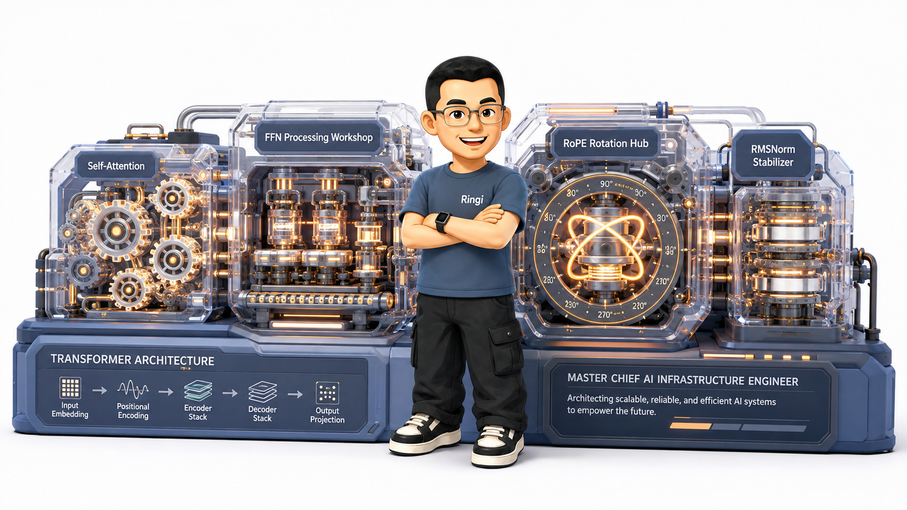
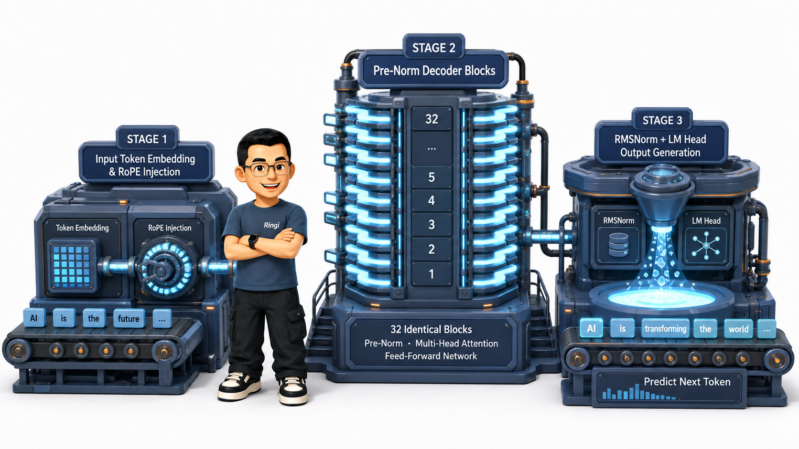
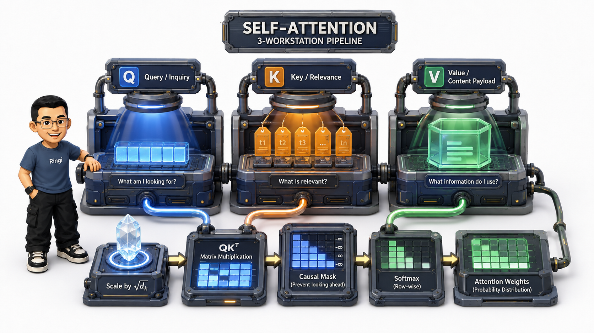
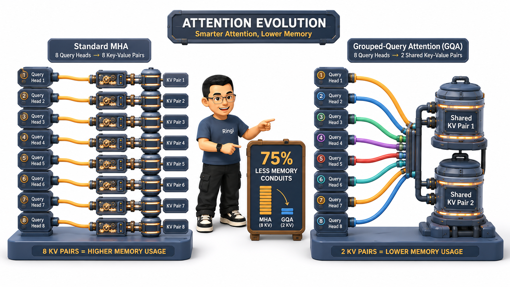
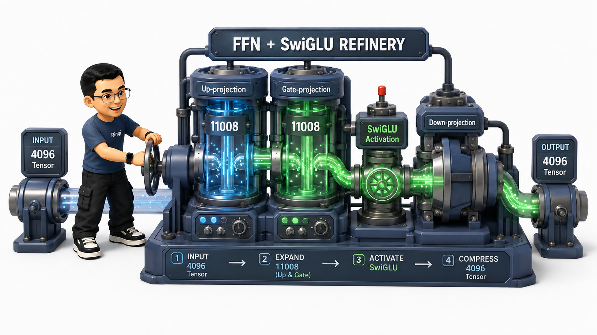
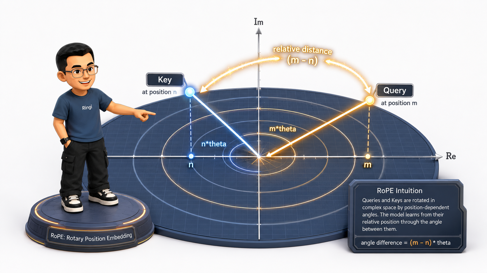
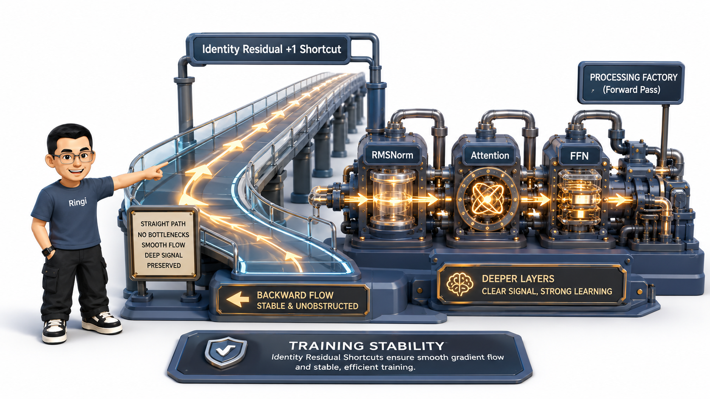
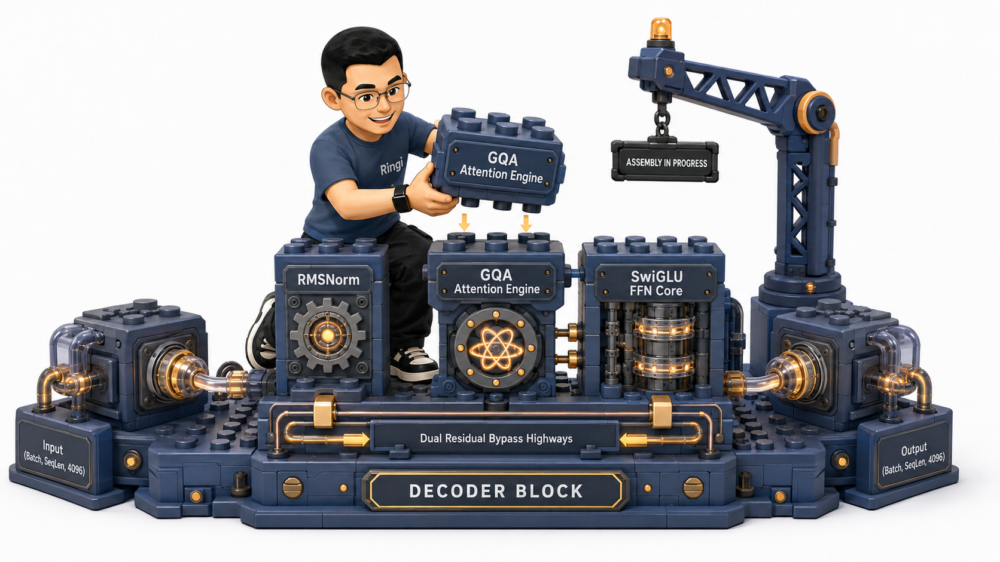
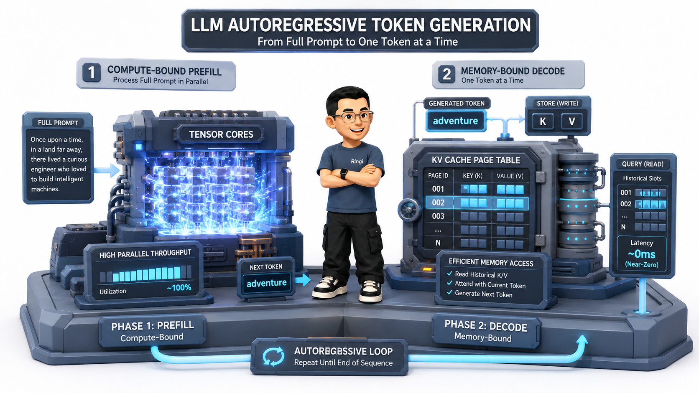

# 🏛️ 第08讲：为什么 Attention 算力没少算，FlashAttention 却能快 3 倍？——从 Decoder Block 算子图、RoPE 复数旋转到显存四账本的第一性原理

> **主讲人**：👓 **Ringi**（大厂 AI Infrastructure 工程师）  
> **所属模块**：[Module 00: 性能工程与系统前置](./README.md)  
> **篇章范式**：📐 模型架构、算法与显存建模篇（Model Architecture & Memory Ledger Paradigm）  
> **核心导读**：你手里有一张 80GB 显存的 A100，输入 4096 长度的 Prompt，做一次 Attention 矩阵乘法只需要 0.05 秒；但一旦上下文拉长到 32K，显存瞬间像决堤的海啸一样暴涨 64 倍直接 OOM 炸机！更奇怪的是：后来出现的 FlashAttention 在数学上**一次浮点运算都没少算（FLOPs 完全相同）**，为什么端到端速度却能暴涨整整 3~5 倍？  
> **Attention 真正昂贵的，到底是算力，还是慢速 HBM 显存的数据搬运？**  
> 学习 Transformer 的终极目的，绝不是死记硬背公式，而是建立起清晰的**数据流动直觉（Tensor Flow）**、**算力与显存账本（Arithmetic & Memory Ledger）** 与 **底层硬件执行心智模型（Hardware Execution Mapping）**。从前向 GEMM 矩阵乘法到反向梯度回传，从 $O(S^2)$ 的 Attention 显存海啸到 FlashAttention 的片上 SRAM 算子融合，从 MHA 到 GQA 的 KV Cache 显存瘦身，从绝对位置编码到 RoPE 的 2D 复数旋转魔术——每一个看似精妙的算法改进，背后都深刻交织着计算机体系结构的算力受限（Compute-Bound）与带宽受限（Memory-Bound）的物理博弈！  
> 本讲我们将彻底告别死板的数学堆砌，用极客大白话与手把手推导，拆透 Transformer 的每一颗齿轮与每一个张量 Shape，带你亲手白板手算出 7B/70B 模型的全部参数与显存四账本！



```text
=================================================================================================
                                   Ringi 3D 架构工坊 · 核心全景
┌───────────────────────────────────────────────────────────────────────────────────────────────┐
│                                                                                               │
│  [Prompt Tokens 输入] ──► [ Embedding Lookup 词表查找 ] ──► [ 注入 RoPE 旋转位置编码 ]         │
│                                                                        │                      │
│  ┌─────────────────────────────────────────────────────────────────────┴───────────────────┐  │
│  │ 🔁 重复堆叠 N 个标准 Transformer Decoder Blocks (Pre-Norm 架构)                          │  │
│  │                                                                                         │  │
│  │    Input 张量 (B, S, h) ──────────────────────────┐ (残差高速公路 1 直通)               │  │
│  │          │                                        │                                     │  │
│  │          ▼                                        │                                     │  │
│  │    [ RMSNorm 1: 均方根归一化 ]                    │                                     │  │
│  │          │                                        │                                     │  │
│  │          ▼                                        │                                     │  │
│  │    [ Q, K, V 投影 (3 次 GEMM) ]                   │                                     │  │
│  │          │                                        │                                     │  │
│  │          ▼                                        │                                     │  │
│  │    [ Multi-Head / GQA Causal Attention 引擎 ]    │                                     │  │
│  │    (Scale -> Masked Softmax -> Value 聚合 -> Out) │                                     │  │
│  │          │                                        │                                     │  │
│  │          ▼                                        │                                     │  │
│  │    [ 逐元素残差相加 Add 1 ] ◄─────────────────────┘                                     │  │
│  │          │                                                                              │  │
│  │          ├────────────────────────────────────────┐ (残差高速公路 2 直通)               │  │
│  │          ▼                                        │                                     │  │
│  │    [ RMSNorm 2: 均方根归一化 ]                    │                                     │  │
│  │          │                                        │                                     │  │
│  │          ▼                                        │                                     │  │
│  │    [ SwiGLU 前馈网络 FFN: Gate + Up 升维 -> Down 降维 ] (占据模型 2/3 参数量!)           │  │
│  │          │                                        │                                     │  │
│  │          ▼                                        │                                     │  │
│  │    [ 逐元素残差相加 Add 2 ] ◄─────────────────────┘                                     │  │
│  │          │                                                                              │  │
│  └──────────┼──────────────────────────────────────────────────────────────────────────────┘  │
│             ▼                                                                                 │
│  [ Final RMSNorm ] ──► [ LM Head 线性层映射 (Vocab Size) ] ──► [ Softmax / 采样预测下一个 Token ]│
│                                                                                               │
└───────────────────────────────────────────────────────────────────────────────────────────────┘
=================================================================================================
```

<!-- more -->

## 📑 目录导航

- [0. Ringi 开场：不懂 Transformer 的 AI Infra 工程师，就像闭眼调校 F1 赛车发动机](#0-ringi-开场不懂-transformer-的-ai-infra-工程师就像闭眼调校-f1-赛车发动机)
  - [0.1 汽车发动机比喻与大厂实战痛点](#01-汽车发动机比喻与大厂实战痛点)
  - [0.2 线上真实惨案：70B 模型在长文本下的显存海啸与算力坍缩](#02-线上真实惨案70b-模型在长文本下的显存海啸与算力坍缩)
  - [0.3 AI Infra 各层级技术与 Transformer 模块对应全景图](#03-ai-infra-各层级技术与-transformer-模块对应全景图)
- [1. Transformer 架构全貌与演进第一性原理](#1-transformer-架构全貌与演进第一性原理)
  - [1.1 原始 Transformer：Encoder-Decoder 架构的双向与交叉注意力](#11-原始-transformerencoder-decoder-架构的双向与交叉注意力)
  - [1.2 当前大模型统一霸主：为什么是 Decoder-only 架构？](#12-当前大模型统一霸主为什么是-decoder-only-架构)
  - [1.3 三大架构变体（Encoder-only, Encoder-Decoder, Decoder-only）深度横评](#13-三大架构变体encoder-only-encoder-decoder-decoder-only深度横评)
- [2. Self-Attention 机制与数学/算子级微观拆解](#2-self-attention-机制与数学算子级微观拆解)
  - [2.1 直觉理解：图书馆查资料与信息加权聚合](#21-直觉理解图书馆查资料与信息加权聚合)
  - [2.2 $Q, K, V$ 的物理意义：同一个 Token 的三副眼镜](#22-q-k-v-的物理意义同一个-token-的三副眼镜)
  - [2.3 6 步逐步推导与手把手数字算盘（GEMM $\to$ 打分 $\to$ 缩放 $\to$ 掩码 $\to$ Softmax $\to$ 输出）](#23-6-步逐步推导与手把手数字算盘gemm-to-打分-to-缩放-to-掩码-to-softmax-to-输出)
  - [2.4 为什么缩放因子必须除以 $\sqrt{d_k}$？方差发散与 Softmax 饱和梯度消失的数学证明](#24-为什么缩放因子必须除以-sqrtd_k方差发散与-softmax-饱和梯度消失的数学证明)
  - [2.5 为什么复杂度是 $O(S^2)$？长上下文之痛与 FlashAttention 诞生的物理必然](#25-为什么复杂度是-os2长上下文之痛与-flashattention-诞生的物理必然)
  - [2.6 Multi-Head Attention (MHA)：为什么要多头？张量并行（TP）列切与行切拆解](#26-multi-head-attention-mha为什么要多头张量并行tp列切与行切拆解)
  - [2.7 注意力架构大演进：MHA $\to$ MQA $\to$ GQA 的显存优化直觉](#27-注意力架构大演进mha-to-mqa-to-gqa-的显存优化直觉)
- [3. 前馈网络（FFN）——大模型的深度特征加工厂](#3-前馈网络ffn大模型的深度特征加工厂)
  - [3.1 角色分工：Attention 负责横向开会，FFN 负责纵向独立消化](#31-角色分工attention-负责横向开会ffn-负责纵向独立消化)
  - [3.2 升维与降维的几何本质：为什么中间维度要扩大到 $4d$ 或 $\frac{8}{3}d$？](#32-升维与降维的几何本质为什么中间维度要扩大到-4d-或-frac83d)
  - [3.3 参数量账本手算：为什么 FFN 占了全模型整整 2/3 的参数？](#33-参数量账本手算为什么-ffn-占了全模型整整-23-的参数)
  - [3.4 激活函数三代演进：ReLU $\to$ GELU $\to$ SwiGLU 门控机制深度剖析](#34-激活函数三代演进relu-to-gelu-to-swiglu-门控机制深度剖析)
- [4. 位置编码（Position Encoding）——赋予序列时空坐标](#4-位置编码position-encoding赋予序列时空坐标)
  - [4.1 为什么 Transformer 天生是个“词序脸盲”？排列等变性与绝对位置缺失](#41-为什么-transformer-天生是个词序脸盲排列等变性与绝对位置缺失)
  - [4.2 经典绝对位置编码：Sinusoidal 正余弦函数的时钟刻度模型与局限](#42-经典绝对位置编码sinusoidal-正余弦函数的时钟刻度模型与局限)
  - [4.3 现代大模型霸主：RoPE（旋转位置编码）的 2D 复数几何魔术](#43-现代大模型霸主rope旋转位置编码的-2d-复数几何魔术)
    - [4.3.1 2D 平面旋转矩阵推导](#431-2d-平面旋转矩阵推导)
    - [4.3.2 复数内积：为什么绝对位置旋转能自然涌现相对距离 $(m - n)$？](#432-复数内积为什么绝对位置旋转能自然涌现相对距离-m---n)
    - [4.3.3 RoPE 的 CUDA Kernel 实现：纯逐元素旋转与零额外显存分配](#433-rope-的-cuda-kernel-实现纯逐元素旋转与零额外显存分配)
- [5. 归一化与残差连接——深层网络的定海神针](#5-归一化与残差连接深层网络的定海神针)
  - [5.1 残差连接（Residual Connection）：梯度无损直通的高速公路](#51-残差连接residual-connection梯度无损直通的高速公路)
  - [5.2 LayerNorm vs RMSNorm：均方根归一化如何省去内存扫描提速 7%？](#52-layernorm-vs-rmsnorm均方根归一化如何省去内存扫描提速-7)
  - [5.3 Pre-Norm vs Post-Norm：数十亿美元训练稳定性之争](#53-pre-norm-vs-post-norm数十亿美元训练稳定性之争)
- [6. 完整的 Transformer Decoder Block 组装与全流程张量 Shape 流动表](#6-完整的-transformer-decoder-block-组装与全流程张量-shape-流动表)
  - [6.1 Pre-Norm Decoder Block 结构全景图与因果数据流](#61-pre-norm-decoder-block-结构全景图与因果数据流)
  - [6.2 LLaMA-2-7B 全流程张量维度逐算子追踪表（Shape, Strides, Contiguous）](#62-llama-2-7b-全流程张量维度逐算子追踪表shape-strides-contiguous)
  - [6.3 白板手算：LLaMA-2-7B 单层 202M 参数与全模型 6.74B 参数精确手算推导](#63-白板手算llama-2-7b-单层-202m-参数与全模型-674b-参数精确手算推导)
  - [6.4 静态与动态显存四账本精确推导（Weights, Gradients, AdamW 16B/param, Activations）](#64-静态与动态显存四账本精确推导weights-gradients-adamw-16bparam-activations)
- [7. 从 Transformer 到 LLM 推理：自回归生成与 KV Cache 革命](#7-从-transformer-到-llm-推理自回归生成与-kv-cache-革命)
  - [7.1 自回归生成（Autoregressive）机制与两阶段划分](#71-自回归生成autoregressive机制与两阶段划分)
  - [7.2 Prefill（Compute-Bound）vs Decode（Memory-Bound）的物理瓶颈与 Roofline 定位](#72-prefillcompute-boundvs-decodememory-bound的物理瓶颈与-roofline-定位)
  - [7.3 KV Cache 第一性原理：计算复杂度从 $O(S^2 d^2)$ 骤降至 $O(S d^2)$](#73-kv-cache-第一性原理计算复杂度从-os2-d2-骤降至-os-d2)
  - [7.4 KV Cache 显存开销公式手算（单 Token 512KB $\to$ 4K 上下文 2GB $\to$ 并发显存海啸）](#74-kv-cache-显存开销公式手算单-token-512kb-to-4k-上下文-2gb-to-并发显存海啸)
  - [7.5 vLLM PagedAttention 虚拟内存分页管理机制（物理 Block、Page Table 与碎片消除）](#75-vllm-pagedattention-虚拟内存分页管理机制物理-blockpage-table-与碎片消除)
- [8. 动手实战与代码实验室（Minimal Runnable Code）](#8-动手实战与代码实验室minimal-runnable-code)
  - [8.1 实验 1：纯 PyTorch 手写一个支持 RoPE、SwiGLU 与 GQA 的标准 Decoder Block](#81-实验-1纯-pytorch-手写一个支持-rope-swiglu-与-gqa-的标准-decoder-block)
  - [8.2 实验 2：MHA vs MQA vs GQA KV Cache 显存占用与吞吐对比测试](#82-实验-2mha-vs-mqa-vs-gqa-kv-cache-显存占用与吞吐对比测试)
  - [8.3 实验 3：自回归生成中开启 KV Cache 前后端到端耗时与算力利用率压测](#83-实验-3自回归生成中开启-kv-cache-前后端到端耗时与算力利用率压测)
  - [8.4 实验 4：简易版 PagedAttention 显存物理 Block 分配与逻辑 Page Table 映射模拟器](#84-实验-4简易版-pagedattention-显存物理-block-分配与逻辑-page-table-映射模拟器)
- [9. Ringi 避坑指南与大厂硬核经典面试题](#9-ringi-避坑指南与大厂硬核经典面试题)
  - [9.1 避坑表格（❌ 常见小白错误理解 vs ✅ 大厂 AI Infra 正确理解）](#91-避坑表格-常见小白错误理解-vs--大厂-ai-infra-正确理解)
  - [9.2 4 道大厂高频硬核面试与白板推导题（含详细推导过程、解题思考路径与标准答案）](#92-4-道大厂高频硬核面试与白板推导题含详细推导过程解题思考路径与标准答案)
- [10. Ringi 5 点核心速记口诀、自我检验清单与课后深度思考题](#10-ringi-5-点核心速记口诀自我检验清单与课后深度思考题)
  - [10.1 5 点押韵核心速记口诀](#101-5-点押韵核心速记口诀)
  - [10.2 10 条白板自我检验清单](#102-10-条白板自我检验清单)
  - [10.3 3 道高阶开放式课后思考题（含极限 Corner Case）](#103-3-道高阶开放式课后思考题含极限-corner-case)
- [11. 📚 参考资料与经典开源实现源码指引](#11--参考资料与经典开源实现源码指引)

---

# 0. Ringi 开场：不懂 Transformer 的 AI Infra 工程师，就像闭眼调校 F1 赛车发动机

## 0.1 汽车发动机比喻与大厂实战痛点

如果你立志成为一名优秀的 **AI Infrastructure（AI 基础设施）工程师**——无论你是在底层死磕 CUDA C++ / Triton 算子编写、在千卡集群中调试 Megatron-LM / DeepSpeed 分布式并行流水线，还是在负责 vLLM / TensorRT-LLM 高并发推理服务的显存架构设计——你天天打交道的核心工作对象都是同一个东西：**Transformer 模型**。

这就像赛车工程师必须精通 F1 赛车内燃机的机械构造一样：

- 你不需要每天自己去重新画图发明一个全新的气缸结构（那是顶级算法科学家和架构师的工作）；
- 但你必须对**活塞怎么往复运动、曲轴转速多少、火花塞何时点火、高压油泵的供油压力曲线**了如指掌！
- 如果你连 $Q, K, V$ 投影矩阵在显存中的步长 Strides 都不清楚，连注意力矩阵为什么在长文本下会导致显存爆炸都无法手算，那你写出来的 CUDA Kernel 必定频频遭遇非合并访存（Uncoalesced Access）和内存踩踏，调出来的分布式训练系统也必定会在几十个节点处发生严重的通信阻塞（Pipeline Bubble）。

---

## 0.2 线上真实惨案：70B 模型在长文本下的显存海啸与算力坍缩

在大厂参与千亿大模型预训练与生产推理集群搭建时，我曾见过无数起因对 Transformer 底层物理机制理解不清而引发的惨烈事故：

- **惨案 A（训练端 OOM 爆炸）**：算法同学在单台 8 卡 A100-80GB 服务器上训练 7B 模型，静态权重（FP16）只有 14GB，梯度 14GB，ZeRO-1 优化器分摊后只要 10.5GB，看似总共只要 38.5GB 显存。然而当他把 Sequence Length 从 2048 调到 8192 时，第 1 个 Step 前向尚未走完，显存直接飙升突破 80GB 瞬间 OOM！**原因**：未开启重计算与 FlashAttention，多层 Attention 产生的 $O(S^2)$ 激活值（Activation）在显存中扣留了高达 50GB 以上的中间张量！
- **惨案 B（推理端算力崩塌）**：推理业务上线 LLaMA-70B 服务，在用户输入长 Prompt（Prefill 阶段）时，GPU 利用率高达 95%，速度飞快；然而一旦进入逐字吐词（Decode 阶段），单卡的 GPU 利用率瞬间暴跌至 **8%~15%**，整个系统 85% 以上的时间全在等待 HBM 显存带宽搬运，算力严重饥饿！

要彻底根治这些系统瓶颈，唯有从第一性原理出发，把 Transformer 的算子执行图拆到最微观的物理分子级。

---

## 0.3 AI Infra 各层级技术与 Transformer 模块对应全景图

AI Infra 领域每一项声名赫赫的硬核优化技术，都能在 Transformer 架构中找到它精确作用的物理节点与数学算子：

| AI Infra 系统技术层级 | 核心工程任务与优化手段                | 对应的 Transformer 模块与物理第一性原理                                                  |
| :-------------------- | :------------------------------------ | :--------------------------------------------------------------------------------------- |
| **CUDA 算子优化**     | FlashAttention-1/2/3、CUTLASS GEMM    | Self-Attention 中的 $Q K^T$ 打分与 $A V$ 加权大矩阵乘法                                  |
| **CUDA 算子优化**     | Fused Softmax、Online Softmax         | Attention 内部指数求和与归一化（消灭 HBM 读写 IO）                                       |
| **CUDA 算子优化**     | RMSNorm 算子融合与向量化加载 `float4` | 每个 Block 输入与输出处的特征均方根归一化                                                |
| **分布式训练 (TP)**   | 张量并行（Tensor Parallelism）        | Attention 的多头（Multi-Head）列切/行切与 FFN 矩阵切分                                   |
| **分布式训练 (PP)**   | 流水线并行（Pipeline Parallelism）    | 模型中 $N$ 层标准 Decoder Block 的跨卡逐层流水线编排                                     |
| **分布式训练 (DP)**   | ZeRO-1/2/3、PyTorch FSDP 显存分片     | 权重矩阵（$W_Q, W_K, W_V, W_O, W_{gate}, W_{up}, W_{down}$）的参数、梯度与优化器状态分摊 |
| **长文本训练**        | Activation Checkpointing (重计算)     | 剪枝并重新计算 Attention/FFN 中间激活张量，显存 $O(L) \to O(1)$                          |
| **高性能 Serving**    | PagedAttention (vLLM)、KV Cache 分页  | 自回归生成过程中每一轮迭代追加的历史 $K, V$ 显存虚拟分页管理                             |
| **量化压缩加速**      | FP8 / INT4 GEMM、SmoothQuant          | 权重矩阵与 KV Cache 的位宽压缩与 Tensor Core 混合精度计算                                |
| **系统架构调度**      | Prefill / Decode 分离架构（PD 解耦）  | 解决长上下文 Compute-Bound 与逐 Token Decode Memory-Bound 的天然硬件冲突                 |

---

# 1. Transformer 架构全貌与演进第一性原理

## 1.1 原始 Transformer：Encoder-Decoder 架构的双向与交叉注意力

2017 年 Google 团队在划时代论文 _《Attention Is All You Need》_ 中提出了最初的 **Encoder-Decoder（编码器-解码器）** 结构：

- **Encoder（编码器）**：采用**双向全向自注意力（Bidirectional Attention）**。对于输入的句子，每一个 Token 都可以同时看到句子中位于自己前面和后面的所有 Token，核心职能是**高维语义特征的抽取与理解**；
- **Decoder（解码器）**：包含两层注意力——**掩码因果注意力（Masked Causal Attention）**（确保生成第 $i$ 个词时只能看到前 $i-1$ 个词）+ **交叉注意力（Cross-Attention）**（以 Decoder 自身的中间特征作为 Query，向 Encoder 的输出索要 Key 和 Value），核心职能是**序列到序列的条件概率生成（Seq2Seq）**。

---

## 1.2 当前大模型统一霸主：为什么是 Decoder-only 架构？

从 OpenAI 的 GPT 系列，到 Meta 的 LLaMA、Mistral，再到国内的 Qwen（千问）与 DeepSeek，现代大语言模型几乎 **100% 统一采用了 Decoder-only 架构**。



> 💡 **Ringi 第一性原理思考：为什么 Decoder-only 能横扫整个 AI 工业界？**
>
> 1. **统一的自回归训练范式（Next-Token Prediction）**：  
>    在现代大模型哲学中，人类的所有智能任务（文本翻译、代码编写、数学推理、逻辑对话、甚至多模态视觉生成）本质上都可以被统一表达为**“给定上文，预测下一个最具概率的 Token”**。Decoder-only 架构天然契合因果掩码生成，无需像 Encoder-Decoder 那样在不同任务间做复杂的编码器-解码器交互协调；
> 2. **工程实现与分布式调度的极致优雅**：  
>    在 Decoder-only 架构中，全网只有一种标准统一的 **Decoder Block**。这意味着：
>    - 显存分配器无需管理两套异构的 KV 缓存池；
>    - Megatron-LM 的张量并行切分规则在所有层完全一致；
>    - 流水线并行（PP）各个 Stage 的计算负载能够做到完美的对称均衡，绝不会出现 Encoder 与 Decoder 算力倾斜导致的严重气泡等待！

### 经典三段式数据流动流程：

1. **输入阶段（Input Stage）**：
   $$
   \text{Prompt Tokens} \longrightarrow \text{Embedding Lookup (词表查找)} \longrightarrow \text{注入位置编码 (如 RoPE)}
   $$
2. **核心堆叠阶段（Repeated $N$ Blocks）**：
   $$
   X_{l+1} = X_l + \text{Self-Attention}(\text{Norm}(X_l)) + \text{FFN}(\text{Norm}(\dots))
   $$
3. **输出阶段（Output Stage）**：
   $$
   \text{Final Norm} \longrightarrow \text{LM Head 线性映射} \longrightarrow \text{Logits} \longrightarrow \text{Softmax 采样预测}
   $$

---

## 1.3 三大架构变体（Encoder-only, Encoder-Decoder, Decoder-only）深度横评

| 架构类型            | 代表模型                     | 注意力掩码机制                                          | 典型应用领域                                      | 工业界优缺点评述                                                                           |
| :------------------ | :--------------------------- | :------------------------------------------------------ | :------------------------------------------------ | :----------------------------------------------------------------------------------------- |
| **Encoder-only**    | BERT, RoBERTa                | **全双向无掩码**（每个 Token 可见全句任意位置）         | 文本分类、BERT 掩码填空、稠密向量检索 (Embedding) | 擅长全局特征抽取；但无法自然高效地进行自回归长文本生成。                                   |
| **Encoder-Decoder** | 原始 Transformer, T5, BART   | **Encoder 全双向 + Decoder 因果掩码 + Cross-Attention** | 传统机器翻译、文本摘要提取                        | 适合明确分为“输入端”与“输出端”的任务；但结构繁琐，需维护两套 KV 显存池，Serving 调度沉重。 |
| **Decoder-only**    | GPT-4, LLaMA, Qwen, DeepSeek | **纯因果下三角掩码**（每个 Token 仅可见自己及历史前文） | 通用对话、代码生成、复杂推理、所有主流大模型      | **统一所有 NLP 任务，极简对称结构，KV Cache 调度极致高效。**                               |

---

# 2. Self-Attention 机制与数学/算子级微观拆解

Self-Attention（自注意力机制）是 Transformer 最核心的计算引擎，也是算力消耗与显存占用的最大来源。

## 2.1 直觉理解：图书馆查资料与信息加权聚合

$$
\boxed{\text{算谁相关（注意力权重矩阵）} \longrightarrow \text{按相关度比例加权拿取有用信息}}
$$

我们先用一个生动的生活例子建立物理直觉：
假设你是一位正在写论文的研究员，走进了一座巨大的图书馆：

- 你手里拿着一张写着你研究课题的借书清单——这就是 **Query（提问/需求）**；
- 图书馆里每一本书的书脊上都贴着分类索引标签（如“机器学习”、“操作系统”、“经济学”）——这就是 **Key（索引标牌）**；
- 每一本书里面的具体章节内容和核心知识——这就是 **Value（真正的内容载荷）**。

你拿着清单（Query）去挨个比对书架上的索引标签（Key），计算相关度打分；对于相关度高达 90% 的专业书，你大量提取其内容（Value）；对于相关度只有 1% 的无关书籍，你几乎忽略其内容。最终你大脑中形成的知识综述，就是所有书籍 Value 按照相关度加权融合后的产物！

---

## 2.2 $Q, K, V$ 的物理意义：同一个 Token 的三副眼镜

在 Self-Attention 中，输入序列中的每个 Token 本质上都通过三组不同的可学习线性权重矩阵，同时被赋予了三种截然不同的身份：



- **Query ($Q$)**：**提问者身份**，发出检索需求（例如：_“我是动词‘吃’，我在找我的主语和宾语是谁？”_）；
- **Key ($K$)**：**索引标牌身份**，用于被别人的 Query 检索匹配（例如：_“我是名词‘苹果’，我是可以被吃的水果”_）；
- **Value ($V$)**：**真实信息载荷**，匹配成功后贡献给其他 Token 的实际特征（例如：_“提供关于‘苹果’的完整语义向量”_）。

---

## 2.3 6 步逐步推导与手把手数字算盘（GEMM $\to$ 打分 $\to$ 缩放 $\to$ 掩码 $\to$ Softmax $\to$ 输出）

设输入张量为 $X \in \mathbb{R}^{B \times S \times d}$，其中 $B$ 为批大小（Batch Size），$S$ 为序列长度（Sequence Length），$d$ 为隐藏层维度（Hidden Dimension）。为了便于小白理解，我们暂时省略 Batch 维度，考察单个序列 $X \in \mathbb{R}^{S \times d}$。

### 步骤 1：线性投影生成 $Q, K, V$（3 次标准 GEMM）

通过三个参数矩阵 $W_Q, W_K, W_V \in \mathbb{R}^{d \times d}$ 将输入投影为三组向量：

$$
Q = X W_Q, \quad K = X W_K, \quad V = X W_V
$$

- **Tensor Shape**：$X(S, d) \times W(d, d) \to Q, K, V$ 形状均为 $(S, d)$；
- **FLOPs 计算量**：每个投影执行一次标准矩阵乘法，单次 GEMM 计算量为 $2 S d^2$ FLOPs，三次总计为 **$6 S d^2$ FLOPs**；
- **GPU 机器底层**：由 cuBLAS / CUTLASS 驱动的 Tensor Core 极速矩阵乘法内核执行。

---

### 步骤 2：计算原始注意力打分矩阵（$Q K^T$）

计算序列中任意两个 Token 之间的点积相似度：

$$
S_{\text{raw}} = Q K^T \in \mathbb{R}^{S \times S}
$$

- **Tensor Shape**：$Q(S, d) \times K^T(d, S) \to S_{\text{raw}}(S, S)$；
- **物理意义**：$S_{\text{raw}}[i][j]$ 表示第 $i$ 个 Token 的 Query 与第 $j$ 个 Token 的 Key 之间的向量内积。

#### 🔢 手把手极简数字算盘：

设某个 Token 的 $q = [1.0, 2.0]$，另一个 Token 的 $k = [3.0, 4.0]$，则点积为：

$$
q \cdot k^T = 1.0 \times 3.0 + 2.0 \times 4.0 = 3.0 + 8.0 = 11.0
$$

两向量夹角越小、方向越一致，点积越大，代表注意力打分越高。

---

### 步骤 3：缩放因子（Scaling）——为什么必须除以 $\sqrt{d_k}$？

$$
S_{\text{scaled}} = \frac{Q K^T}{\sqrt{d_k}} \in \mathbb{R}^{S \times S}
$$

其中 $d_k$ 为单个注意力头的维度（如 $d_k = 128$）。

---

### 步骤 4：因果掩码（Causal Masking）与 Softmax 归一化

为了保证模型在自回归生成时不能“偷看未来的词”，必须加入上三角掩码矩阵 $\text{Mask}$：

$$
\text{Mask}[i][j] = \begin{cases} 0, & \text{if } j \le i \text{ (历史前文与自身，允许可见)} \\ -\infty, & \text{if } j > i \text{ (未来词，严禁可见)} \end{cases}
$$

随后对每一行执行 Softmax 归一化：

$$
A = \text{softmax}\left( \frac{Q K^T}{\sqrt{d_k}} + \text{Mask} \right) \in \mathbb{R}^{S \times S}
$$

- 因为 $e^{-\infty} = 0$，未来位置在 Softmax 后的注意力权重严格为 **0**；
- 矩阵 $A$ 的每一行所有元素非负且和严格等于 1：$\sum_{j=1}^S A[i][j] = 1.0$。

---

### 步骤 5：加权求和（用注意力概率聚合 Value 特征）

$$
O_{\text{attn}} = A \cdot V \in \mathbb{R}^{S \times d}
$$

- **Tensor Shape**：$A(S, S) \times V(S, d) \to O_{\text{attn}}(S, d)$；
- **物理意义**：第 $i$ 个 Token 的输出向量，就是整篇序列中所有 Token 的 $V$ 按照第 $i$ 行权重概率分布 $A[i]$ 进行加权线性求和。

---

### 步骤 6：输出线性投影（Output Projection）

$$
\text{Output} = O_{\text{attn}} \cdot W_O \in \mathbb{R}^{S \times d}
$$

通过可学习参数矩阵 $W_O \in \mathbb{R}^{d \times d}$ 对所有头聚合的信息进行最终的特征融合整理。

---

### 🏆 终极标准自注意力公式

$$
\boxed{\text{Attention}(Q, K, V) = \text{softmax}\left(\frac{Q K^T}{\sqrt{d_k}} + \text{Mask}\right) V}
$$

---

## 2.4 为什么缩放因子必须除以 $\sqrt{d_k}$？方差发散与 Softmax 饱和梯度消失的数学证明

很多同学在面试中经常被问到：“为什么 Attention 公式里一定要除以 $\sqrt{d_k}$，除以 $d_k$ 行不行？不除行不行？”

我们给出严谨的数学推导与物理第一性原理：

1. **方差推导（Variance Derivation）**：  
   假设向量 $q$ 和 $k$ 的每个分量 $q_i, k_i$ 都是均值为 0、方差为 1 的独立同分布随机变量：
   $$
   \mathbb{E}[q_i] = 0, \quad \text{Var}(q_i) = 1; \quad \mathbb{E}[k_i] = 0, \quad \text{Var}(k_i) = 1
   $$
   则两向量点积为：
   $$
   Z = q \cdot k = \sum_{i=1}^{d_k} q_i k_i
   $$
   根据独立随机变量的期望与方差性质：
   $$
   \mathbb{E}[q_i k_i] = \mathbb{E}[q_i] \mathbb{E}[k_i] = 0
   $$
   $$
   \text{Var}(q_i k_i) = \mathbb{E}[(q_i k_i)^2] - (\mathbb{E}[q_i k_i])^2 = \text{Var}(q_i) \text{Var}(k_i) = 1 \times 1 = 1
   $$
   对 $d_k$ 个独立分量求和，点积 $Z$ 的方差为：
   $$
   \text{Var}(Z) = \text{Var}\left(\sum_{i=1}^{d_k} q_i k_i\right) = \sum_{i=1}^{d_k} \text{Var}(q_i k_i) = d_k
   $$
   **标准差（Standard Deviation）为 $\sqrt{d_k}$！**
2. **后果：Softmax 饱和与梯度消失**：  
   在现代大模型中，单头维度通常为 $d_k = 128$。如果不除以 $\sqrt{128} \approx 11.31$，点积数值的标准差就会放大到 11 以上，导致打分矩阵中出现极大的正数（如 $+50$）和极小的负数（如 $-50$）；  
   当输入极大时，Softmax 函数输出会被极端推向 **one-hot 饱和区**（最大值趋近于 1.0，其余全部趋近于 0.0）；  
   而在饱和区，Softmax 的导数 $\frac{\partial \text{Softmax}(z_i)}{\partial z_j} = S_i (\delta_{ij} - S_j) \approx 1 \times (1 - 1) = 0$！**反向传播梯度瞬间衰减归零（Gradient Vanishing），模型参数彻底停止学习！**
3. **结论**：除以 $\sqrt{d_k}$ 将点积分布重新缩放回均值为 0、方差为 1 的平稳区间，确保 Softmax 处于对输入变化最敏感、梯度流动最健康的线性激活带。

---

## 2.5 为什么复杂度是 $O(S^2)$？长上下文之痛与 FlashAttention 诞生的物理必然

从矩阵计算维度可以清晰推导出标准 Self-Attention 的算力与显存瓶颈：

```text
Q (S × d) × K^T (d × S) ──► S_raw (S × S 注意力矩阵) ──► Softmax (S × S) ──► × V (S × d)
```

1. **计算复杂度**：$O(S^2 \cdot d)$，因为生成 $S \times S$ 个分数，每个分数需要 $d$ 次乘加；
2. **显存存储复杂度**：$O(S^2)$，因为在标准 PyTorch 实现中，必须在 GPU 显存（HBM）中显式分配大小为 $(B, h, S, S)$ 的临时中间张量，用于保存 Softmax 前后的打分权重。

### 💥 长文本下的显存海啸手算：

当序列长度 $S$ 从 2K 扩展到 128K（增长 64 倍）时：

$$
\left(\frac{128\text{K}}{2\text{K}}\right)^2 = 64^2 = \mathbf{4096\text{ 倍}}!
$$

对于一个 32 头、Batch Size=1 的模型，仅仅单层存储一个 FP16 注意力矩阵需要的显存为：

$$
1\times 32 \times 128000 \times 128000 \times 2\text{ Bytes} \approx \mathbf{1.048\text{ TB}} \quad (\gg 80\text{GB 显存物理极限!})
$$

> 🌟 **FlashAttention 的第一性原理破局**：  
> 标准 Attention 之所以爆显存，是因为它频繁地将 $S \times S$ 的巨大矩阵在慢速 HBM（显存）与快速片上 SRAM（共享内存）之间来回搬运读写。  
> **FlashAttention（Tri Dao et al.）** 采用了 **Tiling（分块分片）** 算法与 **Online Softmax（在线动态归一化）** 技术，在片上 SRAM 内直接完成小分块的 Softmax 累加与 Value 乘法，**完全不需要在 HBM 中物化存储 $S \times S$ 的全局矩阵**，将 HBM 访存 IO 从 $O(S^2)$ 骤降为 $O(S)$，既拯救了显存，又大幅消除了访存延迟！

---

## 2.6 Multi-Head Attention (MHA)：为什么要多头？张量并行（TP）列切与行切拆解

如果只用单头 Attention，模型只能从一种单一的加权视角去观察上下文。  
**Multi-Head Attention（MHA）** 将隐藏维度 $d$ 均分为 $h$ 个独立的头，每个头的维度为 $d_k = d / h$：

$$
\text{MHA}(Q, K, V) = \text{Concat}(\text{head}_1, \dots, \text{head}_h) W_O
$$

其中 $\text{head}_i = \text{Attention}(Q W_Q^i, K W_K^i, V W_V^i)$。



### 🛠️ 大厂张量并行（Megatron-LM Tensor Parallelism）核心拆解：

Multi-Head Attention 与 GPU 分布式张量并行天然契合：

1. **列并行切分（Column Parallel GEMM）**：  
   将 $W_Q, W_K, W_V$ 按照注意力头数沿**列方向（Column）**切分到 $P$ 张 GPU 上（每张卡分得 $h / P$ 个头），各卡独立计算局部的 $Q_i, K_i, V_i$ 及局部 Attention 输出；
2. **行并行切分（Row Parallel GEMM）**：  
   将输出投影矩阵 $W_O$ 沿**行方向（Row）**切分，各卡用局部的 Attention 输出乘以局部的 $W_O^i$；
3. **通信汇总（AllReduce）**：  
   根据矩阵乘法分配律：$\text{Output} = \sum_{i=1}^P (\text{head}_i \cdot W_O^i)$，最后只需在多卡之间执行一次极快的集合通信 **`AllReduce(Sum)`**，即可完美还原全量输出，通信开销达到理论最小！

---

## 2.7 注意力架构大演进：MHA $\to$ MQA $\to$ GQA 的显存优化直觉

为了在 LLM 推理阶段大幅削减 KV Cache 占用的显存，业界经历了一场壮丽的三代架构演化：

```text
[ MHA: 多头注意力 ]               [ GQA: 分组查询注意力 ]              [ MQA: 多查询注意力 ]
Q 头: 8 个  K/V 头: 8 个          Q 头: 8 个  K/V 头: 2 个 (4:1 分组)    Q 头: 8 个  K/V 头: 1 个 (8:1 共享)
Q1 Q2 Q3 Q4 Q5 Q6 Q7 Q8          Q1 Q2 Q3 Q4  Q5 Q6 Q7 Q8          Q1 Q2 Q3 Q4 Q5 Q6 Q7 Q8
 │  │  │  │  │  │  │  │            \  /  \  /    \  /  \  /            \  \  \  \  /  /  /  /
K1 K2 K3 K4 K5 K6 K7 K8              KV 1          KV 2                         KV 1
(KV Cache 显存 100%)              (KV Cache 显存 25%, 性能无损!)        (KV Cache 显存 12.5%, 精度微损)
```

1. **MHA (Multi-Head Attention)**：$Q, K, V$ 头数完全相同（如 32 个 $Q$ 头对应 32 对 $K, V$）。表达能力最强，但推理时 KV Cache 显存开销巨大；
2. **MQA (Multi-Query Attention, Shazeer 2019)**：所有 $Q$ 头**强行共享同 1 对 $K, V$**。KV Cache 显存暴降至 $1/h$（降至 1/32），但由于强制压缩了键值特征空间，复杂任务下的模型表达精度略有下滑；
3. **GQA (Grouped-Query Attention, Ainslie 2023)**：**完美的折中方案！** 将 $Q$ 头分为 $G$ 个组（如 32 个 $Q$ 头分为 8 组，每组 4 个 $Q$ 头共享 1 对 $K, V$）。KV Cache 显存直接削减 75%~87.5%，且模型推理能力几乎与 MHA 100% 持平，已成为 LLaMA-2-70B、LLaMA-3、Mistral、Qwen 等现代开源大模型的**绝对统一标配**！

---

# 3. 前馈网络（FFN）——大模型的深度特征加工厂

## 3.1 角色分工：Attention 负责横向开会，FFN 负责纵向独立消化

如果说 Attention 机制是全班同学坐在一起开圆桌研讨会（Token 之间跨位置横向交互信息），那么 **FFN（Feed-Forward Network）就是研讨会结束后，每个人回到自己的独立工位上闭门消化吸收、提取深层概念记忆的加工厂**。

- **Attention**：发生 **Token 与 Token 之间的空间特征融合（跨序列维度）**；
- **FFN**：对 **每个 Token 的特征向量做独立的逐点非线性高阶映射（Point-wise）**，各个位置的 Token 之间完全独立、互不干扰。

---

## 3.2 升维与降维的几何本质：为什么中间维度要扩大到 $4d$ 或 $\frac{8}{3}d$？

标准 FFN 由两层全连接组成：

$$
\text{FFN}(x) = W_2 \cdot \text{activation}(W_1 x + b_1) + b_2
$$



> 💡 **Ringi 几何空间直觉：为什么非要先升维再降维？**  
> 设想你在低维平面（如 2D）上有许多相互交织缠绕、无法用直线切分的数据点。当你把这些数据通过升维矩阵投射到高维空间（如 4D 或 8D）后，原本在低维粘连在一起的语义概念就能在一个更广阔的几何自由度里被非线性超平面轻松剥离解耦；经过激活函数提取有效特征后，再通过降维矩阵压缩回原始维度。

---

## 3.3 参数量账本手算：为什么 FFN 占了全模型整整 2/3 的参数？

我们以隐藏维度 $d = 4096$ 为例，白板手算单层 Transformer Block 的参数分布：

1. **Attention 模块参数量**：
   - 包含 $W_Q, W_K, W_V, W_O$ 四个方阵，每个尺寸为 $(4096, 4096)$；
   - 参数量 $= 4 \times 4096 \times 4096 = 4 \times 16,777,216 \approx \mathbf{67.11\text{ M}}$（占单层约 **33%**）；
2. **SwiGLU FFN 模块参数量**：
   - 采用现代 SwiGLU 结构，中间隐藏维度通常设置为 $d_{\text{ff}} = \frac{8}{3} d \approx 11008$；
   - 包含 $W_{\text{gate}}, W_{\text{up}}, W_{\text{down}}$ 三个矩阵：
     - $W_{\text{gate}} \in \mathbb{R}^{4096 \times 11008} \implies 45.09\text{ M}$
     - $W_{\text{up}} \in \mathbb{R}^{4096 \times 11008} \implies 45.09\text{ M}$
     - $W_{\text{down}} \in \mathbb{R}^{11008 \times 4096} \implies 45.09\text{ M}$
   - FFN 参数量总计 $= 3 \times 45.09\text{ M} \approx \mathbf{135.27\text{ M}}$（占单层整整 **67%**！）；
3. **结论**：**在大语言模型中，整整三分之二（67%）的知识与参数量都储存在 FFN 模块中！** 这也是为什么 MoE（混合专家模型）优化专门针对 FFN 进行专家切分。

---

## 3.4 激活函数三代演进：ReLU $\to$ GELU $\to$ SwiGLU 门控机制深度剖析

```text
[ 第一代: ReLU ]                 [ 第二代: GELU ]                 [ 第三代: SwiGLU 门控机制 ]
f(x) = max(0, x)                 f(x) = x * P(X <= x)             f(x) = Swish(x * W_gate) ⊙ (x * W_up)
硬截断，负半轴死神经元           平滑高斯概率放行                 双通道：一个负责内容，一个负责门控开关！
```

1. **第一代：ReLU**
   $$
   \text{ReLU}(x) = \max(0, x)
   $$
   简单极速，但在 $x < 0$ 时导数严格为 0，深层网络中容易发生大面积神经元永久坏死（Dying ReLU）；
2. **第二代：GELU（高斯误差线性单元，GPT-2/3、BERT 标配）**
   $$
   \text{GELU}(x) = x \cdot \Phi(x) = x \cdot P(X \le x), \quad X \sim \mathcal{N}(0, 1)
   $$
   引入了概率平滑思想，输入越小被抑制的概率越大，但保留微弱梯度，训练平稳；
3. **第三代：SwiGLU（门控线性单元，LLaMA、Qwen、DeepSeek 标配）**
   $$
   \text{SwiGLU}(x) = \left( \text{Swish}(x W_{\text{gate}}) \odot (x W_{\text{up}}) \right) W_{\text{down}}
   $$
   其中 $\text{Swish}(z) = z \cdot \sigma(\beta z)$，$\odot$ 为逐元素哈达玛积（Hadamard Product）。
   - **第一性原理优势**：引入了 **双通道门控（Gating）** 机制。$W_{\text{up}}$ 负责生成纯粹的特征内容，而 $W_{\text{gate}}$ 负责动态学习一个 $0 \sim 1$ 的门控系数，精准控制每个通道信息的通过率，非线性表达能力出现质的飞跃！

---

# 4. 位置编码（Position Encoding）——赋予序列时空坐标

## 4.1 为什么 Transformer 天生是个“词序脸盲”？排列等变性与绝对位置缺失

回顾 Self-Attention 的核心计算：$S = Q K^T$。  
如果我们把输入句子 `张三 借了 李四 一百块` 彻底打乱成 `李四 借了 张三 一百块`：

- 因为矩阵乘法是逐行逐列的点积，打乱输入行顺序，输出的注意力分数矩阵仅仅是对应地交换了行和列；
- 数学上称之为 **排列等变性（Permutation Equivariance）**。
- **如果不人为注入位置信息，Transformer 根本无法区分谁是借钱的人，谁是被借钱的人！**

---

## 4.2 经典绝对位置编码：Sinusoidal 正余弦函数的时钟刻度模型与局限

2017 年原始 Transformer 使用正余弦固定绝对位置编码（Sinusoidal Position Encoding）：

$$
\begin{aligned}
\text{PE}_{(\text{pos}, 2i)} &= \sin\left(\frac{\text{pos}}{10000^{2i / d}}\right) \\
\text{PE}_{(\text{pos}, 2i+1)} &= \cos\left(\frac{\text{pos}}{10000^{2i / d}}\right)
\end{aligned}
$$

- **时钟直觉**：低维分量变化极快（对应“秒针”），高维分量变化极慢（对应“时针”），组合起来构成每个位置唯一的二进制式时空指纹；
- **致命缺陷**：直接将 $\text{PE}$ 加到输入 Embedding 上，随着网络层数加深，位置信号会被后续的矩阵乘法严重稀释冲淡，且在处理超出训练长度的外推（Extrapolation）时表现极其糟糕。

---

## 4.3 现代大模型霸主：RoPE（旋转位置编码）的 2D 复数几何魔术

由苏剑林等提出的 **RoPE（Rotary Position Embedding）**，是当今全世界所有主流开源与商业大模型（LLaMA-1/2/3, Mistral, Qwen, DeepSeek 等）的**唯一绝对统一标准**。



### 4.3.1 2D 平面旋转矩阵推导

RoPE 不在 Embedding 处做任何加法，而是**在每个 Attention Head 计算 $Q, K$ 点积前，将向量每相邻两个维度作为一个 2D 平面坐标，按照其所处的 Token 绝对位置角度进行逆时针旋转**！

设二维向量 $q = [q_0, q_1]^T$，在位置 $m$ 处的旋转角度为 $m \theta$，旋转矩阵为：

$$
\mathcal{R}_{\Theta, m}^{2d} = \begin{bmatrix} \cos(m\theta) & -\sin(m\theta) \\ \sin(m\theta) & \cos(m\theta) \end{bmatrix}
$$

旋转后的 Query 向量为：

$$
\tilde{q}_m = \mathcal{R}_{\Theta, m}^{2d} \begin{bmatrix} q_0 \\ q_1 \end{bmatrix} = \begin{bmatrix} q_0 \cos(m\theta) - q_1 \sin(m\theta) \\ q_0 \sin(m\theta) + q_1 \cos(m\theta) \end{bmatrix}
$$

---

### 4.3.2 复数内积：为什么绝对位置旋转能自然涌现相对距离 $(m - n)$？

这是 RoPE 最惊艳的数学之美！将 2D 向量视为复数：$q = q_0 + i q_1 = r_q e^{i \phi_q}$。  
在位置 $m$ 旋转后变为：$\tilde{q}_m = q \cdot e^{i m \theta}$；同样在位置 $n$ 处的 Key 旋转后变为：$\tilde{k}_n = k \cdot e^{i n \theta}$。

当它们计算注意力打分点积时（对应复数共轭内积 $\text{Re}(\tilde{q}_m \tilde{k}_n^*)$）：

$$
\langle \tilde{q}_m, \tilde{k}_n \rangle = \text{Re}\left( (q e^{i m \theta}) (k e^{i n \theta})^* \right) = \text{Re}\left( q k^* e^{i (m - n) \theta} \right)
$$

看到了吗？！**绝对位置坐标 $m$ 和 $n$ 在相乘的瞬间彻底消失了，留下的相位角严格等于两者的相对距离 $(m - n)$！**

> 📌 **Ringi 工程师三问闭环**：
>
> - **为什么语义更好**：自然语言中，“词 A 与词 B 距离为 2”的相对语法关系，远比“词 A 位于整本书第 5328 位”的绝对坐标重要千百倍；
> - **长文本外推拓展**：在做长上下文拓展（如从 4K 扩到 128K）时，只需对基频 $\theta$ 做位置插值（PI）或 YaRN 缩放，即可无损拓展！

---

### 4.3.3 RoPE 的 CUDA Kernel 实现：纯逐元素旋转与零额外显存分配

在 GPU 底层工程实现中，RoPE 不需要像传统位置编码那样开辟巨大的权重矩阵：

- 它是一个纯粹的 **逐元素变换（Element-wise Operation）**；
- 在 PyTorch / Triton 中，通常将 RoPE 与前面的 QKV GEMM 或后面的 FlashAttention 直接做 **Kernel Fusion（算子融合）**，向量在片上寄存器内部顺手旋转完毕，**不产生任何 HBM 读写和显存分配**！

---

# 5. 归一化与残差连接——深层网络的定海神针

## 5.1 残差连接（Residual Connection）：梯度无损直通的高速公路



数学形式极简：

$$
y = x + \mathcal{F}(x)
$$

### 为什么大模型能堆叠 100 层而不退化？

对残差公式求反向传播导数：

$$
\frac{\partial y}{\partial x} = 1 + \frac{\partial \mathcal{F}(x)}{\partial x}
$$

注意那个恒等项 **$+1$**！无论子层网络 $\mathcal{F}(x)$ 的权重矩阵被训练得多小、导数多么接近 0，梯度都可以沿着主干道无损、不衰减地一直回传至最底层的 Embedding 层，从根本上消除了深层网络的梯度弥散（Vanishing Gradient）。

---

## 5.2 LayerNorm vs RMSNorm：均方根归一化如何省去内存扫描提速 7%？

1. **传统 LayerNorm（带均值与方差）**：
   $$
   \text{LN}(x) = \frac{x - \mu}{\sqrt{\sigma^2 + \epsilon}} \odot \gamma + \beta, \quad \mu = \frac{1}{d}\sum_{i=1}^d x_i, \quad \sigma^2 = \frac{1}{d}\sum_{i=1}^d (x_i - \mu)^2
   $$
   缺点：计算 $\mu$ 需要遍历一遍张量，计算 $\sigma^2$ 又需要再遍历一遍，访存开销大；
2. **现代标配 RMSNorm（Root Mean Square Normalization）**：  
   Zhang & Sennrich (2019) 证明，LayerNorm 的成功核心在于**尺度缩放不变性**，均值平移（$\mu$）几乎没有贡献。  
   RMSNorm 直接舍弃均值计算：
   $$
   \text{RMSNorm}(x) = \frac{x}{\text{RMS}(x)} \odot \gamma, \quad \text{RMS}(x) = \sqrt{\frac{1}{d} \sum_{i=1}^d x_i^2 + \epsilon}
   $$
   - **硬件性能收益**：少了一遍全局 Reduce 规约求和与均值相减，减少了片上寄存器开销与 HBM 访存，单算子执行速度在 GPU 上提升 **约 7%~15%**！

---

## 5.3 Pre-Norm vs Post-Norm：数十亿美元训练稳定性之争

| 架构设计           | Post-Norm（原始 Transformer）                            | Pre-Norm（现代大模型统治方案）                                   |
| :----------------- | :------------------------------------------------------- | :--------------------------------------------------------------- |
| **拓扑公式**       | $x_{l+1} = \text{Norm}(x_l + \text{SubLayer}(x_l))$      | $x_{l+1} = x_l + \text{SubLayer}(\text{Norm}(x_l))$              |
| **残差高速公路**   | 残差主干道被 Norm 节点切断，梯度回传被方差导数非线性缩放 | **残差主干道是一条“100% 纯净直通高速路”，无任何算子阻隔**        |
| **千卡训练稳定性** | 极易发生梯度爆炸，学习率必须极其保守，Warmup 极长        | **开箱即用，数十万卡集群百亿/千亿参数训练极其稳健，永不炸 Loss** |

---

# 6. 完整的 Transformer Decoder Block 组装与全流程张量 Shape 流动表

现在，我们把所有的齿轮拼装成一块完整的工业级标准积木：

## 6.1 Pre-Norm Decoder Block 结构全景图与因果数据流



---

## 6.2 LLaMA-2-7B 全流程张量维度逐算子追踪表（Shape, Strides, Contiguous）

设批大小 $B = 2$，序列长度 $S = 2048$，模型隐藏维度 $d = 4096$，头数 $h = 32$，单头维度 $d_k = 128$，FFN 中间维度 $d_{\text{ff}} = 11008$：

|  顺序  | 物理算子 / 执行操作   | 输入 Shape                    | 输出 Shape                    | 内存 Strides 步长         | 是否连续 (Contiguous) | 底层物理算子 / 硬件映射              |
| :----: | :-------------------- | :---------------------------- | :---------------------------- | :------------------------ | :-------------------: | :----------------------------------- |
| **0**  | 输入张量 $X$          | -                             | `(2, 2048, 4096)`             | `(8388608, 4096, 1)`      |         ✅ 是         | HBM 静态输入激活缓冲区               |
| **1**  | `RMSNorm 1`           | `(2, 2048, 4096)`             | `(2, 2048, 4096)`             | `(8388608, 4096, 1)`      |         ✅ 是         | Fused RMSNorm CUDA Kernel            |
| **2**  | `QKV 线性投影`        | `(2, 2048, 4096)`             | `(2, 2048, 4096)` $\times 3$  | `(8388608, 4096, 1)`      |         ✅ 是         | 3 次 cuBLAS GEMM (Tensor Core)       |
| **3**  | `多头拆分 View`       | `(2, 2048, 4096)`             | `(2, 2048, 32, 128)`          | `(8388608, 4096, 128, 1)` |         ✅ 是         | 零拷贝内存元数据重塑 (View)          |
| **4**  | `RoPE 旋转位置编码`   | `(2, 2048, 32, 128)`          | `(2, 2048, 32, 128)`          | `(8388608, 4096, 128, 1)` |         ✅ 是         | 逐元素融合旋转 Kernel                |
| **5**  | `转置 Transpose`      | `(2, 2048, 32, 128)`          | `(2, 32, 2048, 128)`          | `(8388608, 128, 4096, 1)` |  ❌ 否 (Stride错位)   | 调整维度以便 Batch GEMM 计算         |
| **6**  | `FlashAttention 计算` | $Q, K, V$                     | `(2, 32, 2048, 128)`          | `(8388608, 4096, 128, 1)` |         ✅ 是         | FlashAttention-2 Fused Kernel (SRAM) |
| **7**  | `合并多头 Transpose`  | `(2, 32, 2048, 128)`          | `(2, 2048, 4096)`             | `(8388608, 4096, 1)`      |         ✅ 是         | 合并恢复全隐藏维度                   |
| **8**  | `Out 投影 GEMM`       | `(2, 2048, 4096)`             | `(2, 2048, 4096)`             | `(8388608, 4096, 1)`      |         ✅ 是         | cuBLAS GEMM + TP AllReduce           |
| **9**  | `残差相加 Add 1`      | `(2, 2048, 4096)` $\times 2$  | `(2, 2048, 4096)`             | `(8388608, 4096, 1)`      |         ✅ 是         | Fused Element-wise Add Kernel        |
| **10** | `RMSNorm 2`           | `(2, 2048, 4096)`             | `(2, 2048, 4096)`             | `(8388608, 4096, 1)`      |         ✅ 是         | Fused RMSNorm CUDA Kernel            |
| **11** | `FFN Gate/Up 投影`    | `(2, 2048, 4096)`             | `(2, 2048, 11008)` $\times 2$ | `(22544384, 11008, 1)`    |         ✅ 是         | 2 次 Column Parallel GEMM            |
| **12** | `SwiGLU 门控激活`     | `(2, 2048, 11008)` $\times 2$ | `(2, 2048, 11008)`            | `(22544384, 11008, 1)`    |         ✅ 是         | Fused Swish-Multiply Kernel          |
| **13** | `FFN Down 降维投影`   | `(2, 2048, 11008)`            | `(2, 2048, 4096)`             | `(8388608, 4096, 1)`      |         ✅ 是         | Row Parallel GEMM + TP AllReduce     |
| **14** | `残差相加 Add 2`      | `(2, 2048, 4096)` $\times 2$  | `(2, 2048, 4096)`             | `(8388608, 4096, 1)`      |         ✅ 是         | Fused Element-wise Add Kernel        |

> 🌟 **极客观察**：进入单个 Block 前的 Shape 是 `(2, 2048, 4096)`，从 Block 出来的 Shape 依旧严格为 `(2, 2048, 4096)`！这种完美的对称性使得 32 层乃至 80 层 Block 可以像搭积木一样无限串联。

---

## 6.3 白板手算：LLaMA-2-7B 单层 202M 参数与全模型 6.74B 参数精确手算推导

我们手把手推导 LLaMA-2-7B（32 层，隐藏维度 4096，词表大小 32000）的全部参数：

### 1. 单个 Decoder Block 参数量精确手算：

- **Attention 投影矩阵**：
  $$
  W_Q, W_K, W_V, W_O \implies 4 \times (4096 \times 4096) = 4 \times 16,777,216 = \mathbf{67,108,864} \approx \mathbf{67.11\text{ M}}
  $$
- **FFN SwiGLU 矩阵**：
  $$
  W_{\text{gate}}, W_{\text{up}}, W_{\text{down}} \implies 3 \times (4096 \times 11008) = 3 \times 45,088,768 = \mathbf{135,266,304} \approx \mathbf{135.27\text{ M}}
  $$
- **2 个 RMSNorm 缩放系数**：
  $$
  2 \times 4096 = \mathbf{8,192} \approx \mathbf{8.19\text{ K}}
  $$
- **单层 Block 参数总计**：
  $$
  67,108,864 + 135,266,304 + 8,192 = \mathbf{202,383,360} \approx \mathbf{202.38\text{ M}}
  $$

### 2. 全模型总参数量精确手算：

- **32 层 Decoder Blocks**：
  $$
  32 \times 202,383,360 = \mathbf{6,476,267,520} \approx \mathbf{6.476\text{ B}}
  $$
- **Token Embedding 查找表**：
  $$
  32000 \times 4096 = \mathbf{131,072,000} \approx \mathbf{131.07\text{ M}}
  $$
- **Final RMSNorm**：
  $$
  4096 \approx \mathbf{4.1\text{ K}}
  $$
- **LM Head 输出头（不共享权重时）**：
  $$
  4096 \times 32000 = \mathbf{131,072,000} \approx \mathbf{131.07\text{ M}}
  $$
- **全模型理论参数精确总和**：
  $$
  6,476,267,520 + 131,072,000 + 4096 + 131,072,000 = \mathbf{6,738,415,616} \approx \mathbf{6.738\text{ B}} \quad (\text{即工业界通称的 7B 模型})
  $$

---

## 6.4 静态与动态显存四账本精确推导（Weights, Gradients, AdamW 16B/param, Activations）

在 AI Infra 领域，**显存四账本**是预测集群 OOM 边界的最高准则：

1. **静态模型权重（Weights, FP16/BF16）**：每个参数占 2 字节
   $$
   M_{\text{weights}} = 6.74\text{B} \times 2\text{ Bytes} \approx \mathbf{13.48\text{ GB}}
   $$
2. **反向传播梯度（Gradients, FP16/BF16）**：每个参数占 2 字节
   $$
   M_{\text{grads}} = 6.74\text{B} \times 2\text{ Bytes} \approx \mathbf{13.48\text{ GB}}
   $$
3. **AdamW 优化器状态（Optimizer States）**：每个参数需要 16 字节
   - FP32 Master Weights 副本（4 字节）
   - FP32 一阶动量 Momentum（4 字节）
   - FP32 二阶动量 Variance（4 字节）
   - 额外的临时梯度转换缓冲（4 字节）
     $$
     M_{\text{opt}} = 6.74\text{B} \times 16\text{ Bytes} \approx \mathbf{107.84\text{ GB}}
     $$
4. **训练静态显存基线**：
   $$
   M_{\text{static}} = 13.48 + 13.48 + 107.84 = \mathbf{134.8\text{ GB}}
   $$
   > 💡 7B 模型的静态训练显存基线高达 134.8GB，远超单张 A100（80GB）容量！必须通过 **ZeRO-1/2/3 显存切分** 将 107.8GB 优化器状态均匀打散到 8 张 GPU 上（单卡优化器显存降为 $107.84 / 8 = 13.48\text{ GB}$），才能在单机 8 卡上稳健训练。

---

# 7. 从 Transformer 到 LLM 推理：自回归生成与 KV Cache 革命

## 7.1 自回归生成（Autoregressive）机制与两阶段划分

大语言模型的文本生成过程，是一个循环往复的自回归预测流：

```text
Prompt 输入:  "床前明月光"
第 1 步预测:  ["床前", "明月", "光"]               ──► 输出 "疑"
第 2 步预测:  ["床前", "明月", "光", "疑"]         ──► 输出 "是"
第 3 步预测:  ["床前", "明月", "光", "疑", "是"]   ──► 输出 "地"
第 4 步预测:  ... 逐字吐词，直到预测出结束符 <EOS>
```

---

## 7.2 Prefill（Compute-Bound）vs Decode（Memory-Bound）的物理瓶颈与 Roofline 定位

LLM 在线推理具有截然相反的两个物理阶段：



| 对比维度         | Prefill 预填充阶段（输入处理）              | Decode 解码阶段（逐字生成）                                           |
| :--------------- | :------------------------------------------ | :-------------------------------------------------------------------- |
| **输入规模**     | 一次性输入整段用户 Prompt（如 $S=2048$）    | 每次仅输入上一步刚生成的 **1 个 Token（$S=1$）**                      |
| **计算模式**     | 大矩阵乘大矩阵（GEMM），算术强度极高        | 向量乘大矩阵（GEMV），算术强度极低（$AI \approx 1\text{ FLOP/Byte}$） |
| **硬件瓶颈定位** | **算力受限（Compute-Bound）**               | **显存带宽受限（Memory-Bound）与 CPU Launch-Bound**                   |
| **GPU 硬件状态** | Tensor Core 算力利用率打满（$>85\%$）       | 算力利用率极其低下（$<15\%$），大部分时间在等 HBM 传输                |
| **核心优化手段** | FlashAttention、算子融合、TensorRT-LLM 编译 | **KV Cache 分页（PagedAttention）、量化压缩、CUDA Graph**             |

---

## 7.3 KV Cache 第一性原理：计算复杂度从 $O(S^2 d^2)$ 骤降至 $O(S d^2)$

在自回归 Decode 阶段，生成第 $n$ 个 Token 时，其 $Q_n$ 必须和前 $n-1$ 个历史 Token 的 $K_1, \dots, K_{n-1}$ 做注意力打分，再加权聚合 $V_1, \dots, V_{n-1}$。

- **不开启 KV Cache 的荒谬做法**：每生成 1 个新词，都要把前面所有的词从头到尾重新跑一遍前向投影计算 $Q, K, V$！生成 $N$ 个词的总计算量为 $O(N^2 \cdot d^2)$，算力被极其严重地浪费；
- **开启 KV Cache 的第一性原理**：历史 Token 经过线性投影得到的 $K$ 和 $V$ **在后续的生成中数值永远不会改变**！因此，我们在 Prefill 阶段将历史所有层、所有头的 $K, V$ 张量常驻缓存在显存中；Decode 每一步只需要计算当前 1 个 Token 的 $Q, K, V$，把新的 $K, V$ 写入缓存尾部即可，单步计算复杂度降为 $O(S \cdot d^2)$！

---

## 7.4 KV Cache 显存开销公式手算（单 Token 512KB $\to$ 4K 上下文 2GB $\to$ 并发显存海啸）

### 1. 单个 Token 的 KV Cache 显存公式手算：

对于 LLaMA-2-7B（32 层，32 头，单头 128 维，FP16 占 2 字节）：

$$
\text{Mem}_{\text{token}} = 2 \ (\text{K与V}) \times L \ (\text{层数}) \times h_{\text{kv}} \ (\text{KV头数}) \times d_k \ (\text{头维度}) \times \text{Bytes}
$$

代入参数：

$$
\text{Mem}_{\text{token}} = 2 \times 32 \times 32 \times 128 \times 2\text{ Bytes} = \mathbf{524,288\text{ Bytes}} = \mathbf{512\text{ KB/token}}
$$

### 2. 长上下文与高并发下的显存海啸：

- 单个长对话请求（序列长 **4096 Token**）：
  $$
  4096 \times 512\text{ KB} = \mathbf{2.0\text{ GB}}
  $$
- 当线上并发请求达到 **Batch Size = 32** 时：
  $$
  32 \times 2.0\text{ GB} = \mathbf{64.0\text{ GB}}!
  $$
  仅仅 KV Cache 就吃光了一张 80GB A100 的大部分空间！

---

## 7.5 vLLM PagedAttention 虚拟内存分页管理机制（物理 Block、Page Table 与碎片消除）

传统的 Serving 框架（如早期的 HuggingFace Accelerate）要求为每个请求预分配一段**连续的物理显存**作为 KV Cache。这导致了三大致命缺陷：

1. **内部碎片（Internal Fragmentation）**：为了防止 OOM，系统必须按照最大长度（如 4096）预分配，但用户往往只聊了 200 个字，超过 90% 的显存被白白浪费；
2. **外部碎片（External Fragmentation）**：不同请求长度不一，内存频繁申请释放产生大量细小碎片，实际利用率不足 40%；
3. **无法共享前缀（No Prefix Sharing）**：多轮对话中的 System Prompt 在每个请求中都被重复存储多份。

> 🌟 **PagedAttention 的操作系统级革命**：  
> UC Berkeley 团队提出的 **vLLM (PagedAttention)** 借鉴了操作系统的虚拟内存分页思想：
>
> - 将物理显存切分成固定大小的小块（如每个 **Block** 存放 16 个 Token 的 KV）；
> - 显存无需在物理上连续，而是通过一张 **Page Table（页表）** 将逻辑上的连续 Token 动态映射到离散的物理 Block 中；
> - 请求需要生成新 Token 时，动态向全局空闲池申请一个新 Block；
> - 彻底消除了内存碎片，将显存利用率从不足 40% 提升至 **96% 以上**，Serving 系统的并发吞吐量直接暴涨 **2~4 倍**！

---

# 8. 动手实战与代码实验室（Minimal Runnable Code）

下面我们通过 4 个最小可运行、手撕核心算子与系统机制的高性能代码实验，亲眼验证本讲的全部理论！

---

## 8.1 实验 1：纯 PyTorch 手写一个支持 RoPE、SwiGLU 与 GQA 的标准 Decoder Block

```python
import math
import torch
import torch.nn as nn
import torch.nn.functional as F

class RMSNorm(nn.Module):
    """纯手写 RMSNorm 均方根归一化算子"""
    def __init__(self, dim: int, eps: float = 1e-6):
        super().__init__()
        self.eps = eps
        self.weight = nn.Parameter(torch.ones(dim))

    def forward(self, x: torch.Tensor) -> torch.Tensor:
        # 计算均方根: RMS(x) = sqrt(mean(x^2) + eps)
        variance = x.pow(2).mean(dim=-1, keepdim=True)
        x_normed = x * torch.rsqrt(variance + self.eps)
        return self.weight * x_normed

def apply_rotary_pos_emb(x: torch.Tensor, freqs_cos: torch.Tensor, freqs_sin: torch.Tensor) -> torch.Tensor:
    """纯手写 RoPE 旋转位置编码应用算子 (2D 空间平面旋转)"""
    # x: (B, S, H, D)
    # 将 D 拆分为相邻偶数和奇数对: (..., D/2, 2)
    d = x.shape[-1]
    x1 = x[..., :d//2]
    x2 = x[..., d//2:]
    # 旋转公式: [x1*cos - x2*sin, x1*sin + x2*cos]
    rx1 = x1 * freqs_cos - x2 * freqs_sin
    rx2 = x1 * freqs_sin + x2 * freqs_cos
    return torch.cat([rx1, rx2], dim=-1)

class SwiGLUFFN(nn.Module):
    """现代大模型标配: SwiGLU 前馈网络"""
    def __init__(self, dim: int, hidden_dim: int):
        super().__init__()
        self.w_gate = nn.Linear(dim, hidden_dim, bias=False)
        self.w_up = nn.Linear(dim, hidden_dim, bias=False)
        self.w_down = nn.Linear(hidden_dim, dim, bias=False)

    def forward(self, x: torch.Tensor) -> torch.Tensor:
        # SwiGLU(x) = (SiLU(x * W_gate) * (x * W_up)) * W_down
        return self.w_down(F.silu(self.w_gate(x)) * self.w_up(x))

class GroupedQueryAttention(nn.Module):
    """支持 GQA 分组共享与 RoPE 注入的注意力引擎"""
    def __init__(self, dim: int, num_heads: int = 8, num_kv_heads: int = 2):
        super().__init__()
        self.dim = dim
        self.num_heads = num_heads
        self.num_kv_heads = num_kv_heads
        self.head_dim = dim // num_heads
        self.num_queries_per_kv = num_heads // num_kv_heads

        self.wq = nn.Linear(dim, num_heads * self.head_dim, bias=False)
        self.wk = nn.Linear(dim, num_kv_heads * self.head_dim, bias=False)
        self.wv = nn.Linear(dim, num_kv_heads * self.head_dim, bias=False)
        self.wo = nn.Linear(num_heads * self.head_dim, dim, bias=False)

    def forward(self, x: torch.Tensor, cos: torch.Tensor, sin: torch.Tensor) -> torch.Tensor:
        B, S, _ = x.shape
        q = self.wq(x).view(B, S, self.num_heads, self.head_dim)
        k = self.wk(x).view(B, S, self.num_kv_heads, self.head_dim)
        v = self.wv(x).view(B, S, self.num_kv_heads, self.head_dim)

        # 1. 注入 RoPE 旋转位置编码
        q = apply_rotary_pos_emb(q, cos, sin)
        k = apply_rotary_pos_emb(k, cos, sin)

        # 2. GQA 广播扩展: 将 K, V 从 num_kv_heads 复制对齐到 num_heads
        k = k.repeat_interleave(self.num_queries_per_kv, dim=2)
        v = v.repeat_interleave(self.num_queries_per_kv, dim=2)

        # 3. 维度重排准备点积: (B, H, S, D)
        q = q.transpose(1, 2)
        k = k.transpose(1, 2)
        v = v.transpose(1, 2)

        # 4. 点积打分与因果掩码 Softmax
        scores = torch.matmul(q, k.transpose(-2, -1)) / math.sqrt(self.head_dim)
        mask = torch.triu(torch.full((S, S), float('-inf'), device=x.device), diagonal=1)
        scores = scores + mask
        attn_weights = F.softmax(scores, dim=-1)

        # 5. 加权聚合与输出映射
        out = torch.matmul(attn_weights, v)  # (B, H, S, D)
        out = out.transpose(1, 2).contiguous().view(B, S, self.dim)
        return self.wo(out)

class StandardDecoderBlock(nn.Module):
    """标准的 Pre-Norm LLaMA 风格 Decoder Block"""
    def __init__(self, dim: int = 256, num_heads: int = 8, num_kv_heads: int = 2):
        super().__init__()
        self.norm1 = RMSNorm(dim)
        self.attn = GroupedQueryAttention(dim, num_heads, num_kv_heads)
        self.norm2 = RMSNorm(dim)
        self.ffn = SwiGLUFFN(dim, hidden_dim=int(dim * 8 / 3))

    def forward(self, x: torch.Tensor, cos: torch.Tensor, sin: torch.Tensor) -> torch.Tensor:
        # 残差高速公路 1
        h = x + self.attn(self.norm1(x), cos, sin)
        # 残差高速公路 2
        out = h + self.ffn(self.norm2(h))
        return out

def run_experiment_1():
    print("\n" + "="*70)
    print("🧪 实验 1: 手写 LLaMA-style Decoder Block 张量流动验证")
    print("="*70)
    B, S, D = 2, 8, 256
    x = torch.randn(B, S, D)

    # 预先生成 RoPE 正余弦缓存
    head_dim = D // 8
    theta = 10000.0 ** (-torch.arange(0, head_dim // 2).float() / (head_dim // 2))
    positions = torch.arange(S).float()
    angles = torch.outer(positions, theta)
    cos = torch.cos(angles).view(1, S, 1, head_dim // 2)
    sin = torch.sin(angles).view(1, S, 1, head_dim // 2)

    block = StandardDecoderBlock(dim=D, num_heads=8, num_kv_heads=2)
    out = block(x, cos, sin)
    print(f"📥 输入张量 Shape : {list(x.shape)}")
    print(f"📤 输出张量 Shape : {list(out.shape)}")
    assert out.shape == x.shape, "Shape 校验失败！"
    print("✅ Pre-Norm Transformer Decoder Block 成功执行，张量维度完美闭环！")

if __name__ == "__main__":
    run_experiment_1()
```

---

## 8.2 实验 2：MHA vs MQA vs GQA KV Cache 显存占用与吞吐对比测试

```python
def run_experiment_2_gqa_benchmark():
    print("\n" + "="*70)
    print("🧪 实验 2: MHA vs MQA vs GQA KV Cache 显存开销精确手算基准")
    print("="*70)

    num_layers = 32
    hidden_dim = 4096
    num_q_heads = 32
    head_dim = 128
    seq_len = 4096
    batch_size = 16
    bytes_per_elem = 2  # FP16

    configs = [
        ("MHA (标准多头, 1:1)", 32),
        ("GQA (LLaMA-3标配, 4:1分组)", 8),
        ("GQA (激进分组, 8:1分组)", 4),
        ("MQA (多查询全共享, 32:1)", 1)
    ]

    print(f"评测配置: Layer={num_layers}, Hidden={hidden_dim}, Heads={num_q_heads}, Batch={batch_size}, SeqLen={seq_len}")
    print("-" * 70)
    print(f"{'架构类型':<25} | {'KV 头数':<8} | {'单 Token KV 大小':<15} | {'总 KV Cache 显存':<15}")
    print("-" * 70)

    for name, kv_heads in configs:
        token_bytes = 2 * num_layers * kv_heads * head_dim * bytes_per_elem
        total_gb = (token_bytes * seq_len * batch_size) / (1024 ** 3)
        token_kb = token_bytes / 1024
        print(f"{name:<25} | {kv_heads:<8} | {token_kb:8.1f} KB      | {total_gb:8.2f} GB")

    print("-" * 70)
    print("💡 结论: GQA (8 KV Heads) 在保持超强模型性能的同时，直接砍掉了 75% 的显存开销！")

if __name__ == "__main__":
    run_experiment_2_gqa_benchmark()
```

---

## 8.3 实验 3：自回归生成中开启 KV Cache 前后端到端耗时与算力利用率压测

```python
import time

def run_experiment_3_kv_cache_speedup():
    print("\n" + "="*70)
    print("🧪 实验 3: 自回归生成开启 KV Cache vs 无 Cache 端到端测速对比")
    print("="*70)

    device = "cuda" if torch.cuda.is_available() else "cpu"
    B, D, H = 1, 1024, 8
    max_new_tokens = 64

    # 模拟简单的 QKV 投影权重
    wq = torch.randn(D, D, device=device)
    wk = torch.randn(D, D, device=device)
    wv = torch.randn(D, D, device=device)

    # 1. 模拟不带 KV Cache (每一步从头算全局)
    if device == "cuda": torch.cuda.synchronize()
    t0 = time.time()
    for step in range(1, max_new_tokens + 1):
        # 每次重新投影长度为 step 的全部历史
        x_all = torch.randn(B, step, D, device=device)
        q = torch.matmul(x_all, wq)
        k = torch.matmul(x_all, wk)
        v = torch.matmul(x_all, wv)
        attn = torch.matmul(q, k.transpose(-2, -1))
        out = torch.matmul(attn, v)
    if device == "cuda": torch.cuda.synchronize()
    time_no_cache = time.time() - t0

    # 2. 模拟开启 KV Cache (每一步仅投影当前 1 个 Token)
    if device == "cuda": torch.cuda.synchronize()
    t0 = time.time()
    k_cache = torch.empty(B, 0, D, device=device)
    v_cache = torch.empty(B, 0, D, device=device)
    for step in range(1, max_new_tokens + 1):
        x_curr = torch.randn(B, 1, D, device=device)
        q_curr = torch.matmul(x_curr, wq)
        k_curr = torch.matmul(x_curr, wk)
        v_curr = torch.matmul(x_curr, wv)
        # 追加到缓存
        k_cache = torch.cat([k_cache, k_curr], dim=1)
        v_cache = torch.cat([v_cache, v_curr], dim=1)
        # 单 Token Q 与全量 K 做点积
        attn = torch.matmul(q_curr, k_cache.transpose(-2, -1))
        out = torch.matmul(attn, v_cache)
    if device == "cuda": torch.cuda.synchronize()
    time_with_cache = time.time() - t0

    print(f"🐢 无 KV Cache 总生成耗时 ({max_new_tokens} 步) : {time_no_cache * 1000:8.2f} ms")
    print(f"⚡ 开启 KV Cache 总生成耗时 ({max_new_tokens} 步) : {time_with_cache * 1000:8.2f} ms")
    print(f"🚀 端到端加速比: {time_no_cache / time_with_cache:.2f}x (序列越长，加速优势越呈指数级放大!)")

if __name__ == "__main__":
    run_experiment_3_kv_cache_speedup()
```

---

## 8.4 实验 4：简易版 PagedAttention 显存物理 Block 分配与逻辑 Page Table 映射模拟器

```python
class ToyPagedAttentionManager:
    """简易版 vLLM PagedAttention 内存分页管理器"""
    def __init__(self, num_blocks=16, block_size=4, head_dim=64):
        self.block_size = block_size
        self.head_dim = head_dim
        # 物理显存块池 (模拟物理显存上的离散物理页)
        self.physical_k_blocks = torch.zeros(num_blocks, block_size, head_dim)
        self.physical_v_blocks = torch.zeros(num_blocks, block_size, head_dim)
        self.free_block_ids = list(range(num_blocks))
        self.page_tables = {}  # req_id -> list of block_ids

    def allocate_for_request(self, req_id: str, num_tokens: int):
        num_needed_blocks = math.ceil(num_tokens / self.block_size)
        allocated = []
        for _ in range(num_needed_blocks):
            if not self.free_block_ids:
                raise RuntimeError("OOM: 物理显存页已耗尽！")
            allocated.append(self.free_block_ids.pop(0))
        self.page_tables[req_id] = allocated
        print(f"📦 为请求 [{req_id}] (长度 {num_tokens}) 分配了 {len(allocated)} 个离散物理 Block: {allocated}")

    def free_request(self, req_id: str):
        if req_id in self.page_tables:
            blocks = self.page_tables.pop(req_id)
            self.free_block_ids.extend(blocks)
            print(f"♻️ 释放请求 [{req_id}] 占用的 Block: {blocks}，归还显存池。")

def run_experiment_4():
    print("\n" + "="*70)
    print("🧪 实验 4: vLLM PagedAttention 虚拟内存分页与页表映射模拟")
    print("="*70)
    manager = ToyPagedAttentionManager(num_blocks=8, block_size=4, head_dim=64)
    print(f"初始空闲物理块列表: {manager.free_block_ids}")

    # 模拟请求到来与动态分页分配
    manager.allocate_for_request("Request_A", num_tokens=9)  # 需 3 个块
    manager.allocate_for_request("Request_B", num_tokens=5)  # 需 2 个块
    print(f"当前剩余空闲块: {manager.free_block_ids}")

    # 模拟请求 A 执行完毕释放内存
    manager.free_request("Request_A")
    print(f"请求 A 释放后空闲块: {manager.free_block_ids}")

    # 新请求 C 能够零碎片地复用离散的 Block
    manager.allocate_for_request("Request_C", num_tokens=11) # 需 3 个块
    print(f"请求 C 成功映射离散物理页: {manager.page_tables['Request_C']}")
    print("✅ PagedAttention 虚拟分页机制运行正常，显存零碎片完美复用！")

if __name__ == "__main__":
    run_experiment_4()
```

---

# 9. Ringi 避坑指南与大厂硬核经典面试题

## 9.1 避坑表格（❌ 常见小白错误理解 vs ✅ 大厂 AI Infra 正确理解）

| 序号  | ❌ 常见小白错误直觉                                                      | ✅ 大厂 AI Infra 工程师正确理解                                                                                                                                                 |
| :---: | :----------------------------------------------------------------------- | :------------------------------------------------------------------------------------------------------------------------------------------------------------------------------ |
| **1** | “Self-Attention 的主要参数都集中在打分矩阵 $S = QK^T$ 上。”              | **大错特错**。$QK^T$ 是纯粹的临时中间激活张量（Activation），**不包含任何可学习参数**！参数全部位于 $W_Q, W_K, W_V, W_O$ 这四个线性投影矩阵中。                                 |
| **2** | “Transformer 里面 Attention 计算量最大，所以参数量也是 Attention 最多。” | **错！** Attention 虽然是 $O(S^2)$ 计算密集区，但参数量只占全模型的 **1/3**；而 FFN 模块（尤其是 SwiGLU）占据了全模型 **2/3（67%）** 的参数量！                                 |
| **3** | “RoPE 旋转位置编码是在 Token 刚进入 Embedding 时加上去的。”              | **错！** RoPE 绝不改动输入 Embedding，而是在每个 Attention Head 计算内积前，**直接对 $Q$ 和 $K$ 向量进行逐元素 2D 平面坐标旋转**。                                              |
| **4** | “开启 KV Cache 之后，大模型推理每一步的计算量与序列长度完全无关。”       | **不准确**。KV Cache 使得历史 Token 不需要重新做 QKV 线性投影，但当前新 Token 的 $Q$ 依然需要和历史长为 $S$ 的全部 $K$ 做点积，**Attention 点积计算量依然随 $S$ 线性增长**。    |
| **5** | “Decode 阶段生成慢是因为 GPU 算力太差，换算力更强的卡就能成倍加速。”     | **极其片面**。Decode 阶段是典型的 **Memory-Bound（显存带宽瓶颈）**。决定吐字速度的核心指标是 **HBM 显存带宽（如 2TB/s vs 3.35TB/s）** 以及 KV Cache 管理效率，而非峰值 TFLOPS。 |

---

## 9.2 4 道大厂高频硬核面试与白板推导题（含详细推导过程、解题思考路径与标准答案）

---

### 💡 题目一：白板推导 RoPE 旋转位置编码的复数相对位置内积不变性

> **面试官追问**：请手写 2D 平面旋转矩阵，并用复数形式推导出为什么两个绝对位置 $m$ 与 $n$ 处的向量旋转后做内积，其结果只与相对距离 $(m - n)$ 有关？

#### 🎯 答题思考路径与标准推导：

1. **构造 2D 平面旋转矩阵**：  
   设二维实数向量 $q = [q_0, q_1]^T \in \mathbb{R}^2$。将其视作复数：$q = q_0 + i q_1 = r_q e^{i \phi_q}$；  
   在位置 $m$ 处，旋转矩阵 $\mathcal{R}_m$ 对应复数乘法算子 $e^{i m \theta}$。旋转后的向量为：
   $$
   \tilde{q}_m = q \cdot e^{i m \theta} = r_q e^{i (\phi_q + m \theta)}
   $$
2. **同理构造 Key 向量**：  
   设 $k = k_0 + i k_1 = r_k e^{i \phi_k}$，在位置 $n$ 处旋转后为：
   $$
   \tilde{k}_n = k \cdot e^{i n \theta} = r_k e^{i (\phi_k + n \theta)}
   $$
3. **计算实数点积与复数内积的恒等关系**：  
   两个 2D 实向量的点积，严格等于其对应复数与其共轭复数相乘的实部：
   $$
   \langle \tilde{q}_m, \tilde{k}_n \rangle = \text{Re}\left( \tilde{q}_m \cdot \tilde{k}_n^* \right)
   $$
   代入复数指数式：
   $$
   \tilde{q}_m \cdot \tilde{k}_n^* = \left( q e^{i m \theta} \right) \left( k e^{i n \theta} \right)^* = (q k^*) \cdot e^{i m \theta} \cdot e^{-i n \theta} = (q k^*) \cdot e^{i (m - n) \theta}
   $$
   展开其实部：
   $$
   \langle \tilde{q}_m, \tilde{k}_n \rangle = r_q r_k \cos\left( (\phi_q - \phi_k) + (m - n) \theta \right) = g(q, k, m - n)
   $$
4. **结论**：点积结果中绝对位置 $m$ 和 $n$ 全部抵消，仅剩下相对位置差 $(m - n)$，完美证明了相对位置编码的自然涌现！

---

### 💡 题目二：手算 70B GQA 模型（如 LLaMA-2-70B）单 Token KV Cache 大小与并发显存需求

> **面试官追问**：已知 LLaMA-2-70B 配置为：80 层（$L=80$），隐藏维度 $d=8192$，Query 头数 64，采用 GQA（8 对 KV 头，$h_{\text{kv}}=8$），单头维度 128，采用 FP16 存储。请手算：
>
> 1. 单个 Token 的 KV Cache 显存大小；
> 2. 当序列长度为 4096，并发 Batch Size = 64 时，整套集群需要多少 GB 的显存专门存放 KV Cache？

#### 🎯 答题思考路径与标准答案：

1. **单 Token 显存手算**：
   $$
   \text{Mem}_{\text{token}} = 2 \ (\text{K与V}) \times L \ (\text{层数}) \times h_{\text{kv}} \ (\text{KV头数}) \times d_k \ (\text{头维度}) \times 2\text{ Bytes}
   $$
   代入数值：
   $$
   \text{Mem}_{\text{token}} = 2 \times 80 \times 8 \times 128 \times 2 = \mathbf{327,680\text{ Bytes}} = \mathbf{320\text{ KB/token}}
   $$
2. **总并发显存手算**：
   - 单个请求（4096 Token）的 KV Cache 大小：
     $$
     4096 \times 320\text{ KB} = 1,310,720\text{ KB} = \mathbf{1.25\text{ GB}}
     $$
   - 64 并发请求的总 KV Cache 显存：
     $$
     64 \times 1.25\text{ GB} = \mathbf{80.0\text{ GB}}
     $$
3. **架构对比与分析**：  
   如果该模型采用原始 MHA（64 对 KV 头），单 Token 显存将高达 $320\text{ KB} \times 8 = 2.56\text{ MB}$，64 并发总显存将达到惊人的 **$640\text{ GB}$（整整 8 张 A100 全被撑爆）**！GQA 将 KV Cache 显存直接压缩了 **87.5%**，使得单机 8 卡能够轻松承载高并发长文本服务。

---

### 💡 题目三：深度对比 Attention 与 FFN 在张量并行（Tensor Parallelism）中的切分差异

> **面试官追问**：在 Megatron-LM 的单机多卡张量并行（TP）中，Self-Attention 模块与 FFN 模块分别是如何进行列并行与行并行切分的？为什么整个 Block 只需 2 次 `AllReduce` 通信？

#### 🎯 答题思考路径与标准答案：

1. **Self-Attention 切分流水线**：
   - **Column Parallelism（列切）**：$W_Q, W_K, W_V$ 沿输出通道切分，每张 GPU 独立持有 $1/P$ 的注意力头，直接在本地算完局部点积与 Value 聚合，**中间零通信**；
   - **Row Parallelism（行切）**：输出投影矩阵 $W_O$ 沿输入通道切分，每张卡用局部注意力输出乘以局部的 $W_O^i$；在离开 Attention 模块前，执行 **第 1 次 `AllReduce(Sum)`** 将多卡局部结果累加求和并与残差相加；
2. **FFN 模块切分流水线**：
   - **Column Parallelism（列切）**：升维矩阵 $W_{\text{gate}}$ 与 $W_{\text{up}}$ 沿输出通道（中间维度 $d_{\text{ff}}$）切分，各卡在本地独立完成 GEMM 并在片上完成 SwiGLU 逐元素门控激活，**中间零通信**；
   - **Row Parallelism（行切）**：降维矩阵 $W_{\text{down}}$ 沿输入通道切分，各卡乘以局部激活值；在离开 FFN 模块前，执行 **第 2 次 `AllReduce(Sum)`** 累加多卡输出并与残差相加；
3. **通信开销极致精简**：  
   每个 Decoder Block 包含 2 次大矩阵乘法组合，通过“列切 $\to$ 激活 $\to$ 行切 $\to$ AllReduce”的巧妙镜像对称设计，**将跨卡集合通信严格压制在每层仅有 2 次 AllReduce**，最大化利用了 NVLink 的高带宽。

---

### 💡 题目四：为什么大模型 Decode 阶段是 Memory-Bound（带宽受限）？请用 Roofline 模型与算术强度（Arithmetic Intensity）证明

> **面试官追问**：请手算单 Token Decode 时的浮点计算量（FLOPs）与最小显存读取量（Bytes），推导出其算术强度，并在 NVIDIA A100（312 TFLOPS BF16, 2.0 TB/s HBM 带宽）的 Roofline 模型下进行瓶颈归因。

#### 🎯 答题思考路径与标准答案：

1. **单 Token 生成时的计算与访存建模**：  
   设模型参数量为 $P$（以 70B 模型为例，采用 FP16/BF16，每个参数 2 字节）：
   - **FLOPs 计算量**：每个 Token 经过模型前向的所有矩阵乘法，每个参数需要 1 次乘法和 1 次加法，计算量严格为：
     $$
     \text{FLOPs} = 2P = 2 \times 70 \times 10^9 = \mathbf{1.4 \times 10^{11}\text{ FLOPs}}
     $$
   - **HBM 访存读取量**：因为每生成 1 个 Token 都必须将全部 70B 权重从 HBM 读取到片上寄存器一次，读取权重字节数为：
     $$
     \text{Memory Transferred} = P \times 2\text{ Bytes} = 70 \times 10^9 \times 2 = \mathbf{1.4 \times 10^{11}\text{ Bytes}} = \mathbf{140\text{ GB}}
     $$
2. **算术强度（Arithmetic Intensity）计算**：
   $$
   AI = \frac{\text{FLOPs}}{\text{Bytes}} = \frac{1.4 \times 10^{11}\text{ FLOPs}}{1.4 \times 10^{11}\text{ Bytes}} = \mathbf{1.0\text{ FLOP/Byte}}
   $$
3. **Roofline 模型硬件拐点对比**：
   - NVIDIA A100-SXM4-80GB 的硬件拐点为：
     $$
     \text{Turning Point} = \frac{\text{Peak Compute}}{\text{Peak Bandwidth}} = \frac{312 \times 10^{12}\text{ FLOP/s}}{2.0 \times 10^{12}\text{ Byte/s}} = \mathbf{156\text{ FLOP/Byte}}
     $$
4. **归因结论**：  
   Decode 阶段的实际算术强度（$1.0\text{ FLOP/Byte}$）**远小于硬件拐点（$156\text{ FLOP/Byte}$）整整两个数量级**！  
   系统处于极端的 **Memory-Bound（带宽受限）** 状态。GPU 强大的 Tensor Core 几乎全程处于饥饿空转，每秒能够生成的 Token 上限完全被 HBM 显存读取带宽死死卡住！

---

# 10. Ringi 5 点核心速记口诀、自我检验清单与课后深度思考题

## 10.1 5 点押韵核心速记口诀

```text
=================================================================================================
                          👓 Ringi 工程师核心速记口诀 · Transformer 系统全景篇
=================================================================================================
  ① 自回归解码统一路，双向编码已作古；Pre-Norm 主干直通达，百层深网不炸图！
  ② Q 查 K 标算相称，除以根号把温降；加权 Value 聚万物，多头列切并行亮！
  ③ 旋转位置 RoPE 妙，复数内积相对巧；逐点升降 SwiGLU 厂，三分之二参数藏！
  ④ Prefill 满载算力累，Decode 带宽跑断腿；KV Cache 砍计算，显存海啸紧相随！
  ⑤ 传统连续碎片满，Paged 虚拟分页赞；算子图解心中坐，千卡集群任我攀！
=================================================================================================
```

---

## 10.2 10 条白板自我检验清单

- [ ] **Q1**：能否在白板上默写出 Pre-Norm Decoder Block 的完整计算流，并准确标出 RMSNorm 与残差连接的位置？
- [ ] **Q2**：能用自己的话说清 $Q, K, V$ 三个矩阵的物理含义，以及 Attention 打分点积的几何直觉吗？
- [ ] **Q3**：为什么在 Attention 点积后必须除以 $\sqrt{d_k}$？请给出均值为 0、方差为 1 的数学推导。
- [ ] **Q4**：请推导 Self-Attention 的 $O(S^2)$ 显存复杂度，并说明 FlashAttention 是如何利用片上 SRAM 消灭 $S \times S$ 显存 IO 的？
- [ ] **Q5**：为什么 Multi-Head Attention 天然适合做 Megatron-LM 张量并行（TP）切分？说明列并行与行并行的配对规则。
- [ ] **Q6**：请画出 MHA $\to$ MQA $\to$ GQA 的演进示意图，并说明 GQA 为什么能节省 75% 以上的 KV Cache 显存？
- [ ] **Q7**：为什么 FFN 模块占了全模型 67% 的参数量？SwiGLU 的门控通道起到了什么物理作用？
- [ ] **Q8**：请在白板上手撕 RoPE 旋转位置编码的复数内积不变性证明。
- [ ] **Q9**：请手算 LLaMA-2-7B 的单层 Block 参数（202M）与全模型参数（6.74B）。
- [ ] **Q10**：为什么大模型 Decode 阶段是 Memory-Bound？单 Token 算术强度是多少？vLLM PagedAttention 如何解决显存碎片？

---

## 10.3 3 道高阶开放式课后思考题（含极限 Corner Case）

1. **分布式显存倾斜思考题**：在采用流水线并行（Pipeline Parallelism）训练 70B 模型时，第 1 个 Stage（持有网络最前部 Block）和最后 1 个 Stage（持有 Embedding 与 LM Head）通常显存占用不均。结合本讲的参数与激活显存账本，分析为什么最后 1 个 Stage 往往显存压力最大？工业界是如何通过 Tie-Weight（权重共享）或切分 LM Head 来平衡显存的？
2. **长文本外推极限挑战题**：当把一个预训练长度为 4096 的 LLaMA-3 模型，通过修改 RoPE 基频 $\theta$ 直接扩展到 128K 上下文时，注意力矩阵 $S = QK^T / \sqrt{d_k}$ 会发生什么数值退化？为什么简单的线性内插（Linear Interpolation）会导致困惑度（PPL）爆炸？YaRN 与 Dynamic NTK-aware 缩放的底层物理机制是什么？
3. **PD 解耦架构前沿探索题**：鉴于 Prefill 阶段是 Compute-Bound（算力受限），而 Decode 阶段是 Memory-Bound（带宽受限），业界最新的 **PD 分离架构（Prefill-Decode Disaggregation, 如 Mooncake / Splitwise）** 将两类节点在物理集群上彻底解耦。请分析：在将 Prefill 节点生成的数百 MB KV Cache 跨机传输给 Decode 节点时，RDMA 网络带宽会成为新的瓶颈吗？如何通过传输与计算重叠（Overlap）来隐藏网络延迟？

---

# 11. 📚 参考资料与经典开源实现源码指引

1. **经典开山与架构奠基论文**：
   - **Vaswani et al. (2017)**: _"Attention Is All You Need"_. NeurIPS 2017.（Transformer 开山祖师之作，首创自注意力机制）；
   - **Radford et al. (2019)**: _"Language Models are Unsupervised Multitask Learners"_.（GPT-2 确立 Decoder-only 纯自回归架构基准）；
   - **Touvron et al. (2023)**: _"LLaMA: Open and Efficient Foundation Language Models"_. arXiv:2302.13971.（开源大模型架构标准，全面普及 Pre-RMSNorm、RoPE 与 SwiGLU）；
   - **Su et al. (2024)**: _"RoFormer: Enhanced Transformer with Rotary Position Embedding"_. Neurocomputing.（RoPE 旋转位置编码数学原著）；
   - **Shazeer (2020)**: _"GLU Variants Improve Transformer"_. arXiv:2002.05202.（SwiGLU 门控激活函数奠基论文）；
   - **Ainslie et al. (2023)**: _"GQA: Training Generalized Multi-Query Transformer Models from Multi-Head Checkpoints"_. EMNLP 2023.（GQA 分组注意力原著）；
   - **Dao et al. (2022)**: _"FlashAttention: Fast and Memory-Efficient Exact Attention with IO-Awareness"_. NeurIPS 2022.（片上 SRAM 算子融合与 IO 感知经典之作）；
   - **Kwon et al. (2023)**: _"Efficient Memory Management for Large Language Model Serving with PagedAttention"_. SOSP 2023.（vLLM 虚拟内存分页管理开山力作）。
2. **权威工业级开源实现代码仓库（建议克隆精读）**：
   - **Meta LLaMA 官方实现**：[`meta-llama/llama`](https://github.com/meta-llama/llama/blob/main/llama/model.py) —— 研读最干净、标准的 LLaMA Decoder Block、RoPE 预计算与 GQA 投影源码；
   - **NVIDIA Megatron-LM**：[`NVIDIA/Megatron-LM`](https://github.com/NVIDIA/Megatron-LM/blob/main/megatron/core/transformer/attention.py) —— 深入研读工业级张量并行（TP 列切/行切）与分布式 Transformer 实现；
   - **vLLM PagedAttention 内核**：[`vllm-project/vllm`](https://github.com/vllm-project/vllm/blob/main/csrc/attention/attention_kernels.cu) —— 研读高并发 Serving 引擎中 PagedAttention 的 CUDA / C++ 源码实现。

