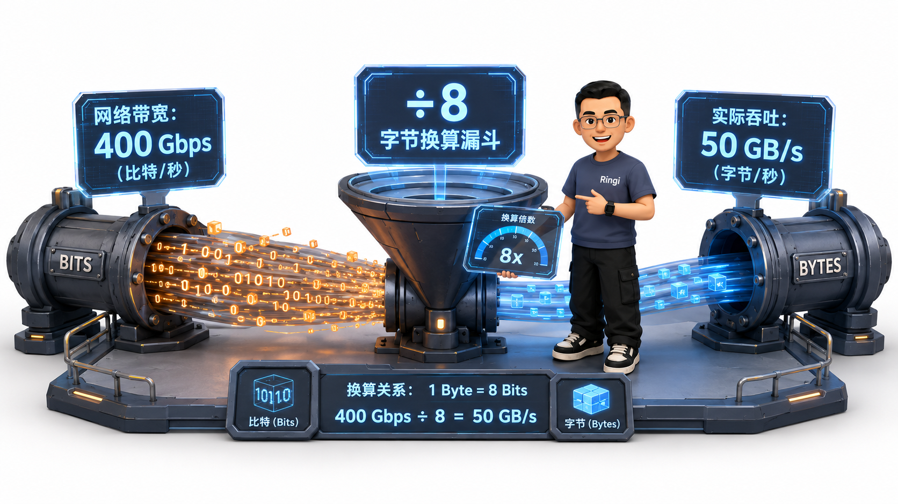
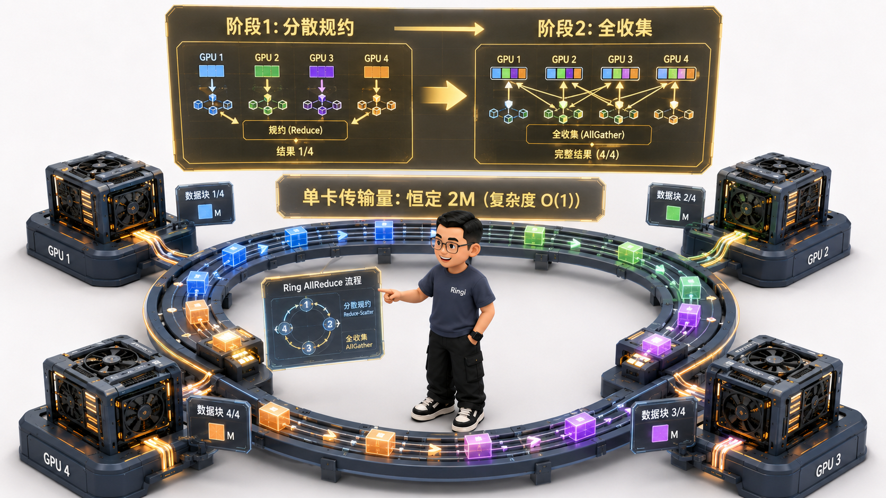
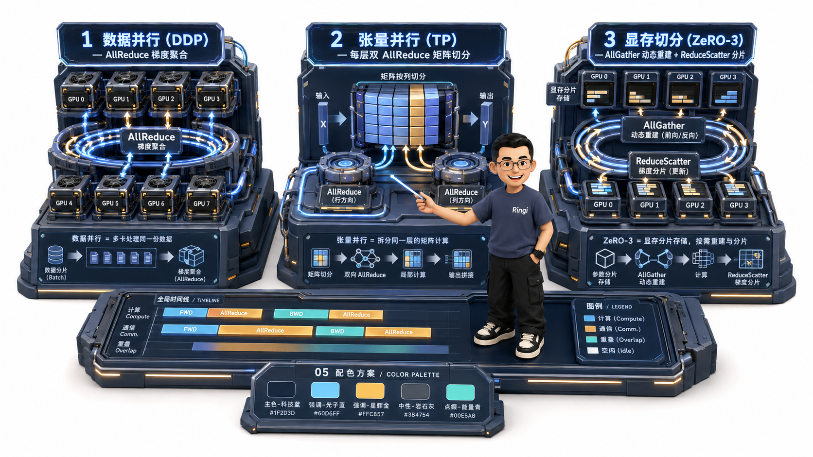

# 🏛️ 第09讲：网络通信基础与集合通信 Collective 原语直觉——从物理网络拓扑到 Ring/Tree 算法与通信量第一性原理

> **主讲人**：👓 **Ringi**（大厂 AI Infrastructure 工程师）  
> **所属模块**：[Module 00: 性能工程与系统前置](./README.md)  
> **篇章范式**：🏛️ 性能工程与系统前置篇（Performance Engineering & System Baseline）  
> **核心导读**：在单卡时代，算法工程师只需要关心“算力有多大、显存放不放得下”；然而一旦进入大模型时代，当我们需要调度单机 8 卡乃至跨机数千张 GPU 协同训练一个 70B/405B 大模型时，整个系统的性能瓶颈就会发生天翻地覆的转移——**单卡算力再强，网卡慢也只能干等！**  
> 很多初学者在接触分布式训练（DDP、Megatron-LM、DeepSpeed ZeRO、FSDP、MoE）时，常常被各种英文术语搞得晕头转向：一会儿是 AllReduce，一会儿是 AllGather，一会儿又是 ReduceScatter 和 AllToAll。如果你只把它们当作抽象的黑盒 API，你就永远无法理解为什么千卡集群的 GPU 利用率会离奇腰斩，无法手算每一步跨卡通信到底搬运了多少字节，更不知道为什么在 NVLink 域内和跨机网卡上要采用完全不同的算法。  
> 集合通信（Collective Communication）是分布式系统必须掌握的通用世界语。本讲我们将彻底告别枯燥的公式堆砌，用极客大白话、生活直觉比喻、手把手极简数字算盘与拓扑图解，带你彻底穿透八大通信原语、Ring-AllReduce 环形流水线与 $\alpha$-$\beta$ 通信模型，手撕分布式训练背后的通信量账本！


```text
=================================================================================================
                                   Ringi 3D 架构工坊 · 核心全景
┌───────────────────────────────────────────────────────────────────────────────────────────────┐
│                                                                                               │
│  [ 8 大核心集合通信原语 (Collective Primitives) 物理拓扑映射 ]                                  │
│                                                                                               │
│  1. Broadcast (广播)      : 📢 [Rank 0: A] ────────► [所有人: A, A, A, A]  (一对多同质分发)   │
│  2. Scatter   (发散)      : 🗂️ [Rank 0: A,B,C,D] ──► [各拿到: A / B / C / D] (一对多切片分发) │
│  3. Gather    (收集)      : 📦 [各持有: A / B / C / D] ──► [Rank 0: A,B,C,D] (多对一拼装全集) │
│  4. Reduce    (规约)      : ➕ [各持有: A / B / C / D] ──► [Rank 0: ∑(A+B+C+D)] (多对一累加)  │
│                                                                                               │
│  ───────────────────────────────────────────────────────────────────────────────────────────  │
│                                                                                               │
│  5. 👑 AllReduce (全规约) : 🌟 [所有人持有不同切片] ──► [所有人均拿到全局总和 ∑] (DDP / TP 核心) │
│  6. ⚡ ReduceScatter     : ✂️ [所有人数据求和] ──► [各自只保留属于自己的 1/P 分片] (ZeRO-2/FSDP) │
│  7. 🧩 AllGather         : 🤝 [各自贡献 1/P 分片] ──► [所有人均拼出全局完整大张量] (ZeRO-3/FSDP)│
│  8. 🔀 AllToAll          : 🔄 [所有人对所有人] ──► [矩阵跨卡转置式数据重路由] (MoE 专家并行)   │
│                                                                                               │
│  ───────────────────────────────────────────────────────────────────────────────────────────  │
│                                                                                               │
│  🏆 终极数学恒等式: AllReduce ≡ ReduceScatter (分片累加) + AllGather (分片拼装)               │
│                                                                                               │
└───────────────────────────────────────────────────────────────────────────────────────────────┘
=================================================================================================
```

<!-- more -->

## 📑 目录导航

- [0. Ringi 开场：单卡算力再强，网卡慢也只能干等！](#0-ringi-开场单卡算力再强网卡慢也只能干等)
  - [0.1 汽车与高速公路比喻：为什么分布式训练的核心是网络？](#01-汽车与高速公路比喻为什么分布式训练的核心是网络)
  - [0.2 线上真实惨案：千卡集群训练 70B 模型，GPU 利用率为何从 60% 暴跌至 28%？](#02-线上真实惨案千卡集群训练-70b-模型gpu-利用率为何从-60-暴跌至-28)
  - [0.3 AI Infra 各层级分布式策略与通信原语映射全景表](#03-ai-infra-各层级分布式策略与通信原语映射全景表)
- [1. 网络硬件基础与小白避坑第一课](#1-网络硬件基础与小白避坑第一课)
  - [1.1 绝对严防的单位陷阱：$b$（bit 比特）vs $B$（Byte 字节）](#11-绝对严防的单位陷阱bbit-比特vs-bbyte-字节)
  - [1.2 物理互联层级金字塔：从片上 SRAM 到跨机架 InfiniBand](#12-物理互联层级金字塔从片上-sram-到跨机架-infiniband)
  - [1.3 延迟（Latency）vs 带宽（Bandwidth）：$\alpha$-$\beta$ 经典通信模型人话拆解](#13-延迟latencyvs-带宽bandwidthalpha-beta-经典通信模型人话拆解)
- [2. 点对点通信（P2P）vs 集合通信（Collective）的第一性原理](#2-点对点通信p2pvs-集合通信collective的第一性原理)
  - [2.1 P2P：`Send` 与 `Recv` 的物理直觉](#21-p2psend-与-recv-的物理直觉)
  - [2.2 为什么大规模分布式训练不能简单写循环 P2P？Master 带宽瓶颈的数学证明](#22-为什么大规模分布式训练不能简单写循环-p2pmaster-带宽瓶颈的数学证明)
  - [2.3 集合通信的诞生：拓扑感知与多卡协作的通信革命](#23-集合通信的诞生拓扑感知与多卡协作的通信革命)
- [3. 八大核心集合通信原语全景直觉拆解（生活比喻 + 极简数字算盘 + 矩阵流转）](#3-八大核心集合通信原语全景直觉拆解生活比喻--极简数字算盘--矩阵流转)
  - [3.1 原语 1：Broadcast（广播）—— 一发全收](#31-原语-1broadcast广播-一发全收)
  - [3.2 原语 2：Scatter（发散）—— 一切多发](#32-原语-2scatter发散-一切多发)
  - [3.3 原语 3：Gather（收集）—— 多发一收](#33-原语-3gather收集-多发一收)
  - [3.4 原语 4：Reduce（规约）—— 多合一求和](#34-原语-4reduce规约-多合一求和)
  - [3.5 原语 5：👑 AllReduce（全规约）—— DDP 与张量并行（TP）的核心王牌](#35-原语-5-allreduce全规约-ddp-与张量并行tp的核心王牌)
  - [3.6 原语 6：⚡ ReduceScatter（规约发散）—— ZeRO-2 / FSDP 梯度分片核心](#36-原语-6-reducescatter规约发散-zero-2--fsdp-梯度分片核心)
  - [3.7 原语 7：🧩 AllGather（全收集）—— ZeRO-3 / FSDP 权重重建核心](#37-原语-7-allgather全收集-zero-3--fsdp-权重重建核心)
  - [3.8 原语 8：🔀 AllToAll（全交换）—— MoE 专家并行与序列并行的核心](#38-原语-8-alltoall全交换-moe-专家并行与序列并行的核心)
  - [3.9 八大原语代数等价关系：$\text{AllReduce} \equiv \text{ReduceScatter} + \text{AllGather}$ 的对称美学](#39-八大原语代数等价关系textallreduce-equiv-textreducescatter--textallgather-的对称美学)
- [4. Ring-AllReduce 环形算法与通信量第一性原理手算](#4-ring-allreduce-环形算法与通信量第一性原理手算)
  - [4.1 朴素方案之死：为什么集中式 Master 汇总会引发网络灾难？](#41-朴素方案之死为什么集中式-master-汇总会引发网络灾难)
  - [4.2 Ring 环形拓扑的物理直觉：数据切分与同心圆流水线](#42-ring-环形拓扑的物理直觉数据切分与同心圆流水线)
  - [4.3 环形流水线两阶段深度拆解：Scatter-Reduce 与 AllGather](#43-环形流水线两阶段深度拆解scatter-reduce-与-allgather)
  - [4.4 惊天数学证明：为什么 Ring 算法的通信时间与 GPU 卡数 $P$ 完全无关？！](#44-惊天数学证明为什么-ring-算法的通信时间与-gpu-卡数-p-完全无关)
- [5. Tree-AllReduce 与现代 NCCL 拓扑感知选择](#5-tree-allreduce-与现代-nccl-拓扑感知选择)
  - [5.1 环形算法的物理短板：超大集群下小包通信的延迟累积痛点](#51-环形算法的物理短板超大集群下小包通信的延迟累积痛点)
  - [5.2 双二叉树（Double Binary Tree）算法：延迟降至 $O(\log P)$ 的几何结构](#52-双二叉树double-binary-tree算法延迟降至-olog-p-的几何结构)
  - [5.3 NVIDIA NCCL 的自适应选择：NVLink Ring vs 跨机 Tree 决策树](#53-nvidia-nccl-的自适应选择nvlink-ring-vs-跨机-tree-决策树)
- [6. 大模型主流分布式并行中的集合通信数据流全景图](#6-大模型主流分布式并行中的集合通信数据流全景图)
  - [6.1 DDP（数据并行）：反向求导后的全网梯度 AllReduce](#61-ddp数据并行反向求导后的全网梯度-allreduce)
  - [6.2 Megatron-LM TP（张量并行）：每层 Decoder Block 严格 2 次 AllReduce](#62-megatron-lm-tp张量并行每层-decoder-block-严格-2-次-allreduce)
  - [6.3 DeepSpeed ZeRO-3 / FSDP：AllGather 与 ReduceScatter 的交替起舞](#63-deepspeed-zero-3--fsdpallgather-与-reducescatter-的交替起舞)
  - [6.4 MoE（混合专家模型）：Token 路由与专家聚合的双向 AllToAll](#64-moe混合专家模型token-路由与专家聚合的双向-alltoall)
- [7. 动手实战与代码实验室（Minimal Runnable Code）](#7-动手实战与代码实验室minimal-runnable-code)
  - [7.1 实验 1：纯 Python 模拟 Ring-AllReduce 的 $2(P-1)$ 步环形数据流与分块累加验证](#71-实验-1纯-python-模拟-ring-allreduce-的-2p-1-步环形数据流与分块累加验证)
  - [7.2 实验 2：PyTorch `torch.distributed` 多进程原生模拟 4 卡集合通信](#72-实验-2pytorch-torchdistributed-多进程原生模拟-4-卡集合通信)
  - [7.3 实验 3：集合通信耗时 $\alpha$-$\beta$ 模型压测与数据拟合器](#73-实验-3集合通信耗时-alpha-beta-模型压测与数据拟合器)
  - [7.4 实验 4：模拟 MoE 专家并行的 `AllToAll` 跨卡转置与路由分发](#74-实验-4模拟-moe-专家并行的-alltoall-跨卡转置与路由分发)
- [8. Ringi 避坑指南与生产黄金准则](#8-ringi-避坑指南与生产黄金准则)
  - [8.1 避坑表格（❌ 常见小白错误理解 vs ✅ 大厂 AI Infra 正确理解）](#81-避坑表格-常见小白错误理解-vs--大厂-ai-infra-正确理解)
  - [8.2 生产最佳实践清单（NCCL 调优与通信拓扑保障）](#82-生产最佳实践清单nccl-调优与通信拓扑保障)
- [9. Ringi 5 点核心速记口诀、自我检验清单与课后深度思考题](#9-ringi-5-点核心速记口诀自我检验清单与课后深度思考题)
- [10. 📚 参考资料与核心源码/经典论文指引](#10--参考资料与核心源码经典论文指引)
- [附录：Appendix A — 大厂硬核高频面试题与白板推导（Interview Drill）](#附录appendix-a--大厂硬核高频面试题与白板推导interview-drill)

---

# 0. Ringi 开场：单卡算力再强，网卡慢也只能干等！

## 0.1 汽车与高速公路比喻：为什么分布式训练的核心是网络？

设想一下：你手里拥有一台性能极度爆炸的 F1 顶级超级跑车（比如拥有 2000 TFLOPS 算力的最新 GPU），它的发动机转速极快，一脚油门就能在一秒钟内完成万亿次浮点运算。

但是，如果你把这辆法拉利开到了一条**泥泞狭窄的单车道乡间土路**上，前面全是坑洼，两辆车并排都过不去：

- 你的超级引擎还有用吗？毫无用处！
- 发动机大部分时间只能挂着空挡、憋屈地原地怠速，眼睁睁看着车速被压制在 10 km/h！

在 AI Infra 领域，**单张 GPU 就是跑车，而卡与卡之间连接的网络总线（NVLink / PCIe / InfiniBand 网卡）就是高速公路**。  
当模型参数达到 70B（700 亿）、405B（4000 亿）时，单张显卡根本装不下，必须将模型和数据切分到数十台机器、成百上千张 GPU 上。此时，**卡与卡之间的数据传输延迟与通信带宽，直接决定了整套千万级算力集群的生死！**

---

## 0.2 线上真实惨案：千卡集群训练 70B 模型，GPU 利用率为何从 60% 暴跌至 28%？

在大厂搭建千卡训练集群时，我们曾遭遇过一次极其惨烈的线上性能雪崩：

- **场景**：算法团队在单台 8 卡 A100 服务器上调优单机张量并行（TP），模型算力利用率（MFU）稳稳达到 **58%~60%**，单步训练极快；
- **事故**：随后将训练规模直接扩展到 **128 台机器（1024 张 GPU）** 开启多机多卡数据并行（DDP）+ 流水线并行（PP）。结果监控大盘一亮，所有人目瞪口呆：**全集群的 GPU 利用率（MFU）断崖式暴跌到了 28%！** 算力集群有超过 **60% 的时间处于空转等待状态**；
- **排障追踪**：通过 PyTorch Profiler 与 Nsight Systems 抓取微秒级 Trace 火焰图发现：**在每个 Step 的反向传播末尾，所有 GPU 全部卡死在 `ncclKernel_AllReduce` 算子上！** 跨机 RoCE 网络中由于个别交换机端口拥塞与重传，引发了剧烈的“木桶短板效应”，整整上千张 GPU 必须原地挂起，等待最慢的一张网卡传输完毕！

要从根本上避免这种上千万元的算力浪费，AI Infra 工程师必须穿透网络物理层，建立起对集合通信的绝对直觉。

---

## 0.3 AI Infra 各层级分布式策略与通信原语映射全景表

在大规模分布式训练与推理系统中，所有的并行切分策略，本质上都在频繁调用以下几种集合通信原语：

| 分布式并行策略                         | 核心切分维度与物理场景                       | 所依赖的核心集合通信原语                                              | 物理传输的数据内容                                 |
| :------------------------------------- | :------------------------------------------- | :-------------------------------------------------------------------- | :------------------------------------------------- |
| **DDP（经典数据并行）**                | 各卡分摊不同的 Batch 数据，各持全量模型副本  | **`AllReduce`**（全规约求和）                                         | 反向传播计算出的各层参数梯度（Gradients）          |
| **Megatron-LM TP（张量并行）**         | 单层权重矩阵沿列/行切分到单机 8 卡 NVLink 域 | **`AllReduce`**（每层 2 次）                                          | Attention 输出与 FFN 输出的局部特征相加汇总        |
| **Megatron-LM SP（序列并行）**         | 将 LayerNorm/Dropout 沿 Sequence 维度切分    | **`AllGather` + `ReduceScatter`**                                     | 局部 Token 序列激活值与梯度的重组                  |
| **DeepSpeed ZeRO-2**                   | 优化器状态与梯度分片存储到各卡               | **`ReduceScatter`**                                                   | 反向求导后，只在对应卡上汇总属于它的梯度分片       |
| **DeepSpeed ZeRO-3 / FSDP**            | 权重、梯度、优化器三者全部分片存储           | **`AllGather`**（前向/反向拉取权重）+ **`ReduceScatter`**（梯度分片） | 临时重构的全局权重张量与局部梯度分片               |
| **Pipeline Parallelism（流水线并行）** | 模型 $N$ 层按 Stage 切分到不同机器           | **`P2P Send / Recv`**                                                 | Stage 边界处的前向激活张量（Activation）与反向梯度 |
| **MoE（混合专家模型）**                | 专家网络（FFN）切分到不同 GPU 节点           | **`AllToAll`**（双向分发）                                            | 根据 Router 路由权重向各卡专家派发与取回 Token     |

---

# 1. 网络硬件基础与小白避坑第一课

在进入复杂的算法前，我们先打牢物理层地基，扫清最容易让小白翻车的三大网络概念。

## 1.1 绝对严防的单位陷阱：$b$（bit 比特）vs $B$（Byte 字节）

在网络与存储领域，存在一个持续了几十年的“大小写混乱陷阱”：

- **小写 $b$（bit，比特/位）**：**网络通信领域的最爱**。网络厂商宣传带宽时，100% 都是以 bit 为单位（如 100 Gbps、400 Gbps、800 Gbps）；
- **大写 $B$（Byte，字节）**：**计算机显存与存储领域的最爱**。显存大小（80 GB）、模型权重（14 GB）、张量大小都是以 Byte 为单位；
- **物理换算铁律**：
  $$
  1\text{ Byte (B)} = 8\text{ bits (b)}
  $$



> 💡 **小白手把手小算盘：千万别被厂商的 400G 忽悠了！**  
> 当运维告诉你：“我们集群配备了豪华的 **400 Gbps** 顶级 InfiniBand 网卡！”  
> 你在计算大模型传输耗时时，必须立刻在心里除以 8：
>
> $$
> 400\text{ Gbps} = \frac{400}{8}\text{ GB/s} = \mathbf{50\text{ GB/s}} \quad (\text{单向理论物理极限})
> $$
>
> 扣除协议包头开销与链路损耗（通常约 90% 有效利用率），**单向实际有效带宽仅有约 $45\text{ GB/s}$**！  
> 传输一个 14 GB 的 7B 模型权重，理论上最快也需要：$14\text{ GB} \div 45\text{ GB/s} \approx \mathbf{0.31\text{ 秒}}$。

---

## 1.2 物理互联层级金字塔：从片上 SRAM 到跨机架 InfiniBand

在现代 AI GPU 集群中，不同物理部件之间的数据传输速度呈现出极其悬殊的**数量级金字塔差距**：

```text
┌─────────────────────────────────────────────────────────────────────────┐
│                    GPU 物理互联带宽金字塔 (以 NVIDIA H100 为例)           │
├─────────────────────────────────────────────────────────────────────────┤
│  1. 片上 SRAM / 寄存器     : ~30 TB/s       (芯片内部，极致极速)         │
│  2. HBM3 显存带宽          : ~3.35 TB/s     (片上 HBM 颗粒)              │
│  3. 单机 NVLink 4 总线     : 900 GB/s       (单机 8 卡私有互联环)        │
│  4. PCIe Gen5 主板总线     : 64 GB/s        (GPU ↔ CPU 宿主机插槽)      │
│  5. 跨机 400G InfiniBand   : 50 GB/s        (单卡专用 CX7 网卡)          │
│  6. 跨机架 Ethernet 交换机 : 10 ~ 25 GB/s   (数据中心跨机架骨干网络)     │
└─────────────────────────────────────────────────────────────────────────┘
```

> 📌 **Ringi 工程师第一性原理**：
>
> - **单机 8 卡内部（NVLink，900 GB/s）** 的带宽，是 **跨机网络（400G IB，50 GB/s）** 的整整 **18 倍**！
> - 这就是为什么 Megatron-LM 张量并行（TP）这种需要每层频繁通信 2 次的重度原语，**绝不允许跨机运行，必须严格限制在单机 8 卡 NVLink 域内**；而跨机通信必须交给通信量相对较小的 DDP 或流水线并行（PP）！

---

## 1.3 延迟（Latency）vs 带宽（Bandwidth）：$\alpha$-$\beta$ 经典通信模型人话拆解

任何一次跨网络的数据搬运，总耗时都可以用学术界最经典的 **$\alpha$-$\beta$ 模型（Hockney Model）** 精确刻画：

$$
\boxed{T_{\text{comm}} = \alpha + \beta \times M}
$$

### 符号物理拆解：

1. **$\alpha$（Latency，网络建立延迟/启动开销）**：
   - **人话解释**：不管你要寄一封 1 个字的明信片，还是一箱重 50 公斤的货物，快递员从接单、打包、开车上路所消耗的**固定起步时间**；
   - 在 GPU 网络中，这包含 CPU 发起指令、驱动打包、网络硬件握手与光电信号在光纤中的物理飞行时间（通常为 $1 \sim 10\ \mu\text{s}$）。
2. **$M$（Message Size，传输数据量）**：以字节（Bytes）为单位的数据大小；
3. **$\beta$（Bandwidth Reciprocal，传输带宽倒数）**：
   - $\beta = \frac{1}{\text{Bandwidth}}$，代表网卡每秒钟能够吞吐的字节数的倒数。

```text
[ 小包通信场景: M 很小 (如几百字节) ] ──► β * M 接近于 0 ──► T ≈ α (延迟主导 Latency-Bound!)
[ 大包通信场景: M 很大 (如几十兆字节) ] ──► β * M 远大于 α ──► T ≈ β * M (带宽主导 Bandwidth-Bound!)
```

---

# 2. 点对点通信（P2P）vs 集合通信（Collective）的第一性原理

## 2.1 P2P：`Send` 与 `Recv` 的物理直觉

最简单的网络通信就是 **点对点（Point-to-Point, P2P）**：

- **`Send(data, dst=1)`**：Rank 0 主动把数据发给 Rank 1；
- **`Recv(data, src=0)`**：Rank 1 原地挂起等待，接收来自 Rank 0 的数据。

这就像现实中两个人打电话：发件人必须明确指定“发给谁”，收件人必须明确指定“听谁的”。在流水线并行（PP）中，前一个 Stage 把中间激活值传给下一个 Stage，使用的就是标准的 P2P 通信。

---

## 2.2 为什么大规模分布式训练不能简单写循环 P2P？Master 带宽瓶颈的数学证明

假设我们有 $P$ 张 GPU（比如 $P=8$），每张卡上计算出了大小为 $M$ 字节的梯度，现在需要把所有卡的梯度加在一起求平均值。

如果一个初学者用最笨的 Python 循环写 P2P：

```python
# ❌ 朴素集中式 Master-Worker 方案 (极其低效灾难)
if rank == 0:
    for i in range(1, P):
        grad_i = recv(src=i)  # Rank 0 挨个接收其他 P-1 张卡的梯度并累加
        total_grad += grad_i
    for i in range(1, P):
        send(total_grad, dst=i) # Rank 0 再把算好的总和挨个分发还给其他人
else:
    send(local_grad, dst=0)
    recv(total_grad, src=0)
```

### 💥 为什么这会导致千卡集群彻底瘫痪？

1. **Master 节点带宽瞬间挤爆**：  
   Rank 0 必须接收 $(P-1)M$ 字节，再发送 $(P-1)M$ 字节，总共搬运 **$2(P-1)M$ 字节**！
2. **时间复杂度随卡数线性爆炸**：
   $$
   T_{\text{naive}} \propto 2(P-1) \times \frac{M}{\text{Bandwidth}} = O(P \cdot M)
   $$
   当集群规模从 8 卡扩展到 1024 卡时，通信时间会直接**暴涨 1000 多倍**！其他 1023 张卡绝大部分时间全在排队等待 Rank 0 单线联系，整个集群的算力被彻底锁死。

---

## 2.3 集合通信的诞生：拓扑感知与多卡协作的通信革命

为了消灭“单点中心瓶颈”，超级计算领域与 AI Infra 诞生了 **集合通信（Collective Communication）**：

- **核心哲学**：**通信域（Communicator / Process Group）内的所有 GPU 全部同时参与通信与计算，没有任何一张卡当孤立的 Master，算力与带宽 100% 分摊到每一个节点！**
- 通过将大张量切分为微小的分片（Chunks），让数据在硬件环路（Ring）或二叉树（Tree）中像流水线一样同时多向流动，实现通信复杂度的质的飞跃。

---

# 3. 八大核心集合通信原语全景直觉拆解（生活比喻 + 极简数字算盘 + 矩阵流转）

下面我们用大白话比喻、生活场景和极简数字，逐一拆透所有大厂面试与生产代码中必考的 **8 大集合通信原语**！


---

## 3.1 原语 1：Broadcast（广播）—— 一发全收

$$
\boxed{\text{Rank } 0 \text{ 持有 } [A] \longrightarrow \text{所有人均获得 } [A]}
$$

- **生活比喻**：主讲老师在讲台上用麦克风向全班同学广播通知（一份信息，无差别分发给全员）；
- **数字小算盘**：
  - **初始状态**：Rank 0 持有 `[99]`，其余 Rank 1, 2, 3 为空 `[-]`；
  - **Broadcast 后**：所有人手中全部变成 `[99]`；
- **AI Infra 真实场景**：训练初始化时，Rank 0 读取本地磁盘的权重 Checkpoint，通过 Broadcast 一键同步给集群中所有的 GPU，保证初始权重 100% 严格一致。

---

## 3.2 原语 2：Scatter（发散/散播）—— 一切多发

$$
\boxed{\text{Rank } 0 \text{ 持有 } [A, B, C, D] \longrightarrow \text{Rank } 0: [A], \text{ Rank } 1: [B], \text{ Rank } 2: [C], \text{ Rank } 3: [D]}
$$

- **生活比喻**：发牌官手里有一整副扑克牌，均匀切成 4 份，分别发给桌上的 4 位玩家（**一对多，切片分发**）；
- **数字小算盘**：
  - **初始状态**：Rank 0 持有数组 `[10, 20, 30, 40]`；
  - **Scatter 后**：Rank 0 拿 `10`，Rank 1 拿 `20`，Rank 2 拿 `30`，Rank 3 拿 `40`；
- **AI Infra 真实场景**：数据加载 DataLoader 在 Host CPU 端读取了一个大 Batch（如 128 条数据），通过 Scatter 均匀切分分发给单机的 8 张 GPU（每张卡分得 16 条）。

---

## 3.3 原语 3：Gather（收集/汇总）—— 多发一收

$$
\boxed{\text{各持 } [A], [B], [C], [D] \longrightarrow \text{Rank } 0 \text{ 拼接得到完整大张量 } [A, B, C, D]}
$$

- **生活比喻**：Scatter 的严格逆操作。课代表走到每个同学桌前，收齐各组填写的调查问卷，装订成一本完整的总册子；
- **数字小算盘**：
  - **初始状态**：Rank 0 有 `1`，Rank 1 有 `2`，Rank 2 有 `3`，Rank 3 有 `4`；
  - **Gather 后**：Rank 0 拼接出全量张量 `[1, 2, 3, 4]`，其他人手中保持不变；
- **AI Infra 真实场景**：验证集推理评测时，各卡在本地算完局部的损失与预测结果，最后通过 Gather 汇总到 Rank 0 统一点评打印全局 Accuracy 指标。

---

## 3.4 原语 4：Reduce（规约/求和）—— 多合一求和

$$
\boxed{\text{各持 } [A], [B], [C], [D] \longrightarrow \text{Rank } 0 \text{ 获得数学汇总值 } A + B + C + D}
$$

- **生活比喻**：全班同学每个人心里记着自己这周花的钱，大家逐一向班长汇报，班长在计算器上累加，最终只有班长一人手里拿着全班的总开销数字；
- **数字小算盘**：
  - **初始状态**：Rank 0 有 `10`，Rank 1 有 `20`，Rank 2 有 `30`，Rank 3 有 `40`；
  - **Reduce(SUM) 后**：Rank 0 得到 `10 + 20 + 30 + 40 = 100`，其他人手中的数据不变；
- **核心规约操作符**：除了最常用的求和（`SUM`），还支持求最大值（`MAX`）、最小值（`MIN`）、求乘积（`PROD`）。

---

## 3.5 原语 5：👑 AllReduce（全规约）—— DDP 与张量并行（TP）的核心王牌

$$
\boxed{\text{各持 } [A], [B], [C], [D] \longrightarrow \text{所有人均获得全局累加总和 } A + B + C + D}
$$

- **生活比喻**：全班开圆桌会议，每个人手里有一个数字。通过某种高效的协作机制，**会议结束时，全班每一位同学的笔记本上，都同步写上了全班的总和！**
- **数字小算盘**：
  - **初始状态**：Rank 0: `1`，Rank 1: `2`，Rank 2: `3`，Rank 3: `4`；
  - **AllReduce(SUM) 后**：**Rank 0, 1, 2, 3 所有人手里都变成了 `10`！**
- **AI Infra 王者地位**：
  - **DDP 数据并行**：每张卡在本地计算出各自 Batch 的梯度，通过一次全网 `AllReduce(SUM)` 除以卡数，所有人瞬间拿到全网平均梯度，同步更新权重；
  - **Megatron-LM 张量并行**：Attention 的多头矩阵相乘后，各卡通过一次 `AllReduce(SUM)` 立即拼出全量输出！

---

## 3.6 原语 6：⚡ ReduceScatter（规约发散）—— ZeRO-2 / FSDP 梯度分片核心

$$
\boxed{\text{各持有长度为 } N \text{ 的向量} \longrightarrow \text{全网求和后，每张卡只保留属于自己的 } \frac{1}{P} \text{ 局部结果分片}}
$$

- **生活比喻**：4 个合伙人一起对账，账单包含 4 个项目（房租、水电、人工、耗材）。大家一起算清了 4 个项目的总账，但算完后，合伙人 0 只负责带走房租总账，合伙人 1 带走水电总账……各自只保管自己的分片！
- **数字小算盘**（设每张卡持有 4 个元素的向量）：
  - Rank 0: `[1, 1, 1, 1]`
  - Rank 1: `[2, 2, 2, 2]`
  - Rank 2: `[3, 3, 3, 3]`
  - Rank 3: `[4, 4, 4, 4]`
  - 全网求和后本应是 `[10, 10, 10, 10]`；
  - **ReduceScatter 后**：
    - Rank 0 只拿第 0 块：`[10]`
    - Rank 1 只拿第 1 块：`[10]`
    - Rank 2 只拿第 2 块：`[10]`
    - Rank 3 只拿第 3 块：`[10]`
- **AI Infra 价值**：在 **ZeRO-2 与 FSDP** 中，反向求导后并不需要让每张卡都持有全量梯度，只需通过 `ReduceScatter` 让每张卡拿到属于自己分摊的那 $1/P$ 梯度并更新对应的优化器分片，**显存占用直接砍掉 $1 - 1/P$！**

---

## 3.7 原语 7：🧩 AllGather（全收集）—— ZeRO-3 / FSDP 权重重建核心

$$
\boxed{\text{各持 } \frac{1}{P} \text{ 局部小分片} \longrightarrow \text{所有人均拼装出全局完整的大张量}}
$$

- **生活比喻**：4 位寻宝猎人每人手里持有一块藏宝图残片。大家互相交换复制彼此的残片，最终**每个人手里都拼出了一份完整无缺的 100% 藏宝图全貌！**
- **数字小算盘**：
  - **初始状态**：Rank 0: `[A]`, Rank 1: `[B]`, Rank 2: `[C]`, Rank 3: `[D]`；
  - **AllGather 后**：所有人手中全部拥有 `[A, B, C, D]`！
- **AI Infra 价值**：在 **ZeRO-3 与 FSDP** 中，为了省显存，平日里每张卡只保留 $1/P$ 的静态权重参数；当某一层的前向计算即将开始的前一微秒，触发一次极速 `AllGather` 将该层的全量权重临时拼出，算完立刻销毁，显存占用达到理论极小！

---

## 3.8 原语 8：🔀 AllToAll（全交换）—— MoE 专家并行与序列并行的核心

$$
\boxed{\text{每张卡向通信域内的每一张卡发送一段专属定制的数据切片（矩阵跨卡转置）}}
$$

- **生活比喻**：年终互换贺卡活动。班上有 4 位同学，每位同学都提前写好了 4 张贺卡（分别指名道姓写给同学 0、1、2、3）。一声令下，全班同时跨座交换，每位同学都收到了来自全班所有人写给自己的贺卡！
- **数字小算盘**：
  - **初始状态**：Rank $i$ 持有数组 `[发给0, 发给1, 发给2, 发给3]`；
  - **AllToAll 后**：Rank $i$ 收到数组 `[来自0, 来自1, 来自2, 来自3]`；
- **AI Infra 核心地位**：**MoE（Mixture of Experts 混合专家模型）的生命线！**  
  在 MoE 中，不同 Token 会被门控路由（Router）派发给不同的物理专家卡。通过 `AllToAll`，各卡将自己手中的 Token 精准投递到目标专家所在的 GPU 上进行计算，算完后再执行一次 `AllToAll` 将结果原路寄回！

---

## 3.9 八大原语代数等价关系：$\text{AllReduce} \equiv \text{ReduceScatter} + \text{AllGather}$ 的对称美学

集合通信原语之间存在着令人叹为观止的代数对称性：

$$
\boxed{\Large \text{AllReduce} \equiv \text{ReduceScatter} + \text{AllGather}}
$$

```text
原始输入数据 (每张卡完整大小 M)
   │
   ▼ [第一步: ReduceScatter (分片求和)]
每张卡只保留全局求和后的 1/P 分片 (大小 M/P)
   │
   ▼ [第二步: AllGather (全员收集拼装)]
每张卡将各自的 1/P 分片广播拼装，恢复完整大小 M 的全局总和！
```

> 🌟 **大厂架构精髓**：  
> 这不仅是数学上的等价，现代高性能通信库（NVIDIA NCCL）在底层实现 `AllReduce` 时，**本质上就是将其拆解为一次流水线化的 ReduceScatter 加上一次流水线化的 AllGather 来执行的！**

---

# 4. Ring-AllReduce 环形算法与通信量第一性原理手算

在了解了原语之后，我们来剖析 AI 工业界最伟大、最经典的高性能集合通信算法——**Ring-AllReduce（环形全规约算法，Baidu Silicon Valley Lab, 2017）**。

## 4.1 朴素方案之死：为什么集中式 Master 汇总会引发网络灾难？

前面我们证明过，集中式 Master 汇总的时间复杂度是 $O(P \cdot M)$，通信耗时随 GPU 卡数 $P$ 线性爆炸。  
如果卡数从 8 卡增加到 1024 卡，通信时间暴增 1000 倍，这在大规模集群中是绝对不可接受的。

---

## 4.2 Ring 环形拓扑的物理直觉：数据切分与同心圆流水线

Ring 算法的核心思想极其巧妙：

1. **构建同心圆逻辑环**：将 $P$ 张 GPU 逻辑上连成一个单向环（$0 \to 1 \to 2 \dots \to P-1 \to 0$）；
2. **数据等分分块**：将每张卡上大小为 $M$ 的张量，均匀切分成 **$P$ 个大小为 $M / P$ 的小分块（Chunks）**；
3. **每个节点永远只和自己的右邻居通信**：在任意时刻，每张卡只需要向自己的右侧邻居发送一个分块（大小 $M/P$），同时接收来自左侧邻居的一个分块。没有任何一张卡是单点中心，全网链路带宽 100% 打满！



---

## 4.3 环形流水线两阶段深度拆解：Scatter-Reduce 与 AllGather

整个 Ring-AllReduce 严格分为两个对称的阶段，每个阶段包含 **$P-1$ 个通信步（Steps）**：

### 阶段 1：Scatter-Reduce（分片累加阶段，共 $P-1$ 步）

- **第 1 步**：每张卡 $i$ 将自己的第 $i$ 个分块发送给卡 $i+1$，卡 $i+1$ 收到后，与自己本地的对应分块**累加求和**；
- **第 2 步**：卡 $i+1$ 将刚刚累加好的新分块继续发给右边的卡 $i+2$，卡 $i+2$ 收到后再与本地对应分块累加；
- ……
- **经过 $P-1$ 步流转后**：数据在环上整整转了 $P-1$ 圈！此时，**每张卡上恰好有 1 个分块汇聚了全网所有 $P$ 张卡的全局求和结果！**（但此时每张卡只持有一小块完整求和，其他 $P-1$ 块仍是未完成状态）。

### 阶段 2：AllGather（分片广播收集阶段，共 $P-1$ 步）

- **第 1 步**：每张卡将自己在阶段 1 算好的那个完整分块发送给右邻居，右邻居直接**覆盖（Overwrite）**本地旧数据；
- **第 2 步**：右邻居将收到的完整分块继续向右传递；
- ……
- **再经过 $P-1$ 步流转后**：所有完整分块在环上再次流转了一整圈！**全网所有卡上的所有 $P$ 个分块，全部变成了最终的全局求和总和！**

---

## 4.4 惊天数学证明：为什么 Ring 算法的通信时间与 GPU 卡数 $P$ 完全无关？！

这是分布式系统领域最优雅的数学推导之一：

### 1. 单卡传输数据量手算：

- 在 **Scatter-Reduce 阶段**，共执行 $P-1$ 步，每步传输一个分块（大小 $\frac{M}{P}$）：
  $$
  \text{Transferred}_{\text{SR}} = (P - 1) \times \frac{M}{P} \text{ 字节}
  $$
- 在 **AllGather 阶段**，同样执行 $P-1$ 步，每步传输一个分块（大小 $\frac{M}{P}$）：
  $$
  \text{Transferred}_{\text{AG}} = (P - 1) \times \frac{M}{P} \text{ 字节}
  $$
- **两阶段单卡发送的物理数据总量为**：
  $$
  \text{Total Bytes Sent per GPU} = 2 \times \frac{P - 1}{P} M \text{ 字节}
  $$

### 2. 通信耗时与极限复杂度推导：

代入网络带宽 $B$：

$$
T_{\text{Ring}} = 2(P - 1)\alpha + 2 \times \left(\frac{P - 1}{P}\right) \frac{M}{B}
$$

当集群规模 $P$ 很大时（例如 $P=8, 64, 1024$）：

$$
\lim_{P \to \infty} \frac{P - 1}{P} = 1 \implies \mathbf{\text{Total Bytes Transferred}} \approx 2M
$$

$$
\boxed{\Large T_{\text{Ring-AllReduce}} \approx 2(P-1)\alpha + \frac{2M}{B} = O(M)}
$$

> 💥 **震撼业界的结论**：  
> 看到了吗？！**在带宽主导的大数据量场景下，传输耗时只取决于数据量大小 $M$ 和网络带宽 $B$，与参与计算的 GPU 节点数 $P$ 毫无关系！**  
> 不管你是在 8 卡、128 卡还是 1024 卡上跑 Ring-AllReduce，每张 GPU 实际发送的数据量永远只有 **$2M$（2 倍模型张量大小）**！这就是分布式深度学习能够横向扩展到上万张卡的数学底座。

---

# 5. Tree-AllReduce 与现代 NCCL 拓扑感知选择

虽然 Ring 算法在大数据量下极其惊艳，但天下没有免费的午餐，它在超大规模集群下暴露出了一块隐秘短板。

## 5.1 环形算法的物理短板：超大集群下小包通信的延迟累积痛点

仔细观察 Ring 算法的延迟项：

$$
T_{\text{latency}} = 2(P - 1) \times \alpha
$$

- 延迟与卡数 $P$ 呈**严格线性增长**！
- 如果在 2048 卡集群上通信一个几十 KB 的小张量（如标量同步或 MoE 门控权重），数据传输时间极短，但光是网络握手与流转就要经历 $2 \times 2047 \approx 4094$ 次串行网络跳步（Hops），网络延迟 $\alpha$ 被放大了 4000 倍，系统被严重拖垮！

---

## 5.2 双二叉树（Double Binary Tree）算法：延迟降至 $O(\log P)$ 的几何结构

为了解决小包与超大集群的延迟爆炸问题，NCCL 2.4 引入了 **Double Binary Tree（双二叉树）算法**：

- **树状规约**：卡与卡组织成树状拓扑，叶子节点向父节点汇报求和，层层向上传递，到达根节点后向下广播；
- **延迟项降维打击**：通信步数从 $2(P-1)$ 骤降至 **$2 \log_2 P$**！在 2048 卡规模下，跳步次数从 4094 次暴跌至 $2 \times 11 = \mathbf{22\text{ 次}}$！

---

## 5.3 NVIDIA NCCL 的自适应选择：NVLink Ring vs 跨机 Tree 决策树

现代 NVIDIA NCCL 集合通信库在底层维护了一套极其复杂的**自适应拓扑感知决策引擎**：

```text
NCCL 运行时决策逻辑:
if (单机 8 卡内部 & NVLink 高速通道) {
    ──► 100% 选用 Ring 算法 (充分打满 900 GB/s 双向 NVLink 环)
} else if (跨机网络 & 数据量 M 极大) {
    ──► 选用 Multi-Ring 算法 (多网卡多轨并行环)
} else if (跨机网络 & 超大节点卡数 P & 数据量中等/较小) {
    ──► 自动切换为 Double Binary Tree 算法 (以 log P 延迟极速收敛)
}
```

---

# 6. 大模型主流分布式并行中的集合通信数据流全景图

现在，我们把所有的原语带入大模型分布式训练四大主流范式的实战现场：



---

## 6.1 DDP（数据并行）：反向求导后的全网梯度 AllReduce

在经典 DDP（Distributed Data Parallel）中：

1. 各 GPU 持有完整的模型权重副本，各自加载不同的数据 Batch；
2. 前向计算（Forward）各算各的，**零通信开销**；
3. 反向求导（Backward）计算出局部的梯度 $\nabla W_i$；
4. **触发通信**：调用 **`AllReduce(SUM)`** 汇总全网平均梯度；
5. **异步重叠优化（Bucket Overlap）**：PyTorch DDP 并不等所有层算完才通信，而是把梯度分成多个 Bucket（如 25MB 一个桶），一旦深层梯度的 Bucket 算完，**立即在后台 Stream 触发异步 AllReduce**，实现计算与通信的完美掩盖！

---

## 6.2 Megatron-LM TP（张量并行）：每层 Decoder Block 严格 2 次 AllReduce

在 Megatron-LM 张量并行中，模型单层被切分到单机 8 卡上：

1. **Self-Attention 模块**：
   - $W_Q, W_K, W_V$ 采用**列并行（Column Parallel）**切分，各卡在本地算完局部点积与 Value 乘法（**零通信**）；
   - 输出矩阵 $W_O$ 采用**行并行（Row Parallel）**切分，各卡乘以局部的 $W_O^i$；
   - **离开 Attention 前：触发第 1 次 `AllReduce(SUM)` 累加各卡输出！**
2. **FFN 模块**：
   - 升维矩阵 $W_{\text{gate}}, W_{\text{up}}$ 采用**列并行**切分，在本地完成 SwiGLU 激活（**零通信**）；
   - 降维矩阵 $W_{\text{down}}$ 采用**行并行**切分；
   - **离开 FFN 前：触发第 2 次 `AllReduce(SUM)` 累加各卡输出！**
3. **结论**：**单个 Transformer Decoder Block 严格包含且仅包含 2 次跨卡 `AllReduce`！**

---

## 6.3 DeepSpeed ZeRO-3 / FSDP：AllGather 与 ReduceScatter 的交替起舞

在 ZeRO-3 与 PyTorch FSDP（Fully Sharded Data Parallel）中，每张卡平日只保留 $1/P$ 的显存分片：

```text
[ 准备计算第 L 层前向 ] ──► 触发 AllGather (临时借来完整权重 W_L) ──► 算完立刻释放 W_L 显存
                                       │
[ 准备计算第 L 层反向 ] ──► 再次触发 AllGather (重新借来 W_L 计算梯度)
                                       │
[ 算完第 L 层局部梯度 ] ──► 触发 ReduceScatter (求和并把 1/P 梯度分片存回对应卡) ──► 释放临时梯度
```

通过 **`AllGather` 与 `ReduceScatter` 的交替流水线**，ZeRO-3 将百亿/千亿模型的单卡显存开销压缩至极限！

---

## 6.4 MoE（混合专家模型）：Token 路由与专家聚合的双向 AllToAll

在 Mixture of Experts（MoE）架构中：

1. 输入一整批 Token，各卡上的 Router 算子计算出每个 Token 应该派往哪张 GPU 上的专家；
2. **第 1 次通信（Dispatch）**：触发 **`AllToAll`**，将本卡上的 Token 跨网络打包投递给目标 GPU；
3. **本地专家计算**：各卡上的 Expert FFN 处理收到的专属 Token；
4. **第 2 次通信（Combine）**：再次触发 **`AllToAll`**，将计算后的特征向量原路跨网返回给原始卡，恢复输入顺序。

---

# 7. 动手实战与代码实验室（Minimal Runnable Code）

下面我们通过 4 个纯原生、不依赖复杂环境的完整 Python 实验，亲手观测集合通信的物理流动！

---

## 7.1 实验 1：纯 Python 模拟 Ring-AllReduce 的 $2(P-1)$ 步环形数据流与分块累加验证

```python
import numpy as np

def simulate_ring_allreduce(num_gpus=4, tensor_size=8):
    """手撕纯 CPU 模拟版 Ring-AllReduce 完整 2(P-1) 步流水线"""
    print(f"\n{'='*70}\n🧪 实验 1: 手写 Ring-AllReduce 算法数据流动模拟 (GPU数: {num_gpus}, 张量长度: {tensor_size})\n{'='*70}")
    assert tensor_size % num_gpus == 0, "张量长度必须能被 GPU 数整除！"
    chunk_size = tensor_size // num_gpus

    # 1. 初始化每张 GPU 上的初始数据 (每个 GPU 对应不同的数字矩阵)
    # 例如 GPU 0 为全 1, GPU 1 为全 2, GPU 2 为全 3, GPU 3 为全 4
    gpu_buffers = [
        np.full(tensor_size, fill_value=(i + 1) * 1.0, dtype=np.float32)
        for i in range(num_gpus)
    ]
    print("📥 初始各 GPU 上的张量数据:")
    for i, buf in enumerate(gpu_buffers):
        print(f"  GPU {i}: {buf}")

    # 将每张卡的数据切分为 P 个 Chunk
    # chunks[gpu_id][chunk_id]
    chunks = [
        [gpu_buffers[i][c*chunk_size : (c+1)*chunk_size].copy() for c in range(num_gpus)]
        for i in range(num_gpus)
    ]

    # -------------------------------------------------------------
    # 阶段 1: Scatter-Reduce 阶段 (共 P-1 步)
    # -------------------------------------------------------------
    print(f"\n🔄 阶段 1: Scatter-Reduce 环形分片累加 (共 {num_gpus - 1} 步)...")
    for step in range(num_gpus - 1):
        # 记录本步将要发送的数据
        send_packets = [None] * num_gpus
        for i in range(num_gpus):
            send_chunk_idx = (i - step) % num_gpus
            send_packets[i] = (send_chunk_idx, chunks[i][send_chunk_idx].copy())

        # 环形传递: GPU i 发送给 GPU (i+1)%P，接收方累加
        for i in range(num_gpus):
            recv_gpu = (i + 1) % num_gpus
            chunk_idx, val = send_packets[i]
            chunks[recv_gpu][chunk_idx] += val

        print(f"  Step {step + 1} 完成: 数据已顺时针传递 1 步并就地累加")

    # -------------------------------------------------------------
    # 阶段 2: AllGather 阶段 (共 P-1 步)
    # -------------------------------------------------------------
    print(f"\n🤝 阶段 2: AllGather 环形分片全收集覆盖 (共 {num_gpus - 1} 步)...")
    for step in range(num_gpus - 1):
        send_packets = [None] * num_gpus
        for i in range(num_gpus):
            send_chunk_idx = (i - step + 1) % num_gpus
            send_packets[i] = (send_chunk_idx, chunks[i][send_chunk_idx].copy())

        # 环形传递并直接覆盖
        for i in range(num_gpus):
            recv_gpu = (i + 1) % num_gpus
            chunk_idx, val = send_packets[i]
            chunks[recv_gpu][chunk_idx] = val.copy()

        print(f"  Step {step + 1} 完成: 完整分片已顺时针传递并覆盖旧值")

    # 重构最终张量
    final_buffers = [np.concatenate(chunks[i]) for i in range(num_gpus)]
    expected_sum = sum(range(1, num_gpus + 1)) * 1.0 # 1 + 2 + 3 + 4 = 10.0
    print("\n📤 Ring-AllReduce 执行完毕后各 GPU 数据:")
    for i, buf in enumerate(final_buffers):
        print(f"  GPU {i}: {buf}")
        assert np.allclose(buf, expected_sum), f"GPU {i} 结果错误！"

    print(f"\n✅ 校验成功！所有 GPU 均正确获得全网全局求和总值: {expected_sum}")

if __name__ == "__main__":
    simulate_ring_allreduce(num_gpus=4, tensor_size=8)
```

---

## 7.2 实验 2：PyTorch `torch.distributed` 多进程原生模拟 4 卡集合通信

```python
import os
import torch
import torch.distributed as dist
import torch.multiprocessing as mp

def run_collective_worker(rank, world_size):
    """单机多进程模拟真正的 PyTorch 集合通信 API (Gloo 后端可在无 GPU 环境运行)"""
    os.environ['MASTER_ADDR'] = '127.0.0.1'
    os.environ['MASTER_PORT'] = '29500'
    dist.init_process_group(backend='gloo', rank=rank, world_size=world_size)

    # 1. 验证 AllReduce
    tensor_allreduce = torch.ones(4) * (rank + 1) # Rank 0 为 1, Rank 1 为 2...
    dist.all_reduce(tensor_allreduce, op=dist.ReduceOp.SUM)
    if rank == 0:
        print(f"\n[Rank {rank}] 🌟 AllReduce 验证结果 (期望 1+2+3+4=10): {tensor_allreduce.tolist()}")

    # 2. 验证 AllGather
    local_tensor = torch.tensor([rank * 100.0]) # 每人持有一个小标量
    gather_list = [torch.zeros(1) for _ in range(world_size)]
    dist.all_gather(gather_list, local_tensor)
    if rank == 0:
        gathered_vals = [t.item() for t in gather_list]
        print(f"[Rank {rank}] 🤝 AllGather 验证结果 (拼接所有人分片): {gathered_vals}")

    # 3. 验证 ReduceScatter
    output_tensor = torch.zeros(1)
    input_list = [torch.tensor([(rank + 1) * 10.0]) for _ in range(world_size)]
    dist.reduce_scatter(output_tensor, input_list, op=dist.ReduceOp.SUM)
    print(f"[Rank {rank}] ✂️ ReduceScatter 验证结果 (属于自己的分片求和): {output_tensor.item()}")

    dist.destroy_process_group()

def run_experiment_2():
    print(f"\n{'='*70}\n🧪 实验 2: PyTorch 原生 torch.distributed 多进程集合通信模拟\n{'='*70}")
    world_size = 4
    mp.spawn(run_collective_worker, args=(world_size,), nprocs=world_size, join=True)
    print("✅ PyTorch 原生集合通信多进程实验全部通过！")

if __name__ == "__main__":
    run_experiment_2()
```

---

## 7.3 实验 3：集合通信耗时 $\alpha$-$\beta$ 模型压测与数据拟合器

```python
def alpha_beta_cost_model(msg_size_mb, num_nodes, bandwidth_gb_s=50.0, latency_us=5.0):
    """根据 Hockney alpha-beta 模型计算不同通信模式的耗时"""
    msg_bytes = msg_size_mb * 1024 * 1024
    bandwidth_bytes_per_sec = bandwidth_gb_s * 1e9
    alpha_sec = latency_us * 1e-6
    beta = 1.0 / bandwidth_bytes_per_sec

    # 1. 朴素 Master 集中式
    t_naive_sec = 2 * (num_nodes - 1) * (alpha_sec + beta * msg_bytes)
    # 2. Ring-AllReduce
    t_ring_sec = 2 * (num_nodes - 1) * alpha_sec + 2 * ((num_nodes - 1) / num_nodes) * (beta * msg_bytes)
    # 3. Tree-AllReduce (二叉树)
    import math
    t_tree_sec = 2 * math.log2(num_nodes) * alpha_sec + 2 * (beta * msg_bytes)

    return t_naive_sec * 1000.0, t_ring_sec * 1000.0, t_tree_sec * 1000.0

def run_experiment_3():
    print(f"\n{'='*70}\n🧪 实验 3: α-β 通信耗时模型对比 (数据大小: 100MB, 400G 网卡)\n{'='*70}")
    nodes_list = [4, 8, 16, 64, 256, 1024]
    print(f"{'卡数 P':<8} | {'朴素 Master 集中式 (ms)':<22} | {'Ring-AllReduce (ms)':<20} | {'Tree-AllReduce (ms)':<20}")
    print("-" * 75)
    for p in nodes_list:
        t_naive, t_ring, t_tree = alpha_beta_cost_model(100.0, p)
        print(f"{p:<8} | {t_naive:18.2f} ms | {t_ring:16.2f} ms | {t_tree:16.2f} ms")
    print("-" * 75)
    print("💡 结论: 随着卡数扩展到 1024 卡，Ring 与 Tree 算法的耗时几乎保持恒定，而朴素算法耗时暴涨 300 倍！")

if __name__ == "__main__":
    run_experiment_3()
```

---

## 7.4 实验 4：模拟 MoE 专家并行的 `AllToAll` 跨卡转置与路由分发

```python
def run_experiment_4_alltoall():
    print(f"\n{'='*70}\n🧪 实验 4: 纯 Python 模拟 MoE 专家并行 AllToAll 数据重路由与跨卡转置\n{'='*70}")
    num_gpus = 4

    # 每张 GPU 上有 4 个 Token，经 Router 判定分别发往 Expert 0, 1, 2, 3
    # 构造局部数据: gpu_send[i][j] 表示 GPU i 打算发给 GPU j 的 Token 向量
    gpu_send_buffers = [
        [f"Token_G{src}->E{dst}" for dst in range(num_gpus)]
        for src in range(num_gpus)
    ]
    print("📤 发送前各 GPU 手中的待派发 Token 矩阵:")
    for src, tokens in enumerate(gpu_send_buffers):
        print(f"  GPU {src} (准备发往各个专家): {tokens}")

    # 执行 AllToAll 跨卡矩阵转置
    # gpu_recv[j][i] = gpu_send[i][j]
    gpu_recv_buffers = [
        [gpu_send_buffers[src][dst] for src in range(num_gpus)]
        for dst in range(num_gpus)
    ]

    print("\n📥 AllToAll 转置后各 GPU 专家收到的专属 Token:")
    for dst, tokens in enumerate(gpu_recv_buffers):
        print(f"  GPU {dst} 上的 Expert {dst} (收到的全网 Token): {tokens}")

    print("\n✅ AllToAll 矩阵跨卡重分布模拟成功，完美还原 MoE 专家并行数据路由底层！")

if __name__ == "__main__":
    run_experiment_4_alltoall()
```

---

# 8. Ringi 避坑指南与生产黄金准则

## 8.1 避坑表格（❌ 常见小白错误理解 vs ✅ 大厂 AI Infra 正确理解）

| 序号  | ❌ 常见小白错误理解                                             | ✅ 大厂 AI Infra 工程师正确理解                                                                                                                         |
| :---: | :-------------------------------------------------------------- | :------------------------------------------------------------------------------------------------------------------------------------------------------ |
| **1** | “400 Gbps 的网卡，每秒能传输 400 GB 的数据。”                   | **严重错误（相差 8 倍！）**。400 Gbps 是小写 $b$（比特），换算为存储字节必须除以 8，单向理论极限仅为 **$50\text{ GB/s}$**。                             |
| **2** | “Ring-AllReduce 每次通信都要把整张卡的张量完整发送出去。”       | **大错特错**。Ring 算法的第一步是将张量均匀切分为 $P$ 个小分块（Chunk），每一步**只发送 $1/P$ 的分块**，从而保证单卡总传输量恒定为 $2M$。               |
| **3** | “只要集群网络带宽高，分布式训练的速度就一定能线性翻倍。”        | **片面**。小包通信（如 MoE 路由权重或标量同步）主要受制于网络往返延迟 $\alpha$（Latency-Bound）。如果网络物理跳步多、交换机拥塞，高带宽完全发挥不出来。 |
| **4** | “AllReduce 和 AllGather 是一回事，反正都是把数据同步给所有人。” | **本质不同**。AllReduce 伴随着**数学规约（累加求和）**，输出与输入尺寸相同；AllGather 是**无计算的纯拼接**，输出张量尺寸膨胀为输入的 $P$ 倍！           |
| **5** | “在单机 8 卡上跑 Megatron TP，可以随便跨 NUMA 节点插卡。”       | **线上大忌**。跨 NUMA 或未经过 NVLink Switch 的 GPU 互联会退化为走慢速 PCIe 总线，直接导致 TP 通信延迟暴涨 5~8 倍！                                     |

---

## 8.2 生产最佳实践清单（NCCL 调优与通信拓扑保障）

1. **统一通信与计算重叠（Overlap）**：永远不要让 GPU 处于“干算完 $\to$ 停下来干等通信”的串行状态。在 DDP 中使用 Bucket 异步发射，在 TP 中使用 FlashAttention 算子融合与通信隐藏；
2. **环境变量权威调优**：
   - `export NCCL_DEBUG=INFO`：排查 NCCL 初始化拓扑、检测 NVLink 与网卡健康度；
   - `export NCCL_IB_DISABLE=0` / `export NCCL_NET_GDR_LEVEL=5`：强制开启 GPUDirect RDMA，跳过 Host 内存直接从 GPU 显存压入网卡；
3. **拓扑亲和性绑定**：使用 `numactl --cpunodebind` 与 `export CUDA_VISIBLE_DEVICES` 保证每张 GPU 绑定在其最近的 CPU NUMA Socket 和网卡 PCIe 插槽上，杜绝跨插槽内存颠簸。

---

# 9. Ringi 5 点核心速记口诀、自我检验清单与课后深度思考题

## 9.1 5 点押韵核心速记口诀

```text
=================================================================================================
                          👓 Ringi 工程师核心速记口诀 · 集合通信篇
=================================================================================================
  ① 大 B 小 b 差八倍，单向双向看分明；延迟带宽两兄弟，小包看延大看吞！
  ② 广播全发发散切，收集拼装规约合；AllReduce 王者坐，人人算得全局和！
  ③ 规约发散切分片，全员收集重拼圆；两式相加成绝配，ZeRO 显存省千翻！
  ④ 环形切块流水转，两倍数据与卡关；万卡扩展稳如山，树状对数把延减！
  ⑤ 专家调度全转置，双向交换莫延迟；集合通信世界语，分布式下任驰骋！
=================================================================================================
```

---

## 9.2 10 条白板自我检验清单

- [ ] **Q1**：能不看资料，在白板上准确换算 800 Gbps 网卡的实际理论单向字节带宽吗？
- [ ] **Q2**：能用自己的话说清 $\alpha$-$\beta$ 通信模型中，$\alpha$ 和 $\beta$ 分别代表什么物理含义吗？
- [ ] **Q3**：为什么不能在大规模集群中用 Master 循环 P2P 的方式做求和？请写出其带宽瓶颈公式。
- [ ] **Q4**：请画出 Broadcast、Scatter、Gather、Reduce 这 4 个基础原语的数据流转示意图。
- [ ] **Q5**：为什么说 $\text{AllReduce} \equiv \text{ReduceScatter} + \text{AllGather}$？请用张量分片演示该过程。
- [ ] **Q6**：请白板手撕 Ring-AllReduce 的 $2(P-1)$ 步流水线，并推导出单卡总传输量为什么是 $2 \frac{P-1}{P} M$？
- [ ] **Q7**：为什么 Ring 算法的总传输时间在 $P$ 很大时与卡数 $P$ 无关？它的理论极限复杂度是多少？
- [ ] **Q8**：Double Binary Tree 算法解决了 Ring 算法在什么场景下的什么物理缺陷？
- [ ] **Q9**：在 Megatron-LM 张量并行中，单个 Transformer Block 触发了几次 AllReduce？分别在什么位置？
- [ ] **Q10**：MoE 专家并行中为什么必须使用 `AllToAll`？它在物理上执行了什么矩阵变换？

---

## 9.3 3 道高阶开放式课后思考题（含极限 Corner Case）

1. **分层集合通信（Hierarchical AllReduce）系统设计题**：在拥有 128 台单机 8 卡服务器（共 1024 卡）的集群中，机器内部是 900 GB/s 的 NVLink，机器之间是 50 GB/s 的 InfiniBand 网卡。如果直接将 1024 张卡连成一个跨机的巨大单环（Flat Ring），性能会极其糟糕。请设计一套**分层 AllReduce（节点内 Local ReduceScatter $\to$ 跨机 Global AllReduce $\to$ 节点内 Local AllGather）**架构，并手算其相比 Flat Ring 节省了多少跨机网卡通信量？
2. **NCCL 偶发通信死锁（Deadlock）Corner Case 排障题**：在某些复杂的混合并行训练任务中，如果在主流（Default Stream）中发射了前向计算，而在侧流（Side Stream）中调用了 `dist.all_reduce`，但未正确调用 `stream.wait_stream()` 同步，为什么会导致全集群所有 GPU 永远挂起死锁？从 CUDA 驱动指令队列和 NCCL Kernel 跨机同步屏障的角度解释原因。
3. **MoE 专家并行通信与计算极致重叠挑战题**：在 DeepSeek-V2/V3 或 Mixtral 等超大 MoE 模型中，`AllToAll` 占用了相当可观的时间。请构思一种将 `AllToAll` 通信切分为多个子批次（Micro-batches），与本地专家 FFN 的 GEMM 计算进行无缝流水线重叠（Overlap）的系统实现方案。

---

# 10. 📚 参考资料与核心源码/经典论文指引

1. **奠基性论文与学术原著**：
   - **Patarasuk & Yuan (2009)**: _"Bandwidth Optimal All-reduce Algorithms on Trees of Meshes"_. Journal of Parallel and Distributed Computing.（证明了 Ring 算法在长消息下的带宽最优性 $2 \frac{P-1}{P} M$）；
   - **Gibiansky (2017)**: _"Bringing HPC Techniques to Deep Learning"_. Baidu Silicon Valley AI Lab.（首次将 Ring-AllReduce 算法成功引入现代深度学习多卡训练框架，引发分布式革命）；
   - **Sanders et al. (2019)**: _"Two-Tree Algorithms for Full-Bandwidth Collective Operations"_. IEEE TPDS.（NCCL 双二叉树 Double Binary Tree 算法数学奠基）；
   - **Shoeybi et al. (2019)**: _"Megatron-LM: Training Multi-Gigabyte Language Models Using Model Parallelism"_. arXiv:1909.08053.（确立张量并行中每层 2 次 AllReduce 的经典架构）；
   - **Rajbhandari et al. (2020)**: _"ZeRO: Memory Optimizations Toward Training Trillion Parameter Models"_. SC20.（确立 AllGather 与 ReduceScatter 在显存切分中的统治地位）。
2. **权威工业级开源实现代码仓库（建议精读）**：
   - **NVIDIA NCCL 官方源码**：[`NVIDIA/nccl`](https://github.com/NVIDIA/nccl/tree/master/src/collectives) —— 深度研读 `all_reduce.cc`、`reduce_scatter.cc` 与 `all_gather.cc` 的 Ring 与 Tree 算法底层 C++/CUDA 实现；
   - **PyTorch C++ 分布式核心库**：[`pytorch/pytorch/torch/csrc/distributed/c10d`](https://github.com/pytorch/pytorch/tree/main/torch/csrc/distributed/c10d) —— 研读 ProcessGroupNCCL 封装、Bucket 梯度合并桶与异步 Stream 同步机制。

---

# 附录：Appendix A — 大厂硬核高频面试题与白板推导（Interview Drill）

---

### 💡 题目一：请在白板上手推 Ring-AllReduce 的每卡总传输量为什么是 $2 \times \frac{P-1}{P} M$？

> **面试官追问**：请手写出 Scatter-Reduce 与 AllGather 两阶段每一步的传输推导，并证明为什么当节点数 $P$ 很大时，通信量不随卡数增加？

#### 🎯 答题思考路径与推导步骤：

1. **数据切分定义**：设张量总大小为 $M$ 字节，参与通信的 GPU 数量为 $P$。Ring 算法将张量均匀切分为 $P$ 个大小为 $\frac{M}{P}$ 的分块（Chunk）；
2. **Scatter-Reduce 阶段传输量**：
   - 环上有 $P$ 个节点，数据要流转到所有节点完成全局求和，必须执行 $P-1$ 个通信步；
   - 在每一步中，每张卡向其右邻居发送且仅发送 1 个分块（大小 $\frac{M}{P}$）；
   - 因此，该阶段单卡累计发送的数据量为：
     $$
     \text{Bytes}_{\text{SR}} = (P - 1) \times \frac{M}{P} = \frac{P - 1}{P} M
     $$
3. **AllGather 阶段传输量**：
   - 经过第一阶段后，每张卡只持有一块完整求和结果，需要再花费 $P-1$ 步将该完整分块广播覆盖到其余 $P-1$ 张卡上；
   - 在每一步中，每张卡同样向右邻居发送且仅发送 1 个分块（大小 $\frac{M}{P}$）；
   - 因此，该阶段单卡累计发送的数据量同样为：
     $$
     \text{Bytes}_{\text{AG}} = (P - 1) \times \frac{M}{P} = \frac{P - 1}{P} M
     $$
4. **单卡总传输量求和**：
   $$
   \text{Total Bytes Transferred per GPU} = \text{Bytes}_{\text{SR}} + \text{Bytes}_{\text{AG}} = 2 \times \frac{P - 1}{P} M
   $$
5. **渐近复杂度结论**：  
   当卡数 $P \to \infty$ 时，$\lim_{P \to \infty} \frac{P-1}{P} = 1$。因此单卡总传输量严格渐近于 **$2M$**，与节点数 $P$ 完全解耦，复杂度为 $O(1)$！

---

### 💡 题目二：为什么说 $\text{AllReduce} \equiv \text{ReduceScatter} + \text{AllGather}$？请用 DeepSpeed ZeRO 显存切分说明其工程价值

> **面试官追问**：在大模型分布式训练中，为什么 ZeRO-2 / ZeRO-3 没有直接使用 AllReduce，而是将它拆成了 ReduceScatter 和 AllGather？这样做的根本好处是什么？

#### 🎯 答题思考路径与标准答案：

1. **代数与语义等价性**：
   - **AllReduce** 的目标是“全网数据求和，且全员拿到完整求和结果”；
   - **ReduceScatter** 先执行了全网数据求和，但将完整结果切成 $P$ 份，每张卡只保留属于自己的 $1/P$ 分片；
   - **AllGather** 随后将这 $P$ 份分散的 $1/P$ 分片重新全网广播拼装，恢复完整全集；
   - 两者在数学与数据流动上严格等价：$\text{AllReduce}(X) \equiv \text{AllGather}(\text{ReduceScatter}(X))$。
2. **在 ZeRO / FSDP 中的革命性工程价值**：
   - **消灭内存冗余**：在标准 DDP 中，使用 AllReduce 会导致每张卡都必须保留 100% 的梯度与 100% 的优化器状态（16 字节/参数，70B 模型高达 1120GB，单卡直接 OOM）；
   - **时空解耦（ZeRO-2）**：反向传播结束后，**只调用 ReduceScatter**，每张卡只接收属于自己的 $1/P$ 梯度，并在本地只更新 $1/P$ 的优化器状态，**瞬间将优化器与梯度显存降低为原来的 $1/P$**；
   - **按需重建（ZeRO-3）**：平日里参数也只存 $1/P$ 分片；在前向计算某一特定层时，**临时调用一次 AllGather 拼装出该层参数**，算完立即释放显存。通过原语的拆解，实现了显存占用的极致缩减。

---

### 💡 题目三：推导 $\alpha$-$\beta$ 通信模型，并说明为什么小包通信选 Tree、大张量通信选 Ring？

> **面试官追问**：请写出 Ring 与 Tree 算法的延迟与带宽耗时公式，并说明为什么 NCCL 在小消息时更倾向于使用 Tree 拓扑？

#### 🎯 答题思考路径与标准答案：

1. **两种算法的耗时公式对比**：
   - **Ring-AllReduce 耗时**：
     $$
     T_{\text{Ring}} = 2(P - 1)\alpha + 2 \left(\frac{P - 1}{P}\right) \frac{M}{B}
     $$
   - **Tree-AllReduce 耗时**（以平衡二叉树为例）：
     $$
     T_{\text{Tree}} = 2 \lceil \log_2 P \rceil \alpha + 2 \frac{M}{B_{\text{tree}}}
     $$
2. **小包通信（$M \to 0$）分析**：  
   当传输的数据量 $M$ 极小时（如几百字节到几 KB），带宽传输项 $\frac{M}{B} \approx 0$，总耗时完全由网络启动与跳步延迟 $\alpha$ 主导：
   - Ring 算法的延迟为 $2(P - 1)\alpha$（随卡数线性增长，1024 卡需经历 2046 步）；
   - Tree 算法的延迟为 $2 \log_2 P \cdot \alpha$（1024 卡仅需经历 20 步！）；
   - **结论**：在小包场景下，Tree 算法的延迟比 Ring 快两个数量级，因此 NCCL 会自动切换为 Tree 拓扑。
3. **大张量通信（$M \gg 0$）分析**：  
   当传输大模型几百 MB 到几 GB 的梯度张量时，带宽传输项 $\frac{M}{B}$ 占据 99% 以上的时间：
   - Ring 算法能够 100% 榨干每张网卡的上行与下行双向物理带宽（Full Bandwidth Utilization）；
   - Tree 算法在树状节点处容易发生链路争抢与带宽不均，实际有效带宽利用率不如 Ring；
   - **结论**：在大张量场景下，带宽成为绝对瓶颈，Ring 算法以最优带宽利用率胜出。

---

### 💡 题目四：在单机 8 卡 A100（NVLink 600GB/s）与跨机 400Gbps InfiniBand 网络下，如何设计分层集合通信（Hierarchical AllReduce）？

> **面试官追问**：单机内部带宽是跨机网络带宽的整整 12 倍以上。如果在跨机千卡集群中直接跑一个扁平的单环（Flat Ring），会带来什么问题？分层通信是如何解决的？

#### 🎯 答题思考路径与标准答案：

1. **扁平单环（Flat Ring）的致命缺陷**：  
   如果将 128 台机器（每台 8 卡）共 1024 张卡直接串成一个跨机大环：
   - 数据在环上每流转一步，就频繁在跨机慢速网卡（50 GB/s）和机内高速 NVLink（600 GB/s）之间来回切换；
   - **木桶短板效应**：整个大环的传输速度会被死死限制在最慢的跨机网卡带宽上，导致机内昂贵的高速 NVLink 绝大部分时间处于闲置浪费！
2. **分层集合通信（Hierarchical AllReduce）的三阶段设计**：
   - **阶段 1：节点内局部规约（Intra-Node ReduceScatter）**：  
     每台机器内部的 8 张卡通过高速 NVLink 跑本地 ReduceScatter，将本机的 8 份数据在极短时间内（几十微秒）规约为 8 个分片，每张卡只持有一个分片；
   - **阶段 2：跨节点全局规约（Inter-Node AllReduce）**：  
     每台机器的第 $i$ 号卡与全网所有其他机器的第 $i$ 号卡组成一个独立的跨机通信域，通过跨机 400G InfiniBand 网卡并行跑跨机 AllReduce（同时有 8 个独立的跨机环并行工作，打满多网卡带宽）；
   - **阶段 3：节点内局部全收集（Intra-Node AllGather）**：  
     跨机求和完成后，每台机器内部的 8 张卡再次通过高速 NVLink 跑本地 AllGather，拼装出全量结果。
3. **收益总结**：  
   跨机网卡传输的数据量直接被机内切分降低为 $1/8$，绝大部分细碎通信被完全压制在机内高速 NVLink 域内消化，整机跨机通信效率提升 **3~5 倍以上**！

