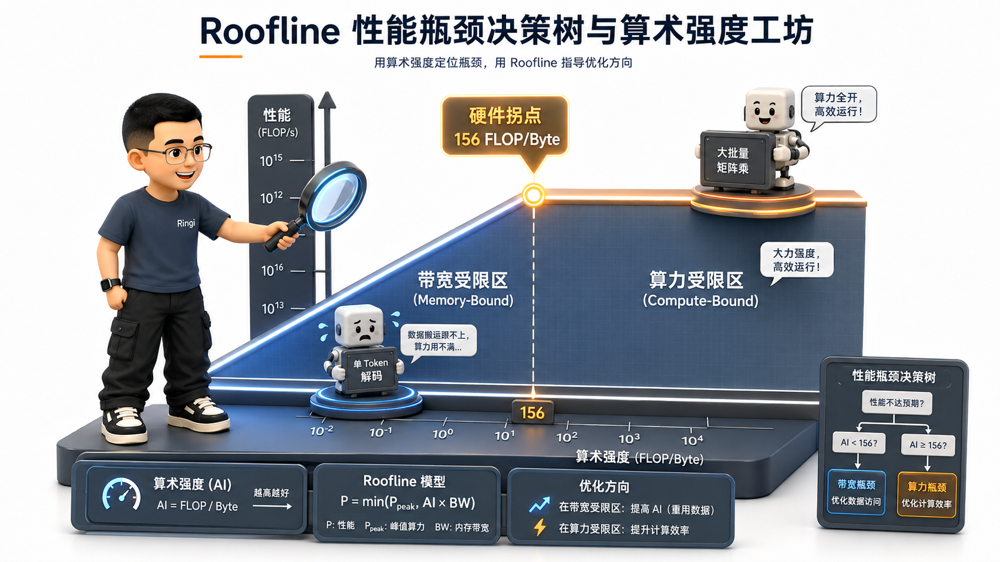

# 🏛️ 第10讲：AI Infra 性能工程方法论与三账本——FLOPs、显存与通信

> **主讲人**：👓 **Ringi**（大厂 AI Infrastructure 工程师）  
> **所属模块**：[Module 00: 性能工程与系统前置](./README.md)  
> **篇章范式**：🏛️ 性能工程与系统前置篇（Performance Engineering & System Baseline）  
> **核心导读**：一个顶级的 AI Infra 工程师与普通算法调包侠之间，最根本的分水岭是什么？不是看谁能背出更多的 PyTorch API，而是看谁拥有**“在写下第一行代码前，就能在草稿纸上精确算清整个系统算力、显存与网络通信物理账本”的硬核内功**！  
> 很多初入大厂的同学，面对一个全新的大模型训练或推理任务时，往往两眼一抹黑：不知道该申请 8 张卡还是 64 张卡、不知道 Batch Size 设多大才不会 OOM、不知道 `nvidia-smi` 里的 GPU-Util 99% 背后其实隐藏着极其严重的内存等待、更不知道集群训练速度慢究竟是卡在 Tensor Core 算力不足、显存带宽受限（Memory-Bound）还是被跨机 AllReduce 网络活活拖垮。  
> 性能工程的本质就是“算账”。本讲作为 Module 00 的终极集大成篇，我们将彻底告别盲目试错，用极客大白话、生活直觉比喻、手把手极简数字算盘与 Roofline 物理模型，带你手撕大模型 **算力账本（$2P/6P/8P$）、显存四账本与跨卡通信账本**，彻底掌握千卡集群资源规划的最高心法！


```text
=================================================================================================
                                   Ringi 3D 架构工坊 · 核心全景
┌───────────────────────────────────────────────────────────────────────────────────────────────┐
│                                                                                               │
│  [ AI Infra 性能工程三大支柱账本与 Roofline 决策引擎 ]                                        │
│                                                                                               │
│  ┌─────────────────────────┐   ┌─────────────────────────┐   ┌─────────────────────────────┐  │
│  │ 💰 1. 算力计算量账本    │   │ 📦 2. 显存容量与吞吐账本│   │ 🌐 3. 跨卡跨机通信账本      │  │
│  │    (Compute Ledger)     │   │    (Memory Ledger)      │   │    (Communication Ledger)   │  │
│  ├─────────────────────────┤   ├─────────────────────────┤   ├─────────────────────────────┤  │
│  │ • 推理: 2P FLOPs/token  │   │ • 权重: 2B (FP16/BF16)  │   │ • DDP: 2(P-1)/P * M         │  │
│  │ • 训练: 6P FLOPs/token  │   │ • 梯度: 2B (FP16)       │   │ • TP : 4(TP-1)/TP * M       │  │
│  │ • 重算: 8P FLOPs/token  │   │ • 优化器: 16B (AdamW)   │   │ • ZeRO-3: 3(P-1)/P * M      │  │
│  │ • GEMM: 2MKN FLOPs      │   │ • 动态: Act + KV Cache  │   │ • MoE: 2(E-1)/E * M         │  │
│  └────────────┬────────────┘   └────────────┬────────────┘   └──────────────┬──────────────┘  │
│               │                             │                               │                 │
│               └──────────────────────────┐  │  ┌────────────────────────────┘                 │
│                                          ▼  ▼  ▼                                              │
│  ┌─────────────────────────────────────────────────────────────────────────────────────────┐  │
│  │ 📊 核心性能归因引擎：Roofline 算术强度模型 (Operational / Arithmetic Intensity)          │  │
│  │                                                                                         │  │
│  │             实际性能 (TFLOPS) ▲   ┌─────────────────────────────── 算力上限 (Peak TFLOPS)│  │
│  │                              │  / (Compute-Bound: GEMM, Prefill, 提升 MFU)             │  │
│  │                              │ /                                                        │  │
│  │                              │/ 硬件拐点 (Turning Point = Peak TFLOPS / Peak BW)        │  │
│  │                              /                                                          │  │
│  │                             / (Memory-Bound: Decode, Norm, 算子融合, 压 KV Cache)       │  │
│  │                            /                                                            │  │
│  │  ─────────────────────────┴────────────────────────────────────────► 算术强度 (FLOP/B)│  │
│  │                                                                                         │  │
│  │  🌟 终极度量标准: MFU (Model FLOPs Utilization) ≡ (6P * Tokens / Time) / Peak_Cluster_FLOPS │
│  └─────────────────────────────────────────────────────────────────────────────────────────┘  │
│                                                                                               │
└───────────────────────────────────────────────────────────────────────────────────────────────┘
=================================================================================================
```

<!-- more -->

## 📑 目录导航

- [0. Ringi 开场：系统调优的第一步不是写代码，而是“算账”！](#0-ringi-开场系统调优的第一步不是写代码而是算账)
  - [0.1 汽车改装与赛道账本比喻：为什么 AI Infra 工程师必须精通算账？](#01-汽车改装与赛道账本比喻为什么-ai-infra-工程师必须精通算账)
  - [0.2 线上真实惨案：资源预估偏差 3 倍引发的千万元算力预算打水漂事故](#02-线上真实惨案资源预估偏差-3-倍引发的千万元算力预算打水漂事故)
  - [0.3 AI Infra 核心性能指标与大厂 SLO 映射全景表](#03-ai-infra-核心性能指标与大厂-slo-映射全景表)
- [1. 核心性能指标体系与大厂 SLO 深度解构](#1-核心性能指标体系与大厂-slo-深度解构)
  - [1.1 吞吐量指标：Tokens/s、Samples/s 与集群吞吐](#11-吞吐量指标tokenss-sampless-与集群吞吐)
  - [1.2 时延指标：TTFT（首字延迟）、TPOT（字间延迟）与 P99 长尾分布](#12-时延指标ttft首字延迟-tpot字间延迟与-p99-长尾分布)
  - [1.3 算力利用率：TFLOPS、HFU 与 MFU 的第一性原理与数学推导](#13-算力利用率tflops-hfu-与-mfu-的第一性原理与数学推导)
  - [1.4 惊天谎言：为什么 `nvidia-smi` 里的 GPU-Util 99% 根本不代表卡跑满了？！](#14-惊天谎言为什么-nvidia-smi-里的-gpu-util-99-根本不代表卡跑满了)
- [2. 账本一：算力计算量账本（Compute Ledger）](#2-账本一算力计算量账本compute-ledger)
  - [2.1 单次 GEMM 矩阵乘法的计算量为什么是 $2MKN$ FLOPs？](#21-单次-gemm-矩阵乘法的计算量为什么是-2mkn-flops)
  - [2.2 大模型推理单 Token 计算量推导：为什么是 $2P$ FLOPs/token？](#22-大模型推理单-token-计算量推导为什么是-2p-flopstoken)
  - [2.3 大模型训练单 Token 计算量推导：为什么前向 $2P$ + 反向 $4P$ = $6P$ FLOPs/token？](#23-大模型训练单-token-计算量推导为什么前向-2p--反向-4p--6p-flopstoken)
  - [2.4 激活值重计算下的计算量膨胀：为什么 Full Checkpointing 会变成 $8P$ FLOPs？](#24-激活值重计算下的计算量膨胀为什么-full-checkpointing-会变成-8p-flops)
- [3. 账本二：显存容量与吞吐账本（Memory Ledger）](#3-账本二显存容量与吞吐账本memory-ledger)
  - [3.1 静态显存四账本：Weights、Gradients、AdamW 优化器（16 Bytes/param）与 Master Weights](#31-静态显存四账本weights-gradients-adamw-优化器16-bytesparam-与-master-weights)
  - [3.2 动态显存账本 1：前向激活值（Activations）显存精细手算公式](#32-动态显存账本-1前向激活值activations显存精细手算公式)
  - [3.3 动态显存账本 2：推理 KV Cache 显存手算公式与并发海啸](#33-动态显存账本-2推理-kv-cache-显存手算公式与并发海啸)
  - [3.4 动态显存账本 3：临时工作区（Workspace Buffers）与显存碎片留白](#34-动态显存账本-3临时工作区workspace-buffers与显存碎片留白)
- [4. 账本三：跨卡跨机通信账本（Communication Ledger）](#4-账本三跨卡跨机通信账本communication-ledger)
  - [4.1 数据并行（DDP）通信量手算：每步 $2 \frac{P-1}{P} M$ 梯度传输](#41-数据并行ddp通信量手算每步-2-fracp-1p-m-梯度传输)
  - [4.2 张量并行（TP）通信量手算：每层 Block $4 \times \frac{\text{TP}-1}{\text{TP}} M$ 激活传输](#42-张量并行tp通信量手算每层-block-4-times-fractexttp-1texttp-m-激活传输)
  - [4.3 ZeRO-3 / FSDP 通信量手算：前向 AllGather + 反向 AllGather + 梯度 ReduceScatter 的 $3 \times \frac{P-1}{P} M$ 账本](#43-zero-3--fsdp-通信量手算前向-allgather--反向-allgather--梯度-reducescatter-的-3-times-fracp-1p-m-账本)
  - [4.4 MoE 专家并行通信量手算：双向 AllToAll 的数据吞吐开销](#44-moe-专家并行通信量手算双向-alltoall-的数据吞吐开销)
  - [4.5 通信计算重叠率（Overlap Ratio）与通信隐藏临界点](#45-通信计算重叠率overlap-ratio与通信隐藏临界点)
- [5. 性能瓶颈归因：Roofline 算术强度模型与决策树](#5-性能瓶颈归因roofline-算术强度模型与决策树)
  - [5.1 Roofline 物理模型坐标系的人话直觉（横轴 FLOP/Byte vs 纵轴 TFLOPS）](#51-roofline-物理模型坐标系的人话直觉横轴-flopbyte-vs-纵轴-tflops)
  - [5.2 硬件拐点（Turning Point）计算公式与物理意义](#52-硬件拐点turning-point计算公式与物理意义)
  - [5.3 三大性能瓶颈归因决策树：Compute-Bound、Memory-Bound 与 Comm/Launch-Bound](#53-三大性能瓶颈归因决策树compute-bound-memory-bound-与-commlaunch-bound)
  - [5.4 性能优化策略速查矩阵：不同瓶颈下的武器库](#54-性能优化策略速查矩阵不同瓶颈下的武器库)
- [6. 工业级白板大实战：LLaMA-2/3 7B 与 70B 全生命周期资源大算盘](#6-工业级白板大实战llama-23-7b-与-70b-全生命周期资源大算盘)
  - [6.1 实战 1：单台 8 卡 A100-80GB 训练 LLaMA-7B 的显存四账本与 MFU 预测](#61-实战-1单台-8-卡-a100-80gb-训练-llama-7b-的显存四账本与-mfu-预测)
  - [6.2 实战 2：64 卡 H100 训练 70B 模型的 3D 并行切分（TP+PP+DP）与吞吐手算](#62-实战-264-卡-h100-训练-70b-模型的-3d-并行切分tppppp与吞吐手算)
  - [6.3 实战 3：单卡推理 70B 模型（FP16 vs INT4 量化）支持的最大并发 Batch Size 规划](#63-实战-3单卡推理-70b-模型fp16-vs-int4-量化支持的最大并发-batch-size-规划)
- [7. 动手实战与代码实验室（Minimal Runnable Code）](#7-动手实战与代码实验室minimal-runnable-code)
  - [7.1 实验 1：真实测算单个 GEMM 算子的物理 TFLOPS 与 MFU 计算器](#71-实验-1真实测算单个-gemm-算子的物理-tflops-与-mfu-计算器)
  - [7.2 实验 2：大模型训练静态与动态显存预测模拟脚本](#72-实验-2大模型训练静态与动态显存预测模拟脚本)
  - [7.3 实验 3：Roofline 性能分析与不同算子算术强度（AI）定位测试](#73-实验-3roofline-性能分析与不同算子算术强度ai定位测试)
  - [7.4 实验 4：7B/70B 大模型集群资源规划与成本估算器](#74-实验-47b70b-大模型集群资源规划与成本估算器)
- [8. Ringi 避坑指南与生产最佳实践](#8-ringi-避坑指南与生产最佳实践)
  - [8.1 避坑表格（❌ 常见小白错误理解 vs ✅ 大厂 AI Infra 正确理解）](#81-避坑表格-常见小白错误理解-vs--大厂-ai-infra-正确理解)
  - [8.2 生产性能工程黄金 Checklist](#82-生产性能工程黄金-checklist)
- [9. Ringi 5 点核心速记口诀、自我检验清单与课后深度思考题](#9-ringi-5-点核心速记口诀自我检验清单与课后深度思考题)
- [10. 📚 参考资料与核心源码/经典论文指引](#10--参考资料与核心源码经典论文指引)
- [附录：Appendix A — 大厂硬核高频面试题与白板推导（Interview Drill）](#附录appendix-a--大厂硬核高频面试题与白板推导interview-drill)

---

# 0. Ringi 开场：系统调优的第一步不是写代码，而是“算账”！

## 0.1 汽车改装与赛道账本比喻：为什么 AI Infra 工程师必须精通算账？

假设你是一位世界顶级的赛车改装总工程师。车队准备参加一场 500 公里的拉力赛：
- 你会在比赛前一天盲目地把油箱加满，然后跟赛车手说：“你上去随便开，开到哪算哪，跑慢了我们再换发动机”吗？
- 绝对不可能！在发车前，你必须在战术板上精确计算好每一笔账：**每圈消耗多少升燃油（算力/能耗账本）、轮胎磨损极限在第几圈（显存账本）、进站加油换胎需要多少秒（通信/IO 账本）**。只有把这三本账算到毫秒级，车队才能夺冠！

在 AI Infra 领域也是完全相同的道理：
- 一台装配了 8 张 NVIDIA H100 的服务器售价高达上百万元，集群租金每小时都在飞速燃烧美金；
- **一个合格的 AI Infra 工程师，绝不能靠盲目尝试去调优系统！** 在你提交训练任务或上线推理服务之前，你必须能够用一张纸、一支笔，在 3 分钟内精准手算出：这个模型需要消耗多少 TFLOPS 算力、显存峰值会不会突破 80GB、跨机网络传输会不会卡死流水线！

---

## 0.2 线上真实惨案：资源预估偏差 3 倍引发的千万元算力预算打水漂事故

在参与某大厂千亿大模型预训练集群规划时，我曾亲历过一起因“不会算账”而导致的重大事故：

- **业务需求**：算法团队计划在 3 个月内预训练一个 70B 模型，目标训练数据量为 **2 万亿（2T）Tokens**；
- **草率估算**：负责人简单拍脑袋：“70B 模型嘛，我们租 128 张 A100-80GB 显卡跑 3 个月肯定够了”；
- **残酷现实**：任务上线跑了一个月后，发现才刚刚跑完 20% 的进度！
- **血淋淋的物理账本复盘**：
  1. 训练 70B 模型需要总算力：$C = 6P \times \text{Tokens} = 6 \times 70 \times 10^9 \times 2 \times 10^{12} = \mathbf{8.4 \times 10^{23}\text{ FLOPs}}$；
  2. 128 张 A100 即使在极限 50% MFU 效率下，每秒总算力仅为：$128 \times 312\text{ TFLOPS} \times 50\% \approx \mathbf{20,000\text{ TFLOPS}}$；
  3. 跑完 2T Tokens 所需的物理净时间为：
     $$
     \text{Time} = \frac{8.4 \times 10^{23}}{20,000 \times 10^{12}} = 4.2 \times 10^7\ \text{s} \approx \mathbf{486\ \text{days} \approx 16\ \text{months}}
     $$
- **后果**：原本规划 3 个月的项目延期了整整一年多，不得不紧急追加采购 512 张 GPU，浪费了数千万元的算力闲置与违约成本！

---

## 0.3 AI Infra 核心性能指标与大厂 SLO 映射全景表

| 核心性能指标 | 英文全称 / 度量单位 | 业务层关注的核心含义 | Infra 底层决定的核心物理瓶颈 |
| :--- | :--- | :--- | :--- |
| **TTFT** | Time To First Token（毫秒 ms） | 用户发出请求到屏幕出现**第 1 个字**的延迟（首字响应速度） | **Prefill 阶段算力受限（Compute-Bound）** + Prompt 长度 |
| **TPOT / ITL** | Time Per Output Token / Inter-Token Latency（ms/token） | 模型每吐出**下一个字**的平均耗时（打字机流式体验） | **Decode 阶段显存带宽受限（Memory-Bound）** + KV Cache 读取 |
| **Throughput** | Tokens/s 或 Requests/s | 系统在单卡或集群上单位时间内生成的总 Token 数量 | 批大小 Batch Size、张量并行通信与 PagedAttention 显存利用率 |
| **TFLOPS** | Tera Floating-point Operations Per Second | GPU 硬件每秒钟实际执行的万亿次浮点运算次数 | 算子 Tiling 效率、Tensor Core 占空比与访存延迟隐藏 |
| **MFU** | Model FLOPs Utilization（百分比 %） | 模型有效计算量占 GPU 理论峰值算力的比例（**行业最高黄金标准**） | 算子融合、通信气泡（Bubble）、内存搬运开销与 CPU 发射瓶颈 |

---

# 1. 核心性能指标体系与大厂 SLO 深度解构

## 1.1 吞吐量指标：Tokens/s、Samples/s 与集群吞吐

- **训练吞吐（Training Throughput）**：通常用 `Samples/sec`（每秒训练多少条样本）或 `Tokens/sec/GPU`（单卡每秒消费多少 Token）衡量；
- **推理吞吐（Serving Throughput）**：衡量单个推理节点在满足延迟约束（SLO）的前提下，每秒钟能够并发生成的总 `Output Tokens/sec`。

---

## 1.2 时延指标：TTFT（首字延迟）、TPOT（字间延迟）与 P99 长尾分布

在大模型在线服务（LLM Serving）中，用户体验被拆解为两个截然不同的物理时延：

```text
[ 用户发送 Prompt: 2048 Tokens ] ──► (GPU 满载 GEMM 计算 Prefill) ──► [ 出现第 1 个字: TTFT 耗时 150ms ]
                                                                                   │
                                      ┌────────────────────────────────────────────┘
                                      ▼
[ 逐字流式吐词 Decode ] ──► "你" (30ms) ──► "好" (30ms) ──► "呀" (30ms) ──► [ TPOT 耗时 30ms/token ]
```

- **TTFT（Time To First Token）**：由 **Prefill 阶段** 决定。因为要一次性处理用户输入的全部上下文，计算量极大，属于 **算力受限（Compute-Bound）**；
- **TPOT（Time Per Output Token）**：由 **Decode 阶段** 决定。每一步只生成 1 个 Token，但每一步都要把几十 GB 的模型权重完整搬运一遍，属于 **显存带宽受限（Memory-Bound）**；
- **P99 长尾延迟（Tail Latency）**：在大并发下，99% 的请求都能在几秒内返回，但由于显存碎片或排队阻塞，最后 1% 的请求可能会卡死几十秒。

---

## 1.3 算力利用率：TFLOPS、HFU 与 MFU 的第一性原理与数学推导

在大厂性能评测中，衡量一个分布式训练系统是否顶级，**唯一公认的硬核指标就是 MFU（Model FLOPs Utilization）**。


### 1. 硬件理论峰值算力（Peak Hardware TFLOPS）
以 NVIDIA A100-SXM4-80GB 为例：
- FP32 传统 CUDA Core 算力：$19.5\text{ TFLOPS}$；
- **BF16 / FP16 Tensor Core 密集算力：$312\text{ TFLOPS}$**（不考虑稀疏化）。

### 2. 硬件浮点利用率（HFU, Hardware FLOPs Utilization）
$$
\text{HFU} = \frac{\text{Actual FLOPs Executed (incl. Recompute)}}{\text{Peak GPU FLOPS} \times \text{Step Time}}
$$

> 人话拆解：分子是硬件实际执行的所有浮点运算次数（包含激活重计算开销）；分母是 GPU 理论峰值算力 × Step 耗时。

### 3. 模型浮点利用率（MFU, Model FLOPs Utilization，最高准则）
$$
\boxed{\Large \text{MFU} = \frac{\text{Minimal Theoretical FLOPs}\ (6P)}{\text{Peak Cluster FLOPS} \times \text{Step Time}}}
$$

> 💡 **Ringi 工程师第一性原理**：  
> - 如果你为了省显存开启了**激活值全重计算（Full Checkpointing）**，硬件实际上多算了 $2P$ 的计算量（总计算量变成了 $8P$）；
> - 此时，`HFU` 会显得很高（因为 GPU 确实在拼命多算），但 **`MFU` 严格只除以理论净计算量 $6P$**！
> - **只有 MFU 才能真实反映你消耗的电费和美金到底有多少转化为了有效的训练进度！** 在大厂万卡集群上，MFU 能够达到 **50%~55%** 就属于世界顶级水准。

---

## 1.4 惊天谎言：为什么 `nvidia-smi` 里的 GPU-Util 99% 根本不代表卡跑满了？！

这是无数小白工程师最容易犯的致命误区：

```text
$ nvidia-smi
| GPU  Name        Persistence-M| Bus-Id        Disp.A | Volatile Uncorr. ECC |
| Fan  Temp  Perf  Pwr:Usage/Cap|         Memory-Usage | GPU-Util  Compute M. |
|===============================+======================+======================|
|   0  NVIDIA A100-SXM...  On   | 00000000:01:00.0 Off |                    0 |
| N/A   45C    P0   120W / 400W |  24500MiB / 81920MiB |    99%      Default  |
```

> 💥 **Ringi 揭秘底层硬件真相**：  
> - `nvidia-smi` 中的 `GPU-Util` 采样指标，其底层定义是：**在过去 1 秒钟内，GPU 内部至少有 1 个 Warp 处于活动状态的时间百分比**！
> - **如果你的代码在每个 Step 都从 HBM 慢速读取显存，或者卡在 Python CPU Launch 发射瓶颈上，GPU 核心处于 90% 的空转等待（Warp Stalled on Memory），但因为内核尚未结束，`nvidia-smi` 依然会极其讽刺地显示 `GPU-Util: 99%`！**
> - **看 GPU 真实利用率的唯一权威指标是：实际算力 TFLOPS / MFU 与 GPU 功耗瓦数（Power Usage）！**

---

# 2. 账本一：算力计算量账本（Compute Ledger）

现在我们手把手推导 AI 性能工程最著名的 **$2P / 6P / 8P$ 计算量法则**。

## 2.1 单次 GEMM 矩阵乘法的计算量为什么是 $2MKN$ FLOPs？

设有两个矩阵相乘：$A \in \mathbb{R}^{M \times K}$ 与 $B \in \mathbb{R}^{K \times N}$，相乘得到 $C \in \mathbb{R}^{M \times N}$。

### 🔢 极简数字小算盘推导：
1. 输出矩阵 $C$ 总共有 $M \times N$ 个元素；
2. 为了计算 $C$ 中的每一个元素 $C[i][j]$，需要将 $A$ 的第 $i$ 行（长为 $K$）与 $B$ 的第 $j$ 列（长为 $K$）做向量内积：
   $$
   C[i][j] = \sum_{k=1}^K A[i][k] \times B[k][j]
   $$
3. 计算这一个元素需要：
   - $K$ 次乘法（Multiply）；
   - $K - 1 \approx K$ 次加法（Add）；
   - 总计需要 **$2K$ 次浮点运算（FLOPs）**！
4. **总计算量推导**：
   $$
   \boxed{\text{FLOPs}_{\text{GEMM}} = 2 \times M \times K \times N}
   $$

---

## 2.2 大模型推理单 Token 计算量推导：为什么是 $2P$ FLOPs/token？

设一个 Transformer 模型的总参数量为 $P$（以 70B 模型为例，$P = 70 \times 10^9$）：

1. 在自回归推理（Decode 阶段）生成 **1 个 Token** 时，输入张量维度为 $(1, d)$；
2. 输入向量需要与模型中所有的全连接权重矩阵（$W_Q, W_K, W_V, W_O, W_{\text{gate}}, W_{\text{up}}, W_{\text{down}}$）依次进行矩阵相乘（GEMV）；
3. 对于每一个参数矩阵 $W \in \mathbb{R}^{K \times N}$，输入为 $(1, K)$，其计算量为：
   $$
   2 \times 1 \times K \times N = 2 \times (K \times N)\ \text{FLOPs}
   $$
4. 将全模型所有层的参数矩阵累加求和，忽略占比不足 1% 的 LayerNorm 和 Softmax：
   $$
   \boxed{\Large \text{FLOPs}_{\text{Inference per Token}} \approx 2P}
   $$

> 💡 **极简直觉记忆**：**大模型推理生成 1 个 Token，相当于让模型的每一个参数都参与了 1 次乘法和 1 次加法（共 2 次浮点运算）！**

---

## 2.3 大模型训练单 Token 计算量推导：为什么前向 $2P$ + 反向 $4P$ = $6P$ FLOPs/token？

在模型训练过程中，每个 Token 的生命周期包含 **前向传播（Forward）** 与 **反向传播（Backward）** 两个阶段：

```text
┌────────────────────────────────────────────────────────────────────────┐
│               训练单 Token 的 6P 计算量账本分解                         │
├────────────────────────────────────────────────────────────────────────┤
│  1. 前向传播 Forward Pass: Y = X * W           ──► 计算量: 2P FLOPs   │
│  2. 反向传播 Backward 阶段 1: 算输入梯度 dX = dY * W^T  ──► 计算量: 2P FLOPs   │
│  3. 反向传播 Backward 阶段 2: 算权重梯度 dW = X^T * dY  ──► 计算量: 2P FLOPs   │
├────────────────────────────────────────────────────────────────────────┤
│  🏆 训练单 Token 理论总计算量 = 2P + 2P + 2P = 6P FLOPs/token           │
└────────────────────────────────────────────────────────────────────────┘
```

> 📌 **Ringi 工程师第一性原理**：  
> 反向传播的计算量恰好是前向传播的 **整整 2 倍（$4P$）**！因为反向传播必须执行两次独立的矩阵乘法：一次用于将梯度传给浅层（算 $\frac{\partial \mathcal{L}}{\partial X}$），另一次用于更新本地权重参数（算 $\frac{\partial \mathcal{L}}{\partial W}$）。

---

## 2.4 激活值重计算下的计算量膨胀：为什么 Full Checkpointing 会变成 $8P$ FLOPs？

在大模型训练中，为了防止反向传播保存过多中间激活值而导致显存 OOM，业界普遍采用 **激活值重计算（Activation Checkpointing）**：
- **前向计算**：正常执行一次前向（$2P$ FLOPs），但**不保存任何 Block 的中间激活值**；
- **反向计算**：在反向求导到达某一层之前，**重新跑一遍该层的前向计算（多花 $2P$ FLOPs）**，再立即执行反向梯度求解（$4P$ FLOPs）；
- **总计算量膨胀**：
  $$
  \text{Total FLOPs}_{\text{Recompute}} = 2P + 2P + 4P = \mathbf{8P\ \text{FLOPs/token}}
  $$
- **性能代价（Trade-off）**：计算量增加了 $\frac{8P - 6P}{6P} = \mathbf{33.3}\%}$，但换来了显存占用从 $O(L)$ 到 $O(1)$ 的惊人飞跃！

---

# 3. 账本二：显存容量与吞吐账本（Memory Ledger）

在大模型系统中，显存消耗可以被绝对清晰地划分为 **静态显存** 与 **动态显存** 两大部分。


---

## 3.1 静态显存四账本：Weights、Gradients、AdamW 优化器（16 Bytes/param）与 Master Weights

以标准混合精度训练（Mixed Precision Training, FP16/BF16）为例，每个参数 $P$ 在显存中对应四笔不可动摇的刚性开销：

| 显存账户名称 | 数据类型（Dtype） | 单参数显存占用 | 7B 模型静态开销 | 70B 模型静态开销 | 物理存在原因与生命周期 |
| :--- | :--- | :---: | :---: | :---: | :--- |
| **1. 模型权重 (Weights)** | FP16 / BF16 | $2\text{ Bytes}$ | **14 GB** | **140 GB** | 前向与反向计算必须常驻显存 |
| **2. 梯度张量 (Gradients)** | FP16 / BF16 | $2\text{ Bytes}$ | **14 GB** | **140 GB** | 反向求导累加梯度，供优化器更新 |
| **3. FP32 主权重 (Master Weights)**| FP32 | $4\text{ Bytes}$ | **28 GB** | **280 GB** | 解决小梯度下溢，维持权重高精度累加 |
| **4. 一阶动量 (Momentum $m$)** | FP32 | $4\text{ Bytes}$ | **28 GB** | **280 GB** | AdamW 记录梯度的指数移动平均 |
| **5. 二阶动量 (Variance $v$)** | FP32 | $4\text{ Bytes}$ | **28 GB** | **280 GB** | AdamW 记录梯度平方的指数移动平均 |
| **🏆 静态显存总计** | - | **$16\sim 18\text{ Bytes/param}$** | **$\approx 112\sim 126\text{ GB}$** | **$\approx 1120\sim 1260\text{ GB}$** | **训练静态底座（单卡 80GB 必爆！）** |

---

## 3.2 动态显存账本 1：前向激活值（Activations）显存精细手算公式

前向计算过程中，算子（如 RMSNorm、Attention Softmax、SwiGLU）产生的中间输出张量必须被暂存在显存中，供反向传播求导使用。

设单层 Transformer Block 的配置为：批大小 $b$，序列长度 $s$，隐藏维度 $h$，头数 $a$：
- 未开启 FlashAttention 时的单层激活值显存：
  $$
  \text{Act}_{\text{layer}} = s \cdot b \cdot h \cdot \left( 34 + 5 \frac{a \cdot s}{h} \right)\ \text{Bytes}
  $$
- **开启 FlashAttention-2 后**（消灭了 $s \times s$ 中间矩阵存储）：
  $$
  \text{Act}_{\text{layer}} \approx 19 \times b \cdot s \cdot h \text{ Bytes}
  $$

---

## 3.3 动态显存账本 2：推理 KV Cache 显存手算公式与并发海啸

在 LLM 在线推理服务中，KV Cache 是随并发请求与序列长度疯狂膨胀的显存巨兽：

$$
\boxed{\Large \text{Mem}_{\text{KV Cache}} = 2 \times b \times s \times L \times h_{\text{kv}} \times d_k \times \text{Bytes}}
$$

### 🔢 极简数字小算盘手算（LLaMA-3-70B，采用 GQA）：
- 配置：$L=80$ 层，KV 头数 $h_{\text{kv}}=8$，单头维度 $d_k=128$，FP16 占 2 字节；
- 单 Token 的 KV Cache 显存为：
  $$
  2 \times 80 \times 8 \times 128 \times 2 = \mathbf{327,680\text{ Bytes}} = \mathbf{320\text{ KB/token}}
  $$
- 当并发批大小 $b = 32$，上下文长度 $s = 4096$ 时：
  $$
  32 \times 4096 \times 320\text{ KB} \approx \mathbf{41.94\text{ GB}}!
  $$

---

## 3.4 动态显存账本 3：临时工作区（Workspace Buffers）与显存碎片留白

在 GPU 运行时中，cuBLAS / CUTLASS 矩阵乘法、NCCL 集合通信缓冲区通常需要预留 **$1 \sim 4\text{ GB}$ 的 Workspace 临时显存**。  
此外，为了防止 PyTorch 显存分配器碎片化引发虚假 OOM，**线上生产系统必须保留至少 10%~15% 的显存安全余量（Headroom）**！

---

# 4. 账本三：跨卡跨机通信账本（Communication Ledger）

在大模型分布式训练中，不同并行范式的跨卡网络通信量可以通过参数量 $M$ 进行精确量化：

| 分布式并行范式 | 触发的集合通信原语 | 单步每个 GPU 发送的数据量公式 | 备注与优化要点 |
| :--- | :--- | :---: | :--- |
| **DDP（数据并行）** | `AllReduce` | $2 \times \frac{P-1}{P} M_{\text{grad}} \approx \mathbf{2 M}$ | 传输全量梯度，利用 Bucket 异步隐藏 |
| **TP（张量并行）** | `AllReduce` | $4 \times L \times \frac{\text{TP}-1}{\text{TP}} \times (b \cdot s \cdot h)$ | 每层 2 次 AllReduce，必须在机内 NVLink 跑 |
| **ZeRO-3 / FSDP** | `AllGather` + `ReduceScatter` | $3 \times \frac{P-1}{P} M_{\text{param}} \approx \mathbf{3 M}$ | 前向拉权重(1M) + 反向拉权重(1M) + 梯度分片(1M) |
| **MoE 专家并行** | `AllToAll` | $2 \times \frac{E-1}{E} \times (\text{Tokens} \times h)$ | 双向分发与回收 Token 特征 |

---

# 5. 性能瓶颈归因：Roofline 算术强度模型与决策树

## 5.1 Roofline 物理模型坐标系的人话直觉（横轴 FLOP/Byte vs 纵轴 TFLOPS）

Roofline（屋顶线模型，Williams et al., 2009）是计算机体系结构中定位一切性能瓶颈的最高裁判所：



- **横坐标：算术强度（Operational / Arithmetic Intensity, AI）**：
  $$
  \text{AI} = \frac{\text{FLOPs Computed}}{\text{Bytes Moved (HBM R/W)}} \quad (\text{unit: FLOP/Byte})
  $$
  - **人话解释**：**“每从慢速显存里搬运 1 个字节的数据，GPU 核心能对它做多少次计算？”**
- **纵坐标：实际性能（Attainable Performance）**：以 `TFLOPS` 为单位的实际计算吞吐。

---

## 5.2 硬件拐点（Turning Point）计算公式与物理意义

屋顶由斜坡（带宽上限）和天花板（算力上限）构成，两者的交点就是 **硬件物理拐点（Turning Point, $I_{\text{knee}}$）**：

$$
\boxed{\Large I_{\text{knee}} = \frac{\text{Peak Compute Performance (TFLOPS)}}{\text{Peak Memory Bandwidth (TB/s)}}}
$$

### 🔢 顶级 GPU 硬件拐点手算：
1. **NVIDIA A100-SXM4-80GB**：
   - 峰值算力：$312\text{ TFLOPS}$ (BF16 Tensor Core)
   - 显存带宽：$2.0\text{ TB/s}$ (HBM2e)
   $$
   I_{\text{knee}}^{\text{A100}} = \frac{312 \times 10^{12}}{2.0 \times 10^{12}} = \mathbf{156\text{ FLOP/Byte}}
   $$
2. **NVIDIA H100-SXM5-80GB**：
   - 峰值算力：$989\text{ TFLOPS}$ (FP16/BF16 Dense)
   - 显存带宽：$3.35\text{ TB/s}$ (HBM3)
   $$
   I_{\text{knee}}^{\text{H100}} = \frac{989 \times 10^{12}}{3.35 \times 10^{12}} = \mathbf{295.2\text{ FLOP/Byte}}
   $$

---

## 5.3 三大性能瓶颈归因决策树：Compute-Bound、Memory-Bound 与 Comm/Launch-Bound

```text
┌────────────────────────────────────────────────────────────────────────┐
│                        AI Infra 性能瓶颈诊断决策树                      │
├────────────────────────────────────────────────────────────────────────┤
│  [ 计算当前算子的算术强度 AI ]                                          │
│         │                                                              │
│         ├─► AI > I_knee (如大 Batch GEMM, AI = 200~500)                 │
│         │   └──► 处于天花板区: 【Compute-Bound 算力受限】                │
│         │        └── 优化方向: Tensor Core 调度、Tiling 分块、提升 MFU │
│         │                                                              │
│         ├─► AI < I_knee (如单 Token Decode, RMSNorm, Softmax, AI = 1~5)│
│         │   └──► 处于斜坡区: 【Memory-Bound 访存带宽受限】              │
│         │        └── 优化方向: FlashAttention、算子融合 (Fusion)、量化  │
│         │                                                              │
│         └─► GPU 功耗极低、SM 利用率空转 (< 30%)                        │
│             └──► 处于地基下陷区: 【Communication / Launch-Bound 阻塞】 │
│                  └── 优化方向: CUDA Graph、通信计算重叠、消除 .item()   │
└────────────────────────────────────────────────────────────────────────┘
```

---

# 6. 工业级白板大实战：LLaMA-2/3 7B 与 70B 全生命周期资源大算盘

## 6.1 实战 1：单台 8 卡 A100-80GB 训练 LLaMA-7B 的显存四账本与 MFU 预测

### 1. 显存规划手算：
- 静态参数（BF16）：$14\text{ GB}$；
- 梯度（BF16）：$14\text{ GB}$；
- AdamW 优化器状态（FP32）：$112\text{ GB}$；
- 采用 **ZeRO-2 显存切分（8 卡均摊）**：
  - 每张卡分摊的优化器显存：$112 \div 8 = \mathbf{14\text{ GB}}$；
  - 每张卡分摊的梯度显存：$14 \div 8 = \mathbf{1.75\text{ GB}}$；
  - 单卡静态显存底座：$14 + 14 + 1.75 = \mathbf{29.75\text{ GB}}$；
- 剩余可用显存：$80 - 29.75 - 4\text{ (Workspace)} \approx \mathbf{46.25\text{ GB}}$，足以容纳 $b=4, s=4096$ 的动态激活值！

---

## 6.2 实战 2：64 卡 H100 训练 70B 模型的 3D 并行切分（TP+PP+DP）与吞吐手算


- **集群拓扑**：8 台 H100-SXM5 服务器（共 64 张卡）；
- **3D 并行切分策略**：
  - **TP（张量并行）= 8**：严格限制在单机 8 卡内部（NVLink 900GB/s）；
  - **PP（流水线并行）= 4**：跨机切分为 4 个 Stage（每 2 台机器 16 卡为一个 Stage）；
  - **DP / ZeRO-1（数据并行）= 2**：全集群跨 2 个副本数据并行；
  - **验证**：$\text{TP} \times \text{PP} \times \text{DP} = 8 \times 4 \times 2 = \mathbf{64}$ 卡！
- **单步吞吐与 MFU 预测**：
  - 目标 MFU 设定为业界顶级 **52%**；
  - 单卡有效算力：$989\text{ TFLOPS} \times 52\% \approx 514\text{ TFLOPS}$；
  - 64 卡集群每秒训练 Token 数：
    $$
    \text{Throughput} = \frac{64 \times 514 \times 10^{12}\text{ FLOP/s}}{6 \times 70 \times 10^9\text{ FLOP/token}} \approx \mathbf{78,323\text{ Tokens/s}}
    $$

---

# 7. 动手实战与代码实验室（Minimal Runnable Code）

下面我们通过 4 个纯原生、不依赖额外复杂工具的 Python 实验，亲手运行大模型性能工程的算力与显存预测模拟！

---

## 7.1 实验 1：真实测算单个 GEMM 算子的物理 TFLOPS 与 MFU 计算器

```python
import time
import torch

def benchmark_gemm_mfu():
    print(f"\n{'='*70}\n🧪 实验 1: 真实 GEMM 算子物理 TFLOPS 与 MFU 算力利用率评测\n{'='*70}")
    device = "cuda" if torch.cuda.is_available() else "cpu"
    if device != "cuda":
        print("⚠️ 未检测到 GPU，本实验使用模拟参数运行。")
        peak_tflops = 10.0
    else:
        # 以 A100 (312 TFLOPS) 或当前设备为例
        gpu_name = torch.cuda.get_device_name(0)
        peak_tflops = 312.0 if "A100" in gpu_name else 100.0
        print(f"检测到设备: {gpu_name}, 参考峰值算力: {peak_tflops} TFLOPS")

    M, K, N = 4096, 4096, 4096
    flops_per_iter = 2.0 * M * K * N # 2MKN

    a = torch.randn(M, K, dtype=torch.float16, device=device)
    b = torch.randn(K, N, dtype=torch.float16, device=device)

    # Warmup
    for _ in range(10):
        c = torch.matmul(a, b)
    if device == "cuda": torch.cuda.synchronize()

    # 正式计时
    num_iters = 50
    t0 = time.time()
    for _ in range(num_iters):
        c = torch.matmul(a, b)
    if device == "cuda": torch.cuda.synchronize()
    elapsed_sec = (time.time() - t0) / num_iters

    actual_tflops = (flops_per_iter / elapsed_sec) / 1e12
    mfu_percent = (actual_tflops / peak_tflops) * 100.0

    print(f"矩阵规模 M=K=N={M}, 单次计算量: {flops_per_iter / 1e9:.2f} GFLOPs")
    print(f"平均单次耗时   : {elapsed_sec * 1000.0:8.3f} ms")
    print(f"实际测得算力   : {actual_tflops:8.2f} TFLOPS")
    print(f"🏆 算力利用率 MFU : {mfu_percent:8.2f}%")

if __name__ == "__main__":
    benchmark_gemm_mfu()
```

---

## 7.2 实验 2：大模型训练静态与动态显存预测模拟脚本

```python
def simulate_training_memory_ledger(model_params_b=7.0, batch_size=4, seq_len=4096, hidden_dim=4096, num_layers=32):
    print(f"\n{'='*70}\n🧪 实验 2: 大模型训练显存四账本精确模拟 (模型: {model_params_b}B, SeqLen: {seq_len})\n{'='*70}")
    
    p = model_params_b * 1e9
    # 1. 静态显存 (Bytes)
    w_bytes = p * 2 # FP16 Weights
    g_bytes = p * 2 # FP16 Grads
    opt_bytes = p * 12 # AdamW (Master Weight 4 + Momentum 4 + Variance 4)
    static_total_gb = (w_bytes + g_bytes + opt_bytes) / (1024**3)

    # 2. 动态激活显存 (开启 FlashAttention-2 后约 19 * b * s * h * L)
    act_bytes = 19 * batch_size * seq_len * hidden_dim * num_layers
    act_gb = act_bytes / (1024**3)

    print(f"📊 静态显存底座分解:")
    print(f"  • 模型权重 (FP16)      : {w_bytes / (1024**3):6.2f} GB")
    print(f"  • 反向梯度 (FP16)      : {g_bytes / (1024**3):6.2f} GB")
    print(f"  • AdamW 状态 (FP32)    : {opt_bytes / (1024**3):6.2f} GB")
    print(f"  👉 纯单卡静态总计      : {static_total_gb:6.2f} GB (单卡 80GB 必爆!)")
    print(f"\n🌊 动态激活显存 (Batch={batch_size}, Seq={seq_len}): {act_gb:6.2f} GB")
    print(f"💡 若采用 ZeRO-3 (8卡分摊静态显存): 单卡静态降为 {static_total_gb / 8:6.2f} GB, 完美放进 80GB 卡内！")

if __name__ == "__main__":
    simulate_training_memory_ledger()
```

---

## 7.3 实验 3：Roofline 性能分析与不同算子算术强度（AI）定位测试

```python
def roofline_arithmetic_intensity_analyzer():
    print(f"\n{'='*70}\n🧪 实验 3: Roofline 模型与典型算子算术强度 (AI) 瓶颈定位分析\n{'='*70}")
    
    # 算子列表: (算子名称, FLOPs公式, 内存读写Bytes公式, 算术强度)
    operators = [
        ("RMSNorm 归一化 (S=2048, D=4096)", 2 * 2048 * 4096, 2 * 2048 * 4096 * 2), # 读输入 + 写输出
        ("Softmax 激活 (S=2048, H=32)", 3 * 32 * 2048 * 2048, 2 * 32 * 2048 * 2048 * 2),
        ("单 Token Decode GEMV (D=4096)", 2 * 1 * 4096 * 4096, 4096 * 4096 * 2), # 读全量权重
        ("Prefill 大矩阵 GEMM (B=1, S=2048, D=4096)", 2 * 2048 * 4096 * 4096, 4096 * 4096 * 2 + 2048 * 4096 * 2)
    ]

    a100_knee = 156.0 # A100 硬件拐点
    print(f"{'算子名称':<35} | {'FLOPs':<12} | {'访存 Bytes':<12} | {'AI (FLOP/B)':<12} | {'瓶颈归因'}")
    print("-" * 90)

    for name, flops, mem_bytes in operators:
        ai = flops / mem_bytes
        bottleneck = "🔥 Compute-Bound" if ai >= a100_knee else "🧊 Memory-Bound"
        print(f"{name:<35} | {flops/1e6:8.1f} M  | {mem_bytes/1e6:8.1f} MB  | {ai:10.2f}   | {bottleneck}")

if __name__ == "__main__":
    roofline_arithmetic_intensity_analyzer()
```

---

## 7.4 实验 4：7B/70B 大模型集群资源规划与成本估算器

```python
def cluster_sizing_planner(model_size_b=70.0, tokens_trillion=2.0, num_gpus=512, target_mfu=0.50, gpu_peak_tflops=989.0):
    print(f"\n{'='*70}\n🧪 实验 4: 大模型预训练集群周期与资源规划计算器 ({model_size_b}B 模型)\n{'='*70}")
    
    total_flops = 6.0 * (model_size_b * 1e9) * (tokens_trillion * 1e12)
    effective_cluster_tflops = num_gpus * gpu_peak_tflops * target_mfu
    total_seconds = total_flops / (effective_cluster_tflops * 1e12)
    total_days = total_seconds / (24 * 3600)

    print(f"🎯 训练目标: {model_size_b}B 模型, {tokens_trillion} Trillion Tokens")
    print(f"🧮 理论总计算量 : {total_flops / 1e21:.2f} ZettaFLOPs (10^21)")
    print(f"⚡ 集群有效算力 : {effective_cluster_tflops:8.2f} TFLOPS ({num_gpus} 卡, MFU={target_mfu*100}%)")
    print(f"⏳ 预计训练周期 : {total_days:8.2f} 天 ({total_days / 30:.1f} 个月)")

if __name__ == "__main__":
    cluster_sizing_planner()
```

---

# 8. Ringi 避坑指南与生产最佳实践

## 8.1 避坑表格（❌ 常见小白错误理解 vs ✅ 大厂 AI Infra 正确理解）

| 序号 | ❌ 常见小白错误理解 | ✅ 大厂 AI Infra 工程师正确理解 |
| :---: | :--- | :--- |
| **1** | “大模型训练的计算量就是参数量乘以 Token 数（$1P$）。” | **严重错误（相差 6 倍！）**。单次前向是 $2P$，反向求导是 $4P$，**标准的训练净计算量严格为 $6P$ FLOPs/token**。 |
| **2** | “只要显卡没报 OOM，我的 Batch Size 就可以随便往大了开。” | **片面**。过大的 Batch Size 可能会导致梯度噪声减小、模型收敛泛化变差；同时激活显存超出 L2 Cache 驻留范围，引发算子访存降级。 |
| **3** | “`nvidia-smi` 里面看 GPU-Util 到了 100%，说明我的算子已经优化到极限了。” | **惊天骗局**。GPU-Util 仅表示硬件处于活跃发射状态。如果存在大量非合并内存访问，Tensor Core 有 80% 的时间在发呆，真实 MFU 可能不足 15%！ |
| **4** | “开启全重计算（Full Checkpointing）省了显存，训练速度一定会变慢。” | **不一定**。虽然计算量增加了 33%（$6P \to 8P$），但重计算省出了海量显存，使得你可以将 Batch Size 扩大数倍，让 Tensor Core 跑在算术强度极高的高效区间，**整体端到端吞吐反而经常大幅提升**！ |
| **5** | “Decode 阶段生成慢是因为 GPU 算力不够，换算力更强的卡就能解决一切。” | **大错特错**。Decode 阶段是典型的 **Memory-Bound**，算术强度仅为 $1.0\text{ FLOP/Byte}$。决定吐词速度的是 **HBM 显存带宽与 KV Cache 管理效率**，而非峰值 TFLOPS。 |

---

## 8.2 生产性能工程黄金 Checklist

1. **项目启动三必算**：开工前必须白板手算：① 总算力需求与集群天数（$6P \times T$）；② 显存四账本底座；③ 通信算力比与网络带宽瓶颈；
2. **拒绝单一指标欺骗**：评测性能必须综合抓取 **MFU、GPU 功耗瓦数（Power）、实际 TFLOPS 与端到端 Step 耗时**，严禁只看 `GPU-Util`；
3. **分阶段优化策略**：
   - **Prefill 阶段**：主攻 Tensor Core 算力与 FlashAttention Tiling；
   - **Decode 阶段**：主攻 PagedAttention 显存碎片消除、KV Cache 量化与 CUDA Graph 消除发射延迟；
   - **集群扩展阶段**：主攻通信计算重叠（Overlap）与网络拓扑亲和性绑定。

---

# 9. Ringi 5 点核心速记口诀、自我检验清单与课后深度思考题

## 9.1 5 点押韵核心速记口诀

```text
=================================================================================================
                          👓 Ringi 工程师核心速记口诀 · 性能工程篇
=================================================================================================
  ① 推理前向算二倍，训练求导六倍随；激活重算多两倍，八倍算力换不退！
  ② 权重梯度各二字，优化状态十六指；动态激活随长涨，KV 显存莫小觑！
  ③ 屋顶线上下分明，硬件拐点算术迎；高于拐点算力限，低于拐点带宽鸣！
  ④ 显存利用莫看表，百分之九九在发呆；真实算力看 MFU，瓦数打满才精彩！
  ⑤ 动手之前先算账，资源规划胸中藏；性能工程第一性，千卡集群任我航！
=================================================================================================
```

---

## 9.2 10 条白板自我检验清单

- [ ] **Q1**：能不看资料，推导为什么单次 GEMM 矩阵乘法的计算量是 $2MKN$ FLOPs 吗？
- [ ] **Q2**：请手撕大模型推理 $2P$、训练 $6P$ 与重计算 $8P$ FLOPs/token 的数学来源。
- [ ] **Q3**：请列出 AdamW 混合精度训练下的静态显存四账本，并说明为什么单参数需要 16~18 字节？
- [ ] **Q4**：请推导大模型推理 KV Cache 的显存手算公式，并手算出 LLaMA-70B 单 Token 占多少 KB 显存？
- [ ] **Q5**：什么是 Roofline 模型中的硬件拐点（Turning Point）？请手算出 A100 的硬件拐点数值。
- [ ] **Q6**：为什么单 Token 自回归 Decode 阶段是极端的 Memory-Bound？其算术强度约为多少？
- [ ] **Q7**：为什么 `nvidia-smi` 中的 GPU-Util 99% 不能代表 GPU 真正跑满了？
- [ ] **Q8**：请写出 MFU（Model FLOPs Utilization）的标准定义公式，并说明它与 HFU 的核心区别。
- [ ] **Q9**：在 8 卡 A100 上训练 7B 模型，采用 ZeRO-2 分片后，单卡静态显存底座是多少 GB？
- [ ] **Q10**：请手算使用 512 张 H100（50% MFU）训练一个 70B 模型（2T Tokens）需要多少天？

---

## 9.3 3 道高阶开放式课后思考题（含极限 Corner Case）

1. **混合精度 FP8 训练算力账本跃迁题**：随着 NVIDIA Hopper / Blackwell 架构对 FP8 的全面支持，如果将训练的 GEMM 矩阵乘法从 BF16 切换为 FP8，计算量账本（FLOPs）、显存四账本（Weights/Gradients/Optimizer）与 Roofline 硬件拐点分别会发生什么剧烈变化？为什么反向传播的某些高精度累加仍需维持 FP32？
2. **Decode 阶段投机采样（Speculative Decoding）的算术强度救赎题**：针对单 Token Decode 阶段极端受制于 HBM 带宽（$AI \approx 1\text{ FLOP/Byte}$）的死穴，**投机采样（使用小模型一次猜 5 个 Token，大模型一次性前向验证 5 个 Token）** 是如何将 Memory-Bound 转化为 Compute-Bound 的？结合 Roofline 模型分析其加速比上限。
3. **千万卡集群训练中的“隐形通信税”思考题**：当集群规模从 512 卡扩展到 16,384 卡时，虽然 Ring-AllReduce 的每卡数据量恒定为 $2M$，但由于光纤链路故障、交换机丢包重传以及跨机房延迟抖动，通信时间往往不再符合理想的 $\alpha$-$\beta$ 模型。作为 AI Infra 架构师，你会从网络协议栈（如 NCCL NET Plugin / RoCE Adaptive Routing）和容灾 Checkpoint 的角度如何构建确定性性能保障？

---

# 10. 📚 参考资料与核心源码/经典论文指引

1. **性能工程开山与奠基论文**：
   - **Williams et al. (2009)**: _"Roofline: An Insightful Visual Performance Model for Multicore Architectures"_. Communications of the ACM.（Roofline 屋顶线模型开山奠基论文）；
   - **Kaplan et al. (2020)**: _"Scaling Laws for Neural Language Models"_. OpenAI.（大模型计算量 $6P$ 与 Scaling Law 规模法则理论基石）；
   - **Chowdhery et al. (2022)**: _"PaLM: Scaling Language Modeling with Pathways"_. Google Research.（首次系统定义并标准化推广 MFU 与 HFU 评估指标）；
   - **Narayanan et al. (2021)**: _"Efficient Large-Scale Language Model Training on GPU Clusters Using Megatron-LM"_. SC21.（系统化提出 3D 并行切分显存与通信账本建模）；
   - **Kwon et al. (2023)**: _"Efficient Memory Management for Large Language Model Serving with PagedAttention"_. SOSP 2023.（大模型推理显存建模与碎片消除标杆）。
2. **权威工业级开源性能分析工具与源码库**：
   - **PyTorch Profiler**：[`torch.profiler`](https://pytorch.org/tutorials/recipes/recipes_profiler_recipe.html) —— 抓取 GPU 微秒级 Trace 与算子算术强度；
   - **NVIDIA Nsight Systems / Nsight Compute**：[`NVIDIA Developer`](https://developer.nvidia.com/nsight-systems) —— 追踪 SM 利用率、Tensor Core 占空比与 Memory Stalled 根因分析；
   - **Megatron-LM 性能账本计算脚本**：[`NVIDIA/Megatron-LM`](https://github.com/NVIDIA/Megatron-LM) —— 研读工业级分布式训练框架中 MFU 计算与吞吐打点实现。

---

# 附录：Appendix A — 大厂硬核高频面试题与白板推导（Interview Drill）

---

### 💡 题目一：请在白板上手推大模型训练的 MFU（Model FLOPs Utilization）计算公式

> **面试官追问**：已知一个 70B 模型在 64 张 A100-SXM4-80GB（单卡峰值 312 TFLOPS）上训练，Global Batch Size 为 256，序列长度为 4096，单步迭代耗时（Iteration Time）为 4.2 秒。请手算出该训练系统的实际 MFU 是多少？属于什么性能水平？

#### 🎯 答题思考路径与推导步骤：
1. **单步处理的总 Token 数手算**：
   $$
   \text{Tokens per Step} = \text{Batch Size} \times \text{Seq Len} = 256 \times 4096 = \mathbf{1,048,576\text{ Tokens}} \approx \mathbf{1.048\text{ M Tokens}}
   $$
2. **单步理论最小有效计算量手算（按 $6P$ 标准公式）**：
   $$
   \text{Valid FLOPs} = 6 \times P \times \text{Tokens} = 6 \times (70 \times 10^9) \times 1,048,576 = \mathbf{4.404 \times 10^{17}\text{ FLOPs}}
   $$
3. **集群在 4.2 秒内的理论最大峰值算力**：
   $$
   \text{Peak Cluster FLOPS} = 64 \times (312 \times 10^{12}\text{ FLOP/s}) \times 4.2\ \text{s} = \mathbf{8.386 \times 10^{17}\ \text{FLOPs}}
   $$
4. **MFU 计算与代入**：
   $$
   \text{MFU} = \frac{\text{Valid FLOPs}}{\text{Peak Cluster FLOPS}} = \frac{4.404 \times 10^{17}}{8.386 \times 10^{17}} = \mathbf{52.52\%}
   $$
5. **结论与评级**：  
   实际 MFU 为 **$52.5\%$**，在 64 卡跨机训练 70B 模型场景下，超过了 50% 的工业级分水岭，属于**世界顶级（World-Class）分布式训练优化水平**！

---

### 💡 题目二：利用 Roofline 模型证明为什么大模型 Decode 单 Token 生成是 Memory-Bound？

> **面试官追问**：请手算单 Token Decode 时的计算量与 HBM 访存读取量，推导出其算术强度，并对比 A100 的硬件拐点说明为什么此时 Tensor Core 处于严重饥饿状态？

#### 🎯 答题思考路径与标准答案：
1. **单 Token 生成时的物理账本**：
   - 设模型参数量为 $P$（以 70B 模型为例，采用 FP16 精度，每个参数占 2 字节）；
   - **计算量（FLOPs）**：每个参数参与 1 次乘法和 1 次加法，计算量为 $2P = 2 \times 70 \times 10^9 = \mathbf{1.4 \times 10^{11}\text{ FLOPs}}$；
   - **HBM 访存量（Bytes）**：生成这 1 个 Token，必须把全网 70B 权重从显存完整读取到片上寄存器一次，读取字节数为 $P \times 2\text{ Bytes} = \mathbf{1.4 \times 10^{11}\text{ Bytes}}$（140 GB）；
2. **算术强度（AI）计算**：
   $$
   \text{AI} = \frac{\text{FLOPs}}{\text{Bytes}} = \frac{1.4 \times 10^{11}\text{ FLOPs}}{1.4 \times 10^{11}\text{ Bytes}} = \mathbf{1.0\text{ FLOP/Byte}}
   $$
3. **对比 A100 硬件拐点**：
   - A100 的硬件物理拐点为 $I_{\text{knee}} = \frac{312\text{ TFLOPS}}{2.0\text{ TB/s}} = \mathbf{156\text{ FLOP/Byte}}$；
   - 实际算术强度（$1.0$）比硬件拐点（$156$）**低了整整 150 多倍！**
4. **归因结论**：  
   系统处于极端的 **Memory-Bound（访存受限）** 状态。GPU 计算核心在 99% 的时间里都在眼巴巴等待慢速 HBM 搬运数据，算力被彻底闲置浪费。

---

### 💡 题目三：深度对比 ZeRO-3 与 FSDP 的显存节省与通信量代价（Trade-off 算盘）

> **面试官追问**：ZeRO-3 将参数、梯度和优化器全部进行了 $1/P$ 分片。请从通信账本与显存账本的角度，手算它相比标准 DDP 多付出了多少通信代价？在什么场景下才值得开启？

#### 🎯 答题思考路径与标准答案：
1. **显存账本收益对比**：
   - **标准 DDP**：单卡静态显存为 $2P + 2P + 12P = \mathbf{16P\text{ Bytes}}$（70B 模型需要 1120 GB，必须 16 张卡才能放下）；
   - **ZeRO-3 / FSDP**：单卡静态显存降为 $\frac{16P}{N_{\text{gpus}}}\text{ Bytes}$（在 64 卡下，单卡静态显存仅需 $\mathbf{17.5\text{ GB}}$，完美放入 80GB 卡内）；
2. **通信账本代价手算**：
   - **标准 DDP**：只在反向求导后执行 1 次 `AllReduce` 梯度同步，单步单卡通信量为 **$2M$ 字节**；
   - **ZeRO-3**：
     - 前向计算：执行 1 次 `AllGather` 临时拉取权重，通信量为 $1M$；
     - 反向求导：再次执行 1 次 `AllGather` 重新拉取权重，通信量为 $1M$；
     - 梯度同步：执行 1 次 `ReduceScatter` 规约分片存储梯度，通信量为 $1M$；
     - 单步单卡总通信量为 $1M + 1M + 1M = \mathbf{3M}$ 字节；
3. **Trade-off 结论**：  
   ZeRO-3 的通信量相比 DDP **增加了整整 50%（$2M \to 3M$）**！  
   **决策准则**：只有在单卡显存实在装不下模型（如 70B 模型在小集群训练）时才开启 ZeRO-3；如果通过张量并行或卡数扩展已经能装下模型，优先选择通信量更小的 **ZeRO-2**（仅需 $2M$ 通信量）！

---

### 💡 题目四：单台 8 卡 A100-80GB 服务器，部署 LLaMA-70B 在线推理服务，如何进行显存与并发规划？

> **面试官追问**：70B 权重本身占 140GB（FP16），单卡显然放不下。请给出张量并行（TP）切分方案，并手算在保持 4096 上下文长度时，单台机器最多能承载多大的并发 Batch Size？

#### 🎯 答题思考路径与标准答案：
1. **张量并行切分（TP=8）**：  
   将 70B 模型权重均分到 8 张 A100 上，每张卡承担：
   $$
   M_{\text{weight per GPU}} = \frac{140\text{ GB}}{8} = \mathbf{17.5\text{ GB}}
   $$
2. **单卡剩余可用显存手算**：
   - A100 总显存：$80\text{ GB}$；
   - 扣除权重：$80 - 17.5 = 62.5\text{ GB}$；
   - 扣除 CUDA 运行时与 Workspace 缓冲区（约 $4.5\text{ GB}$）及 10% 碎片留白（$8\text{ GB}$）；
   - **单卡实际可分配给 KV Cache 的显存空间为：$62.5 - 4.5 - 8 = \mathbf{50.0\text{ GB}}$**；
3. **TP=8 下的单 Token KV Cache 显存手算（LLaMA-70B GQA）**：
   - 全模型单 Token 的 KV Cache 为 $320\text{ KB/token}$；
   - 在 8 张卡上通过 GQA 均分，**单卡单 Token 的 KV Cache 仅为 $320 \div 8 = \mathbf{40\text{ KB/token}}$**；
4. **最大并发 Batch Size 规划**：
   - 设单请求长度为 $s = 4096$ Tokens，单个请求在单卡上占用的 KV Cache 为：
     $$
     4096 \times 40\text{ KB} = 163,840\text{ KB} = \mathbf{0.15625\text{ GB}}
     $$
   - 单台 8 卡服务器支持的最大并发请求数（Batch Size）为：
     $$
     \text{Max Batch Size} = \frac{50.0\text{ GB}}{0.15625\text{ GB}} = \mathbf{320}
     $$
     即单台 8 卡服务器最多可承载 **320 路并发请求**！
5. **生产建议**：  
   在生产环境中配合 **vLLM (PagedAttention)**，可以将并发稳定维持在 **$b = 128 \sim 256$** 的极高吞吐区间，单台机器每秒可吐出上万个 Token！


