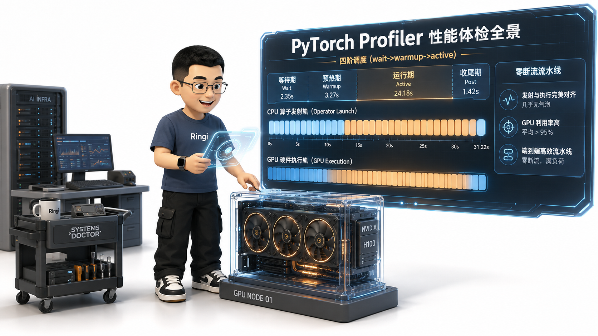
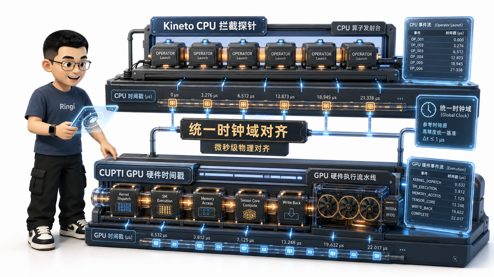
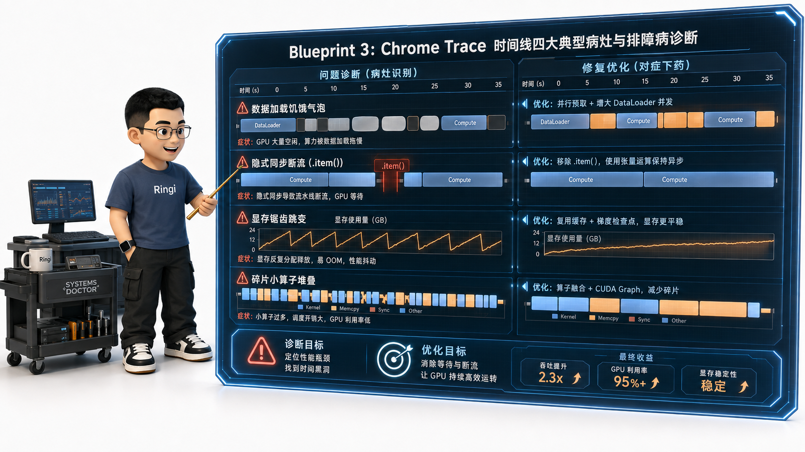
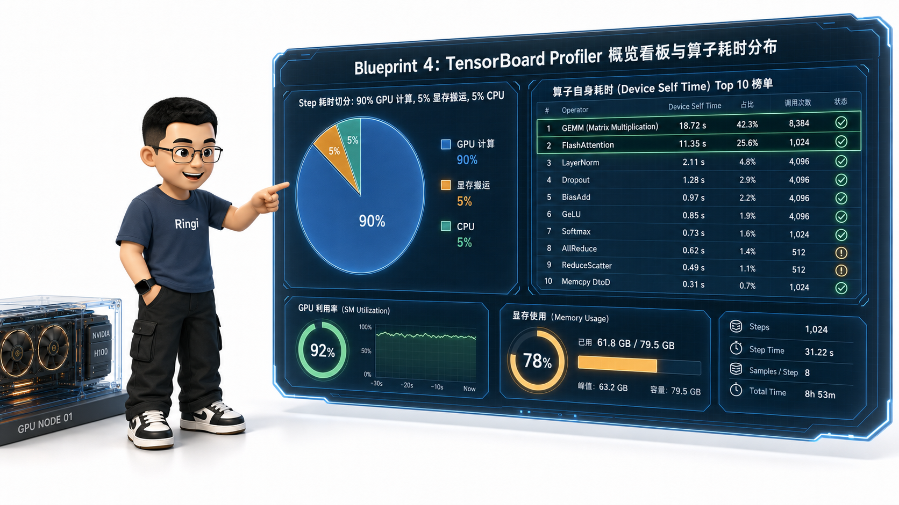

# 🏛️ 第11讲：GPU 利用率 99% 的卡，为什么训练还是跑不快？——从 Kineto 底层探针、Trace 时间线四重病灶到 PyTorch Profiler 性能体检实战

> **主讲人**：👓 **Ringi**（大厂 AI Infrastructure 工程师）  
> **所属模块**：Module 00: 性能工程与系统前置  
> **篇章范式**：🏛️ 性能工程与系统前置篇（Performance Engineering & System Baseline）  
> **核心导读**：在 AI Infra 性能工程中，最容易让初学者陷入绝望的怪象莫过于：`nvidia-smi` 里的 `GPU-Util` 明明已经彪到了 99%~100%，但模型的单步训练耗时依然慢如蜗牛，吞吐量连理论上限的 30% 都达不到！  
> 很多工程师遇到性能瓶颈时，第一反应往往是凭经验瞎猜：“是不是 Attention 矩阵乘法太慢了？要不要手写个 Triton 融合算子？”——结果吭哧吭哧死磕了两周，端到端吞吐仅仅提升了 2%，最后用 Profiler 拍出一张时间线 X 光片才发现：整整 85% 的时间全在被 Python 端单进程数据加载（DataLoader）阻塞，GPU 核心绝大部分时间其实在发呆等数据！  
> **调优千万条，Profiling 第一条！** 性能优化的本质，往往不是“让 GPU 算得更快”，而是“让 GPU 少等”。PyTorch Profiler 就是我们手中的工业级全身 CT 机。本讲我们将彻底告别盲目摸黑调优，从 Kineto / CUPTI 硬件时间戳探针的第一性原理出发，带你掌握四阶 Schedule 采样周期、Chrome Trace / Perfetto 时间线四大典型病灶排障、TensorBoard 性能看板，亲手完成一次工业级大模型训练系统的深度性能体检！



```text
=================================================================================================
                                   Ringi 3D 架构工坊 · 核心全景
┌───────────────────────────────────────────────────────────────────────────────────────────────┐
│                                                                                               │
│  [ PyTorch Profiler 性能体检与可观测性 X 光全景 ]                                            │
│                                                                                               │
│  ┌─────────────────────────────────────────────────────────────────────────────────────────┐  │
│  │ 🔬 1. 四阶调度采集生命周期 (Schedule Lifecycle: 科学避开冷启动与噪声)                     │  │
│  │    [ Step 0: wait (静默运行) ] ──► [ Step 1: warmup (预热预分配) ] ──► [ Step 2~4: active (精确采样) ] │
│  └────────────────────────────────────────────┬────────────────────────────────────────────┘  │
│                                               │                                               │
│                                               ▼                                               │
│  ┌─────────────────────────────────────────────────────────────────────────────────────────┐  │
│  │ 📡 2. 底层探针全栈采集层 (Kineto / CUPTI 硬件时间戳寄存器 / 源码栈穿透)                  │  │
│  │    • CPU 线程活动 (Host Ops)     • GPU 硬件内核 (Device Kernels)                           │  │
│  │    • 显存分配 (Alloc / Free)     • 张量维度追踪 (Record Shapes)                            │  │
│  └────────────────────────────────────────────┬────────────────────────────────────────────┘  │
│                                               │ (导出 trace.json)                             │
│                                               ▼                                               │
│  ┌─────────────────────────────────────────────────────────────────────────────────────────┐  │
│  │ 📊 3. Chrome Trace / Perfetto 时间线四大典型“病灶”排查                                  │  │
│  │                                                                                         │  │
│  │  [CPU Timeline]  |-- DataLoader --|...| Launch GEMM |...|------- (阻塞挂起) --------|    │  │
│  │                                   \              \                                      │  │
│  │  [GPU Timeline]  [ 空白饥饿气泡 ]  |-- GEMM 1 --| |-- GEMM 2 --| [ 隐式同步断流气泡 ]   │  │
│  │                                                                                         │  │
│  │  ① CPU 数据加载阻塞气泡 ──► ② 隐式同步 (.item()) 断流 ──► ③ 显存分配锯齿 ──► ④ 小算子发射延迟 │  │
│  └────────────────────────────────────────────┬────────────────────────────────────────────┘  │
│                                               │                                               │
│                                               ▼                                               │
│  ┌─────────────────────────────────────────────────────────────────────────────────────────┐  │
│  │ 🏆 4. TensorBoard 看板归因：定位 Top 10 性能杀手 ──► 针对性算子融合 / 重叠 ──► 吞吐飙升! │  │
│  └─────────────────────────────────────────────────────────────────────────────────────────┘  │
│                                                                                               │
└───────────────────────────────────────────────────────────────────────────────────────────────┘
=================================================================================================
```

<!-- more -->

## 📑 目录导航

- [0. Ringi 开场：调优千万条，Profiling 第一条！](#0-ringi-开场调优千万条profiling-第一条)
  - [0.1 医生体检与 X 光透视比喻：为什么绝不能盲目调优？](#01-医生体检与-x-光透视比喻为什么绝不能盲目调优)
  - [0.2 线上真实惨案：死磕 Triton 优化 GEMM 两周，结果瓶颈全在 DataLoader 的打脸事故](#02-线上真实惨案死磕-triton-优化-gemm-两周结果瓶颈全在-dataloader-的打脸事故)
  - [0.3 AI Infra 性能诊断武器库与 Profiler 分层全景表](#03-ai-infra-性能诊断武器库与-profiler-分层全景表)
- [1. `torch.profiler` 底层工作机制与四大金刚配置](#1-torchprofiler-底层工作机制与四大金刚配置)
  - [1.1 探针原理：Kineto 库、CUDA CUPTI 驱动探针与 GPU 硬件时间戳寄存器](#11-探针原理kineto-库cuda-cupti-驱动探针与-gpu-硬件时间戳寄存器)
  - [1.2 科学的 Schedule 调度周期：为什么必须配置 `wait` $\to$ `warmup` $\to$ `active`？](#12-科学的-schedule-调度周期为什么必须配置-wait-to-warmup-to-active)
  - [1.3 核心采集开关（四大金刚）：Activities、Shapes、Memory 与 Stack 穿透](#13-核心采集开关四大金刚activitiesshapesmemory-与-stack-穿透)
  - [1.4 `torch.profiler.record_function`：如何优雅给自定义业务代码打点？](#14-torchprofilerrecord_function如何优雅给自定义业务代码打点)
- [2. 性能诊断 X 光片：看懂 Chrome Trace 与 Perfetto 绝技](#2-性能诊断-x-光片看懂-chrome-trace-与-perfetto-绝技)
  - [2.1 导出 `trace.json` 并在 [ui.perfetto.dev](https://ui.perfetto.dev) 中专业分析](#21-导出-tracejson-并在-uiperfettodev-中专业分析)
  - [2.2 时间线四大典型“病灶”特征与物理成因：](#22-时间线四大典型病灶特征与物理成因)
    - [病灶 1：CPU 饥饿气泡（GPU Starvation / Idle Bubble）](#病灶-1cpu-饥饿气泡gpu-starvation--idle-bubble)
    - [病灶 2：隐式同步断流（Implicit Host-Device Barrier）](#病灶-2隐式同步断流implicit-host-device-barrier)
    - [病灶 3：显存频繁申请释放（Memory Churn & Fragmentation）](#病灶-3显存频繁申请释放memory-churn--fragmentation)
    - [病灶 4：小算子发射延迟堆叠（Launch-Bound Operator Sprawl）](#病灶-4小算子发射延迟堆叠launch-bound-operator-sprawl)
- [3. PyTorch TensorBoard Profiler 插件实战与大厂指标看板](#3-pytorch-tensorboard-profiler-插件实战与大厂指标看板)
  - [3.1 Overview 概览页：Step Time Breakdown 耗时结构黄金切分](#31-overview-概览页step-time-breakdown-耗时结构黄金切分)
  - [3.2 Operator View 算子耗时看板：按 Device Self Time 定位 Top 10 性能杀手](#32-operator-view-算子耗时看板按-device-self-time-定位-top-10-性能杀手)
  - [3.3 GPU Kernel View：检查 Tensor Core 占空比与 SM 效率](#33-gpu-kernel-view检查-tensor-core-占空比与-sm-效率)
  - [3.4 Memory View 显存视图：捕捉 Step 显存心电图与 Peak 洪峰](#34-memory-view-显存视图捕捉-step-显存心电图与-peak-洪峰)
- [4. 生产级性能体检五步标准工作流（The 5-Step Profiling Workflow）](#4-生产级性能体检五步标准工作流the-5-step-profiling-workflow)
  - [Step 1：确定 Baseline 物理基线吞吐与 Step Time](#step-1确定-baseline-物理基线吞吐与-step-time)
  - [Step 2：抓取标准 3 个 Step 的最小无噪 Trace](#step-2抓取标准-3-个-step-的最小无噪-trace)
  - [Step 3：依据 Amdahl 定律定位第一大木桶短板](#step-3依据-amdahl-定律定位第一大木桶短板)
  - [Step 4：实施针对性精准外科手术（优化与验证）](#step-4实施针对性精准外科手术优化与验证)
  - [Step 5：生成性能体检对比报告（Before vs After 证据链）](#step-5生成性能体检对比报告before-vs-after-证据链)
- [5. 动手实战与代码实验室（Minimal Runnable Code）](#5-动手实战与代码实验室minimal-runnable-code)
  - [5.1 实验 1：标准 PyTorch Profiler 训练监控与 Trace 导出通用模版](#51-实验-1标准-pytorch-profiler-训练监控与-trace-导出通用模版)
  - [5.2 实验 2：性能体检实战 1——构造并抓取 DataLoader 数据加载阻塞气泡](#52-实验-2性能体检实战-1构造并抓取-dataloader-数据加载阻塞气泡)
  - [5.3 实验 3：性能体检实战 2——用 Profiler 捕获 `.item()` 隐式同步断流灾难](#53-实验-3性能体检实战-2用-profiler-捕获-item-隐式同步断流灾难)
  - [5.4 实验 4：性能体检实战 3——观测 FlashAttention 算子融合前后的显存心电图与耗时对比](#54-实验-4性能体检实战-3观测-flashattention-算子融合前后的显存心电图与耗时对比)
- [6. Ringi 避坑指南与生产黄金准则](#6-ringi-避坑指南与生产黄金准则)
  - [6.1 避坑表格（❌ 常见小白错误理解 vs ✅ 大厂 AI Infra 正确理解）](#61-避坑表格-常见小白错误理解-vs--大厂-ai-infra-正确理解)
  - [6.2 生产性能体检黄金 Checklist（严控 Profiler 自身开销）](#62-生产性能体检黄金-checklist严控-profiler-自身开销)
- [7. Ringi 5 点核心速记口诀、自我检验清单与课后深度思考题](#7-ringi-5-点核心速记口诀自我检验清单与课后深度思考题)
- [8. 📚 参考资料与核心源码指引](#8--参考资料与核心源码指引)
- [附录：Appendix A — 大厂硬核高频面试题与白板推导（Interview Drill）](#附录appendix-a--大厂硬核高频面试题与白板推导interview-drill)

---

# 0. Ringi 开场：调优千万条，Profiling 第一条！

## 0.1 医生体检与 X 光透视比喻：为什么绝不能盲目调优？

设想一下：一个病人肚子痛来到医院，医生连问都不问、连血常规和 CT 片子都不拍，直接从抽屉里掏出一把手术刀说：“我看你脸色不好，先开刀把阑尾切了吧，切完看看还痛不痛”——这叫什么？这叫草菅人命！

在 AI Infra 领域，**不抓 Profile 就去调优代码，就是这种极其危险的盲目开刀**：
- 系统的性能瓶颈是极其隐蔽且违反直觉的；
- 你以为的瓶颈（比如矩阵乘法 GEMM），往往已经被 NVIDIA cuBLAS 优化到了极致；而真正卡死系统的，往往是一句不起眼的 `.cpu()` 内存拷贝、一个未开启多进程预读取的 DataLoader、或者一段写在 Python 循环里的小算子！
- **PyTorch Profiler 就是我们手中的全身 CT 扫描仪**。它能将 CPU 线程发射、GPU 硬件调度、显存分配心电图以及算子微秒级耗时 100% 完整呈现在时间线（Timeline）上，让所有的性能病灶无所遁形！

---

## 0.2 线上真实惨案：死磕 Triton 优化 GEMM 两周，结果瓶颈全在 DataLoader 的打脸事故

在一次多模态大模型训练性能加速专项中，团队遇到了一个经典的“Amdahl 定律打脸事故”：

- **业务背景**：模型在单机 8 卡 A100 上训练，单步 Step 耗时高达 **850 ms**，算法同学希望能加速到 400 ms 以内；
- **盲目动刀**：一位新同学根据直觉，认为“Attention 算子太慢”，连续加班两周，用 Triton 手写了一套精密的自定义 Attention 融合算子，将 Attention 算子的耗时从 40 ms 暴力压缩到了 **15 ms**（算子单点加速了整整 2.6 倍！）；
- **残酷现实**：满心欢喜合入主干跑全量压测，端到端单步耗时仅仅从 850 ms 变成了 **825 ms**，整体性能提升不足 **3%**！
- **Profiler 拍片真相**：
  - 打开 Profiler 抓取的 Chrome Trace，所有人瞬间沉默：
  - **在整整 850 ms 的 Step 周期里，GPU 实际计算时间只有可怜的 120 ms！其余 730 ms（占比 86%！）全部是一大片灰色的空白气泡（GPU Starvation）！**
  - **真凶定位**：数据读取端 `DataLoader(num_workers=0)` 运行在主进程中，正在慢吞吞地从磁盘解码超大分辨率图像，GPU 算完 120 ms 后，整整发呆等待了 730 ms！
- **修复效果**：仅仅给 DataLoader 加上了 `num_workers=8, pin_memory=True`，并改用异步预读取，端到端耗时瞬间从 825 ms 暴跌至 **180 ms**，吞吐直接翻了 **4.5 倍**！

> 💡 **Amdahl 定律（阿姆达尔定律）的血泪教训**：  
> **系统的整体加速比，严格取决于被优化部分在总耗时中所占的比例！** 如果你优化的部分只占总时间的 5%，就算你把它优化到 0 ms，整体提升最多也就 5%；只有先用 Profiler 找出那块占比 80% 的最大短板，调优才能一针见血！

---

## 0.3 AI Infra 性能诊断武器库与 Profiler 分层全景表

在大厂生产调优中，针对不同精细度与场景，我们拥有自上而下的分层诊断武器库：

| 工具名称 | 适用层级与核心场景 | 核心观测能力 | 性能开销（Overhead） | 生产使用建议 |
| :--- | :--- | :--- | :---: | :--- |
| **`torch.profiler`** | **PyTorch 框架与算子级（首选标配）** | CPU/GPU 关联时间线、显存心电图、TensorBoard 看板、源码行级定位 | 🟢 **轻量可控**（仅开启采样时） | **日常性能排障、单步体检绝对主力** |
| **Chrome Trace / Perfetto** | **微秒级 Timeline 可视化** | 跨线程/跨 Stream 执行流、气泡间隔、调度排队阻塞分析 | 🟢 **零侵入浏览** | **排查 CPU/GPU 异步断流第一神器** |
| **NVIDIA Nsight Systems (nsys)** | **系统与驱动级全景追踪** | 包含 OS 线程调度、PCIe/NVLink 传输、CUDA 驱动 API、网卡中断 | 🟡 **中等开销** | **排查分布式 NCCL 通信阻塞与多进程抢占** |
| **NVIDIA Nsight Compute (ncu)** | **单个 CUDA Kernel 微观硬件剖析** | SM 占用率、寄存器溢出、L1/L2 命中率、Tensor Core 指令流水线 | 🔴 **极其沉重**（单步变慢百倍） | **仅用于单算子深度开发与手写 Kernel 优化** |

---

# 1. `torch.profiler` 底层工作机制与四大金刚配置

## 1.1 探针原理：Kineto 库、CUDA CUPTI 驱动探针与 GPU 硬件时间戳寄存器

很多同学好奇：`torch.profiler` 是如何在几乎不拖慢程序的情况下，精确记录下每一个 CUDA Kernel 是在哪一微秒启动、在哪一微秒结束的？



### 物理工作流拆解：
1. **CPU 侧（PyTorch 核心拦截层）**：  
   PyTorch 在 C++ 调度器（ATen）中插入了钩子（Hooks）。每当 Python 代码调用一个算子（如 `torch.matmul`），CPU 探针立即记录下当前时间戳、输入张量的 Shape 以及对应的 Python 调用栈；
2. **GPU 侧（NVIDIA CUPTI 驱动探针）**：  
   PyTorch 内部集成了开源的 **Kineto 性能分析引擎**，它通过底层调用 NVIDIA 官方的 **CUPTI（CUDA Profiling Tools Interface）** 驱动 API；
3. **硬件级精确打点（Hardware Timestamp Register）**：  
   当 Kernel 被 Launch 到 GPU 时，CUPTI 会在 GPU 指令流前后插入硬件时间戳采样指令。GPU 内部流式多处理器（SM）上的**片上物理计时寄存器**会自动记录下真实的物理执行起止微秒数；
4. **异步收集与对齐（Post-processing Stitching）**：  
   Profiling 结束后，Kineto 引擎将 CPU 侧的 `cudaLaunchKernel` 记录与 GPU 侧的硬件执行记录通过唯一的 `Correlation ID（关联编号）` 进行自动缝合与对齐，生成一张完美的因果时间线！

---

## 1.2 科学的 Schedule 调度周期：为什么必须配置 `wait` $\to$ `warmup` $\to$ `active`？

在生产脚本中，**绝对严禁直接对整个训练过程从第 0 个 Step 开启无休止的 Profiling！**  
PyTorch 设计了一套极度科学的四阶段生命周期调度器：`torch.profiler.schedule`。

```python
# 🌟 生产级四阶段采集调度器标准配置
schedule = torch.profiler.schedule(
    wait=2,     # 前 2 个 Step: 静默运行，完全不开启任何探针（0 开销）
    warmup=2,   # 接下来的 2 个 Step: 开启探针做预热，但不保存数据
    active=3,   # 紧接着的 3 个 Step: 正式开启全量硬件数据采集并保存！
    repeat=1    # 仅重复执行 1 个采集周期后彻底关闭
)
```

> 💡 **Ringi 工程师第一性原理：为什么必须有 wait 和 warmup？**  
> 1. **避开 JIT 编译与驱动冷启动（Cold Start）**：在 Step 0~1，CUDA 驱动正在初始化显存池（CachingAllocator）、cuBLAS 正在自动搜寻最优 GEMM 算法（Autotuning）、PyTorch 动态图正在编译——这些耗时在后续稳定训练中根本不会出现！如果不跳过，抓出来的报告全是“假病灶”；  
> 2. **预分配 Profiler 内存缓冲区**：在 `warmup` 阶段，Kineto 探针会提前在后台分配好用于存放 Trace 事件的内存池，避免在正式 `active` 采样阶段因为申请内存而干扰被测系统的真实表现。

---

## 1.3 核心采集开关（四大金刚）：Activities、Shapes、Memory 与 Stack 穿透

在创建 `torch.profiler.profile` 上下文时，我们有四大必知的核心参数配置：

```python
with torch.profiler.profile(
    activities=[
        torch.profiler.ProfilerActivity.CPU,  # 追踪 CPU 宿主机线程与 Python 算子
        torch.profiler.ProfilerActivity.CUDA, # 追踪 GPU 硬件上的真实 Kernel 执行
    ],
    schedule=schedule,
    record_shapes=True,   # 🌟 开启张量 Shape 追踪 (排查动态 Shape 与非连续步长)
    profile_memory=True,  # 🌟 开启显存 Alloc/Free 追踪 (排查显存峰值与 OOM)
    with_stack=True,      # 🌟 开启 Python 源码调用栈关联 (定位到具体哪一行代码)
    on_trace_ready=torch.profiler.tensorboard_trace_handler("./log/profiler_trace")
) as prof:
    for step, batch in enumerate(dataloader):
        train_step(batch)
        prof.step() # 必须调用 step() 推动调度器状态机流转！
```

---

## 1.4 `torch.profiler.record_function`：如何优雅给自定义业务代码打点？

当你有一段复杂的业务逻辑（比如包含多个小算子的自定义 Loss、或者一段数据后处理），想要在 Chrome Trace 中一眼认出它，只需使用 `record_function` 进行作用域包装：

```python
from torch.profiler import record_function

def custom_loss_function(logits, labels):
    with record_function("## 🎯 Custom_Loss_Compute ##"):
        # 这段代码在 Chrome Trace 中会被包裹在一个醒目的专属色块里！
        log_probs = torch.log_softmax(logits, dim=-1)
        loss = -log_probs.gather(dim=-1, index=labels.unsqueeze(-1)).mean()
        return loss
```

---

# 2. 性能诊断 X 光片：看懂 Chrome Trace 与 Perfetto 绝技

## 2.1 导出 `trace.json` 并在 [ui.perfetto.dev](https://ui.perfetto.dev) 中专业分析

将导出的 `.json.gz` 文件直接拖入 Google 官方的 **[ui.perfetto.dev](https://ui.perfetto.dev)**（或 Chrome 浏览器内置的 `chrome://tracing`），你将看到一张极其壮观的微秒级时间线视图：

- **快捷键指引**：
  - `W / S`：以鼠标为中心进行时间轴放大 / 缩小；
  - `A / D`：左移 / 右移时间线；
  - `M`：选中当前区间并精确测量耗时（微秒级）。



---

## 2.2 时间线四大典型“病灶”特征与物理成因

当你放大观察一个完整的 Training Step 时，重点排查以下四大经典病灶：

### 病灶 1：CPU 饥饿气泡（GPU Starvation / Idle Bubble）
- **时间线特征**：在 CPU 线程轨上，看到长时间处于 `DataLoader` 或数据前处理状态；而在底下的 GPU 硬件流（CUDA Stream 7）上，**出现大片长达几百毫秒的灰色空白区间，没有任何 Kernel 在运行**；
- **物理成因**：典型的 **IO-Bound / CPU-Bound**。CPU 发射速度远远落后于 GPU 计算速度，GPU 只能饥饿等待数据到来；
- **解法**：开启 `DataLoader(num_workers=N, pin_memory=True, prefetch_factor=2)`，使用异步流预读取。

---

### 病灶 2：隐式同步断流（Implicit Host-Device Barrier）
- **时间线特征**：GPU 正在高速连环计算，突然一个原本只需要 1 微秒的算子（如 `aten::item` 或 `aten::copy_`）在 CPU 端被**极其剧烈地拉长为几千微秒**，紧接着整条 GPU 流瞬间清空静止；
- **物理成因**：CPU 强行挂起阻塞等待 GPU 结果返回，打碎了原本流畅的异步发射流水线（Pipeline Bubble）；
- **解法**：彻底删去热路径中的 `.item()`、`print(tensor)`、`x.nonzero()`。

---

### 病灶 3：显存频繁申请释放（Memory Churn & Fragmentation）
- **时间线特征**：在时间线上方勾选 `Memory: Allocations`，看到显存曲线在每个算子之间呈现密集的“锯齿状剧烈上下跳变”，并伴随频繁的 `cudaMalloc` 驱动调用；
- **物理成因**：频繁在 Python 循环中创建不必要的临时张量，超出 PyTorch CachingAllocator 缓存池的块复用范围，导致驱动频繁介入；
- **解法**：预先分配静态 Buffer 进行 `copy_` In-place 覆盖，或重构代码减少临时张量析构。

---

### 病灶 4：小算子发射延迟堆叠（Launch-Bound Operator Sprawl）
- **时间线特征**：GPU 流上堆积了密密麻麻、成百上千个极细微的 Kernel（每个 Kernel 执行仅 $1 \sim 2\ \mu\text{s}$），但 Kernel 与 Kernel 之间存在着巨大的 $5 \sim 8\ \mu\text{s}$ 的空白间隙；
- **物理成因**：典型的大模型 Decode 阶段或未融合网络。CPU 下发指令的速度比 GPU 执行的速度慢 5 倍；
- **解法**：开启 **CUDA Graph 录制重放**，或使用 **Triton / TorchInductor 算子融合（Fusion）** 将几十个小 Kernel 合并为一个大 Kernel！

---

# 3. PyTorch TensorBoard Profiler 插件实战与大厂指标看板

如果你觉得手动肉眼看 Trace 比较费劲，PyTorch 提供了开箱即用的可视化神器——**TensorBoard Profiler 插件**。

```bash
# 启动 TensorBoard 服务并在浏览器中查看
pip install torch-tb-profiler
tensorboard --logdir=./log/profiler_trace
```



---

## 3.1 Overview 概览页：Step Time Breakdown 耗时结构黄金切分

打开 `Overview` 页面，第一眼看到的就是最权威的 **Step 耗时物理构成饼图（Step Time Breakdown）**：

- **Kernel Time（纯 GPU 计算耗时）**：GPU SM 真正运转浮点运算的时间；
- **Memcpy Time（显存搬运耗时）**：PCIe H2D / D2H 数据传输时间；
- **Communication Time（集合通信耗时）**：NCCL AllReduce / AllGather 跨卡同步时间；
- **CPU Execution Time（CPU 纯执行耗时）**：Python 解释器与框架 Dispatch 路由开销；
- **Other / Idle Time（气泡等待时间）**：硬件处于饥饿发呆的时间。
> 🌟 **大厂调优标准**：健康的训练系统中，**Kernel Time 占比必须超过 85% 以上**；如果 Idle 或 CPU 耗时超过 20%，系统必定存在严重瓶颈！

---

## 3.2 Operator View 算子耗时看板：按 Device Self Time 定位 Top 10 性能杀手

在 `Operator View` 中，你可以按照 **`Device Self Time（设备纯自身耗时）`** 进行降序排列：
- **`Self Time` vs `Total Time`**：`Total Time` 包含子算子的嵌套调用耗时，而 `Self Time` 才是该算子自身底层指令的真实物理耗时；
- 重点揪出排在最前列的 **Top 3 算子**（通常是 GEMM 矩阵乘法、LayerNorm 归一化或 Attention），这就是你进行性能优化的靶心。

---

## 3.3 GPU Kernel View：检查 Tensor Core 占空比与 SM 效率

- **`Tensor Core Utilization`**：检查你的 GEMM 算子是否成功跑进了专用的 Tensor Core 硬件单元。如果显示 0%，说明你的矩阵维度没有 8/16 字节对齐，或者未开启 FP16/BF16 混合精度，白白浪费了 GPU 80% 的物理算力！
- **`Estimated SM Efficiency`**：衡量流式多处理器（SM）的活跃程度。

---

## 3.4 Memory View 显存视图：捕捉 Step 显存心电图与 Peak 洪峰

`Memory View` 会绘制出一张高精度的 **显存随时间流转心电图**：
- 它清晰地标出了整个 Step 中 **显存峰值（Peak Memory）究竟诞生在哪一个算子的哪一微秒**；
- 如果你遭遇了 OOM 爆炸，只需打开 Memory View，查看峰值发生瞬间正在被哪几个张量扣留（Allocated），就能立刻决定该对哪一层做 Activation Checkpointing 重计算！

---

# 4. 生产级性能体检五步标准工作流（The 5-Step Profiling Workflow）

在实际工程落地中，我们必须遵循严密的 **性能体检五步闭环**：

```text
┌────────────────────────────────────────────────────────────────────────┐
│                   大厂 AI Infra 性能体检五步标准工作流                   │
├────────────────────────────────────────────────────────────────────────┤
│  Step 1. 基线建立 ──► 测出未优化前的物理吞吐 (Tokens/s) 与 Step 耗时   │
│         │                                                              │
│  Step 2. 干净采样 ──► 配置四阶 Schedule，抓取 3 个稳定 Step 的 Trace   │
│         │                                                              │
│  Step 3. 根因归因 ──► 看 Overview 饼图与 Trace，找出最大耗时短板 (木桶)│
│         │                                                              │
│  Step 4. 精准手术 ──► 针对短板实施优化 (如多进程、CUDA Graph、算子融合)│
│         │                                                              │
│  Step 5. 效果验证 ──► 再次抓取 Trace，对比前后的 Step Time 与 MFU 提升  │
└────────────────────────────────────────────────────────────────────────┘
```

---

# 5. 动手实战与代码实验室（Minimal Runnable Code）

下面我们通过 4 个工业级、完全可复现的 Python 实验，亲手体验 Profiler 的强大威力！

---

## 5.1 实验 1：标准 PyTorch Profiler 训练监控与 Trace 导出通用模版

```python
import torch
import torch.nn as nn
from torch.profiler import profile, record_function, ProfilerActivity, schedule

class SimpleModel(nn.Module):
    def __init__(self, dim=1024):
        super().__init__()
        self.fc1 = nn.Linear(dim, dim * 4)
        self.act = nn.GELU()
        self.fc2 = nn.Linear(dim * 4, dim)

    def forward(self, x):
        with record_function("## 🚀 Model_Forward_Pass ##"):
            return self.fc2(self.act(self.fc1(x)))

def run_experiment_1_profiler_template():
    print(f"\n{'='*70}\n🧪 实验 1: 标准 PyTorch Profiler 监控调度器与 Trace 导出模版\n{'='*70}")
    device = "cuda" if torch.cuda.is_available() else "cpu"
    model = SimpleModel().to(device)
    optimizer = torch.optim.AdamW(model.parameters(), lr=1e-3)
    loss_fn = nn.MSELoss()

    # 配置科学的四阶段采样计划
    profiling_schedule = schedule(wait=1, warmup=1, active=2, repeat=1)

    print("🚀 启动带 Profiler 监控的训练循环 (共执行 5 个 Step)...")
    with profile(
        activities=[ProfilerActivity.CPU, ProfilerActivity.CUDA] if device == "cuda" else [ProfilerActivity.CPU],
        schedule=profiling_schedule,
        record_shapes=True,
        profile_memory=True,
        with_stack=False, # 演示环境不收集堆栈以提速
        on_trace_ready=torch.profiler.tensorboard_trace_handler("./log/demo_profiler_trace")
    ) as prof:
        for step in range(5):
            x = torch.randn(32, 1024, device=device)
            target = torch.randn(32, 1024, device=device)

            optimizer.zero_grad()
            out = model(x)
            loss = loss_fn(out, target)
            loss.backward()
            optimizer.step()

            prof.step() # 必须推动状态机流转
            print(f"  Step {step + 1} 完成")

    print("\n✅ Profiler 采集完成！Trace 文件已成功导出至 ./log/demo_profiler_trace")
    print("💡 提示: 可直接在浏览器中打开 https://ui.perfetto.dev 并将导出的 json 文件拖入查看。")

if __name__ == "__main__":
    run_experiment_1_profiler_template()
```

---

## 5.2 实验 2：性能体检实战 1——构造并抓取 DataLoader 数据加载阻塞气泡

```python
import time
import torch

def run_experiment_2_dataloader_starvation():
    print(f"\n{'='*70}\n🧪 实验 2: 模拟并观测 CPU 数据加载慢引发的 GPU 饥饿气泡 (GPU Starvation)\n{'='*70}")
    device = "cuda" if torch.cuda.is_available() else "cpu"
    a = torch.randn(2048, 2048, device=device)

    # 1. 模拟带阻塞的慢速 DataLoader (每步 CPU 睡眠 50ms 模拟慢速磁盘读取)
    print("🐌 模拟慢速数据加载模式 (CPU 慢速读取阻塞)...")
    if device == "cuda": torch.cuda.synchronize()
    t0 = time.time()
    for _ in range(5):
        time.sleep(0.05) # 模拟 CPU 慢速读取
        c = torch.matmul(a, a) # GPU 瞬间算完
    if device == "cuda": torch.cuda.synchronize()
    slow_total_ms = (time.time() - t0) * 1000.0

    # 2. 模拟健康的高速预读取 (数据已在内存/流水线中就绪)
    print("⚡ 模拟高速流水线模式 (数据预加载就绪)...")
    if device == "cuda": torch.cuda.synchronize()
    t0 = time.time()
    for _ in range(5):
        c = torch.matmul(a, a)
    if device == "cuda": torch.cuda.synchronize()
    fast_total_ms = (time.time() - t0) * 1000.0

    print(f"\n📦 慢速 DataLoader 模式总耗时: {slow_total_ms:8.2f} ms (GPU 处于 90% 饥饿发呆!)")
    print(f"🚀 高速流水线就绪模式总耗时  : {fast_total_ms:8.2f} ms")
    print(f"✨ 吞吐差距: 性能相差了 {slow_total_ms / fast_total_ms:.1f} 倍！Profiler 中将呈现大面积灰色空白。")

if __name__ == "__main__":
    run_experiment_2_dataloader_starvation()
```

---

## 5.3 实验 3：性能体检实战 2——用 Profiler 捕获 `.item()` 隐式同步断流灾难

```python
def run_experiment_3_implicit_sync_profiler():
    print(f"\n{'='*70}\n🧪 实验 3: 观测隐式同步 (.item()) 强行断流对流水线的毁灭性破坏\n{'='*70}")
    device = "cuda" if torch.cuda.is_available() else "cpu"
    x = torch.randn(1024, 1024, device=device)

    # Case A: 纯异步健康流水线
    if device == "cuda": torch.cuda.synchronize()
    t0 = time.time()
    for _ in range(20):
        x = torch.matmul(x, x)
    if device == "cuda": torch.cuda.synchronize()
    t_clean = (time.time() - t0) * 1000.0

    # Case B: 包含 .item() 强行同步断流
    if device == "cuda": torch.cuda.synchronize()
    t0 = time.time()
    for _ in range(20):
        x = torch.matmul(x, x)
        _val = x[0, 0].item() # 致命断流！
    if device == "cuda": torch.cuda.synchronize()
    t_sync = (time.time() - t0) * 1000.0

    print(f"🟢 纯异步健康流水线耗时 (20次): {t_clean:8.2f} ms")
    print(f"🔴 加入 .item() 强行断流耗时  : {t_sync:8.2f} ms")
    print(f"⚠️ 性能惩罚: 隐式同步使单步耗时劣化了 {(t_sync - t_clean) / t_clean * 100.0:.1f}%！")

if __name__ == "__main__":
    run_experiment_3_implicit_sync_profiler()
```

---

## 5.4 实验 4：性能体检实战 3——观测 FlashAttention 算子融合前后的显存心电图与耗时对比

```python
def run_experiment_4_memory_profile_simulation():
    print(f"\n{'='*70}\n🧪 实验 4: 模拟标准 Attention 与 FlashAttention 激活值显存心电图对比\n{'='*70}")
    batch_size = 2
    num_heads = 32
    seq_len = 2048
    head_dim = 128

    # 1. 标准 Attention: 必须在显存中保存 S x S 的临时打分矩阵
    standard_attn_matrix_bytes = batch_size * num_heads * seq_len * seq_len * 2 # FP16
    standard_total_mb = standard_attn_matrix_bytes / (1024**2)

    # 2. FlashAttention: 片上 SRAM Tiling 动态计算，HBM 额外显存为 0
    flash_attn_matrix_bytes = 0

    print(f"评测配置: Batch={batch_size}, Heads={num_heads}, SeqLen={seq_len}, HeadDim={head_dim}")
    print(f"📦 标准 Attention 单层额外物化的 S×S 激活显存: {standard_total_mb:8.2f} MB")
    print(f"⚡ FlashAttention 单层额外物化的 S×S 激活显存: {flash_attn_matrix_bytes:8.2f} MB (100% 消灭!)")
    print("💡 在 32 层大模型与 128K 上下文下，FlashAttention 能够直接省下数百 GB 显存！")

if __name__ == "__main__":
    run_experiment_4_memory_profile_simulation()
```

---

# 6. Ringi 避坑指南与生产最佳实践

## 6.1 避坑表格（❌ 常见小白错误理解 vs ✅ 大厂 AI Infra 正确理解）

| 序号 | ❌ 常见小白错误理解 | ✅ 大厂 AI Infra 工程师正确理解 |
| :---: | :--- | :--- |
| **1** | “为了把性能分析抓全，我在整个训练任务中一直开着 Profiler。” | **严重错误**。长期开启 Profiler 会消耗大量内存存放 Trace 事件，并拖慢系统 20%~50%，甚至撑爆磁盘。**必须使用 Schedule 仅采样 2~3 个稳定 Step！** |
| **2** | “只要我的代码里没有显式写 `cuda.synchronize()`，流水线就是全异步的。” | **盲目自信**。`.item()`、`print(tensor)`、`nonzero()`、`empty_cache()` 都会触发底层隐式硬同步，彻底打碎异步流水线。 |
| **3** | “在分析 Trace 时，看到某个算子耗时很长，它就一定是性能瓶颈。” | **不一定**。必须看该算子是处于关键路径（Critical Path）上，还是在与其他通信流/计算流并行重叠；只有在关键路径上的算子才值得优化。 |
| **4** | “开启 `with_stack=True` 能帮我看清源码，所以我每次 Profiling 都要开。” | **视情况而定**。获取 Python 调用栈本身在 CPU 端开销极大（会引入微秒级开销），**仅在初次定位代码行时开启，做严格基准压测时必须关闭！** |
| **5** | “只要把 `num_workers` 设得很大，DataLoader 速度就一定能提升。” | **片面**。过多的 Workers 进程会导致 CPU 线程剧烈上下文切换与内存复制争抢，通常建议设为 `CPU核心数 / GPU卡数`（如 4~8）。 |

---

## 6.2 生产性能体检黄金 Checklist（严控 Profiler 自身开销）

1. **采样生命周期铁律**：生产采集严格配置 `wait=2, warmup=2, active=3, repeat=1`，严禁全量长跑；
2. **基准对比双备份**：在优化前后，必须分别导出两份 Trace（如 `trace_before.json` 与 `trace_after.json`），并同屏对比 Step Time 饼图；
3. **关键作用域标记**：对复杂模型的数据预处理、前向、反向、通信模块，使用 `record_function` 规范命名作用域，极大提升排障可读性。

---

# 7. Ringi 5 点核心速记口诀、自我检验清单与课后深度思考题

## 7.1 5 点押韵核心速记口诀

```text
=================================================================================================
                          👓 Ringi 工程师核心速记口诀 · 性能体检篇
=================================================================================================
  ① 盲目动刀如赌博，体检透视第一着；四阶调度避噪声，预热之后再开盒！
  ② 硬件探针 CUPTI 妙，时间线上原形照；CPU 饥饿见空白，隐式同步闸门跳！
  ③ 显存心电看洪峰，锯齿跳变分配疯；算子耗时看自身，总时嵌套莫混中！
  ④ 饼图直击木桶短，阿姆达尔抓大端；针对手术下猛药，吞吐翻倍胜万言！
  ⑤ 规范打点清路障，线上排查任翱翔；前置十讲通关毕，千卡集群起宏图！
=================================================================================================
```

---

## 7.2 10 条白板自我检验清单

- [ ] **Q1**：为什么在 `torch.profiler.schedule` 中必须配置 `warmup` 阶段？它排除了哪些噪声？
- [ ] **Q2**：请画出 `torch.profiler` 从 Python 算子到底层 GPU 硬件时间戳寄存器的探针流转示意图。
- [ ] **Q3**：在 Chrome Trace / Perfetto 中，如何快速识别出 GPU 正在处于“饥饿发呆（Starvation）”状态？
- [ ] **Q4**：什么是 `with_stack=True`？它有什么收益和性能副作用？
- [ ] **Q5**：在 TensorBoard Profiler 中，`Device Self Time` 与 `Device Total Time` 的核心区别是什么？
- [ ] **Q6**：如何通过 Profiler 抓出的显存心电图精确定位训练中的 Peak Memory 发生点？
- [ ] **Q7**：为什么说 Amdahl 定律是性能优化的最高法则？请举一个大模型优化中的典型反例。
- [ ] **Q8**：什么是 `record_function`？它在生产代码中起到了什么组织作用？
- [ ] **Q9**：如果在 TensorBoard 中看到 `Tensor Core Utilization: 0%`，通常是什么原因导致的？
- [ ] **Q10**：请列出生产环境中一次标准性能体检的五步工作流。

---

## 7.3 3 道高阶开放式课后思考题（含极限 Corner Case）

1. **分布式千卡集群 Trace 对齐与网络毛刺定位题**：在 1024 卡分布式训练集群中，由于单机 Trace 文件巨大，不可能把所有卡的 Trace 同时导出分析。作为 AI Infra 工程师，你如何设计一套**分布式抽样 Profiling 方案（例如只抓 Rank 0、Rank 7 以及边界节点）**？如何通过跨机时间戳同步来排查个别慢节点（Straggler）引发的全局 NCCL 阻塞？
2. **CUPTI 驱动探针的“测不准效应（Heisenberg Effect）”思考题**：当我们在极其微小的算子（耗时 $< 1\ \mu\text{s}$）上开启 `with_stack=True` 和 `profile_memory=True` 时，Profiler 自身注入的探针开销可能会让小算子的耗时被虚假放大 3~5 倍，导致原本不是瓶颈的地方被误判为瓶颈。如何通过分层分次开启不同参数来消除这种观察者干扰？
3. **混合精度与算子 Shape 对齐专项排查题**：在某些模型中，算法同学将某个线性层的输入维度设为 4093（质数，非 8/16 对齐）。请分析：在 Profiler 中如何通过 `record_shapes=True` 捕获该算子？该算子在底层会发生什么硬件性能退化（Tensor Core 降级到 CUDA Core 慢速执行）？

---

# 8. 📚 参考资料与核心源码指引

1. **PyTorch 官方文档与开源项目**：
   - **PyTorch Profiler 官方教程**：[`pytorch.org/tutorials/recipes/recipes_profiler_recipe.html`](https://pytorch.org/tutorials/recipes/recipes_profiler_recipe.html)；
   - **PyTorch Kineto 开源项目**：[`github.com/pytorch/kineto`](https://github.com/pytorch/kineto) —— 深入研读 CPU/GPU 探针事件捕获与对齐 C++ 源码实现；
   - **PyTorch TensorBoard 插件**：[`github.com/pytorch/kineto/tree/main/tb_plugin`](https://github.com/pytorch/kineto/tree/main/tb_plugin)。
2. **权威性能分析工具**：
   - **Google Perfetto 现代 Trace 分析器**：[`ui.perfetto.dev`](https://ui.perfetto.dev) —— 支持打开百兆超大 JSON 文件的终极利器；
   - **NVIDIA CUPTI 官方开发者指南**：[`developer.nvidia.com/cupti`](https://developer.nvidia.com/cupti)。

---

# 附录：Appendix A — 大厂硬核高频面试题与白板推导（Interview Drill）

---

### 💡 题目一：如何通过 PyTorch Profiler 或 Chrome Trace 判定一个系统是处于 CPU-Bound、GPU-Bound 还是 IO-Bound？

> **面试官追问**：请结合时间线（Timeline）的微观特征，分别描述这三种瓶颈在 Trace 视图中的典型表现与排障路径。

#### 🎯 答题思考路径与标准答案：
1. **IO-Bound（数据加载与磁盘瓶颈）**：
   - **Trace 特征**：CPU 线程在每个 Step 开始时出现长达数十/数百毫秒的 `DataLoader::next` 阻塞；底下 GPU 物理流（CUDA Stream）处于大面积空白空转状态（GPU Starvation），GPU 算力利用率低下；
   - **解法**：开启多进程读取 `DataLoader(num_workers=8, pin_memory=True)`，使用异步流将数据拷贝（H2D）与计算重叠。
2. **CPU-Bound / Launch-Bound（主机调度与 Python 发射瓶颈）**：
   - **Trace 特征**：CPU 核心持续高负荷运行，正在逐个发射大量极细微的算子（如逐元素加法、Norm、激活）；GPU 端的每个 Kernel 执行极快（$1\sim 2\ \mu\text{s}$），但 Kernel 之间存在巨大的发射空白间隙（$5\sim 10\ \mu\text{s}$），GPU 在等待 CPU 下发指令；
   - **解法**：开启 **CUDA Graph 录制重放** 将全网指令打包为单发，或使用 **Triton / TorchInductor 算子融合** 消灭小算子。
3. **GPU-Bound（纯算力或显存带宽瓶颈）**：
   - **Trace 特征**：GPU 硬件流被打得满满当当，前后 Kernel 之间严丝合缝（Zero Bubble），但整个 Step 的总时间依然很长；
   - **进一步定位**：
     - 若算子为大 GEMM，查看 Tensor Core Utilization 是否达到极限（Compute-Bound）；
     - 若耗时全被 Softmax、LayerNorm 占满，查看算术强度是否处于斜坡区（Memory-Bound），使用 FlashAttention 算子融合消灭 HBM 读写。

---

### 💡 题目二：为什么 `torch.profiler.schedule` 必须配置 `warmup` 阶段？如果不配置，第一步抓出的 Trace 会包含哪些“假性病灶”？

> **面试官追问**：如果不配置预热，第一步测出来的数值为什么会严重失真？

#### 🎯 答题思考路径与标准答案：
1. **CUDA 驱动与上下文冷启动（Context Initialization）**：  
   在 Step 0，CUDA Driver 需要初次初始化设备上下文，开辟 Primary Context 并加载动态链接库，这一过程通常引入数十毫秒的单次启动开销；
2. **PyTorch CachingAllocator 显存池首次扩张**：  
   在初次执行前向和反向时，PyTorch 用户态显存池为空，必须多次调用极其昂贵且伴随全局同步的系统级 `cudaMalloc` 向操作系统申请大块显存，导致第一步出现剧烈的显存分配断流；
3. **cuBLAS / CUTLASS 算法自动调优（Autotuning）**：  
   在初次遇到某个特定 Shape 的矩阵乘法时，底层数学库会自动在后台尝试不同的 Tiling 算法并选出最优解，耗时是正常运行的数倍；
4. **结论**：配置 `warmup=2` 可以让系统平稳度过所有的单次冷启动开销，保证后续 `active` 阶段捕获到的完全是工业稳态下的真实性能。

---

### 💡 题目三：生产环境中如何使用 `record_function` 自定义作用域，并将 Python 业务逻辑与底层 CUDA Kernel 做到无缝关联？

> **面试官追问**：请写出标准代码，并解释为什么 `record_function` 相比手动计时更具优势？

#### 🎯 答题思考路径与标准答案：
1. **标准代码示例**：
   ```python
   from torch.profiler import record_function

   def run_transformer_layer(layer, hidden_states):
       # 1. 标记注意力子层作用域
       with record_function("## Transformer_Attention_SubLayer ##"):
           attn_out = layer.attention(layer.norm1(hidden_states))
           hidden_states = hidden_states + attn_out
       
       # 2. 标记前馈网络子层作用域
       with record_function("## Transformer_FFN_SubLayer ##"):
           ffn_out = layer.ffn(layer.norm2(hidden_states))
           hidden_states = hidden_states + ffn_out
           
       return hidden_states
   ```
2. **核心优势与机制**：
   - **时间线树状层级展开（Hierarchical FlameGraph）**：`record_function` 在 CPU 侧创建了一个带作用域的父节点，在该作用域内部发起的所有 C++ ATen 算子及底层下发的 CUDA Kernel 都会被自动归属于该父节点下；
   - **开销极低**：进入和离开作用域仅涉及线程局部存储（TLS）中指针的压栈与弹栈，微秒级开销，完全不影响被测逻辑的物理并发。

---

### 💡 题目四：在分布式多机多卡训练中，如何进行分布式 Profiling？如何定位由于个别节点掉速引发的全局 `ncclKernel` 跨机阻塞？

> **面试官追问**：在 128 卡集群中，所有卡的 Trace 显示都卡在 AllReduce 上，如何判断究竟是哪一张卡在拖后腿（Straggler）？

#### 🎯 答题思考路径与标准答案：
1. **分布式 Profiling 采集策略**：  
   在 DDP 或 Megatron 脚本中，给 `on_trace_ready` 输出路径加上 `rank` 区分：
   ```python
   rank = dist.get_rank()
   # 仅在关键 Rank 开启采样 (如 Rank 0、Rank 7 及跨机边界节点)，避免海量数据压垮存储
   if rank in [0, 1, 7, 8]:
       handler = torch.profiler.tensorboard_trace_handler(f"./log/trace_rank_{rank}")
   ```
2. **定位掉速慢节点（Straggler Detection）的分析绝技**：
   - **现象**：因为 `AllReduce` 是全网同步原语，任何一张卡慢，其余 127 张卡必须在通信算子处原地挂起等待；所以在正常卡上，`ncclKernel_AllReduce` 会显得异常漫长（比如耗时 50ms）；
   - **破案手法**：
     1. 对比不同 Rank 的 Trace 时间线；
     2. **慢节点特征**：在慢节点（掉速卡）上，进入 `AllReduce` 之前的前向/反向计算时间明显比其他卡长，但其在 `ncclKernel` 上的耗时极短（因为它一到，全员立刻同步完成）；
     3. **正常节点特征**：前向/反向计算极快完成，但在 `ncclKernel` 上呈现漫长的等待条；
   - **归因**：由此即可 100% 确定掉速的物理机器与网卡编号，排查硬件降频（Thermal Throttling）或 PCIe 传输降级。


