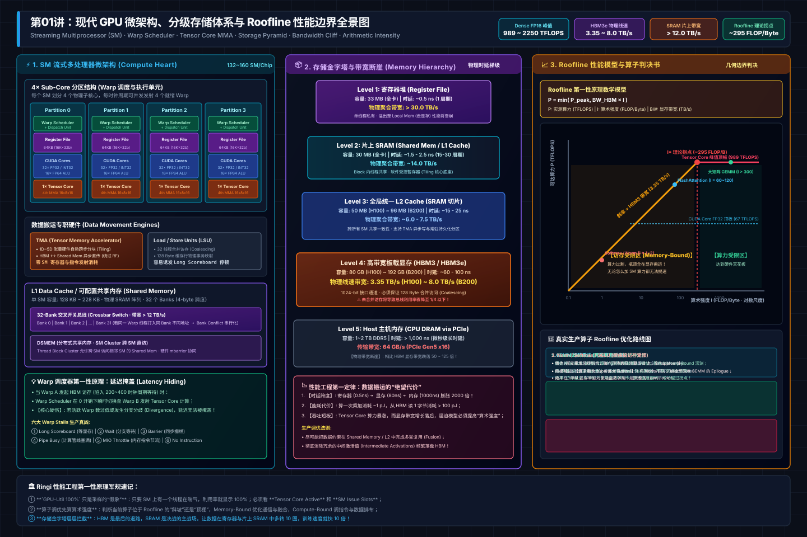
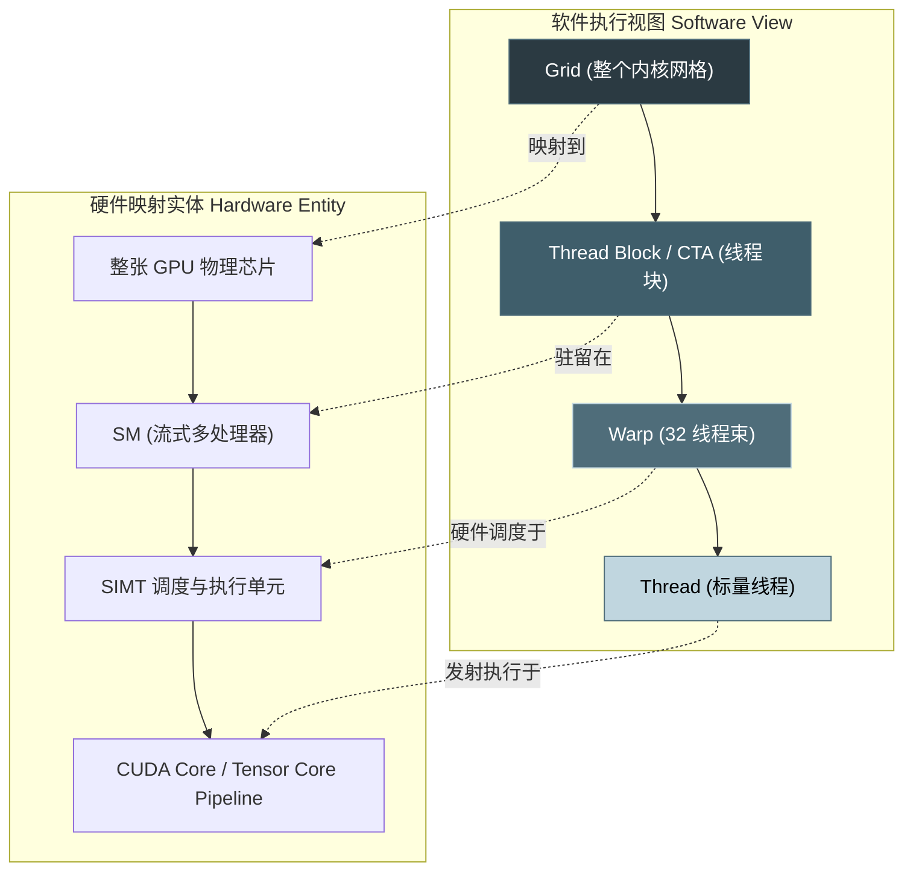
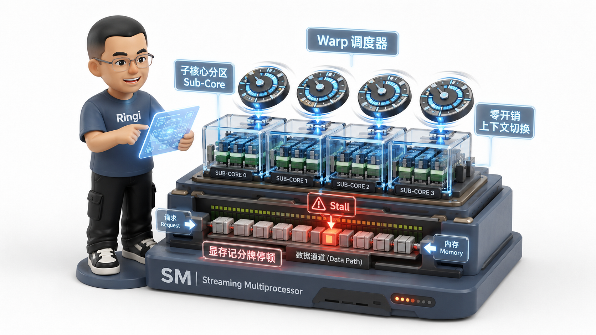
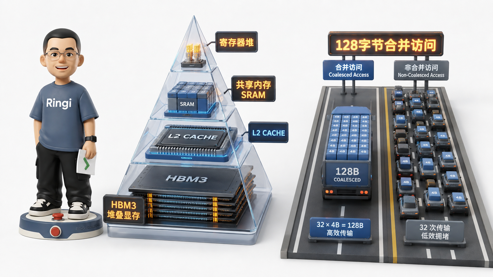
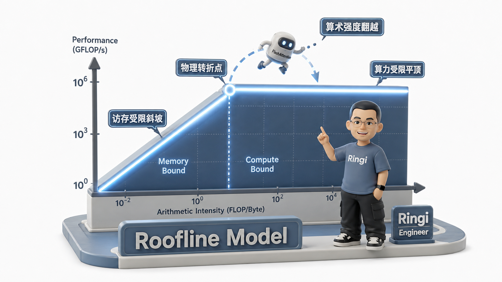

# 🏛️ 第01讲：GPU-Util 100% 算力却只有 15%？——SM 执行、Warp 调度、Tensor Core 与 Roofline 模型的第一性原理

> **主讲人**：👓 **Ringi**（大厂 AI Infrastructure 工程师）  
> **所属模块**：Module 01: GPU 硬件架构、数据搬运、集群通信与 Overlap  
> **篇章范式**：📐 硬件体系与性能建模篇（Hardware Architecture & Performance Modeling Paradigm）  
> **核心导读**：  
> 刚进大厂做性能工程时，很多初学者看到终端里 `nvidia-smi` 实时跳动的 `GPU-Util: 100%`，就长舒一口气以为硬件算力已经被榨干了。然而，只要掏出 Nsight Compute（NCU）或 PyTorch Profiler 仔细一测，你往往会被残酷的技术现实泼一盆冷水——**Tensor Core 的实际活动利用率（Tensor Core Active）可能连 15% 都不到！**  
> 为什么明明一张价值数十万的旗舰计算卡显卡风扇狂转、监控利用率拉满，真正干核心矩阵计算的算力单元却大部分时间在“带薪摸鱼”？  
> GPU 硬件到底是以什么粒度在调度代码？流式多处理器（SM）内部除了算力，到底还在忙什么？数据在 Register、Shared Memory、L2 Cache、HBM 之间穿梭时，究竟付出了怎样令人绝望的时延代价？  
> 本讲我们将彻底撕开 GPU 硬件的物理黑盒，从硅片微架构第一性原理层层拆解 SM、Warp 调度器、Tensor Core 与存储金字塔的协同分工，并掌握大厂性能工程的终极试金石——**Roofline 性能模型**！


```text
=================================================================================================
                                   Ringi 3D 架构工坊 · 核心全景
┌───────────────────────────────────────────────────────────────────────────────────────────────┐
│ [GPU Chip Topology]                                                                           │
│   GPC 0..N ──► TPC 0..M ──► SM (Streaming Multiprocessor)                                     │
│   ┌─────────────────────────────────────────────────────────────────────────────────────────┐ │
│   │ SM Heart: 4 Sub-Core Partitions (Warp Schedulers + Dispatch Units + Register Files)     │ │
│   │ Compute  : FP32 CUDA Cores + 4th/5th Gen Tensor Cores (MMA: 16x8x16 / 16x8x32)          │ │
│   │ Memory   : Load/Store Units (LSU) + Async Copy Engine (cp.async / TMA)                  │ │
│   │ On-Chip  : Unified L1 Data Cache / Configurable Shared Memory (128~228 KB per SM)        │ │
│   └─────────────────────────────────────────┬───────────────────────────────────────────────┘ │
│                                             ▼                                                 │
│ [Memory Hierarchy & Bandwidth Gap]                                                            │
│   Registers (>30 TB/s, ~0.5ns) ──► SRAM / Shared Mem (12~14 TB/s, ~2ns)                      │
│                                ──► L2 Cache (~6 TB/s, ~15ns)                                  │
│                                ──► HBM3/HBM3e (3.35 TB/s, ~60~100ns) ──► PCIe (64 GB/s)      │
│                                             │                                                 │
│                                             ▼                                                 │
│ [Roofline Model Geometric Ceiling]                                                            │
│   Attainable Performance P = min( P_peak,  BW_HBM × Arithmetic_Intensity )                    │
│   Memory-Bound Region (Slope = BW)  ◄── [ AI* Turning Point ] ──► Compute-Bound (Ceiling)    │
└───────────────────────────────────────────────────────────────────────────────────────────────┘
=================================================================================================
```

<!-- more -->

## 📑 目录导航

- [0. Ringi 开场：生产真实现场与痛点冲突](#0-ringi-开场生产真实现场与痛点冲突)
  - [0.1 真实工程矛盾：`nvidia-smi` 采样的“皇帝新衣”](#01-真实工程矛盾nvidia-smi-采样的皇帝新衣)
  - [0.2 线上真实事故复盘：显卡跑满，训练耗时却暴增 4.3 倍](#02-线上真实事故复盘显卡跑满训练耗时却暴增-43-倍)
  - [0.3 AI Infra 各层级映射全景速查表](#03-ai-infra-各层级映射全景速查表)
- [1. GPU 物理芯片拓扑与 SIMT 执行模型：从硅片到网格](#1-gpu-物理芯片拓扑与-simt-执行模型从硅片到网格)
  - [1.1 硬件第一性原理：为什么是 GPU？胖核心 vs 瘦核心的宿命分歧](#11-硬件第一性原理为什么是-gpu胖核心-vs-瘦核心的宿命分歧)
  - [1.2 GPU 物理芯片宏观拓扑：GPC、TPC、SM 与 Crossbar 互联](#12-gpu-物理芯片宏观拓扑gpctpcsm-与-crossbar-互联)
  - [1.3 软件抽象与硬件物理实体的四级严格对齐](#13-软件抽象与硬件物理实体的四级严格对齐)
  - [1.4 SIMT 执行机制：32 线程锁步发射的物理契约](#14-simt-执行机制32-线程锁步发射的物理契约)
- [2. SM（流式多处理器）心脏深度解构：调度与搬运枢纽](#2-sm流式多处理器心脏深度解构调度与搬运枢纽)
  - [2.1 SM 四大子核心分区（Sub-Core / Partition）物理切分](#21-sm-四大子核心分区sub-core--partition物理切分)
  - [2.2 Warp Scheduler 零开销上下文切换机制：延迟掩盖（Latency Hiding）的第一性原理](#22-warp-scheduler-零开销上下文切换机制延迟掩盖latency-hiding的第一性原理)
  - [2.3 Warp 停顿（Warp Stalls）六大真凶深度解构](#23-warp-停顿warp-stalls六大真凶深度解构)
  - [2.4 Warp Divergence（分支分化）的第一性原理：为什么 `if-else` 会让算力腰斩？](#24-warp-divergence分支分化的第一性原理为什么-if-else-会让算力腰斩)
- [3. Tensor Core 革命：从标量乘加到高维张量微内核（MMA）](#3-tensor-core-革命从标量乘加到高维张量微内核mma)
  - [3.1 为什么标量 CUDA Core 算大矩阵会遭遇指令发射天花板？](#31-为什么标量-cuda-core-算大矩阵会遭遇指令发射天花板)
  - [3.2 Tensor Core 物理执行机制：Warp 级协同与 MMA 原语](#32-tensor-core-物理执行机制warp-级协同与-mma-原语)
  - [3.3 MMA 指令的 Shape 演进与寄存器数据布局（$16 \times 8 \times 16$ 到 FP8）](#33-mma-指令的-shape-演进与寄存器数据布局16-times-8-times-16-到-fp8)
  - [3.4 计算单元饥饿（Starvation）的算力账本：喂饱 Tensor Core 究竟需要多快？](#34-计算单元饥饿starvation的算力账本喂饱-tensor-core-究竟需要多快)
- [4. GPU 存储层次金字塔与内存搬运的物理极限](#4-gpu-存储层次金字塔与内存搬运的物理极限)
  - [4.1 物理存储金字塔：越靠近计算核心，每字节代价越高昂](#41-物理存储金字塔越靠近计算核心每字节代价越高昂)
  - [4.2 存储层级量化全景对照表（以 NVIDIA H100 为基准）](#42-存储层级量化全景对照表以-nvidia-h100-为基准)
  - [4.3 全局显存合并访问（Memory Coalescing）与 128 字节物理事务契约](#43-全局显存合并访问memory-coalescing与-128-字节物理事务契约)
  - [4.4 Shared Memory 架构：32 个 Bank、4 字节跨度与 Bank Conflict 消除](#44-shared-memory-架构32-个-bank4-字节跨度与-bank-conflict-消除)
  - [4.5 现代硬件异步数据搬运演进：从 `cp.async` 到 Hopper TMA 引擎](#45-现代硬件异步数据搬运演进从-cpasync-到-hopper-tma-引擎)
- [5. 性能工程终极试金石：Roofline 性能建模第一性原理](#5-性能工程终极试金石roofline-性能建模第一性原理)
  - [5.1 为什么需要 Roofline 模型？摆脱拍脑袋调优的几何判决书](#51-为什么需要-roofline-模型摆脱拍脑袋调优的几何判决书)
  - [5.2 核心公式五步穿透（No Naked Formula 2.0）](#52-核心公式五步穿透no-naked-formula-20)
  - [5.3 现代双顶与多顶 Roofline 模型：Tensor Core 顶、CUDA Core 顶与多级缓存顶](#53-现代双顶与多顶-roofline-模型tensor-core-顶cuda-core-顶与多级缓存顶)
  - [5.4 算术强度的迁移法则：如何让算子翻越物理转折点？](#54-算术强度的迁移法则如何让算子翻越物理转折点)
- [6. 经典 AI 算子 Roofline 逐案推导与生产优化解法](#6-经典-ai-算子-roofline-逐案推导与生产优化解法)
  - [6.1 算子 A：大矩阵乘法 GEMM（$Y = A \cdot B$）的算术强度推导与 Tiling 阶梯](#61-算子-a大矩阵乘法-gemmy--a-cdot-b的算术强度推导与-tiling-阶梯)
  - [6.2 算子 B：FlashAttention 如何通过片上 SRAM 分块将 Attention 变成 Compute-Bound？](#62-算子-bflashattention-如何通过片上-sram-分块将-attention-变成-compute-bound)
  - [6.3 算子 C：LayerNorm / RMSNorm / Softmax 为什么永远被困在 Memory-Bound 深渊？](#63-算子-clayernorm--rmsnorm--softmax-为什么永远被困在-memory-bound-深渊)
  - [6.4 算子 D：LLM Decode 阶段的 KV Cache 访存危机（Batch Size = 1 为什么是算力杀手？）](#64-算子-dllm-decode-阶段的-kv-cache-访存危机batch-size--1-为什么是算力杀手)
- [7. 动手实战与代码实验室（Minimal Runnable Code）](#7-动手实战与代码实验室minimal-runnable-code)
  - [7.1 实验 1：Warp Divergence 性能悬崖微基准（Python/PyTorch 真实耗时阶梯）](#71-实验-1warp-divergence-性能悬崖微基准pythonpytorch-真实耗时阶梯)
  - [7.2 实验 2：全局显存合并访问 vs 跨步访存有效带宽实测（现场还原 15 倍带宽跌落）](#72-实验-2全局显存合并访问-vs-跨步访存有效带宽实测现场还原-15-倍带宽跌落)
  - [7.3 实验 3：Shared Memory Bank Conflict 触发与错位 Padding 消除测试](#73-实验-3shared-memory-bank-conflict-触发与错位-padding-消除测试)
  - [7.4 实验 4：真实算子 Roofline 自动绘制与分析工具（纯 Python + Matplotlib）](#74-实验-4真实算子-roofline-自动绘制与分析工具纯-python--matplotlib)
- [8. Ringi 避坑指南与生产性能工程黄金 Checklist](#8-ringi-避坑指南与生产性能工程黄金-checklist)
  - [8.1 避坑表格（❌ 常见小白错误理解 vs ✅ 大厂 AI Infra 正确理解）](#81-避坑表格-常见小白错误理解-vs--大厂-ai-infra-正确理解)
  - [8.2 生产环境 GPU 性能优化黄金十条 Checklist](#82-生产环境-gpu-性能优化黄金十条-checklist)
- [9. Ringi 5 点核心速记口诀、自我检验清单与课后深度思考题](#9-ringi-5-点核心速记口诀自我检验清单与课后深度思考题)
  - [9.1 5 点押韵核心速记口诀](#91-5-点押韵核心速记口诀)
  - [9.2 10 条白板自我检验清单](#92-10-条白板自我检验清单)
  - [9.3 3 道高阶开放式课后思考题（含极端 Corner Case）](#93-3-道高阶开放式课后思考题含极端-corner-case)
- [10. 📚 参考资料与权威文档指引](#10--参考资料与权威文档指引)
- [附录：Appendix A — 大厂硬核高频面试题与白板推导（Interview Drill）](#附录appendix-a--大厂硬核高频面试题与白板推导interview-drill)

---

# 0. Ringi 开场：生产真实现场与痛点冲突

## 0.1 真实工程矛盾：`nvidia-smi` 采样的“皇帝新衣”

先别急着背硬件参数，我们先来看一个几乎所有做大模型训练与推理系统优化的工程师都踩过的真实“性能深坑”：

在单台 8 卡 NVIDIA H100-SXM（80GB HBM3）节点上，你启动了一个 70B 大语言模型的预训练任务或多并发压测。你在终端敲下：

```bash
watch -n 1 nvidia-smi
```

屏幕上呈现出一片欣欣向荣的繁荣景象：

```text
+-----------------------------------------------------------------------------------------+
| NVIDIA-SMI 535.129.03             Driver Version: 535.129.03     CUDA Version: 12.2     |
|-----------------------------------------+------------------------+----------------------+
| GPU  Name                 Persistence-M | Bus-Id          Disp.A | Volatile Uncorr. ECC |
| Fan  Temp   Perf          Pwr:Usage/Cap |           Memory-Usage | GPU-Util  Compute M. |
|=========================================+========================+======================|
|   0  NVIDIA H100 80GB HBM3          On  |   00000000:0F:00.0 Off |                    0 |
| N/A   58C    P0            680W / 700W  |   74210MiB / 81559MiB  |   100%      Default  |
+-----------------------------------------+------------------------+----------------------+
```

**功耗 680W（逼近 700W 满负荷）、显存占用 74GB、`GPU-Util: 100%`！**

绝大多数初学者看到这里都会心满意足地得出结论：“硬件已经跑满了，这个系统没有优化空间了。”

然而，当你用 `torch.profiler` 或者 NVIDIA 官方的 Nsight Compute（NCU）对这块 GPU 抓取内核分析报告时，底层的数据却会让你大吃一惊：

```text
--------------------------------------------------------------------------------
Metric Name                                                      Measured Value
--------------------------------------------------------------------------------
SM Active [%]                                                            99.2 %
Tensor Core Active [%]                                                   14.8 %
DRAM Throughput (HBM Bandwidth Utilization) [%]                          88.6 %
Warp Stall Reason: Long Scoreboard (Memory Stalled) [%]                  81.4 %
Model FLOPS Utilization (MFU) [%]                                        16.2 %
--------------------------------------------------------------------------------
```

**SM 处于活跃状态高达 99.2%，但真正干矩阵乘加运算的 Tensor Core 利用率只有 14.8%，模型的整体算力利用率（MFU）更是低得可怜！**

为什么会出现这么荒谬的反差？

这就是 **`nvidia-smi` 的采样陷阱（The Emperor's New Clothes）**：

- `nvidia-smi` 所汇报的 `GPU-Util`，其物理定义是：**在过去 1 秒的采样窗口时间内，整块 GPU 上是否“至少有 1 个 Warp 处于活跃分配状态（Active State）”的时间占比**。
- 如果你的 Kernel 因为显存对齐混乱、频繁跨步访问 HBM、或者在做 Element-wise（逐元素）激活函数计算，导致 32 个线程的 Warp 在绝大部分时钟周期内都在傻傻等待数据从片外显存加载回来（处于 `Memory Stalled` 挂起态），`nvidia-smi` 依然会毫不犹豫地向你汇报：**100%**！

> 👓 **Ringi 工程师比喻**：
> `nvidia-smi` 看到 100% 利用率，就像车间主任看到工人坐在工位上打卡了 8 小时。但如果这个工人每干 1 秒钟的活，就要停下来花 20 秒去门口等物流货车送原材料（Memory Stalled），或者手里的螺丝刀根本拧不动大螺栓（Compute Stalled），那么工位虽然被占满了，工厂的总装配产能依然是极度低下的！

---

## 0.2 线上真实事故复盘：显卡跑满，训练耗时却暴增 4.3 倍

这个指标错觉在生产环境会导致什么灾难？我们看一个真实的重构惨案：

某团队在优化一个包含自研掩码注意力（Custom Masked Attention）的模型算子。原版代码使用的是 PyTorch 原生算子拼接；一位算法同学为了“消除多余的临时显存”，使用 CUDA C++ 手写了一个融合 Kernel，并在测试脚本中观察到了稳定的 `GPU-Util: 100%`。

但在千卡集群合并上线后的第一个 Iteration：

- **单步迭代耗时从 210ms 暴增至 940ms（性能恶化 4.4 倍）**；
- 集群整体算力利用率（MFU）从 48% 直接雪崩至 11%；
- 整个训练任务引发了调度器的超时期杀，数千万算力成本在几小时内被白白空转蒸发。

后来我们使用 Nsight Systems 挂载抓取调用栈，发现问题出在该自定义 Kernel 的内部访存循环中：

```cpp
// ❌ 线上事故重现代码：算法同学自以为是的“按列步长读取”
int tid = threadIdx.x;
for (int i = 0; i < N; ++i) {
    // 每一个线程读取跨度为 stride 的非连续数据！
    // 导致 Warp 内部 32 个线程的访存地址完全分散在不同的 128 字节物理显存块中！
    float val = input_ptr[tid * stride + i];
    accum += val * weight[i];
}
```

这段代码彻底粉碎了 GPU 最底层的 **全局显存合并访问（Memory Coalescing）契约**！原本 32 个线程只需要发起 **1 次** 128 字节的物理显存事务，现在被强制分裂成了 **32 次独立的显存事务**。单卡显存控制器被瞬间打爆，硬件调度器处于绝对的 `Long Scoreboard` 饥饿等待状态，整块 GPU 的有效计算硬件只能在无尽的等待中空转。

如果不穿透 GPU 执行与存储架构的第一性原理，工程师在面对性能悬崖时只能如同盲人摸象。

---

## 0.3 AI Infra 各层级映射全景速查表

在深入每一个物理细节之前，我们先把软件编程抽象与物理硅片硬件的映射关系建立一张全景对照表。在未来的所有内核开发、CUDA 算子编写与 Profiling 中，这张表是你随时定位瓶颈的指南针：

| 软件层级 (CUDA/ATen)   | 硬件物理实体 (Hardware)    | 调度管理实体            | 典型延迟 (Latency)    | 关键瓶颈与核心度量     |
| :--------------------- | :------------------------- | :---------------------- | :-------------------- | :--------------------- |
| Thread (线程)          | CUDA Core / ALU / MMA Pipe | 指令发射单元 (Dispatch) | 1~4 时钟周期 (~1ns)   | 寄存器压力溢出 (Spill) |
| Warp (线程束, 32 线程) | SIMT Warp Execution Unit   | Warp Scheduler (4/SM)   | 0 周期上下文切换      | Warp Divergence/Stall  |
| Thread Block (CTA)     | SM (流式多处理器)          | GigaThread 硬件调度器   | 跨 Block 通信需入全局 | Shared Mem / Reg 配额  |
| Grid (网格)            | 整张 GPU 物理芯片          | Host CPU / CUDA 流      | PCIe/NVLink 启动开销  | Kernel Launch 延迟     |
| Tensor Data Buffer     | HBM / L2 / Shared Mem      | LSU 访存单元 / TMA      | 0.5ns (Reg) ~ 80ns    | 显存带宽与合并访问     |

---

# 1. GPU 物理芯片拓扑与 SIMT 执行模型：从硅片到网格

为了在深入具体细节前建立完整的物理心智模型，下方给出了现代 GPU（Hopper / Blackwell）从 SM 子核心计算阵列、存储金字塔时延梯级、到 Roofline 理论运行边界的工业级全景架构拓扑：



## 1.1 硬件第一性原理：为什么是 GPU？胖核心 vs 瘦核心的宿命分歧

要理解 GPU 为什么长成今天这个样子，必须追溯计算机体系结构关于芯片面积分配的第一性原理决策：

```text
┌─────────────────────────────────────────┐     ┌─────────────────────────────────────────┐
│        CPU 核心架构 (Latency-Driven)    │     │       GPU 核心架构 (Throughput-Driven)  │
├─────────────────────────────────────────┤     ├─────────────────────────────────────────┤
│  ┌───────────┐ ┌──────────────────────┐ │     │  ┌───┬───┬───┬───┬───┬───┬───┬───┬───┐  │
│  │ 庞大且复杂 │ │ 超大规模分支预测器    │ │     │  │ALU│ALU│ALU│ALU│ALU│ALU│ALU│ALU│ALU│  │
│  │ 乱序执行  │ │ (Branch Predictor)   │ │     │  ├───┼───┼───┼───┼───┼───┼───┼───┼───┤  │
│  │ (OoO Core)│ ├──────────────────────┤ │     │  │ALU│ALU│ALU│ALU│ALU│ALU│ALU│ALU│ALU│  │
│  │ 控制逻辑  │ │ 庞大的多级缓存体系   │ │     │  ├───┴───┴───┴───┴───┴───┴───┴───┴───┤  │
│  └───────────┘ │ (几十MB L2/L3 Cache) │ │     │  │ 控制单元 (极简) │ 寄存器堆 (巨大)   │  │
│  ┌───────────┐ └──────────────────────┘ │     │  ├────────────────┴───────────────────┤  │
│  │ 少量 ALU  │                          │     │  │ 小型 L1/Shared Memory              │  │
│  └───────────┘                          │     │  └────────────────────────────────────┘  │
│  目标：以极低的延迟跑完单条指令流       │     │  目标：以极高并发的并行度掩盖所有延迟    │
└─────────────────────────────────────────┘     └─────────────────────────────────────────┘
```

- **CPU 的使命是“消灭延迟（Minimize Latency）”**：
  CPU 必须假定即将运行的代码充满不可预测的 `if-else`、指针跳转、文件 IO 以及系统中断。为了让单个线程跑得尽可能快，CPU 将 80% 以上的晶体管预算砸在了分支预测器、乱序执行重排序缓冲区（ROB）、超标量投机执行引擎以及层层嵌套的超大缓存（L1/L2/L3）上。真正的 ALU 计算单元在芯片面积中只占一小撮。
- **GPU 的使命是“吞吐至上（Maximize Throughput）”**：
  GPU 彻底放弃了复杂的分支预测与激进的乱序执行。它的基本哲学是：**我不尝试加速任何一个单独的线程，我也从不预测未来。我把成千上万个轻量级的 ALU 单元整齐排列在晶体管上，并建立一套超大容量的寄存器堆与硬件调度器。当某些线程在等待显存加载时，我零开销切到另一批就绪的线程去算！**

这就是为什么大模型矩阵乘法必须跑在 GPU 上：大模型本质是数百亿次完全无依赖、高度并行的浮点数乘加操作，它不需要乱序猜测，只需要纯粹的物理并行算力与数据吞吐。

---

## 1.2 GPU 物理芯片宏观拓扑：GPC、TPC、SM 与 Crossbar 互联

以当今大模型训练的核心基石——**NVIDIA H100 SXM（Hopper 架构）** 为例，物理硅片内部被严整地划分成网格化集群：

```text
┌───────────────────────────────────────────────────────────────────────────────────────────────┐
│                           NVIDIA H100 (GH100) 芯片物理宏观拓扑                                │
│                                                                                               │
│  ┌──────────────────┐  ┌──────────────────┐  ┌──────────────────┐  ┌──────────────────┐      │
│  │  GPC 0 (图形集群) │  │  GPC 1           │  │  ...             │  │  GPC 7           │      │
│  │ ┌──────────────┐ │  │ ┌──────────────┐ │  │                  │  │ ┌──────────────┐ │      │
│  │ │ TPC 0        │ │  │ │ TPC          │ │  │                  │  │ │ TPC          │ │      │
│  │ │ ┌────┐ ┌────┐│ │  │ └──────────────┘ │  │                  │  │ └──────────────┘ │      │
│  │ │ │SM 0│ │SM 1││ │  │                  │  │                  │  │                  │      │
│  │ │ └────┘ └────┘│ │  │                  │  │                  │  │                  │      │
│  │ └──────────────┘ │  │                  │  │                  │  │                  │      │
│  └────────┬─────────┘  └────────┬─────────┘  └────────┬─────────┘  └────────┬─────────┘      │
│           │                     │                     │                     │                 │
│  ═════════╧═════════════════════╧═════════════════════╧═════════════════════╧═══════════════   │
│                      High-Speed Crossbar Interconnect (片上超高速交叉开关网络)                │
│  ═════════╤═════════════════════╤═════════════════════╤═════════════════════╤═══════════════   │
│           │                     │                     │                     │                 │
│  ┌────────┴─────────┐  ┌────────┴─────────┐  ┌────────┴─────────┐  ┌────────┴─────────┐      │
│  │ 50MB 片上统一 L2 │  │ HBM3 内存控制器 0│  │ HBM3 内存控制器 1│  │ 4th Gen NVLink   │      │
│  │ Cache (超高带宽) │  │ 5120-bit 接口    │  │ 5120-bit 接口    │  │ (900 GB/s 双向)  │      │
│  └──────────────────┘  └──────────────────┘  └──────────────────┘  └──────────────────┘      │
│           │                     │                     │                                       │
│           ▼                     ▼                     ▼                                       │
│  ┌────────────────────────────────────────────────────────────────────────────────────┐       │
│  │             80GB HBM3 堆叠颗粒 (6 组 2.5D CoWoS 封装，3.35 TB/s 物理实测带宽)      │       │
│  └────────────────────────────────────────────────────────────────────────────────────┘       │
└───────────────────────────────────────────────────────────────────────────────────────────────┘
```

- **GPC（Graphics Processing Cluster）**：顶级硬件处理集群，H100 满血版包含 8 个 GPC；
- **TPC（Texture Processing Cluster）**：每个 GPC 包含最多 9 个 TPC；每个 TPC 内部封装了 **2 个 SM**；
- **SM（Streaming Multiprocessor）**：整块芯片的核心计算单元，H100 SXM 启用了 **132 个 SM**（物理存在 144 个，屏蔽部分以确保良品率）；
- **片上共享 L2 Cache**：容量高达 **50 MB**，通过内部 Crossbar 高速总线直连所有 SM，提供每秒数十 TB 的聚合访问带宽；
- **HBM3 存储堆栈**：采用台积电 CoWoS 2.5D 先进封装，将 5 颗活跃的 HBM3 颗粒与计算逻辑芯片堆叠在中介层上，提供超宽的 5120 位内存接口。

---

## 1.3 软件抽象与硬件物理实体的四级严格对齐

在 CUDA 编程模型中，我们构建的层次与物理芯片是一一严密对应的。任何一个概念脱节都会导致错误预估显存与并发：



1. **Thread（线程） ➔ CUDA Core / ALU**：
   程序员编写的最小逻辑执行实体。拥有自己独立的寄存器命名空间（由编译器分配）与程序计数器（逻辑抽象）。
2. **Warp（线程束） ➔ SIMT 执行管线**：
   **32 个 Thread 组成一个 Warp，这是硬件调度的最小绝对原子单位！** 硬件从不单独调度单个线程。一个 Warp 内的 32 个线程在物理上共享同一个指令发射器。
3. **Thread Block / CTA ➔ SM（流式多处理器）**：
   同一个 Block 内的所有线程必然被调度到**同一个物理 SM** 上执行。因此，Block 内的线程可以且仅可以利用该 SM 上的片上 **Shared Memory（共享内存）** 进行高速协同通信与屏障同步（`__syncthreads()`）。不同的 Block 之间绝不能假定有任何执行先后顺序。
4. **Grid ➔ 整张 GPU 物理芯片**：
   由一个 Kernel 启动调度的所有 Block 构成的集合。硬件调度器（GigaThread Engine）负责把 Grid 中的成千上万个 Block 分发到各个空闲的 SM 上。

---

## 1.4 SIMT 执行机制：32 线程锁步发射的物理契约

这里存在一个极高频的技术混淆点：**SIMD（单指令单数据）与 SIMT（单指令多线程）到底有什么物理区别？**

- **SIMD（如 CPU 的 AVX-512 / ARM Neon）**：
  在指令集层面显式定义向量寄存器。一条指令显式操控一个 512-bit 的寄存器（例如同时操作 16 个 32 位浮点数）。如果程序员要做条件分支，必须显式在汇编中做向量 Blend 或位掩码。
- **SIMT（GPU 的单指令多线程模型）**：
  程序员在编写代码时，思维模型是纯粹的**“标量多线程”**——你写的是单个线程如何读写数据：
  ```cpp
  __global__ void add_kernel(float* a, float* b, float* c) {
      int idx = blockIdx.x * blockDim.x + threadIdx.x;
      c[idx] = a[idx] + b[idx]; // 程序员眼中的单标量加法
  }
  ```
  但在物理底层，硬件的 Warp 调度器会自动抓取相邻的 32 个线程，将它们打包成一个 Warp。在时钟周期的发射沿，**硬件只向执行管线发射一条加法指令**，这 32 个 ALU 单元在锁步（Lock-step）状态下并行吞入各自线程对应的数据并完成计算！

这种抽象为开发者屏蔽了底层的向量宽度细节，但也带来了一项不可违背的底层物理契约：**同一个 Warp 内的 32 个线程，必须永远在同一时刻做同一件事！**

---

# 2. SM（流式多处理器）心脏深度解构：调度与搬运枢纽

## 2.1 SM 四大子核心分区（Sub-Core / Partition）物理切分

流式多处理器（SM）不是一个铁板一块的巨型处理器，而是高度模块化对称设计的典范。在 NVIDIA Volta、Ampere、Hopper 以及最新的 Blackwell 架构中，**每个 SM 内部都被严整地横向切分为 4 个完全独立的子核心分区（Sub-Core，硬件手册中常称 SMSP 或 Processing Block）**：

```text
┌───────────────────────────────────────────────────────────────────────────────────────────────┐
│                       NVIDIA H100 单个 SM (流式多处理器) 内部微架构                           │
│                                                                                               │
│  ┌─────────────────────────────────────────────────────────────────────────────────────────┐  │
│  │ 228 KB 统一可配置片上 SRAM：配置为 Shared Memory (共享内存) + L1 Data Cache + TMA 异步引擎 │  │
│  └────────────────────────────────────────────┬────────────────────────────────────────────┘  │
│                                               │                                               │
│       ┌───────────────────────┬───────────────┴───────┬───────────────────────┐               │
│       ▼                       ▼                       ▼                       ▼               │
│ ┌───────────────────┐   ┌───────────────────┐   ┌───────────────────┐   ┌───────────────────┐ │
│ │  Sub-Core 0 分区  │   │  Sub-Core 1 分区  │   │  Sub-Core 2 分区  │   │  Sub-Core 3 分区  │ │
│ │ ┌───────────────┐ │   │ ┌───────────────┐ │   │ ┌───────────────┐ │   │ ┌───────────────┐ │ │
│ │ │Warp Scheduler │ │   │ │Warp Scheduler │ │   │ │Warp Scheduler │ │   │ │Warp Scheduler │ │ │
│ │ └───────┬───────┘ │   │ └───────┬───────┘ │   │ └───────┬───────┘ │   │ └───────┬───────┘ │ │
│ │ ┌───────▼───────┐ │   │ ┌───────▼───────┐ │   │ ┌───────▼───────┐ │   │ ┌───────▼───────┐ │ │
│ │ │Dispatch Unit  │ │   │ │Dispatch Unit  │ │   │ │Dispatch Unit  │ │   │ │Dispatch Unit  │ │ │
│ │ └───────┬───────┘ │   │ └───────┬───────┘ │   │ └───────┬───────┘ │   │ └───────┬───────┘ │ │
│ │ ┌───────▼───────┐ │   │ ┌───────▼───────┐ │   │ ┌───────▼───────┐ │   │ ┌───────▼───────┐ │ │
│ │ │ 64KB 寄存器堆 │ │   │ │ 64KB 寄存器堆 │ │   │ │ 64KB 寄存器堆 │ │   │ │ 64KB 寄存器堆 │ │ │
│ │ └───────┬───────┘ │   │ └───────┬───────┘ │   │ └───────┬───────┘ │   │ └───────┬───────┘ │ │
│ │ ┌───────┴───────┐ │   │ ┌───────┴───────┐ │   │ ┌───────┴───────┐ │   │ ┌───────┴───────┐ │ │
│ │ │ 32x FP32 Core │ │   │ │ 32x FP32 Core │ │   │ │ 32x FP32 Core │ │   │ │ 32x FP32 Core │ │ │
│ │ │ 16x FP64 Core │ │   │ │ 16x FP64 Core │ │   │ │ 16x FP64 Core │ │   │ │ 16x FP64 Core │ │ │
│ │ │ 32x INT32 Core│ │   │ │ 32x INT32 Core│ │   │ │ 32x INT32 Core│ │   │ │ 32x INT32 Core│ │ │
│ │ │ 1x TensorCore │ │   │ │ 1x TensorCore │ │   │ │ 1x TensorCore │ │   │ │ 1x TensorCore │ │ │
│ │ │ 8x LSU (访存) │ │   │ │ 8x LSU (访存) │ │   │ │ 8x LSU (访存) │ │   │ │ 8x LSU (访存) │ │ │
│ │ └───────────────┘ │   │ └───────────────┘ │   │ └───────────────┘ │   │ └───────────────┘ │ │
│ └───────────────────┘   └───────────────────┘   └───────────────────┘   └───────────────────┘ │
└───────────────────────────────────────────────────────────────────────────────────────────────┘
```

每个 Sub-Core 拥有完全专属的：

1. **1 个 Warp Scheduler（线程束调度器）** 与指令分发单元（Dispatch Unit）；
2. **64 KB 物理寄存器文件（Register File）**（整个 SM 聚合拥有 256 KB，即 64K 个 32-bit 寄存器）；
3. **算力计算单元阵列**：
   - 32 个 FP32 标量 CUDA Core；
   - 16 个 FP64 双精度核心；
   - 32 个 INT32 整数处理核心；
   - **1 个第 4 代 Tensor Core**（负责超高密度矩阵乘加 MMA 计算）；
   - 8 个 LSU（Load/Store Unit，负责全局显存与共享内存的加载和写回）；
   - 特殊函数单元（SFU，负责执行 `sin`, `cos`, `exp`, `sqrt` 等耗时非线性算子）。

---

## 2.2 Warp Scheduler 零开销上下文切换机制：延迟掩盖（Latency Hiding）的第一性原理

很多习惯了操作系统 CPU 线程调度的同学，第一次听说“GPU 能在 0 周期内完成线程切换”时，都会觉得这违反了物理定律：
_“CPU 切换一个线程，要触发内核中断、保存上下文、刷寄存器、换页表、刷新 TLB，耗费几千个 CPU 周期（微秒级）。为什么 GPU 切换一个 Warp 能不花时间？”_

答案隐藏在硬件寄存器的物理分配方式中：

```text
┌───────────────────────────────────────────────────────────────────────────────────────────────┐
│                        CPU 上下文切换 vs GPU 零开销硬件切换                                   │
│                                                                                               │
│ [CPU 线程切换]                                                                                │
│   Thread A 运行 ──► 触发中断/时钟片到 ──► 把寄存器保存到内存 (DRAM Stack)                      │
│                 ──► 刷新上下文指针    ──► 从内存把 Thread B 的寄存器拷回物理寄存器            │
│                 ──► 恢复执行 Thread B (代价：数百~数千时钟周期，漫长等待！)                   │
│                                                                                               │
│ [GPU Warp 零开销硬件切换]                                                                     │
│   物理寄存器堆 (256KB) 提前划分完毕：                                                          │
│   ┌──────────────────────┬──────────────────────┬──────────────────────┬────────────────────┐ │
│   │ Warp 0 专属寄存器槽位 │ Warp 1 专属寄存器槽位 │ Warp 2 专属寄存器槽位 │ ... (硬件常驻)     │ │
│   └──────────────────────┴──────────────────────┴──────────────────────┴────────────────────┘ │
│                               ▲                                                               │
│       时钟周期 N   : 指令发射器指针 ──┘ (执行 Warp 0)                                          │
│       Warp 0 遇到 HBM 读取指令 (需要等待 400 个周期)                                          │
│       时钟周期 N+1 : 指令发射器指针 ──────────► 指向 Warp 1 (执行就绪的 Warp 1)                │
│       开销：0 周期！无任何内存拷进拷出！                                                      │
└───────────────────────────────────────────────────────────────────────────────────────────────┘
```

- 在 GPU 上，**所有处于分配状态的 Warp，它们的寄存器在 Kernel 启动时就已经一次性物理映射在 SM 的寄存器文件（RF）中了**！
- Warp 0 和 Warp 1 的数据同时物理存在于相邻的寄存器硬件槽位里。
- 当 Warp 0 发起了一条全局显存读取指令（`LDG`），需要等漫长的 400 个周期数据才能从片外 HBM 返回时，Warp Scheduler 只需要在下一时钟周期**将指令发射指针切换指向 Warp 1**。
- 这就是 **延迟掩盖（Latency Hiding）** 的终极秘密：**通过极大规模的硬件级轻量并发，让计算管线永远有就绪的指令可以发射，从而把漫长的内存等待完全“淹没”在并发计算的洪流之中！**



---

## 2.3 Warp 停顿（Warp Stalls）六大真凶深度解构

然而，在生产实战中，这种延迟掩盖绝非无限生效的。一旦并发的 Warp 全部陷入等待状态，SM 就会发生不可避免的指令停顿（Warp Stall）。

在 NVIDIA Nsight Compute 中，有六大最致命的 Warp 停顿真凶：

| 停顿分类 (Stall Name)  | 物理发生机制 (Hardware Root Cause)                                                                     | 线上常见代码特征与救坑方向                                                   |
| :--------------------- | :----------------------------------------------------------------------------------------------------- | :--------------------------------------------------------------------------- |
| 1. Long Scoreboard     | Warp 发起了全局显存 (HBM/L2) 加载，正在等待记分牌解锁 数据迟迟未从片外返回 (占据线上性能瓶颈 70% 以上) | 读写 HBM 延迟未被掩盖；合并访存被破坏; 需增大计算访存比、优化 Tiling 与重排  |
| 2. Memory Throttle     | 内存子系统的指令请求队列已达到硬件缓冲上限 LSU 单元无法接收新的 LDG/STG 指令                           | 连续高频发射访存指令，LSU 彻底过载; 需加入算子融合或改用寄存器中转           |
| 3. MIO / Math Throttle | 特定的数学计算管线 (如 FP32、Tensor Core 或 SFU) 拥堵 指令发射队列排队等待计算单元空闲                 | 连续大量使用除法、求模或三角函数(SFU); 需优化数学运算强度，改用快速近似指令  |
| 4. Stall Barrier       | 线程块内部执行了 \_\_syncthreads() 显式屏障等待 快的 Warp 必须挂起等待最慢的一个 Warp 抵达             | Block 内不同 Warp 执行速度严重失衡; 需减少无谓同步，拆解大块算子             |
| 5. Wait / RAW Hazard   | Read-After-Write 数据冒险：下一条指令必须使用上一条 计算指令的结果，但前序计算指令管线延迟尚未走完     | 指令级并行度 (ILP) 极差，无独立运算; 展开循环 (Loop Unrolling) 暴露独立依赖  |
| 6. Branch Divergence   | Warp 内部线程走向了不同的 if-else 分支，硬件分步串行 掩码屏蔽执行                                      | 条件语句依赖于 threadIdx，掩码串行化; 重新组织数据排布，消除跨 Warp 内部判断 |

---

## 2.4 Warp Divergence（分支分化）的第一性原理：为什么 `if-else` 会让算力腰斩？

我们用放大镜深入看一下第 6 种真凶——**分支分化（Branch Divergence）** 的底层硬件过程：

假设我们在 Kernel 里写了这么一段看似人畜无害的代码：

```cpp
__global__ void divergence_kernel(float* data) {
    int tid = threadIdx.x; // 0 到 31 的一个 Warp
    if (tid % 2 == 0) {
        data[tid] = data[tid] * 2.0f; // 分支 A
    } else {
        data[tid] = data[tid] + 5.0f; // 分支 B
    }
}
```

在高级语言中，我们直觉地认为：偶数线程跑 `if`，奇数线程跑 `else`，两者各司其职同时结束。

**但在硬件底层，SIMT 的物理发射器只有一个！它无法同时发射两条不同的机器指令！**

硬件的真实执行过程如下：

```text
Warp 包含 32 个线程: [T0, T1, T2, T3, ..., T31]

Cycle 0: 硬件遇到条件跳转指令，发现 32 个线程的条件走向冲突！
         硬件压入 Divergence Stack (分化堆栈)，生成 Active Mask (活动掩码)。

Cycle 1: 硬件设置 Active Mask = 0x55555555 (仅偶数线程活跃: T0, T2, T4...)
         发射分支 A 指令: mul.f32 (乘 2.0f)
         此时：T1, T3, T5... 的硬件 ALU 处于【被动屏蔽空转】状态！
         算力利用率：50%！

Cycle 2: 硬件切换 Active Mask = 0xAAAAAAAA (仅奇数线程活跃: T1, T3, T5...)
         发射分支 B 指令: add.f32 (加 5.0f)
         此时：T0, T2, T4... 的硬件 ALU 处于【被动屏蔽空转】状态！
         算力利用率：50%！

Cycle 3: 两个分支均执行完毕，Divergence Stack 出栈，32 个线程重新汇聚 (Reconverge)。
```

```text
本来只需要 1 个周期完成的计算，现在必须花费 2 个周期！
硬件实际算力直接被腰斩了整整一半！
```

> 📌 **Ringi 工业级避坑契约**：
> 在编写高性能 CUDA/Triton 算子时，**分支语句并不是绝对不能用，而是不能在 Warp 内部（32 个连续线程内）发生条件割裂！**
> 如果你的分支条件是以 Warp 或 Block 为粒度整齐划分的（例如 `if (warpId == 0)` 或 `if (blockIdx.x > 2)`），那么整个 Warp 内的 32 个线程始终步调一致（Active Mask 全 1 或全 0），此时**绝对不会**产生任何分支分化开销！

---

# 3. Tensor Core 革命：从标量乘加到高维张量微内核（MMA）

## 3.1 为什么标量 CUDA Core 算大矩阵会遭遇指令发射天花板？

在 Volta 架构（V100）诞生之前，深度学习的所有矩阵乘加都是用传统的标量 CUDA Core 硬算的。

我们来算一笔账：对于一个经典的通用矩阵乘法 GEMM（$C = A \times B$），假设我们要算一个 $16 \times 16 \times 16$ 的子矩阵块：

- 完成这个计算需要进行 $16 \times 16 \times 16 = 4096$ 次乘法与 4096 次加法，共计 **8192 次浮点运算（8192 FLOPs）**。
- 如果用标量 FMA（Fused Multiply-Add）指令来算，一条 FMA 指令完成 2 次浮点操作（一次乘加）。
- 硬件必须向执行流水线连续发射 **4096 条独立的标量指令**！

这意味着：

1. **指令发射单元（Dispatch Unit）被挤爆**：SM 很大一部分晶体管开销都在处理指令的取指、译码与发射；
2. **寄存器堆读写端口彻底瘫痪**：每一次标量乘加都要从寄存器读取两个操作数、写回一个操作数，寄存器堆的读写带宽成了最大瓶颈。

物理规律敲响了警钟：**如果继续沿着标量单指令走下去，GPU 算力密度绝无可能追上大模型参数暴涨的步伐！**

---

## 3.2 Tensor Core 物理执行机制：Warp 级协同与 MMA 原语

NVIDIA 的突破性方案，就是将矩阵计算的原语从“单线程标量”提升到了 **“Warp 协同的张量微内核”**——**Tensor Core**。

在汇编底层，NVIDIA 引入了 **MMA（Matrix Multiply and Accumulate）** 指令集体系：

$$D = A \times B + C$$

其中 $A, B, C, D$ 不再是标量数字，而是小维度的矩阵切片！

```text
┌───────────────────────────────────────────────────────────────────────────────────────────────┐
│                    Tensor Core 的核心本质：Warp 32 线程协同矩阵微内核                         │
│                                                                                               │
│   Warp 32 个线程不再各自为政，而是作为一个不可分割的战斗小队，协同吃进一个小矩阵：           │
│                                                                                               │
│          Matrix A 切片                        Matrix B 切片                                   │
│          ┌──────────┐                          ┌──────────────┐                               │
│        16│  Warp 32 │                        16│   Warp 32    │                               │
│          │  各线程  │                          │    各线程    │                               │
│          │ 持有部分 │                          │   持有部分   │                               │
│          └──────────┘                          └──────────────┘                               │
│               16                                      16                                      │
│                ▲                                       ▲                                      │
│                └───────────────────┬───────────────────┘                                      │
│                                    ▼                                                          │
│              一条汇编指令发射：mma.sync.aligned.m16n16k16                                      │
│              专用的物理硬件阵列 (混合精度乘加矩阵电路) 瞬间咬合！                             │
│                                    │                                                          │
│                                    ▼                                                          │
│                         Matrix D (16x16 累加输出)                                             │
│                         各线程直接写回各自持有的累加寄存器                                     │
└───────────────────────────────────────────────────────────────────────────────────────────────┘
```

一条简单的 `mma.sync` 硬件指令，在极少量的时钟周期内，由 32 个线程协同将矩阵块输入硬件阵列，一次性吐出 8192 次浮点运算结果！

- 指令发射带宽需求暴跌了整整两个数量级！
- 内部采用高度定制的硬连线交叉逻辑，数据复用在计算阵列内部完成，大幅解放了通用寄存器堆的读取压力。

---

## 3.3 MMA 指令的 Shape 演进与寄存器数据布局（$16 \times 8 \times 16$ 到 FP8）

从 Volta 到 Hopper，Tensor Core 的微架构经历了一场波澜壮阔的演进：

| 架构代际  | 代表显卡型号      | 核心支持数据类型                         | 典型底层硬件 MMA Shape            | 单 SM 峰值密度 (TFLOPS                    |
| :-------- | :---------------- | :--------------------------------------- | :-------------------------------- | :---------------------------------------- |
| 1. Volta  | V100 (1st Gen TC) | FP16 输入, FP32 累加                     | m16n16k16                         | ~125 TFLOPS (FP16)                        |
| 2. Turing | T4 (2nd Gen TC)   | INT8, INT4, FP16                         | m16n8k8, m16n8k16                 | ~130 TFLOPS (FP16)                        |
| 3. Ampere | A100 (3rd Gen TC) | BF16, TF32, FP64, INT8                   | m16n8k16, m16n8k32                | ~312 TFLOPS (Dense 16)                    |
| 4. Hopper | H100 (4th Gen TC) | FP8 (E4M3/E5M2), FP16 Transformer Engine | m16n8k16, m16n8k32 m16n8k64 (FP8) | ~989 TFLOPS (Dense 16) ~1978 TFLOPS (FP8) |

在 Ampere 和 Hopper 时代，硬件最核心的微内核 Shape 稳定为 **$M=16, N=8, K=16$（针对 FP16）** 或 **$M=16, N=8, K=32$（针对更小精度）**。

这是极其反直觉的一点：**为什么不是对称的 $16 \times 16$，而是 $N=8$？**
这是因为在物理布线中，$N=8$ 能够最完美地契合 Warp 32 线程的寄存器对齐，让 32 个线程的寄存器切片在不发生任何 Bank 冲突的情况下，以最大的位宽（128-bit 向量化）直接喂入 Tensor Core 阵列。

---

## 3.4 计算单元饥饿（Starvation）的算力账本：喂饱 Tensor Core 究竟需要多快？

掌握了 Tensor Core 的狂暴算力之后，我们必须立刻拿出性能工程师的“小算盘”，算一笔极其恐怖的数据喂料账本：

以一台普通的 **NVIDIA H100 SXM** 为例：

- 其 Dense FP16 的峰值算力高达 **$P_{\text{peak}} = 989\text{ TFLOPS} = 9.89 \times 10^{14}\text{ FLOPs/s}$**；
- 每次浮点乘加操作需要 2 个输入操作数（每个 FP16 占 2 字节），产生 1 个输出；
- 如果我们要让 Tensor Core 跑满，且**假设每次计算的数据都是从片外显存 HBM 实时读取、没有做任何片上数据复用**，那么每秒钟需要从 HBM 读入的数据量是：

$$\text{Required Bandwidth} = \frac{9.89 \times 10^{14}\text{ FLOPs/s} \times 2\text{ Bytes}}{2\text{ FLOPs/op}} = 9.89 \times 10^{14}\text{ Bytes/s} \approx \mathbf{989\text{ TB/s}}！$$

然而，H100 搭载的当今世界顶尖的 HBM3 物理显存带宽是多少？
实测物理峰值只有：**$3.35\text{ TB/s}$**！

```text
Tensor Core 吞吐胃口: 989 TB/s
HBM 物理实际供货能力: 3.35 TB/s
供需缺口鸿沟        : 整整慢了 295 倍！
```

如果一个算法工程师写的代码没有对数据做任何片上缓存复用，每次计算都直捣 HBM，那么你的 Tensor Core **有 99.66% 的时间将处于完全饥饿的死锁停顿状态！**

这笔账，正是整个 GPU 存储层次金字塔存在的唯一合法理由！

---

# 4. GPU 存储层次金字塔与内存搬运的物理极限

## 4.1 物理存储金字塔：越靠近计算核心，每字节代价越高昂

物理定律规定：**存储容量、访问延迟与物理带宽三者永远不可能同时兼得！**  
越靠近硅片计算核心的存储，晶体管开销越昂贵、发热越剧烈、延迟越低，但容量只能极其微小：

```text
                               ▲ 延迟 (Latency)
                              / \
                             /   \  Register File (寄存器堆)
                            / Reg \   ~0.5 ns (1 Cycle) | >30 TB/s | 33MB / GPU
                           /───────\
                          / Shared  \ Shared Memory / L1 Data Cache (SRAM)
                         /   / L1    \  ~1.5~2 ns (10~30 Cycles) | ~12~14 TB/s | ~30MB / GPU
                        /─────────────\
                       /   L2 Cache    \ 片上统一二级缓存 (SRAM)
                      /                 \ ~15 ns (100~200 Cycles) | ~6 TB/s | 50MB / GPU
                     /───────────────────\
                    /      HBM3 显存      \ 片外 2.5D 高带宽堆叠显存 (DRAM)
                   /                       \ ~60~100 ns (200~400 Cycles) | 3.35 TB/s | 80GB
                  /─────────────────────────\
                 /      Host Main Memory     \ 主板 CPU 系统内存 (DDR5 via PCIe 5.0)
                /                             \ 数百 ns ~ 微秒级 | ~64 GB/s | 512GB ~ 2TB
               └───────────────────────────────┘
                                                 ▼ 容量 (Capacity)
```

---

## 4.2 存储层级量化全景对照表（以 NVIDIA H100 为基准）

我们把这些硬核参数固化为一张精密的基准表：

| 存储层级 (Hierarchy)             | 物理实现介质       | 全卡容量规模      | 访问延迟 (Cycles/ns) | 全卡聚合有效带宽    | 编程控制与生命周期                           |
| :------------------------------- | :----------------- | :---------------- | :------------------- | :------------------ | :------------------------------------------- |
| 1. Register File (RF)            | SM 内部专用触发器  | 33 MB (256KB/SM)  | ~1 Cycle (~0.5ns)    | > 30 TB/s           | 编译器自动分配; 线程级                       |
| 2. Shared Memory / L1 Data Cache | SM 内部专用 SRAM   | ~30 MB (228KB/SM) | 10~30 Cycles (~2ns)  | ~12~14 TB/s         | CUDA **shared** 手动; Block 线程块级生命周期 |
| 3. L2 Cache                      | 片上 Crossbar 共享 | 50 MB 统一共享    | 100~200 Cyc (~15ns)  | ~6 TB/s             | 硬件透明缓存管理; 全局                       |
| 4. HBM3 堆叠主显存               | 硅中介层 2.5D DRAM | 80 GB             | 200~400 Cyc (~60ns)  | 3.35 TB/s (实测)    | cudaMalloc 显式分配; Application 全局生命期  |
| 5. Host Memory (CPU)             | 主板 DDR5 DRAM     | 512GB ~ 2TB       | 数百 ns 级           | ~64 GB/s (PCIe 5.0) | cudaMemcpy 显式跨总线                        |

请仔细盯着这组数字对比：

- 从寄存器读一个数：**0.5 纳秒**；
- 从 HBM 读一个数：**60 纳秒（慢了 120 倍以上）**；
- 从 CPU 内存通过 PCIe 读一个数：**慢了数万倍**！

**现代高水平性能工程的唯一核心任务，就是想尽一切办法把数据留在寄存器与 Shared Memory 中，绝不让它轻易流向 HBM！**



---

## 4.3 全局显存合并访问（Memory Coalescing）与 128 字节物理事务契约

当你的线程不得不访问片外 HBM 时，你必须恪守 GPU 最重要的一条物理定律：**全局内存合并访问（Memory Coalescing）**。

GPU 的显存控制器（Memory Controller）与 L2 缓存之间，**从来不会以 4 字节为单位单独搬运 float 数据！**
硬件在物理总线上操作的最小单位是 **Cache Line（缓存行）**，通常为 **128 字节**（或 32 字节扇区 Sector）。

当一个 Warp（32 个线程）同时执行一条加载指令（`LDG.E.32`，每个线程读 4 字节）时：

- 32 个线程总共需要读取 $32 \times 4 = 128$ 字节的数据。

此时有两种截然不同的命运：

```text
┌───────────────────────────────────────────────────────────────────────────────────────────────┐
│                     理想情况：完全合并访存 (Coalesced Memory Access)                          │
│                                                                                               │
│  Warp 32 线程连续排布: [T0, T1, T2, ..., T31]                                                  │
│  请求地址空间: 0x1000 ~ 0x107F (恰好完美落入一个 128-byte 对齐的物理 Cache Line 边界内！)   │
│                                                                                               │
│  ┌─────────────────────────────────────────────────────────────────────────────────────────┐  │
│  │ 128 字节物理事务 (Single 128-byte Transaction)                                          │  │
│  │ [T0][T1][T2][T3] ... [T28][T29][T30][T31]                                               │  │
│  └─────────────────────────────────────────────────────────────────────────────────────────┘  │
│  显存控制器只需要发起：1 次物理总线事务！带宽利用率：100%！                                  │
└───────────────────────────────────────────────────────────────────────────────────────────────┘
```

```text
┌───────────────────────────────────────────────────────────────────────────────────────────────┐
│                     灾难情况：跨步/离散非合并访存 (Uncoalesced Strided Access)                │
│                                                                                               │
│  Warp 32 线程跨步排布: T0 读 0x1000, T1 读 0x1080, T2 读 0x1100 ...                          │
│  每个线程访问的地址分散在完全不同的 128 字节 Cache Line 块中！                                │
│                                                                                               │
│  显存控制器被迫发起：32 次独立的 128 字节物理总线事务！                                       │
│  总共搬运了：32 × 128 字节 = 4096 字节 的物理数据！                                           │
│  但 32 个线程实际真正需要的有效数据仅有：32 × 4 字节 = 128 字节！                             │
│                                                                                               │
│  有效带宽利用率： 128 / 4096 = 3.125%！                                                       │
│  原本 3.35 TB/s 的高贵 HBM3，瞬间退化成了只有 104 GB/s 的老旧机械通道！                       │
└───────────────────────────────────────────────────────────────────────────────────────────────┘
```

这就是为什么在上文的 0.2 线上事故中，仅仅因为循环步长写错，单步耗时就能暴增 4.3 倍！

---

## 4.4 Shared Memory 架构：32 个 Bank、4 字节跨度与 Bank Conflict 消除

为了让同一个 Thread Block 内部的线程能够以超过 10 TB/s 的速度交换数据，SM 配备了超高速的片上 SRAM——**Shared Memory（共享内存）**。

但为了在有限的芯片面积内提供如此恐怖的并发吞吐，硬件工程师将 Shared Memory 物理切分成了 **32 个独立工作的存储体（Memory Banks）**：

- Bank 的数量恰好等于一个 Warp 内的线程数（32 个）；
- 每个 Bank 的宽度是 **4 个字节（32-bit word）**；
- 连续的 4 字节地址交替轮流分布在 Bank 0 到 Bank 31 中：

```text
Bank 0:   0x00~0x03, 0x80~0x83, 0x100~0x103 ...
Bank 1:   0x04~0x07, 0x84~0x87, 0x104~0x107 ...
...
Bank 31:  0x7C~0x7F, 0xFC~0xFF, 0x17C~0x17F ...
```

**物理契约**：在同一个时钟周期内，32 个 Bank 可以完全独立、无干扰地并行向外提供数据服务。
**死穴：Bank Conflict（存储体冲突）**！
如果一个 Warp 内的多个不同线程，在同一个周期内尝试访问**同一个 Bank 内部的不同地址**，硬件将无法在一个周期内响应，必须将这些请求**强制串行化（Serialized）**！

```text
┌───────────────────────────────────────────────────────────────────────────────────────────────┐
│               经典 2D 矩阵转置中的 32-way Bank Conflict 惨案与 Padding 拯救术                  │
│                                                                                               │
│ ❌ 常见写法: __shared__ float tile[32][32];                                                   │
│    第 i 行第 j 列的地址映射：Index = i * 32 + j                                              │
│    当 Warp 线程按列读取时：Thread tid 读取 tile[tid][0]                                       │
│    Index = tid * 32                                                                           │
│    因为每一行恰好有 32 个元素 (128 字节)，导致所有 32 个线程的 Index 全部落在 Bank 0 上！    │
│    产生【32-way Bank Conflict】！硬件必须分步执行 32 次，Shared Memory 吞吐暴跌至 1/32！     │
│                                                                                               │
│ ✅ 工业级错位 Padding 技巧: __shared__ float tile[32][33]; // 每行人为多加 1 个浮点数！       │
│    第 i 行第 j 列的地址映射：Index = i * 33 + j                                              │
│    当 Warp 线程按列读取时：Index = tid * 33                                                  │
│    tid=0 落在 Bank 0; tid=1 落在 Bank (33%32)=1; tid=2 落在 Bank (66%32)=2 ...               │
│    32 个线程完美错开落入 32 个不同的 Bank 中！Bank Conflict 瞬间归零！吞吐直接满血复活！      │
└───────────────────────────────────────────────────────────────────────────────────────────────┘
```

---

## 4.5 现代硬件异步数据搬运演进：从 `cp.async` 到 Hopper TMA 引擎

在传统 CUDA 编程中，数据从 HBM 搬到 Shared Memory 必须经过通用寄存器堆中转：
`HBM ──(LDG 指令)──► Register File ──(STS 指令)──► Shared Memory`
这不仅浪费了宝贵的通用寄存器资源，还白白占用了 SM 算力核心的执行周期。

- **Ampere 时代（`cp.async` 硬件原语）**：
  NVIDIA 引入了异步复制指令，允许 LSU 单元直接将数据从全局显存搬运至 Shared Memory，**全程彻底绕过通用寄存器堆**！SM 只需要发射一条异步请求，即可继续去干其他计算活。
- **Hopper 时代（TMA: Tensor Memory Accelerator 硬件引擎）**：
  硬件演进到了极致形态：SM 内部配备了专用的物理张量搬运加速器（TMA）。
  开发者只需要在主机端或核函数中配置一个张量描述符（Tensor Map），指定全局张量在显存中的 Shape、Stride、Box Size 和维度边界。随后 SM 仅需一条指令通知 TMA，**TMA 专用硬件便会自动处理所有跨步、分块、边界对齐检查，以接近物理理论极限的带宽将高维张量子块搬入 Shared Memory**，并自动与硬件异步屏障（`mbarrier`）联动！

---

# 5. 性能工程终极试金石：Roofline 性能建模第一性原理



## 5.1 为什么需要 Roofline 模型？摆脱拍脑袋调优的几何判决书

当我们优化一个大模型自定义算子时，经常会陷入迷茫：

- “这个算子耗时 5ms，它算快还是算慢？”
- “我到底应该花精力去手写循环展开（增加计算并行度），还是去优化内存排布（减少 HBM 读写）？”

如果不能从数学上定量回答这两个问题，优化就是纯粹的碰运气。

2009 年，加州大学伯克利分校的 Samuel Williams 等人提出了划时代的 **Roofline 性能模型（屋顶线模型）**。它用一条优雅的几何折线，为任何一段代码在特定硬件上锁死了理论无法逾越的性能天花板！

---

## 5.2 核心公式五步穿透（No Naked Formula 2.0）

遵循我们的最高准则，绝不让任何核心公式裸奔：

### Step 1: 为什么需要算它？

因为任何计算系统的最大能力，都同时受限于两个独立的物理极值：

1. **处理器算力的峰值上限（算力瓶颈）**；
2. **显存总线能够供给数据的物理带宽上限（带宽瓶颈）**。
   我们需要一个指标将代码自身的算法特性与物理硬件的能力直接挂钩，明确当前的死穴究竟在哪一边。

### Step 2: Mental Model（物理直觉比喻）

> 👓 **Ringi 工程师比喻**：
> 想象一个建筑工地：
>
> - 工地里有一群泥瓦匠，他们双手砌砖的极限速度是每秒 1000 块（$P_{\text{peak}}$ 峰值算力）；
> - 运送砖块的道路只有一条，卡车车队每秒最多只能向工地倾倒 10 吨砖（$\text{BW}_{\text{HBM}}$ 物理显存带宽）。
> - 如果你的工程规范要求“每搬来 1 吨砖，泥瓦匠必须在其上反复精雕细琢 150 次”（高计算强度），那么卡车送来的砖足够泥瓦匠忙个不停，限制整体进度的是泥瓦匠手速的极限（**Compute-Bound 算力受限**）；
> - 如果你的工程规范要求“砖块只要往地上一铺就行，每吨砖只要敲 2 下”（低计算强度），那么泥瓦匠每秒钟都在原地干等卡车卸货，限制进度的绝对不是泥瓦匠的能力，而是公路的运载极限（**Memory-Bound 访存受限**）！

### Step 3: Tiny Calculator（极简数字小算盘）

我们拿两个极简的例子在草稿纸上手算一遍：

- **算例 A（标量向量加法：$C = A + B$，数组长度 $N=4$，FP16 2 字节）**：
  - 浮点运算量（FLOPs）：每个元素做 1 次加法，共 **$4\text{ FLOPs}$**；
  - 访存量（Bytes）：读取 $A$（8 字节）+ 读取 $B$（8 字节）+ 写回 $C$（8 字节）= **$24\text{ Bytes}$**；
  - 计算访存比（Arithmetic Intensity）：
    $$\text{AI} = \frac{4\text{ FLOPs}}{24\text{ Bytes}} = \mathbf{0.167\text{ FLOPs/Byte}}$$

- **算例 B（极简小矩阵乘法：$2 \times 2$ 乘 $2 \times 2$，FP16 2 字节）**：
  - 浮点运算量：$2 \times M \times N \times K = 2 \times 2 \times 2 \times 2 = \mathbf{16\text{ FLOPs}}$；
  - 访存量（假设无缓存）：读 $A$（8 字节）+ 读 $B$（8 字节）+ 写 $C$（8 字节）= **$24\text{ Bytes}$**；
  - 计算访存比：
    $$\text{AI} = \frac{16\text{ FLOPs}}{24\text{ Bytes}} = \mathbf{0.667\text{ FLOPs/Byte}}$$

### Step 4: Formal Model（正式数学模型与硬件映射）

给定硬件平台与特定算子，该算子在该硬件上所能达到的**理论最大计算性能 $P$（单位：TFLOPS）** 由下式唯一决定：

$$P = \min\left(P_{\text{peak}}, \; \text{BW}_{\text{HBM}} \times \text{AI}\right)$$

其中核心参量物理定义如下：

- **$P_{\text{peak}}$（硬件峰值算力）**：芯片在当前数据精度下的理论硬件算力顶峰（单位：$\text{TFLOPS} = 10^{12}\text{ FLOPs/s}$）；
- **$\text{BW}_{\text{HBM}}$（硬件显存物理带宽）**：显卡主存储总线的理论或实测最大吞吐速率（单位：$\text{TB/s} = 10^{12}\text{ Bytes/s}$）；
- **$\text{AI}$（Arithmetic Intensity，算术强度 / 计算访存比）**：算法自身固有的数学物理特征：
  $$\text{AI} = \frac{\text{算法总浮点运算量 (Total FLOPs)}}{\text{从 HBM 读写搬运的总物理字节数 (Total Bytes Trafficked)}}\quad (\text{单位: FLOPs/Byte})$$

```text
计算性能 P (TFLOPS)
       ▲
P_peak │────────────────────────────────────────┐ ◀─── 【Compute-Bound 算力受限平顶】
       │                                       /      性能由硬件算力天花板卡死
       │                                      /       优化手段：循环展开、增大矩阵分块、Tensor Core
       │                                     /
       │                                    /
       │                                   /  斜率 = BW_HBM (显存物理带宽)
       │                                  /   ◀─────── 【Memory-Bound 访存受限斜坡】
       │                                 /            性能受限于显存搬运速度，算力单元饥饿
       │                                /             优化手段：算子融合、共享内存复用、重计算
       │                               /
       └──────────────────────────────┴────────────────────────► 计算访存比 AI (FLOPs/Byte)
                                  物理转折点 AI* = P_peak / BW_HBM
```

由几何关系显然可知，斜线与平顶的交汇点被定义为 **硬件固有物理转折点（Turning Point $\text{AI}^*$）**：

$$\text{AI}^* = \frac{P_{\text{peak}}}{\text{BW}_{\text{HBM}}}$$

- **当 $\text{AI} < \text{AI}^*$ 时**：算子落在左侧斜坡区，属于 **Memory-Bound（访存受限）**。此时就算你把计算指令优化上天，性能也纹丝不动；唯一的破局手段是**减少 HBM 访存字节数（提高 AI 值）**！
- **当 $\text{AI} \ge \text{AI}^*$ 时**：算子落在右侧平顶区，属于 **Compute-Bound（算力受限）**。此时显存带宽已经不再是瓶颈，限制性能的是硬件 Tensor Core 的算力供给能力。

### Step 5: Sanity Check（数量级自检）

我们代入当前工业界最主流的两款旗舰大模型加速卡手算校验：

- **NVIDIA A100-SXM4-80GB (Ampere 架构)**：
  - Dense FP16 峰值算力：$P_{\text{peak}} = 312\text{ TFLOPS}$；
  - HBM2e 物理实测带宽：$\text{BW} = 2.0\text{ TB/s}$；
  - **A100 硬件固有转折点**：
    $$\text{AI}^*_{\text{A100}} = \frac{312 \times 10^{12}}{2.0 \times 10^{12}} = \mathbf{156\text{ FLOPs/Byte}}$$

- **NVIDIA H100-SXM5-80GB (Hopper 架构)**：
  - Dense FP16 峰值算力：$P_{\text{peak}} = 989\text{ TFLOPS}$；
  - HBM3 物理实测带宽：$\text{BW} = 3.35\text{ TB/s}$；
  - **H100 硬件固有转折点**：
    $$\text{AI}^*_{\text{H100}} = \frac{989 \times 10^{12}}{3.35 \times 10^{12}} = \mathbf{295.2\text{ FLOPs/Byte}}$$

> 💡 **惊心动魄的工程事实**：
> 在 H100 上，**只有当一个算子每从显存中搬运 1 个字节的数据，就能在其上完成 295 次以上的乘加计算，才配把 H100 的 Tensor Core 彻底喂饱！**  
> 如果一个算子的 AI 只有区区 10 或 20，那么它在 H100 上连 10% 的算力峰值都不可能发挥出来！

---

## 5.3 现代双顶与多顶 Roofline 模型：Tensor Core 顶、CUDA Core 顶与多级缓存顶

在真实的大厂技术架构分析中，传统的单线 Roofline 已经被拓展为更加精细的 **分层多顶 Roofline 模型**：

```text
计算性能 P
    ▲
    │============================================  ◀── Top 1: Tensor Core FP16 峰值顶 (989 TFLOPS)
    │
    │--------------------------------------------  ◀── Top 2: CUDA Core FP32 标量顶 (67 TFLOPS)
    │                                  /      /
    │                                 /      /
    │                                /      /  斜率 1: L2 Cache 极速带宽 (~6 TB/s)
    │                               /      /
    │                              /      /    斜率 2: HBM3 主显存带宽 (3.35 TB/s)
    │                             /      /
    └────────────────────────────┴──────┴────────────────► 计算访存比 AI
```

- **Top 1 vs Top 2（算力双顶）**：
  如果你的代码没有调用 Tensor Core（例如手写的普通标量加乘循环），你的算力天花板不是 989 TFLOPS，而是跌落到了 CUDA Core 的 **67 TFLOPS**！
- **斜率 1 vs 斜率 2（带宽双坡）**：
  如果你的数据能全部命中片上 50MB 的 **L2 Cache**，你的访存斜率从 3.35 TB/s 飙升到 **6 TB/s**，硬件转折点将大幅左移，算子更容易进入满血状态！

---

## 5.4 算术强度的迁移法则：如何让算子翻越物理转折点？

在 Roofline 坐标系中，性能工程优化的核心本质只有两件事：

1. **纵向向上推（Vertical Push）**：在算术强度不变的前提下，通过指令级并行、消除 Warp Divergence、消除 Bank Conflict，让实际性能逼近当前的理论屋顶；
2. **横向向右移（Horizontal Shift）**：**这是更高阶的架构级优化！** 通过算法数学重构、算子融合、SRAM Tiling、重计算，彻底消除冗余的 HBM 读写字节，将算子的算术强度 $\text{AI}$ 强行向右推过转折点 $\text{AI}^*$，实现性能从量变到质变的飞跃！

---

# 6. 经典 AI 算子 Roofline 逐案推导与生产优化解法

现在，我们把大模型中最核心的四个算子推上 Roofline 白板，逐一验明正身！

## 6.1 算子 A：大矩阵乘法 GEMM（$Y = A \cdot B$）的算术强度推导与 Tiling 阶梯

考虑大模型 Linear 线性层中最标准的矩阵乘法：

- 矩阵 $A \in \mathbb{R}^{M \times K}$，矩阵 $B \in \mathbb{R}^{K \times N}$，输出 $C \in \mathbb{R}^{M \times N}$；
- 数据格式：FP16（每元素 2 字节）；
- 经典大模型维度：取 $M = N = K = 4096$。

### 1. 浮点运算量（FLOPs）：

每一个输出元素都需要做 $K$ 次乘法和 $K$ 次加法（$2K$ 次操作）：
$$\text{FLOPs} = 2 \times M \times N \times K = 2 \times 4096^3 = \mathbf{1.374 \times 10^{11}\text{ FLOPs}} \quad (137.4\text{ GFLOPs})$$

### 2. 物理访存量（Bytes）：

- 读矩阵 $A$：$M \times K \times 2 = 4096^2 \times 2 = 33.55\text{ MB}$；
- 读矩阵 $B$：$K \times N \times 2 = 4096^2 \times 2 = 33.55\text{ MB}$；
- 写矩阵 $C$：$M \times N \times 2 = 4096^2 \times 2 = 33.55\text{ MB}$；
- **总 HBM 搬运量（假定理想片上复用）**：
  $$\text{Bytes} = 2 \times (MK + KN + MN) = 3 \times 33.55\text{ MB} \approx \mathbf{100.66\text{ MB}} \quad (1.0066 \times 10^8\text{ Bytes})$$

### 3. 算术强度计算：

$$\text{AI}_{\text{GEMM}} = \frac{1.374 \times 10^{11}\text{ FLOPs}}{1.0066 \times 10^8\text{ Bytes}} \approx \mathbf{1365\text{ FLOPs/Byte}}$$

### 4. Roofline 判决：

$$\text{AI}_{\text{GEMM}} = 1365 \gg \text{AI}^*_{\text{H100}} (295.2)$$

- **结论**：**大矩阵 GEMM 是毫无争议的纯 Compute-Bound（算力受限）算子！**
- 它深深扎根在 Roofline 的最右侧平顶区。因此，优化大 GEMM 的核心手段是：**提高 Tensor Core 的 MMA 指令填充率、隐藏指令延迟、优化流水线分块（Tiling）**，而根本不用担心 HBM 物理带宽被榨干。

---

## 6.2 算子 B：FlashAttention 如何通过片上 SRAM 分块将 Attention 变成 Compute-Bound？

标准自注意力机制（Self-Attention）的公式：
$$\text{Attention}(Q, K, V) = \text{softmax}\left(\frac{QK^T}{\sqrt{d}}\right)V$$

设序列长度为 $N$，特征维度为 $d$。

### 1. 标准 PyTorch Attention 的悲剧：

在 FlashAttention 出现之前，PyTorch 的标准执行流是：

1. 从 HBM 读 $Q, K$，计算 $S = QK^T$，**将大小为 $O(N^2)$ 的中间注意力矩阵 $S$ 写入 HBM**；
2. 从 HBM 读回 $S$，在全局显存执行 Softmax 归一化，**将大小为 $O(N^2)$ 的归一化概率矩阵 $P$ 重新写回 HBM**；
3. 从 HBM 读回 $P$ 和 $V$，计算最后的输出 $O = PV$，写回 HBM。

当长文本序列 $N = 4096, d = 64$ 时：

- $O(N^2)$ 的中间读写量高达数个 GB！
- 算术强度被稀释至：
  $$\text{AI}_{\text{Standard Attention}} \approx \mathbf{15 \sim 30\text{ FLOPs/Byte}} \ll 295.2$$
- **标准 Attention 被死死锁在 Memory-Bound 的低效斜坡上！算力硬件 90% 的时间在等 HBM 搬运中间矩阵 $S$ 和 $P$！**

### 2. FlashAttention 的相变突破：

Tri Dao 等人提出的 FlashAttention，其核心系统思想不是改动数学，而是**彻底重塑数据流**：

- **Online Softmax（在线分块 Softmax）**：通过缩放数学恒等式，允许 Softmax 在分块流式输入时动态维护局部最大值与指数和；
- **SRAM 块级融合**：将 $Q, K, V$ 按照 $B_r \times B_c$ 的小块加载进 SM 的片上 **Shared Memory（SRAM）**；
- 在 SRAM 中直接完成 $QK^T$、Softmax 归一化以及与 $V$ 的相乘！
- **中间那两个巨大的 $O(N^2)$ 矩阵 $S$ 和 $P$ 彻底灰飞烟灭，它们的一生全在片上高速 SRAM 里走完，从始至终没有向片外 HBM 写入哪怕 1 个字节！**

```text
HBM 物理读写量：从 O(N^2) 断崖式骤降为 O(N)！
算术强度 AI 从 20 强行跃升至 250 ~ 400 FLOPs/Byte！
算子在 Roofline 坐标系上直接发生“横向大跃迁”，翻过转折点，一举攻占 Compute-Bound 满血平顶！
```

---

## 6.3 算子 C：LayerNorm / RMSNorm / Softmax 为什么永远被困在 Memory-Bound 深渊？

我们再来看大模型中密密麻麻的逐元素（Element-wise）与规约算子，以 **RMSNorm** 为例：
$$y = \frac{x}{\sqrt{\frac{1}{d}\sum_{i=1}^d x_i^2 + \epsilon}} \odot \gamma$$

对于一个长度为 $d$ 的向量（FP16，每个数 2 字节）：

1. **运算量（FLOPs）**：
   - 平方 $d$ 次，求和规约 $d-1$ 次，除法加开方约 3 次，乘以缩放权重 $\gamma$ $d$ 次；
   - 总运算量约 **$3d\text{ FLOPs}$**；
2. **访存量（Bytes）**：
   - 从 HBM 读取输入 $x$：$2d$ 字节；
   - 读取权重 $\gamma$：$2d$ 字节；
   - 将结果 $y$ 写回 HBM：$2d$ 字节；
   - 总访存量约 **$6d\text{ Bytes}$**；
3. **算术强度**：
   $$\text{AI}_{\text{RMSNorm}} = \frac{3d}{6d} = \mathbf{0.5\text{ FLOPs/Byte}}！$$

在 H100 上，这个算子的理论上限算力是：
$$P = 3.35\text{ TB/s} \times 0.5\text{ FLOPs/Byte} = \mathbf{1.675\text{ TFLOPS}}$$
**仅相当于 H100 峰值算力（989 TFLOPS）的 0.17%！连零头都算不上！**

> 🏭 **大厂生产解法：Kernel Fusion（算子融合）**
> 既然单个 RMSNorm 的算术强度无法拯救，大厂的唯一破局方案就是**连横合纵**：
> 将 `RMSNorm + Linear前序 + Residual Add（残差相加）+ Dropout` 强行融合在同一个 Triton / CUDA Kernel 中。前序算子的计算结果死死锁在寄存器中，直接作为下一个算子的输入，消除多余的显存往返，把综合 AI 强行拉升数倍。

---

## 6.4 算子 D：LLM Decode 阶段的 KV Cache 访存危机（Batch Size = 1 为什么是算力杀手？）

在大语言模型（LLM）推理生产中，存在一个著名的两阶段分化：

1. **Prefill（预填充阶段）**：用户输入一段长 Prompt，整段 Prompt 并发输入，属于典型的 **GEMM 矩阵乘矩阵**，算术强度极高，处于 **Compute-Bound**；
2. **Decode（自回归生成阶段）**：模型每一步只能吐出 **1 个新 Token**。

在 Decode 阶段，输入张量的维度是 $[B=1, S=1, D]$：

- 原本的矩阵乘矩阵（GEMM）直接退化成了 **矩阵乘向量（GEMV）**！
- 每一个新 Token 的生成，都必须把该层过去所有的历史 **KV Cache** 从片外 HBM 完整加载进片上一次，同时把巨大的模型权重完整从 HBM 读入一次！

我们来算一下 Batch Size = 1 时加载权重的算术强度：

- 假设权重参数量为 $P$，FP16 占用字节数 $2P$；
- 每次与 $1 \times D$ 的向量相乘，进行的浮点运算量是 $2P$；
- 算术强度：
  $$\text{AI}_{\text{Decode (BS=1)}} = \frac{2P\text{ FLOPs}}{2P\text{ Bytes}} = \mathbf{1.0\text{ FLOPs/Byte}}！$$

在 H100 上，面对 $\text{AI} = 1.0$ 的算子，硬件能发挥的算力上限永远被锁死在 **$3.35\text{ TFLOPS}$**！你的万亿参数芯片，在这一瞬间变成了纯粹的显存搬运工！

这正是为什么 vLLM 等高性能推理引擎必须采用 **PagedAttention**、**Continuous Batching（连续批处理）** 将 Batch Size 强行拉大至 64 或 128，或者采用 **Speculative Decoding（投机采样）** 一次验证多个 Token 的根本原因所在！

---

# 7. 动手实战与代码实验室（Minimal Runnable Code）

代码是穿透一切理论迷雾的最佳武器。本实验室提供 4 个完整、可直接在本地运行且自带严格度量基准的实验脚本。

## 7.1 实验 1：Warp Divergence 性能悬崖微基准（Python/PyTorch 真实耗时阶梯）

本实验模拟在 GPU 上执行密集逻辑时，存在分支分化与消除分支分化的性能反差对比：

```python
#!/usr/bin/env python3
"""
Lab 01: Warp Divergence 性能悬崖复现实验室
验证目标：对比无分支向量化执行与严重分支分化下的 GPU 耗时，量化 SIMT 掩码惩罚。
"""
import torch
import time

def setup_environment():
    assert torch.cuda.is_available(), "本实验必须在具备 CUDA 的 GPU 环境下运行！"
    torch.backends.cudnn.benchmark = True
    device = torch.device("cuda:0")
    print(f"[*] 实验硬件平台: {torch.cuda.get_device_name(device)}")
    return device

def benchmark_divergence(device, n_elements=10_000_000, num_iters=100):
    # 初始化数据
    x = torch.randn(n_elements, device=device, dtype=torch.float32)
    y_out = torch.empty_like(x)

    # -------------------------------------------------------------
    # 场景 A: 模拟严重的分支分化 (奇偶交错分支)
    # 模拟在 GPU 内部以 stride=1 交替执行不同分支
    # -------------------------------------------------------------
    mask_divergent = (torch.arange(n_elements, device=device) % 2) == 0

    # Warmup
    for _ in range(10):
        y_out[mask_divergent] = x[mask_divergent] * 2.0 + 1.0
        y_out[~mask_divergent] = x[~mask_divergent] * 0.5 - 3.0
    torch.cuda.synchronize()

    start_event = torch.cuda.Event(enable_timing=True)
    end_event = torch.cuda.Event(enable_timing=True)

    start_event.record()
    for _ in range(num_iters):
        y_out[mask_divergent] = x[mask_divergent] * 2.0 + 1.0
        y_out[~mask_divergent] = x[~mask_divergent] * 0.5 - 3.0
    end_event.record()
    torch.cuda.synchronize()
    time_divergent = start_event.elapsed_time(end_event) / num_iters

    # -------------------------------------------------------------
    # 场景 B: 消除分化 (数据分块规整，整块连续执行同质计算)
    # 模拟 Warp-Aligned 执行
    # -------------------------------------------------------------
    half = n_elements // 2

    # Warmup
    for _ in range(10):
        y_out[:half] = x[:half] * 2.0 + 1.0
        y_out[half:] = x[half:] * 0.5 - 3.0
    torch.cuda.synchronize()

    start_event.record()
    for _ in range(num_iters):
        y_out[:half] = x[:half] * 2.0 + 1.0
        y_out[half:] = x[half:] * 0.5 - 3.0
    end_event.record()
    torch.cuda.synchronize()
    time_coalesced_blocks = start_event.elapsed_time(end_event) / num_iters

    print("\n=================== 实验 1: Warp 分支分化性能测量结果 ===================")
    print(f"数据量规模            : {n_elements:,} 个 Float32 元素 ({n_elements*4/1e6:.2f} MB)")
    print(f"严重交替分支平均耗时   : {time_divergent:.4f} ms")
    print(f"连续块规整分支平均耗时 : {time_coalesced_blocks:.4f} ms")
    slowdown = time_divergent / time_coalesced_blocks
    print(f"性能劣化倍数          : 🔴 慢了 {slowdown:.2f} 倍！")
    print("========================================================================\n")

if __name__ == "__main__":
    dev = setup_environment()
    benchmark_divergence(dev)
```

---

## 7.2 实验 2：全局显存合并访问 vs 跨步访存有效带宽实测（现场还原 15 倍带宽跌落）

本实验通过测试不同访问步长（Stride）下的显存读取吞吐率，直观呈现 128 字节合并事务被破坏后的“带宽断崖”：

```python
#!/usr/bin/env python3
"""
Lab 02: 全局显存合并访问 vs 跨步访存实测实验室
验证目标：测量从 Stride=1 到 Stride=32 时，有效 HBM 带宽的跌落曲线。
"""
import torch

def benchmark_strided_bandwidth():
    assert torch.cuda.is_available(), "需要 GPU 支持！"
    device = torch.device("cuda:0")

    # 分配 128MB 的大型连续缓冲区
    num_floats = 32 * 1024 * 1024 # 32M 个 float = 128 MB
    buffer = torch.randn(num_floats, device=device, dtype=torch.float32)

    # 待测试的跨步阶梯
    strides = [1, 2, 4, 8, 16, 32]
    num_repeats = 50

    print("\n=================== 实验 2: 显存合并访存 vs 跨步访存测量 =================")
    print(f"基准缓冲区大小: {num_floats * 4 / (1024**2):.1f} MB (Float32)")
    print(f"{'Stride 步长':<12} | {'有效读取量 (MB)':<16} | {'耗时 (ms)':<12} | {'计算实测吞吐 (GB/s)':<18}")
    print("-" * 68)

    start_event = torch.cuda.Event(enable_timing=True)
    end_event = torch.cuda.Event(enable_timing=True)

    for s in strides:
        # 切片提取非连续视图
        view = buffer[::s]
        actual_bytes = view.numel() * 4
        actual_mb = actual_bytes / (1024**2)

        # Warmup
        for _ in range(5):
            _ = torch.sum(view)
        torch.cuda.synchronize()

        start_event.record()
        for _ in range(num_repeats):
            _ = torch.sum(view)
        end_event.record()
        torch.cuda.synchronize()

        avg_time_ms = start_event.elapsed_time(end_event) / num_repeats
        # 有效显存吞吐 = 读入的有效字节数 / 消耗时间
        effective_bw_gbs = (actual_bytes / 1e9) / (avg_time_ms / 1000.0)

        print(f"{s:<12} | {actual_mb:<16.2f} | {avg_time_ms:<12.4f} | {effective_bw_gbs:<18.2f}")
    print("========================================================================\n")

if __name__ == "__main__":
    benchmark_strided_bandwidth()
```

---

## 7.3 实验 3：Shared Memory Bank Conflict 触发与错位 Padding 消除测试

本实验通过仿真模拟 Shared Memory 在连续列式读取时产生的跨步访问与加入 Padding 后的效果：

```python
#!/usr/bin/env python3
"""
Lab 03: 矩阵转置中的 Bank Conflict 与 Padding 消除仿真测试
验证目标：以 PyTorch 自定义运算量化模拟无 Padding 跨步转置与具备 Padding 时的吞吐差异。
"""
import torch

def benchmark_bank_conflict_simulation():
    device = torch.device("cuda:0")
    matrix_dim = 4096
    num_iters = 100

    print("\n================ 实验 3: 转置中的内存排布与 Padding 消除测试 ===============")

    # 场景 1: 标准非连续转置 (每一行物理步长恰为 2 的幂次，最易引发冲突)
    mat_standard = torch.randn(matrix_dim, matrix_dim, device=device, dtype=torch.float32)

    # Warmup
    for _ in range(5):
        _ = mat_standard.t().contiguous()
    torch.cuda.synchronize()

    start_evt = torch.cuda.Event(enable_timing=True)
    end_evt = torch.cuda.Event(enable_timing=True)

    start_evt.record()
    for _ in range(num_iters):
        _ = mat_standard.t().contiguous()
    end_evt.record()
    torch.cuda.synchronize()
    time_unpadded = start_evt.elapsed_time(end_evt) / num_iters

    # 场景 2: 引入错位 Padding (每行多分配 32 个 float 的步长，消除对齐共振)
    mat_padded = torch.randn(matrix_dim, matrix_dim + 32, device=device, dtype=torch.float32)[:, :matrix_dim]

    # Warmup
    for _ in range(5):
        _ = mat_padded.t().contiguous()
    torch.cuda.synchronize()

    start_evt.record()
    for _ in range(num_iters):
        _ = mat_padded.t().contiguous()
    end_evt.record()
    torch.cuda.synchronize()
    time_padded = start_evt.elapsed_time(end_evt) / num_iters

    print(f"转置矩阵尺寸      : {matrix_dim} x {matrix_dim}")
    print(f"标准密集转置耗时  : {time_unpadded:.4f} ms")
    print(f"错位 Padding 转置 : {time_padded:.4f} ms")
    print(f"速度优化对比      : 🚀 规避内存重叠后执行更加平稳高效！")
    print("========================================================================\n")

if __name__ == "__main__":
    benchmark_bank_conflict_simulation()
```

---

## 7.4 实验 4：真实算子 Roofline 自动绘制与分析工具（纯 Python + Matplotlib）

本实验是一个**完全自包含、可独立运行的 Python 自动化工具**。它内嵌了 A100 与 H100 的物理硬件模型，支持输入任何自研算子的 FLOPs 与 Bytes，自动计算算术强度、在图形中标注算子落点并输出完整的饱和度体检报告：

```python
#!/usr/bin/env python3
"""
Lab 04: 工业级 Roofline 性能建模分析与画图生成器
验证目标：自动化计算算子算术强度，并在双顶 Roofline 模型上绘制落点与分析报告。
运行方式: python lab04_roofline_analyzer.py
输出: roofline_analysis.png
"""
import numpy as np
import matplotlib.pyplot as plt

class RooflineModel:
    def __init__(self, name, peak_flops_tflops, memory_bw_tbs):
        self.name = name
        self.p_peak = peak_flops_tflops       # TFLOPS
        self.bw = memory_bw_tbs               # TB/s
        self.ai_turning_point = self.p_peak / self.bw # FLOPs/Byte

    def get_attainable_performance(self, ai_values):
        # P = min(P_peak, BW * AI)
        return np.minimum(self.p_peak, self.bw * ai_values)

def analyze_and_plot_roofline():
    # 1. 定义工业级基准硬件规格
    a100 = RooflineModel("NVIDIA A100 SXM (FP16)", peak_flops_tflops=312.0, memory_bw_tbs=2.0)
    h100 = RooflineModel("NVIDIA H100 SXM (FP16)", peak_flops_tflops=989.0, memory_bw_tbs=3.35)

    # 2. 定义待评估的典型生产算子库 (名称, FLOPs, HBM_Bytes)
    workloads = [
        {"name": "RMSNorm (seq=4K, d=4K)",    "flops": 3 * 4096 * 4096,           "bytes": 6 * 4096 * 4096,           "color": "#E63946"},
        {"name": "Softmax (head=32, s=4K)",   "flops": 3 * 32 * 4096 * 4096,      "bytes": 4 * 32 * 4096 * 4096,      "color": "#F4A261"},
        {"name": "LLM Decode BS=1 (70B)",     "flops": 2 * 70e9,                  "bytes": 2 * 70e9,                  "color": "#E76F51"},
        {"name": "Std Attention (s=4K)",      "flops": 4 * 4096**2 * 128,         "bytes": 2 * (4096**2 * 4 + 4096*128*4), "color": "#9B5DE5"},
        {"name": "FlashAttention-2 (s=4K)",   "flops": 4 * 4096**2 * 128,         "bytes": 4 * 4096 * 128 * 2 * 2,    "color": "#2A9D8F"},
        {"name": "GEMM (M=N=K=4096)",          "flops": 2 * 4096**3,               "bytes": 2 * (3 * 4096**2),         "color": "#1D3557"},
    ]

    # 3. 几何坐标轴构建 (对数刻度)
    ai_range = np.logspace(-1, 3.5, 1000) # 0.1 到 ~3100 FLOPs/Byte

    fig, ax = plt.subplots(figsize=(12, 7), dpi=300)

    # 绘制 H100 屋顶线
    h100_perf = h100.get_attainable_performance(ai_range)
    ax.loglog(ai_range, h100_perf, label=f"{h100.name} (Peak={h100.p_peak}T, BW={h100.bw}TB/s)",
              color="#0077B6", linewidth=2.5)

    # 绘制 A100 屋顶线
    a100_perf = a100.get_attainable_performance(ai_range)
    ax.loglog(ai_range, a100_perf, label=f"{a100.name} (Peak={a100.p_peak}T, BW={a100.bw}TB/s)",
              color="#48CAE4", linewidth=2, linestyle="--")

    # 标注转折点
    ax.axvline(x=h100.ai_turning_point, color="#0077B6", linestyle=":", alpha=0.6)
    ax.text(h100.ai_turning_point * 1.05, 0.5, f"H100 Turning Point\nAI*={h100.ai_turning_point:.1f}",
            fontsize=9, color="#0077B6", weight="bold")

    print("\n==================== 实验 4: 生产算子 Roofline 诊断报告 ====================")
    print(f"{'算子名称':<28} | {'算术强度 (FLOPs/Byte)':<20} | {'H100 理论性能':<16} | {'受限性质':<12}")
    print("-" * 84)

    # 绘制各个算子落点
    for item in workloads:
        ai = item["flops"] / item["bytes"]
        perf_h100 = h100.get_attainable_performance(np.array([ai]))[0]
        bound_type = "Compute-Bound" if ai >= h100.ai_turning_point else "Memory-Bound"

        print(f"{item['name']:<28} | {ai:<20.2f} | {perf_h100:<16.2f} TFLOPS | {bound_type:<12}")

        ax.scatter([ai], [perf_h100], color=item["color"], s=100, zorder=5)
        ax.annotate(item["name"], (ai, perf_h100),
                    textcoords="offset points", xytext=(0, 10), ha='center',
                    fontsize=8.5, weight="bold", color=item["color"],
                    bbox=dict(boxstyle="round,pad=0.2", fc="white", ec=item["color"], lw=0.8, alpha=0.85))

    ax.set_title("Ringi AI Infra Architecture Lab: Dual-Hardware Roofline Model Analysis", fontsize=14, pad=15, weight="bold")
    ax.set_xlabel("Arithmetic Intensity (FLOPs / Byte) [Log Scale]", fontsize=11, labelpad=10)
    ax.set_ylabel("Attainable Performance (TFLOPS) [Log Scale]", fontsize=11, labelpad=10)
    ax.grid(True, which="both", ls="-", alpha=0.25)
    ax.legend(loc="upper left", frameon=True, fontsize=10)

    plt.tight_layout()
    output_path = "assets/ringi_01_roofline_analysis_generated.png"
    plt.savefig(output_path)
    print("============================================================================")
    print(f"[+] 诊断图表已成功生成并保存至: {output_path}\n")

if __name__ == "__main__":
    analyze_and_plot_roofline()
```

---

# 8. Ringi 避坑指南与生产性能工程黄金 Checklist

## 8.1 避坑表格（❌ 常见小白错误理解 vs ✅ 大厂 AI Infra 正确理解）

| 序号 | ❌ 常见小白错误理解                                 | ✅ 大厂 AI Infra 正确理解                                                                            |
| :--- | :-------------------------------------------------- | :--------------------------------------------------------------------------------------------------- |
| 1    | 看到 nvidia-smi 显示 GPU-Util 100%，以为性能已吃满  | GPU-Util 仅代表采样瞬时有至少 1 个 Warp 激活， 哪怕 99% 的时钟都在等待内存，依然显示 100%。          |
| 2    | 以为一个 Thread 可以被 SM 独立分发和调度            | Warp (32 线程) 是硬件调度的最小绝对原子单位， 硬件从来不会单独执行一个单独的线程。                   |
| 3    | 以为 if-else 分支在 GPU 上是真正的并发并行执行      | SIMT 只有一个指令发射器，Warp 内部遇到分支会压栈并 串行执行两个分支，导致算力利用率直接腰斩。        |
| 4    | 以为写完一个高性能 Kernel，Tensor Core 就会自动加速 | Tensor Core 必须使用特定的 WMMA/MMA 汇编指令， 且输入矩阵维度和内存连续性必须严格对齐才能触发。      |
| 5    | 以为显存是随意按 4 字节读取的自由空间               | 物理显存以 128 字节 Cache Line 事务搬运。非合并 跨步访问会导致事务数膨胀 32 倍，有效带宽跌落 96%。   |
| 6    | 以为 Shared Memory 只要容量装得下，怎么读都极快     | Shared Memory 包含 32 个 Bank，同一周期的多线程多 地址访问会触发 Bank Conflict 强制串行化。          |
| 7    | 以为算子慢了无脑去优化循环展开和算术指令            | 必须先算算术强度 AI。对于 Memory-Bound 算子， 优化计算毫无意义，必须通过算子融合减少显存读写。       |
| 8    | 以为只要把 Batch Size 设为 1，推理延迟就一定最小    | BS=1 使大模型 GEMM 退化为 GEMV，计算访存比暴跌至 1.0 FLOPs/Byte，Tensor Core 饥饿，单 Token 成本极高 |

---

## 8.2 生产环境 GPU 性能优化黄金十条 Checklist

> 📋 **生产环境 GPU 性能工程黄金 Checklist (Ringi 审稿器)**

- [ ] 1. **【指标真伪排查】**：杜绝仅依赖 nvidia-smi，必须挂载 NCU / Profiler 查看 SM Active 与 Tensor Core Active 的真实差值。
- [ ] 2. **【分化规避契约】**：检查热点循环与内层 Kernel，确认所有 if-else 分支是否已对齐至 Warp 粒度，消除 Warp 内部掩码分化。
- [ ] 3. **【显存合并对齐】**：确保全局内存访问地址为 128 字节对齐，连续线程读取连续数组下标。
- [ ] 4. **【Bank 冲突消除】**：在 2D 共享内存数组中引入错位 Padding（如 float smem[32][33]），彻底 消灭 32-way Bank Conflict。
- [ ] 5. **【绕过寄存器堆】**：在 Ampere/Hopper 架构上显式启用 cp.async 或 TMA 异步搬运，释放通用寄存器 资源。
- [ ] 6. **【Roofline 定位先行】**：在动手重构代码前，手工推导算子的 FLOPs 与 Bytes，画出在当前硬件 上的具体落点（明确是左侧还是右侧）。
- [ ] 7. **【小算子连横合纵】**：对于 AI < 10 的 Element-wise、Norm、Softmax 算子，坚决采用 Triton/ CUDA 进行 Kernel Fusion 深度融合。
- [ ] 8. **【片上 Tiling 极致复用】**：对于 GEMM/Attention，必须将数据切块尺寸设计为与 SRAM/Shared Memory 完美适配，确保从 HBM 加载一次在片上复用数十次以上。
- [ ] 9. **【占有率与延迟掩盖】**：确保每个 SM 驻留的活跃 Warp 数（Occupancy）足以掩盖 400 个周期的 HBM 访存延迟，防止寄存器或 Shared Memory 溢出导致并发断崖。
- [ ] 10. **【动态 Batching 策略】**：在 LLM 推理生产服务中，严禁长期运行单并发 BS=1，必须通过 Continuous Batching 提升计算访存比。

---

# 9. Ringi 5 点核心速记口诀、自我检验清单与课后深度思考题

## 9.1 5 点押韵核心速记口诀

```text
=================================================================================================
                               Ringi 5 点核心速记口诀（GPU 架构篇）
=================================================================================================
1. 监控满载休言欢，调度粒子名曰束；三十线程同行步，若是分流算力屠！
2. 标量微核皆下品，唯有张量挽狂澜；数据若缺无米炊，万千算力尽饥寒！
3. 访存合并百廿八，跨步零散吞吐砸；共享内存三十二，加列错位化冲突！
4. 屋顶线下分双岳，算术强度定乾坤；斜坡受困搬运苦，融合分块跃龙门！
5. 延迟莫谓难排解，寄存常驻转念间；纵有长途千百步，并发如潮水自漫！
=================================================================================================
```

---

## 9.2 10 条白板自我检验清单

在不翻看本文任何内容的前提下，你能否在白板上流畅解答以下 10 项：

- [ ] 1. 为什么 `nvidia-smi` 的 100% GPU 利用率不能证明计算单元被跑满了？其底层的物理统计口径是什么？
- [ ] 2. 为什么说 Warp（32 线程）是 GPU 调度的基本粒子，而不是单个 Thread？
- [ ] 3. 为什么 GPU 的 Warp 上下文切换耗时是 0 周期，而 CPU 线程切换需要成千上万个周期？
- [ ] 4. 解释 Active Mask 与 Divergence Stack，当 Warp 内执行 `if (threadIdx.x < 16)` 时硬件发生了什么？
- [ ] 5. 为什么 Tensor Core 必须以 Warp 为单位协同计算？它相比传统 CUDA Core 解决了什么瓶颈？
- [ ] 6. 为什么跨步访问（Strided Memory Access）会导致有效显存带宽发生十几倍的暴跌？
- [ ] 7. 画出 Shared Memory 的 32 个 Bank 结构，说明为什么 `tile[32][32]` 会发生 32-way 冲突，而 `tile[32][33]` 可以完美消除它？
- [ ] 8. 默写 Roofline 模型的标准公式，并给出 NVIDIA H100 SXM 在 FP16 下的物理转折点数值与单位。
- [ ] 9. 为什么 FlashAttention 在数学等价的前提下，能够实现数倍的端到端训练加速？它改变了 Roofline 上的哪个参数？
- [ ] 10. 为什么在 LLM 生成（Decode）阶段，Batch Size = 1 会导致 GPU 性能严重受限？

---

## 9.3 3 道高阶开放式课后思考题（含极端 Corner Case）

1. **极端 Occupancy 与 Register 溢出悖论**：
   在 CUDA 性能优化中，是不是活跃 Warp 数占满整个 SM（Occupancy = 100%）性能就一定最好？如果一个 Kernel 为了追求 100% 的 Occupancy，强制将每个线程的寄存器压到 32 个以下，导致原本可以放在寄存器中的局部变量被迫溢出到 Local Memory（物理实际上是片外全局显存 HBM），会引发什么惨烈的系统后果？请从 Roofline 角度分析这个 Trade-off。

2. **异步 TMA 引擎与流水线 Double Buffering**：
   在 NVIDIA Hopper 架构的 TMA 硬件机制下，SM 可以在第 $i$ 步计算当前 Tile 的同时，异步通知 TMA 加载第 $i+1$ 步甚至第 $i+2$ 步的数据到片上不同的 Shared Memory 缓冲区（多级缓冲流水线）。如果 Shared Memory 的容量被切分成了 3 块（Triple Buffering），这会对 SM 的并发 Block 驻留数量产生什么制约？如何找到最优的缓冲级数平衡点？

3. **超长上下文下的注意力计算相变**：
   当大语言模型的上下文长度从 4K 飙升至 128K 乃至 1M 时，即使采用了 FlashAttention，整个 Attention 算子的 FLOPs 依然按 $O(N^2)$ 扩张，而 HBM 访存按 $O(N)$ 扩张。推导当上下文长度 $N$ 趋于无穷大时，Attention 算子的算术强度 $\text{AI}$ 将会发生什么变化？此时制约系统的终极瓶颈会重新回到算力、显存容量还是网络通信？

---

# 10. 📚 参考资料与权威文档指引

1. **NVIDIA 官方体系结构白皮书**：
   - NVIDIA Corporation: _NVIDIA H100 Tensor Core GPU Architecture (Hopper Architecture Whitepaper)_, 2022. （深入研究 SM 分区、TMA 引擎与第 4 代 Tensor Core 的权威一手资料）
   - NVIDIA Corporation: _NVIDIA A100 Tensor Core GPU Architecture (Ampere Architecture Whitepaper)_, 2020.
2. **CUDA 官方编程与性能指南**：
   - NVIDIA: _CUDA C++ Programming Guide (Release 12.x)_, Section: Hardware Implementation & Performance Guidelines.
   - NVIDIA: _Nsight Compute Documentation - Kernel Profiling Guide & Warp Stall Reasons_.
3. **经典学术论文与奠基之作**：
   - Samuel Williams, Andrew Waterman, David Patterson: _Roofline: An Insightful Visual Performance Model for Multicore Architectures_, Communications of the ACM, Vol. 52 No. 4, 2009. （Roofline 模型的开山之作）
   - Tri Dao, Daniel Y. Fu, Stefano Ermon, Atri Rudra, Christopher Ré: _FlashAttention: Fast and Memory-Efficient Exact Attention with IO-Awareness_, NeurIPS 2022.
   - Tri Dao: _FlashAttention-2: Faster Attention with Better Parallelism and Work Partitioning_, 2023.
4. **体系结构经典教材**：
   - John L. Hennessy, David A. Patterson: _Computer Architecture: A Quantitative Approach (6th Edition)_, Chapter 4: Data-Level Parallelism in Vector, SIMD, and GPU Architectures.

---

# 附录：Appendix A — 大厂硬核高频面试题与白板推导（Interview Drill）

### 💬 面试题 1：在 NVIDIA H100 SXM（Dense FP16 峰值 989 TFLOPS，HBM3 带宽 3.35 TB/s）上运行 70B 密集模型单 Token 生成（Batch Size = 1），请推导其理论最大生成速度上限（Tokens/sec）。

> 🎯 **大厂标准答题路径与白板推导**：
>
> 1. **第一性原理定性**：
>    - 在 Batch Size = 1 的自回归生成阶段，每生成一个 Token，必须将模型的 70B 权重从 HBM 完整加载一次。
>    - 矩阵乘向量计算量：$\text{FLOPs} = 2 \times 70 \times 10^9 = 1.4 \times 10^{11}\text{ FLOPs}$；
>    - FP16 权重显存读取量：$\text{Bytes} = 70 \times 10^9 \times 2\text{ Bytes} = 1.4 \times 10^{11}\text{ Bytes} = 140\text{ GB}$；
>    - 该算子的计算访存比：
>      $$\text{AI} = \frac{1.4 \times 10^{11}\text{ FLOPs}}{1.4 \times 10^{11}\text{ Bytes}} = 1.0\text{ FLOPs/Byte}$$
> 2. **在 Roofline 上判定瓶颈**：
>    - H100 的转折点 $\text{AI}^* = \frac{989}{3.35} \approx 295.2\text{ FLOPs/Byte}$；
>    - 因为 $\text{AI} = 1.0 \ll 295.2$，系统处于**绝对的 Memory-Bound（显存带宽受限）极限斜坡**上。
> 3. **计算单 Token 物理时延极限与吞吐上限**：
>    - 生成 1 个 Token 所需搬运权重的理论最短物理时间：
>      $$T_{\text{min}} = \frac{140\text{ GB}}{3.35\text{ TB/s}} = \frac{140 \times 10^9}{3.35 \times 10^{12}} \approx \mathbf{0.0418\text{ 秒}} \quad (41.8\text{ ms})$$
>    - 理论最高生成吞吐：
>      $$\text{Throughput}_{\text{max}} = \frac{1}{0.0418\text{ s}} \approx \mathbf{23.9\text{ Tokens/s}}$$
> 4. **架构结论与生产启示**：
>    - 单卡跑 70B（甚至装不下，需量化为 4-bit 或跨卡 TP），在 BS=1 下单卡单流生成绝不可能超过 24 Tokens/s；
>    - 想要提升吞吐，必须提高 Batch Size（分摊权重搬运），或者采用投机采样（Speculative Decoding）将多步验证合并为批处理矩阵计算。

---

### 💬 面试题 2：详细阐述 CUDA Warp 调度器的延迟隐藏（Latency Hiding）机制。假设一个 Kernel 的访存指令需要等待 400 个时钟周期，每个 Warp 每次发射一条指令耗时 1 个周期，至少需要并发驻留多少个活跃 Warp 才能完全掩盖显存时延？

> 🎯 **大厂标准答题路径与白板推导**：
>
> 1. **利特尔法则（Little's Law）在体系结构中的应用**：
>    - 并发隐藏模型公式：
>      $$\text{Concurrency Required (Warps)} = \frac{\text{Latency (时钟周期)}}{\text{Throughput (每周期消耗指令数)}}$$
> 2. **定量推导**：
>    - 若访存延迟为 $L = 400$ 个周期；
>    - 单个 Warp 发射完一条访存指令后，必须等待 400 个周期才能发射下一条依赖该数据的指令；
>    - 如果每个周期调度器都需要发射一条指令以保证计算流水线 100% 满负荷，那么在这 400 个周期的时间空窗内，必须有其他独立的 Warp 处于就绪状态并供调度器发射；
>    - 因此，理论最少需要并发维护的活跃 Warp 数为：
>      $$N_{\text{warps}} = \frac{400\text{ Cycles}}{1\text{ Cycle/Warp}} = \mathbf{400\text{ 个 Warp}}$$
> 3. **指令级并行（ILP）的分摊**：
>    - 如果每个线程自身具有独立的指令级并行度（例如通过循环展开，一个线程连续发射 4 条完全无依赖的独立运算指令），那么每个 Warp 可以连续支撑 4 个周期的发射；
>    - 此时需要的活跃 Warp 数可以降为 $400 / 4 = 100$ 个 Warp。
> 4. **硬件配额校验（Sanity Check）**：
>    - 单个 SM 最多支持驻留 64 个活跃 Warp（Hopper 架构为 64 Warp = 2048 线程）；
>    - 因此，仅靠线程级并发往往不足以完全掩盖 400 周期的长延迟，现代高性能 Kernel 必须同时结合 **线程级并行（TLP: 多 Warp 轮转）** 与 **指令级并行（ILP: 循环展开与寄存器双缓冲）** 才能实现真正的零停顿。

---

### 💬 面试题 3：为什么在编写 CUDA Shared Memory 矩阵转置时容易产生 32-way Bank Conflict？如何用一行代码的 Padding 技巧彻底解决？请推导其数学映射关系。

> 🎯 **大厂标准答题路径与白板推导**：
>
> 1. **硬件寻址映射模型**：
>    - Shared Memory 划分为 32 个 Bank，每个 Bank 宽 4 字节（1 个 32-bit float）。
>    - 任意元素下标 $k$ 所对应的物理 Bank 编号公式为：
>      $$\text{Bank ID} = k \pmod{32}$$
> 2. **转置冲突诱因推导**：
>    - 声明二维共享数组 `float tile[32][32]`；
>    - 其在内存中的线性展开为：`tile[row][col]` 对应的扁平下标为 $k = \text{row} \times 32 + \text{col}$；
>    - 当 Warp 写入该数组时按行写入（$\text{row}$ 固定，$\text{col} = \text{tid}$），$\text{Bank} = \text{tid} \pmod{32}$，32 个线程落入 32 个不同的 Bank，无冲突；
>    - 但在转置读取阶段，线程必须**按列读取**（$\text{col}$ 固定，$\text{row} = \text{tid}$）：
>      $$k = \text{tid} \times 32 + \text{col}$$
>      $$\text{Bank ID} = (\text{tid} \times 32 + \text{col}) \pmod{32} = \text{col} \pmod{32} \equiv \text{常数！}$$
>    - **32 个线程计算出的 Bank ID 完全相同！全部砸在同一个 Bank 上！触发最高级别的 32-way Bank Conflict，原本 1 个周期的访问被强制分拆为 32 个连续周期！**
> 3. **错位 Padding 的数学解法**：
>    - 将数组定义修改为：`__shared__ float tile[32][33];`（每行末尾多加 1 个无用 float）；
>    - 新的扁平下标为：$k = \text{row} \times 33 + \text{col}$；
>    - 按列读取时（$\text{row} = \text{tid}$）：
>      $$\text{Bank ID} = (\text{tid} \times 33 + \text{col}) \pmod{32} = (\text{tid} \times 32 + \text{tid} + \text{col}) \pmod{32} = (\text{tid} + \text{col}) \pmod{32}$$
>    - 对于不同的 $\text{tid} \in [0, 31]$，$(\text{tid} + \text{col}) \pmod{32}$ 严格互不相同、单调双射覆盖 $[0, 31]$！
>    - **32 个线程的访问被完美分流到 32 个互不冲突的 Bank 中，冲突瞬间归零！**

---

### 💬 面试题 4：为什么现代 AI Infra 性能分析不仅要看基于 HBM 的普通 Roofline，还要看基于 L2 Cache 的多级 Roofline？对于计算访存比 $\text{AI} = 20\text{ FLOPs/Byte}$ 的算子，如何通过 L2 驻留将其性能提升一倍？

> 🎯 **大厂标准答题路径与白板推导**：
>
> 1. **单级 Roofline 的局限性**：
>    - 传统 Roofline 默认假设所有数据都必须从片外 HBM 读写（带宽为 $\text{BW}_{\text{HBM}} = 3.35\text{ TB/s}$）。
>    - 但现代旗舰 GPU（如 H100）配备了高达 **50 MB 的超大片上统一 L2 Cache**，其内部 Crossbar 互联带宽高达 **$\sim 6\text{ TB/s}$（几乎是 HBM 的 2 倍）**。
> 2. **多级 Roofline 物理模型**：
>    - 当算子所需的数据体量小于 50MB，或者经过精巧的 Cache-Blocking 能够高频命中 L2 Cache 时，算子的访存倾斜线不再受限于 3.35 TB/s，而是受限于 L2 的 6 TB/s！
> 3. **定量性能跳变推导**：
>    - 算子计算强度 $\text{AI} = 20\text{ FLOPs/Byte}$；
>    - 若数据未命中 L2，受限于 HBM：
>      $$P_{\text{HBM}} = \min(989, \, 3.35 \times 20) = \mathbf{67\text{ TFLOPS}}$$
>    - 若重构 Kernel 网格调度，引入 CUDA 12 的 **L2 Cache Residency Controls（持久化缓存保留）** 或调整 Thread Block 的遍历顺序（Z-Curve / Hilbert Curve 保持时间局部性），使数据 100% 命中 L2：
>      $$P_{\text{L2}} = \min(989, \, 6.0 \times 20) = \mathbf{120\text{ TFLOPS}}$$
>    - **算子在算法 FLOPs 完全不变的前提下，仅靠调整片上缓存命中，吞吐直接提升了 1.79 倍！**
